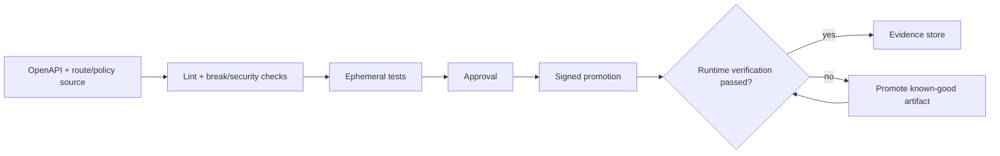

# API operations architecture

Domain source repositories produce reviewed OpenAPI and permitted route/policy intent. Central reusable workflows lint contracts, detect breaking changes, validate policy and security metadata, build immutable artifacts, deploy to an ephemeral gateway, test, approve, promote, verify runtime identity, and store evidence.

Platform-owned admission/organizational policies prevent unsafe listeners, unapproved plugins, public administration, plaintext secrets, route collisions, or missing ownership. Rollback is an explicit tested artifact promotion.

<!-- diagram-source: diagrams/apiops-flow.mmd -->

[Open the canonical Mermaid source](diagrams/apiops-flow.mmd).
