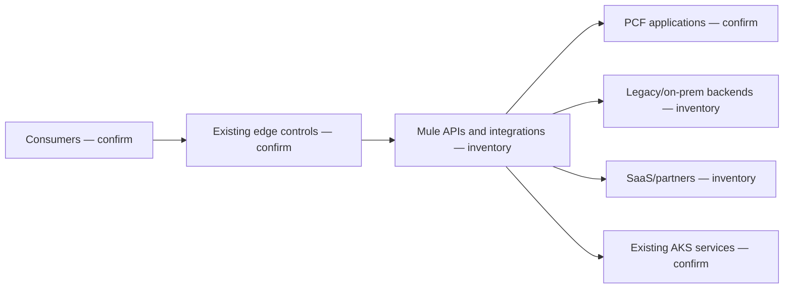

# Current-state conceptual view

The current state is intentionally incomplete until discovery. Consumers are assumed to reach APIs exposed through some combination of edge controls and MuleSoft; Mule may route, transform, orchestrate, message, schedule, connect, and embed business rules; backends may run on PCF, private/legacy infrastructure, AKS, or SaaS.

Treat the view below as an **unvalidated assumption map**, not an inventory or approved current-state architecture. Populate applications, network zones, trust boundaries, identities, stores, shared domains, and support ownership in Workshop 1.

<!-- diagram-source: diagrams/current-state.mmd -->

[Open the canonical Mermaid source](diagrams/current-state.mmd).
