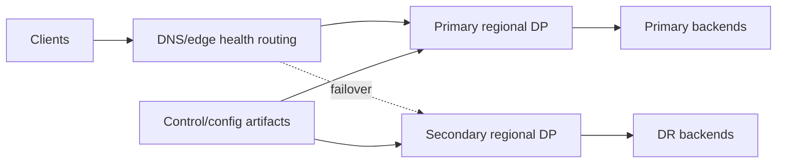

# HA/DR architecture

Data-plane replicas span the required node/zone failure domains. Edge/load balancers remove unhealthy instances. A second regional data-plane group is warm or active according to SLO-derived capacity, and stable DNS/edge routing controls failover. Configuration artifacts and, for self-managed control planes, databases/backups are encrypted and restored in exercises.

Runbooks treat request path, configuration changes, administration, portal, analytics, and audit as separate services with separate recovery objectives.

<!-- diagram-source: diagrams/dr-failover.mmd -->

[Open the canonical Mermaid source](diagrams/dr-failover.mmd).
