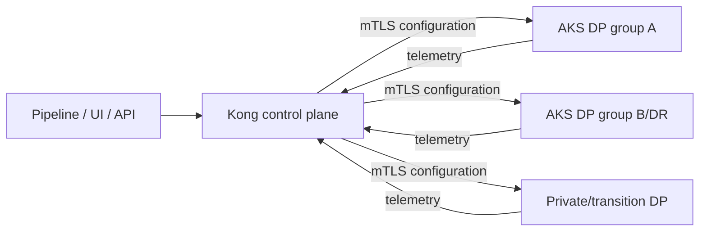
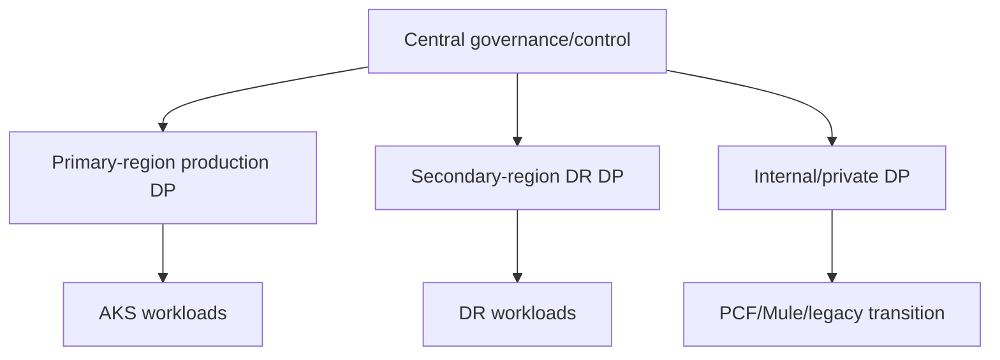

# Kong hybrid reference architecture

- Konnect or self-managed control plane is selected through residency, operations, support, and TCO evidence.
- Data-plane groups are isolated by environment and trust/failure domain, with two or more replicas and no public Admin API.
- CP/DP configuration and telemetry connections use mTLS; data-plane egress is allow-listed.
- Redis is introduced only where global/distributed policy semantics require it and is failure-tested.
- KIC/Gateway API owns Kubernetes routes; decK/Terraform/API ownership is partitioned to avoid conflicting writers.
- Logs, metrics, traces, configuration identity, certificate expiry, and sync health feed enterprise controls.

This candidate view is a **priority-validation hypothesis**, not the logical target or an approved selection.

## Control and data plane

<!-- diagram-source: diagrams/kong-control-data-plane.mmd -->

[Open the canonical control/data-plane source](diagrams/kong-control-data-plane.mmd).

## Illustrative hybrid placement

<!-- diagram-source: diagrams/hybrid-data-plane.mmd -->

[Open the canonical hybrid-placement source](diagrams/hybrid-data-plane.mmd).
