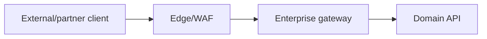
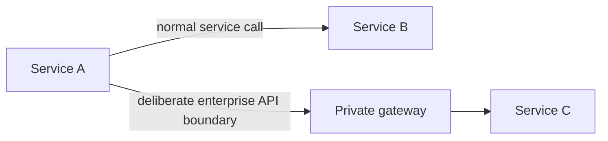

# Network architecture and minimum flows

| Source | Destination | Purpose | Direction | Control |
|---|---|---|---|---|
| Approved clients/edge | Gateway listener | API traffic | Inbound | TLS/WAF/LB allow rules |
| Gateway | Approved backends | Proxied API traffic | Outbound | NetworkPolicy/firewall/TLS |
| Gateway DP | Control plane/config endpoint | Config and heartbeat | Outbound initiated | mTLS/private or allow-listed egress |
| Gateway DP | Telemetry/collector | Metrics logs traces | Outbound | TLS, redaction, backpressure |
| Gateway DP | DNS/time/PKI/identity/secrets | Platform dependencies | Outbound | Least-privilege destinations |
| Operators/pipeline | Control plane | Reviewed administration | Private/controlled | SSO/MFA/workload identity/RBAC |
| Monitoring | Status/metrics | Scrape/health | Private | Service identity and network policy |

Exact IPs, ports, FQDNs, proxies, private endpoints, SNAT, DNS, and route tables are discovery outputs; do not infer them here.

## North–south enterprise boundary

<!-- diagram-source: diagrams/north-south.mmd -->

[Open the canonical north–south source](diagrams/north-south.mmd).

## East–west boundary decision

<!-- diagram-source: diagrams/east-west.mmd -->

[Open the canonical east–west source](diagrams/east-west.mmd).
