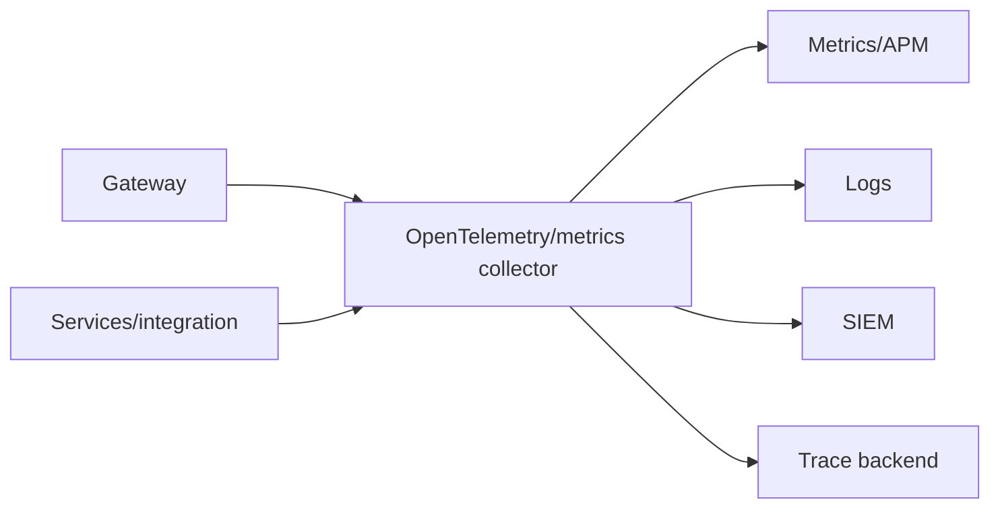

# Observability architecture

Gateway and services emit W3C-correlated metrics, traces, structured logs, and audit events to a local/approved collector. The collector batches, samples, redacts, enriches with stable low-cardinality environment/route/service identity, and fans out to enterprise APM, metrics, log, and SIEM platforms.

Telemetry failure is isolated from the request path and observable via queue/drop signals. Access is tenant-aware; retention and residency follow data classification.

<!-- diagram-source: diagrams/observability-flow.mmd -->

[Open the canonical Mermaid source](diagrams/observability-flow.mmd).
