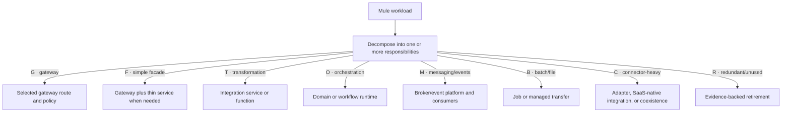

# PCF-to-AKS transition pattern

Stable gateway route → existing PCF/Mule backend → deploy AKS backend → contract/golden tests → optional safe shadow → weighted canary → full cutover → rollback window → dependency validation → remove legacy route/DNS/certificates/monitoring/runtime.

For non-idempotent operations, do not duplicate or shadow live writes without a business-approved isolation and reconciliation design.

## Workload responsibility decomposition

<!-- diagram-source: diagrams/mule-decomposition.mmd -->

[Open the canonical Mermaid source](diagrams/mule-decomposition.mmd).
