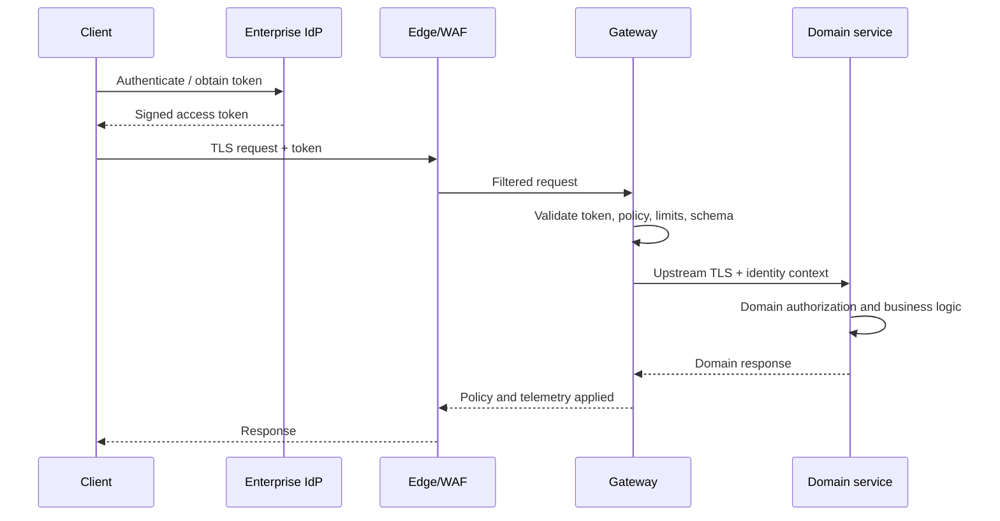

# Security architecture

1. Edge handles DDoS/WAF and public exposure.
2. Enterprise IdP issues tokens; the gateway validates cryptographic and coarse entitlement claims.
3. Domain services make domain authorization decisions.
4. PKI provides client, upstream, and CP/DP certificates with rotation/revocation.
5. Workload identity retrieves approved secrets by reference.
6. Redacted logs, traces, metrics, audit, and alerts flow to enterprise security/operations systems.
7. Build pipelines verify source, dependencies, images, plugins, manifests, approvals, and provenance.

No sensitive payload is logged by default. Management, status, metrics, and debug surfaces use separate private access controls.

<!-- diagram-source: diagrams/security-flow.mmd -->

[Open the canonical Mermaid source](diagrams/security-flow.mmd).
