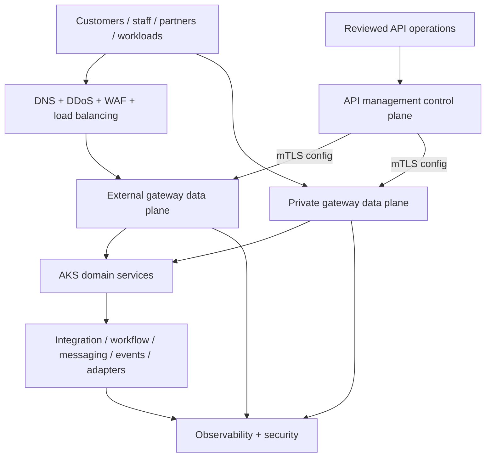

# Target-state architecture

The target separates edge, API management control, gateway data, domain services, integration, and observability/security planes. Data planes are deployed by trust zone/failure domain near workloads; a reviewed control plane distributes configuration without entering the client request path. Stable API contracts decouple consumers from AKS or legacy backend location.

This is the canonical **vendor-neutral logical view**. Candidate-specific physical topologies remain hypotheses until their ownership, locality, persistence, entitlement, support boundary, and data flows are evidenced.

<!-- diagram-source: diagrams/target-state.mmd -->

[Open the canonical Mermaid source](diagrams/target-state.mmd) or the [target-state narrative](../docs/05-target-state-vision.md).
