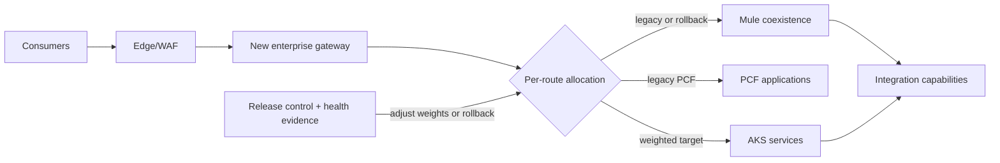

# Transition-state architecture

The selected gateway first becomes a stable facade over existing Mule/PCF backends. Per workload, gateway policies move to the new gateway while transformation/orchestration moves to a service, workflow, messaging, event, job, file-transfer, or adapter capability. Weighted routing then shifts from legacy backends to AKS under contract and reconciliation tests.

Both platforms coexist only through dated migration waves. Each legacy route has an owner, new destination, rollback window, dependency evidence, and decommission criteria.

<!-- diagram-source: diagrams/transition-state.mmd -->

[Open the canonical Mermaid source](diagrams/transition-state.mmd).
