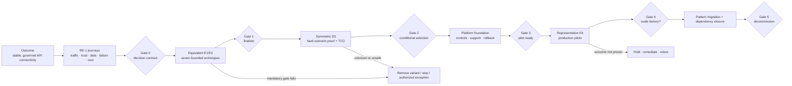
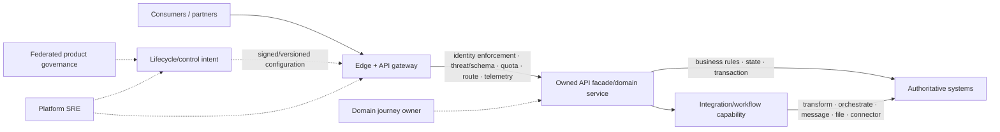

<!-- study-contract: principal -->

# Executive summary: decide the platform through evidence, not momentum

| Field | Value |
|---|---|
| Artifact type | principal-study |
| Decision question | What should the organization authorize now, before it selects or scales an API-management platform? |
| Decision owner | Executive sponsor and API-platform selection decision owner |
| Primary audiences | Executives, vice-presidents, directors, enterprise/platform architects, developers, DevOps, SRE, security, operations, sourcing, and FinOps |
| Scope | Seven bounded API-management deployment archetypes pending Gate-1 option resolution; mixed Mule, PCF, AKS, on-premises, SaaS and partner estate; decision, PoC, pilot, migration and decommission gates |
| Evidence state | Provisional interpretation; selected mechanisms are documented, candidate fit is unobserved, and RE-1 values are scenario assumptions |
| Reference case | RE-1, a synthetic regulated-enterprise case |
| As-of date | 2026-08-17; factual source-review metadata, not a scenario assumption |
| Next gate | Gate 0 decision-contract approval, followed by an equivalent E1/E2 variant screen |

## Provisional answer

Authorize a **stage-gated evidence-closure programme**, not a product selection or migration factory.

The present direction remains deliberately provisional: screen all seven bounded deployment archetypes at equivalent documented-evidence levels and resolve edition, version, topology, entitlement, region and support fields before any scoring. Kong Konnect hybrid and self-managed Kong are **named, low-confidence sequencing hypotheses**, not priority candidates; Azure API Management, Apigee and the MuleSoft baseline receive the same questions, evidence burden and opportunity to advance. No product has yet earned finalist status or an unconditional recommendation.

The strongest current architectural direction is a stable API edge with workload-local data planes where justified, centralized lifecycle/control intent, domain-owned business semantics, and fit-for-purpose integration/workflow/message/file capabilities. The gateway should own transport-facing cross-cutting policy. It should not become the next integration monolith.

Confidence is high that a feature comparison is insufficient, moderate that the proposed gated method exposes the material choices, and low in any product ranking until entitlement, topology, performance, failure, support, staffing, and total-cost evidence exist. The cost of being wrong is not limited to license spend: RE-1 shows plausible duplicate transfers, stale policy after partial disconnection, certificate rollover failures, regional writes against stale data, telemetry-induced request collapse, and stranded Mule/PCF dependencies.

## Decision state, not product theatre

| Executive statement | Evidence state | What it permits now | What it does not permit |
|---|---|---|---|
| A stable gateway facade can decouple API contracts from backend moves | Architecture interpretation | design target and migration hypotheses | assumption that every backend can move without semantic/data work |
| Kong hybrid separates control and request-processing roles and documents cached data-plane operation during disconnection | Documented fact for the stated topology | design of a falsifiable failure test alongside equivalent candidate tests | claim that RE-1 restart, scale-out, config freshness, telemetry, license, or RTO behavior passes |
| APIM supports managed and self-hosted gateway options with materially different responsibility boundaries | Documented fact | option-specific research and Gate-1 resolution | family-level score or assumption that Azure alignment automatically reduces total operations |
| Apigee Hybrid places customer-operated runtime services on Kubernetes while Google operates the management plane | Documented fact | shortlist and operations-cost hypothesis | assumption that locality equals simple operations or proven residency fit |
| Mule DataWeave and runtime responsibilities are not equivalent to gateway policy | Documented mechanism plus interpretation | capability decomposition | lift-and-shift of compound Mule applications into gateway plugins |
| RE-1 provides a coherent workload and failure model | Scenario assumption | symmetric PoC design and sensitivity analysis | current-state sizing, product result, benchmark, or business commitment |

Kong documents that hybrid data planes use cached configuration when the control plane is unavailable and identifies restart, new-node, telemetry-buffer, plugin and license caveats ([Kong hybrid mode](https://developer.konghq.com/gateway/hybrid-mode/)). Microsoft documents both the gateway variants and customer responsibility for self-hosted gateway infrastructure, capacity, network and uptime ([APIM gateway overview](https://learn.microsoft.com/en-us/azure/api-management/api-management-gateways-overview), [self-hosted gateway support policy](https://learn.microsoft.com/en-us/azure/api-management/self-hosted-gateway-support-policies)). Google documents the management/runtime split and customer-operated Message Processor, Synchronizer, Cassandra and MART services in Apigee Hybrid ([Apigee Hybrid architecture](https://docs.cloud.google.com/apigee/docs/hybrid/v1.16/what-is-hybrid)). MuleSoft defines DataWeave as its transformation/expression language ([DataWeave overview](https://docs.mulesoft.com/dataweave/latest/)); this is materially different from a gateway policy catalog.

## Scenario and assumptions: the decision must survive RE-1

Every quantitative value in this section is a **scenario assumption**, not current-state evidence or a benchmark. The complete case is in [RE-1](41-enterprise-reference-case.md).

| RE-1 pressure | Scenario assumption | Why it changes the decision |
|---|---:|---|
| ordinary / busy-hour / short-burst traffic | 4,800 / 13,500 / 22,000 requests/s | topology, counters, identity and autoscale must be tested under different arrival shapes |
| deployable estate | 63 Mule, 47 PCF, 36 AKS, 22 gateway-only and 14 file/batch workloads | migration is a multi-runtime operating problem, not one proxy replacement |
| confirmed transfer objective | 99.99% availability, assumed RTO 5 min, RPO zero after commitment | non-idempotent ambiguity and regional data authority become mandatory gates |
| zone-loss design | busy-hour service with one zone unavailable and 30% remaining headroom | nominal throughput cannot substitute for degraded-state capacity |
| warm-region design | 65% of busy-hour demand immediately and full assumed capacity within 20 min | regional route health must be joined to identity, config and data readiness |
| economics | $9.8 million assumed legacy run cost; $12.4 million transformation envelope | dual run, people, support, telemetry and delayed decommission can dominate license differences |

**Figure EXE-1 — Platform selection occurs only after bounded options, mandatory gates, symmetric proof and representative production evidence.**

- **Depicted scope:** business outcome and RE-1 framing, Gate 0 decision contract, equivalent bounded-archetype screen, Gate 1 option resolution/finalists, E3 proof/TCO, conditional selection, foundation, E4 pilot, factory scale and decommission gates, plus stop/hold paths.
- **Excluded scope:** exact option contracts, gate thresholds and approvers, candidate scores/results, programme schedule, funding amount, migration workload assignments and evidence that any gate has passed.
- **Diagram source, evidence state and as-of:** inline executive synthesis from the repository's [assessment methodology](03-assessment-methodology.md), [RE-1 reference case](41-enterprise-reference-case.md) and [implementation roadmap](36-implementation-roadmap.md); provisional decision model with no E3/E4 selection result; 2026-08-17.
- **Accessible equivalent:** outcome and RE-1 context enter Gate 0, followed by an equivalent seven-archetype E1/E2 screen. Gate 1 resolves exact options and funds symmetric E3/TCO; Gate 2 can conditionally select and fund the platform foundation; Gate 3 admits representative production pilots; Gate 4 permits factory scale; Gate 5 permits decommission. Failed mandatory gates stop/remove/require exception, and unsafe or unproven outcomes hold for remediation/retest.

**Figure interpretation:** Product selection is downstream of a decision contract, bounded-archetype screen, Gate-1 option resolution, hard-scenario proof and cost/support analysis. A pilot is a separate evidence level, while mandatory failure stops optimistic scoring; the diagram does not imply that every candidate reaches every gate.

**Figure limitation:** The flow establishes decision order, not approval status, elapsed time or product preference. Exact gate semantics, evidence thresholds, owners, conditions and organization inputs remain unresolved.

## Mechanism analysis: seven bounded options, not four brands

| Bounded archetype | Control and request plane | Customer operating boundary | Executive question still open |
|---|---|---|---|
| Kong Konnect hybrid | vendor-operated control plane; customer-hosted Kong data planes | data-plane hosting, network, upgrades within support model, local capacity and dependencies | does managed control reduce toil without creating unacceptable connectivity, telemetry, entitlement or support exposure? |
| Self-managed Kong hybrid | customer-operated control plane/database and data planes | full platform lifecycle plus integration with enterprise services | does control/exit flexibility justify higher SRE, database, upgrade and recovery responsibility? |
| Azure APIM managed gateway | Microsoft-operated APIM service/gateway in supported tiers and topologies | service configuration, network integration, backend and consumer operations | does Azure-native managed accountability satisfy locality, workspace, feature, multi-region and portability needs? |
| Azure APIM self-hosted gateway | Azure management/configuration service; customer-hosted containerized gateway | gateway infrastructure, capacity, uptime, network and diagnostics | are self-hosted feature/workspace/support boundaries acceptable for RE-1 hybrid traffic? |
| Apigee X | Google-operated Apigee service/runtime according to selected topology | organization/project/network configuration and API operations | do API product, analytics and governance strengths justify locality, data and commercial trade-offs? |
| Apigee Hybrid | Google management plane; customer-operated Kubernetes runtime plane | Kubernetes plus runtime services, state, upgrades, capacity, backup/recovery and networking | can the team operate Synchronizer, Message Processors, Cassandra and MART at the required service level? |
| MuleSoft current-state baseline | current gateway/integration deployment and control plane | existing runtime, integration, connector, state and support estate | is retention/decomposition economically safer than platform change for each responsibility? |

These rows are research archetypes, not exact deployable variants. An option remains unscorable until edition, entitlement, supported version, region, topology, license, support tier, portal/analytics dependencies, state location, and upgrade responsibility are attached and reviewed at Gate 1. A family-level “Kong vs APIM vs Apigee vs MuleSoft” score would conceal the most consequential differences.

## Architecture stance and responsibility boundary

**Figure EXE-2 — The gateway owns transport-facing policy; domains and integration capabilities retain business state and complex effects.**

- **Depicted scope:** consumers/partners, edge/gateway controls, owned API facade/domain services, authoritative systems, integration/workflow capabilities, lifecycle/control intent, federated governance and platform/domain operating ownership.
- **Excluded scope:** exact candidate topology, identity/network/telemetry implementation, product-specific policy limits, data architecture, region/resilience design, portal lifecycle and migration coexistence.
- **Diagram source, evidence state and as-of:** inline target-boundary synthesis from the [target-state vision](05-target-state-vision.md) and [gateway-versus-integration study](07-api-gateway-vs-integration-runtime.md); architecture hypothesis with no candidate-fit or migration result; 2026-08-17.
- **Accessible equivalent:** consumers reach a gateway that performs identity enforcement, threat/schema controls, quota, routing and telemetry. It calls an owned API/domain service, which owns business rules, state and transactions and may invoke integration/workflow for transformation, orchestration, messaging, file or connector work. Signed/versioned lifecycle intent configures the edge under federated governance, while domain owners and platform SRE retain separate accountability.

**Figure interpretation:** The gateway is a controlled transport/policy boundary, while domains and integration capabilities retain business state and complex process semantics. This separation prevents the migration programme from recreating Mule inside plugins; the figure does not forbid a bounded simple transformation where the selected gateway supports it.

**Figure limitation:** The logical boundary does not prove that a responsibility is stateless/bounded or that a candidate enforces it safely. Product entitlements, resource/failure behavior, domain decomposition and migration evidence can force a different placement.

## Failure modes, counter-hypotheses and counterfactual review

The recommendation changes if any of these counterfactuals is true:

| Counterfactual | Strongest reason it may be right | Evidence that decides it | Executive implication |
|---|---|---|---|
| APIM managed/self-hosted is the better target | Azure alignment, managed accountability, commercial leverage and enterprise identity/network integration outweigh portability or workspace constraints | exact-tier/variant E1/E2 facts, RE-1 hybrid PoC, support and fully allocated TCO | remove Kong priority and condition selection on APIM topology |
| Apigee X/Hybrid is the better target | API-product lifecycle, policy, analytics and governance yield greater value than additional runtime/management dependencies cost | equivalent product/workflow proof, Hybrid operations exercise, data/residency and commercial analysis | prioritize Apigee despite a heavier runtime where justified |
| MuleSoft retention/decomposition is safer | embedded integration semantics, connectors, state, contract position and staffing make change risk or cost exceed benefit | observed responsibility/state inventory, hard-pattern migration pilots and cost sensitivity | retain bounded Mule roles; avoid forced exit date |
| Kong is the better target | locality, CP/DP separation, Kubernetes/declarative operations and simpler runtime provide a measurable advantage | plugin/entitlement validation, disconnected/stale-config proof, performance, support and TCO | conditional selection only for proven topology and tiers |
| no current finalist is acceptable | mandatory residency, security, business-correctness, support or exit requirements conflict with every option | completed mandatory-gate ledger with independently reviewed evidence | stop procurement and redesign requirements/architecture rather than average the failure away |

Failure review is anchored in the [performance/resilience study](32-performance-resilience.md), [operating model](33-operating-model.md), [PCF consolidation](34-pcf-aks-consolidation.md), [Mule migration strategy](35-mule-migration-strategy.md), and executable [real-world scenarios](../poc/real-world-scenarios.md). Mandatory cases include partial control-plane loss and stale restart, ambiguous transfer, certificate rollover, noisy neighbour, telemetry backpressure, schema drift, regional loss with data outside gate, and mixed Mule/PCF/AKS rollback.

## Decision implications

The executive sponsor should authorize the following—and nothing broader yet:

- approve Gate 0 scope, non-goals, bounded archetypes, Gate-1 option-resolution fields, mandatory gates, evidence levels, decision rights, calendar, confidentiality boundary and stop rules;
- fund equivalent official-source research and vendor clarification for all variants before choosing finalists;
- reserve representative environments and cross-functional owners for hard-scenario PoCs, not scripted feature demonstrations;
- require current-state Mule/PCF/AKS, journey, identity/network, service-objective, support and cost calibration before scoring;
- keep platform selection separate from migration-at-scale, which requires representative production pilots and accepted operating ownership;
- protect an exit path: no candidate is selected without configuration/data portability, contract/support clarity, decommission rules and a costed alternative.

## Falsification and proof plan

All quantitative thresholds below are RE-1 **scenario assumptions**.

| Proof ID | Procedure | Measure | Scenario threshold | Evidence artifact | Independent reviewer |
|---|---|---|---|---|---|
| EX-P1 | complete the equivalent E1/E2 screen and Gate-1 option resolution for all bounded archetypes | mandatory dispositions, unknowns, option definition and source freshness | every option has the same required claim/source fields and resolved bill of materials; no failed mandatory gate advances | versioned criterion/option ledger and source archive/reference | independent architecture/evidence reviewer |
| EX-P2 | execute RW-01 through RW-12 for approved finalists | business correctness, active config, SLO, recovery, operability and cost | critical floors and assumed journey gates pass or the production scope is excluded | immutable run bundles, deviations, raw output and reviewer disposition | cross-functional PoC panel |
| EX-P3 | calibrate TCO and support using organization quotes, topology and staffing | five-year cash/operating view, sensitivity, break-even, stranded cost and support gaps | recommendation remains stable across approved low/base/high cases or states the switching variable | restricted quotes plus public sanitized model/checksums | FinOps, sourcing and internal assurance |
| EX-P4 | operate two representative production pilots, including gateway- and integration-dominant workloads | SLO, incidents, change/rollback, reconciliation, on-call load, consumer and cost outcomes | assumed pilot objectives hold through the agreed observation period | E4 pilot record and service-owner acceptance | steering committee with independent risk/SRE review |

## Risks and limitations

- RE-1 traffic, estate, SLO, staffing, schedule and cost values are scenario assumptions; current-state calibration can change shortlist and sequencing.
- Official documentation confirms mechanisms only for stated versions, tiers and topology; entitlement, limits, regions, support and pricing are volatile.
- The named Kong sequencing hypothesis may create anchoring bias. It confers no priority; symmetric questions, environments, tuning, advancement rules and reviewers are mandatory.
- Laboratory evidence has high confidence only inside its tested boundary; it cannot establish production support, human operability or rare long-duration failure behavior.
- The executive summary does not select an event backbone, workflow engine, MFT platform, universal integration runtime or east-west service-mesh strategy.
- A lower platform run cost can be overwhelmed by migration, dual-run, specialist, support, telemetry, network and delayed-decommission cost.

## Open evidence requests

| Request | Owner role | Due gate | Decision impact if unresolved |
|---|---|---|---|
| approved bounded archetypes, option-resolution fields and mandatory requirements | Decision owner, architecture and sourcing | Gate 0 | research may proceed, but do not score an unresolved option or brand family |
| measured journey, traffic, payload, identity, network, RTO/RPO and data-authority inputs | Domain, SRE, security, network and data owners | Gate 0 / PoC design | prohibit capacity, resilience and critical-tier conclusions |
| observed Mule/PCF state, consumer, schedule, support and cost inventory | Integration/application owners and FinOps | Gate 1 | keep migration benefit and duration unknown |
| candidate support boundary, contract remedies, roadmap and exit terms | Sourcing, legal and platform SRE | Gate 2 | prohibit conditional selection |
| production ownership, on-call capacity and pilot workload commitments | Platform product owner and domain directors | Gate 3 | do not admit production pilot or scale factory |

## Next gate

At Gate 0, the executive sponsor and decision owner should approve only the decision contract: outcomes, bounded archetypes, Gate-1 option-resolution fields, RE-1 calibration plan, mandatory gates, scoring/evidence rules, symmetric proof scope, confidentiality boundary, funding, owners, stop conditions and meeting calendar. Product preference, procurement commitment and migration volume remain out of scope until later gates close their evidence.

The formal recommendation mechanics and excluded decisions remain governed by the [principal methodology and decision-assurance review](../reports/methodology-review.md).
