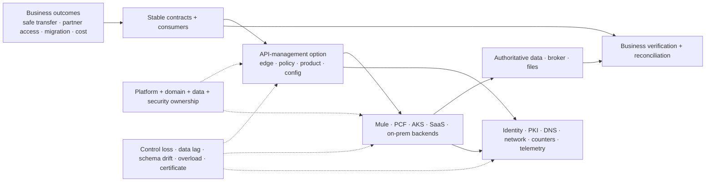

<!-- study-contract: principal -->

# Problem statement: choose an API platform without confusing it with integration modernization

| Field | Value |
|---|---|
| Artifact type | principal-study |
| Decision question | What target API-management and integration architecture should support hybrid workloads while safely reducing legacy runtime dependency? |
| Decision owner | Enterprise architecture decision owner with the API-platform sponsor and business service owners |
| Primary audiences | Executives, platform/application directors, enterprise and solution architects, developers, DevOps, SRE, security, operations, data, sourcing, and FinOps |
| Scope | North-south and selected internal APIs; seven bounded API-management archetypes pending Gate-1 option resolution; stable facades over Mule, PCF, AKS, on-premises, SaaS and partner systems; transition, operations, recovery and cost |
| Evidence state | Problem framing and interpretation; product fit/current state are unobserved, and RE-1 quantitative values are scenario assumptions |
| Reference case | RE-1, a synthetic regulated-enterprise case |
| As-of date | 2026-08-17; factual source-review metadata, not a scenario assumption |
| Next gate | Gate 0 approves the decision boundary, non-goals, required inputs and mandatory outcome tests |

## Provisional answer

Adopt a **two-part target direction**, while keeping the product selection open:

- an API-management layer for stable consumer contracts, transport-facing policy, product lifecycle and workload-appropriate request processing; and
- explicitly owned domain/integration capabilities for business logic, complex transformation, orchestration, state, messaging, batch, file and connectors.

The platform question is therefore not “which gateway replaces Mule?” It is “which exact API-management deployment option fits the required control, locality, resilience and operating model, and where does each incumbent integration responsibility move?” Confidence is high in this separation of concerns, moderate in the hybrid/stable-facade direction, and low in any product or migration disposition before evidence. If the problem is framed too narrowly, the organization can select an excellent proxy and still fail its transfer, settlement, partner, workflow or decommission outcomes.

## Decision boundary

### In scope

- North-south enterprise APIs and selected internal traffic where product governance or cross-boundary policy creates value.
- Kong Konnect hybrid, self-managed Kong, APIM managed gateway, APIM self-hosted gateway, Apigee X, Apigee Hybrid, and the MuleSoft current-state baseline as separate bounded archetypes; none becomes an exact deployable variant until its Gate-1 bill of materials closes.
- Identity, policy, network, data residency, resilience, observability, API lifecycle, developer experience, operations, support, portability, migration and cost.
- Stable facades over AKS, PCF, Mule, on-premises, SaaS and partner backends during bounded coexistence.
- Gateway/control-plane placement, state and configuration authority, support ownership, failure behavior, migration reversibility and legacy dependency closure.

### Out of scope for product substitution

- Replacing application business logic with gateway policy.
- Selecting an event backbone, workflow engine, managed file transfer platform, service mesh or universal integration runtime solely from gateway results.
- Assuming every east-west call traverses the enterprise gateway.
- Treating Kubernetes support, hybrid branding or a portal checklist as proof of production fit.
- Production capacity or business-case decisions based on synthetic PoC performance or list price.

Microsoft describes an API gateway as the component that proxies requests, applies policy and collects telemetry ([APIM gateway overview](https://learn.microsoft.com/en-us/azure/api-management/api-management-gateways-overview)). MuleSoft describes DataWeave as a language for transformation and as the Mule runtime expression language ([DataWeave overview](https://docs.mulesoft.com/dataweave/latest/)). Those documented mechanisms reinforce the problem boundary: gateway and integration responsibilities overlap at simple mediation but are not interchangeable.

## Scenario and assumptions: the problem under RE-1

Every quantitative value below is a **scenario assumption**. It is neither current-state fact nor product evidence. See the full [RE-1 reference case](41-enterprise-reference-case.md).

| Journey or constraint | Scenario assumption | Problem hidden by a simple gateway comparison |
|---|---:|---|
| J-01 confirmed transfer | 528 requests/s at ordinary mix; assumed RPO zero after commitment | a lost response can create an ambiguous business outcome that proxy retries cannot safely solve |
| J-02 account summary | 38% of requests; freshness bounded to 2 min | a healthy gateway can serve stale regional/cache data |
| J-03 partner payment | 24 partner identities/quotas with mixed certificate trust | policy support alone does not prove certificate rollover or tenant isolation |
| J-04 onboarding | assumed 1.5 MB p99 payload and CPU-heavy transform | shared AKS/gateway resources can create noisy-neighbour failure |
| J-05 settlement file | zero accepted-record loss and assumed 2 h recovery | schedules, locks, watermarks and replay live outside ordinary HTTP policy |
| J-06 configuration | assumed propagation p95 within 5 min | desired control-plane state can diverge from active data-plane state |
| mixed estate | 63 Mule, 47 PCF, 36 AKS and additional gateway/file workloads | routing, state, identity, operations and cost move on different timelines |

## Mechanism analysis: why the decision is coupled

**Figure PROB-1 — API-management choice is coupled to backend/data truth, enterprise controls and cross-team ownership.**

- **Depicted scope:** business outcomes, stable contracts/consumers, API-management boundary, mixed runtimes/backends, authoritative data/broker/files, identity/PKI/DNS/network/counters/telemetry, platform/domain/data/security ownership, failure injection and independent business verification.
- **Excluded scope:** exact product topology, option/version/entitlement, physical network/data flows, responsibility RACI, numeric acceptance thresholds and any candidate score or result.
- **Diagram source, evidence state and as-of:** inline problem-model synthesis from synthetic [RE-1](41-enterprise-reference-case.md) and the decision layers in this study; architecture/decision hypothesis, not an observed estate or selection result; 2026-08-17.
- **Accessible equivalent:** stable consumer contracts pass through an API-management option to Mule, PCF, AKS, SaaS and on-premises backends and then authoritative data/broker/file systems. Gateway and runtimes also depend on enterprise identity, PKI, DNS, network, counters and telemetry. Ownership constrains both layers; failures can strike each; business verification reconciles consumer intent with authoritative outcome rather than trusting gateway health.

**Figure interpretation:** The product decision is coupled to backend/data truth, enterprise control services and ownership. A gateway can be locally healthy while the consumer journey is wrong; the independent business-verification boundary prevents component uptime from becoming the success definition.

**Figure limitation:** The model shows coupling, not causal frequency, current-state confirmation or the best target. Discovery must establish actual dependencies, owners and failure behavior before requirements, costs or candidates can be accepted.

The decision decomposes into linked but separately gated questions:

| Decision layer | Exact question | Accountable role | Non-fit condition |
|---|---|---|---|
| consumer/product | Which contracts, consumers, tiers and lifecycle outcomes need shared management? | Domain API product owner | no consumer/product value or no accountable owner |
| policy/runtime | Where should each request data plane run, and which supported policies execute there? | Platform product owner and security | mandatory policy/topology/entitlement conflict |
| control/config | Who owns desired state, promotion, attestation, rollback and disconnection? | Platform engineering/SRE | active configuration cannot be established or recovered |
| identity/network | Which issuers, certificates, secrets, private paths, DNS, egress and residency boundaries apply? | IAM/PKI/network/security | fail-open risk or unsupported trust/locality |
| business integration | Which transformations, workflows, messages, files, connectors and state move where? | Domain/integration owner | gateway overreach or unowned target responsibility |
| resilience/data | Which state is authoritative across zone/region failure and ambiguous outcomes? | Data authority and service owner | no singular writer, RPO or reconciliation path |
| operating model | Who builds, patches, scales, diagnoses, supports and pays for each plane? | Platform product owner/directors | unfunded on-call or support gap |
| transition/exit | How do traffic and responsibility move reversibly, and what proves dependency zero? | Programme/service owners and sourcing | rollback only covers code or legacy cost cannot close |

Kong’s official topology documentation distinguishes control and data-plane roles and cached operation ([Kong deployment topologies](https://developer.konghq.com/gateway/deployment-topologies/)). Google documents a different split in Apigee Hybrid, where customer-operated Kubernetes runtime services include stateful Cassandra as well as request processors ([Apigee Hybrid architecture](https://docs.cloud.google.com/apigee/docs/hybrid/v1.16/what-is-hybrid)). Microsoft documents that a self-hosted APIM gateway places infrastructure, network, capacity and uptime responsibility with the customer ([support policy](https://learn.microsoft.com/en-us/azure/api-management/self-hosted-gateway-support-policies)). “Hybrid” therefore does not identify one operating model.

## Failure modes and problem consequences

| Failure or change | Naive problem statement | Real decision question | Consequence if omitted |
|---|---|---|---|
| partial control-plane interruption | does traffic continue? | which existing/restarted/new replicas serve which config, and how are changes/revocation/telemetry reconciled? | stale policy or empty/stale replica admitted |
| non-idempotent timeout | does gateway retry? | where is durable business-key reservation/outcome truth and who reconciles commit ambiguity? | duplicate or unresolved transfer |
| certificate rollover | can product use TLS/mTLS? | which chain is actually served/accepted across old/new clients, connection pools and regions? | partner outage despite successful certificate issuance |
| regional loss | is there multi-region support? | are config, identity, capacity, writer authority and data lag jointly inside the journey gate? | writes routed to stale/non-authoritative data |
| noisy neighbour | can Kubernetes autoscale? | which CPU, memory, worker, counter, connection or backend pool couples tenants/journeys? | critical traffic starved by onboarding/batch |
| telemetry backpressure | does platform export logs/traces? | are queues bounded, request resources isolated and audit gaps explicit? | observability failure becomes availability failure |
| schema drift | does OpenAPI validate? | do semantic contracts cover null, enum, decimal, time, error, order and duplicate behavior? | syntactically valid business corruption |
| mixed migration | can traffic be weighted? | can route, code, config, schema, data, message and external effect be recovered separately? | rollback restores code but not correctness |

HTTP explicitly warns against automatic retry of a non-idempotent request without safe application semantics or knowledge that the original was not applied ([RFC 9110](https://www.rfc-editor.org/rfc/rfc9110.html)). This is why business idempotency and reconciliation sit outside the generic gateway decision.

## Counter-hypotheses and alternative problem frames

| Alternative frame | When it could be correct | What would falsify the current frame | Decision change |
|---|---|---|---|
| retain and optimize current MuleSoft platform | migration/state/connector risk exceeds benefit and current contracts/support remain viable | decomposition pilots show no safe economic exit | treat gateway modernization as bounded improvement, not Mule retirement |
| use Azure-native managed APIM broadly | locality/residency can be met and managed accountability materially lowers operations/TCO | self-hosted/managed constraints fail a mandatory journey or delegation need | choose managed-first target and narrow portability objective |
| use no central enterprise gateway | domains already meet consistent security/product/evidence outcomes and central layer adds only latency/toil | federated controls prove compliance, discoverability and incident interoperability | replace platform programme with shared standards/tooling |
| route all east-west traffic through gateway | policy, product, isolation or audit value exceeds latency/availability coupling | service-to-service load/failure tests show unacceptable central dependency | keep only intentional boundaries at gateway |
| replace Mule flow-for-flow in one new integration runtime | state and behavior are cohesive, target supported and ownership simpler | responsibility decomposition shows no benefit or safe split | choose application-level migration for that bounded class |

The present framing is invalid if discovery shows that APIs are a minor/non-critical part of the estate, hybrid locality is not required, current integration responsibilities cannot be separated, or the organization will not fund an enduring platform and domain operating model.

## Decision implications

- Define bounded deployment archetypes, resolve their edition/version/topology/entitlement/support fields, and score only the resulting exact options—not brand families.
- Separate gateway-platform selection from each integration responsibility’s target decision.
- Calibrate RE-1 against real journeys before setting mandatory thresholds, capacity or business value.
- Require consumer-visible business correctness, active configuration, recovery, support and cost—not component availability—as decision outcomes.
- Make coexistence and exit architecture part of selection; a platform that works only after the estate is already modernized does not solve the transition problem.
- Stop any candidate at a failed/unknown mandatory gate unless the authorized decision body records a bounded exception and excluded production scope.

## Success definition

A defensible decision includes:

- traceable business outcomes, requirements, bounded option IDs, closed deployable definitions before scoring, evidence states, owners and unknowns;
- current official documentation plus repeatable, symmetric hard-scenario PoC evidence for finalists;
- a sensitivity-tested TCO/support/staffing model using organization inputs rather than list price;
- target and transition architectures with explicit identity, network, config, state, telemetry, rollback and regional behavior;
- actionable Mule responsibility decomposition and PCF/AKS migration patterns with business reconciliation;
- a funded federated operating model and production-pilot plan;
- reversible waves and a decommission ledger that closes technical, operational, recovery and commercial dependencies.

## Falsification and proof plan

All quantitative thresholds are RE-1 **scenario assumptions** until calibrated.

| Proof ID | Procedure | Measure | Scenario threshold | Evidence artifact | Independent reviewer |
|---|---|---|---|---|---|
| PROB-P1 | map representative real journeys and estate assets to the decision layers | coverage, unowned dependencies and materially missing workload classes | every critical journey has business/data/platform ownership and an explicit target question | journey maps, inventory reconciliation and decision log | enterprise architecture/internal assurance |
| PROB-P2 | test one gateway-dominant and one integration-dominant path through failures | business outcomes, config/state truth, recovery and operator decisions | assumed SLO/RTO/RPO and reconciliation gates close | raw PoC bundle and cross-functional disposition | SRE, domain and data reviewers |
| PROB-P3 | run alternative-frame workshops and cost sensitivity | rank/architecture changes under retain, managed-first, hybrid-first and no-central-gateway cases | preferred frame remains stable or exposes the switching condition | scenario model, dissent and decision record | independent facilitator plus FinOps |
| PROB-P4 | pilot target/transition operations with real owners | change, incident, rollback, on-call load and consumer outcome | ownership/service acceptance and assumed pilot objectives pass | production-pilot bundle and service acceptance | steering/risk reviewer |

## Risks and limitations

- The problem boundary can still be too broad for one procurement or too narrow for specialized event, mainframe, streaming, agent or file workloads.
- RE-1 values are synthetic; real inventory, locality, traffic, service objectives and contracts can change the decision materially.
- Product topology, support and entitlements are volatile and cannot be inferred from generic capability names.
- A stable facade can hide backend migration but cannot remove consumer semantic, data or operational coupling by itself.
- An architecture direction is not proof that the organization has the skills, authority, budget or support model to operate it.

## Open evidence requests

| Request | Owner role | Due gate | Decision impact if unresolved |
|---|---|---|---|
| approved business outcomes, critical journeys and impact tolerances | Executive/business service owners | Gate 0 | problem remains technology-led; do not select |
| observed API/Mule/PCF/AKS/consumer/state/schedule inventory | Enterprise, platform, application and integration owners | Gate 0/1 | scope, migration and value remain unknown |
| identity, network, residency, PKI, data and recovery constraints | Security/IAM/network/data/BCM owners | Gate 1 | mandatory variant fit cannot be determined |
| exact candidate variants, entitlements, support and commercial terms | Architecture and sourcing | Gate 1/2 | prohibit family score and TCO ranking |
| funded platform/domain operating capacity | Platform product owner and domain directors | Gate 3 | no production pilot or factory scale |

## Next gate

Gate 0 should approve this problem statement only when the decision owner confirms the business outcomes, exact in/out boundary, candidate variants, RE-1 calibration plan, mandatory non-fit conditions, current-state discovery package, evidence/scoring rules, owner capacity and decisions explicitly deferred to other programmes. Approval authorizes assessment; it does not authorize a product, production design or Mule/PCF retirement date.
