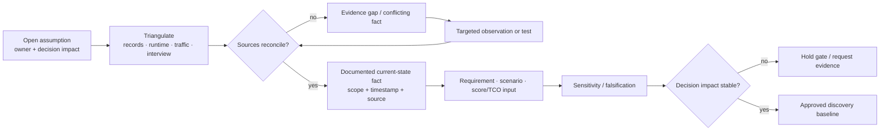

<!-- study-contract: principal -->

# Current-state assumptions and discovery contract

| Field | Value |
|---|---|
| Artifact type | principal-study |
| Decision question | Which assumed facts must be confirmed before the platform can be screened, tested, sized, costed or recommended? |
| Decision owner | Assessment decision owner with enterprise architecture and current-service owners |
| Primary audiences | Executives, directors, enterprise/platform architects, integration and application teams, developers, DevOps, SRE, security, network, data, sourcing, and FinOps |
| Scope | Current API, Mule, PCF, AKS, identity, network, PKI, data, telemetry, delivery, support, cost and ownership inputs needed by the seven-variant assessment |
| Evidence state | Open assumptions and evidence requests; no row is organization fact until validated |
| Reference case | RE-1, a synthetic calibration case, not a current-state description |
| As-of date | 2026-08-17; factual source-review metadata, not a scenario assumption |
| Next gate | Gate 0 accepts a reconciled discovery baseline and explicitly retains, replaces or rejects each material assumption |

## Provisional answer

The current state is **not yet decision-grade**. Every row below is an unvalidated organization assumption, not evidence. The assessment may use RE-1 to design interviews, models and tests, but it cannot use RE-1 values to fill gaps in the real estate.

The highest-risk unknowns are not product features. They are the actual Mule responsibility/state inventory, consumer-visible journeys and service objectives, network/identity/PKI constraints, control/data residency, platform operating capacity, and the cost/support dependencies that remain after traffic moves. Confidence is high that these inputs can change the preferred topology and migration order; confidence in their present values is intentionally zero. The consequence of treating them as facts is false precision in score, capacity, TCO and roadmap.

## Scenario and assumptions: RE-1 is a probe, not the baseline

Every quantitative RE-1 value is a **scenario assumption**. It is used to ask whether discovery can explain a complex estate, not to assert that the organization has the same inventory or traffic.

| RE-1 probe | Scenario assumption | Real input required | Decision changed by variance |
|---|---:|---|---|
| mixed runtime estate | 63 Mule, 47 PCF and 36 AKS workloads | reconciled deployable workload, trigger, route, state and owner inventory | migration factory patterns, staffing, license exit and timeline |
| platform traffic | 4,800 ordinary / 13,500 busy / 22,000 burst requests/s | journey-level arrival, payload, connection, seasonality, retry and growth data | topology, capacity, rate state, support and cost |
| critical transfer | assumed 99.99% availability and RPO zero after commitment | approved good-event, SLO, impact tolerance, RTO/RPO and data authority | mandatory resilience gate and regional design |
| partner trust | 24 partner identities with mixed certificate behavior | issuer/client/certificate/trust/allowlist inventory and rollover ownership | policy topology, PKI pattern and production proof |
| economics | $9.8 million assumed legacy run cost and $12.4 million programme envelope | contracts, infrastructure, people, support, telemetry, network, dual-run and avoided cost | shortlist, break-even, sequencing and retain/replace decision |

If measured values differ, the assessment updates its scenario and sensitivity model. It never retrofits “evidence” to preserve a preferred candidate.

## Assumption register

The original canonical assumptions are preserved below. **Open** means unknown, not implicitly true.

| ID | Unvalidated assumption | Why it matters | Minimum validation evidence | Validation owner | Decision if false | Status |
|---|---|---|---|---|---|---|
| A-01 | PCF means Pivotal Cloud Foundry. | Defines migration tooling, route/service inventory and platform terminology. | foundation/version/operator record plus application route/service-binding export | Platform architecture | redefine source-platform archetype and migration patterns | Open |
| A-02 | AKS is the strategic container platform. | Drives target data-plane placement, workload operations and skill model. | approved cloud/container strategy, supported versions, regions, landing-zone and funding record | Cloud platform | compare target runtimes and avoid AKS-specific selection bias | Open |
| A-03 | MuleSoft performs both gateway and integration-runtime duties. | Determines decomposition scope and whether gateway replacement removes meaningful runtime dependency. | observed APIs/policies/flows/triggers/DataWeave/connectors/state/schedules mapped to runtime deployments | Integration team | narrow migration to the responsibilities actually present | Open |
| A-04 | Azure is the primary cloud but platform neutrality is valuable. | Changes the value placed on native integration, locality, managed accountability and portability. | approved cloud placement principles, workload pipeline and quantified portability/exit outcomes | Enterprise architecture | reweight deployment locality and native-service criteria | Open |
| A-05 | Some request paths must stay within approved regional or private network boundaries. | Constrains control, request, telemetry, analytics and support paths. | data-flow classification, residency/control decision, network diagram and approved exception rules | Security/privacy | remove or redefine locality gate; do not preserve an invented constraint | Open |
| A-06 | Entra ID is a primary workforce/workload identity provider. | Shapes OAuth/OIDC, workload identity, administrative access and token/key tests. | issuer/tenant/application inventory, trust standards and production authentication flows | IAM | evaluate actual issuers/protocols and candidate integrations | Open |
| A-07 | Central standards and federated domain ownership are desired. | Drives tenancy, workspaces/control planes, delegation, funding and incident accountability. | approved operating principles plus named role/capacity and service ownership | API governance | choose a different tenancy/operating model and re-evaluate toil/control risk | Open |
| A-08 | Mule retirement will be phased, not a big bang. | Requires coexistence, strangler routing, dual support, state transfer and license overlap. | programme constraint, contract dates, workload dependencies and business tolerance | Programme leadership | model retain, replace or accelerated exit explicitly | Open |
| A-09 | Existing PCF routes can be reached privately from gateway data planes. | Affects transition feasibility, latency, DNS, egress and certificate design. | path-level DNS/firewall/proxy/route/MTU/TLS test from each proposed location | Network | add network remediation, alternate facade or reject topology |
| A-10 | **Scenario assumption:** production requires at least two failure domains and tested DR. | Sets topology, quota, support, RTO/RPO and cost. | approved journey impact tolerances, platform/data recovery architecture and game-day records | Resilience | set topology per approved journey rather than retaining an arbitrary number | Open |

## Mechanism analysis: turn assumptions into controlled facts

**Figure DISC-1 — An assumption becomes a decision input only after triangulation, conflict handling, observation and sensitivity testing.**

- **Depicted scope:** open assumption with owner/impact, triangulation across records/runtime/traffic/interview, source reconciliation, documented fact or evidence gap, targeted observation, requirement/model input, sensitivity/falsification and gate/baseline decision.
- **Excluded scope:** source-system implementation, evidence quality weights, current-state findings, approval authority, confidentiality handling and any claim that the listed assumptions have been validated.
- **Diagram source, evidence state and as-of:** inline discovery-control synthesis from this study's assumption register and evidence hierarchy; proposed method with current assumptions still open unless separately evidenced; 2026-08-17.
- **Accessible equivalent:** an owned assumption is triangulated against records, runtime, traffic and interviews. Reconciled sources create a scoped/timestamped current-state fact; conflicts remain a gap and trigger targeted observation until resolved. Facts feed requirements, scenarios, scoring or TCO, then sensitivity/falsification determines whether the gate must hold or an approved discovery baseline is stable.

**Figure interpretation:** An interview answer becomes a decision input only after it is bounded, triangulated and sensitive to contrary evidence. Conflicts remain visible rather than being resolved by the loudest source; the diagram does not require every low-impact fact to receive the same discovery effort.

**Figure limitation:** The workflow does not define the sufficiency threshold for every fact or guarantee that sources are independent/current. Decision owners must approve materiality, corroboration, confidentiality and residual uncertainty.

### Source reconciliation hierarchy

| Source | Useful for | Failure mode | Required corroboration |
|---|---|---|---|
| platform/runtime export | deployed apps, routes, versions, bindings, config and state clues | dormant/recovery paths absent from recent traffic; dynamic values hidden | service owner plus traffic/schedule/state observation |
| traffic/telemetry | active consumers, volume, latency, errors and dependencies | sampling, retention and telemetry failure hide behavior | raw gateway/backend/data records and known gap statement |
| source/config scan | flows, plugins, transformations, endpoints and schemas | dead code and external/dynamic config create false positives/negatives | runtime trace and owner review |
| CMDB/catalog/contract | ownership, criticality, cost, support and lifecycle intent | stale records and package-level aggregation | observed runtime/finance/support evidence |
| workshop/interview | undocumented semantics, manual operations and recovery | recall, incentive and terminology bias | artifacts, observation or controlled test |
| commercial record | entitlement, renewal, support and cost | allocation and confidential discounts obscure unit economics | sourcing/finance validation and sensitivity |

## Required discovery inputs

### Workload and consumer truth

- Mule applications, APIs, flows/subflows, policies, DataWeave, connectors, schedules, queues, Object Store, files, dynamic endpoints, credentials, certificates, owners, runtime/agent versions and support dates.
- PCF foundations, orgs/spaces, routes, service bindings, schedulers, network policies, certificates, buildpacks and direct consumers.
- AKS clusters, regions/zones, namespaces, node pools, gateways/ingress, identities, secrets, network paths, quotas, versions and ownership.
- API consumers, products, classifications, contract versions, peak/average arrival, payload/connection/protocol mix, timeouts, retries, latency/error budgets, RTO/RPO and seasonality.

MuleSoft documents DataWeave as transformation/expression behavior ([DataWeave overview](https://docs.mulesoft.com/dataweave/latest/)) and documents cluster/Object Store/VM queue behaviors that vary with topology ([Mule HA clusters](https://docs.mulesoft.com/mule-runtime/latest/mule-high-availability-ha-clusters)). Therefore the inventory includes runtime state and triggers rather than only API specifications.

### Trust, network and data truth

- WAF, load balancer, DNS, PKI, firewall, private connectivity, egress/NAT, proxy, SIEM/APM, telemetry collectors, secrets and identity standards.
- Customer, partner, workforce and workload issuers; token/key/certificate lifetimes; mTLS trust/pinning; rotation/revocation; privileged and break-glass access.
- Data classification, writer authority, replication, cache freshness, audit/retention, privacy, residency, threat model and third-party/support access.
- Zone/region failure domains, approved recovery/degraded behavior, dependency RTO/RPO and tested runbooks.

Kubernetes documents eventual propagation of mounted Secret updates and the absence of automated update for `subPath` mounts ([Kubernetes Secrets](https://kubernetes.io/docs/concepts/configuration/secret/)). A certificate inventory must therefore record how the serving process reloads material, not only where a Secret exists.

### Delivery, operating and economic truth

- delivery workflow, environments, promotion authority, segregation of duties, active-config verification, emergency change, rollback/forward-fix, reconciliation and evidence requirements;
- service catalog, on-call/accountability, incident command, vendor escalation, capacity, patch/upgrade, backup/restore and decommission responsibility;
- current and forecast Mule/PCF/API-management/cloud/network/telemetry costs, people and support; candidate quotes and entitlements; dual-run and migration cost; cost actually removed at dependency zero.

Never substitute public list price, infrastructure-only cost, or a synthetic RE-1 value for organization-specific TCO.

## Failure modes in discovery

| Discovery failure | Apparent conclusion | Hidden consequence | Control |
|---|---|---|---|
| inventory counts applications only | migration looks small and homogeneous | hidden schedules, Object Store, VM queue, file and shared-domain dependency | trigger/state/dependency decomposition plus runtime observation |
| access logs define “all consumers” | dormant API appears unused | month-end, partner, DR or recovery traffic is deleted | join traffic with catalog, schedules, contracts and recovery runbooks |
| desired config equals active config | platform control appears consistent | stale or disconnected data plane serves old policy | per-replica active epoch/digest and failure test |
| certificate repository equals served trust | rotation looks automated | process/connection/partner still uses old chain | synthetic handshake and actual served-chain inventory |
| gateway success defines business success | SLO appears healthy | duplicate, stale, lost or unresolved business outcome | independent business/data reconciliation |
| current invoice defines run cost | replacement appears inexpensive | people, support, telemetry, network, dual-run and stranded contract omitted | fully allocated model and sensitivity |
| owner field defines operating capacity | service appears supported | named team has no funded on-call/change capacity | role-to-capacity and incident exercise |

## Counter-hypotheses and non-fit conditions

The discovery programme may be disproportionate if the estate is small, non-critical and already accurately inventoried. Conversely, the register may be materially incomplete for streaming, mainframe, agent, mobile/offline or third-party workloads. The provisional answer is falsified if independent runtime, finance and ownership sources reconcile quickly with low uncertainty and no scenario-sensitive unknown. This discovery contract is non-fit if it becomes an open-ended documentation project rather than risk-prioritized evidence for gates.

## Decision implications

- No product criterion or cost input receives an “evidenced” score from an open A-row.
- Assumption validation is prioritized by mandatory-gate and sensitivity impact, not documentation volume.
- Conflicting sources create an evidence gap with an owner; they are not silently averaged.
- RE-1 remains synthetic until each copied value is replaced or explicitly retained as a scenario assumption.
- Gate 0 can approve a bounded baseline with known gaps, but must state which later decisions those gaps block.

## Falsification and proof plan

Quantitative sampling thresholds below are **scenario assumptions** until the decision owner calibrates them.

| Proof ID | Procedure | Measure | Scenario threshold | Evidence artifact | Independent reviewer |
|---|---|---|---|---|---|
| DISC-P1 | reconcile platform exports, traffic, CMDB/catalog, source/config and owner records | matched/unmatched workloads, routes, triggers, state and consumers | every critical/high-consequence item has an owner and disposition; no unexplained mandatory dependency | versioned inventory, query/export hashes and reconciliation log | enterprise architecture/internal assurance |
| DISC-P2 | trace J-01 through J-06 across identity, network, runtime, data and telemetry | observed components, writer/data truth, SLO and gap | every critical journey maps to one good-event definition and data authority | sanitized journey maps, trace references and approvals | business/data/risk owners |
| DISC-P3 | exercise certificate, config and regional runbooks for a representative path | active/served state, operator decision and recovery | assumed RE-1 control/recovery gates are calibrated or rejected explicitly | game-day/test record and decision log | security/SRE reviewer |
| DISC-P4 | reconcile finance, contracts, infrastructure, people and support | allocated run cost, avoided cost, dual run and sensitivity | no material cost pool unowned; recommendation switching variables identified | restricted source pack plus sanitized model/checksums | FinOps/sourcing/internal assurance |

## Risks and limitations

- Discovery is a snapshot; versions, traffic, consumers, certificates, support and contracts continue to change.
- Public repository records must remain sanitized and cannot contain credentials, personal owner mappings, vulnerabilities, private URLs, raw customer payloads or NDA detail.
- Automated discovery can overcount dead config and undercount dynamic/manual behavior.
- Workshops can normalize unsafe workarounds; observation and business/data verification are needed.
- A complete inventory does not prove platform fit, performance, resilience, operability or migration success.

## Open evidence requests

| Request | Owner role | Due gate | Decision impact if unresolved |
|---|---|---|---|
| disposition and source bundle for A-01 through A-10 | Assigned validation owners | Gate 0 | keep dependent criteria unknown and block affected gate |
| high-consequence workload/consumer/state/trigger sample | Platform, integration and domain owners | Gate 0/PoC design | prohibit representative workload selection |
| identity/network/PKI/data/residency/recovery decisions | Security, IAM, network, data and resilience owners | Gate 1 | mandatory hybrid/security fit unknown |
| fully allocated current/target cost and contract baseline | FinOps and sourcing | Gate 2 | prohibit economic recommendation |

## Next gate

Gate 0 accepts the discovery baseline only when each A-row has a retained/rejected/replaced disposition, source scope/date, accountable role and decision impact; critical journeys and hidden state/triggers reconcile across independent sources; sensitive material has a restricted reference; and remaining gaps are explicitly tied to later holds. Use [repository templates](../templates/) and the [Mule inventory template](../mule-migration/inventory-template.csv) to collect structured inputs without presenting them as facts prematurely.
