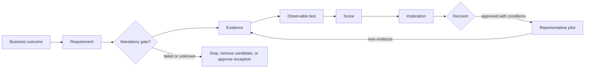

# Assessment methodology

## Sequence

1. **Frame:** confirm outcomes, scope, constraints, mandatory gates, and evidence owners.
2. **Discover:** inventory the present estate and representative workloads.
3. **Research:** record official claims with version, access date, and interpretation.
4. **Test:** execute equivalent scenarios; keep screenshots/logs/configuration sanitized and reproducible.
5. **Score:** fail gates first; score only evidenced criteria; calculate coverage and sensitivity.
6. **Decide:** document recommendation, dissent, exceptions, conditions, and exit options in an ADR.
7. **Pilot:** migrate low-risk but representative workloads before scaling a factory.

## Decision-assurance chain

Each conclusion must preserve the full chain below. A missing link returns the criterion to `unknown`; a failed or unknown mandatory gate stops the recommendation unless the authorized decision body records a time-bounded exception.

## Evidence levels

| Level | Evidence | Permitted score confidence |
|---|---|---|
| E0 | Marketing or assertion only | Unknown |
| E1 | Current official documentation | Low–medium |
| E2 | Vendor answer with named version/contract term | Medium |
| E3 | Repeatable lab execution with artifacts | High for tested scope |
| E4 | Representative enterprise pilot under expected controls/load | Highest |

## Scoring guardrails

- Mandatory criteria are pass/fail/unknown and are not averaged away.
- Weighted criteria use 0–5 only after evidence is attached.
- `Unknown` is not zero; it is excluded from normalized scoring and reported as an evidence gap.
- A candidate cannot be recommended when a mandatory criterion is failed or when evidence coverage is below the steering committee threshold.
- Run sensitivity at ±20% for category weights and record rank instability.
- Product variants are scored separately; family-level scores hide deployment differences.
- The current `acceptance_test` text is a discovery prompt, not an approved threshold. Before scoring the 30 mandatory gates, define an observable measure, threshold, scenario, required evidence level, decision owner, and exception rule.

See the [scoring guide](../decision-matrix/scoring-guide.md) for the exact algorithm and the [evidence-ledger template](../decision-matrix/evidence-ledger-template.csv) for criterion/variant traceability.

## Public and restricted evidence

This repository is public. It stores sanitized conclusions, official source IDs, product versions/topologies, evidence levels, limitations, decision impact, and non-sensitive artifact checksums or reference IDs.

Commercial quotes, NDA vendor responses, organization-specific topology, security findings, raw logs or payloads, personal owner mappings, and access-controlled evidence locations belong in a restricted evidence store. The public ledger records only a non-sensitive reference ID and the reviewing role; it never publishes credentials, customer data, private URLs, contractual detail, or named-person mappings.
