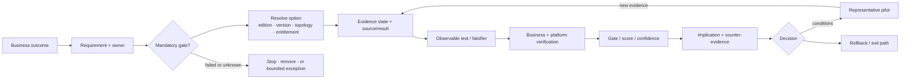
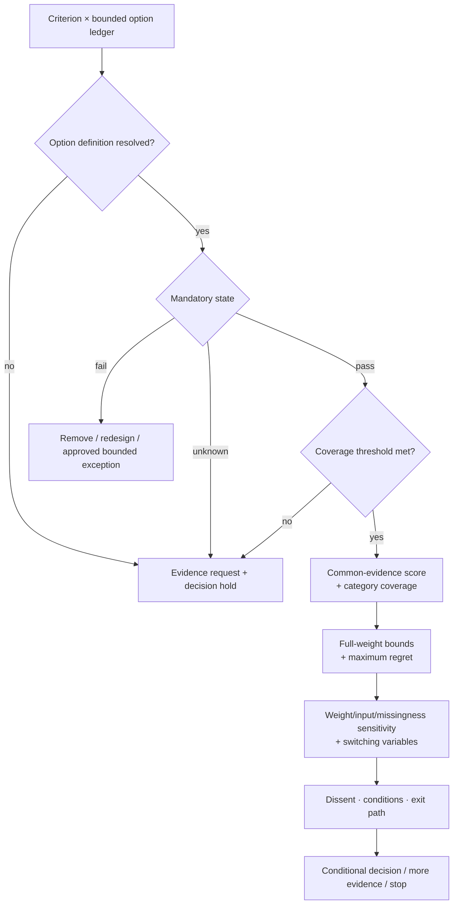

<!-- study-contract: principal -->

# Assessment methodology: from claims to a reversible decision

| Field | Value |
|---|---|
| Artifact type | principal-study |
| Decision question | What method prevents unknowns, topology differences, synthetic tests or preference from becoming an unjustified platform recommendation? |
| Decision owner | API-platform assessment decision owner and independent evidence-review forum |
| Primary audiences | Executives, directors, enterprise/platform architects, developers, DevOps, SRE, security, operations, sourcing, FinOps, risk and internal assurance |
| Scope | Framing, discovery, bounded-option resolution, official/vendor/lab/pilot evidence, mandatory gates, symmetric testing, scoring, missing-evidence analysis, sensitivity, dissent, conditions and public/restricted evidence |
| Evidence state | Method design and governance rules; no product outcome is implied; RE-1 values remain scenario assumptions |
| Reference case | RE-1, a synthetic regulated-enterprise case used for symmetric analysis |
| As-of date | 2026-08-17; factual source-review metadata, not a scenario assumption |
| Next gate | Gate 0 approves the decision contract, evidence thresholds, bounded archetypes, option-resolution fields, RE-1 calibration and independent reviewers |

## Provisional answer

Use a **mandatory-gate-first, option-resolved, evidence-levelled decision system**. Documentation establishes mechanisms and designs tests; reproducible lab runs establish behavior only inside their tested boundary; representative production pilots establish the highest confidence available before migration scale. Unknown is a visible state, never zero and never an optimistic inference. A bounded archetype is useful for research design, but it is not an exact, scoreable deployable variant until its edition, version, topology, entitlement, region and support boundary are closed.

The provisional method preserves the canonical sequence and E0–E4 ladder, but adds four controls required by RE-1 complexity: business-outcome verification outside the gateway, per-claim topology/entitlement scope, explicit counter-evidence/falsification, and rollback/reconciliation as part of each gate. Confidence is high that this method exposes missing evidence and anchoring; its own weights, thresholds and governance still require Gate 0 approval. A badly designed method can produce a precise score for the wrong option or allow one strong category to average away an unsafe transfer, identity, residency or recovery failure.

> **Number convention:** RE-1 workload, traffic, SLO, duration, capacity and cost values are **scenario assumptions**. Evidence levels, criterion IDs, score scale and approved sensitivity rules are methodology definitions, not observations or scenario facts.

## Decision sequence

| Stage | Purpose | Required output | Stop condition |
|---|---|---|---|
| Frame | confirm outcomes, decision boundary, non-goals, bounded archetypes, option-resolution fields, mandatory gates and rights | signed decision contract and calendar | no accountable decision owner or unresolved scope that changes candidates |
| Discover | establish current estate, critical journeys, controls, support and cost | reconciled baseline with visible gaps | no representative workload/data/identity ownership |
| Research | record current primary claims with version/topology/entitlement and interpretation | claim/source ledger, option-resolution ledger and open vendor questions | brand-level claim cannot be mapped to a bounded option or required option fields remain unresolved at the scoring gate |
| Test | execute equivalent scenario and failure protocols | reproducible configuration, raw output, business verification and limitations | environment/instrumentation is non-comparable or unsafe |
| Score | apply mandatory gates, evidence confidence, coverage and sensitivity | criterion/variant ledger and rank-stability analysis | failed/unknown mandatory gate without authorized exception |
| Decide | state recommendation, dissent, conditions, excluded scope and exit | ADR/decision record with expiration/retest | material unknown could reverse choice and is not bounded |
| Pilot | run representative production workloads before scaling | E4 service, SLO, operations, cost, rollback and reconciliation record | journey/operating ownership or critical objective fails |

## Scenario and assumptions: RE-1 as a symmetry device

All quantitative values below are **scenario assumptions**, not candidate evidence. The full fact pattern is in [RE-1](41-enterprise-reference-case.md).

| Scenario dimension | RE-1 assumption | Methodological use | Invalid shortcut prevented |
|---|---:|---|---|
| load shape | 4,800 ordinary, 13,500 busy and 22,000 burst requests/s | identical open-loop profiles, dependency fixtures and policy work | vendor maximum or closed-loop client hiding dropped demand |
| critical transfer | 99.99% availability, assumed RTO 5 min and RPO zero after commit | mandatory business-outcome and ambiguous-retry gate | gateway 2xx/latency treated as money-movement correctness |
| mixed estate | 63 Mule, 47 PCF, 36 AKS and additional workloads | representative gateway, transform, workflow, queue and file patterns | low-risk HTTP demo generalized to migration factory |
| regional design | one-zone loss plus warm-region 65% busy capacity initially | same failover/data-readiness question across variants | multi-region checkbox treated as recovery proof |
| economics | assumed legacy/target/programme values with low/base/high sensitivity | comparable fully allocated model | list price or infrastructure-only TCO |

The case is held constant across candidates until a product limitation requires a documented deviation. The deviation is itself decision evidence; the test is not quietly simplified.

## Mechanism analysis: decision-assurance chain

Each conclusion must preserve the full chain below. A missing link returns the criterion to `unknown`; a failed or unknown mandatory gate stops the recommendation unless the authorized decision body records a time-bounded exception, excluded production scope and retest.

**Figure METH-1 — No product claim reaches a decision without option resolution, evidence, falsification, business verification and an exit path.**

- **Depicted scope:** business outcome, owned requirement, mandatory gate, bounded-to-resolved option, evidence state/source, observable falsifier, platform/business verification, score/confidence, implication/counter-evidence, decision, pilot feedback and rollback/exit.
- **Excluded scope:** actual criteria/weights, option contracts, evidence results, exception authority, scoring thresholds, product ranking and any claim that a candidate has completed the chain.
- **Diagram source, evidence state and as-of:** inline method synthesis from the [principal study standard](STUDY-STANDARD.md), RE-1 and this study's option/evidence/gate contracts; governance interpretation awaiting Gate-0 approval; 2026-08-17.
- **Accessible equivalent:** an outcome becomes an owned requirement and mandatory-state decision; the bounded archetype must resolve edition/version/topology/entitlement before evidence can attach. Evidence defines an observable falsifier and is verified at component and business boundaries before score/confidence, counter-evidence and decision. Failed/unknown mandatory state stops or needs a bounded exception; conditions lead to a representative pilot whose new evidence loops back, and every decision retains rollback/exit.

**Figure interpretation:** A product claim cannot jump directly to a score. It is first mapped to a bounded option and then to a resolved deployable bill of materials, exposed to falsification, verified at both component and business boundaries, and carried into a reversible decision; the diagram does not imply that weighted scoring can override a mandatory failure.

**Figure limitation:** The chain enforces traceability but cannot make weights objective, evidence independent or exceptions acceptable. Governance roles, thresholds, exact options and execution quality remain organization decisions subject to review.

## Option-resolution contract

The seven IDs below are **bounded deployment archetypes**, not yet exact deployable variants. Deployment mechanics change responsibility, state and failure behavior, so an archetype becomes scoreable only after every required definition field is resolved and independently checked at Gate 1. An unresolved tier, image, region, entitlement, plugin, support term or managed-service boundary holds the affected evidence and score at `unknown`.

| Option ID | Bounded deployment archetype | Definition required before it becomes an exact scoreable option | Why family scoring fails |
|---|---|---|---|
| K-KH | Kong Konnect hybrid | edition/subscription, control plane, data-plane version/hosting, plugins, analytics/portal, regions, support | managed control and customer data plane differ from self-managed lifecycle |
| K-SM | self-managed Kong hybrid | gateway/database versions, CP/DP topology, plugins, Kubernetes/VM, backup/DR, support | customer owns control/database availability, upgrades and recovery |
| A-MG | APIM managed gateway | exact tier/generation, regions, network, workspaces/gateways, features, SLA/support | managed tier/topology features differ materially |
| A-SH | APIM self-hosted gateway | APIM tier, image/version, hosting, configuration endpoint, workspaces/features, support | customer owns local runtime while management remains an APIM dependency |
| G-X | Apigee X | organization/region/network, runtime/data residency, features, analytics, support/entitlement | managed topology cannot stand in for Hybrid operations |
| G-H | Apigee Hybrid | supported version/platform, runtime services/state, regions, management connectivity, backup/upgrade/support | customer operates Kubernetes runtime and Cassandra/MART/Synchronizer |
| M-B | MuleSoft current-state baseline | actual deployment option/runtime/version, gateway/API Manager, flows/state/connectors, support/license | current integration responsibilities and costs are not one gateway option |

Current official sources demonstrate why this precision matters: Microsoft assigns self-hosted gateway infrastructure, capacity, network and uptime to the customer ([support policy](https://learn.microsoft.com/en-us/azure/api-management/self-hosted-gateway-support-policies)); Google identifies customer-operated Message Processor, Synchronizer, Cassandra and MART in Apigee Hybrid ([architecture](https://docs.cloud.google.com/apigee/docs/hybrid/v1.16/what-is-hybrid)); Kong distinguishes managed/self-managed hybrid control/data-plane behavior and plugin limitations ([hybrid mode](https://developer.konghq.com/gateway/hybrid-mode/)).

## Evidence levels and claim contract

The canonical ladder is preserved:

| Level | Evidence | Permitted score confidence | Required scope |
|---|---|---|---|
| E0 | Marketing or assertion only | Unknown | may create a research question; cannot support score |
| E1 | Current official documentation | Low–medium | exact version/tier/topology/entitlement, source date and limitation |
| E2 | Vendor answer with named version/contract term | Medium | attributable answer, commercial/support context and revalidation trigger |
| E3 | Repeatable lab execution with artifacts | High for tested scope | environment/config versions, raw output, business verifier, deviation and reviewer |
| E4 | Representative enterprise pilot under expected controls/load | Highest | production-like service ownership, SLO, incident, rollback, cost and consumer boundary |

Each material claim is also labelled as documented fact, observed result, interpretation, scenario assumption, hypothesis or open question. Evidence level and claim label answer different questions: E1 may document a product fact, while the inference that it meets RE-1 remains an interpretation/hypothesis.

### Example of honest progression

Kong documents that a hybrid data plane can proxy from cached configuration while the control plane is unavailable ([hybrid mode](https://developer.konghq.com/gateway/hybrid-mode/)). That is E1 for the documented topology. It does not establish what happens in the organization’s image, plugin, license, cache-persistence, new-node, telemetry, identity and network setup. RW-01 converts those unknowns into an E3 candidate-specific experiment. Only a representative pilot can show whether operators and support meet the service objective over time.

## Symmetric research and test contract

| Dimension | Same question for every variant | Permitted implementation difference | Invalid asymmetry |
|---|---|---|---|
| architecture | plane/state location, connectivity, authority, support and failure | product-native supported mechanism | one product shown as a simple box while another exposes every component |
| security | identity, PKI, secrets, policy, audit, supply chain and exception | supported product/enterprise integration | counting policies without testing topology/entitlement |
| workload | same RE-1 arrival, payload, identity and backend behavior | candidate-specific tuning with logged time/opportunity | warm cache, reduced telemetry or policy for preferred candidate |
| failure | same business-visible injection and abort/recovery question | topology-specific injection point | testing only pod death on one and region/control/data on another |
| operations | install, upgrade, change, rollback, capacity, incident, backup/DR and support | managed responsibility may reduce customer tasks | ignoring work because vendor owns it without support/SLA evidence |
| migration | same Mule/PCF patterns, coexistence, identity, state and decommission ledger | native route/deployment mechanism | scoring migration by API import count |
| economics | same time horizon, traffic/growth, region, support, telemetry, people and dual run | contract/consumption model | list price against negotiated fully allocated baseline |

All candidates receive the same evidence request, environment fidelity, workload corpus, tuning opportunity, operator scenario and independent review. If a capability is unavailable, that is a result rather than a reason to delete the test.

## Real-world challenge set

| Challenge | Required observation | Business verification | Mandatory impact |
|---|---|---|---|
| partial control-plane loss | existing/restarted/new replica, active digest, changes, telemetry and reconnect | no request served by stale/unknown policy | mandatory for critical tier |
| identity/certificate degradation | issuer/JWKS/cache, served chain, old/new trust, revocation and clock | correct client/partner authorization and bounded degradation | mandatory security gate |
| non-idempotent timeout | reserve/outcome state, retry behavior and cross-region access | one ledger outcome per business key | mandatory J-01/J-03 gate |
| capacity/noisy neighbour | saturation by worker/counter/connection/dependency, zone loss and shedding | critical journey SLO protected | mandatory for claimed tier |
| telemetry backpressure | queue, refusal, drop, CPU/memory/disk and recovery drain | request protected; audit/gap reconciles | mandatory observability/operability gate |
| schema drift | syntax plus enum/null/decimal/time/error/order/duplicate semantics | authoritative data/event outcome | mandatory migration/governance gate |
| regional loss | route, config, identity, capacity, writer epoch, data lag and failback | RTO/RPO and ambiguous outcomes reconcile | mandatory DR gate |
| mixed Mule/PCF/AKS rollback | route/code/config/schema/data/message/external-effect actions | business totals and ownership close | mandatory factory gate |

Execution detail is in [real-world PoC scenarios](../poc/real-world-scenarios.md). The method records a run as invalid when the open-loop offered load stopped, the business verifier cannot close totals, instrumentation failed materially, or a candidate received an undisclosed deviation.

## Scoring and uncertainty guardrails

The canonical rules remain:

- mandatory criteria are pass/fail/unknown and cannot be averaged away;
- weighted criteria use the defined 0–5 scale only after evidence is attached;
- `Unknown` is excluded only from the **descriptive observed-evidence score** and reported as an evidence gap; that score cannot rank candidates with different evidence sets;
- recommendation is prohibited when a mandatory criterion fails or evidence coverage is below the steering threshold;
- every comparison also reports a common-evidence score, category coverage, full-weight lower/upper bounds and maximum regret under plausible missing-evidence completions;
- category-weight sensitivity is run at the defined ±20%, missing-evidence patterns are stressed, and rank instability is reported;
- only fully resolved options are scored separately; bounded archetypes remain research objects until their Gate-1 bill of materials closes;
- current `acceptance_test` text is a discovery prompt until an observable measure, threshold, scenario, required evidence level, decision owner and exception rule are approved for each of the 30 mandatory gates.

See the [scoring guide](../decision-matrix/scoring-guide.md) and [evidence ledger template](../decision-matrix/evidence-ledger-template.csv).

### Score interpretation

The following views travel together; none is a standalone selection score:

- **Observed-evidence score (descriptive only):** `sum(weight × evidenced score) ÷ sum(weights with permitted evidence for that option)`.
- **Common-evidence score:** the same formula over only the criterion cells that have the required evidence for **every** option in the comparison. This is the only normalized cross-option view, and its category composition is disclosed.
- **Full-weight lower and upper bounds:** every unknown non-mandatory cell is assigned `0` for the lower bound and `5` for the upper bound, with the full approved weight denominator. Mandatory unknowns remain a decision hold rather than a numeric value.
- **Maximum regret:** the greatest plausible loss versus the best competing option across approved weight, input and missing-evidence completion scenarios. If the preferred option changes inside that envelope, the comparison is `inconclusive`, not “close.”

Each view is accompanied by mandatory-gate state, option-resolution state, evidence coverage by category and level, unknown weight, sensitivity, conditions and dissent. Reviewers test whether missingness is **not at random**—for example, one vendor lacks evidence disproportionately in security, recovery or commercial criteria. A common-evidence set that drops a steering-approved material category, or bounds that overlap enough to reverse the choice, blocks ranking regardless of aggregate coverage. A high observed-evidence score with low or skewed coverage is not a strong recommendation.

**Figure METH-2 — Option resolution and mandatory gates precede comparison; unknowns remain visible through common evidence, bounds and maximum regret.**

- **Depicted scope:** criterion/option ledger, option resolution, mandatory pass/fail/unknown, coverage threshold, common-evidence score, full-weight bounds, maximum regret, weight/input/missingness sensitivity, dissent/conditions/exit and decision outcomes.
- **Excluded scope:** approved weights and thresholds, imputation distributions, candidate data/scores, exception decisions, commercial model and any current ranking.
- **Diagram source, evidence state and as-of:** inline scoring-control synthesis from this study and the repository scoring guide; proposed Gate-0 method with no populated comparative result; 2026-08-17.
- **Accessible equivalent:** unresolved options or unknown mandatory state hold for evidence; mandatory failure removes/redesigns or requires a bounded exception. Only resolved/pass options meeting coverage proceed to a common-evidence comparison, then full-weight lower/upper bounds and maximum regret. Weight, input and missingness sensitivity identify switching variables; dissent, conditions and exit accompany conditional decision, more evidence or stop.

**Figure interpretation:** Option resolution, mandatory disposition and evidence coverage precede comparison. Common-evidence scoring, full-weight bounds, maximum regret, sensitivity and dissent travel together into the decision, preventing selective unknowns or a single number from hiding uncertainty; the figure does not make weights or missing-value completions objective facts.

**Figure limitation:** The flow does not choose imputation, tolerance or regret thresholds and cannot eliminate missing-not-at-random bias. Reviewers must test category coverage and decision stability rather than treating the generated range as statistical certainty.

## Failure modes of the methodology

| Method failure | Symptom | Consequence | Control |
|---|---|---|---|
| anchoring on “Kong first” | preferred variant receives deeper tuning and gentler interpretation | biased shortlist and sunk-cost momentum | independent reviewers, symmetric protocols and counter-hypotheses |
| evidence laundering | E1 documentation described as “proven” enterprise fit | unsupported selection | separate claim label from evidence level and decision implication |
| topology collapse | APIM/Apigee/Kong family scored as one option | responsibility and feature constraints hidden | exact option contract and version/topology columns |
| happy-path PoC | impressive latency and policy demo | no knowledge of state/failure/recovery | RW-01 through RW-12 and business verifier |
| selective missingness | a candidate is well evidenced in strengths and unevidenced in weak categories | normalized score improves by avoiding evidence | common-evidence view, category coverage, 0–5 bounds, maximum regret and decision hold |
| mandatory average-away | strong portal/price offsets security/RPO failure | unsafe recommendation | gates evaluated before score |
| test invalidity ignored | closed-loop generator or missing telemetry appears successful | false throughput/reliability | validity rules and independent review |
| false TCO precision | public list price and estimated headcount produce exact NPV | economic bias | restricted quotes, actual allocation and sensitivity |
| pilot generalized too far | one low-risk API becomes factory approval | migration failures appear at stateful tail | gateway- and integration-dominant representative pilots |

## Counter-hypotheses and non-fit conditions

For a small, low-risk estate, this method may cost more than the decision warrants; a lightweight mandatory screen could be enough. The 0–5 scale and ±20% sensitivity may also be inferior to an outranking, utility or scenario-dominance method for some governance bodies. The provisional method is falsified if an alternative produces more stable, explainable and auditable decisions with less effort on the same evidence. It is non-fit if decision rights are absent, reviewers cannot access evidence, mandatory thresholds remain undefined, or leadership intends the score to ratify a prior choice.

## Decision implications

- Gate 0 approves the method before any score is decision evidence.
- Screening, PoC, pilot and decommission are distinct authorization levels.
- Every material claim carries bounded-option scope and, before scoring, a resolved deployable bill of materials, evidence label/level, point-of-use source/result and falsifier.
- Business correctness and active state are first-class measures beside gateway performance.
- Unknowns and rank sensitivity can defer or narrow a recommendation; uncertainty is an output, not an inconvenience.
- Public evidence remains sanitized while restricted artifacts retain traceable reference IDs, reviewers and integrity hashes.

## Public and restricted evidence

The public repository stores sanitized conclusions, official source IDs/links, product versions/topologies, evidence levels, limitations, decision impact, non-sensitive checksums/reference IDs, methodology and test protocols.

Commercial quotes, NDA responses, organization topology, security findings, raw logs/payloads, named-person mappings and access-controlled evidence remain in a restricted store. The public ledger records a non-sensitive reference and reviewing role; it never publishes credentials, customer data, private URLs, contractual detail or personal assignments.

## Falsification and proof plan

Method thresholds and sample sizes are governance parameters; any RE-1 performance/cost values used remain **scenario assumptions**.

| Proof ID | Procedure | Measure | Threshold | Evidence artifact | Independent reviewer |
|---|---|---|---|---|---|
| METH-P1 | have two independent teams apply the rubric to a blind sample of claims/options | agreement on label, level, scope and disposition | decision owner approves agreement threshold before use | scored sample, disagreements and adjudication log | internal assurance/method reviewer |
| METH-P2 | replay known positive, negative, unknown and invalid-run cases through gates/scoring | correct stop/unknown/score behavior | zero mandatory failure averaged into recommendation | automated/manual regression bundle | risk and decision-matrix owners |
| METH-P3 | execute one hard scenario identically on two variants | environment/workload/deviation symmetry and business verification | no undisclosed material asymmetry; all totals reconcile | protocols, raw bundles and independent comparison | PoC review panel |
| METH-P4 | run weight, traffic, growth, staffing, quote and decommission sensitivities | rank/decision switching variables | recommendation states instability or remains within approved tolerance | versioned model and sensitivity output | FinOps plus independent analyst |

## Risks and limitations

- Evidence labels and scoring still require judgment; governance cannot be fully automated.
- Official sources and vendor answers become stale as versions, tiers, regions, entitlements and support change.
- Equivalent questions do not guarantee identical implementations; reviewers must decide whether deviations preserve the intent.
- E3 results do not generalize beyond tested topology/config/load/failure; E4 remains a bounded pilot, not universal proof.
- Weighted scores can obscure dominance, uncertainty and correlated criteria; the narrative gate record remains authoritative.
- Public sanitization can remove context; restricted evidence must remain accessible to authorized reviewers.

## Open evidence requests

| Request | Owner role | Due gate | Decision impact if unresolved |
|---|---|---|---|
| approved mandatory thresholds, coverage floor, exception authority and score/sensitivity rules | Decision owner and steering/risk forum | Gate 0 | method cannot produce recommendation evidence |
| bounded archetypes, required option fields, version policy, entitlement/support and source revalidation triggers | Architecture and sourcing | Gate 0/1 | keep affected claims/options unknown and prohibit scoring |
| calibrated RE-1 journeys, environments and business verifier | Domain, SRE, data, security and PoC owners | PoC design | E3 run invalid for enterprise decision |
| independent reviewer capacity and restricted evidence access | Internal assurance/programme owner | Gate 0 | downgrade confidence and defer contentious criteria |

## Next gate

At Gate 0, the decision owner approves the method only if bounded archetypes, Gate-1 option-resolution fields, evidence states/levels, mandatory thresholds, coverage and category floors, common-evidence/bounds/maximum-regret rules, symmetric test contract, validity/stop conditions, exception authority, public/restricted handling, independent reviewers, RE-1 calibration and decision calendar are explicit. After approval, E1/E2 screening may begin; an archetype becomes scoreable only after its option-resolution record closes, and no existing score is grandfathered as decision evidence without conforming to this contract.
