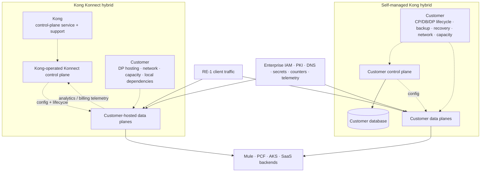
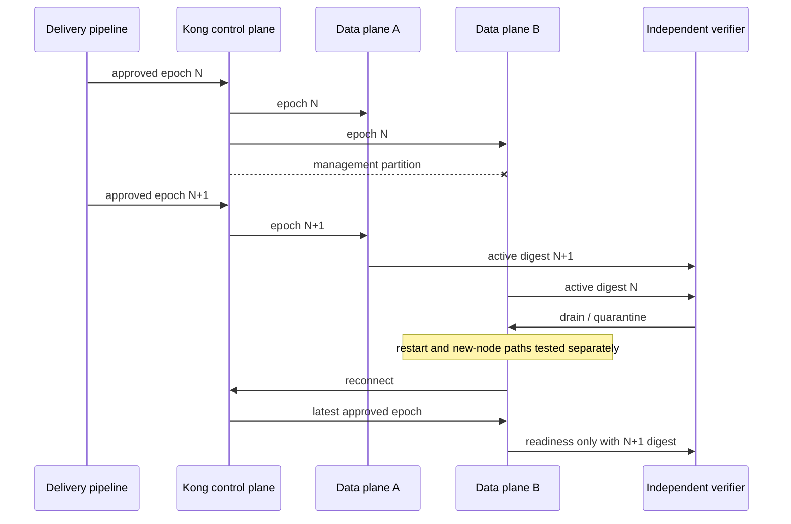
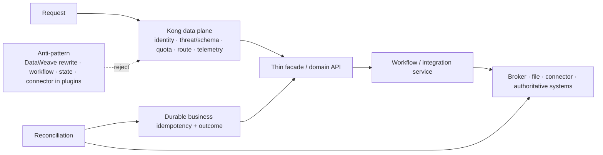

<!-- study-contract: principal -->

# Kong sequencing hypothesis: symmetric validation, not preferred selection

| Field | Value |
|---|---|
| Artifact type | comparative-study |
| Decision question | Under what evidence, if any, should Kong Konnect hybrid and self-managed Kong advance to finalist proof without biasing the bounded-archetype decision? |
| Decision owner | API-platform assessment decision owner and independent architecture/evidence review forum |
| Primary audiences | Executives, platform/application directors, enterprise/platform architects, developers, DevOps, SRE, security, operations, sourcing, and FinOps |
| Scope | Kong Konnect hybrid and self-managed Kong hybrid as distinct bounded archetypes; comparison counterfactuals for APIM managed/self-hosted, Apigee X/Hybrid and MuleSoft baseline; RE-1 critical scenarios |
| Evidence state | Low-confidence hypothesis with documented Kong mechanisms; no observed RE-1 fit, product ranking or selection |
| Reference case | RE-1, a synthetic regulated-enterprise case |
| As-of date | 2026-08-17; factual source-review metadata, not a scenario assumption |
| Next gate | Equivalent E1/E2 screen of all seven bounded archetypes, then steering approval of symmetric E3 finalists |

## Provisional answer

Not yet. **Current evidence does not justify giving Kong execution priority.** Kong Konnect hybrid and self-managed Kong are useful, falsifiable sequencing hypotheses because their documented control/data-plane separation, customer-placeable data planes, Kubernetes integration and declarative paths align with the target direction. They may advance only through the same Gate-1 option resolution, common-evidence screen and mandatory-gate rules as APIM managed/self-hosted, Apigee X/Hybrid and the bounded MuleSoft baseline.

The two Kong options must be evaluated separately. Konnect can reduce control-plane lifecycle responsibility but adds vendor control, connectivity, telemetry, entitlement and support dependencies. Self-managed Kong increases control and exit flexibility but assigns the organization the control-plane database, availability, backup, upgrade and recovery burden. Confidence is medium that Kong is architecturally relevant, low that either option meets RE-1, and zero in a ranking until mandatory gates, symmetric PoCs, support and TCO close. A false positive could select a clean diagram that fails on plugin topology, stale config, business idempotency, certificate/identity operations, telemetry loss, staffing or total lifecycle cost.

## Hypothesis and its non-negotiable boundary

The hypothesis is:

> A resolved Kong hybrid option may provide a workload-local request-processing plane and a declarative configuration boundary while preserving centralized API lifecycle control. Whether this produces lower total complexity, risk or cost than any alternative is explicitly unproven.

The hypothesis does **not** claim:

- that a data plane proxying during disconnection means all RE-1 recovery objectives pass;
- that Kubernetes/Gateway API support makes Kong policy portable or eliminates cluster operations;
- that Kong plugins can replace Mule DataWeave, workflow, messaging, state, file or connector behavior;
- that Konnect and self-managed Kong share one support, security, failure or cost profile;
- that feature availability is independent of edition, topology, version, plugin, entitlement or deployment model;
- that a named sequencing hypothesis permits an easier test, earlier build commitment or optimistic unknown than other candidates.

## Scenario and assumptions: RE-1 pressure on the hypothesis

Every quantitative value below is a **scenario assumption**, not current-state or Kong performance evidence.

| RE-1 pressure | Scenario assumption | Why Kong could fit | Why the same fact could falsify Kong |
|---|---:|---|---|
| distributed traffic | 4,800 ordinary / 13,500 busy / 22,000 burst requests/s | local data planes may reduce backend path latency and central dependence | local counters, plugins, telemetry, autoscale or shared dependencies may saturate first |
| AKS estate | 36 AKS services plus PCF/Mule transition | KIC/Operator and Gateway API may align route intent with Kubernetes teams | controller/CRD/operator version and ownership add another lifecycle; internal routes may not need enterprise gateway |
| J-01 transfer | assumed 99.99% and RPO zero after commit | gateway can enforce identity, request boundary and route while domain owns outcome | any retry/plugin design that implies exactly-once or continues without idempotency state is non-fit |
| J-03 partners | 24 identities/quotas and mixed certificate trust | plugins and local TLS termination can enforce partner policy near workloads | hybrid plugin/rate-state constraints or certificate rollout may break tenant correctness |
| J-06 config | assumed propagation p95 5 min | CP/DP model exposes desired-state distribution | cache/restart/new-node/manual-fallback behavior can create stale/empty/mixed state |
| resilience/cost | one-zone loss, warm region and fully allocated operating model | small repeatable data planes may aid placement and scaling | self-managed CP/database or many local DPs may increase SRE/support/telemetry cost |

## Mechanism analysis: two Kong options, different responsibilities

**Figure KONG-H1 — Konnect hybrid and self-managed hybrid share customer-hosted request planes but assign control, database and support duties differently.**

- **Depicted scope:** Konnect-operated control with customer data planes, self-managed control/database/data planes, customer/vendor responsibility boundaries, RE-1 traffic/backends and enterprise IAM/PKI/DNS/secrets/counters/telemetry dependencies.
- **Excluded scope:** Dedicated Cloud/Serverless, resolved editions/versions/plugins/regions/support, exact network/data flows, portal/analytics design, capacity/DR and any cost or fit result.
- **Diagram source, evidence state and as-of:** inline synthesis from Kong's official [deployment topologies](https://developer.konghq.com/gateway/deployment-topologies/) and [data-plane hosting options](https://developer.konghq.com/gateway/topology-hosting-options/) plus RE-1; E1 mechanism evidence and responsibility interpretation, no observed enterprise result; 2026-08-17.
- **Accessible equivalent:** in Konnect hybrid, Kong operates the control service while the customer hosts data planes and their network/capacity/local dependencies; analytics/billing telemetry returns to Konnect. In self-managed hybrid, the customer operates the control plane, database and data planes. Both receive RE-1 traffic, call mixed backends and depend on enterprise trust/network/state/evidence services.

**Figure interpretation:** Both archetypes keep request processing on customer-hosted data planes, but the control-plane/database ownership and telemetry/support boundaries differ materially. The diagram excludes Dedicated Cloud/Serverless modes and proves neither resilience nor cost; any admitted mode must first become a separately resolved option.

**Figure limitation:** The archetypes are not deployable options until edition, version, plugin, region, entitlement, support and enterprise dependencies are fixed. The figure cannot support scoring, TCO or resilience conclusions.

Kong’s official documentation distinguishes hybrid control/data-plane roles and states that self-hosted data planes are supported with both Konnect and self-managed hybrid ([deployment topologies](https://developer.konghq.com/gateway/deployment-topologies/), [data-plane hosting options](https://developer.konghq.com/gateway/topology-hosting-options/)). The option definition must still attach edition, version, plugin, portal/analytics, region, support and license details.

### Documented mechanism ledger

| Mechanism | Current documented fact | Evidence state | RE-1 interpretation / open proof |
|---|---|---|---|
| disconnected request path | hybrid data planes cache configuration locally and continue proxying when CP communication is interrupted | E1 documented fact for documented topology | test existing, restarted and newly provisioned replicas, active digest, cache loss/encryption, identity/counter dependencies and RTO |
| reconnect | latest configuration is pushed after connection returns rather than replaying every older change | E1 documented fact | prove reconciliation, stale replica quarantine and operator visibility during mixed epoch |
| CP/DP security | Kong hybrid setup uses mTLS for CP/DP communication | E1 documented fact ([hybrid installation](https://developer.konghq.com/gateway/install/hybrid/)) | validate enterprise PKI/rotation, network path, certificate lifecycle and support boundary |
| rate-limit state | several rate-limiting plugins do not support cluster strategy in hybrid; local or Redis-style alternatives apply by plugin | E1 documented constraint ([hybrid mode](https://developer.konghq.com/gateway/hybrid-mode/)) | choose/test consistency, failure, region, latency, privacy and operational ownership for RE-1 partner/product quotas |
| OAuth plugin | Kong OAuth 2.0 Authentication plugin is incompatible with hybrid mode | E1 documented constraint ([hybrid mode](https://developer.konghq.com/gateway/hybrid-mode/)) | prefer/validate enterprise external authorization server and JWT/OIDC/mTLS enforcement; confirm exact plugin entitlement |
| custom plugins | custom/third-party plugins must be installed on both control and data planes with compatibility rules | E1 documented constraint | quantify supply-chain, upgrade, rollback, support and multi-location toil; avoid business-logic plugin growth |
| telemetry disconnection | Konnect data planes buffer request analytics during CP disconnect and drop older data when the buffer fills | E1 documented behavior ([hybrid mode](https://developer.konghq.com/gateway/hybrid-mode/)) | test request isolation, loss accounting, audit separation, memory/disk behavior and reconnect drain |
| data-plane startup | cache, declarative fallback or empty configuration form the documented start sequence | E1 documented behavior ([CP/DP communication](https://developer.konghq.com/gateway/cp-dp-communication/)) | prove traffic admission and config attestation; “process started” cannot mean safe readiness |
| declarative tooling | `deck gateway` requires a running Admin API and cannot manage DB-less gateways | E1 documented constraint ([decK gateway](https://developer.konghq.com/deck/gateway/)) | select the correct `deck file`, CP/Admin API or Kubernetes delivery pattern; prove rollback and drift detection |
| Kubernetes routing | KIC translates Kubernetes resources including HTTPRoute; Gateway API support and provisioning behavior vary by controller/operator model | E1 documented mechanism ([KIC](https://developer.konghq.com/kubernetes-ingress-controller/), [Gateway API](https://developer.konghq.com/kubernetes-ingress-controller/gateway-api/)) | test ownership, CRD/controller upgrades, route/policy parity, multi-gateway isolation and active configuration |

These are design inputs, not footnotes and not product-selection evidence.

## Failure analysis: documented continuity is not RE-1 resilience

### Partial control-plane interruption and stale state

**Figure KONG-H2 — Cached proxy continuity is insufficient unless stale, restarted and new-node data planes are observable and excluded from traffic.**

- **Depicted scope:** approved configuration epochs, partial management partition, divergent active digests, independent verification, drain/quarantine, separate restart/new-node tests, reconnection and readmission on current digest.
- **Excluded scope:** Kong cache internals, automatic quarantine/verifier capability, license/certificate/secret/bootstrap behavior, exact stale-age threshold, traffic-manager implementation and observed recovery time.
- **Diagram source, evidence state and as-of:** inline E3 test hypothesis informed by Kong's official [hybrid-mode behavior](https://developer.konghq.com/gateway/hybrid-mode/) and RE-1 J-06/I-02; documented mechanism plus unexecuted falsifier, not a product result; 2026-08-17.
- **Accessible equivalent:** the pipeline and Kong control plane establish epoch N on two data planes. A management partition isolates B; N+1 reaches A but B remains on N. An independent verifier observes both digests and removes B from traffic. Restart/new-node behavior is tested separately; after reconnect, B is ready only when it carries the latest approved digest.

**Figure interpretation:** The differentiating question is not whether A continues proxying; it is whether B’s stale/restart/new-node state is visible and excluded from traffic until it matches approved intent. The sequence is a test hypothesis, not a claim that Kong supplies the verifier or quarantine automatically.

**Figure limitation:** The sequence does not prove cache safety, disconnected duration, scale-out, revocation or telemetry behavior. Each resolved Kong option needs exact topology/configuration and raw E3 evidence for every transition.

### Mandatory edge-case matrix

All numeric thresholds below are RE-1 **scenario assumptions**.

| Challenge | Kong-specific hypothesis | Evidence that could falsify it | Mandatory implication |
|---|---|---|---|
| CP loss/cache failure | running and restarted DPs use approved cache; fallback/new node is controlled | empty/stale DP serves, manual cache copy lacks integrity, license/config dependency breaches RTO | critical-tier non-fit or redesigned bootstrap/traffic admission |
| config defect/mixed epoch | declarative/central config plus rollout can expose and reverse exact digest | no per-DP active attestation, cluster-wide bad push, rollback conflicts after reconnect | hold APIOps/production readiness |
| identity/JWKS degradation | external issuer + OIDC/JWT enforcement has bounded cache/fail behavior | global fail-open/closed, unknown key rotation exceeds gate or tenant isolation fails | mandatory security failure |
| partner rate state | supported local/Redis strategy preserves correct per-client/product semantics | counter inconsistency, Redis latency/outage or region partition causes quota leakage/block | topology/policy non-fit for partner tier |
| non-idempotent transfer | gateway avoids blind POST retry and passes business key/context to durable domain outcome store | plugin/retry chain creates duplicate or accepts writes without outcome state | mandatory J-01/J-03 failure |
| certificate rollover | DP/Ingress process serves old/new trust safely across cohorts/regions | Secret/config update does not reload, one DP serves wrong chain, connection pools mask break | mandatory partner-readiness failure |
| noisy neighbour/zone loss | DP placement, worker/resources and dependency pools isolate critical routes | onboarding/batch/tenant consumes critical workers/counters/connections; headroom fails | capacity/tenancy redesign or lower tier |
| telemetry backpressure | analytics/log/trace paths are bounded and request path remains safe | buffer/export/reconnect consumes request resources or loss cannot be quantified; audit drops | observability/operability failure |
| schema drift | declarative contract/policy pipeline blocks syntax and semantic regression | OpenAPI validation passes but enum/null/decimal/time/error behavior changes | APIOps/governance failure |
| regional failover | independent regional DPs can be activated only with config/identity/data readiness | HTTP health routes to stale data or idempotency/counter state splits | mandatory DR failure |
| mixed Mule/PCF/AKS migration | stable route/weights and observability support reversible cohorts | route rollback cannot reconcile state/events or cyclic dependencies emerge | factory-pattern failure |

Detailed procedures and assumed thresholds are in [performance/resilience](32-performance-resilience.md) and [real-world PoC scenarios](../poc/real-world-scenarios.md).

## Kubernetes and API operations: advantage with conditions

Kong Ingress Controller documents conversion of Kubernetes resources such as `Ingress` and `HTTPRoute` into Kong Gateway configuration, and Kong Operator documents declarative provisioning/configuration through Gateway API and Kong CRDs ([KIC](https://developer.konghq.com/kubernetes-ingress-controller/), [Kong Operator](https://developer.konghq.com/operator/)). This supports the hypothesis that Kubernetes teams can express routing intent in familiar control loops.

It does not establish:

- portability of Kong-specific plugins, consumer/product entities, analytics or portal configuration;
- automatic Gateway provisioning in every KIC mode—Kong’s Gateway API guide explicitly distinguishes unmanaged behavior;
- safety of controller/operator/CRD upgrades or version skew;
- correct ownership when platform and domain teams reconcile overlapping resources;
- configuration consistency between Kubernetes, Konnect/self-managed CP and external declarative sources;
- production support for every feature gate or desired topology.

The PoC must select one authority per entity class, demonstrate admission/policy tests, capture rendered configuration, attest the active DP digest, canary controller/operator upgrades, and prove rollback without an uncontrolled second writer.

## Integration boundary: Kong must not become the next Mule monolith

**Figure KONG-H3 — Kong remains a transport-policy boundary while durable outcome, workflow, messaging and connectors stay in owned services.**

- **Depicted scope:** request processing in Kong for identity/threat/schema/quota/routing/telemetry, thin facade/domain API, workflow/integration service, broker/file/connector/authoritative systems, domain idempotency/outcome and reconciliation, plus rejected plugin-heavy anti-pattern.
- **Excluded scope:** product-specific plugin catalog/entitlement, exact facade/workflow products, topology and latency, bounded simple-transform criteria, actual Mule inventory and observed migration result.
- **Diagram source, evidence state and as-of:** inline responsibility-boundary synthesis from the [gateway-versus-integration study](07-api-gateway-vs-integration-runtime.md), [Mule migration strategy](35-mule-migration-strategy.md) and RE-1; architecture hypothesis, not evidence that all responsibilities are separable; 2026-08-17.
- **Accessible equivalent:** a request crosses Kong's transport-facing controls into a thin facade/domain API, which uses a workflow/integration service for complex work and reaches broker/file/connector/authoritative systems. Durable business idempotency/outcome belongs with the facade/domain and reconciliation spans that state and authoritative systems. Rewriting DataWeave, workflow, state or connectors inside plugins is rejected.

**Figure interpretation:** Kong can own cross-cutting request policy while business idempotency, workflow, state, messaging and connectors remain deliberately owned services. A custom plugin may be technically possible yet architecturally non-fit; the figure does not prohibit bounded protocol mediation supported by policy.

**Figure limitation:** The boundary does not prove a target service exists, that a transform is bounded or that migration preserves semantics. Product capability, workload decomposition, resource/failure tests and ownership determine placement.

MuleSoft documents DataWeave as its transformation/expression language ([DataWeave overview](https://docs.mulesoft.com/dataweave/latest/)). The [Mule migration strategy](35-mule-migration-strategy.md) therefore classifies and proves responsibilities before assigning any to the gateway.

## Counter-hypotheses and symmetric alternatives

| Counter-hypothesis | Strong fit condition | Required symmetric proof | Decision effect |
|---|---|---|---|
| APIM managed/self-hosted is better | Azure-native identity/network, managed accountability, commercial alignment and governance outweigh Kong topology/plugin/portal advantages | same RE-1 policy, failure, workspace/delegation, support and TCO scope | remove Kong priority or select APIM conditionally |
| Apigee X/Hybrid is better | API product, policy, analytics and governance value exceeds runtime/management-plane and Cassandra operations cost | same hard scenarios, lifecycle workflow, Hybrid operations and cost | prioritize Apigee exact option |
| MuleSoft retention is safer | embedded transformations/state/connectors, support/contract and domain capacity make exit uneconomic or unsafe | responsibility/state inventory, representative migration pilots and retain/replace TCO | retain bounded Mule roles and postpone forced exit |
| self-managed Kong beats Konnect | control, locality, evidence access and exit justify operating CP/database | backup/restore, upgrade, failover, staffing/support and TCO proof | prefer K-SM with funded SRE conditions |
| Konnect beats self-managed | managed CP materially reduces toil/risk and vendor dependencies fit controls | outage/support, data/telemetry, entitlement, contract/exit and regional proof | prefer K-KH with service conditions |
| no option fits | every finalist fails a mandatory security, residency, correctness, support, operability or exit gate | completed equivalent gate ledger and independent review | stop, redesign or approve explicitly narrowed scope |

The [APIM assessment](19-azure-apim-assessment.md), [Apigee assessment](21-apigee-assessment.md), and [MuleSoft baseline](23-mulesoft-current-state-baseline.md) carry the alternative dossiers. Kong may be disproven even when it is technically capable if another option delivers the required outcome with lower total risk and cost.

## Decision implications

- Keep K-KH and K-SM as separate bounded archetypes through research, resolve each Gate-1 bill of materials, and never transfer evidence between them.
- Authorize any finalist PoC only after the same E1/E2 screen, common-evidence comparison and mandatory-gate questions are completed for all bounded options.
- Make RW-01 control-plane/stale-config, RW-02 business idempotency, RW-03 certificate, RW-05 noisy-neighbour, RW-06 telemetry, RW-11 identity and RW-12 capacity mandatory for claimed critical fit.
- Treat Redis/counter, external authorization, PKI, telemetry collectors, Kubernetes controllers and CP database (self-managed) as first-class dependencies and cost/ownership items.
- Reject custom-plugin migration of complex Mule semantics without separate architecture approval and lifecycle/support proof.
- Do not let an early Kong environment become an irreversible production foundation before Gate 2 conditional selection and Gate 3 pilot readiness.

## Falsification and proof plan

All performance, duration, traffic and service thresholds are RE-1 **scenario assumptions**.

| Proof ID | Procedure | Measure | Scenario threshold | Evidence artifact | Independent reviewer |
|---|---|---|---|---|---|
| KONG-P1 | execute partial CP disconnection, config N+1, DP restart, new-node bootstrap, cache loss and reconnect on K-KH/K-SM | active digest, traffic admission, change/revocation, telemetry loss, recovery and operator action | no stale/empty/unknown DP serves; assumed J-06/RTO gates close | config/cache/topology, raw traffic, per-DP state and timeline bundle | platform SRE/security reviewer |
| KONG-P2 | apply RE-1 identity, partner quota, policy chain and certificate rollover | authorization, quota consistency, served trust, latency and failure isolation | no cross-tenant/fail-open behavior; assumed partner/SLO gates hold | policy/plugin/version/entitlement, identity/counter/handshake and raw result bundle | IAM/PKI/security reviewer |
| KONG-P3 | run ordinary/busy/burst, noisy-neighbour, telemetry failure and zone loss | offered/completed load, journey tails, CPU/memory/workers/counters/connections, queue/drop and unit cost | critical assumed budgets and zone headroom hold with bounded telemetry | immutable load/fault/platform/backend/verifier/cost bundle | performance/resilience reviewer |
| KONG-P4 | migrate one gateway-dominant and one integration-dominant workload with route-back | semantic diff, business outcomes, config/state/event/file reconciliation and operator ownership | zero unexplained critical outcome gap and accepted rollback | migration corpus, route/config, ledger/event/file and runbook record | domain/data/integration reviewer |
| KONG-P5 | model K-KH/K-SM and alternatives using quotes/support/staffing | TCO, support boundary, sensitivity, exit and switching variables | preference remains stable or condition is explicit | restricted commercial pack plus sanitized model/checksum | FinOps/sourcing/internal assurance |

## Risks and limitations

- The official Kong pages describe current documented behavior; edition, version, plugin, entitlement, hosting and support must be revalidated for the exact contracted option.
- The hypothesis is exposed to anchoring, confirmation and sunk-cost bias once a Kong PoC is built.
- Cached proxying is not proof of current identity, revocation, certificate, counter, backend, telemetry, license or data readiness.
- Kubernetes-native operation can shift rather than remove lifecycle work; controllers, CRDs, admission and cluster upgrades require ownership.
- Laboratory proof cannot establish long-duration vendor support, staff sustainability, rare failure or organization-wide portal/governance adoption.
- A small data plane does not imply a smaller total platform when external Redis, identity, telemetry, portal, database and support dependencies are included.
- This document does not score or select Kong and does not imply that all Kong modes have been evaluated.

## Open evidence requests

| Request | Owner role | Due gate | Decision impact if unresolved |
|---|---|---|---|
| K-KH/K-SM edition, versions, plugins, entitlements, portal/analytics, hosting, support and roadmap needed to create exact options | Kong technical owner and sourcing | Gate 1 | keep archetype unscored and prohibit finalist status |
| supported config-attestation, disconnected cache/new-node, license and telemetry behavior for exact option | Kong technical owner and platform SRE | PoC design | prohibit critical resilience conclusion |
| enterprise external authorization, counter store, PKI, secret, DNS/network and telemetry target patterns | IAM/PKI/network/security/platform owners | PoC design | test boundary non-representative; hold gate |
| KIC/Operator/Gateway API authority and upgrade model | AKS/platform/APIOps owners | Gate 2 | do not claim Kubernetes/APIOps advantage |
| comparable APIM/Apigee/Mule proof and fully allocated TCO/support | Alternative candidate owners and FinOps/sourcing | Gate 2 | prohibit preference or recommendation |

## Next gate

Gate 1 may authorize a resolved Kong option as an E3 finalist only after every bounded archetype receives the equivalent E1/E2 screen, K-KH and K-SM option contracts are complete, common-evidence and missingness analysis is published, all mandatory documented constraints are dispositioned, symmetric PoC protocols/environments/reviewers are funded, and the steering forum records the counter-hypotheses it expects the tests to falsify. The decision unlocked is permission to test—not platform selection, procurement lock-in or production foundation.
