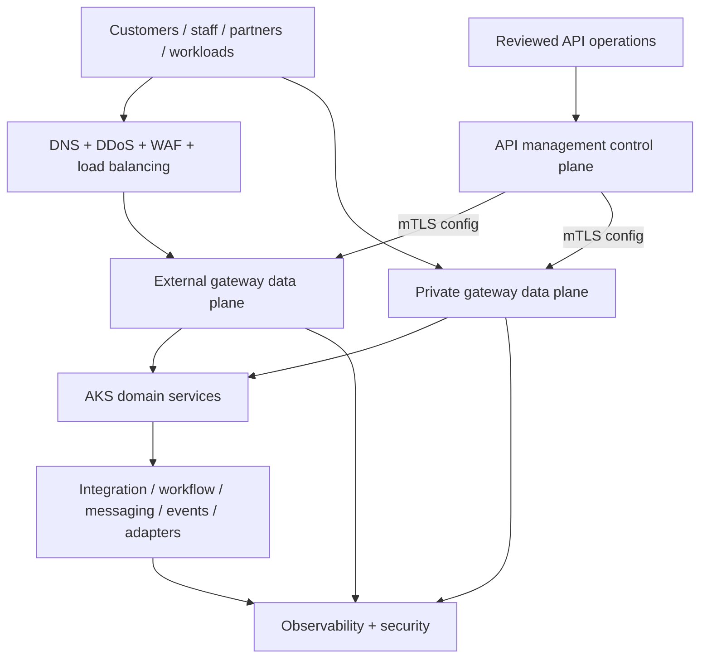

# Target-state vision

This is a vendor-neutral logical view. Product-specific control planes, data planes, persistence, support boundaries, and entitlements belong in separate candidate physical views.

<!-- diagram-alias-source: ../architecture/diagrams/target-state.mmd -->

Legacy, coexistence, SaaS, and migration routes are deliberately excluded from this logical target and are shown in the [transition-state view](../architecture/transition-state.md).

## Planes and ownership

| Plane | Owns | Must not own |
|---|---|---|
| Edge | DDoS/WAF, public TLS, coarse routing | API product policy or business orchestration |
| API management control | catalog, configuration, policy, consumer/product lifecycle | production request payload processing |
| Gateway data | authentication enforcement, traffic controls, validation, routing, telemetry | long-lived state and complex business logic |
| Domain services | business rules and canonical domain behavior | enterprise gateway administration |
| Integration | orchestration, transformation, protocol adapters, messaging, files, batch | universal north-south policy |
| Observability/security | collection, correlation, alerting, detection, evidence | silent payload capture |

## Deployment intent

- Separate external, internal/high-trust, and nonproduction failure domains when justified by threat and scale profiles.
- Use multiple replicas, topology spread, disruption budgets, autoscaling, immutable images, and controlled upgrades.
- Keep management access private and strongly authenticated; permit data planes only the required outbound control-plane and telemetry paths.
- Use stable gateway hostnames to decouple consumers from backend movement.
- Treat east-west policy as a service-mesh or workload concern unless an enterprise API boundary is deliberate.

See the [canonical logical architecture](../architecture/target-state.md) and [diagram catalog](../architecture/README.md).
