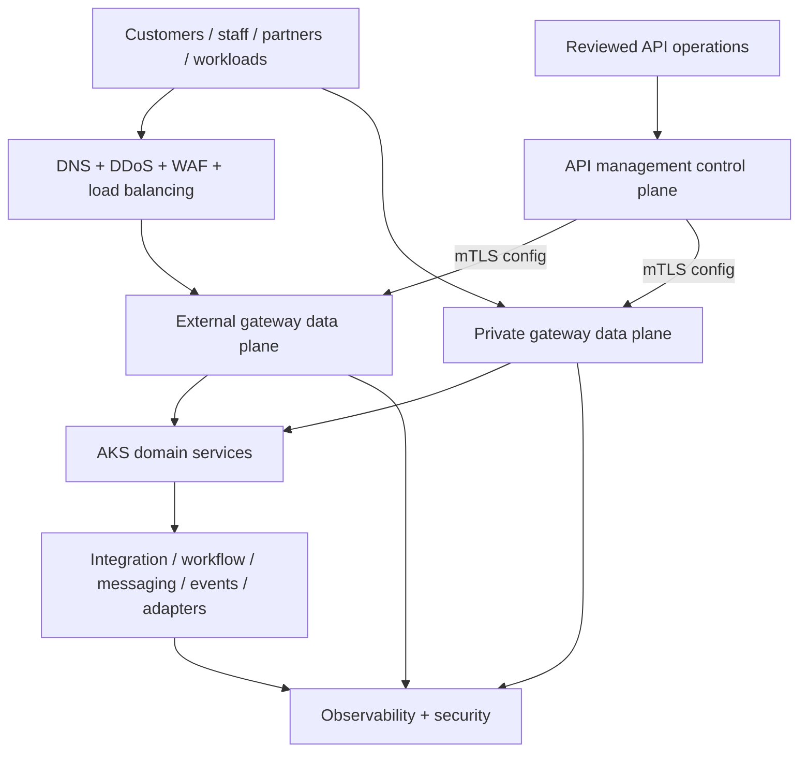

<!-- study-contract: principal -->

# Target-state vision

| Field | Value |
|---|---|
| Artifact type | architecture-study |
| Decision question | Which architecture invariants must be funded and enforced so API traffic can move across legacy, AKS and SaaS backends without creating a new gateway monolith or an unprovable failure boundary? |
| Decision owner | Enterprise architecture design authority with the API-platform decision owner |
| Primary audiences | Executives, platform and enterprise architects, security, SRE, developers, DevOps, network engineering and API product owners |
| Scope | Vendor-neutral logical target for external and private API traffic, control/configuration, gateway runtime, domain and integration workloads, identity/PKI, delivery and evidence; exact product physical views and migration coexistence remain separate |
| Evidence state | Architecture hypothesis informed by documented standards and RE-1 scenario assumptions; no candidate fit or observed result |
| Reference case | Synthetic [RE-1](41-enterprise-reference-case.md), particularly J-01, J-03, J-05, J-06 and I-01 through I-08 |
| As-of date | 2026-08-17 for linked standards and platform-neutral mechanism claims |
| Next gate | Design authority ratifies invariants, exceptions and measurable acceptance tests before candidate physical designs are scored |

## Provisional answer

Adopt the logical separation shown below as a **high-confidence architecture hypothesis**, not as proof that a product implements it. The gateway should remain a stateless, replaceable policy and routing boundary; durable business outcome, orchestration, transformation, replay and compensation stay in domain or integration capabilities. Desired configuration must be promoted through one reviewed authority and attested at every serving runtime. Request, management and telemetry paths must fail independently enough that loss of one does not silently corrupt another.

The target is wrong if it centralizes all traffic or policy in one failure domain, treats a control-plane dashboard as runtime truth, allows non-idempotent retry without business outcome evidence, or moves Mule logic into plugins merely to reduce the number of runtimes. That error would create an apparently simpler estate with larger blast radius, weaker recovery semantics and hidden operational cost.

## Decision question and architectural boundary

This page defines **invariants and ownership**, not a deployable bill of materials. Candidate studies must translate each logical component into an exact edition, region, cluster, identity, licensed capability, support boundary and recovery design. A box labelled “control plane” or “integration” is not a procurement decision.

The logical boundary includes:

- public and partner ingress through an enterprise edge;
- private workforce, workload and legacy ingress where an API boundary is deliberate;
- gateway configuration, product/consumer and administrative control;
- regional gateway data planes and their policy dependencies;
- domain services and specialized integration capabilities;
- identity, PKI, secrets, delivery, observability and security evidence; and
- gradual backend movement behind stable contracts.

The transition estate—Mule, PCF, duplicated controls, dual running and migration routing—is deliberately excluded from the target diagram and retained in the [transition-state view](../architecture/transition-state.md). Product-specific control planes, data planes, persistence and entitlements belong in candidate physical views.

## Scenario and assumptions

This architecture is exercised against synthetic **RE-1**. Every count, rate, duration, objective and organizational input inherited from RE-1 is a **scenario assumption**, never current-state inventory or observed performance.

The design must keep J-01 confirmed money transfer deterministic under I-01 lost response, expose J-06 desired-versus-effective configuration during I-02 control disconnection, preserve J-03 partner trust during I-03 certificate rollover, isolate I-04 noisy-neighbour and I-05 telemetry backpressure, gate I-06 failover on data/configuration readiness, detect I-07 semantic drift, and classify I-08 irreversible recovery. J-05 settlement file also prevents the target from becoming HTTP-only: accepted files, schedules, journals, ordering and replay belong outside the synchronous gateway path.

## Mechanism-level target architecture

**Figure 05-1 — The target separates request, configuration and evidence paths while keeping stateful integration outside the gateway.**

- **Depicted scope:** customer, staff, partner and workload requests through public or private gateway data planes; reviewed API-operations intent through the control plane; downstream AKS and integration responsibilities; and enterprise observability/security collection.
- **Excluded scope:** the Mule/PCF transition estate, product-specific plane topology and persistence, regional failover, identity and secret components, portal/product lifecycle, entitlements, and support boundaries.
- **Diagram source, evidence state and as-of:** repository canonical target-state Mermaid at `architecture/diagrams/target-state.mmd`; RE-1 architecture hypothesis informed by the mechanism and standards evidence in this study, with no observed availability or product-fit result; 2026-08-17.
- **Accessible equivalent:** requests enter an edge service and then either an external or private gateway data plane; reviewed API-operations changes enter a separate control plane that configures both data planes; gateways call AKS domain services, which call integration/workflow capabilities when required; gateway and integration components send evidence to the observability/security boundary. The invariants table immediately below defines the state, ownership and proof required for each relationship.

<!-- diagram-alias-source: ../architecture/diagrams/target-state.mmd -->

**Figure interpretation:** Figure 05-1 makes three decisions visible: configuration is promoted separately from requests, external and private gateways can have different failure domains, and integration/state remains downstream of replaceable gateway runtimes.

**Figure limitation:** This logical view does not define a deployable candidate topology, prove that configuration or telemetry is lossless, or establish an availability, recovery, residency, capacity or support result. Those claims require the excluded physical components and exact-option evidence.

Kubernetes Gateway API deliberately separates infrastructure, cluster-operator and application-developer roles; its model supports, but does not by itself enforce, the ownership split required here ([Gateway API roles and resources](https://gateway-api.sigs.k8s.io/docs/concepts/api-overview/)). Candidate controllers and non-Kubernetes gateways must expose an equivalent authoritative-writer and effective-status contract.

### State, connection and recovery invariants

| Invariant | Required mechanism | Consequence if absent | Runtime evidence |
|---|---|---|---|
| One authority per entity | Contract, route, product, policy and environment binding each have one writer; native artifacts are compiled/promoted from reviewed intent | Portal, controller and pipeline writers can overwrite one another or produce partial exposure | Approved release manifest, native receipt, per-runtime effective configuration identity |
| Request/control separation | Runtime initiates or accepts only documented configuration channels; request bodies do not traverse management merely because traffic is proxied | Control outage or compromise becomes a request-path outage/data exposure | Packet path, field-level data-flow ledger, control-link fault test |
| Replaceable data plane | Runtime state needed for proxying is reconstructable from approved config, images, certificates, referenced secrets and explicit counter stores | Cold replacement works only from undocumented local state | Clean-node deployment, exact artifact/config hash, readiness transaction |
| Durable business outcome outside gateway | Domain/integration service owns idempotency record, transaction state, ordering, compensation and reconciliation | Gateway timeout/retry can duplicate or lose business effects | J-01 transaction key/outcome lookup and reconciliation evidence |
| Bounded policy execution | Gateway policy has known CPU/memory/I/O dependencies, timeouts and fail behavior; complex work runs in an isolated service | Transformation or telemetry load starves authentication/routing across tenants | Per-policy resource profile, saturation test and tenant-isolation signal |
| Explicit trust chain | Edge peer, client identity, gateway workload identity and backend authorization are distinct and rotated | Forwarded headers or shared credentials collapse trust boundaries | Negative identity matrix, TLS termination inventory and backend decision |
| Evidence independent of one vendor view | Local request/configuration evidence and administrative audit correlate into governed enterprise stores | Control dashboard can say “healthy” while runtime is stale or telemetry is lost | Safe correlation ID, config revision, produced/delivered/dropped telemetry counts |
| Recovery is state-aware | Readiness includes dependency, configuration, certificate and data freshness; rollback is used only for reversible change | Region or version recovers process uptime but serves stale/incompatible state | I-06 readiness record and I-08 rollback/forward-fix classification |

HTTP defines retries and idempotence in terms of intended server effect, not transport convenience; clients should not automatically retry a non-idempotent request unless they know its semantics are safe ([RFC 9110, sections 9.2.2 and 9.2.3](https://www.rfc-editor.org/rfc/rfc9110.html#name-idempotent-methods)). Therefore retry policy in the edge or gateway cannot replace the J-01 durable outcome mechanism.

## Planes and ownership

| Plane | Owns | Must not own | Day-two owner and hard tradeoff |
|---|---|---|---|
| Edge | DDoS/WAF, public TLS, coarse geographic/health routing | API product entitlement, domain authorization or transformation | Network/security; central protection reduces attack surface but can add opaque retry, header and failover behaviour |
| API management control | catalog, desired configuration, policy, consumer/product lifecycle and administrative evidence | production payload processing or unreviewed direct runtime mutation | API platform; unified governance creates concentration and disconnected-change limits |
| Gateway data | protocol termination, authentication enforcement, bounded traffic/payload controls, routing and safe telemetry | durable transaction state, multi-step orchestration, large/complex mapping or connector workflow | Platform/SRE; locality reduces path distance but transfers capacity, patch and failure ownership |
| Domain services | business rules, object authorization, durable outcome and canonical domain behaviour | enterprise gateway administration | Domain teams; autonomy requires contracts, SLOs and on-call accountability |
| Integration | transformation, orchestration, adapters, messaging, files, batch and compensation | universal north-south policy or consumer portal authority | Integration/platform capability owner; specialization avoids gateway bloat but preserves an additional runtime and skill set |
| Identity/PKI/secrets | issuer, workload trust, certificate/key lifecycle and secret custody | business entitlement inferred only from token presence | IAM/PKI; central trust enables consistency but can become a synchronous dependency unless caching/revocation semantics are designed |
| Observability/security | bounded collection, normalization, correlation, alerting, detection and evidence retention | silent payload capture or request-path blocking caused by optional remote analytics | SRE/security; richer evidence increases cost/cardinality/privacy exposure and needs backpressure isolation |

The target uses stable gateway hostnames to decouple consumers from backend movement, but hostname stability is not semantic compatibility. Contract, identity, product entitlement, error behaviour, data freshness and idempotency still need migration evidence.

## Operational failure modes and challenges

| Challenge | Expected safe behaviour | Unsafe counterexample | Architecture response and proof |
|---|---|---|---|
| Control-plane interruption and I-02 restart | Existing approved traffic may continue within a decided stale-state window; cold replicas are quarantined until exact configuration/identity is known | Process health stays green while a restarted replica serves an older policy | Effective revision/age in readiness, local recovery artifact where supported, isolation/reconnect test |
| Identity/PKI degradation and I-03 | Cached issuer/trust state has bounded age; old/new chains overlap; emergency revoke has a separate containment path | Every request blocks on IdP, or stale trust persists indefinitely | Key/cert cache rules, dual-chain probes, revocation and cold-start tests |
| I-04 capacity shock | Optional/large transformation uses isolated capacity; gateway sheds/limits by explicit traffic class | Onboarding payload work consumes shared gateway workers and delays payments | Per-class pool or external transform service, resource budgets, saturation and noisy-neighbour test |
| I-05 telemetry backpressure | Export uses bounded asynchronous queues with drop/age disclosure; request path remains within approved degradation | In-process unbounded queue exhausts CPU/memory or hides lost evidence | Local collector, redaction, queue self-metrics, throttled-destination test |
| I-06 region loss | Traffic is advertised only after config, identity, backend and authoritative-data readiness | Global health checks only `/health` and promotes stale cache/data | Composite readiness, failover epoch, client/DNS convergence and business transaction test |
| I-07 semantic drift | Producer/consumer compatibility and golden examples gate promotion | OpenAPI syntax passes while a transform rejects a new enum | Semantic corpus, schema/version ownership and replayable contract tests |
| I-08 irreversible change | Recovery class chosen before promotion; data/schema uses expand-contract or forward fix | Old gateway/app image is called “rollback” after destructive schema mutation | Dependency-aware manifest, migration checkpoint, forward-fix/restore evidence |
| Mixed-platform migration | Per-route movement preserves trust, product, evidence and rollback while legacy remains supported | A stable URL hides split credentials, counters and incompatible errors | Versioned allocation, shadow/replay where safe, consumer-impact and rollback/reconciliation proof |

## Counterarguments and non-fit conditions

- **“A single global gateway is simpler.”** It can simplify policy distribution but also couples jurisdictions, traffic classes, upgrades and incidents. It is non-fit when threat, latency, residency or blast-radius requirements demand separate runtimes.
- **“Every team should own its own gateway.”** That can improve autonomy, but duplicates edge, identity, certificate, audit and on-call obligations. It is non-fit without enforceable shared profiles, inventory and a supportable fleet model.
- **“Managed data planes eliminate operations.”** They transfer selected operations to a provider; enterprise DNS, edge, policy, identity, backend, incident and contract responsibilities remain. A managed option may still be strongest, but it needs a physical ownership view.
- **“Put transformation at the gateway to reduce hops.”** A small deterministic compatibility mapping can be justified. The pattern becomes non-fit when it introduces domain branching, large payload materialization, connector calls, durable state or a business release cadence.
- **“A service mesh should replace the private gateway.”** Mesh policy is effective for workload-to-workload traffic; it may not supply enterprise API product, external consumer, contract and evidence semantics. Use an API boundary only where those semantics are intentional.
- **“OpenTelemetry makes evidence portable.”** Standard protocols help, but emitted spans, metrics, sampling and semantic attributes still vary. The target requires a normalized evidence contract rather than protocol-name parity ([OpenTelemetry signals](https://opentelemetry.io/docs/concepts/signals/)).

## Decision implications

1. Ratify the eight invariants before product scoring; a candidate cannot compensate for a failed mandatory invariant with feature breadth.
2. Require one logical-to-physical view per bounded archetype, then update it from the Gate-1-resolved option bill of materials, including identities, stores, connections, failure domains, support ownership and licensed capabilities.
3. Fund domain/integration capabilities, identity/PKI, API operations and observability as part of the platform; a gateway-only budget cannot deliver this target.
4. Make effective configuration, business outcome, telemetry integrity and data readiness first-class signals in promotion and failover.
5. Permit exceptions only with owner, reason, bounded scope, expiry and a retirement test; “temporary” gateway logic otherwise becomes the next monolith.

## Falsification and proof plan

| Hypothesis to challenge | Procedure | Measure and threshold | Required artifact and reviewer | Decision impact |
|---|---|---|---|---|
| Plane separation survives partial failure | Block control, identity discovery, secret and telemetry paths independently while J-01/J-03 traffic runs; restart and add a replica | Every capability behaves as declared; zero false-ready/unknown-config runtimes; optional telemetry failure stays within pre-approved request impact | Fault timeline, packet path, config/identity evidence; architecture + SRE review | Revise boundaries or exclude a physical design that cannot fail safely. |
| Gateway policy remains bounded | Implement baseline auth/routing plus proposed mappings; inject large payload and I-04/I-05 load | Zero domain state/orchestration in gateway; policy resource use stays within the pre-approved budget and payment slice meets its objective | Policy inventory, flame/resource profile, load evidence; platform architecture review | Move capability to an isolated service or reject the implementation pattern. |
| Durable outcome prevents I-01 duplication | Lose the response after backend commit, retry from client/edge/gateway according to declared rules, then reconcile | Exactly one durable business outcome per idempotency key; every ambiguous client result has a safe status/reconciliation path | Client/gateway/backend trace plus outcome ledger; domain risk review | Target cannot support J-01 until business idempotency design is funded. |
| Region recovery is state-aware | Fail region, present stale secondary data/config, then restore and reconcile | Traffic is never advertised to a runtime failing approved config/data/identity gates; zero unexplained transactions after recovery | Readiness decisions, DNS/edge events, data/config epochs; resilience review | Change global routing and recovery design before vendor selection. |

## Risks and limitations

- This is a logical architecture and E1 standards-informed interpretation. It does not establish candidate feature parity, contractual availability, capacity, latency, cost, region support or entitlement.
- RE-1 values are scenario assumptions. Real inventory and SLO calibration may justify different failure domains, integration capabilities or rollout order.
- The diagram omits portal, analytics, state stores, certificate authorities, registries, brokers and detailed regional topology for readability; physical views must add them.
- Separation adds components and handoffs. Without a service catalog, ownership and on-call model, the target could replace runtime coupling with organizational queues.
- East-west, asynchronous and file paths are included as capability boundaries but require their own detailed architecture; this study does not choose a service mesh, broker, workflow or managed-file product.

## Open evidence requests

| Evidence request | Owner role | Due gate | Decision impact if absent |
|---|---|---|---|
| Calibrated RE-1 inventory, journey objectives, residency and current trust/network constraints | Enterprise architecture + product/SRE/security | Before physical-design scoring | Target remains synthetic and cannot size or rank variants. |
| Candidate physical diagrams with exact regions, identities, stores, channels, versions, entitlements and support split | Vendor technical leads + platform architecture | Before shortlist confirmation | Brand-level claims cannot be mapped to invariants. |
| Canonical entity authority/release manifest and normalized runtime/evidence contract | API operations + SRE | Before E3 build | Desired-versus-effective state and cross-platform proof remain ambiguous. |
| Costed operating model for gateway, integration, identity, network and telemetry capabilities | Platform owner + FinOps + service management | Before funding decision | Target affordability and staffing risk remain unknown. |

## Next gate

The next gate is a **target-architecture invariant review** chaired by enterprise architecture with platform, domain, integration, security, IAM/PKI, network, SRE, API product and FinOps participation. It passes only when each invariant is accepted or has a time-bounded exception, logical owners are named, RE-1 calibration gaps are recorded, candidate physical-view templates are approved and the falsification procedures have accountable reviewers. The gate approves an evaluation contract—not a vendor or implementation.

See the [canonical logical architecture](../architecture/target-state.md), [transition-state view](../architecture/transition-state.md), and [diagram catalog](../architecture/README.md).
