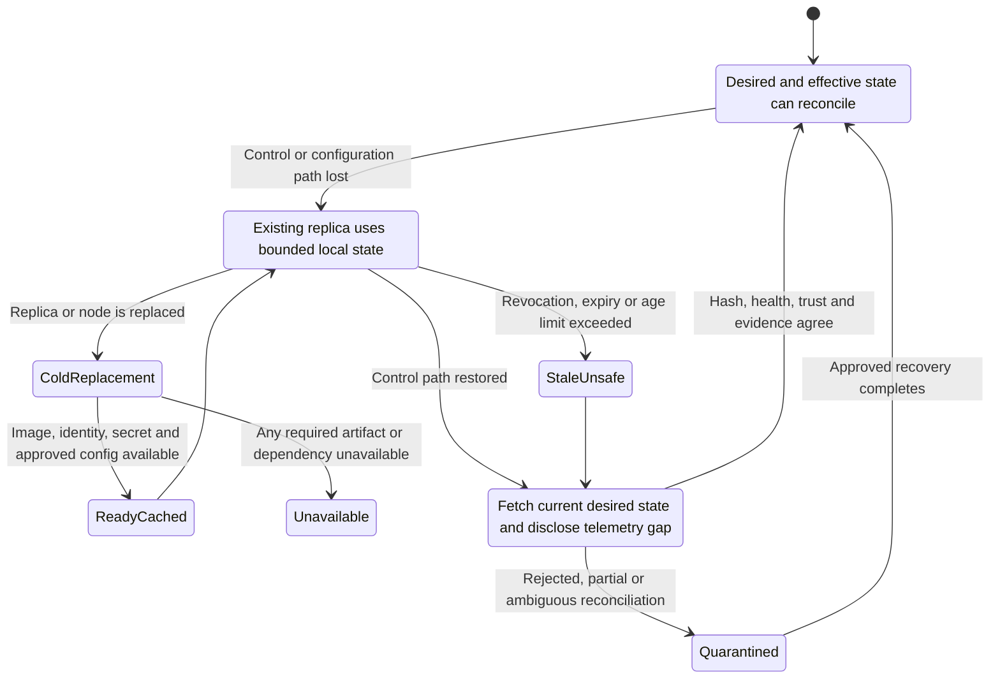

<!-- study-contract: principal -->

# Hybrid-cloud requirements

| Field | Value |
|---|---|
| Artifact type | architecture-study |
| Decision question | Which hybrid-runtime properties are mandatory, and what evidence distinguishes useful workload locality from a control-plane dependency merely relocated onto customer Kubernetes? |
| Decision owner | API-platform assessment design authority with security, resilience and operations approvers |
| Primary audiences | Executives, architects, network/security engineering, SRE, Kubernetes/platform teams, developers, DevOps and sourcing |
| Scope | Managed gateway benchmark; SaaS-control/customer-runtime; self-managed control/runtime; and incumbent integration-runtime coexistence across AKS, private data centre and cloud backends |
| Evidence state | Requirements and hypotheses; cited mechanisms are E1 official-documentation evidence, while all RE-1 inputs and candidate outcomes remain unobserved |
| Reference case | Synthetic [RE-1](41-enterprise-reference-case.md): J-03 and J-06, with I-02, I-03, I-05 and I-06 |
| As-of date | 2026-08-17; revalidate versions, entitlements, regions, endpoints and support terms before each gate |
| Next gate | Approve exact candidate topologies and the state-by-state E3 fault matrix before retaining a hybrid variant on the shortlist |

## Provisional answer

Require hybrid placement only where it produces a measurable benefit—request/data locality, private reachability, failure-domain control or staged migration—and only when the enterprise can operate the transferred runtime obligations. Confidence is high in this requirements model and low in any candidate fit until tested. A “self-hosted gateway” label is insufficient: existing traffic, cold restart, clean scale-out, urgent revoke, certificate expiry, telemetry loss and reconnection are separate states with different dependencies.

Do not require every finalist to place a runtime on AKS. A managed gateway is a legitimate benchmark when its network path, residency and latency meet the decision contract; it can be operationally safer than a customer-hosted runtime that the enterprise cannot patch, scale or diagnose. Conversely, a SaaS control plane is not automatically disqualified when request payloads stay in an approved runtime zone and every control/telemetry data category is acceptable. The decision turns on exact fields, flows, state and ownership—not deployment fashion.

## Deployment archetypes in scope

| Archetype | Exact logical boundary | Enterprise operating responsibility | Differentiating question |
|---|---|---|---|
| H-MGD — provider-managed control and runtime | Vendor operates management and request-processing planes in contracted regions; enterprise owns edge/DNS, policy, identity integration and backend connectivity | Network path, configuration, consumer/product lifecycle, identity, enterprise evidence and incident coordination | Does managed placement meet RE-1 path/residency/objectives with materially less operational risk? |
| H-SCP — SaaS control, enterprise-hosted gateway runtime | Vendor operates desired-state/product/portal services; enterprise runs data-plane containers near AKS/private backends | Kubernetes/VM capacity, ingress/LB, DNS, egress, images, certificates, local evidence, runtime availability and much diagnosis | Do locality and central management outweigh CP connectivity, entitlement and split-support constraints? |
| H-SELF — enterprise control and data planes | Enterprise operates control/API/database plus distributed runtimes; vendor supplies software/support | Everything above plus control database, backup/restore, Admin API, clustering PKI, upgrades and control-plane HA | Is regulatory/control benefit real enough to fund full lifecycle and recovery ownership? |
| H-INT — incumbent integration runtime during coexistence | Existing Mule/API proxies and integration flows remain for bounded workloads while the target gateway fronts selected routes | Legacy runtime, connector/state recovery, license, skills, route allocation and dual evidence | Which compound capabilities cannot move safely in the same wave as gateway policy? |

Candidate mappings are evaluated in [product shortlist](09-product-shortlist.md). The archetype is the unit of decision: Kong Konnect and self-managed Kong, Azure managed and self-hosted gateways, Apigee X and Hybrid, and MuleSoft Runtime Fabric do not share one support or failure boundary.

## Scenario assumptions and required outcomes

All topology counts, regions, durations, traffic levels and objectives below are **scenario assumptions** inherited from RE-1, not observed estate facts or product benchmarks.

The narrowed scenario places partner J-03 traffic through an enterprise edge into two Canadian runtime zones, with private backends in AKS and a data-centre legacy path. J-06 pushes a policy/certificate change to every serving runtime. The test introduces I-02 control-path isolation and a restarted replica, I-03 old/new CA overlap, I-05 telemetry destination throttling, and I-06 regional failover with a deliberately stale data/configuration signal. A remote/private zone has constrained egress and must not receive a broad internet exception merely to satisfy a product agent.

The decision owner must calibrate before testing:

- acceptable control-plane and configuration/consumer/analytics/support-data locations;
- maximum desired-versus-effective configuration age by API class;
- whether urgent revoke must work during isolation and which local actor may contain traffic;
- existing-replica, cold-restart and clean-scale-out recovery objectives;
- required request/telemetry continuity and explicit loss budget;
- contractual support division across vendor, Kubernetes, network, observability and third-party components; and
- whether a managed path is an approved alternative for each workload zone.

## Mechanism analysis: disconnected runtime states

**Figure 06-1 — Hybrid resilience is a progression of state, not an “offline” checkbox.**

- **Depicted scope:** connected operation, loss of the control/configuration path, bounded service by an existing replica, stale/unsafe state, cold replacement, cached readiness, reconnection, quarantine and approved convergence.
- **Excluded scope:** candidate-specific cache persistence, bootstrap implementation, configuration protocol, license/secret/certificate storage, traffic-admission control, telemetry buffer, timing, regional data authority and support procedure.
- **Diagram source, evidence state and as-of:** inline vendor-neutral synthesis from RE-1 I-02/I-06 and the official Kong, Azure API Management, Apigee Hybrid and MuleSoft mechanisms cited after the state table; E1-informed hypothesis with no candidate execution result; 2026-08-17.
- **Accessible equivalent:** a connected runtime may enter an isolated-serving state after its control path fails; expiry or excessive age makes that state unsafe, while node replacement requires image, identity, secrets and approved configuration before readiness. Restored connectivity does not itself mean recovery: the runtime must reconcile current desired state and telemetry gaps, enter quarantine when state is partial or ambiguous, and return to connected only after hash, health, trust and evidence agree. The following state table supplies the equivalent continuation, dependency and evidence rules.

**Figure interpretation:** Figure 06-1 prevents a warm-data-plane success from being reported as hybrid resilience. Cold replacement, expiry/revoke, telemetry recovery and convergence have separate gates.

**Figure limitation:** The states are a common test oracle, not a claim that candidates share one cache, bootstrap, quarantine or recovery implementation. Transition availability and duration remain exact-option E3 observations; the figure declares no timing or pass result.

### State and dependency contract

| State | What may continue | What normally stops or degrades | Dependencies that decide the result | Evidence required |
|---|---|---|---|---|
| Connected | Request proxying, policy, configuration, telemetry and administrative change | Nothing by definition, though component partial failure still applies | DNS, edge/LB, backend, identity/PKI, control channel, stores, telemetry | Active config ID/age, control connection, request outcome, telemetry integrity |
| Isolated existing replica | Last accepted policy and locally resolvable auth/backend flows, within approved age | New config/product/consumer changes; SaaS status and analytics may lag/drop | Cached config/keys, certificate/license expiry, local counter/secret/backend state | J-03 valid/invalid calls, config age, revocation limitation, loss/queue disclosure |
| Isolated cold replacement | Only when image, bootstrap identity, secret, plugins/license and approved persisted config are reachable | Scale-out or recovery can fail even when another replica still serves | Registry/cache, storage, service account, PKI, fallback config, scheduler/node capacity | Clean-node artifact trace, runtime identity/hash, readiness transaction |
| Urgent containment | Traffic withdrawal, local firewall/edge action or documented local configuration where governed | Central product/policy change cannot reach isolated runtime | Delegated authority, edge/LB, local runbook and later reconciliation | Actor/approval, scope, time, effective denial and authoritative-state restoration |
| Reconnecting | Fetch current desired state and resume export | Partial/version-incompatible configuration, replay surge and stale local override may persist | Version/plugin compatibility, ordering, buffer limits, source of truth | Desired/effective comparison, rejected state, audit/telemetry gap, recovery decision |
| Regional loss | Surviving ready runtime may serve | Management portal, counters/caches/data or particular regions may be unavailable | Global routing/DNS, config/data replication, identity, regional dependencies | Traffic allocation, freshness epochs, transaction reconciliation and client convergence |

Official documentation confirms materially different mechanisms that must not be flattened. Kong hybrid separates database-backed control nodes from database-less data planes; data planes cache configuration and have explicit restart, new-node, version/plugin and disconnected-operation constraints ([Kong hybrid mode](https://developer.konghq.com/gateway/hybrid-mode/)). Azure's self-hosted gateway is a container federated to one API Management instance, regularly checks configuration and needs outbound control connectivity; Microsoft assigns hosting, capacity, uptime and complex network responsibility to the customer ([self-hosted overview](https://learn.microsoft.com/en-us/azure/api-management/self-hosted-gateway-overview), [support policy](https://learn.microsoft.com/en-us/azure/api-management/self-hosted-gateway-support-policies)). Apigee Hybrid places Message Processors, Synchronizer, Cassandra and MART in the customer Kubernetes runtime while Google hosts the management plane ([Apigee Hybrid architecture](https://docs.cloud.google.com/apigee/docs/hybrid/v1.16/what-is-hybrid)). MuleSoft Runtime Fabric uses a customer Kubernetes cluster and an agent/control-plane relationship; the customer supplies ingress, load balancing, log forwarding, monitoring and core cluster/network operations ([Runtime Fabric responsibilities](https://docs.mulesoft.com/runtime-fabric/latest/)). These are documented facts for test design, not evidence that any topology meets RE-1.

## Mandatory requirement set

| Requirement | Mandatory mechanism-level question | Disqualifying condition | E3 proof |
|---|---|---|---|
| Data and metadata location | Which exact payload, config, credential, consumer, portal, analytics, audit, support and backup fields cross each boundary? | Mandatory data class enters an unapproved region/operator or cannot be identified | Tagged synthetic records plus flow/storage/processor ledger |
| Runtime locality | Does the request and backend path remain in the intended zone, including identity, secrets and telemetry? | “Local gateway” still hairpins material request data or creates unacceptable synchronous distance | DNS-to-backend packet path and dependency latency/fault trace |
| Disconnected continuity | How do existing, restarted and new replicas obtain configuration, image, plugin, key, secret and license? | Candidate claims continuity only for a warm process or serves unknown/stale state beyond approved age | State-by-state isolation and clean-node run |
| Configuration truth | Where are desired and effective state stored, and can every runtime attest revision/age? | Portal reports completion while any serving runtime is stale/unknown | J-06 deployment plus incompatible/partial config injection |
| Urgent security action | How is a consumer, CA or route contained while control is isolated? | Mandatory revoke objective has no native or sustainable local mechanism | I-03/I-02 revoke and edge/local containment test |
| Least-privilege networking | Which component initiates every control, artifact, identity and telemetry connection? | Broad wildcard internet egress or undocumented inbound management is required | Generated endpoint/flow matrix and deny-one-flow-at-a-time test |
| Telemetry independence | What buffers, drops or blocks when vendor/enterprise analytics is slow? | Optional export can exhaust request resources or loss is undisclosed | I-05 throttle, queue/drop reconciliation and request-impact profile |
| Regional recovery | Which configuration, counter, consumer, cache and data state is replicated or reconstructed? | Traffic can enter a region whose runtime/data identity is unknown or stale | I-06 failover with composite readiness and reconciliation |
| Supportability | Who diagnoses Kubernetes, CNI, mesh, firewall, LB, proxy, certificate and gateway interaction? | Critical incident can fall into an unowned support seam with no escalation clock | Contract/RACI evidence plus joint diagnostic game day |
| Economic fit | What platform labour, cluster capacity, egress, observability, support and license are transferred? | Locality benefit is outweighed by unstaffed or unaffordable lifecycle burden | Scenario TCO and staffed on-call/recovery model |

## Operational failure modes and real-world challenges

| Failure | Deceptive symptom | Required response |
|---|---|---|
| Control endpoint DNS/proxy failure | Existing traffic works, so operators assume the zone is healthy | Alert on control connection/config age independently; test resolver, proxy and certificate chain |
| Stale restarted replica (I-02) | Pod is ready but loaded old fallback/cached config | Quarantine on approved config digest/epoch and route a known transaction before advertising |
| Registry or secret unavailable during node loss | Autoscaler adds nodes but no usable gateway capacity appears | Pre-position governed artifacts where justified; expose scale-blocked state and reserve headroom |
| Certificate/license expiry while isolated | Last-known configuration exists but runtime or trust stops | Inventory every expiry, overlap rotations, alert by state and define local containment |
| Split configuration after reconnect | Some replicas reject a plugin/policy or keep local override | Stop promotion, identify authoritative revision, reconcile per runtime and record rejected reason |
| Telemetry recovery surge | Buffered data floods egress/collector after reconnect and harms live traffic | Bound and rate-limit drain; prioritize safety signals; disclose duplicate/drop/gap |
| Support ping-pong | Vendor validates container while cluster/network teams validate their layers separately | Pre-agreed evidence bundle, incident commander and time-bound cross-party escalation |
| Regional routing before data readiness | Gateway returns HTTP 200 against stale backend state | Composite readiness includes backend/data epoch, not gateway process health alone |

## Counterarguments and non-fit conditions

- **“Hybrid is required for compliance.”** Sometimes; often only particular payload, key or operator paths are constrained. Field-level classification may permit a managed option and avoid unnecessary customer runtime risk.
- **“SaaS control means customer traffic leaves the network.”** Not necessarily. It remains an open question until request, debug, analytics and support fields are traced for the exact feature set.
- **“Existing replicas continue, so the runtime is highly available.”** That excludes replacement, scale, expiry, revoke and reconnection. It is a non-fit when these states miss the journey objective.
- **“Self-managed removes vendor dependency.”** It trades managed-service dependency for software supply, licensing, upgrade and support dependency while adding database/PKI operations. It is non-fit when the organization cannot own those obligations.
- **“AKS standardizes all runtimes.”** Controllers, agents, generated resources, CRDs, support matrices and desired-state authorities differ. Common infrastructure does not equal common operations.
- **“One governance model means one control plane.”** A canonical contract and evidence model can govern more than one runtime. Forced physical centralization is non-fit when it conflicts with locality, failure or acquisition constraints.

## Decision implications

1. Define hybrid success per state and workload zone; delete the binary “supports hybrid” criterion.
2. Keep a managed-runtime benchmark for every shortlisted hybrid variant so transferred operations have an explicit value test.
3. Require field-level location and responsibility ledgers before E3, not after security review.
4. Treat cold replacement, urgent revoke, telemetry backpressure and reconnect reconciliation as mandatory gates alongside warm proxy continuity.
5. Include customer-operated Kubernetes/network/on-call and cross-party support costs in the platform decision.

## Falsification and proof plan

| Hypothesis to challenge | Procedure | Measure and threshold | Artifact and reviewer | Decision impact |
|---|---|---|---|---|
| Local runtime keeps approved data in the intended zone | Tag synthetic payload/config/consumer/telemetry/support fields and exercise normal/debug/error flows | 100% of fields accounted for; zero mandatory fields at unapproved destination | Flow/storage ledger and safe captures; privacy/security review | Unknown or prohibited transfer removes topology or feature. |
| Isolation behavior is predictable across states | Block control path; run existing replicas, restart one, remove a node and request scale-out | Each state meets its pre-approved objective; zero false-ready/unknown-config replicas | Fault timeline, runtime/config/artifact evidence; SRE review | Warm-only success cannot pass; redesign capacity/cache or exclude. |
| Urgent revoke and certificate rotation remain safe | Revoke partner/route and rotate old/new CA before/during isolation and after reconnect | Approved J-03 containment/rotation objective met; zero unaccounted old trust after closure | PKI/IdP events, request probes, per-runtime config; security review | Unsatisfied mandatory revoke makes variant non-fit. |
| Regional recovery does not serve stale state | Fail runtime region while secondary has deliberately stale data/config, then restore | Traffic only reaches composite-ready region; zero unexplained J-03 outcomes | Routing/readiness/config/data epochs and reconciliation; resilience review | Revise routing/topology or reject regional design. |

## Risks and limitations

- Official documentation establishes mechanisms, not contracted edition/region entitlement, enterprise configuration, achieved duration or support outcome.
- RE-1 is synthetic. Actual private connectivity, latency, residency and staff capacity could favour a different archetype.
- The study does not score candidate commercial terms, sovereign offerings or exact regional availability; those are volatile E2 requests.
- Runtime isolation may preserve request processing while product, portal, analytics or audit services remain unavailable; those user journeys need separate objectives.
- A PoC cannot prove vendor incident performance or long-term upgrade effort; contract review and a representative pilot remain necessary.

## Open evidence requests

| Evidence request | Owner role | Due gate | Decision impact if absent |
|---|---|---|---|
| Exact candidate edition, region, runtime/control topology, support matrix, entitlement and endpoint inventory | Vendor technical lead + procurement | Before E3 design freeze | Variant remains undefined and cannot be tested or scored. |
| Enterprise field-level residency/processing decisions and approved egress/proxy/private-DNS constraints | Privacy/security + network architecture | Before shortlist confirmation | Hybrid necessity and feasibility remain assumptions. |
| Calibrated existing/cold/scale/revoke/reconnect/failover objectives and local containment authority | Product risk + SRE + security | Before fault-test freeze | No auditable pass/fail threshold exists. |
| Staffed operating model and TCO for each customer-operated component | Platform owner + service management + FinOps | Before recommendation | Operational/economic fit remains unknown despite technical success. |

## Next gate

The next gate is a **hybrid topology and fault-matrix approval** chaired by architecture with security, privacy, network, Kubernetes, SRE, API product, procurement and each vendor technical lead. It passes only when every candidate is an exact deployable variant, field flows and responsibilities are mapped, state-specific objectives are approved, the managed benchmark is retained where feasible, fault injection and restricted evidence handling are ready, and unresolved support seams have an owner/escalation path. Passing authorizes E3 testing; it does not declare hybrid the preferred model.
