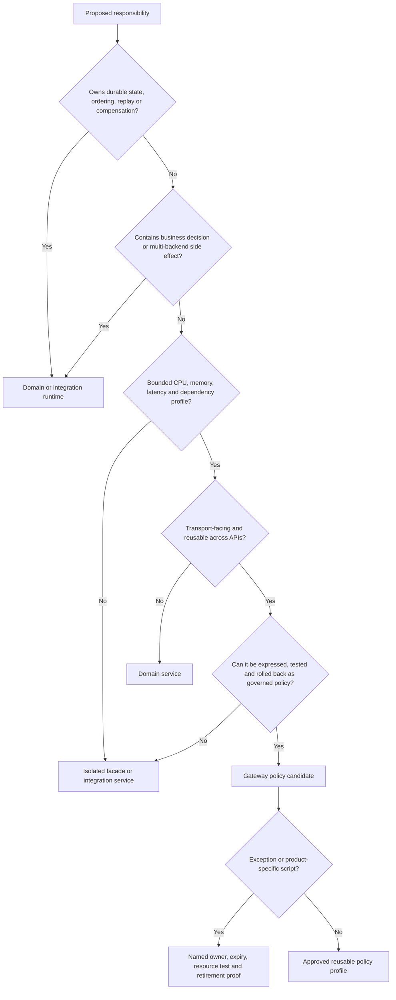

<!-- study-contract: principal -->

# API gateway versus integration runtime

| Field | Value |
|---|---|
| Artifact type | architecture-study |
| Decision question | Which responsibilities may execute in the gateway, and which must remain in domain or integration runtimes to preserve correctness, isolation, recovery and sustainable ownership? |
| Decision owner | Enterprise architecture design authority with API platform and domain engineering owners |
| Primary audiences | Architects, developers, DevOps, platform engineering, integration engineering, SRE, security and API product owners |
| Scope | Synchronous API gateway policies, thin compatibility facades, domain services, workflow/orchestration, transformation, messaging, files/batch and state; products and implementation languages remain open |
| Evidence state | Architecture hypothesis grounded in protocol and official runtime documentation; RE-1 inputs are scenario assumptions and no placement has observed production evidence |
| Reference case | Synthetic [RE-1](41-enterprise-reference-case.md), especially J-01, J-04, J-05 and I-01/I-04/I-05/I-07/I-08 |
| As-of date | 2026-08-17 for linked standards and product mechanism references |
| Next gate | Design authority approves the placement rubric and exception contract, then applies it to the Mule workload inventory before migration-wave funding |

## Provisional answer

Put only **transport-facing, request-bounded and independently governable controls** in the gateway. Put durable state, business decisions, multi-step work, connector interaction, complex transformation, asynchronous delivery and compensation in domain or integration runtimes. Confidence is high in the boundary rule and zero in any workload classification until code, state, triggers and failure behaviour are inspected.

The boundary is not “simple versus complex” by line count. A five-line retry around a non-idempotent payment can be more dangerous than a large pure mapping. Placement turns on semantics: state ownership, side effects, latency/resource profile, failure recovery, testing, release cadence, data sensitivity and team accountability. A bounded mapping may remain at the gateway when it is deterministic, streaming-safe, contract-owned and cheap enough to share the request failure domain; the same mapping belongs outside when it materializes large payloads, invokes reference data, branches by business state or needs independent scaling.

## Scenario assumptions and placement pressure

All RE-1 traffic rates, payload distributions, timings, incidents, team capacity and objectives are **scenario assumptions**, not current-state facts or measured platform results.

The decision is exercised with four intentionally different journeys:

- **J-01 confirmed money transfer:** an HTTP response can be lost after durable commit; retry must not create a second outcome.
- **J-04 digital onboarding:** large documents and long downstream validation can consume CPU/memory and need resumable checkpoints.
- **J-05 settlement file:** file acceptance, record journal, ordering, restart and reconciliation outlive an HTTP request.
- **J-06 configuration propagation:** a gateway policy change and an integration-service change may have different rollout/rollback semantics but must remain release-correlated.

I-04 asks whether onboarding transformation can starve payment routing; I-05 asks whether logging/export can consume request resources; I-07 injects a syntactically valid but semantically new enum; I-08 makes an application rollback incompatible with a data/schema change. These cases force ownership and recovery decisions that a feature checklist hides.

## Mechanism analysis: placement decision

**Figure 07-1 — A responsibility stays in the gateway only when every branch preserves request-bounded, stateless and independently operable semantics.**

- **Depicted scope:** placement decisions for durable state, business decisions, multi-backend effects, resource/dependency bounds, transport reuse, governed policy expression and time-bounded exceptions.
- **Excluded scope:** product-specific plugin availability or entitlement, measured resource cost, the organization’s observed workload inventory, detailed domain decomposition, and approval of any individual exception.
- **Diagram source, evidence state and as-of:** inline architecture interpretation derived from RE-1 failure pressure and the HTTP/OAuth standards and placement evidence in this study; no automated classification or observed workload result; 2026-08-17.
- **Accessible equivalent:** responsibilities that own durable state, ordering, replay, compensation, business decisions or multi-backend side effects go to a domain or integration runtime. Stateless work with an unbounded resource/dependency profile goes to an isolated service. Only transport-facing, reusable, bounded work that can be governed, tested and rolled back as policy becomes a gateway candidate; product-specific scripts additionally require an owner, expiry, resource test and retirement proof. The capability matrix below applies the same logic concern by concern.

**Figure interpretation:** Figure 07-1 makes state and failure semantics precede convenience or hop count. A responsibility can be small yet still require a domain/integration runtime; gateway placement is conditional on all gates and any exception expires.

**Figure limitation:** The tree is a governance aid, not an automated classifier or proof that a particular product can execute the accepted responsibility safely. Candidate capability, entitlement, measured resource isolation and organization-specific ownership can still force a different placement.

HTTP only permits automatic retry of a non-idempotent request when the client knows the request semantics are idempotent ([RFC 9110](https://www.rfc-editor.org/rfc/rfc9110.html#name-idempotent-methods)). Therefore a gateway retry toggle cannot create J-01 safety; the backend/domain needs a durable idempotency/outcome contract. OAuth best current practice also separates authorization protocol safeguards from resource-server business authorization ([RFC 9700](https://www.rfc-editor.org/rfc/rfc9700.html)); token validation at the gateway does not replace object-level decisions in the domain.

## Capability placement matrix

| Concern | Gateway default | Domain/integration default | Mechanism and consequence | Exception test |
|---|---:|---:|---|---|
| TLS termination, JWT/API-key validation, coarse scopes, header controls | Yes | No | Enforce at the first trusted API boundary; preserve verified identity context to backend | Issuer owns token creation; object/transaction authorization remains domain-owned |
| Request size, schema/threat and traffic controls | Yes | Sometimes | Reject unsafe transport/payload shapes before backend, with bounded parsing/resource use | Large/streamed/binary validation moves to isolated service when gateway must materialize or deeply inspect |
| Endpoint routing, timeout and bounded retry | Yes | Sometimes | Central routing is contract-facing; retry is permitted only for explicitly safe semantics and one retry owner | No blind retry for J-01; async retry needs durable queue/outcome state |
| Small deterministic header/query/body compatibility mapping | Conditional | Conditional | Pure mapping may reduce facade sprawl, but it shares gateway release and blast radius | Must have golden corpus, strict resource budget, no reference-data call and retirement date |
| Complex JSON/XML/DataWeave transformation | No | Yes | Format/semantic conversion requires independent testing, resource isolation and often reusable libraries | Only a proven pure bounded subset may remain in gateway; not “because policy can run code” |
| Multi-step orchestration and compensation | No | Yes | Needs durable state machine, correlation, timeout recovery and business ownership | No production exception; gateway may initiate or query workflow |
| Business authorization/decisioning | Coarse enforcement | Yes | Gateway validates identity/declared claims; domain evaluates current object, consent, balance and risk context | External policy decision service may decide, but domain owns semantics and fallback |
| Queue, event, webhook, file and batch processing | No | Yes | Delivery, ordering, replay, poison handling, cut-off and journal exist beyond request lifetime | Gateway may authenticate/accept and enqueue through a bounded durable ingress service |
| Connector/database/SaaS interaction | No | Yes | Pooling, credential rotation, transactions, throttling and provider semantics need isolated lifecycle | Gateway service call only for narrowly approved auth/policy decision with bounded failure rule |
| Long-lived state and idempotency ledger | No | Yes | Correctness needs durable atomic ownership and reconciliation | Gateway propagates idempotency key and safe correlation only |
| Response cache and quota/rate counters | Conditional | Conditional | Transport cache/limit may sit at gateway; freshness, global consistency and fail behaviour must be explicit | Domain owns business inventory/financial limit; gateway cache cannot become authoritative data |
| Telemetry enrichment/export | Yes, bounded | Yes | Gateway records safe transport/policy/config context; domain records business outcome | Optional exporter must use bounded async path; payload/debug capture is time-bound and restricted |

MuleSoft documents DataWeave as its primary transformation language in Mule flows, including reusable functions/modules and format-specific behaviour ([DataWeave scripts](https://docs.mulesoft.com/dataweave/latest/dataweave-language-introduction)). That is evidence that a current Mule flow may contain integration semantics, not evidence that another gateway policy language can or should replace it. The mapping must be extracted as a versioned input/output contract and reimplemented where its resource, ownership and recovery characteristics fit.

## Policy complexity and exception contract

A gateway implementation is rejected when any of the following is true unless a design authority records a time-bounded exception:

| Guardrail | Why it matters | Exception evidence |
|---|---|---|
| Domain branching or business vocabulary decides outcome | Couples policy release to application semantics and weakens ownership | Named domain owner, reason a service cannot own it, exhaustive corpus and expiry |
| Persistent/local state influences correctness | Replica replacement, failover and parallelism can change result | Declared store/consistency/recovery, failure test and authoritative owner—normally forces external placement |
| Multi-backend transaction or compensation | Gateway has no durable workflow journal and transport timeout is not business outcome | No normal exception; move to domain/workflow runtime |
| Opaque embedded script/custom plugin | Expands supply-chain, sandbox, patch, resource and support risk | Source/reproducible build, SBOM/signing, limits, reviewer, version compatibility and retirement plan |
| Unbounded payload materialization, loops or external call | Creates I-04 blast radius and latency dependency | Worst-case payload/resource profile and isolation; otherwise externalize |
| Business application cadence controls gateway deployment | Couples unrelated APIs and enlarges release blast radius | Dedicated runtime/facade or re-partitioned ownership, not permanent shared-policy exception |
| Secret or credential transformation/forwarding | Can leak credentials or collapse workload identity | Explicit trust design, non-exportable identity and negative evidence |

An exception record contains: capability, affected routes, owner/on-call, implementation/version, trust/data classification, resource ceiling, dependency timeout/fail behaviour, test corpus, rollout/rollback class, monitoring, expiry and removal evidence. An expired exception blocks the next production change.

## Operational failure modes and counterexamples

| Failure/challenge | Gateway-heavy failure | Integration/domain-heavy failure | Required design response |
|---|---|---|---|
| I-01 response lost after commit | Infrastructure retry duplicates business action | Domain may still duplicate if idempotency store is non-atomic or key scope is wrong | Durable business outcome, status lookup and reconciliation; zero blind multi-layer retry |
| I-04 large transformation burst | Shared policy workers/heap delay every route | Facade pool can still saturate but blast radius is bounded if isolated | Separate deployment/capacity, streaming where possible, per-class limits and load proof |
| I-05 telemetry throttle | In-process exporter queue consumes gateway resources | Sidecar/collector can drop silently or overload node | Bounded queue, self-metrics, drop rule and resource isolation across both placements |
| I-07 new enum/date/decimal/null behaviour | Thin mapping silently defaults or emits incompatible representation | Reimplemented transform diverges from DataWeave semantics | Golden/edge corpus, property-based cases, semantic version and consumer compatibility gate |
| I-08 data/schema change | Old policy route is called rollback though backend is irreversible | Old service image is equally unsafe after destructive migration | Preclassified recovery: rollback, expand-contract, forward fix, restore/reconcile |
| Identity dependency unavailable | Gateway blocks all calls or accepts stale trust too long | Domain service may revalidate differently and contradict gateway | One trust profile, bounded cache/revoke rule, correlated denial reason and fault test |
| Control plane isolated | Gateway continues stale exception beyond expiry | Integration deployment may be current while routing remains old | Desired/effective state per runtime, local containment and correlated release manifest |

## Counterarguments and non-fit conditions

- **“Gateways are optimized for transformation.”** Some products offer capable policy languages. Capability is not placement proof; shared failure domain, debugging, release ownership and recovery still decide.
- **“A microservice for every mapping creates latency and sprawl.”** Correct. Pure, bounded, contract-owned mappings can stay in the gateway. The rubric avoids automatic externalization and requires measurement rather than ideology.
- **“Keep Mule because it already works.”** Bounded coexistence may be lower risk for J-05 or connector-heavy flows. It is non-fit as a default when license/skills/support concentration is unsustainable or a capability can be retired.
- **“Move everything to AKS to standardize operations.”** Kubernetes standardizes a substrate, not workflow, transformation or connector semantics. A custom service fleet can cost more than a retained/managed integration capability.
- **“Domain teams should own all policy.”** They should own domain semantics; shared gateway trust/traffic controls need consistent platform governance. Full delegation is non-fit without enforced profiles and runtime evidence.
- **“Fewer network hops are always faster.”** Large in-gateway work can increase queueing for every request. End-to-end p95/p99 and saturation behaviour, not hop count, decide.

## Decision implications

1. Apply the placement rubric per current Mule flow responsibility, not per application name or API specification.
2. Make state, side effect, recovery class and resource profile mandatory inventory fields before assigning a target.
3. Create approved gateway policy building blocks and a separate thin-facade/integration service pattern; teams need a safe destination besides “plugin or full Mule.”
4. Fund golden transformation corpora, business idempotency and reconciliation as migration products, not incidental test work.
5. Govern exceptions as expiring production risks with runtime evidence and removal plans.

## Falsification and proof plan

| Hypothesis to challenge | Procedure | Measure and threshold | Artifact and reviewer | Decision impact |
|---|---|---|---|---|
| Proposed gateway policy is bounded | Run worst-case valid/invalid payload, concurrency, downstream timeout and telemetry throttle against payment plus transform traffic | Payment slice meets approved objective; policy stays within resource ceiling; zero unbounded queue/state | Config/source, resource/latency profile and trace; platform/SRE review | Externalize capability or isolate gateway topology. |
| Reimplemented transformation is semantically equivalent | Build golden and edge corpus from approved Mule behaviour; compare target outputs/errors deterministically | 100% of mandatory corpus matches approved canonical semantics; zero silent default for new enum/null/precision cases | Versioned fixtures, diff and owner approval; domain/integration review | Hold migration or explicitly version the contract. |
| J-01 outcome is independent of gateway retry | Lose response after commit and exercise declared client/edge/gateway retry combinations | Exactly one outcome per key and queryable status for every ambiguous response | Raw transaction/idempotency evidence; product risk review | Do not migrate J-01 until durable mechanism exists. |
| Exception lifecycle is enforceable | Create one expiring compatibility shim, rotate dependency, roll back and pass expiry | 100% of exception fields/evidence present; expired exception blocks release; removal restores baseline | Exception record, pipeline result, runtime config; architecture review | Manual exception process is inadequate; automate gate before scale. |

## Risks and limitations

- The rubric is product-neutral and cannot predict the performance or sandbox quality of a particular policy/plugin implementation; E3 measurement is required.
- RE-1 scenario assumptions may overrepresent regulated/stateful flows; high-volume stateless APIs may justify more gateway functionality.
- “Complex transformation” has no universal size threshold. Resource, semantic and ownership evidence matters more than line count.
- Externalizing work adds a network hop, deployment, SLO and on-call service. The TCO must include this rather than portraying separation as free.
- Retaining Mule or selecting another integration capability is outside this page's vendor decision; it defines placement, not product.

## Open evidence requests

| Evidence request | Owner role | Due gate | Decision impact if absent |
|---|---|---|---|
| Flow-level Mule inventory with triggers, state, connectors, transformations, side effects, schedules and current recovery | Integration engineering + application owners | Before migration-wave classification | Placement remains speculation; no workload can be approved. |
| Candidate gateway policy/plugin resource and support limits for the exact topology/version | Vendor lead + platform engineering | Before E3 build | Bounded-policy hypothesis cannot be tested fairly. |
| Canonical J-01 idempotency/outcome and J-05 file journal/reconciliation design | Domain/product architecture | Before critical-journey migration | Gateway choice cannot make these journeys safe. |
| Approved exception schema, authority, expiry enforcement and independent reviewer | Architecture governance + security | Before first production migration | Gateway-monolith guardrail is not operational. |

## Next gate

The next gate is a **capability-placement and exception-contract review** chaired by enterprise architecture with API platform, integration, domain, SRE, security and product risk owners. It passes only when the rubric is accepted, the exception schema is enforceable, representative gateway-heavy and integration-heavy flows are classified, J-01/J-05 state mechanisms have owners, and E3 resource/semantic fixtures are ready. The gate approves placement rules, not automatic retirement of Mule or adoption of a replacement runtime.
