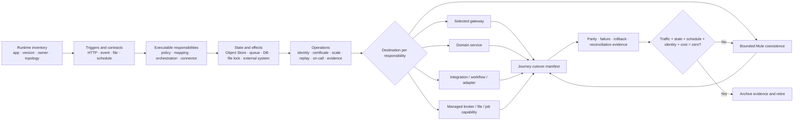

<!-- study-contract: principal -->

# MuleSoft capability decomposition

| Field | Value |
|---|---|
| Artifact type | principal-study |
| Decision question | How must each Mule workload be decomposed so gateway policy, transformation, workflow, messaging, file/batch, state and operational obligations move to safe destinations without functional loss or premature decommission? |
| Decision owner | Migration design authority with accountable integration and domain service owners |
| Primary audiences | Executives, migration leads, architects, Mule developers, domain developers, DevOps, SRE, platform engineering, security and FinOps |
| Scope | Mule application/API proxy responsibilities, DataWeave, connectors, Object Store, VM queues, schedules/batch/files, API management, deployment/evidence and bounded coexistence; target products remain open |
| Evidence state | Decomposition method and migration hypotheses; cited Mule mechanisms are E1 official-documentation evidence; RE-1 inventory and outcomes are scenario assumptions |
| Reference case | Synthetic [RE-1](41-enterprise-reference-case.md), especially J-01, J-03, J-05 and I-01/I-03/I-07/I-08 |
| As-of date | 2026-08-17 for linked MuleSoft mechanism documentation |
| Next gate | Inventory owners complete and independently review decomposition packets for representative gateway-dominant, stateful and file/batch workloads before wave sequencing |

## Provisional answer

Do not migrate or retire a Mule application as one indivisible unit. Decompose each inbound trigger, contract, policy, transformation, side effect, state store, asynchronous handoff, schedule, credential and operational procedure, then assign a destination and recovery proof to each. Confidence is high in the method and deliberately zero in any workload destination until the current implementation and runtime state are inspected.

The default destination is not “the new gateway.” Transport-facing authentication, bounded validation, quota and routing may move to the selected API gateway. Complex DataWeave, orchestration, connector calls, object/queue state, file/batch and compensation move to domain or specialized integration capabilities—or remain on Mule for a bounded period. Retirement occurs only when traffic, schedules, queues, state, credentials, certificates, consumers, support ownership and financial/license dependencies reach evidenced zero.

## Scenario assumptions and migration slice

Every workload count, traffic rate, incident, duration, date, objective and staffing value inherited from RE-1 is a **scenario assumption**, not observed inventory or benchmark evidence.

The method is tested on three synthetic shapes:

- **Gateway-dominant J-03 facade:** inbound partner mTLS/OAuth, quota, small mapping and backend route; I-03 forces certificate-chain overlap and credential ownership transfer.
- **Stateful J-01 orchestration:** request validation, DataWeave mapping, two backend calls, Object Store correlation and ambiguous timeout; I-01 forces exactly-one business outcome and reconciliation rather than transport retry.
- **J-05 settlement file:** SFTP pickup, naming/lock convention, record transform, broker/database writes, exception journal, schedule and cut-off; I-07/I-08 force semantic compatibility and state-aware recovery.

These shapes are intentionally not ranked by ease. A low-volume file or scheduler can be harder and riskier than a high-volume proxy because recovery and operational handoffs are hidden outside the API specification.

## Mechanism analysis: the decomposition packet

**Figure 08-1 — Migration decisions start from executable responsibilities and state, then converge on a journey-level cutover and retirement proof.**

- **Depicted scope:** discovery from runtime and trigger inventory through executable responsibility, state/effects and operational ownership; destination choice by responsibility; journey cutover; parity/failure/rollback/reconciliation proof; and dependency-zero retirement.
- **Excluded scope:** an observed Mule estate inventory, automatic code conversion, candidate-specific target design, wave size or schedule, commercial/license decisions, data-migration implementation and any claim that a listed destination has passed proof.
- **Diagram source, evidence state and as-of:** inline migration-method synthesis from synthetic RE-1 and the official Mule runtime, DataWeave, Object Store and VM Connector mechanisms cited in this study; method hypothesis with no inventoried or migrated RE-1 workload; 2026-08-17.
- **Accessible equivalent:** inventory identifies runtimes and triggers, then decomposes executable logic, durable state/external effects and operational duties. Each responsibility is assigned to a gateway, domain service, integration/workflow service, managed broker/file/job capability or bounded Mule coexistence. Those destinations converge on a journey cutover manifest; retirement occurs only after parity, failure, rollback and reconciliation evidence and after traffic, state, schedules, identity and cost dependencies reach the approved zero condition. The decomposition-record and destination tables below provide the field-level equivalent.

**Figure interpretation:** Figure 08-1 prevents application count or API inventory from becoming a migration plan. Every responsibility gets a destination, but decommission waits for journey-level evidence and zero-dependency proof.

**Figure limitation:** The sequence is a decomposition and decision contract, not an inventory result, migration design or proof that every responsibility can be separated cleanly. Shared state, hidden triggers, proprietary behavior, commercial constraints or unsafe data movement can require bounded coexistence or a different cutover unit.

Mule runtime can combine routing, mapping, orchestration, policies and connectors inside an application, and its embedded gateway can apply API policies ([Mule runtime overview](https://docs.mulesoft.com/mule-runtime/latest/)). DataWeave is the primary Mule transformation language and can appear in Transform Message components, inline expressions and reusable modules ([DataWeave scripts](https://docs.mulesoft.com/dataweave/latest/dataweave-language-introduction)). Therefore counting API proxies or OpenAPI files does not reveal transformation or workflow scope.

### Required decomposition record

| Record area | Minimum fields | Hidden-risk question | Required owner |
|---|---|---|---|
| Runtime/deployment | app/domain/API instance, Mule/runtime/connector versions, target, replicas/cluster, properties, shared domain, artifact coordinates | Does another app share a domain, certificate, pool or runtime lifecycle? | Mule/platform owner |
| Triggers/contracts | HTTP listener/path/method, broker/topic/queue, file/SFTP directory/pattern, scheduler/time zone, manual/replay trigger | Which work exists with no API specification or direct consumer traffic? | Service owner |
| Policy and identity | client auth, token/cert validation, claims/scopes, rate/quota, TLS, backend credential, secret source, rotation | Where does identity change shape or collapse into a shared credential? | Security/IAM + API owner |
| Transformation | DataWeave/scripts, input/output formats, schemas, examples, decimal/date/null/encoding rules, reference data | Is the mapping pure and deterministic, or dependent on external/current state? | Domain/integration owner |
| Orchestration/effects | calls, ordering, transactions, retries/timeouts, parallelism, compensation, outcome lookup | Can a step commit before the caller sees success, and how is it reconciled? | Domain product owner |
| State | Object Store keys/TTL/persistence, VM queues, broker offsets, DB tables, file locks, cache, idempotency/correlation | What survives restart/failover, and which state must migrate atomically? | Data/runtime owner |
| Operations | scale/resource profile, backpressure, health/readiness, alerts, dashboards, runbooks, support, manual reconciliation | What does after-hours support do that is not represented in code? | SRE/operations |
| Consumers/dependencies | consumers, products/contracts, upstream/downstream, IP allow-list, certificates, schedules, batch windows, vendor/license cost | Which dependency can keep the runtime alive after traffic reaches zero? | Product owner + FinOps |

Mule Object Store supports key-value state such as watermarks and tokens but is not a transactional database and does not provide ACID semantics for concurrent updates ([Object Store Connector](https://docs.mulesoft.com/object-store-connector/latest/)). VM Connector can use transient or persistent queues with different crash behaviour, and current documentation states persistent VM queues are unavailable on CloudHub 2.0 and Runtime Fabric ([VM Connector](https://docs.mulesoft.com/vm-connector/latest/)). These facts make runtime target and state semantics part of the decomposition; copying flow XML or repackaging a container cannot establish equivalent recovery.

## Responsibility-to-destination decision table

| Current responsibility | Preferred destination hypothesis | Coexistence/non-fit condition | Migration evidence |
|---|---|---|---|
| API routing/facade and stable hostname | Selected gateway route/service plus canonical contract | Keep facade if mapping/error semantics cannot yet be separated safely | Contract, path/header/error and negative parity corpus |
| Authentication, coarse authorization and rate/usage controls | Gateway with enterprise IdP/PKI and explicit counter store where required | Retain until exact product/policy/consumer binding and rotation are ready | Token/cert negative matrix, limit state/failure and runtime config identity |
| Small deterministic transport mapping | Gateway only if it passes placement guardrail; otherwise thin facade | Non-fit for gateway when domain branching, state, large payload or independent scaling exists | Golden corpus, worst-case resource profile and exception expiry |
| Complex DataWeave or canonical mapping | Domain/integration service or retained Mule | Retain when semantic corpus/owner is missing or target runtime lacks safe format/stream support | Versioned golden/edge corpus including errors, null/decimal/date/encoding |
| Multi-step orchestration/business process | Domain service or workflow/integration runtime | Never move to gateway; bounded Mule coexistence may be lower risk than rushed rewrite | State machine, side-effect order, timeout, retry, compensation and reconciliation tests |
| Object Store/cache/watermark | Purpose-built durable store or cache with explicit consistency | Retain until keys, TTL, concurrency and recovery are discovered | State inventory/export, parallel update, failover and reconciliation evidence |
| VM/internal queue | Approved broker/event mechanism or refactored in-process call where loss is acceptable | Runtime target can change queue availability/semantics; do not infer portability | Delivery/order/replay/poison/serialization and crash tests |
| SaaS/database/mainframe connector | Bounded adapter/service or approved integration platform | Retain where vendor/protocol expertise, certification or transaction semantics are not reproducible economically | Security, pool/throttle, retry, schema, failover and vendor-support proof |
| SFTP/MFT and file journal | Managed file-transfer plus processing service and durable receipt/reconciliation | Retain until file lock, duplicate, cut-off, encryption and operator handoff are explicit | Duplicate pickup, partial file, restart, cut-off and end-to-end reconciliation |
| Scheduler/batch | Managed job/workflow capability with durable checkpoint | Retain if schedule ownership, time zone, missed run and restart semantics are unknown | Clock change, overlap, missed/duplicate run, checkpoint and audit evidence |
| API catalog/portal/product | Selected API-management/catalog capability | Coexist if consumer/contract/credential migration cannot be atomic | Discovery, application/product mapping, secret rotation and runtime revoke |
| Analytics/audit | Gateway/domain signals plus enterprise observability/SIEM | Retain required historical evidence until export/retention obligations close | Field mapping, completeness, redaction, retention and incident query |
| Candidate for retirement | Remove only after independent zero proof | A “duplicate” may be fallback, manual recovery or off-hours schedule | Owner confirmation plus traffic/state/schedule/identity/cost zero evidence |

Runtime Fabric itself is not a decomposition shortcut: MuleSoft documents that it deploys Mule applications and API gateways into a customer-managed Kubernetes cluster, with each application in its own Mule runtime/container and shared responsibility for cluster, ingress, network and monitoring ([Runtime Fabric overview](https://docs.mulesoft.com/runtime-fabric/latest/)). Moving the same compound flow onto Kubernetes may change hosting while retaining application coupling, license and control-plane dependency.

## Migration and cutover mechanism

Each journey release manifest binds old and new implementations:

| Manifest section | Required content | Cutover consequence |
|---|---|---|
| Contract and traffic | host/path/method/protocol, consumer/product, allocation rule, retry owner and error contract | Edge/gateway changes cannot silently change consumer semantics |
| Identity/trust | old/new client/backend IDs, scopes, certificates/CA chains, secrets, overlap/revoke plan | I-03 rotation and rollback do not leave uncontrolled duplicate trust |
| State/effects | source/target stores, ownership, migration/checkpoint, in-flight handling, idempotency/reconciliation | J-01/J-05 correctness is proven beyond HTTP success |
| Artifact/config | immutable Mule and target artifacts, schema/mapping version, gateway/config IDs, tool versions | Every result is attributable and rebuildable |
| Observability | correlation mapping, SLO/error taxonomy, evidence store, expected gaps | Dual running can be compared without leaking payloads |
| Recovery | reversible/expand-contract/forward-fix class, triggers, authority, data restoration and reconciliation | I-08 cannot be mislabeled as a simple image rollback |
| Decommission | traffic, schedules, queues/state, credentials/certs, DNS/routes, monitoring, backup/retention, license/support | Retirement is a gated outcome rather than end-of-sprint cleanup |

Traffic movement can use canary allocation, consumer cohorts, shadowing or replay only where semantics and data controls allow. Non-idempotent J-01 must not be dual-written to prove parity. Prefer read-only comparison, deterministic fixture execution and single-writer cutover with durable outcome reconciliation.

## Operational failure modes and hard counterexamples

| Failure/challenge | Naive migration outcome | Required response |
|---|---|---|
| Undiscovered scheduler/file trigger | HTTP traffic is zero, then legacy job runs after retirement | Inventory runtime scheduler/MFT config and observe at least the approved full cycle before zero proof |
| DataWeave semantic drift (I-07) | Happy-path JSON matches; new enum, decimal, date or null changes business meaning | Golden + mutation/edge corpus, canonical owner and explicit versioning |
| Object Store concurrency | Exported keys move, but target atomicity/TTL differs and duplicates occur | Model each key's purpose/consistency; use suitable store and parallel/recovery tests |
| VM queue/runtime-target change | Flow redeploys but persistent delivery disappears or serialization changes | Replace with approved broker or redesign loss semantics before target move |
| Lost response after commit (I-01) | Gateway retry duplicates downstream action previously masked by flow state | Durable business idempotency/outcome and client status/reconciliation |
| Certificate/consumer split (I-03) | New route works for test client while old partner chain or product binding fails | Inventory all consumers, dual trust/credentials, cohort probes and runtime revoke |
| Partial cutover | Gateway points new, scheduler/async callback remains old, producing split state | Journey manifest and single incident/reconciliation owner across all triggers |
| Irreversible schema/data change (I-08) | Route is rolled back but target/legacy data readers disagree | Expand-contract or forward-fix with compatibility window and restoration evidence |
| Premature license/decommission | Technical traffic is zero but evidence retention, support or financial dependency remains | Contractual archive, owner sign-off and finance/procurement closure after technical zero |

## Counterarguments and non-fit conditions

- **“One-for-one rewrite minimizes change.”** It can preserve hidden coupling and reproduce obsolete behaviour at high cost. It is useful only as a bounded risk step with a later simplification gate.
- **“Replace all DataWeave with gateway policy.”** Product capability does not make shared-runtime transformation safe. It is non-fit for stateful, large, connector-dependent or independently scaled mappings.
- **“Keep all Mule flows until the gateway programme is complete.”** That can reduce near-term risk but delays license/skill reduction and prevents learning. Sequence by journey and reversibility, not a big-bang end date.
- **“Runtime Fabric is already Kubernetes, so migration is complete.”** Hosting may be modernized while control, Mule runtime, artifacts and skills remain. This can be a valid coexistence destination, not evidence of capability exit.
- **“API specification inventory is enough.”** It omits schedules, queues, files, state, shared domains and manual recovery. It is a non-fit basis for decommission approval.
- **“Dual-run every path for assurance.”** Dual writes can duplicate irreversible effects. Use single-writer patterns and domain-specific comparison for stateful journeys.

## Decision implications

1. Make the decomposition packet—not the Mule application—the unit of migration assessment.
2. Fund state/trigger discovery and golden semantic corpora before promising application or license retirement dates.
3. Maintain at least three migration patterns: gateway-dominant, integration/stateful, and file/batch/connector-heavy coexistence.
4. Require one journey manifest to correlate gateway, target, Mule, identity, state and evidence changes.
5. Treat zero-dependency and archival proof as a formal decommission gate owned independently from delivery.

## Falsification and proof plan

| Hypothesis to challenge | Procedure | Measure and threshold | Artifact and reviewer | Decision impact |
|---|---|---|---|---|
| Decomposition finds all executable responsibilities | Compare code/config/runtime APIs, logs, schedules, connector/state inventories and operator interviews for representative apps | 100% of observed triggers and outbound effects map to a packet row; zero unexplained scheduled/async execution during the approved observation cycle | Versioned packet, source/runtime references and reviewer sign-off; migration assurance review | Expand discovery method; no wave approval from API inventory alone. |
| Transformation parity is explicit | Run golden, edge and I-07 mutation corpus through Mule and target implementation | 100% of mandatory cases match approved canonical output/error semantics; zero silent coercion/default | Inputs/outputs/diff, versions and owner decision; domain review | Hold cutover or version contract deliberately. |
| Stateful journey avoids duplicate/loss | Inject I-01, node restart, broker/file replay and partial downstream failure | Exactly one durable business outcome/accepted file record or reconciled exception; zero unaccounted message/file/state | Outcome/journal/store evidence and trace; product risk/SRE review | Redesign state/hand-off or retain Mule for that responsibility. |
| Decommission zero is real | Remove traffic, wait full approved cycles, revoke credentials/certs, drain queues/state, disable schedules and verify bills/support/alerts | Zero request/event/file/schedule execution, active credentials, unresolved state and unowned financial dependency | Zero ledger, monitoring queries, revocation and procurement records; independent decommission review | Runtime remains supported and funded; no deletion/license exit. |

## Risks and limitations

- This method does not estimate actual workload count, effort or savings. RE-1 inventory is synthetic and must be replaced by measured discovery.
- Official documentation describes mechanisms but exact behaviour depends on Mule/runtime/connector version, topology and custom code.
- Black-box parity can preserve a defect; domain owners must decide canonical semantics rather than accepting the incumbent output blindly.
- Decomposition and coexistence add temporary governance and dual-running cost. The roadmap must fund these explicitly.
- Some third-party connectors, partner behaviours and vendor support evidence may be contract-restricted and cannot be stored in this public repository.

## Open evidence requests

| Evidence request | Owner role | Due gate | Decision impact if absent |
|---|---|---|---|
| Exported Mule app/domain/API/runtime/connector/version inventory plus schedules, listeners and deployment targets | Mule platform + application owners | Before packet selection | Population and support risk remain unknown. |
| State inventory for Object Store, VM queues, broker, DB, files/locks, caches and manual journals | Integration + data + operations owners | Before wave design | Correctness/recovery cannot be designed; workload stays in coexistence. |
| Representative raw/golden inputs, outputs, errors and reconciliation records with privacy controls | Domain/product + test data owner | Before target implementation | Semantic parity cannot be evidenced. |
| License/support/skill/current-operating-cost baseline and retention/decommission obligations | FinOps + procurement + service management | Before roadmap funding | Savings and exit timing remain speculative. |

## Next gate

The next gate is a **representative decomposition-packet review** chaired by the migration design authority with Mule, domain, data, security, SRE, platform, test and FinOps owners. It passes only when at least one gateway-dominant, one stateful/orchestrated and one file/batch/connector workload have complete trigger/state/effect/operations records, destination owners, recovery classes, golden fixtures and zero-ledger definitions. Passing authorizes wave modelling and E3 implementation; it does not authorize production cutover or Mule retirement.
