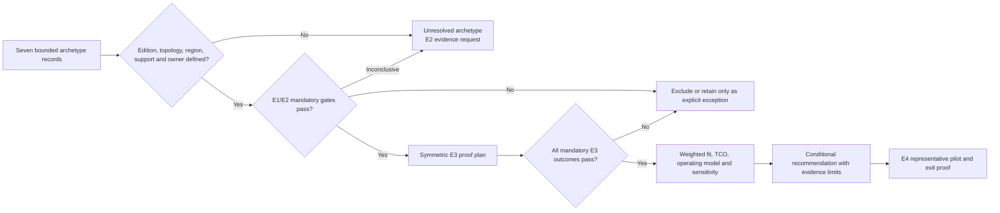

<!-- study-contract: principal -->

# Product shortlist and deployment variants

| Field | Value |
|---|---|
| Artifact type | comparative-study |
| Decision question | Which bounded archetypes can be resolved into exact Gate-1 options that deserve E3 investment, and which should be screened out because a mandatory boundary, operating obligation or evidence gap cannot be closed? |
| Decision owner | API-platform steering committee with architecture, security, operations and sourcing decision rights |
| Primary audiences | Executives, directors, architects, platform/developer/DevOps teams, SRE, security, network, procurement and FinOps |
| Scope | Kong Konnect hybrid, self-managed Kong, Azure API Management managed and self-hosted gateways, Apigee X and Hybrid, and the MuleSoft incumbent/Runtime Fabric baseline; secondary screen for Gravitee, Tyk and Kubernetes Gateway API implementations |
| Evidence state | Provisional longlist and proof prioritization: E1 documented facts plus open E2 contract/entitlement questions; no observed E3 result, score, ranking or selection |
| Reference case | Synthetic [RE-1](41-enterprise-reference-case.md), all journeys J-01–J-06 and failures I-01–I-08 |
| As-of date | 2026-08-17; all version, tier, region, entitlement and support facts require gate-time revalidation |
| Next gate | Steering committee approves exact bills of material and an evidence-backed E1/E2 mandatory-gate screen before funding symmetric E3 finalists |

## Current direction overlay — 2026-08-18

Stakeholder sequencing now treats Kong as the bounded, reversible platform direction defined in the [Kong enterprise platform deployment strategy](47-kong-enterprise-platform-strategy.md). That direction does not convert this earlier E1 longlist into comparative proof: the dated provisional answer below remains the historical evidence baseline, while Kong receives implementation priority only through the new strategy's explicit proof, hold and exit gates.

## Historical provisional answer — 2026-08-17

Keep all seven named variants in the **evidence-closure longlist**; do not call any of them selected, preferred or functionally equivalent. Confidence is high that they span the material ownership models and zero that the current evidence supports a winner. First resolve exact tier/edition, control region, data-plane topology, Kubernetes/support matrix, licensed features and commercial terms. Then apply mandatory gates before comparative weighting.

Kong Konnect hybrid and self-managed Kong are useful sequencing hypotheses because they expose a sharp SaaS-control versus self-managed-control tradeoff on a similar gateway runtime. Azure managed and self-hosted gateways test the value and limitations of Azure-native management with managed versus customer runtime responsibility. Apigee X and Hybrid test a product-lifecycle/analytics-rich managed model against a materially heavier customer Kubernetes runtime. MuleSoft is both an incumbent baseline and a decomposition constraint: it must be credited for current capabilities while gateway, transformation and integration responsibilities are separated. None of those roles implies a higher score. The [industry-problem taxonomy](43-api-management-industry-problems.md) defines the common P1–P10 proof portfolio; the [Kong roadmap](44-kong-multicloud-study-roadmap.md) is one candidate-specific projection of that portfolio, not a second taxonomy or an execution priority.

The consequence of shortlisting brands instead of deployable variants is severe: the PoC may demonstrate a feature on a tier, gateway type or topology that cannot be purchased, supported or operated in the target estate. This page therefore records unresolved subvariants rather than filling them with optimistic assumptions.

## Decision context and scenario assumptions

All traffic volumes, workload counts, regions, service objectives, incident history, staffing and cost inputs inherited from RE-1 are **scenario assumptions**. They are not current-state inventory, benchmarks, vendor results or commitments.

Each variant must address the same difficult slices:

- J-01 lost response after a non-idempotent money transfer without duplicate effect;
- J-03 partner mTLS/OAuth, quota/product binding and I-03 CA/client rotation;
- J-05 scheduled file acceptance, replay and reconciliation outside the gateway;
- J-06 desired/effective configuration through I-02 disconnection and stale restart;
- I-04 noisy-neighbour and I-05 telemetry backpressure without payment-route collapse;
- I-06 regional failover gated on configuration and data readiness;
- I-07 semantic schema/transform drift; and
- I-08 recovery when gateway/app rollback cannot reverse data/schema change.

The shortlist evaluates the API-management **platform boundary**, not a promise that one product replaces all Mule integration. A candidate that correctly refuses to absorb stateful orchestration may fit the target better than one that can execute it inside a gateway.

## Exact option definitions and open subvariants

| ID and deployable option | Control/runtime boundary | Configuration, portal and telemetry dependencies | Customer responsibility and unresolved bill of material | Role in proof—not rank |
|---|---|---|---|---|
| K-KON — Kong Konnect control plane with customer-hosted Kong Gateway data planes | Kong operates Konnect control services; enterprise hosts DPs in exact AKS/private zones and owns edge/backend paths | CP pushes config; DP sends defined analytics/billing telemetry; portal/consumer/analytics depend on selected Konnect services | DP image/version/plugin set, KIC/no-KIC authority, ingress/LB, certificates, secrets, capacity, local evidence, Konnect region/plan/support still require E2 | Tests SaaS governance plus workload-local gateway and disconnected-state semantics |
| K-SM — self-managed Kong Gateway hybrid | Enterprise hosts CP nodes/Admin API/database and distributed DB-less DPs; edition/support entitlement to be frozen | Enterprise-owned CP/database/config path; portal/analytics capability depends on exact licensed architecture | CP/DB HA/backup/restore, Admin security, clustering PKI, plugins, upgrades, DP runtime, support and telemetry | Tests whether added control/residency is worth full database/control lifecycle |
| A-MGD — Azure API Management managed gateway, **tier/subvariant unresolved** | Microsoft operates gateway and service management in Azure; tier determines zone, region, network and feature envelope | APIM management, developer portal and Azure monitoring paths; private backend connectivity varies by exact service/network model | Edge/DNS, policy, identity, backend/network, evidence and chosen tier/region; Premium classic, Premium v2, workspace/default gateway must not be collapsed | Managed-runtime benchmark for operational transfer and Azure integration |
| A-SHG — Azure API Management self-hosted gateway | Microsoft operates the associated APIM management/configuration endpoint; enterprise hosts container runtime near backends | One APIM instance configures the gateway; cloud heartbeat/config and optional telemetry paths coexist with local logs/metrics | Kubernetes/VM availability, ingress/LB, egress/DNS, upgrades, capacity, local backup/config, identity token mode and support seams | Tests centralized APIM lifecycle with customer-local request plane |
| G-X — Apigee X managed runtime | Google operates Apigee management and runtime; enterprise designs load-balancer/PSC/backend paths and organization/environment model | Apigee org/environment/product/app/analytics and Google Cloud services; exact region/network/entitlement required | Edge/LB/PSC/DNS, backend security, proxy/product lifecycle, identity, evidence and commercial units | Managed enterprise API-product/analytics benchmark |
| G-HYB — Apigee Hybrid 1.16-family customer runtime, exact supported patch/platform to freeze | Google hosts management; enterprise operates runtime services on supported Kubernetes, including Message Processors, Synchronizer, Cassandra and MART | Control contract and analytics/operations paths cross Google services; portal/product/app records remain control-plane concerns | Kubernetes, ingress, Cassandra/runtime capacity/recovery, service accounts/keys, ordered upgrades, telemetry and split support | Tests locality with a broad, stateful customer runtime operating envelope |
| M-BASE/RTF — contracted MuleSoft/Anypoint incumbent; Runtime Fabric subvariant only if actually proposed | Current control/runtime/topology must be inventoried; RTF uses Anypoint control with customer Kubernetes runtime and per-app Mule runtimes | Exchange/API Manager/Runtime Manager/monitoring plus app, connector and policy artifacts; entitlements and region depend on contract | Existing apps/state/connectors/support and, for RTF, cluster/ingress/network/monitoring/runtime lifecycle | Incumbent capability/cost/operability baseline and bounded coexistence option |

Kong officially documents hybrid CP/DP separation, disk-cached DP configuration, restart/new-node constraints, version/plugin compatibility and topology limitations ([Kong hybrid mode](https://developer.konghq.com/gateway/hybrid-mode/)). This supports K-KON/K-SM test design; it does not prove enterprise supportability or required plugin entitlement.

Microsoft's current gateway comparison distinguishes classic, v2, consumption, self-hosted and workspace gateways, including different infrastructure, policy and monitoring capabilities ([Azure API Management gateways](https://learn.microsoft.com/en-us/azure/api-management/api-management-gateways-overview)). Its self-hosted support policy assigns hosting, network, SLA/capacity and many third-party diagnostics responsibilities to the customer ([self-hosted support policy](https://learn.microsoft.com/en-us/azure/api-management/self-hosted-gateway-support-policies)). Therefore A-MGD and A-SHG cannot share one feature or operations score.

Google documents Apigee Hybrid as a Google-hosted management plane plus customer-managed Kubernetes runtime containing Message Processors, Synchronizer, Cassandra and MART ([Apigee Hybrid](https://docs.cloud.google.com/apigee/docs/hybrid/v1.16/what-is-hybrid)); Apigee's managed architecture has a different instance/environment/network ownership model ([Apigee architecture](https://docs.cloud.google.com/apigee/docs/api-platform/architecture/overview)). MuleSoft documents Runtime Fabric as a shared-responsibility customer Kubernetes deployment for Mule applications and gateways, including enterprise ownership of ingress, load balancing, network, monitoring and log forwarding ([Runtime Fabric](https://docs.mulesoft.com/runtime-fabric/latest/)). These official sources are E1 evidence only.

## Mechanism analysis: evidence-gated shortlisting

**Figure 09-1 — Money is committed to deeper proof only after option precision and mandatory gates; scoring cannot rescue a failed gate.**

- **Depicted scope:** option-definition completeness, E1/E2 mandatory screening, symmetric E3 proof, mandatory-result disposition, weighted fit/TCO/operating-model sensitivity, conditional recommendation and E4 pilot progression.
- **Excluded scope:** candidate scores or ranks, approved finalists, commercial authorization, exact evidence thresholds, exception authority, E3/E4 results and any implication that all seven bounded records are already deployable exact options.
- **Diagram source, evidence state and as-of:** inline assessment-mechanism synthesis from this study’s option table, evidence ladder and mandatory-gate contract; governance interpretation informed by current official topology sources, with no candidate pass, score or funding result; 2026-08-17.
- **Accessible equivalent:** every bounded option record first needs edition, topology, region, support and owner fields. Incomplete or inconclusive records return to an evidence request; a failed mandatory gate is excluded or requires an explicit bounded exception. Only options passing E1/E2 enter symmetric E3 proof, and only those passing every mandatory E3 outcome proceed to weighted fit, TCO and sensitivity analysis. A conditional recommendation then requires an E4 representative pilot and exit proof. The mandatory-gate table below is the detailed text equivalent.

**Figure interpretation:** Figure 09-1 separates eligibility from preference. A rich feature set or weighted score cannot compensate for an unapproved data path, unsafe business outcome or unowned runtime.

**Figure limitation:** The flow defines decision order, not approval status or a deterministic scoring model. Gate thresholds, exception authority, exact option contracts, organization inputs and observed E3/E4 evidence remain unresolved; the diagram cannot support ranking or funding by itself.

### Mandatory-gate contract

| Gate | Same question for every option | E1/E2 screen | E3 falsification trigger |
|---|---|---|---|
| G1 — option precision/support | Is the exact product, tier, topology, region, version policy, entitlement and support boundary deployable and supportable? | Official docs plus vendor/contract confirmation; all unknowns named | Actual build requires unsupported combination, hidden component or unowned diagnosis path |
| G2 — security/privacy/residency | Can client/backend trust, secrets, audit and field-level data flows meet mandatory controls? | Security/processing/support artifacts and topology ledger | Negative auth/cert/secret/audit or tagged-data test fails or silently bypasses |
| G3 — request correctness | Can J-01/J-03 preserve deterministic outcome and safe retry/timeout semantics? | Architecture maps business state outside gateway and names owner | Lost-response run duplicates/loses outcome or cannot reconcile |
| G4 — hybrid/recovery | What happens to existing/cold/new runtimes, urgent revoke, configuration and evidence under I-02/I-06? | Documented state model plus dependency/ownership inventory | False-ready stale runtime, missed objective or irreconcilable reconnect/failover |
| G5 — capacity/isolation | Can critical and non-critical traffic be isolated through I-04/I-05? | Exact topology, state stores, telemetry and scaling mechanism documented | Payment objective fails under approved load/fault envelope or loss remains invisible |
| G6 — API operations/governance | Can canonical contract/policy/product intent be promoted with effective-state and recovery evidence? | Native API/tool coverage and authority map | Partial release reported complete, collision missed, drift/rollback unreconstructable |
| G7 — consumer/product lifecycle | Can discovery, approval, credentials, rotation, revoke and offboarding reconcile to runtime? | Exact portal/product/app capability and identity/data boundary | Duplicate/orphan credential, stale entitlement or unprovable runtime revoke |
| G8 — migration/exit | Can gateway versus integration responsibilities be separated and non-secret entities rebuilt/exported? | Mule decomposition and candidate export/API evidence | Hidden state/coupling or unsustainable transformation prevents bounded exit |
| G9 — operating/economic fit | Can the staffed model and five-year scenario TCO meet approved constraints? | RACI/on-call/support and contract/pricing inputs | Game day exposes unowned seam or measured effort/capacity violates approved bound |

Unknown is not a partial pass. A mandatory gate can be `pass`, `fail`, or `inconclusive`; inconclusive blocks progression until the named evidence closes it. Weighted criteria apply only after all mandatory gates pass for the tested variant.

## Symmetric E1/E2 dossier checklist

| Dossier area | Required evidence | Volatile revalidation trigger |
|---|---|---|
| Commercial identity | Legal product/edition/SKU, quantities/units, add-ons, nonproduction/DR terms, support plan | Quote/renewal, packaging or metric change |
| Topology | CP/DP/runtime regions, clusters/zones, database/state stores, portal/analytics, traffic and management paths | Region/service architecture or planned estate change |
| Version/support | Release/channel, Kubernetes/OS/database/controller matrix, end-of-support, upgrade/rollback rules | New major/minor or platform upgrade |
| Capability/entitlement | Exact policy/plugin, portal, API product, analytics, audit, secrets, identity, IaC/API/export and hybrid support | Tier/add-on/preview/GA status change |
| Data processing | Field categories, locations, subprocessors/operators, support bundles, backup/retention and deletion | Contract/DPA/subprocessor or feature enablement change |
| Operations | Vendor/customer RACI, SLA/SLO scope, support exclusions, evidence bundle and escalation clocks | Support-policy/contract or topology change |
| Economics | License/unit model, infra, egress, observability, environments, labour, migration/coexistence and exit | Quote, volume, architecture or staffing change |

## Secondary fit screen

Gravitee, Tyk, NGINX Gateway Fabric and an Envoy Gateway/Istio pattern remain **secondary screen hypotheses**, not dismissed products. They enter full E1/E2/E3 treatment when they satisfy a strategic trigger—mandatory gate failure among primary variants, material requirement change, procurement constraint, or credible evidence of a differentiating fit worth the evaluation cost.

| Secondary option | Documented mechanism worth screening | Evidence that prevents automatic promotion |
|---|---|---|
| Gravitee APIM Cloud/hybrid or self-managed | Current documentation describes SaaS control with self-hosted hybrid gateway and Redis, plus other deployment forms ([Gravitee hybrid gateway](https://documentation.gravitee.io/apim/hybrid-installation-and-configuration-guides/next-gen-cloud/link-to-a-hybrid-gateway)) | Exact edition/version, bridge versus next-gen architecture, state stores, regions, portal/product/governance, support and RE-1 failure evidence |
| Tyk Cloud hybrid or self-managed | Current hybrid docs describe a gateway-initiated link to cloud control and a Redis dependency in each data plane ([Tyk hybrid gateways](https://tyk.io/docs/nightly/tyk-cloud/environments-deployments/hybrid-gateways)) | Stable release docs, exact control/analytics/portal model, Redis consistency/recovery, enterprise support and full lifecycle evidence |
| NGINX Gateway Fabric/Plus | Official docs describe a Gateway API controller that creates/manages an NGINX data-plane Deployment and Service ([NGINX Gateway Fabric](https://docs.nginx.com/nginx-gateway-fabric/)) | API product/consumer/portal/analytics/governance scope, enterprise policies/entitlements and hybrid control model must match the platform decision rather than only ingress |
| Envoy Gateway or Istio ingress pattern | Gateway API implementations can provide portable routing and Kubernetes role separation | A controller/data plane is not automatically a full API-management platform; product lifecycle, consumer identity, audit, hybrid support and operating model need separate components |

The secondary screen uses the same gate questions and evidence ladder. It cannot use a lighter bar merely because the software is open source or Kubernetes-native, and it cannot be excluded solely for having a smaller incumbent footprint.

## Operational failure modes in the selection process

| Assessment failure | How it misleads the decision | Control |
|---|---|---|
| Brand-level demo | Feature works on different tier/topology than proposed | Freeze exact option record and evidence metadata before test |
| Unequal depth | Favoured product gets hands-on engineering while alternatives receive documentation scores | Same scenario, fault set, reviewer, artifact contract and remediation opportunity |
| Checkbox hybrid | Warm runtime call passes; restart/scale/revoke/reconnect remain untested | State-by-state hybrid gate from [requirements](06-hybrid-cloud-requirements.md) |
| Feature-count bias | Integration breadth encourages gateway monolith or penalizes clean separation | Score target responsibility placement and sustainable ownership, not raw count |
| Ecosystem halo | Azure/Kubernetes/current-vendor familiarity substitutes for exact support evidence | Attribute value only to required integrations and measured operating effort |
| Sunk-cost bias | Existing Mule license/skills either dominate or are ignored | Compare retain/coexist/migrate costs and risk over the same horizon |
| Score laundering | Unknown mandatory fact receives midpoint and disappears in weighted total | Keep `inconclusive`; no weight until gate closes |
| PoC as production proof | Controlled lab ignores vendor incident, upgrade years, contract and real consumers | E4 representative pilot, contract review and limitations remain explicit |

## Counterarguments and non-fit conditions

- **“A shortlist must have only two or three products.”** Eventually, to control E3 cost. Prematurely collapsing undefined variants risks choosing the wrong topology. First use low-cost E1/E2 gates; then fund only survivors.
- **“Kong is the stakeholder direction.”** Treat that as an authorized planning input, not achieved fit. K-KON is non-fit if control/data/support boundaries or required entitlements fail; K-SM is non-fit if database/control operations are not sustainable. The [Kong platform strategy](47-kong-enterprise-platform-strategy.md) concentrates reversible proof on `KP-SMH1` while retaining Konnect and non-Kong counterfactuals.
- **“Azure is the obvious choice because workloads are on AKS.”** Azure integration may be valuable. A-MGD remains non-fit if path/region/tier constraints fail; A-SHG remains non-fit if customer runtime/support seams outweigh the value.
- **“Apigee is enterprise-grade, so it should win.”** Product breadth is not RE-1 fit. G-X is non-fit on mandatory placement/path/contract constraints; G-HYB is non-fit if Cassandra/multi-component operations exceed capability or value.
- **“Mule can do everything already.”** It may remain the safest home for some integration. It is non-fit as a default target if gateway and stateful integration cannot be governed/sequenced economically or exit risk remains unacceptable.
- **“Open-source/Kubernetes-native means low lock-in.”** Route intent may be portable while policies, product/consumer state, plugins and operational expertise are not. Exit is an evidence exercise, not a license label.

## Decision implications

1. Replace “shortlist” language in governance forums with **seven-option evidence-closure longlist** until the E1/E2 gate records actual dispositions.
2. Freeze exact option/subvariant IDs; never reuse one score across managed/self-hosted, tier, workspace, Kubernetes or region variants.
3. Apply mandatory gates before weighting, TCO sensitivity or executive preference.
4. Fund symmetric E3 only for E1/E2 survivors; the same workloads, faults, artifacts and independent reviewers apply.
5. Preserve secondary-screen triggers so a failed assumption reopens the market without restarting the method.

## Falsification and proof plan

| Hypothesis to challenge | Procedure | Measure and threshold | Artifact and reviewer | Decision impact |
|---|---|---|---|---|
| Each option record is deployable, purchasable and supportable | Vendor and enterprise jointly complete bill of material, topology, entitlement, version matrix and RACI; procurement validates quote/contract | 100% of mandatory fields evidenced or explicitly inconclusive; zero inferred tier/topology parity | Signed dossier, source snapshot, quote/contract evidence IDs; architecture/procurement review | Undefined variant cannot enter E3; failed mandatory term excludes it. |
| Mandatory gates are symmetric | Run the same RE-1 fixtures/faults with frozen topology and reviewer rubric; permit equivalent remediation window | Every surviving variant passes 100% of mandatory outcomes; zero unknown scored as pass and zero missing raw artifact | Test manifest, raw evidence, reviewer disposition; independent assessment assurance | Fail excludes exact variant; inconclusive pauses it; no weighted rescue. |
| Weighted result is robust after gates | Apply approved evidence-based scores, TCO and operating model; vary weights, costs, growth and risk assumptions | Conditional recommendation remains acceptable across pre-approved sensitivity ranges or instability is explicit | Model/input provenance, tornado/threshold analysis, steering minutes; FinOps/risk review | Fragile result becomes conditional or requires further evidence/pilot. |
| Exit claims are real | Export/rebuild canonical routes, products, non-secret apps, policies, docs and evidence mappings; rotate secrets into alternate target | 100% of in-scope entities accounted for as restored/transformed/reissued; zero unexplained dependency | Reconciliation and effort log, data-history gaps; architecture/procurement review | Hidden lock-in changes risk/TCO and may fail G8. |

## Risks and limitations

- This page is not a recommendation and contains no E3 observation, score, ranking, benchmark, quote or contractual conclusion.
- Official documentation changes and may describe features that vary by tier, gateway type, region, version, preview status or entitlement. Revalidation triggers are mandatory.
- RE-1 may not represent the real estate. Actual inventory, network, identity, residency, traffic, staffing and contract constraints can add/remove options.
- The named secondary screen is not an exhaustive market scan. Procurement may require broader RFI treatment using the same gate contract.
- Lab success cannot prove vendor service incidents, support behaviour, multi-year upgrade toil, final cost or consumer adoption; E2/E4 evidence remains required.
- Public documentation cannot contain confidential quotes, security reports, private endpoints or raw production evidence; use controlled evidence IDs and reviewer attestations.

## Open evidence requests

| Evidence request | Owner role | Due gate | Decision impact if absent |
|---|---|---|---|
| Completed exact-option dossier and licensed feature/support matrix for all seven variants | Vendor technical leads + procurement | Before E1/E2 shortlist meeting | Variant remains inconclusive and receives no E3 funding. |
| Calibrated RE-1 mandatory controls, traffic/objectives, regions, inventory and integration boundary | Enterprise owners across product, security, architecture and SRE | Before gate scoring | The screen answers a synthetic case only. |
| Comparable five-year quote/TCO inputs including all environments, DR, infrastructure, egress, telemetry, labour, coexistence and exit | Procurement + FinOps + platform operations | Before conditional recommendation | Commercial/operating comparison remains unusable. |
| Independent E3 evidence packs and conflict-of-interest declaration for finalist reviewers | Assessment assurance owner | Before E3 disposition | Result cannot support a steering decision. |

## Next gate

The next gate is a **bounded-option resolution and E1/E2 screening forum** chaired by the steering committee with architecture, security/privacy, network, platform/SRE, integration, API product, procurement and FinOps voting roles. It passes only when every archetype has the same completed dossier template and a resolved edition/version/topology/entitlement/support record, every mandatory gate is `pass`, `fail` or explicitly `inconclusive`, exclusions cite exact evidence, common-evidence/category coverage and missingness are disclosed, E3 cost/scope is approved for survivors, and secondary triggers are recorded. The forum authorizes proof investment; it does not select a product.
