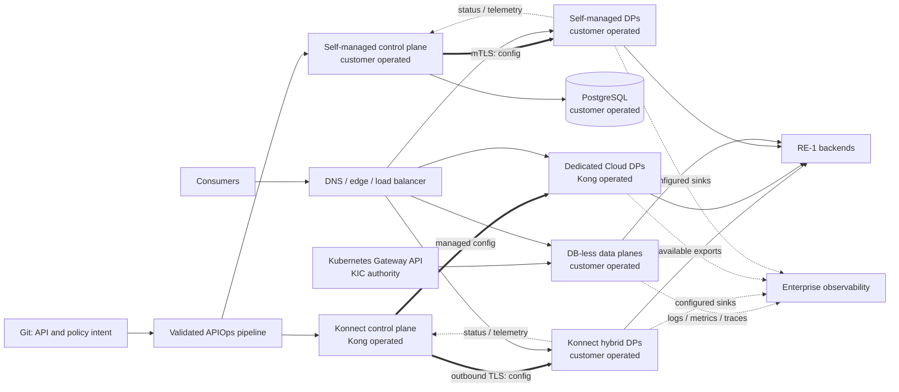

<!-- study-contract: principal -->

# Kong Gateway candidate dossier

| Field | Value |
|---|---|
| Artifact type | candidate-dossier |
| Decision question | Which bounded Kong Gateway deployment archetypes warrant Gate-1 option resolution before symmetric proof against RE-1 hybrid, security, resilience, federation, operations, and migration requirements? |
| Decision owner | API Platform Steering Committee |
| Primary audiences | Executives, platform and security leaders, enterprise/domain architects, developers, DevOps/SRE, network and operations teams |
| Scope | Kong Gateway Enterprise 3.14 LTS version policy; self-managed hybrid; Konnect hybrid with customer-hosted data planes; Konnect Dedicated Cloud Gateways; DB-less Gateway with KIC 3.5/Gateway API 1.3; Serverless Gateway as a bounded variant; RE-1 workloads |
| Evidence state | Documented (`E1`) mechanisms only; entitlement, contract, lab, estate fit, capacity, and pilot evidence are absent |
| Reference case | [RE-1 enterprise reference case](41-enterprise-reference-case.md), synthetic and non-organizational |
| As-of date | 2026-08-17 |
| Next gate | Gate-1 option-resolution review; architecture evidence review follows only after a reproducible variant, E2 terms and the KONG-P01 through KONG-P05 proof bundle are complete |

## Provisional answer

**Evidence state:** `E1 — current official documentation`, reviewed 2026-08-17. The evidence supports keeping several Kong variants available for testing, but supports no product score, rank, or selection. There is no contractual evidence (`E2`), reproducible execution (`E3`), or representative pilot evidence (`E4`) in this repository.

“Kong” is not a deployable option. The control plane may be vendor-operated or customer-operated; the data plane may be customer-hosted, vendor-hosted, or automatically provisioned; Kubernetes may be only the runtime or the configuration authority; and the runtime may be hybrid, DB-less, or traditional. These choices change state ownership, outage behavior, permitted plugins, support boundaries, residency, upgrades, and exit mechanics. They must remain separate rows throughout assessment.

The analysis baseline uses the **Kong Gateway Enterprise 3.14 LTS version line**, not because it is preferred, but because it provides an explicit support horizon. An exact patch, image digest, Helm chart, KIC/operator version, and AKS/Kubernetes combination must be frozen at the proof gate. Kong currently lists 3.15 and several LTS lines as supported; this is volatile and must be rechecked against the [Gateway version support policy](https://developer.konghq.com/gateway/version-support-policy/).

## Bounded archetypes awaiting Gate-1 option resolution

The rows below separate materially different product/runtime boundaries, but they are not yet deployable option records. Each must close the version, digest, region, network, configuration, plugin, entitlement and objective blockers in [Open evidence requests](#open-evidence-requests) before it can be scored, costed or used as a proof target.

| Variant archetype | Configuration and runtime boundary | Material constraint | Current evidence |
|---|---|---|---|
| Self-managed hybrid | Customer operates CP nodes, PostgreSQL, and customer-hosted DP nodes; CP holds Admin API and configuration, DPs proxy from synchronized/cached state | Customer owns CP/DB HA, backup, migration, license distribution, CP/DP PKI, DP capacity, and recovery | [Hybrid mode](https://developer.konghq.com/gateway/hybrid-mode/) and [backup/restore](https://developer.konghq.com/gateway/upgrade/backup-and-restore/) (`E1`) |
| Konnect hybrid with self-hosted DPs | Kong operates the Konnect CP; customer operates DP images and substrate; DPs initiate outbound connection to the regional service | Payload path may remain customer-hosted, but configuration, metadata, administration, and telemetry have Konnect dependencies and geo rules | [Konnect networking](https://developer.konghq.com/konnect-platform/network/) and [geographic regions](https://developer.konghq.com/konnect-platform/geos/) (`E1`) |
| Konnect Dedicated Cloud Gateway | Kong operates the multi-tenant Konnect CP and a single-tenant managed DP environment in a selected supported cloud/region | Networking mode, region, plugins, upgrade timing, evidence access, and shared-responsibility terms differ from self-hosted DPs | [Dedicated Cloud Gateways](https://developer.konghq.com/dedicated-cloud-gateways/) and [network architecture](https://developer.konghq.com/dedicated-cloud-gateways/network-architecture/) (`E1`) |
| DB-less Gateway with KIC 3.5 and Gateway API 1.3 | Kubernetes resources are desired state; KIC translates and sends configuration to DB-less Gateway pods; there is no Kong database | Admin API is read-only for entity writes, decK cannot manage the runtime, and controller scope can merge resources into one generated configuration | [DB-less mode](https://developer.konghq.com/gateway/db-less-mode/), [KIC architecture](https://developer.konghq.com/kubernetes-ingress-controller/architecture/), and [KIC compatibility](https://developer.konghq.com/kubernetes-ingress-controller/version-compatibility/) (`E1`) |
| Konnect Serverless Gateway | Konnect hosts CP and automatically provisioned DPs; runtime version is automatically managed | Current documented public networking and workload limits make this a distinct bounded option, not a proxy for Dedicated or self-hosted DPs | [Serverless Gateway reference](https://developer.konghq.com/serverless-gateways/reference/) (`E1`, volatile) |
| Traditional database-backed Gateway | Each proxy node connects to shared PostgreSQL and can expose administration according to design | Database reachability enters startup/readiness and some runtime paths; only topology for plugins that need DP database writes | [Traditional mode](https://developer.konghq.com/gateway/traditional-mode/) and [deployment topologies](https://developer.konghq.com/gateway/deployment-topologies/) (`E1`) |

Serverless remains a screening-level variant unless RE-1 demand, private connectivity, payload, plugin, and resilience requirements fit its current documented envelope. Dedicated Cloud Gateway is not assumed to be equivalent to customer-hosted Konnect hybrid. Traditional mode is not the default hybrid hypothesis, but remains relevant where a database-writing plugin is mandatory.

## Mechanism analysis: request, change, and evidence paths

**Figure KONG-A1 — Runtime locality and configuration authority are independent choices.**

- **Depicted scope:** the principal customer-operated CP, Konnect CP, customer-operated DP, Dedicated DP and KIC/DB-less authorities, including their request, change and evidence paths.
- **Excluded scope:** approved DNS, edge/WAF, identity provider, Redis, backend, portal and SIEM designs, and any assertion that a depicted archetype is a resolved option.
- **Diagram source, evidence state and as-of:** inline Mermaid synthesis from the cited official Kong hybrid, hosting, DB-less and Kubernetes-controller mechanisms; `E1 documented` plus interpretation, no observed topology; 2026-08-17.
- **Accessible equivalent:** approved source moves through a pipeline to either Konnect, a self-managed CP or Kubernetes/KIC; those authorities configure their respective DPs; consumers traverse edge → DP → backend; customer-hosted DPs return status/telemetry to their CP. The following state table names the authority, runtime copy and proof for each path.

**Figure interpretation:** Moving a data plane changes the payload path, but not automatically the configuration authority, telemetry destination, identity dependencies, or operating owner. The decision therefore turns on three paths—not a generic “hybrid” flag. A local DP may continue serving cached configuration while changes, scale-out, analytics, certificate rotation, or support evidence are impaired.

**Figure limitation:** This is a family-boundary synthesis, not a supported or tested topology; it omits the resolved region, network, identity, plugin, entitlement, backend and evidence designs required at Gate 1.

| Path or state | Authority | Runtime copy or dependency | Proof required |
|---|---|---|---|
| Routes, services, consumers, certificates, plugins | Konnect CP, self-managed CP/PostgreSQL, or Kubernetes resources—one authority per entity set | Hybrid DPs receive CP snapshots; DB-less DPs load generated declarative state | Source-to-runtime hash, deletion semantics, drift, rollback, and no dual writes |
| Hybrid DP running configuration | CP remains authoritative; DP keeps a local LMDB cache | Existing DPs can serve and restart from cache; a clean new DP needs copied cache or an approved declarative fallback | J-06/I-02 partition, restart, clean-node scale-out, freshness and reconciliation |
| Authentication keys and discovery data | IdP, CA, vault, and gateway configuration each own different state | OIDC caches discovery/JWKS; mTLS uses configured CA material; vault references resolve at runtime | I-03 dual trust, IdP/JWKS/vault loss, revocation and fail-open/closed behavior |
| Distributed quotas | Plugin and chosen counter policy | Hybrid excludes `cluster` for the documented rate-limit plugins; `local` is per node and `redis` adds a stateful dependency | Accuracy during autoscale, Redis latency/partition/recovery, and abuse consequence |
| Operational evidence | Runtime logs/metrics/traces, CP status, audit service, pipeline and SIEM | In-memory telemetry queues can drop oldest entries; CP disconnection can create analytics gaps | I-05 backpressure, loss budget, alerting, reconciliation, and privacy controls |

Kong documents that the hybrid `cluster` rate-limit strategy is unsupported and that `local` or `redis` must be used in [hybrid mode](https://developer.konghq.com/gateway/hybrid-mode/). Kong also documents that Redis disconnection can fall back to local counters, allowing more requests than the shared limit, in [rate-limiting strategies](https://developer.konghq.com/gateway/rate-limiting/strategies/). For J-01 and J-03, that is a business-control decision, not an implementation detail.

## Applying the RE-1 scenario

All traffic volumes, latency objectives, recovery windows, and growth values inherited from [RE-1](41-enterprise-reference-case.md) are **scenario assumptions**, not observed estate facts, vendor limits, benchmarks, or approved service objectives.

- **J-01 confirmed money transfer:** the gateway may authenticate, authorize coarse scopes, validate input, limit abuse, and propagate idempotency context, but it cannot make the downstream money movement idempotent. I-01 requires a backend ledger/idempotency record and an explicit retry contract.
- **J-02 account summary:** cache and fan-out policy can alter staleness, privacy, and tail latency. Gateway response caching is not approved merely because a plugin exists.
- **J-03 partner payment initiation:** mTLS CA rollover, OIDC/JWKS availability, consumer identity mapping, global quota consistency, and partner IP/network behavior must survive I-03 without silent anonymous access.
- **J-04 digital onboarding:** larger/multipart payloads and threat inspection can trigger buffering, memory, disk, or plugin constraints; performance proof must include representative payloads.
- **J-05 settlement file:** a request/response gateway is not presumed to replace managed file transfer, durable messaging, malware scanning, or batch reconciliation. The journey may bypass Kong or use it only for a control API.
- **J-06 configuration propagation:** source commit, validation, CP acceptance, DP receipt, runtime fingerprint, rollback, and audit linkage must be measurable across every cluster and region.

I-04 noisy-neighbour and I-05 telemetry backpressure determine the isolation unit: sharing a CP does not require sharing a DP, but proliferating DPs increases certificate, capacity, upgrade, evidence, and cost burden. I-06 regional loss requires more than healthy gateway pods; DNS, certificates, identity, counters, upstream state, and client retry safety must converge.

## Operations, lifecycle, and support consequences

- **Version policy:** Kong currently documents 3.14 as an LTS line and 3.15 as supported. Minor and patch changes can still carry exceptions; the [support policy](https://developer.konghq.com/gateway/version-support-policy/) and breaking-change log must be checked at each release. “3.x compatible” is not a release plan.
- **Hybrid upgrade order:** self-managed hybrid upgrades CPs before DPs because the CP minor cannot be lower than the DP; custom plugins must be installed on both roles. Kong's [upgrade guide](https://developer.konghq.com/gateway/upgrade/) also says database migrations are not reversible, so rollback requires pre-finalization strategy and backup, not Git alone.
- **Kubernetes lifecycle:** KIC, Kong Operator, Gateway API CRDs, Gateway image, Helm chart, AKS, and Kubernetes each have separate support clocks. KIC 3.5 supports Gateway API 1.3 in the current [compatibility table](https://developer.konghq.com/kubernetes-ingress-controller/version-compatibility/); this does not prove an unlisted AKS combination.
- **Entitlement:** OIDC, mutual TLS authentication, Request Validator and several advanced plugins are labelled Enterprise in their plugin pages. The [plugin compatibility matrix](https://developer.konghq.com/plugins/compatibility/) must be checked per topology/hosting option. A purchase quote and support statement (`E2`) must resolve actual rights; this study does not invent licensing terms.
- **License failure:** self-managed nodes independently load a license unless it is distributed through the documented entity path. Current [license behavior](https://developer.konghq.com/gateway/entities/license/) preserves unchanged proxying after expiry but can make configuration read-only and can prevent new/restarted DB-less/KIC nodes. The exact version and deployment method must be exercised.
- **Support boundary:** Kong support for product software does not establish Microsoft support for AKS networking, a Redis provider's support, or organization support for custom plugins. A joint incident responsibility matrix and escalation clock remain `E2/E4` gaps.

## Failure modes and non-fit conditions

| Failure or non-fit | Mechanism and consequence | Required evidence |
|---|---|---|
| CP or CP database unavailable | Existing hybrid DPs use cached configuration, but changes stop; clean scale-out needs copied cache/fallback and may use stale state | KONG-P01 with live J-01/J-03/J-06 traffic |
| Redis unavailable | Documented fallback to node-local counters can exceed a shared allowance; fail-open/closed meaning must be approved | KONG-P02 with counters before, during, and after partition |
| IdP/JWKS or vault unavailable | Cached OIDC metadata may bridge some failures; cache miss/expiry, rotation, and secret refresh can fail differently | KONG-P03 with clock, cache, rotation, and revoked-key evidence |
| Bad or partially compatible configuration | Konnect can reject unsupported configuration; mixed DP versions expose only a common subset; KIC may merge resources into one generated snapshot | Golden-contract diff, rejected-resource status, runtime hashes, rollback |
| Telemetry sink unavailable | OpenTelemetry queues are per worker, memory-only, and delete oldest entries when full | I-05 queue saturation, loss measurement and request-path SLI |
| Large or slow payload | Buffering, disk I/O, client slowness, plugin body access, or upstream connection limits can dominate | Representative J-04/J-05 payload and slow-client test |
| Mandatory DB-writing plugin in hybrid | Some plugins/topologies are incompatible; OAuth 2.0 Authentication and `cluster` rate limiting are documented examples | Exact plugin/topology/edition matrix and functional test |
| Air-gapped autonomous operation | Hybrid DPs can serve cached state, but CP authority, license, clean scale-out, changes, analytics, identity, registry, and support dependencies remain | Disconnected-operations envelope and dependency inventory |

A credible non-fit condition is any mandatory requirement that cannot be met by the **exact** variant—for example, global hard quotas that may not degrade to local, autonomous emergency change while disconnected, a prohibited Konnect metadata location, unsupported plugin/hosting combination, or an operating model without 24×7 ownership for PostgreSQL/Redis/Kubernetes/PKI. Those conditions do not generalize to every Kong variant, and they do not imply another candidate passes.

## Migration implications

1. Inventory portable intent separately from Kong entities: OpenAPI, identity semantics, consumer entitlements, error contract, quota consistency, TLS trust, telemetry fields, and retry/idempotency behavior.
2. Map every source policy to the exact target topology and plugin entitlement. Do not infer that a plugin available in traditional mode is available in hybrid, Serverless, or Dedicated Cloud Gateways.
3. Choose one configuration authority per entity. Kubernetes/Gateway API ownership, decK/Konnect API ownership, and manual Admin API changes cannot safely converge without machine-enforced partitions.
4. Treat consumers, credentials, certificates, counters, audit history, analytics, and portal registrations as stateful migration objects. A declarative route sync does not migrate them safely.
5. Use side-by-side traffic slices with deterministic request identifiers, dual trust, DNS/edge convergence, and a tested rollback. I-01 prevents automatic retry of ambiguous J-01 outcomes.
6. Design exit before entry. Exported declarative state is not the PostgreSQL backup, custom plugin artifact, Konnect audit archive, or proof of semantic portability.

## Counter-evidence and falsification

| Proposition to challenge | Strongest counter-evidence | What would falsify it |
|---|---|---|
| “A SaaS control plane puts business payloads in SaaS.” | Customer-hosted hybrid DPs proxy locally and initiate control connections | Packet/flow and telemetry capture showing prohibited payload or classified field leaves the approved boundary |
| “Cached DPs make the platform autonomous.” | Running and restarted DPs can use cached state for extended CP outages | Clean scale-out, emergency change, license, identity, registry, or recovery fails inside the required disconnected envelope |
| “Kubernetes-native eliminates configuration drift.” | KIC makes Kubernetes the source for its scope | A second writer, cross-namespace merge, admission gap, or controller outage produces unowned or divergent runtime state |
| “Redis provides a hard global quota.” | Redis strategy provides shared counters in documented topologies | Partition or failover allows a breach beyond the approved error budget or loses reconciliation evidence |
| “Vendor benchmarks establish capacity.” | Kong publishes a method and results for a bounded environment | Representative RE-1 mix materially changes saturation, tail latency, or scale-out behavior from the capacity model |
| “Self-managed gives complete control.” | It increases control over CP, DB, DP, backups, and network | Staffing, recovery, patch, or audit obligations cannot meet approved operating objectives |

## Decision implications

- Create separate option records for self-managed hybrid, Konnect hybrid/self-hosted DP, Dedicated Cloud Gateway, DB-less/KIC, Serverless, and traditional mode; never assign a Kong-family score.
- Make configuration authority, quota consistency, identity-cache behavior, telemetry loss, clean scale-out during partition, and exact plugin entitlement mandatory proof dimensions.
- Treat Kubernetes management choice—KIC unmanaged, Kong Operator managed, or runtime-only—as architecture, not packaging.
- Keep selection neutral until every shortlisted non-Kong candidate receives the same RE-1 journeys, failures, proof thresholds, and evidence grades.

## Falsification and proof plan

| Proof ID | Procedure | Measure | Threshold | Evidence artifact | Independent reviewer |
|---|---|---|---|---|---|
| KONG-P01 | Execute J-06/I-02: block CP endpoints, keep J-01/J-03 traffic, restart a cached DP and add a DP on a clean node | config fingerprint, readiness, change rejection, error rate, stale duration, reconciliation | Meets steering-approved data/change-path objectives; no clean node serves unknown state | manifests, image digests, flow logs, runtime hash and request timeline | SRE reviewer independent of platform implementation |
| KONG-P02 | Run local and Redis rate-limit policies; partition and fail over Redis during burst/autoscale | accepted count per identity/region, latency, counter convergence, fail mode | No mandatory quota or backend-protection breach beyond approved tolerance | load input, plugin config, Redis events, per-node decision log | Security and service owner |
| KONG-P03 | Exercise I-03 plus IdP/JWKS/vault loss and clock skew on J-03 | handshake/auth decisions, cache age, revoked-key acceptance, recovery | No anonymous or stale-key acceptance outside approved policy; dual trust and rollback work | certificate/JWKS timeline, packets, logs, config hashes | IAM/PKI owner |
| KONG-P04 | Promote a defective and then corrected route/plugin through each proposed authority | validation result, partial apply, DP convergence, audit linkage, rollback time | No unreviewed destructive change; every DP converges to the approved hash inside the objective | commits, signed artifact, diff, controller/CP status and runtime results | Change assurance reviewer |
| KONG-P05 | Execute representative J-01–J-05 mix, I-04/I-05 and one-region loss | p50/p95/p99/p99.9, errors, CPU/memory, queue loss, scale/recovery time | Approved journey objectives met while losing the largest allowed failure unit | reproducible harness, raw time series, topology/version manifest | Performance engineering and business service owner |

No threshold above is an observed result. An unapproved threshold remains a blocker, not a scenario assumption silently promoted to acceptance criteria.

## Risks and limitations

- Product, plugin, version, region, resource-limit, and support statements are volatile after the as-of date.
- Exact commercial entitlements, SLA/remedy, data-processing terms, support plan, and roadmap commitments require `E2`; no licensing term is inferred here.
- CP/DP partition, clean-node scale-out, license expiry, Redis failure, identity/certificate rotation, AKS disruption, configuration rollback, performance, and DR require `E3`.
- RE-1 is synthetic. All numbers remain scenario assumptions until service owners provide representative demand and objectives.
- Portal/catalog, monetization, event gateway, service mesh, and AI gateway are outside this runtime dossier; absence here is not a product conclusion.
- Greater Kong detail in docs 10–18 reflects the subject of this study set, not preference or stronger evidence than another candidate.

## Open evidence requests

| Request | Owner role | Due gate | Decision impact if unresolved |
|---|---|---|---|
| Exact Gateway/KIC/operator/chart/AKS versions, image digests and supported combination | Platform engineering and vendor technical account | Variant-definition review | Variant is not testable or scoreable |
| Entitlement, support, SLA, data-processing, residency and audit-export terms per variant | Procurement, legal, privacy and vendor manager | Architecture evidence review | Keep affected variant ineligible |
| Approved quota degradation, identity cache, telemetry loss and disconnected-operation policies | Security, risk and service owners | Test-design approval | KONG-P01 through P03 lack acceptance thresholds |
| Representative RE-1 demand, payload, policy, backend and incident profile | Service owners, performance engineering and SRE | Performance test design | No capacity, isolation or TCO inference |
| Migration inventory including consumers, credentials, certificates, custom plugins and portals | Migration lead and domain owners | Migration planning gate | No credible coexistence, rollback or exit plan |

## Next gate

The next gate is a Variant-definition and Architecture Evidence Review. A Kong variant can enter scored comparison only when the exact bill of materials and responsibility boundary are frozen, volatile E1 claims are revalidated, E2 terms are linked, KONG-P01 through KONG-P05 have reproducible E3 artifacts reviewed by the named independent roles, and the same evidence contract has been applied to every shortlisted alternative.

The current conclusion is a mechanism-aware proof agenda, not a recommendation.
