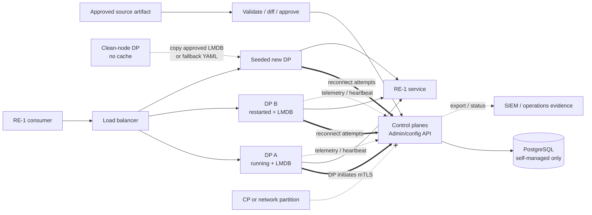
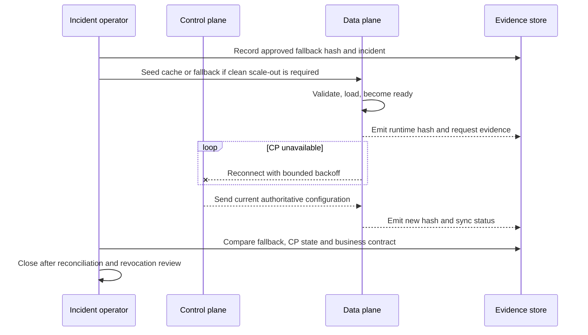

<!-- study-contract: principal -->

# Kong control-plane/data-plane operating study

| Field | Value |
|---|---|
| Artifact type | architecture-study |
| Decision question | Can a Kong hybrid CP/DP design preserve safe RE-1 request service, controlled staleness, recoverable scale, and auditable change during control-plane and dependency failures? |
| Decision owner | API Platform Architecture Review Board |
| Primary audiences | Platform architects, SRE, network, security, PKI, operations, developers and change assurance |
| Scope | Kong Gateway Enterprise 3.14 LTS policy; self-managed hybrid and Konnect hybrid with customer-hosted DPs; existing, restarted and clean-node DPs; CP, PostgreSQL, PKI, license and telemetry paths |
| Evidence state | Documented (`E1`) mechanisms and test hypotheses; no topology has been executed or approved |
| Reference case | [RE-1 enterprise reference case](41-enterprise-reference-case.md), especially J-01, J-03, J-06 and I-02/I-03/I-05 |
| As-of date | 2026-08-17 |
| Next gate | Disconnected-operations design review after CPDP-P01 through CPDP-P05 evidence is independently reviewed |

## Provisional answer

**Evidence state:** `E1 — documented`, with `E3 — not run`. Kong's documented hybrid mechanism can keep an already configured data plane proxying when its control plane or CP database is unavailable. It also documents restart from a local configuration cache and a way to seed a new DP from copied LMDB state or fallback declarative configuration. Those facts justify a failure-focused PoC; they do **not** establish an acceptable outage envelope, safe freshness policy, clean scale-out, certificate rollover, license behavior, or recovery consistency for RE-1.

The central architecture distinction is that **request availability, configuration availability, and evidence availability have separate SLOs**. A healthy cached DP can serve yesterday's approved policy while operators cannot deploy today's revocation or safety change and analytics buffers are losing old records. Calling that state “available” without plane-specific objectives would hide material risk.

## Bounded option boundary awaiting configuration freeze

These columns distinguish two CP ownership archetypes; neither is an exact option until the 3.14 patch/image, regional endpoints, cache/PKI/filesystem settings, plugins, substrate and E2 terms requested below are frozen. A result from one column cannot establish the other.

| Concern | Self-managed hybrid 3.14 LTS policy | Konnect hybrid with self-hosted 3.14 LTS-policy DPs |
|---|---|---|
| CP owner/location | Customer; CP nodes and PostgreSQL in approved customer environment | Kong; selected Konnect geo and service boundary |
| DP owner/location | Customer; AKS, other supported Kubernetes, VM or container environment | Customer; supported runtime in approved environment |
| CP/DP channel | DP-initiated mTLS, commonly control/config on 8005 and telemetry on 8006 | DP-initiated TLS to documented regional Konnect endpoints over 443 |
| Configuration authority | Admin API/decK/pipeline against CP; PostgreSQL authoritative for CP entities | Konnect APIs/UI/decK/Terraform according to ownership model |
| Runtime cache | Per-DP LMDB cache, unencrypted by default; optional encryption and fallback configuration are documented | Per-DP cached configuration; Konnect is authoritative |
| CP/DB recovery | Customer backup, restore, migration, DNS, LB and PKI | Contract/service operation by Kong; customer still owns DP recovery and egress |
| Commercial/support evidence | Enterprise license and support terms required | Konnect subscription, SLA, DPA/residency/support terms required |

Ports are defaults/examples, not an approved firewall rule. Exact regional hostnames, proxy behavior, certificate mode, SNI, egress inspection, DNS, and TLS-aware intermediary design must be derived from the [CP/DP communication contract](https://developer.konghq.com/gateway/cp-dp-communication/) and [Konnect network requirements](https://developer.konghq.com/konnect-platform/network/) for the frozen variant.

Traditional and DB-less topologies are excluded from this CP/DP study. Dedicated Cloud Gateways are also excluded because Kong operates their DPs; they require a distinct responsibility and failure study.

## Mechanism analysis: state, connection, and restart

**Figure CPDP-A1 — A cached request plane survives only within a wider dependency envelope.**

- **Depicted scope:** hybrid configuration, request, telemetry and recovery paths for existing, restarted and clean-node customer-hosted DPs.
- **Excluded scope:** final edge, upstream HA, enterprise identity, SIEM and storage designs, and any claim that cached proxying meets an approved outage window.
- **Diagram source, evidence state and as-of:** inline Mermaid synthesis from the cited official Kong hybrid and CP/DP communication documentation; `E1 documented` with failure interpretation, no observed partition; 2026-08-17.
- **Accessible equivalent:** source/pipeline updates the CP and its self-managed database where applicable; existing and restarted DPs use local LMDB while attempting CP connection; a clean DP first needs an approved seed; the load balancer sends requests to admitted DPs and DPs emit heartbeat/telemetry. The following state table restates authority, persistence, disconnected behavior and control consequence.

**Figure interpretation:** Existing, restarted, and clean-node DPs are three different failure cases. Only the first two have local cached state by default. A clean node needs a controlled seed, and any manually supplied disconnected configuration is overwritten when CP authority reconnects. The recovery design therefore needs provenance, staleness, reconciliation, and scale-out controls—not only a “CP down / traffic still works” screenshot.

**Figure limitation:** Documented cache/reconnect mechanisms do not establish an acceptable partition duration, safe freshness, seed provenance, storage integrity or RE-1 availability for either CP ownership model.

| State | Authority and persistence | Behavior under disconnection | Control consequence |
|---|---|---|---|
| CP entities | PostgreSQL for self-managed CP or Konnect service | No new configuration reaches DPs | Emergency revoke/fix may be unavailable |
| DP configuration | CP authoritative; DP persists latest received configuration in local LMDB | Existing DP proxies; restarted DP can load cache | Cache age and disk integrity become service controls |
| Clean-node bootstrap | None until CP sync, copied LMDB, or approved declarative fallback | Empty/unready without one of those inputs | Autoscaling may fail when most needed; copied state needs chain of custody |
| Manual disconnected state | Local declarative configuration after cache removal | Can proxy the fallback | CP reconnect overwrites it; incident changes must be reconciled |
| CP/DP identity | Cluster certificates, PKI mode/shared mode and SNI settings | Expiry/revocation blocks config and telemetry while cached proxying may continue | Dual-trust rollover and expiry alert must precede outage |
| Enterprise entitlement | License loaded/distributed according to topology | Current documented expiry preserves unchanged proxy traffic but constrains configuration/startup differently by mode/version | License is a recovery dependency and must be in the continuity inventory |
| Analytics/telemetry | Runtime buffers plus CP/collector destinations | Buffered until limit, then older data can be dropped | An available request path can have an audit/analytics gap |

Kong documents DP fault tolerance, LMDB persistence, new-DP seeding, fallback state, overwrite-on-reconnect, license caveats, and telemetry buffering in [hybrid mode](https://developer.konghq.com/gateway/hybrid-mode/). The local LMDB is documented as unencrypted by default; cache encryption, disk access, backup/seed handling, and forensic retention must therefore be explicitly designed.

## Configuration propagation and version behavior

The CP sends configuration snapshots to connected DPs. The current hybrid documentation distinguishes full configuration sync for older lines and incremental sync for 3.10 and later. Incremental sync reduces change payload and reconfiguration work, but does not prove atomic business semantics across multiple DPs. During an update, DPs can briefly expose different hashes; the test must record each runtime fingerprint and the policy behavior observed at the load balancer.

Kong recommends one DP major version per CP and documents compatibility as the least-common supported subset when versions differ. Konnect may reject configuration incompatible with connected DPs. See [version compatibility in control planes](https://developer.konghq.com/gateway/data-plane-version-compatibility/). A mixed-version rolling period is an explicit risk window, not a permanent target state.

Custom plugins must exist on CP and every DP before their configuration is accepted and executed. Plugin artifact digest, Lua/Go dependency set, schema, priority, signature/provenance, and upgrade choreography are therefore part of the CP/DP contract. Missing or divergent plugin code can turn a valid central entity into a runtime startup or behavior defect.

## RE-1 scenario mechanics

RE-1 values are **scenario assumptions** and not observed capacity, traffic, RTO/RPO, or approved objectives.

- For J-01, cached proxying during I-02 is useful only if authentication, certificate trust, rate-limit state, upstream idempotency and audit evidence remain acceptable. A lost J-01 response is not made safe by DP availability.
- For J-03/I-03, a CA or IdP key revocation may be the urgent change that the disconnected CP cannot deliver. The maximum safe configuration age must therefore vary by control: a route may tolerate staleness longer than a compromised credential or CA.
- For J-06/I-02, capture source commit, CP acceptance time, per-DP hash, actual policy result, disconnect time, cache age, restart source, reconnect full/incremental sync and convergence time.
- For I-05, distinguish Kong-to-CP analytics buffering from configured OpenTelemetry/plugin queues and from the downstream collector. Each has a separate bound and data-loss behavior.
- For I-06, regional DP readiness says nothing about DNS convergence, certificate availability, identity issuer reachability, Redis state, upstream replication, or client retry safety.

## Failure and recovery analysis

| Failure | Documented/expected mechanism | First hidden consequence | Recovery evidence |
|---|---|---|---|
| CP process or CP load balancer down | DPs reconnect; cached proxying continues | Config, revocation and admin paths unavailable | Per-plane SLI, reconnect distribution and no thundering herd |
| Self-managed PostgreSQL down | CP readiness/change path fails; DPs retain cached state | Backup recency and DB failover may lag apparent runtime health | DB failover plus CP read/write and DP convergence |
| Running DP loses CP link | It serves its cached hash | Stale config and analytics gap may be invisible at edge | Alert before freshness limit; hash/last-seen evidence |
| Cached DP restarts | It loads LMDB and continues if disk/config/license/plugin state is valid | Ephemeral volume, corrupt cache or missing plugin makes the expectation false | Pod/node deletion with retained and lost storage variants |
| Clean DP starts while partitioned | Must receive copied LMDB or fallback YAML | Unsigned/stale seed can scale a bad configuration | Provenance, hash, readiness and post-reconnect reconciliation |
| Cluster certificate expires | Config/telemetry connection fails; cached proxying can continue | Change outage may persist while requests look healthy | Overlap, rotation, revocation and pinned-CA test |
| Telemetry buffer fills | Older records are dropped | Audit/analytics RPO violated without request errors | Buffer occupancy, drop count, alert and reconstruction |
| License reaches expiry/invalid state | Behavior is version/topology specific; current docs keep unchanged proxying but restrict change/startup | Incident recovery can fail on a new or restarted node | Exact-version expiry drill in isolated licensed environment |
| Reconnect after manual fallback | CP pushes latest authoritative state rather than replaying every old change | Emergency local fix can be silently replaced | Deterministic reconciliation and incident record linkage |

**Figure CPDP-A2 — Recovery finishes at semantic reconciliation, not socket reconnection.**

- **Depicted scope:** operator-visible steps from selecting a disconnected fallback through seeding, admission, reconnect, authoritative comparison, runtime verification and evidence closure.
- **Excluded scope:** product-internal recovery not visible to the operator, exact automation and timing, and any assertion that a step meets an SLO.
- **Diagram source, evidence state and as-of:** inline Mermaid proof model derived from the documented [hybrid reconnect and cache mechanisms](https://developer.konghq.com/gateway/hybrid-mode/); `Interpretation`, no executed recovery; 2026-08-17.
- **Accessible equivalent:** select and hash an approved fallback; seed the clean node; admit it only after provenance, freshness and policy checks; reconnect; allow CP authority to replace or validate temporary state; verify all DP hashes and golden behavior; close only after audit/incident reconciliation. The preceding failure matrix supplies the corresponding risks and controls.

**Figure interpretation:** Recovery is not complete when the socket reconnects. It is complete only after authoritative state replaces or validates the fallback, every DP exposes the expected hash, critical policy behavior is retested, and the incident/audit trail explains the temporary state.

**Figure limitation:** The sequence is an unexecuted operator proof model, not documentation of Kong's internal recovery implementation, automation, ordering guarantee or achievable recovery time.

## Counter-evidence and non-fit conditions

| Hypothesis | Counter-evidence | Falsification condition |
|---|---|---|
| “Hybrid cannot survive a CP outage.” | Kong documents cached proxying and restart from local cache | Exact topology fails an existing/restarted DP within the approved window |
| “Hybrid is effectively air-gapped.” | Changes, clean scale-out, license lifecycle, analytics, identity and support can retain external dependencies | Any mandatory autonomous operation fails during the required isolation window |
| “Multiple CPs eliminate configuration risk.” | CP HA does not eliminate shared DB, bad configuration, PKI, DNS, plugin or authority defects | Common-mode fault takes all change paths or distributes an invalid snapshot |
| “A copied LMDB makes clean scale-out routine.” | Copying runtime cache introduces provenance, encryption, version and staleness risks | Seed cannot be automated, signed/verified, or reconciled within the recovery objective |
| “Readiness proves end-to-end health.” | `/status/ready` checks valid config/workers/plugins for hybrid DPs but not DNS, network, upstream or third-party plugin health | Journey probe fails while pod remains ready |

Non-fit conditions include a mandatory zero-external-dependency operating period with emergency changes, inability to protect/certify cached state, no approved license continuity control, no owner for self-managed CP/PostgreSQL, or a change-freshness objective shorter than detectable/recoverable CP outages. A negative result excludes the tested topology, not the product family.

## Decision implications

- Define separate request, configuration, admin, analytics, audit and portal objectives.
- Design for existing, restarted and clean-node DPs; do not treat them as one test.
- Give security-sensitive configuration classes explicit maximum staleness and emergency authority rules.
- Make cache protection, seed provenance, license, custom plugins and reconciliation part of continuity design.
- Require the same partition/restart/scale-out proof from every candidate with separated control and runtime planes.

## Falsification and proof plan

| Proof ID | Procedure | Measure | Threshold | Evidence artifact | Independent reviewer |
|---|---|---|---|---|---|
| CPDP-P01 | Block CP DNS/ports while J-01/J-03 run; attempt J-06 | request SLI, attempted-change result, config age/hash, last-seen alarm | Approved request SLO and explicit change failure; alert before maximum staleness | flow rules/logs, requests, CP/DP metrics and hashes | Network and SRE reviewers |
| CPDP-P02 | During partition restart one cached pod, drain its node, then start a clean-node DP with approved seed | readiness, served hash, error rate, scale time, seed provenance | No empty/unknown config; recovery within objective; no unsafe traffic | volume events, image/plugin digests, seed signature and timeline | Resilience reviewer |
| CPDP-P03 | Rotate and revoke CP/DP certificates with old/new trust overlap, then test pinned and expired cases | connection continuity, failed handshakes, alert lead time, rollback | No untrusted connection; no avoidable config outage; audit complete | certificate chain, packets, logs and rotation runbook | PKI owner |
| CPDP-P04 | Fill CP analytics and OpenTelemetry paths during I-05 | queue use, oldest-record loss, memory/CPU, request SLI, reconstructed gap | Within approved telemetry RPO and request SLO; drops alert before limit | load/collector fault, queue/drop metrics and SIEM comparison | Observability governance |
| CPDP-P05 | Restore self-managed CP/DB or recover Konnect connectivity; reconcile fallback and run golden policy | CP RTO/RPO, per-DP convergence, policy diff, orphan/manual state | All DPs reach approved hash and contract before incident closure | backup/restore logs or provider incident record, config diff and sign-off | DR assurance lead |

Thresholds remain unapproved until decision owners set them; no scenario assumption is an observed result.

## Risks and limitations

- Exact 3.14 patch, cache format, image, plugins, certificate mode, filesystem and AKS storage behavior are not yet frozen.
- Konnect SLA, service recovery, geo/data handling, support and audit-export commitments require `E2`; official docs are not contract terms.
- Self-managed PostgreSQL topology, backup consistency, encryption/keyring, restore and upgrade need separate database engineering.
- A lab partition will not prove a long-duration real outage, vendor incident response, internet routing failure, or representative operator toil.
- RE-1 is synthetic, and every numeric value is a scenario assumption.

## Open evidence requests

| Request | Owner role | Due gate | Decision impact if unresolved |
|---|---|---|---|
| Maximum staleness and change-outage objective by control class | Security, risk and service owners | Test design | Cannot judge CP partition behavior |
| Exact CP/DP PKI, cache encryption/storage and fallback-seed design | Platform, PKI and storage architects | Architecture review | Clean restart/scale-out remains unsafe |
| Self-managed DB HA/backup/restore design or Konnect contractual recovery evidence | Database SRE or vendor manager | DR review | No control-plane continuity conclusion |
| Exact license distribution/expiry behavior for frozen version | Asset/vendor manager and platform engineering | Continuity review | Restart/scale-out recovery remains unproven |
| CPDP-P01 through P05 raw bundle | Test lead | Disconnected-operations review | No approval for hybrid resilience claim |

## Next gate

The next gate is a Disconnected-operations Design Review. It passes only if CPDP-P01 through CPDP-P05 reproduce the three DP states, approved plane-specific objectives are met, fallback provenance and reconciliation are demonstrated, security/PKI and SRE reviewers accept the evidence, and unresolved E2 terms cannot reverse the design.

Until then, “data planes keep proxying” remains a documented mechanism—not an availability conclusion.
