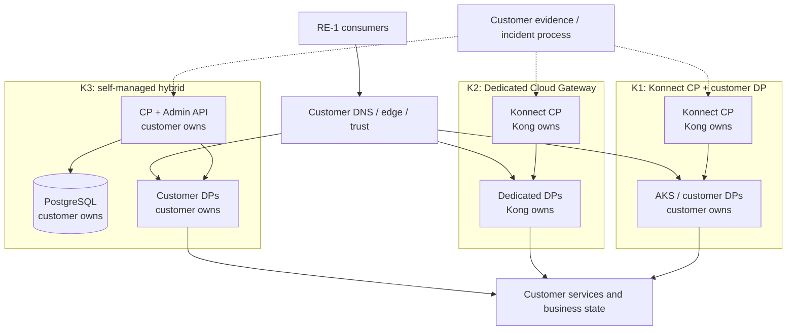

<!-- study-contract: principal -->

# Konnect versus self-managed Kong operating-model study

| Field | Value |
|---|---|
| Artifact type | comparative-study |
| Decision question | Which Kong control/data-plane ownership model should proceed to evidence-based comparison for RE-1, and what proof prevents a false SaaS-versus-self-managed simplification? |
| Decision owner | API Platform Steering Committee with Security and Operations governance |
| Primary audiences | Executives, procurement, privacy, platform leadership, enterprise architecture, SRE, security, network and FinOps |
| Scope | Konnect standard CP with customer-hosted DPs; Konnect Dedicated Cloud Gateways; self-managed Kong Gateway Enterprise hybrid; Serverless as a bounded screen; 3.14 LTS customer-hosted DP version policy |
| Evidence state | Documented (`E1`) responsibility mechanisms; E2 terms, E3 tests, E4 operating evidence and cost model are absent |
| Reference case | [RE-1 enterprise reference case](41-enterprise-reference-case.md), synthetic and non-organizational |
| As-of date | 2026-08-17 |
| Next gate | Operating-model evidence review with completed responsibility, residency, resilience, exit and cost evidence |

## Provisional answer

No preference is supportable yet. Konnect can remove operation of the Gateway control plane, and Dedicated Cloud Gateways can also remove operation of DP infrastructure. Self-managed hybrid retains direct control over CP, PostgreSQL, DP placement and backups, but transfers all of their reliability and lifecycle work to the organization. Neither “managed” nor “control” is an outcome: the decision depends on whether the exact responsibility boundary meets RE-1 resilience, privacy, evidence, staffing and exit requirements at an acceptable verified cost.

**Evidence state:** all product behavior below is `E1 — documented`; contract/SLA/data-processing facts are `E2 — requested`; tests are `E3 — not run`; actual toil and representative use are `E4 — unknown`. Depth in this Kong comparison does not imply a preference over another product candidate.

## Bounded operating archetypes, not a binary brand choice

K1–K4 are responsibility archetypes for symmetric discovery. They are not contractable/reproducible option records until service geography, version/digest or vendor-managed release policy, network mode, plugin set, evidence access, capacity objective, entitlement and support terms are frozen through the [open evidence requests](#open-evidence-requests).

| Option | Kong-owned | Customer-owned | Key unresolved boundary |
|---|---|---|---|
| K1 — Konnect standard CP + customer-hosted DP | Konnect CP service, its updates and service-side persistence | DP image rollout, AKS/runtime, load balancer, network egress, capacity, cache, plugins, certificates and configured telemetry | Geo/data classes, SLA/remedy, support handoff, compatible DP window, clean scale-out and exit |
| K2 — Konnect Dedicated Cloud Gateway | Konnect CP plus single-tenant managed DP environment, DP upgrades and available autoscaling modes | API/policy configuration, consumer edge/DNS, backend connectivity, enterprise identity, evidence integration and application behavior | Cloud/region/network option, plugin/customization limits, runtime evidence, scaling guardrails and shared responsibility |
| K3 — self-managed Enterprise hybrid | Product binaries/images and entitled vendor support | CPs, PostgreSQL, DPs, load balancers, PKI, license, backup/restore, patches, capacity, telemetry and every infrastructure dependency | Staffing, RTO/RPO, patch lag, joint incident boundary, database migration and total toil |
| K4 — Konnect Serverless | Hosted CP and automatically provisioned lightweight DP | API config, public backend reachability/security, identity and consumer path | Current limits, public-only networking, runtime version control and workload fit |

Kong documents self-hosted, Dedicated, and Serverless DP hosting modes in [Data Plane hosting options](https://developer.konghq.com/gateway/topology-hosting-options/). Serverless currently documents automatically managed versions, public networking and bounded limits in its [reference](https://developer.konghq.com/serverless-gateways/reference/); it remains screening-level for RE-1 and must not be used as evidence for K1 or K2.

The customer-hosted baseline is Kong Gateway Enterprise 3.14 LTS-policy DPs with an exact patch/image digest to be frozen. K2's runtime version is vendor-managed according to the current [Konnect compatibility policy](https://developer.konghq.com/konnect-platform/compatibility/). K3 also needs an exact supported PostgreSQL, OS/container, Helm and Kubernetes bill of materials.

## Mechanism analysis: responsibility moves by plane

**Figure KVS-A1 — Managed service reduces owned components, not downstream accountability.**

- **Depicted scope:** ownership of CP, DP, database, consumer edge, backend and evidence paths for K1 Konnect/customer DP, K2 Dedicated and K3 self-managed hybrid.
- **Excluded scope:** final commercial model, approved staffing/RACI, service geography, network mode and E2 contract/support commitments.
- **Diagram source, evidence state and as-of:** inline Mermaid synthesis from the cited official Kong hosting, networking, hybrid and backup mechanisms; `E1 documented` plus responsibility interpretation, no observed operating model; 2026-08-17.
- **Accessible equivalent:** K1 places CP with Kong and DP with the customer; K2 places CP and DP with Kong; K3 places CP, PostgreSQL and DP with the customer. In every case consumers traverse customer trust/edge and reach customer services, while evidence and incident handling cross the ownership seam. The following RACI-style table states the accountable work and proof.

**Figure interpretation:** K2 moves the most gateway infrastructure to Kong; K3 leaves the most with the organization. In all three, the organization still owns business correctness, consumer trust, upstream availability, data classification, acceptance criteria and incident command. The decisive evidence is therefore the seam: who detects, proves, restores and communicates a cross-boundary incident.

**Figure limitation:** Component placement does not prove service levels, data residency, support response, staffing sufficiency or cost; those conclusions require exact topology plus E2–E4 evidence.

| Activity | K1 | K2 | K3 | Evidence needed |
|---|---|---|---|---|
| CP patch/HA/restore | Kong | Kong | Customer | SLA/incident record for managed; restore drill for self-managed |
| DP patch/capacity/zone spread | Customer | Kong within selected service options | Customer | Upgrade/scale/failure proof and responsibility statement |
| CP/DP certificate and connectivity | Shared: Kong endpoint, customer DP/egress/cert | Primarily Kong inside service; customer backend/edge remains | Customer | Rotation, expiry, DNS/firewall and support handoff |
| PostgreSQL backup/migration | Not customer accessible | Not customer accessible | Customer | Export/restore coverage versus service continuity/exit terms |
| Configuration approval/semantic rollback | Customer | Customer | Customer | Source, diff, audit, runtime hash and policy-contract result |
| Custom plugin artifact | Customer builds/qualifies; topology rules apply | Availability/deployment restrictions to verify | Customer builds/qualifies on CP and DPs | SBOM/signature, compatibility, rollout and vendor support statement |
| Analytics/audit export and retention | Shared | Shared | Customer designs all sinks plus product audit | Field-level data map, loss test, retention and legal access |
| Business transaction recovery | Customer | Customer | Customer | J-01 idempotency/reconciliation evidence |

## Residency and data handling

Konnect geo selection does not reduce data handling to “requests stay local.” Kong lists geo-specific objects including Services, Routes, Consumers, APIs, application registrations, portals and some end-user data, while authentication, billing and usage are shared between geos in the current [geographic-region documentation](https://developer.konghq.com/konnect-platform/geos/). The exact data-processing addendum, support access, backups, logs, analytics, telemetry, identifiers, encryption/key management and deletion behavior require contractual evidence.

For K1, application payloads traverse customer-hosted DPs, but DPs also send status/analytics and receive configuration. For K2, the DP resides in a Kong-managed cloud environment and backend connectivity can use documented public or private patterns that vary by cloud. For K3, the organization selects every storage and sink location, but must prove backups, replicas, administrators and support bundles obey policy. Direct control creates work; it does not itself prove compliance.

## RE-1 scenario and operating consequences

RE-1 volumes, failure windows, service objectives and operator coverage are **scenario assumptions**, not observed or approved facts.

| RE-1 event | K1 consequence | K2 consequence | K3 consequence |
|---|---|---|---|
| I-02 CP disconnect and stale restarted DP | Customer DPs use cache; Kong restores CP; customer owns DP restart/seed/egress | Kong owns both gateway planes, but evidence and guaranteed behavior depend on service terms | Customer diagnoses CP/LB/DB/PKI, preserves DP service and restores/reconciles all control state |
| I-03 certificate/CA rollover | Shared runbook across Konnect client certs, customer runtime, partner trust and IdP | Managed DP certificate mechanics plus customer edge/backend/partner trust | Customer owns all gateway CP/DP and edge/backend PKI |
| I-04 noisy neighbour | Customer chooses DP isolation and capacity | Service isolation/autoscale claims require exact configuration and E2/E3 evidence | Customer chooses CP/DB/DP isolation and pays/operates it |
| I-05 telemetry backpressure | Customer DP queues plus Konnect/collector path | Available service exports and managed buffering must be evidenced | Customer owns every queue/sink plus product behavior |
| I-06 regional loss | Customer steers among hosted DPs; Konnect CP dependency/recovery remains separate | Multi-region Dedicated design, networking and service failover must be configured and proven | Customer runs regional CP/DP/DB or a deliberately centralized CP and proves recovery |
| I-08 rollback after irreversible schema/data | Gateway config can roll back only within entity/compatibility bounds; business schema/data cannot | Same business limitation; provider can only recover its service boundary | DB migrations are documented as non-reversible; customer needs backup/upgrade strategy plus business rollback |

J-01 and J-03 require the same downstream idempotency, identity, quota and audit controls in all options. A managed gateway cannot resolve an ambiguous transfer result. J-06 has different mechanics, but the organization remains accountable for approving the change and verifying every runtime.

## Lifecycle, support, and exit

- **K1:** Konnect CP is versionless/updated by Kong; customer DPs must stay in the current compatibility window. Mixed DP versions can restrict usable configuration to their common supported subset. A rejected configuration during rollout is an operational event, not proof of safety.
- **K2:** Kong documents that Dedicated Cloud Gateway upgrades are managed and that available versions follow a tested release path. Maintenance control, notification, emergency patch, rollback, custom plugin, forensic and capacity details require the exact service specification.
- **K3:** the customer chooses supported/LTS lines, upgrades CP before DPs, operates PostgreSQL, and preserves native database backups. Kong says migration commands are not reversible and declarative export is secondary—not a complete database backup—in [backup and restore](https://developer.konghq.com/gateway/upgrade/backup-and-restore/).
- **Exit:** K1/K2 must prove configuration, consumer, credential, certificate, portal, analytics/audit and historical-export coverage. K3 has direct database custody but still needs portable exports and semantic mapping. Neither a database dump nor decK YAML proves a working target platform.
- **Support:** only E2 terms can establish response, severity, remedy, named escalation, third-party integration and assistance with custom plugins. Public documentation is not a support contract.

## Failure modes, counter-evidence, and non-fit

| Claim | Counter-evidence or hidden cost | Non-fit/falsification test |
|---|---|---|
| “Konnect removes platform operations.” | K1 leaves DPs, AKS, network, cache, plugins and telemetry with the customer; K2 leaves edge, backend and evidence integration | Responsibility exercise finds an unowned critical incident step or staffing objective cannot be met |
| “Self-managed maximizes resilience.” | Shared PostgreSQL, PKI, operator error, patch lag and insufficient staffing can be common-mode risks | Restore/regional exercise misses approved RTO/RPO or requires unavailable expertise |
| “Managed service weakens residency.” | K1 can keep payload traffic in customer-hosted DPs; K2 offers regional/private options | Field-level data map or contract shows a prohibited data class/location/access path |
| “Self-managed guarantees residency.” | Backups, telemetry, support bundles, image registries and administrators may cross boundaries | Actual flow/storage evidence violates policy |
| “Dedicated is just Konnect hybrid without AKS.” | Runtime ownership, version control, networking, plugins, evidence access and scaling differ | Mandatory custom/network/evidence control is unsupported or untestable |
| “Export makes SaaS exit easy.” | Runtime state, credentials, history and semantics may not be in one export | Timed restore to an isolated target misses mandatory objects or business contract |

K1 is a non-fit if prohibited metadata/support access cannot be contractually bounded or the organization cannot operate DPs. K2 is a non-fit if required region/network/plugin/evidence controls are unavailable. K3 is a non-fit if the organization cannot staff and prove database, PKI, upgrade and DR ownership. These are symmetric gates, not weighted recommendations.

## Decision implications

- Evaluate K1, K2 and K3 as separate operating models with the same RE-1 tests and business thresholds.
- Use K4 only as a bounded screening option; its results cannot substitute for another variant.
- Price internal on-call, database, PKI, platform, upgrade, testing and incident work alongside subscription and infrastructure costs.
- Make exit restoration and cross-boundary incident command mandatory evidence before a managed/self-managed choice.

## Falsification and proof plan

| Proof ID | Procedure | Measure | Threshold | Evidence artifact | Independent reviewer |
|---|---|---|---|---|---|
| KVS-P01 | Build field-level configuration/telemetry/support data maps and trace flows for K1–K3 | data class, controller/processor, location, encryption, access, retention/deletion | Every restricted class has an approved location/control and contractual basis | diagrams, flow captures, settings and E2 clauses | Privacy and security review |
| KVS-P02 | Execute equivalent I-02/I-06 recovery scenario and cross-boundary incident tabletop for each option | plane RTO/RPO, handoffs, pages, evidence access, unresolved minutes | Approved objectives met; no unowned critical action | raw exercise logs, tickets, timeline and RACI corrections | Independent DR lead |
| KVS-P03 | Upgrade exact DP/plugin mix and restore/roll back configuration; for K3 also restore PostgreSQL | request SLI, compatibility rejection, data loss, rollback completeness | Golden contract passes; no unexplained loss; recovery inside objective | manifests, backups, config hashes, results | Change assurance and DBA reviewer |
| KVS-P04 | Export and reconstruct an isolated target including consumers/certs/plugins/audit requirements | object and semantic parity, time, manual steps, unavailable history | All mandatory exit objects/contracts restored within approved objective | inventory diff, export files, target tests, gap register | Architecture assurance |
| KVS-P05 | Run activity-based cost/toil model using measured operations and quoted terms | subscription, compute, DB, network, engineering/on-call hours, incident sensitivity | Model covers all owned activities with ranges and named sources | versioned model, quotes and time evidence | FinOps and procurement |

No value produced by a scenario assumption or vendor estimate is an observed result. All options use identical acceptance thresholds.

## Risks and limitations

- Konnect geos, Dedicated regions/networking, Serverless limits, versions and plugin support can change after the as-of date.
- E2 contracts may materially differ from public documentation and from one commercial package to another.
- The repository contains no representative incident, toil, capacity, support, data-flow or cost evidence.
- K3's PostgreSQL design and K2's internal service architecture are intentionally not presumed; the proof asks for the evidence each owner can provide.
- RE-1 is synthetic; all numeric inputs are scenario assumptions.

## Open evidence requests

| Request | Owner role | Due gate | Decision impact if unresolved |
|---|---|---|---|
| Konnect SLA/remedy, DPA, data-location, support-access, audit and exit terms | Procurement, legal, privacy and vendor manager | Operating-model review | K1/K2 cannot pass mandatory governance |
| Dedicated exact region/network/plugin/autoscale/upgrade/evidence configuration | Vendor technical account and network architect | Variant freeze | K2 remains undefined |
| Self-managed CP/PostgreSQL/PKI/backup/on-call design | Platform/SRE, DBA and PKI owners | Variant freeze | K3 remains undefined |
| Activity-based workload and cost inputs for all options | FinOps, platform and procurement | Cost review | No TCO comparison |
| KVS-P01 through P05 reproducible evidence | Test lead and named owners | Operating-model review | No option can enter recommendation |

## Next gate

The next gate is an Operating-model Evidence Review. It may advance K1, K2, or K3 independently only when the exact variant is frozen, mandatory E2 clauses are approved, KVS-P01 through KVS-P05 pass common thresholds, ownership has no critical gap, and exit/recovery artifacts are independently reviewed.

Until that gate, the comparison establishes decision questions—not a winner.
