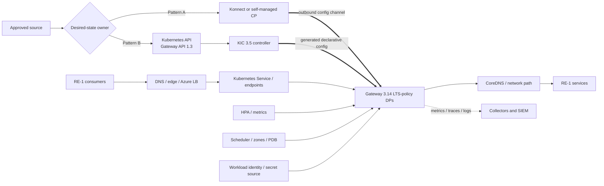

<!-- study-contract: principal -->

# Kong Gateway on AKS architecture study

| Field | Value |
|---|---|
| Artifact type | architecture-study |
| Decision question | Which bounded Kong-on-AKS operating pattern, if any, warrants Gate-1 bill-of-materials resolution against RE-1 isolation, lifecycle, network, scaling and failure requirements without ambiguous configuration ownership? |
| Decision owner | Cloud Platform and API Architecture Review Board |
| Primary audiences | Platform engineering, AKS/SRE, network, security, developers, DevOps, operations and FinOps |
| Scope | AKS Standard; Kong Gateway Enterprise 3.14 LTS policy; runtime-only hybrid DPs; KIC 3.5 with Gateway API 1.3 and DB-less DPs; Kong Operator 2.2.1 as a separately gated pattern |
| Evidence state | Documented (`E1`) component behavior and architecture hypotheses; exact AKS minor/BOM, entitlement, lab and production evidence are unknown |
| Reference case | [RE-1 enterprise reference case](41-enterprise-reference-case.md), synthetic, with J-01–J-06 and I-02–I-06 |
| As-of date | 2026-08-17 |
| Next gate | AKS bill-of-materials and failure-design review after AKS-P01 through AKS-P05 pass |

## Provisional answer

Kong can run on AKS, but “Kong on AKS” still does not identify an architecture. Three patterns have different desired-state owners and failure domains. The strongest current conclusion is that they must not be blended implicitly:

1. **Runtime-only hybrid DPs:** AKS runs proxy pods, while a self-managed or Konnect CP owns Gateway entities. KIC is disabled.
2. **Kubernetes-authoritative DB-less:** KIC 3.5 translates Gateway API 1.3/Kong resources into configuration for DB-less Gateway 3.14 LTS-policy pods.
3. **Operator-managed Gateway:** Kong Operator 2.2.1 reconciles Gateway/DataPlane/ControlPlane resources. Its exact AKS/Kubernetes compatibility needs vendor confirmation because the current public compatibility page does not yet show a 2.2 row.

**Evidence state:** all capability statements are `E1 — documented`; none is an `Observed result`. No pattern can be approved until the exact AKS minor, node image, CNI/network-policy engine, Kong image digest, Helm/operator/KIC versions, Gateway API CRDs, add-ons and support intersection are frozen. A current Kong support statement that AKS is a supported deployment target does not establish that any arbitrary component combination is supported; see the [Gateway support policy](https://developer.konghq.com/gateway/version-support-policy/).

## Bounded deployment archetypes and authority

Patterns A–C resolve the configuration-authority conflict but not a production bill of materials. Each remains at Gate 1 until the AKS/Kubernetes/CNI/node image, Gateway/KIC/Operator/chart/image digests, network/storage/identity settings, plugin bundle, entitlement and approved workload objectives in [Open evidence requests](#open-evidence-requests) are closed.

| Pattern | Configuration authority | Runtime/control components | Appropriate only when | Principal non-fit |
|---|---|---|---|---|
| A — hybrid runtime-only | Konnect or self-managed CP via approved API/decK pipeline | Gateway Enterprise 3.14 LTS-policy DP Deployment on AKS; no KIC; CP outside or separately deployed | APIs are not owned as Kubernetes routing resources, or centralized CP is intentional | Teams require Kubernetes Gateway API as the authoritative route/policy interface |
| B — KIC DB-less | Kubernetes API: Gateway API 1.3, KIC 3.5 and supported Kong CRDs | KIC controller plus DB-less Gateway 3.14 LTS-policy pods | Kubernetes namespaces/resources are the governance and lifecycle boundary | Non-Kubernetes APIs or CP writers must manage the same entities; DB-writing plugins are mandatory |
| C — Kong Operator 2.2.1 | Kubernetes resources reconciled by operator; scope depends on resource pattern | Operator, admission/conversion webhooks, embedded controller, managed DataPlane/Gateway resources | Operator lifecycle and CRD reconciliation are explicitly accepted | Exact AKS compatibility/support or CRD upgrade behavior is unconfirmed |

Kong explicitly recommends hybrid without KIC, or DB-less with KIC, for most cases; hybrid with KIC should be used only in limited circumstances in the current [hybrid Kubernetes guidance](https://developer.konghq.com/gateway/hybrid-mode/#hybrid-mode-with-kubernetes). In unmanaged KIC mode, KIC does not automatically create Deployments or Services, and resources associated with one controller can be merged into the generated configuration, as described in [Gateway API support](https://developer.konghq.com/kubernetes-ingress-controller/gateway-api/).

Kong Operator 2.2 is current and has no LTS designation in the [Operator support policy](https://developer.konghq.com/operator/support-policy/). The exact 2.2.1/AKS compatibility is an `Open question`; choosing it because it is newest would be speculation.

## Mechanism analysis: four control loops share one request path

**Figure AKS-A1 — Availability depends on independent gateway, Kubernetes, Azure and enterprise control loops.**

- **Depicted scope:** pattern A or B on one AKS regional cluster, including configuration authority, controller/workload reconciliation, Azure load balancing, enterprise dependencies and the request path.
- **Excluded scope:** final multi-region edge, backend/data recovery, landing-zone implementation and any claim that pod replication alone meets availability objectives.
- **Diagram source, evidence state and as-of:** inline Mermaid synthesis from the cited official Kong, Kubernetes and Microsoft AKS mechanisms; `E1 documented` plus dependency interpretation, no observed cluster; 2026-08-17.
- **Accessible equivalent:** source reaches either a CP or Kubernetes API/KIC; Kubernetes schedules Gateway pods; Azure LB endpoints expose them; consumers traverse DNS → LB → pods → service, while pods depend on identity, secrets, Redis and telemetry. The following dependency table maps each control loop to its owner and failure proof.

**Figure interpretation:** Gateway pod replication protects only one layer. A request can still fail because the Azure load balancer has stale endpoints, CoreDNS or CNI is impaired, the IdP/vault/Redis/collector is slow, topology constraints cannot place a replacement, or HPA metrics arrive after the burst. Pattern A and B cannot both write the same entity graph without a deliberate machine-enforced partition.

**Figure limitation:** The exhibit covers one regional AKS dependency model, not a pinned BOM, supported combination, multi-region design or measured availability/capacity result.

| Control loop | Desired/observed state | Failure behavior to prove | Owner |
|---|---|---|---|
| Gateway config | CP snapshot/cache in A; Kubernetes resources/generated DB-less snapshot in B | rejection, propagation, drift, stale restart, rollback | API platform or namespace owners according to pattern |
| Kubernetes workload | Deployment/DataPlane replicas, probes, PDB, resources, topology, HPA | node drain, rollout, unschedulable replacement, scale lag | AKS/platform SRE |
| Azure infrastructure | node pools/zones, API server, CNI, load balancer, disks, quota, IP space | zone loss, surge upgrade, SNAT/port/IP exhaustion, regional loss | Cloud platform and Microsoft boundary |
| External dependencies | CP endpoint, DNS, IdP/JWKS, PKI/vault, Redis, registry, telemetry | timeout, partition, stale cache, fail-open/closed, image pull | Shared named owners |
| Business service | idempotency, ordering, data, upstream capacity | I-01 ambiguity, I-06 stale data, I-08 irreversible change | Service/domain owner |

Microsoft's [AKS reliability guidance](https://learn.microsoft.com/en-us/azure/aks/best-practices-app-cluster-reliability) says workload manifests still need application-specific probes, replica counts, disruption budgets and topology rules even when cluster-level defaults exist. Kubernetes documents that topology spread depends on visible labeled domains and can behave unexpectedly when a node pool is scaled to zero in [topology spread constraints](https://kubernetes.io/docs/concepts/scheduling-eviction/topology-spread-constraints/). Neither “three replicas” nor “three zones” proves three ready capacity units after a disruption.

## Production topology and state ownership

The design hypothesis uses a dedicated gateway node pool per critical trust/capacity class, multiple zones where the chosen region supports them, and a separate system node pool. That is a **scenario assumption**, not an approved landing zone or observed need.

- Set CPU/memory requests and limits from measurement, then align `nginx_worker_processes` with allocated CPU. A throttled pod can remain Ready while tail latency fails.
- Use both zone and hostname topology spread with selectors that match the pod labels. Validate `minDomains`, `maxSkew`, taints and scale-from-zero interaction on the exact Kubernetes version.
- Make the PDB consistent with rollout surge, node upgrades and failure capacity. An aggressive PDB can block drain; a weak one can permit simultaneous loss.
- Use `/status` for liveness and `/status/ready` for readiness. Kong states hybrid/DB-less readiness means non-empty valid configuration, workers and plugins, but not upstream, DNS, network or third-party plugin health in [health-check probes](https://developer.konghq.com/gateway/traffic-control/health-check-probes/). Add journey-level synthetic checks outside pod health.
- Choose internal or public Azure Load Balancer/edge placement per trust path; preserve client IP only where the entire proxy chain and trusted addresses are explicitly configured.
- Default-deny network policy must allow only documented DNS, CP, backend, IdP/vault, Redis, registry and telemetry paths. Policy engine, CNI and support boundaries are part of the BOM.
- Use Microsoft Entra workload identity where a supported integration requires Azure access; do not mount broad static cloud credentials. Microsoft's [AKS baseline architecture](https://learn.microsoft.com/en-us/azure/architecture/reference-architectures/containers/aks/baseline-aks) provides the landing-zone mechanism, not a completed Gateway design.

## RE-1 scenario and operational mechanics

RE-1 traffic volumes, burst ratios, objectives and coverage windows are **scenario assumptions**.

- **J-01/J-03:** keep at least the largest approved failure unit out of steady-state capacity. A partner retry after I-01 still requires backend idempotency; pod availability cannot infer transaction outcome.
- **J-04:** include multipart/large body, slow client and threat-policy behavior. Default buffering can spill to disk and change pod ephemeral-storage and eviction risk.
- **J-05:** do not route settlement files through the proxy unless the exact size, streaming, malware scanning, timeout and reconciliation contract is approved.
- **J-06/I-02:** Pattern A must prove CP partition with cached/restarted/clean-node DPs. Pattern B must prove Kubernetes API/controller loss, generated config retention, controller restart and rejected-resource status.
- **I-04:** saturate one tenant/route/plugin while watching unrelated journey SLOs, HPA lag, node CPU/network and shared Redis/DNS/collector state.
- **I-06:** fail one cluster/region and prove edge/DNS, certificate, identity, backend data and client convergence; do not claim regional DR from zone spread.

## Failure modes and operational response

| Failure | Expected mechanism | Hidden edge | Evidence required |
|---|---|---|---|
| Pod exits | Service removes non-ready endpoint; replacement is scheduled | termination drain, long connections and endpoint propagation can drop traffic | graceful termination and in-flight result log |
| Node drain/upgrade | PDB/surge/topology should retain capacity | quota/IP shortage or PDB can stall upgrade; replicas can colocate unexpectedly | AKS upgrade under representative load |
| Zone loss | Remaining zones serve if pods/nodes/LB/backend capacity survive | HPA cannot create capacity in a missing zone; dependencies may be zonal | I-04/zone-loss time series |
| Kubernetes API or KIC unavailable | Existing DB-less Gateway config may continue; no new desired state is reconciled | deleted/changed endpoints and certificates can stale | controller partition/restart and runtime hash |
| CP unavailable in Pattern A | cached DP service continues | clean-node scale-out, emergency changes and telemetry differ | I-02 full matrix |
| CoreDNS/CNI failure | pods may remain Ready while upstream/control/identity resolution fails | probes against localhost miss the fault | DNS/network fault plus journey probe |
| Registry/secret source unavailable | existing pods may run; new/restarted pods may not | disruption removes cached image or mounted secret | clean-node restart during dependency outage |
| HPA metric delay | scale occurs after observed utilization crosses target | burst completes or fails before replicas are ready | burst/scale timeline and queue/error data |

## Counter-evidence and non-fit conditions

| Hypothesis | Strongest counter-evidence | Falsification/non-fit condition |
|---|---|---|
| “AKS makes the Gateway highly available.” | AKS supplies orchestration primitives, not correct workload settings or dependency HA | Largest allowed failure unit breaches a mandatory journey objective |
| “KIC is the natural choice on Kubernetes.” | Runtime-only hybrid deliberately centralizes Gateway entity authority outside Kubernetes | Mandatory centralized/non-Kubernetes ownership cannot be cleanly partitioned |
| “KIC removes the need for a CP.” | It replaces the configuration authority for its scope, but Kubernetes API/controller/CRDs become control dependencies | Controller/API loss or cross-namespace merge violates freshness/isolation objective |
| “Operator reduces toil.” | It adds CRDs, webhooks, reconciliation and its own upgrade/support lifecycle | Operator failure/upgrade cannot be diagnosed or recovered within staffing objectives |
| “Autoscaling supplies burst resilience.” | HPA is reactive and depends on metrics, schedulable nodes, quota and image/secret access | Scale lag causes SLO breach or clean replicas cannot start during I-02/I-04 |

A pattern is a non-fit if it has two uncontrolled configuration writers, an unsupported BOM intersection, no capacity after the largest allowed disruption, no private/trusted network path, an unowned controller/CRD upgrade, or a recovery dependency unavailable during clean-node replacement. Failure excludes the exact pattern, not every Kong or AKS variant.

## Decision implications

- Select Pattern A, B or C explicitly for each gateway boundary; do not enable KIC “because it is Kubernetes.”
- Freeze and support the entire BOM intersection, not individual latest versions.
- Make clean-node recovery, controller/CP partition, zone/node upgrade and dependency loss first-class acceptance tests.
- Treat runtime isolation, desired-state ownership and regional DR as separate design decisions.

## Falsification and proof plan

| Proof ID | Procedure | Measure | Threshold | Evidence artifact | Independent reviewer |
|---|---|---|---|---|---|
| AKS-P01 | Produce exact Pattern A/B/C BOM and obtain vendor/Microsoft support confirmation for the selected AKS minor | version/support intersection, EOL runway, exclusions | Every production component supported through approved runway; no unknown critical pairing | BOM, image/chart digests and support references | Architecture assurance |
| AKS-P02 | Kill pods, drain node, perform surge upgrade and remove one zone under J-01–J-04 load | availability, p99/p99.9, in-flight outcomes, replicas, placement, recovery | Approved journey SLOs while losing largest allowed unit; no ambiguous J-01 retry by platform | manifests, events, load results, topology timeline | SRE and business service owner |
| AKS-P03 | Break CoreDNS/CNI/control egress, registry and secret source separately | pod readiness versus journey health, alarms, restart success | Fault classified within objective; no clean pod serves unknown state | fault rules, probe results, packets and runbook record | Network/security reviewer |
| AKS-P04 | For A run CP partition matrix; for B/C stop controller/API access and submit valid/invalid J-06 changes | config age/hash, rejected status, runtime behavior, reconciliation | One authority preserved; no partial/unowned state; convergence within objective | source commit, controller/CP logs and DP hashes | Change assurance |
| AKS-P05 | Drive burst/noisy-neighbour while forcing HPA and node autoscale | scale lag, CPU/memory/network, 429/5xx, cross-tenant SLI, quota/IP events | Isolation and headroom meet approved objectives without unsafe quota behavior | raw metrics, autoscaler events and per-journey results | Performance and FinOps |

No threshold is an observed result. Pending business thresholds remain blockers, not invented acceptance values.

## Risks and limitations

- The exact AKS/Kubernetes minor is intentionally unresolved until compatibility and support are jointly confirmed.
- Operator 2.2.1 is current, but public compatibility evidence for its exact Kubernetes matrix is incomplete as of the review date.
- Azure CNI, network policy, edge, DNS, Key Vault, registry, observability and regional design are not implied by the checked-in Gateway manifests.
- A lab cannot establish Microsoft/Kong joint support behavior or real on-call toil.
- RE-1 is synthetic; all numeric inputs are scenario assumptions.

## Open evidence requests

| Request | Owner role | Due gate | Decision impact if unresolved |
|---|---|---|---|
| Exact AKS/Kubernetes/CNI/policy/node-image/add-on versions and region/zone capability | Cloud platform | BOM review | No production topology definition |
| Exact Kong image/chart/KIC/operator/Gateway API compatibility and support statement | Vendor manager and platform engineering | BOM review | Pattern remains ineligible |
| Desired-state authority and namespace/control-plane boundary | Enterprise/API architecture | Architecture review | Dual-writer and blast-radius risk unresolved |
| Approved disruption/capacity/scale/recovery thresholds | Service owners, risk, SRE and FinOps | Test design | AKS-P02/P05 cannot be judged |
| AKS-P01 through P05 raw evidence | Test lead | Failure-design review | No AKS fit conclusion |

## Next gate

The next gate is an AKS Bill-of-materials and Failure-design Review. It passes only when one pattern is selected per boundary, every version/support intersection is proven, platform and product responsibilities are named, AKS-P01 through AKS-P05 meet approved RE-1 thresholds, and an independent reviewer can reproduce the evidence.

This study defines what “production-ready on AKS” must mean; it does not claim the state exists.
