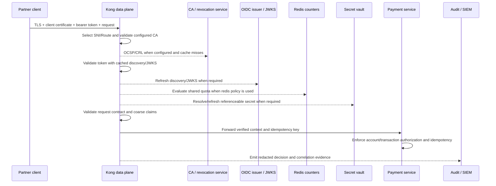

<!-- study-contract: principal -->

# Kong Gateway security-control study

| Field | Value |
|---|---|
| Artifact type | architecture-study |
| Decision question | Can the exact Kong Gateway variants enforce RE-1 identity, transport, abuse, secret, supply-chain and audit controls without unsafe fail-open behavior or hidden runtime dependencies? |
| Decision owner | Cybersecurity Architecture and API Risk Committee |
| Primary audiences | Security leadership, IAM/PKI, platform architects, AppSec, SRE, developers, privacy and audit teams |
| Scope | Kong Gateway Enterprise 3.14 LTS policy in self-managed/Konnect hybrid and DB-less/KIC patterns; OIDC, mTLS Auth, Request Validator, rate limiting, Vaults, admin/audit and custom plugins |
| Evidence state | Documented (`E1`) mechanisms; entitlement/contract (`E2`) and executable security evidence (`E3`) are absent |
| Reference case | [RE-1 enterprise reference case](41-enterprise-reference-case.md), especially J-01/J-03/J-04 and I-01/I-03/I-05/I-07 |
| As-of date | 2026-08-17 |
| Next gate | Security design authority review after KSEC-P01 through KSEC-P05 and entitlement evidence are complete |

## Provisional answer

Kong documents mechanisms for external-issuer OIDC validation, mutual TLS client authentication, request validation, rate limiting, external secret references, RBAC/audit and custom plugin execution. That capability set is sufficient to design security tests, but not to conclude control effectiveness. Several relevant plugins are Enterprise-labelled; topology/hosting compatibility varies; identity and revocation behavior depends on caches and remote services; Redis failure can weaken a shared quota; and a custom plugin executes inside the request lifecycle.

**Evidence state:** `E1 — documented` only. The repository contains no licensed execution, penetration test, configuration inspection, certificate rollover, dependency-loss, audit completeness or supply-chain evidence. No control is marked implemented or effective.

The target security model keeps token issuance and domain authorization outside the gateway. Kong acts as a policy enforcement point for transport, token validity, coarse claims/scopes, route/schema constraints and abuse protection; the service remains authoritative for account access, transaction entitlement, idempotency, ledger outcome and compensation. This prevents a gateway policy from becoming an undocumented business-authorization engine.

## Security mechanisms awaiting option and entitlement resolution

The rows name mechanisms that could enter an option; they do not imply that every mechanism is supported, entitled or configured in every Kong topology. The exact Gateway/plugin versions, hosting mode, identity/PKI/vault dependencies and E2 entitlement/support evidence must be frozen through the [open evidence requests](#open-evidence-requests) before control fit can be judged.

| Control | Exact mechanism under study | Variant caveat | Evidence state/source |
|---|---|---|---|
| OAuth/OIDC resource-server enforcement | Enterprise OpenID Connect plugin against approved external issuer; signature, issuer, audience, expiry/not-before, scope/claim rules and discovery/JWKS cache | Enterprise-labelled; supported topologies/hosted modes must be checked; online discovery/cache behavior matters | [OIDC plugin](https://developer.konghq.com/plugins/openid-connect/) (`E1`) |
| Partner client authentication | Enterprise Mutual TLS Authentication plugin with configured CA entities, Consumer mapping/ACL policy and explicit revocation mode | Requests a client certificate during every TLS handshake when configured on any Route/Service; Serverless is not listed as supported | [mTLS Auth](https://developer.konghq.com/plugins/mtls-auth/) and [configuration](https://developer.konghq.com/plugins/mtls-auth/reference/) (`E1`) |
| Contract validation | Enterprise Request Validator using exact OpenAPI/JSON Schema and parameter policy | Request-only boundary; edition/topology and schema dialect/coverage must be tested | [Request Validator](https://developer.konghq.com/plugins/request-validator/) (`E1`) |
| Abuse/back-end protection | Local or Redis rate-limiting policy; advanced plugin only if entitled | `cluster` is unsupported in hybrid; Redis loss can fall back to local and increase accepted total | [rate-limit strategies](https://developer.konghq.com/gateway/rate-limiting/strategies/) (`E1`) |
| Secret indirection | Enterprise Vault entity and approved Azure Key Vault/other backend for referenceable fields; environment backend where deliberately accepted | OSS is environment-only; not every field/reference form is supported; bootstrap secrets may precede DB/Vault entity availability | [secrets management](https://developer.konghq.com/gateway/secrets-management/) and [Vault entity](https://developer.konghq.com/gateway/entities/vault/) (`E1`) |
| Administrative control | Private Admin/Status endpoints, enterprise RBAC/workspaces as applicable, Konnect teams/roles, immutable external SIEM copy | Roles differ between self-managed and Konnect; audit availability/retention/export require exact variant and terms | [Gateway audit logs](https://developer.konghq.com/gateway/audit-logs/) and [Konnect roles](https://developer.konghq.com/konnect-platform/teams-and-roles/) (`E1`) |
| Custom security logic | Signed, reviewed custom plugin using stable PDK with fixed version/priority and frozen runtime | Code runs in gateway phases; hybrid requires installation on CP and all DPs; support and hosting restrictions require evidence | [custom plugin handler](https://developer.konghq.com/custom-plugins/handler.lua/) (`E1`) |

Entitlement must be proven by quote/order/support confirmation for the exact deployment. Plugin pages and public matrices are not licensing contracts. The current [plugin compatibility matrix](https://developer.konghq.com/plugins/compatibility/) is a design input and revalidation trigger, not proof that a purchased package includes or supports a control.

## Mechanism analysis: trust and failure boundaries

**Figure KSEC-A1 — The gateway enforces policy but depends on external trust, state and evidence systems.**

- **Depicted scope:** J-03 partner traffic from certificate/token validation through rate limiting, secret resolution, backend call and security-evidence export.
- **Excluded scope:** final WAF, fraud, service-mesh, HSM, issuer, PKI and service-authorization designs, and any assertion that the depicted chain is entitled or implemented.
- **Diagram source, evidence state and as-of:** inline Mermaid synthesis from the documented OIDC, mTLS, Vault and rate-limit mechanisms cited in the preceding table; `E1 documented` plus order/failure interpretation, no observed control execution; 2026-08-17.
- **Accessible equivalent:** partner → edge/TLS → Kong; Kong consults CA/revocation and issuer/JWKS, applies local or Redis-backed limits, resolves eligible secret references, calls the service, and emits security evidence. The following control-path table separates Gateway responsibility, external responsibility and unsafe assumptions.

**Figure interpretation:** A single inbound request can depend on CA/revocation, issuer/JWKS, Redis, vault and evidence systems. Cache settings decide which outages are tolerated and which stale security state remains accepted. The design must name fail-open/closed behavior and maximum staleness for each dependency; “OIDC enabled” and “mTLS enabled” do not answer that question.

**Figure limitation:** The chain is an unexecuted control model and does not establish plugin entitlement, exact policy order/configuration, issuer/PKI availability, service authorization or acceptable security staleness.

| Decision point | Gateway responsibility | Service/external responsibility | Unsafe assumption to test |
|---|---|---|---|
| TLS client identity | Validate presented chain against configured CA and mapping policy | PKI issuance, lifecycle, revocation truth, partner key custody | Valid chain alone equals authorized partner/application |
| Bearer token | Validate signature and required standard/custom claims | Issuer authentication, issuance policy, key publication/revocation | Cached key can be trusted indefinitely during issuer outage |
| Coarse authorization | Route/consumer/scope/claim gate | Domain/resource/amount/risk decision | A scope such as `payments.write` authorizes this account and amount |
| Idempotency | Preserve key/context and avoid unsafe automatic retry | Durable key/outcome record and replay contract | Gateway retry can infer whether J-01 committed |
| Rate limit | Enforce chosen local/shared policy | Risk appetite, Redis availability, client identity integrity | Redis strategy is a hard quota under partition |
| Schema/threat gate | Enforce supported parameter/body constraints and size/time controls | Full semantic validation, malware/file processing, secure coding | Schema-valid input is safe or business-valid |
| Evidence | Correlation, decision metadata and redacted logs | SIEM retention, access, detection and investigation | Successful export means complete, non-sensitive audit evidence |

## Identity, certificate, and secret lifecycle

Kong's OIDC plugin caches discovery metadata and JWKS. In DB mode the discovery data is stored in the Gateway database; in DB-less it is worker memory. The current documented default cache TTL is one hour, and stale sufficient discovery information may be used when rediscovery fails. This can improve availability, but the organization must decide the maximum acceptable revoked-key exposure and prove rollover/clear-cache behavior.

The mTLS plugin offers revocation modes including `STRICT`, `IGNORE_CA_ERROR` and `SKIP`. `STRICT` can turn revocation-service/network failure into authentication failure; a more permissive mode can accept a certificate without current revocation proof. Neither is universally correct. J-03 needs an approved risk decision, bounded cache, monitoring, and two-CA overlap test. Because the plugin can request client certificates on every TLS handshake when it exists anywhere on a Route/Service, shared listeners/SNIs and non-mTLS clients require explicit compatibility testing.

Vault references reduce plaintext exposure but create runtime availability and bootstrap questions. Kong documents automatic refresh by TTL or on failure for supported backends, but only referenceable fields and whole referenced values work. Initial database credentials or pre-database settings may not use a Vault entity. Workload identity/client credential choice, network path, cache/refresh, rotation overlap, denied access, deleted version and incident break-glass all require E3 evidence.

## RE-1 threat and failure scenarios

All RE-1 values and any attack rates are **scenario assumptions**, not observed threats or approved thresholds.

- **J-01/I-01:** verify that timeouts, upstream retries and client retries cannot create a second transfer. Gateway logs must distinguish “request accepted,” “upstream response lost,” and actual domain outcome; only the service/ledger can resolve the last.
- **J-03/I-03:** rotate partner CA, leaf certificate and issuer signing key with old/new overlap; test a client pinned to the retiring CA, expired cert, revoked cert, wrong SAN/Consumer and issuer/JWKS outage.
- **J-04/I-07:** mutate content type, body shape, duplicate fields, oversized/multipart payload, decompression, ambiguous parameters and schema versions. The service must reject semantic drift even if gateway validation passes.
- **I-04:** attack/noisy-consumer limits must protect upstreams without denying unrelated consumers; local/Redis counter boundaries and spoofable identifiers must be measured.
- **I-05:** telemetry outage must not leak secrets into fallback logs or exhaust memory. Security-critical evidence loss needs an explicit RPO and alert.
- **J-06:** privilege, separation of duties, signed artifact, diff, runtime hash and immutable audit must link every security-policy change to an approver.

## Failure modes and containment

| Failure | Expected mechanism | Security consequence | Required containment/evidence |
|---|---|---|---|
| Issuer/JWKS unavailable | Cached metadata may continue until refresh behavior requires network | Revoked/new keys may be accepted/rejected differently by cache state | max staleness, alert, controlled cache clear and dual-key proof |
| OCSP/CRL unavailable | Outcome follows configured revocation mode | Strict outage or permissive stale trust | explicit policy per partner tier and revocation drill |
| Redis partition | Documented local fallback can admit more requests than shared limit | abuse/contract quota breach and inconsistent recovery | back-end protection independent of commercial quota; decision logs |
| Vault denied/unreachable | Existing resolved secret may persist until refresh/use; new pods can differ | outage, stale credential, or startup failure | overlap, refresh metrics, clean-pod and revoked-secret test |
| CP disconnected | DP serves cached security configuration | urgent revocation/policy fix cannot propagate | security-class freshness objective and incident authority |
| Custom plugin defect | Executes within request phases and ordering | bypass, crash, data leak, latency or inconsistent versions | signed artifact, SAST/SCA/test, phase/order contract and canary |
| Audit sink down | local/plugin queues may fill/drop | undetected control changes or missing access evidence | tamper-evident secondary path, drop alert and reconciliation |

## Counter-evidence and non-fit conditions

| Hypothesis | Counter-evidence | Falsification/non-fit condition |
|---|---|---|
| “Gateway OIDC centralizes authentication safely.” | Centralized validation reduces duplication, but cache/issuer configuration creates a common dependency | Mandatory claim/key-revocation behavior cannot meet the approved exposure window |
| “mTLS proves partner authorization.” | It proves possession of a chain-valid key under configured policy, not transaction entitlement | Consumer/SAN mapping or revocation semantics permit unauthorized J-03 access |
| “Redis makes quotas globally accurate.” | Kong documents local fallback under Redis disconnection | Accepted total exceeds a mandatory hard limit or reconciliation is unauditable |
| “Vault references remove secret risk.” | They reduce plaintext copies but add permissions, network, refresh, bootstrap and cached-value concerns | Secret rotation/denial cannot be completed without outage or stale use beyond policy |
| “Custom plugin closes any feature gap.” | It increases supply-chain, performance, upgrade and support surface inside the proxy | Required control relies on unsupported/unreviewable code or cannot be rolled back safely |
| “Schema validation stops malicious input.” | Schema constraints do not prove semantic safety, authorization or malware handling | Service accepts a dangerous schema-valid request or gateway parser differs from service |

An exact variant is a non-fit if mandatory controls are not entitled/supported in that topology, it cannot fail closed where required without unacceptable systemic outage, it cannot meet revocation/freshness windows, it cannot keep secrets/evidence in approved boundaries, or custom code becomes an unowned critical security control. A failure does not prove another candidate passes.

## Decision implications

- Treat identity, quota, schema, secret and audit controls as dependency graphs with explicit cache/failure policies.
- Keep domain authorization and transaction correctness in services; make gateway-to-service identity context tamper-resistant and documented.
- Require enterprise entitlement and topology compatibility evidence before including a plugin in target architecture.
- Apply the identical negative-security and dependency-loss suite to every candidate option.

## Falsification and proof plan

| Proof ID | Procedure | Measure | Threshold | Evidence artifact | Independent reviewer |
|---|---|---|---|---|---|
| KSEC-P01 | Execute positive/negative OIDC matrix, issuer outage, signing-key rollover/revocation, cache expiry/clear and clock skew | auth decision, key/cache age, issuer calls, false accept/reject, recovery | Zero unauthorized accepts; outage/staleness within approved policy; evidence explains every decision | token corpus, configs, packets, logs and cache timeline | IAM security reviewer |
| KSEC-P02 | Execute I-03 mTLS dual-CA/leaf rotation with wrong/expired/revoked/pinned clients and revocation-service loss | handshake/auth results, client compatibility, outage, rollback | No untrusted access; approved revocation mode and continuity achieved | cert chains, packets, partner test matrix and runbook | PKI owner independent of implementer |
| KSEC-P03 | Partition/overload/fail over Redis under J-03 abuse and scale changes | total accepted per identity, backend SLI, decision consistency, recovery | Approved hard/soft limits and backend protection maintained | load inputs, counter data, Redis events and gateway logs | Security risk and service owner |
| KSEC-P04 | Rotate/delete/deny vault secret; restart clean pods; inspect configs/logs/support bundle | plaintext exposure, refresh lag, stale use, startup, audit | No unapproved plaintext; rotation/revocation within objective; least privilege demonstrated | vault audit, pod events, redacted scans and config hashes | Secrets-management owner |
| KSEC-P05 | Run contract mutation, privilege abuse, admin separation and custom-plugin supply-chain tests | bypasses, status/error contract, audit completeness, artifact provenance | No critical/high unmitigated finding; every privileged change attributable and reproducible | test corpus, SBOM/signature, pipeline/audit/SIEM diff | AppSec and internal audit |

No proof has run. Security thresholds must be approved by risk owners; scenario assumptions cannot substitute.

## Risks and limitations

- Plugin entitlement, topology support, configuration defaults and version behavior are volatile.
- Public plugin pages do not prove purchased rights, support for a custom combination or contractual incident response.
- A PoC cannot establish long-term issuer/PKI/vault operations, production attack distribution or real support handling.
- WAF/DDoS edge, fraud, data-loss prevention, malware scanning, service mesh and application secure coding are outside this Gateway control study.
- RE-1 is synthetic and all numeric inputs are scenario assumptions.

## Open evidence requests

| Request | Owner role | Due gate | Decision impact if unresolved |
|---|---|---|---|
| Exact plugin entitlement/support matrix for each deployment variant | Procurement/vendor manager and security architect | Variant freeze | Control cannot enter target design |
| Approved issuer/JWKS, revocation, quota and secret failure policies | IAM, PKI, risk and secrets owners | Security test design | KSEC-P01–P04 lack thresholds |
| Admin/RBAC/audit/retention/export design and E2 terms | Platform security, audit, legal and vendor manager | Security review | Change governance remains unproven |
| Custom-plugin policy, support boundary and artifact controls | AppSec, platform and vendor manager | Extension review | Custom control remains ineligible |
| KSEC-P01 through P05 raw bundle | Security test lead | Design authority review | No control-effectiveness conclusion |

## Next gate

The next gate is Security Design Authority Review. It passes only when the exact variant/plugin/entitlement set is frozen, every dependency has an approved failure and staleness policy, KSEC-P01 through KSEC-P05 meet those policies with independently reviewed artifacts, and no mandatory control relies on an unsupported or unowned mechanism.

The current result is a falsifiable security architecture, not certification.
