<!-- study-contract: principal -->

# Kong APIOps and configuration-authority study

| Field | Value |
|---|---|
| Artifact type | architecture-study |
| Decision question | Can the proposed Kong configuration paths deliver auditable, deterministic and reversible J-06 changes without dual writers, destructive drift correction or hidden semantic rollback gaps? |
| Decision owner | API Platform Change Authority |
| Primary audiences | Platform engineering, developers, DevOps, security, SRE, release/change management, audit and domain API owners |
| Scope | decK against self-managed/Konnect database-backed CPs; KIC 3.5/Gateway API 1.3 for DB-less Kubernetes; Kong configuration CLI for DB-less; source, promotion, runtime verification and emergency reconciliation |
| Evidence state | Documented (`E1`) tool semantics and design hypotheses; no observed pipeline, promotion, rollback or audit evidence |
| Reference case | [RE-1 enterprise reference case](41-enterprise-reference-case.md), especially J-06 and I-02/I-03/I-07/I-08 |
| As-of date | 2026-08-17 |
| Next gate | Change-control proof review after KOPS-P01 through KOPS-P05 pass on each proposed authority |

## Provisional answer

Kong offers viable automation mechanisms, but they are not interchangeable. decK uses a database-backed Admin or Konnect API and can validate, diff, apply/sync and dump Gateway entities; it cannot manage a DB-less Gateway. KIC makes Kubernetes resources the source of truth and translates them into Gateway configuration; it is not merely another client to mix with decK on the same entity graph. DB-less deployments load an entire declarative configuration through the Kong configuration mechanism. A safe APIOps design therefore begins by assigning **one authoritative writer per entity and runtime boundary**.

**Evidence state:** `E1 — documented` only. The repository has not run decK, KIC or an approved production pipeline; no output is an `Observed result`. The target is a testable change system, not a claim that Git history equals rollback or that declarative syntax guarantees safe deployment.

## Bounded authority patterns and excluded combinations

O1 and O2 are mutually exclusive desired-state patterns, not complete toolchain bills of materials. The target API, versions, scopes, render inputs, identity, approval/evidence integrations and support matrix remain Gate-1 blockers in [Open evidence requests](#open-evidence-requests).

| Authority pattern | Exact target | Write mechanism | Key semantics | Excluded overlap |
|---|---|---|---|---|
| O1 — decK/database-backed | Self-managed traditional/hybrid CP or Konnect control plane; exact 3.14 LTS-policy DP compatibility | `deck gateway validate/diff/sync/apply` against Admin/Konnect API | `sync` makes target match file and deletes absent managed config; tags can scope partial ownership | DB-less runtime writes; KIC ownership of same entities; untracked UI/Admin edits |
| O2 — KIC/Kubernetes | KIC 3.5, Gateway API 1.3, DB-less Gateway 3.14 LTS-policy DPs | Kubernetes API resources reconciled by KIC | K8s resources authoritative; controller translates and distributes generated config | decK sync; direct entity writes; multiple controllers watching same scope without deliberate design |
| O3 — DB-less declarative artifact | DB-less Gateway without KIC | `kong config parse` and startup/reload or `/config` endpoint with whole declarative file | Atomic-ish whole-config load subject to parser/runtime behavior and memory capacity | decK; imperative Admin entity management |
| O4 — infrastructure provisioning | Konnect org/control-plane/team/network resources or AKS infrastructure where Terraform/other IaC is approved | Provider/API-specific IaC | Manages infrastructure/lifecycle scope, not automatically Gateway entity semantic ownership | Using IaC and decK/KIC for the same object without an ownership contract |

Kong documents decK's supported topologies and DB-less exclusion in [decK Gateway](https://developer.konghq.com/deck/gateway/) and DB-less mode in [DB-less mode](https://developer.konghq.com/gateway/db-less-mode/). `deck gateway sync` can delete target configuration absent from the file; partial management using tags has consistency/foreign-key considerations described in [decK tags](https://developer.konghq.com/deck/gateway/tags/). Those are change-risk mechanics, not reasons to avoid the tool.

## Mechanism analysis: evidence-producing promotion

**Figure KOPS-A1 — A change is complete only when intent, accepted state and runtime behavior reconcile.**

- **Depicted scope:** normal J-06 promotion for O1 CP/decK or O2 Kubernetes/KIC authority, from authoring through validation, approval, immutable artifact, authority acceptance, runtime verification and recovery.
- **Excluded scope:** specific CI/Git/signing products, secret delivery, rollout percentages, service schema/data migration and any assertion that configuration rollback reverses business side effects.
- **Diagram source, evidence state and as-of:** inline Mermaid synthesis from the documented decK, DB-less and KIC mechanisms cited above; `E1 documented` plus target control interpretation, no observed pipeline; 2026-08-17.
- **Accessible equivalent:** author → lint → render exact target → validate → contract test → destructive diff → separated approval → signed artifact → one authority; the authority configures DPs, which must expose the expected hash and pass golden requests; failure invokes compatible rollback or forward recovery. The following evidence table states the ledger at each stage.

```mermaid
flowchart LR
  Author["API owner change"] --> Lint["OpenAPI + metadata lint"]
  Lint --> Render["Render exact target config"]
  Render --> Validate["Schema / online compatibility validation"]
  Validate --> Contract["Policy and negative contract tests"]
  Contract --> Diff["Human-readable destructive diff"]
  Diff --> Approve["Separated approval"]
  Approve --> Sign["Immutable signed artifact"]
  Sign --> Authority{"One authority"}
  Authority -->|"O1"| CP["decK to CP / Konnect"]
  Authority -->|"O2"| K8s["Gateway API to Kubernetes"]
  CP --> DP["Data-plane configuration"]
  K8s --> KIC["KIC reconciliation"]
  KIC --> DP
  DP --> Verify["Runtime hash + golden requests"]
  Verify --> Evidence["Commit / actor / diff / result / audit"]
  Verify -->|"contract fails"| Rollback["Stop / revert compatible config\nor execute forward recovery"]
  Rollback --> Authority
```

**Figure interpretation:** Source control is only the first ledger. The CP/controller can reject a change, DPs can converge at different times, and a syntactically reverted configuration cannot undo an irreversible service schema/data change. Release evidence must connect source digest to authority response, per-runtime fingerprint and business contract result.

**Figure limitation:** The control model does not select a toolchain, prove runtime convergence or make rollback safe after irreversible schema, data or external side effects; those remain option-specific proof obligations.

| Evidence point | Required data | Failure question it answers |
|---|---|---|
| Source | commit, owner, API/version, policy intent, dependency and migration class | What was intended and who owns it? |
| Render/validate | tool/version, exact target variant, generated artifact hash, offline and online validation | Was the proposed object valid for the target, not just valid YAML? |
| Diff/approval | create/update/delete scope, secrets references, policy-order changes, approver and separation | Was destructive or privileged impact understood? |
| Authority acceptance | API/controller response, rejected conditions, audit actor/time, control-plane ID | Did the authoritative system accept all or part? |
| Runtime convergence | every DP/controller hash/status, first/last convergence time, mixed-version state | Which runtimes actually changed and for how long did they differ? |
| Semantic verification | golden positive/negative/security/latency contract per journey | Did business-facing behavior remain compatible? |
| Rollback/recovery | previous artifact, reversible boundary, schema/data step, reconciliation and incident | Can the complete change be safely undone or only moved forward? |

## Repository and ownership design

A plausible repository model separates portable API intent from environment bindings and generated vendor configuration. This is a **design hypothesis**, not a mandate:

- `/apis/<domain>/<api>/openapi.yaml` for consumer contract;
- ownership, data classification, criticality, lifecycle and deprecation metadata adjacent to the contract;
- reusable policy intent with tests, not opaque copy/paste fragments;
- target overlays containing non-secret references, host/network bindings and explicitly approved differences;
- signed rendered artifact retained per promotion;
- deployment receipt containing source/artifact/runtime identities and test result.

For O2, namespace and `Gateway`/`GatewayClass`/controller scope define delegation. KIC's [architecture](https://developer.konghq.com/kubernetes-ingress-controller/architecture/) makes Kubernetes resources the source of truth; its [Gateway API behavior](https://developer.konghq.com/kubernetes-ingress-controller/gateway-api/) can merge resources associated with the controller into generated configuration. Admission policy, `ReferenceGrant`, allowed routes, namespace labels and controller watch scope must therefore express ownership—not just RBAC to create YAML.

For O1, decK tags can partition sets, but tag discipline is not a security boundary by itself. Foreign-key references across partial files, global plugins, shared Consumers/credentials and accidental untagged entities need contract tests. Manual UI/Admin changes must be blocked, time-bounded break-glass, or detected/reconciled; otherwise Git is not authoritative.

## J-06 and RE-1 release scenarios

All deployment-frequency, propagation and recovery values in RE-1 are **scenario assumptions**, not observed performance or approved thresholds.

- **Normal J-06:** add a backward-compatible route/policy, validate, approve, promote, record every DP hash, execute golden J-01/J-03 cases, then close only after audit reconciliation.
- **I-07 schema drift:** deploy consumer contract, gateway validator and service parser in deliberately skewed orders. Detect whether the Gateway rejects fields the service accepts, accepts fields the service rejects, or changes error status/body.
- **I-08 irreversible data/schema:** classify database migration before release. Gateway rollback can only revert routing/policy; use expand/migrate/contract or forward recovery for irreversible downstream state.
- **I-02 CP/controller partition:** attempt a normal and emergency change during disconnection. Running traffic behavior, change rejection, stale replicas and eventual reconciliation must be explicit.
- **I-03 security emergency:** revoke a compromised partner CA/key. A slower normal approval may be unacceptable, but break-glass must retain dual control where possible, expire automatically and reconcile to source.
- **Multi-region/mixed version:** introduce one incompatible plugin/property while DPs are on different supported versions. Record rejection and ensure the pipeline cannot report success while a region remains stale.

## Deployment and rollback semantics

`deck gateway diff` supplies a preview, while `sync` is designed to make the target match the state file and can remove absent entities. `apply` uses entity operations rather than the same full sync behavior. The exact command, flags, tags, workspace/control-plane, decK version and API endpoint must be recorded. “Run decK” is not a change design.

Rollback classes must be declared before approval:

1. **Configuration-only reversible:** previous compatible artifact can be validated and promoted.
2. **Credential/certificate rotation:** rollback may re-enable compromised or expired trust; use overlap and explicit security decision.
3. **Consumer contract:** removing a new route does not make already upgraded consumers compatible with the old one.
4. **Business schema/data:** cannot be undone by gateway configuration; requires database/service recovery plan.
5. **Version/plugin schema:** Gateway database migrations are documented as non-reversible; CP/DP/plugin upgrade recovery follows the supported upgrade/backup strategy.

## Failure modes and controls

| Failure | Mechanism/consequence | Detection and control |
|---|---|---|
| Wrong control plane/workspace/cluster | Valid artifact changes the wrong target | immutable target identity, environment protection and receipt assertion |
| Destructive sync | Entity absent from input is deleted in managed scope | reviewed diff, tag/ownership tests, backup and deletion canary |
| Partial tag/foreign-key error | Shared dependency is absent, duplicated or owned elsewhere | dependency graph validation and isolated integration test |
| Controller rejects resource | Kubernetes object exists but `Programmed`/reference conditions fail | status-condition gate; never treat API-server acceptance as deployment success |
| CP/controller disconnected | Source merges but runtime remains stale | last-seen/hash SLO, promotion timeout and no false-green pipeline |
| Mixed DP/plugin versions | least-common feature subset or runtime incompatibility | compatibility preflight and per-version canary |
| Break-glass drift | manual fix works but is overwritten or persists outside Git | expiry, capture, reconciliation PR and runtime diff |
| Rollback after I-08 | old route points at new irreversible data/schema | release classification and forward-recovery rehearsal |

## Counter-evidence and non-fit conditions

| Hypothesis | Counter-evidence | Falsification/non-fit condition |
|---|---|---|
| “Declarative config eliminates drift.” | Multiple authorities, manual changes, runtime rejection and generated state can still diverge | Runtime/entity inventory cannot be reconciled to one owner/source automatically |
| “A successful pipeline means deployed.” | CP/controller acceptance and DP convergence are asynchronous, variant-specific stages | Any DP serves an unapproved hash after pipeline success beyond the objective |
| “Git revert is rollback.” | Credentials, consumers, database migrations and downstream schema/data have independent state | Revert cannot restore the golden contract or reintroduces a security exposure |
| “KIC is safer because Kubernetes has RBAC.” | Controller scope can aggregate resources; RBAC alone does not express semantic ownership or reference safety | Cross-namespace/resource change affects an unowned Gateway or tenant |
| “decK tags safely divide teams.” | Shared/global entities and foreign keys cross tag sets | One team's sync deletes/breaks another team's mandatory object |
| “Emergency change must bypass source.” | A controlled API can still create an incident branch/artifact and reconcile | Break-glass cannot be attributed, expired or reconciled before normal promotion resumes |

An APIOps pattern is a non-fit if it cannot enforce one writer, cannot prove every runtime, allows destructive change without reviewed scope, cannot represent required topology-specific objects, or treats irreversible business change as Gateway rollback. A negative result applies to the pattern and governance, not necessarily the underlying runtime.

## Decision implications

- Choose O1, O2 or O3 per entity boundary and encode ownership in access/admission policy.
- Gate success on runtime fingerprint and semantic contract, not source merge or API acceptance.
- Classify rollback before deployment and coordinate gateway, service, schema, data, certificate and consumer changes.
- Preserve the same evidence chain for normal and emergency change, with stricter expiry/reconciliation for break-glass.

## Falsification and proof plan

| Proof ID | Procedure | Measure | Threshold | Evidence artifact | Independent reviewer |
|---|---|---|---|---|---|
| KOPS-P01 | Promote valid/invalid/destructive configurations through each proposed authority | validation, diff accuracy, partial apply, status, DP hash/convergence | No false-green; every destructive change approved; all DPs converge inside objective | source/artifact hashes, command/version, API/controller response and timeline | Change assurance |
| KOPS-P02 | Create intentional dual-writer and cross-team/tag/namespace conflicts | unauthorized effect, drift detection, block/reconcile time | Second writer blocked or detected before runtime; no cross-owner deletion | RBAC/admission rules, diffs, audit and runtime inventory | Security architecture |
| KOPS-P03 | Execute I-07 across gateway validator, consumer and service versions | request/response contract differences and telemetry | Only approved compatibility window; no silent schema acceptance/rejection mismatch | version matrix, corpus and machine-readable diff | API governance and service owner |
| KOPS-P04 | Execute I-08 and configuration-only rollback plus forward recovery | restored contract, data/schema state, time, manual steps | Approved recovery plan succeeds without data corruption or reintroduced exposure | migration/rollback logs, data checks and business sign-off | Release/DB assurance |
| KOPS-P05 | Make and reconcile an I-03 break-glass change during CP/controller impairment | attribution, time to effect, expiry, runtime coverage, source reconciliation | Approved emergency objective; no orphan state; normal authority restored | incident, signed emergency artifact, runtime hashes and reconciliation PR | Security incident commander and audit |

No procedure has run. Thresholds require owner approval; scenario assumptions are not results.

## Risks and limitations

- Exact decK/KIC/Gateway/Operator versions and API behavior must be frozen; syntax and support can change.
- Declarative export may not include every database/runtime/audit object and is not a complete disaster-recovery backup.
- Pipeline security, Git/signing service resilience, secrets delivery and CI runner isolation need their own threat model.
- RE-1 is synthetic; deployment frequency and timing values are scenario assumptions.
- This study does not select a CI/CD or source-control product.

## Open evidence requests

| Request | Owner role | Due gate | Decision impact if unresolved |
|---|---|---|---|
| Entity-by-authority map covering global/shared/namespace/team objects | API architecture and governance | Ownership review | Dual-writer risk remains open |
| Exact tool/version/target and support matrix | Platform engineering and vendor manager | Variant freeze | Pipeline is not reproducible |
| Approved deployment, staleness, rollback and break-glass objectives | Change authority, security and service owners | Test design | KOPS proof cannot be judged |
| Current-state consumer/schema/data/certificate migration dependencies | Domain and migration owners | Release planning | Rollback plan is incomplete |
| KOPS-P01 through P05 raw evidence | Test lead | Change-control review | No APIOps approval |

## Next gate

The next gate is a Change-control Proof Review. It passes only when every target entity has one machine-enforced authority, exact tools and variants are frozen, KOPS-P01 through KOPS-P05 demonstrate runtime and semantic reconciliation under normal and failure conditions, and audit/change reviewers accept the evidence chain.

Until then, the workflow is a design hypothesis—not an operational control.
