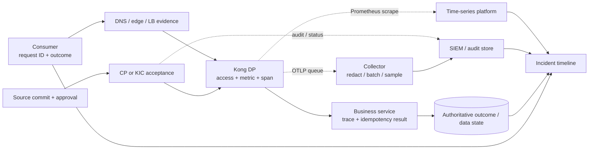

<!-- study-contract: principal -->

# Kong Gateway observability and operational-evidence study

| Field | Value |
|---|---|
| Artifact type | architecture-study |
| Decision question | Can a resolved Kong option provide timely, privacy-safe and failure-resilient evidence for RE-1 request, configuration, dependency and recovery decisions without destabilizing the proxy path? |
| Decision owner | Service Reliability and Observability Governance Council |
| Primary audiences | SRE, platform engineering, security operations, developers, service owners, audit/privacy and incident commanders |
| Scope | Kong Gateway Enterprise 3.14 LTS policy; Prometheus and OpenTelemetry plugins; Gateway/CP/DP/KIC/AKS signals; Konnect and self-managed audit/analytics boundaries; I-05 backpressure |
| Evidence state | Documented (`E1`) signal and queue mechanisms; telemetry schema, platform integration, loss, cost and operating outcomes are unobserved |
| Reference case | [RE-1 enterprise reference case](41-enterprise-reference-case.md), synthetic, especially J-01/J-03/J-06 and I-02/I-04/I-05/I-06 |
| As-of date | 2026-08-17 |
| Next gate | Observability design and failure review after KOBS-P01 through KOBS-P05 pass |

## Provisional answer

Kong exposes useful request, latency, connection, memory, configuration-sync and certificate signals, and can export logs/traces/metrics using standard integrations. That capability supports an enterprise observability design but does not prove operational evidence. Prometheus metrics are node-local and every node must be discovered; OpenTelemetry queues are memory-only per worker and delete oldest entries at capacity; logs can contain sensitive headers, query strings and identities; and a data plane can serve cached traffic while CP analytics are incomplete.

**Evidence state:** `E1 — documented`; `E3 — not run`. No dashboard screenshot, trace screenshot or sample log is accepted as proof of coverage, loss behavior, privacy, incident diagnosis or service-objective attainment. The design must preserve raw configuration, topology, fault, signal and timing artifacts so another reviewer can reconstruct the conclusion.

## Signal sources and unresolved variant boundaries

This is a source inventory, not an exact telemetry option. Gateway/plugin/topology versions, entitlement, enabled fields, queue and collector settings, scrape/discovery paths, retention, privacy controls and objectives remain Gate-1 evidence requests; no row establishes implemented coverage.

| Source | Mechanism | Decision use | Boundary/unknown |
|---|---|---|---|
| Gateway Prometheus plugin | Node-level `/metrics` on Admin or Status API; Konnect requires Status API | request/status/latency, connections, bandwidth, memory, DB reachability, CP connection and DP sync/cert status where applicable | Every node must be discovered/scraped; cardinality and scrape outage behavior need proof |
| OpenTelemetry plugin | OTLP traces/logs and, in current versions, metrics through per-worker in-memory queues | distributed request path, dependency latency, correlated log/trace evidence | Queue is non-durable; oldest entries are removed at limit; plugin/topology/version fields vary |
| Gateway access/error logs | Configurable Nginx/Kong logs and serialized request context | forensic request/error/dependency classification | Serialization may include sensitive data; default redaction covers only documented fields |
| CP/DP status | CP endpoints/metrics and Konnect DP status | last seen, config hash/sync/compatibility and certificate expiry | CP view can be unavailable or stale during partition; runtime fingerprint needs independent check |
| KIC/Operator/Kubernetes/AKS | controller status/metrics, resource Conditions, events, pod/node/LB/CNI/DNS signals | distinguish rejected desired state, scheduling, network and platform faults | Retention, event loss, managed-service access and cross-cluster correlation are organization design |
| Pipeline/audit | source, diff, actor/approver, CP/Kubernetes audit, Konnect/Gateway audit | J-06 governance and incident reconstruction | Product audit availability, export, retention and entitlement differ by variant |
| Journey probes/business evidence | external synthetic and service/ledger signals | consumer-visible outcome and J-01 ambiguity resolution | Gateway telemetry cannot prove transfer outcome or data freshness |

Kong documents node-level scrape requirements and DP last-seen/hash/sync/certificate metrics in the [Prometheus plugin](https://developer.konghq.com/plugins/prometheus/). It documents per-worker, in-memory OpenTelemetry queues, retry/backoff, 80% warnings and oldest-entry deletion in the [OpenTelemetry plugin](https://developer.konghq.com/plugins/opentelemetry/). These are specific mechanisms, not guarantees of zero loss.

## Mechanism analysis: one request, four evidence planes

**Figure KOBS-A1 — Incident evidence must cross consumer, gateway, platform and business planes.**

- **Depicted scope:** correlated J-01 request/outcome evidence and J-06 source/authority/runtime evidence across client, edge, DP, service, ledger, collectors, metrics and SIEM.
- **Excluded scope:** selected telemetry vendor, final schema/redaction/sampling/retention design, durable audit implementation and any guarantee of lossless export.
- **Diagram source, evidence state and as-of:** inline Mermaid synthesis from the documented Kong signal and queue mechanisms in the preceding inventory; `E1 documented` plus correlation interpretation, no observed evidence chain; 2026-08-17.
- **Accessible equivalent:** client → edge → DP → service → business ledger produces request/outcome evidence; source → CP/KIC → DP produces change evidence; DP queues OTLP and exposes Prometheus while CP/audit feeds SIEM; incident reconstruction joins all four planes. The following table identifies the minimum join for each decision.

**Figure interpretation:** Gateway telemetry is necessary but insufficient. J-01 outcome comes from the business ledger/idempotency state; J-06 completion comes from source, authority response and every DP hash; customer impact comes from outside-in probes. The observability architecture must join these planes without using account identifiers or bearer tokens as correlation keys.

**Figure limitation:** The exhibit does not prove field coverage, correlation quality, privacy, queue durability, retention, latency, cost or reconstruction after I-05; the selected telemetry pipeline must be fault-tested.

| Question | Minimum joined evidence | False conclusion prevented |
|---|---|---|
| Did J-01 execute once? | request/idempotency ID, gateway attempts, service decision and ledger result | “One 5xx means transfer failed” or “two requests means two transfers” |
| Where is latency? | client/edge, Kong proxy/third-party/upstream, service and dependency spans/metrics | “Gateway p99 equals end-to-end p99” |
| Did J-06 deploy? | commit/artifact, CP/KIC result, per-DP hash/time and golden request | “Pipeline green means every runtime changed” |
| Is I-02 only CP loss? | CP reachability, DP last seen/hash, request SLI, DNS/network and pod state | “Cached traffic means the platform is fully healthy” |
| Did I-05 lose evidence? | per-worker queue settings/occupancy/drop warning, collector receipt and SIEM count | “No exporter error means no loss” |
| Is I-04 isolated? | tenant/journey SLI plus shared CPU/memory/network/Redis/DNS/queue saturation | “Overall average latency proves every domain is healthy” |

## Signal and cardinality design

Minimum request dimensions are route/service, status class, method/protocol, environment, cluster/region, DP version and a bounded consumer category when policy permits. Do not place raw consumer IDs, account numbers, tokens, URLs with personal query values or unbounded upstream labels into metrics. Cardinality budgets must be set per metric and tested against route/consumer growth.

Latency must separate at least gateway processing, upstream wait and total consumer-visible time. Current Kong logs can expose advanced latency components in newer versions, including third-party, client, DNS and Redis time; availability of a field is not permission to retain it. See [Gateway logs](https://developer.konghq.com/gateway/logs/) and the warning that serialized logs may contain sensitive data in [`kong.log.serialize`](https://developer.konghq.com/gateway/pdk/reference/kong.log/).

Trace sampling is policy by journey and error class. Head sampling alone can omit rare tail/failure paths; blanket full sampling can create cost, privacy and backpressure risk. The collector is a policy enforcement point for redaction, batching, sampling and routing, but Gateway queue capacity is per worker and not durable. Worker count multiplies total queue memory and potential loss surface.

## RE-1 scenario, detection and diagnostic contract

All proposed windows, volumes and alert thresholds are **scenario assumptions** until approved; none is an observed SLO.

- **J-01/I-01:** alert on ambiguous timeout/retry patterns, but page only with the service-owned reconciliation runbook; never infer financial outcome from Gateway status alone.
- **J-03/I-03:** link TLS handshake/auth reason, CA/cert identifier (non-secret), OIDC issuer/key/cache state and partner category without logging certificates/tokens unnecessarily.
- **J-06/I-02:** alert separately for pipeline failure, CP/API failure, DP disconnected, maximum configuration age, hash divergence and golden-contract failure.
- **I-04:** use per-journey/tenant SLOs and shared saturation signals; averages mask a noisy neighbour.
- **I-05:** measure queue warnings/drops, collector rejected spans/logs, scrape gaps, memory/CPU increase and request latency/errors while destinations are unavailable.
- **I-06:** external probes from each consumer path, regional DP/edge state and backend data-freshness signals determine recovery—not “pods Ready.”

## Failure modes and operating response

| Failure | Observable mechanism | Blind spot | Required response evidence |
|---|---|---|---|
| Prometheus misses one DP | Other nodes still expose healthy aggregate-looking data | one node/version/hash/saturation disappears | expected-node inventory, absent-series alert and service discovery test |
| OTLP destination slow/down | queue grows, retries, warning and oldest-drop behavior | loss occurs in memory and on worker exit | per-worker sizing, drop budget, collector receipt reconciliation |
| Pod OOM/restart | non-durable queue content disappears | no graceful flush in abnormal shutdown | restart event joined to exporter gap and privacy-safe local logs |
| CP disconnected | DP last-seen/config status changes; request traffic may continue | CP-side metrics/audit may be inaccessible | independent DP/request probe and configuration-age alert |
| Cardinality explosion | metrics backend/collector/gateway resource and cost rise | observability causes I-04/I-05 itself | label budget, drop/aggregation rules and cost/saturation alert |
| Redaction defect | logs/traces include token, query, account or payload data | replicated breach across sinks/backups | automated canary secrets/PII scan, revoke/delete incident procedure |
| Sampling hides failure | rare error/tail trace absent | dashboard says healthy while consumer fails | unsampled metrics/log counters and error/tail sampling policy |
| Time skew | spans/events and token behavior misorder | false root cause and audit ambiguity | clock monitoring and monotonic/request-sequence evidence |

## Counter-evidence and non-fit conditions

| Hypothesis | Counter-evidence | Falsification/non-fit condition |
|---|---|---|
| “OpenTelemetry makes observability vendor-neutral.” | Protocol portability does not guarantee schema, semantics, retention, cost or loss portability | Mandatory evidence cannot be exported/reconstructed from the selected variant |
| “Prometheus provides cluster health.” | Metrics are node-level and depend on discovering every node | Inventory/scrape gaps can persist beyond detection objective |
| “Queues protect the proxy from telemetry outages.” | They are memory-only per worker and drop oldest at capacity | I-05 breaches request SLO, telemetry RPO or memory safety |
| “More telemetry improves diagnosis.” | High cardinality/content can increase cost, privacy risk and runtime load | Required diagnosis needs prohibited data or telemetry overhead breaches budget |
| “Konnect analytics replaces enterprise evidence.” | Gateway, AKS, edge, business outcome and organization audit remain separate | Incident cannot be reconstructed within required time/export/retention boundary |
| “A dashboard is evidence.” | It omits raw config, topology, sampling, gaps and test inputs | Independent reviewer cannot reproduce the conclusion from retained artifacts |

A design is a non-fit if it cannot detect missing nodes/config divergence, cannot bound/export telemetry loss, requires prohibited identifiers/content, cannot join business outcomes, or places observation overhead above the request/error/cost budget. The same evidence bar applies to managed and self-managed variants.

## Decision implications

- Define request, change, dependency, business and evidence-plane SLIs separately.
- Maintain an expected-runtime inventory and alert on missing series, not only bad values.
- Treat privacy/cardinality/loss budgets as architecture controls and capacity inputs.
- Require raw, reproducible incident/test bundles; screenshots are explanatory only.

## Falsification and proof plan

| Proof ID | Procedure | Measure | Threshold | Evidence artifact | Independent reviewer |
|---|---|---|---|---|---|
| KOBS-P01 | Send traceable J-01/J-03/J-06 cases through all DPs and join edge/Gateway/service/business evidence | coverage, correlation success, clock skew, sensitive fields | Every mandatory event joined inside approved time with no prohibited data | configs, corpus, raw sanitized telemetry and join report | SRE plus privacy reviewer |
| KOBS-P02 | Remove one DP from discovery and create hash/version divergence | missing-node detection, alert delay, diagnostic correctness | Detected before approved blind-window; exact node/hash identified | inventory, scrape config, alerts and DP state | Independent operations reviewer |
| KOBS-P03 | Execute I-05: block/slow OTLP and metrics destinations through queue saturation and pod restart | request SLI, queue/drop, memory/CPU, records sent/received/lost | Approved request SLO and telemetry RPO; drops warned before limit | fault timeline, per-worker settings/metrics and count reconciliation | Observability governance |
| KOBS-P04 | Generate bounded/unbounded labels and canary secrets/PII in every protocol path | series/cardinality/cost, resource use, leaked values | Cardinality within budget; zero prohibited content in all sinks/support artifacts | label inventory, backend query, scans and remediation record | Privacy/security and FinOps |
| KOBS-P05 | Run blind incident drills for I-02/I-04/I-06 using retained evidence only | correct classification, time to hypothesis/root cause, missing evidence | Review team meets approved diagnosis objective with no privileged ad-hoc access | drill package, timeline, decisions and evidence-gap register | Incident management lead |

No proof has run and no threshold is approved. Scenario assumptions remain test inputs only.

## Risks and limitations

- Metrics, log fields, plugin capabilities and Konnect export/retention can change by version and entitlement.
- Queue/drop behavior tested in a lab does not prove production collector, SIEM or network reliability.
- Business outcome telemetry and data-freshness signals require service/domain work outside Kong.
- Observability cost and support-bundle data handling require E2/E4 evidence.
- RE-1 is synthetic; all numeric assumptions remain scenario assumptions.

## Open evidence requests

| Request | Owner role | Due gate | Decision impact if unresolved |
|---|---|---|---|
| Mandatory event/metric/trace schema and privacy/cardinality/retention classification | Observability governance, privacy and security | Schema review | Cannot approve collection or proof coverage |
| Plane-specific SLOs, blind-window and telemetry RPO | SRE, risk, audit and service owners | Test design | KOBS-P01–P05 lack thresholds |
| Konnect analytics/audit export, retention, location and access terms | Vendor manager, legal and audit | Architecture review | Managed option evidence boundary unknown |
| Expected-runtime inventory and ownership model | Platform engineering | Operations readiness | Missing-node/config divergence detection unproven |
| KOBS-P01 through P05 raw artifacts | Test lead | Observability review | No operational-evidence conclusion |

## Next gate

The next gate is an Observability Design and Failure Review. It passes only when mandatory evidence and privacy budgets are approved, all expected nodes and configuration states are observable, KOBS-P01 through KOBS-P05 meet request and telemetry objectives, and an independent incident team can reconstruct the result from retained raw artifacts.

Until then, standard telemetry support is a mechanism—not operational readiness.
