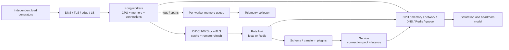

<!-- study-contract: principal -->

# Kong Gateway performance and capacity study

| Field | Value |
|---|---|
| Artifact type | architecture-study |
| Decision question | What evidence is required to resolve and size a Kong option for RE-1 steady, burst, degraded and recovery conditions without converting vendor or synthetic benchmarks into capacity commitments? |
| Decision owner | Performance and Capacity Review Board |
| Primary audiences | Executives funding capacity, platform/SRE, performance engineers, developers, network, FinOps and service owners |
| Scope | Kong Gateway Enterprise 3.14 LTS policy on AKS; hybrid runtime-only and KIC/DB-less patterns; representative identity, validation, rate-limit and telemetry chains; Redis and failure dependencies |
| Evidence state | Documented (`E1`) performance mechanisms and a proposed test model; no repository benchmark or capacity result exists |
| Reference case | [RE-1 enterprise reference case](41-enterprise-reference-case.md), synthetic, with J-01–J-05 and I-01/I-04/I-05/I-06 |
| As-of date | 2026-08-17 |
| Next gate | Capacity evidence review after KPERF-P01 through KPERF-P05 and representative demand inputs are approved |

## Provisional answer

No capacity number is supportable from this repository. Kong publishes benchmark methodology and results, but its reference environment, routes/consumers, plugins, cloud, instance, test duration and upstream behavior are not RE-1. The published benchmark pages are also marked incompatible with Konnect. Their proper use is to inform test design and identify variables—not to state production RPS, latency, replica count or cost.

**Evidence state:** `E1 — documented`, `E3 — not run`. The target must be tested with an exact image/plugin/configuration and a representative consumer-to-upstream path. Capacity acceptance is the ability to meet per-journey objectives at steady peak **while the largest allowed failure unit is unavailable**, with planned deployment/telemetry/control activity and measured headroom. Even that result is bounded to the recorded environment and growth model.

## Bounded performance profiles awaiting bill-of-materials freeze

P1–P4 are test profiles, not completed deployment variants. A run is decision-usable only after the Gateway, plugin, AKS, network, Redis, telemetry, upstream and generator bill of materials plus entitlements and acceptance objectives in [Open evidence requests](#open-evidence-requests) are immutable in the run record.

| Variant | Fixed components for a valid run | Variable to isolate | Comparison caveat |
|---|---|---|---|
| P1 — hybrid DP on AKS | Gateway Enterprise 3.14 LTS exact patch/digest, runtime-only DP, exact CP mode, AKS/node/CNI/LB | CP connected/disconnected, config update, DP count/CPU/workers, Redis/telemetry | Konnect CP and self-managed CP can share DP request mechanics but differ in control/network evidence |
| P2 — KIC DB-less on AKS | KIC 3.5, Gateway API 1.3, exact DB-less Gateway digest, controller and generated config | route/entity count, controller update, pod count/CPU/workers | Controller performance and configuration propagation are separate from proxy steady-state |
| P3 — same runtime without plugins | Same node/image/network/upstream, no request plugins | base proxy/request termination | Diagnostic baseline only, never target capacity |
| P4 — required RE-1 chain | OIDC/mTLS/validation/rate-limit/transform/telemetry settings exactly as proposed | one plugin/dependency at a time, then full chain | Only P4 can support target capacity; edition/entitlement must be proven |

Every run records Gateway, KIC/operator, Helm, Kubernetes/AKS, node image/size, CPU/memory requests/limits, `nginx_worker_processes`, replicas, topology, CNI/LB, TLS, route/consumer/entity count, plugin order/config, Redis/DNS/collector, upstream and load-generator versions. A label such as “Kong 3.x on AKS” is irreproducible.

Kong's [benchmark method](https://developer.konghq.com/gateway/performance/establish-a-benchmark/) recommends separating request-termination baseline, bare proxy and added configuration, repeating runs and excluding warm-up. Its [optimization guidance](https://developer.konghq.com/gateway/performance/optimize/) warns against autoscaling during a measurement run, co-located generators/upstreams, configuration changes, custom plugins and third-party bottlenecks. Those controls apply to characterization; autoscaling and configuration changes are then tested deliberately as real operating events.

## Mechanism analysis: latency and saturation chain

**Figure KPERF-A1 — Gateway capacity is the minimum safe capacity of a dependency chain.**

- **Depicted scope:** J-03 synchronous load from generator through edge, Kong workers, identity, rate limiting, validation, upstream and telemetry, including saturation signals.
- **Excluded scope:** final fraud/service/database design, production demand approval, capacity commitment, autoscaling policy and any inference that a vendor benchmark predicts RE-1 performance.
- **Diagram source, evidence state and as-of:** inline Mermaid synthesis from the cited official Kong benchmark, tuning, payload and dependency mechanisms; `E1 documented` plus queue/bottleneck interpretation, no observed benchmark; 2026-08-17.
- **Accessible equivalent:** independent generator → edge/LB → Kong workers → auth cache/issuer or certificate work → local/Redis limit → validation/transform → upstream; Kong also exports through a bounded telemetry queue. Capacity is constrained by the first saturated dependency, and the following workload matrix names the dimensions that must be held or varied.

**Figure interpretation:** Adding Gateway pods helps only if CPU/workers are the binding constraint and the load balancer, Redis, DNS, upstream, network and telemetry path have headroom. Tail latency can rise from cache refresh, slow clients, configuration rebuild, disk buffering or dependency contention before average CPU reaches an intuitive ceiling.

**Figure limitation:** The dependency chain is not a benchmark or capacity model; it contains no approved demand, version-pinned environment, measured bottleneck, autoscaling result or production commitment.

| Workload dimension | RE-1 cases to include | Why it changes behavior |
|---|---|---|
| Request method/size | small J-01/J-03 JSON, larger/multipart J-04, representative J-05 control or excluded file path | buffering, disk I/O, parser/plugin memory and network bytes |
| Connection model | TLS resumption/full handshake, keep-alive, HTTP/2/gRPC where applicable, slow clients | handshake CPU, connection/file-descriptor pressure, worker occupancy |
| Identity | cache hit/miss, OIDC/JWKS refresh, mTLS chain/revocation, invalid requests | remote I/O, crypto, cache stampede and error-path cost |
| Policy | no plugin, each required plugin, full ordered chain, custom plugin | phase execution, serialization, external calls and memory |
| Rate limiting | local and Redis, normal/slow/partition/recovery | counter I/O, failover semantics and accepted-load change |
| Upstream | fast controlled stub, representative latency/error mix, slow/partial failure | connection pools, retries, timeouts and backpressure |
| Configuration scale | production-like routes/services/consumers/plugins and J-06 update | router/config processing memory and tail-latency disturbance |
| Telemetry | approved sampling/logging, destination slow/down/full | per-worker queue memory, exporter CPU/network and drops |
| Failure | pod/node/zone loss, scale-out, CP/controller loss, DNS/Redis/collector fault | reduced capacity, recovery lag and cross-dependency saturation |

Kong notes that throughput is primarily CPU-bound while latency and cache memory interact, and recommends empirical sizing in [resource sizing guidelines](https://developer.konghq.com/gateway/resource-sizing-guidelines/). It also documents that request/response buffering for larger bodies can use disk and materially affect performance in [large-payload tuning](https://developer.konghq.com/gateway/performance/large-payloads/). Published rough sizing bands are not RE-1 observations.

## RE-1 scenario, test design and statistical integrity

RE-1 traffic rates, burst multipliers, payload distribution, growth and SLOs are **scenario assumptions** until service-owner evidence replaces them. Do not invent a “target RPS” by summing API counts without concurrency, payload, error, connection and upstream profiles.

Test stages:

1. Verify generator, edge/network and controlled upstream are not bottlenecks, using separate nodes/failure domains.
2. Establish request-termination and bare-proxy diagnostic baselines with fixed replicas—never cite them as target capacity.
3. Add each required control individually to expose marginal cost, then run the complete ordered chain.
4. Use a representative route/consumer/plugin configuration and execute J-06 during load to measure reconfiguration tail impact.
5. Run steady ramp/plateau, burst, soak, slow-client, large-body and upstream-error/timeout cases.
6. Repeat to estimate variance; retain raw histograms/time series, not only averages. Report p50/p95/p99/p99.9, errors, throughput, concurrency and saturation together.
7. Freeze the load and remove one replica/node/zone; then test reactive HPA/node scale separately with cold image/secret/config dependencies.
8. Block Redis, DNS, CP/controller and telemetry one at a time, then test a justified combined failure.

Autoscaling is disabled for controlled per-replica characterization, then enabled for a separate operational test. This avoids hiding unit capacity while still proving burst response. A success criterion expressed only as CPU less than a threshold is invalid; service objectives and the first saturating resource determine the bound.

## Capacity model and interpretation

Let `C_test` be the maximum **observed safe** traffic mix at which all approved journey objectives pass in the frozen test. Let `F_loss` be the capacity removed by the largest allowed failure unit, `G` the approved growth factor, and `H` the uncertainty/operational headroom factor. A planning model may require installed capacity to cover `C_required × G × H + F_loss`, but the exact formula and factors are governance choices, not product facts.

Any numerical `G`, `H`, utilization ceiling or burst duration is a **scenario assumption** until approved. Sensitivity must show replicas/cost under alternative growth, failure unit, plugin, payload and upstream-latency cases. Capacity is invalidated by a material image/plugin/config/network/upstream change and must be requalified by a defined trigger.

## Failure and edge-case analysis

| Failure | Performance risk | Hidden correctness risk | Evidence required |
|---|---|---|---|
| Redis slow/partitioned | added latency, connections, CPU; fallback changes accepted volume | quota overshoot/back-end overload | per-node decisions, Redis metrics and upstream SLI |
| Telemetry sink down | queue memory/CPU/retries and eventual drops | missing incident/audit evidence | request SLI plus records sent/received/lost |
| Configuration update | router/config processing can spike tail latency/memory | mixed DP hashes/contract | per-DP hash and latency timeline |
| Pod/node/zone loss | immediate capacity reduction and connection churn | ambiguous in-flight J-01 outcomes | client/service idempotency evidence and recovery time |
| HPA scale-out | metrics delay, scheduling/image/secret/config startup | unready/empty/stale new DP | clean-node fingerprint and first-safe-request time |
| Large/slow payload | disk buffering, memory, worker/connection occupancy | timeout/retry ambiguity and partial upstream effects | bytes, disk/ephemeral use, connection and outcome data |
| Upstream saturation | Gateway queues/connections/timeouts; retries amplify load | duplicate/non-idempotent action | upstream SLI, attempt chain and domain result |
| Noisy neighbour | shared worker/Redis/DNS/collector contention | one domain consumes another's capacity | per-journey/tenant SLI and shared saturation |

## Counter-evidence and non-fit conditions

| Hypothesis | Counter-evidence | Falsification/non-fit condition |
|---|---|---|
| “Vendor benchmark shows ample capacity.” | Published tests use a bounded AWS/Kubernetes environment and simple plugin cases | Representative P4 safe capacity or tail behavior materially misses the plan |
| “Horizontal scaling is nearly linear.” | Shared Redis/DNS/LB/upstream/network and load distribution can bind first | Added replicas fail to add safe throughput or worsen tail/errors |
| “Low average CPU means headroom.” | one worker, network, memory, queue, connection or upstream can saturate first | Mandatory SLO fails while average CPU appears below planning ceiling |
| “Gateway overhead is negligible.” | Crypto, schema, custom plugins, external I/O, bodies and telemetry alter the path | Gateway-added p99/p99.9 exceeds the approved journey budget |
| “Autoscaling handles burst.” | HPA and node scale are reactive and new pods need image/secrets/config/endpoints | Burst SLO fails before safe replicas join or I-02 prevents clean scale-out |
| “One benchmark sizes all APIs.” | J-01–J-05 have different payload, identity, latency and correctness behavior | Mix shift or journey-specific limit breaches despite aggregate pass |

The exact variant is a non-fit if it cannot meet mandatory objectives after the largest allowed failure unit, needs prohibited unsafe quota degradation, cannot start safe clean replicas within the burst/recovery window, or requires uneconomic capacity under approved sensitivity ranges. The same workload and proof method must be applied to alternatives.

## Decision implications

- Reject any RPS/cost statement without exact topology, config, workload, raw distribution and failure envelope.
- Size on representative full policy chains and per-journey tails, not bare proxy averages.
- Separate per-unit characterization, operational autoscaling and degraded-capacity tests.
- Treat Redis, DNS, telemetry, upstreams and clean-node startup as capacity dependencies.

## Falsification and proof plan

| Proof ID | Procedure | Measure | Threshold | Evidence artifact | Independent reviewer |
|---|---|---|---|---|---|
| KPERF-P01 | Characterize P3 then each plugin and full P4 with fixed replicas and controlled upstream | throughput, p50/p95/p99/p99.9, error, CPU/memory/network, marginal cost | Full P4 meets approved journey budgets with stable repeat variance | exact BOM/config, harness, raw histograms/time series | Independent performance engineer |
| KPERF-P02 | Run representative route/consumer/entity scale and J-06 during plateau | config processing, per-DP hash, latency/error disturbance, convergence | Change disturbance and mixed-state window within approved objectives | source/artifact, DP hashes and request timeline | Change assurance and performance reviewer |
| KPERF-P03 | Execute burst, HPA/node scale and cold clean-node start | first-safe-replica time, SLO breach duration, scheduler/image/secret/config delays | Burst objective met with only approved degradation; new DP has approved hash | autoscaler/events, image pulls, hashes and load results | SRE reviewer |
| KPERF-P04 | Remove replica/node/zone and inject Redis/DNS/telemetry faults under load | journey SLI, accepted quota, saturation, evidence loss, recovery | Approved degraded SLO and control semantics maintained | fault schedule, raw metrics/logs and business results | Resilience/security reviewers |
| KPERF-P05 | Run soak and activity-based capacity/cost sensitivity for growth/failure/plugin/payload cases | leaks/drift, safe capacity, replicas, infrastructure/license/operations range | No progressive degradation; model sources/ranges approved | soak series, capacity envelope and versioned cost model | FinOps and capacity board |

No proof has run. Thresholds and model factors remain owner-approved inputs, not observed facts.

## Risks and limitations

- Lab hardware/network behavior may not reproduce production Azure quotas, noisy neighbours, edge or upstreams.
- Synthetic load can miss consumer pacing, retries, invalid requests, payload entropy and daily/seasonal correlation.
- Konnect/Dedicated managed capacity evidence requires service-specific tests/terms; self-hosted benchmarks do not transfer automatically.
- Plugin/version/config changes can invalidate results; requalification triggers must be defined.
- RE-1 values are synthetic scenario assumptions.

## Open evidence requests

| Request | Owner role | Due gate | Decision impact if unresolved |
|---|---|---|---|
| Representative per-journey traffic, concurrency, payload, connection, error, upstream and growth profile | Service owners and performance engineering | Workload approval | No valid test or capacity target |
| Approved latency/error/degraded/headroom/failure-unit objectives | Business owners, SRE, risk and FinOps | Test design | KPERF-P01–P05 cannot be judged |
| Exact Gateway/AKS/plugin/Redis/telemetry BOM and entitlements | Platform engineering and vendor manager | Variant freeze | Results irreproducible or unsupported |
| Azure/network quota and cost inputs plus staffing/toil | Cloud platform and FinOps | Capacity review | No deployable/cost envelope |
| KPERF-P01 through P05 raw bundle | Test lead | Capacity evidence review | No sizing or performance conclusion |

## Next gate

The next gate is a Capacity Evidence Review. It passes only when the representative workload and objectives are approved, the exact P4 variant is frozen, KPERF-P01 through KPERF-P05 reproduce under independent review, and the capacity/cost envelope includes largest-failure-unit and sensitivity cases.

Until that gate, every throughput or replica figure remains a scenario input or external reference—not a commitment.
