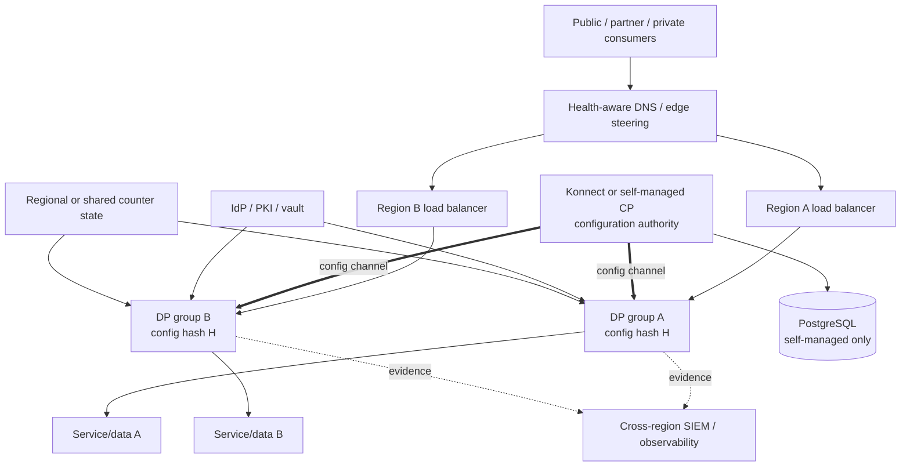

<!-- study-contract: principal -->

# Kong Gateway high-availability and disaster-recovery study

| Field | Value |
|---|---|
| Artifact type | architecture-study |
| Decision question | Can each resolved Kong operating option recover RE-1 request, change, security and evidence planes after node, cluster, control-plane, database and regional failure within approved consistency and recovery objectives? |
| Decision owner | Enterprise Resilience and API Platform Steering Committee |
| Primary audiences | Executives, business continuity, SRE/operations, platform/database/network/PKI architects, security and service owners |
| Scope | Self-managed Kong Gateway Enterprise 3.14 LTS hybrid; Konnect hybrid with customer-hosted DPs; DB-less/KIC on AKS; regional request steering, CP/DB/config/cache/license/PKI/telemetry and upgrade recovery |
| Evidence state | Documented (`E1`) mechanisms and proposed exercises; no RTO/RPO, failover, restore, support or production evidence |
| Reference case | [RE-1 enterprise reference case](41-enterprise-reference-case.md), synthetic, using J-01–J-06 and I-01–I-08 |
| As-of date | 2026-08-17 |
| Next gate | Integrated resilience review after KDR-P01 through KDR-P06 and plane-specific objectives pass |

## Provisional answer

Kong hybrid's cached data plane can be a strong request-continuity mechanism during control-plane loss, and Kubernetes can replace failed proxy pods. Neither mechanism is disaster recovery. DR additionally requires trusted configuration, clean-node bootstrap, CP/PostgreSQL recovery or managed-service recovery, DNS/edge convergence, certificate and identity availability, Redis/quota semantics, upstream data consistency, evidence reconciliation and safe client behavior after ambiguous outcomes.

**Evidence state:** `E1 — documented`, `E2 — required`, `E3 — not run`. No availability percentage, RTO, RPO or “active-active” conclusion is supportable. Each plane needs its own objective and evidence. A DP serving cached routes can coexist with unavailable administration, stale security policy, missing analytics and an unrecoverable business database.

## Bounded recovery archetypes and responsibility

D1–D4 separate materially different recovery owners; they are not exact DR designs. Region pairs, edge/network paths, images/plugins, configuration/bootstrap state, database or managed-service recovery terms, identity/counter/evidence dependencies and approved objectives remain Gate-1 blockers in [Open evidence requests](#open-evidence-requests).

| Variant | Request-plane recovery | Change/state recovery | Primary customer obligation |
|---|---|---|---|
| D1 — self-managed hybrid 3.14 LTS policy | Customer-operated regional DPs/LBs/AKS; cached state during CP loss | Customer restores/recovers CPs, PostgreSQL, PKI, license, plugins, configuration and audit | End-to-end gateway infrastructure, DB backup/migration, regional design and on-call |
| D2 — Konnect CP + customer-hosted DPs | Customer-operated DPs/AKS/edge; cached state during Konnect/control-channel loss | Kong recovers service-side CP under E2 terms; customer recovers DPs, egress, cache/seed, plugins and reconciles state | DP and network continuity plus cross-boundary incident command and evidence |
| D3 — KIC 3.5/DB-less Gateway | Customer-operated Kubernetes API/controller, declarative desired state and DPs | Restore Git/artifact, cluster/CRDs/controller/secrets and regenerate runtime config | Cluster/region recovery, resource backup, controller compatibility and one authority |
| D4 — Dedicated Cloud Gateway | Kong operates CP/DP service according to configured regions/network and E2 terms | Organization restores edge/backend/identity/evidence integrations and configuration/business state | Contract, topology configuration, application/data continuity and incident integration |

D4 is included only to keep responsibility comparison symmetric; detailed internal managed-service recovery is not inferred. Serverless is excluded from the RE-1 critical DR target unless its bounded workload/network characteristics are explicitly approved.

## Mechanism analysis: multi-region service is a state system

**Figure KDR-A1 — Regional failover succeeds only when traffic, trust, configuration and business state converge.**

- **Depicted scope:** illustrative two-region D1/D2/D3 request service with edge steering, regional DPs, configuration authority, self-managed PostgreSQL where applicable, identity, Redis/counters, telemetry and regional services/data.
- **Excluded scope:** approved region pair, edge vendor, database replication, network, client-retry and business-data recovery designs, and any assertion of active-active consistency or RTO/RPO.
- **Diagram source, evidence state and as-of:** inline Mermaid synthesis from the cited official Kong cache, backup and upgrade mechanisms plus standard dependency relationships; `E1 documented` plus topology hypothesis, no observed failover; 2026-08-17.
- **Accessible equivalent:** consumers → health-aware edge → regional LB/DP → regional service/data; one CP configures both DP groups and self-managed mode also depends on PostgreSQL; identity, counter state and evidence must remain usable across regions. The following recovery-state table defines each authority and the recovery-complete condition.

**Figure interpretation:** Both DPs can report the same configuration hash while the service data, identity keys, certificates, counters or DNS are stale. Conversely, healthy business data is unreachable if edge, LB or trust has not converged. Recovery acceptance must therefore execute the journey and verify authoritative outcome/data—not stop at pod, port or hash health.

**Figure limitation:** This unexecuted two-region hypothesis does not establish business-data consistency, DNS/client convergence, managed-service recovery, regional capacity, RTO/RPO or support coordination.

| Plane/state | Authority/persistence | Plausible RPO question | Recovery-complete condition |
|---|---|---|---|
| Request routing | edge/DNS/LB/endpoints | Which in-flight connections/requests are lost or replayed? | Each consumer path reaches a safe region and journey objectives pass |
| Gateway configuration | CP/PostgreSQL or Git/Kubernetes; DP cache is a copy | How much approved config/audit can be lost or stale? | Authority restored; all DPs at approved hash; golden contract passes |
| Consumer/credential/cert | CP entities plus IdP/PKI/vault | Which issuance/revocation/rotation events survive? | Current trust/revocation and dual-CA/key behavior verified |
| Quota/counter | local/Redis/plugin-specific | Are regional counters independent, replicated or allowed to degrade? | Approved abuse/commercial semantics and reconciliation proven |
| Business data/outcome | domain services, ledger/database/queue | Can J-01/J-05 state be stale, duplicated, reordered or lost? | Domain reconciliation/data-freshness checks pass |
| Telemetry/audit | DP queues, CP/audit, collectors/SIEM | How much evidence can be lost during I-05/I-06? | Gaps quantified/approved and incident timeline reconstructable |
| Binaries/plugins/license | registry/artifacts/secrets/node cache | Can clean infrastructure start without failed region/control services? | Signed supported image/plugins/license/secrets available and ready |

RTO/RPO values are absent. Any numeric target introduced for an exercise is a **scenario assumption** until business, risk and resilience owners approve it.

## Control-plane and configuration recovery

For D1, PostgreSQL is authoritative for database-backed CP entities. Kong's [backup and restore guidance](https://developer.konghq.com/gateway/upgrade/backup-and-restore/) recommends database-native backup as primary and declarative export as a secondary safeguard because it does not include every entity. `kong migrations` changes are not reversible. Keyring material, `kong.conf`, license, custom plugins, PKI and external secret definitions need separate protected backup/restore.

For D1/D2, DPs persist latest configuration in LMDB and can restart disconnected. A clean new DP during CP loss needs copied LMDB or an approved declarative fallback; manual disconnected state is overwritten on reconnect. See [hybrid fault tolerance](https://developer.konghq.com/gateway/hybrid-mode/). DR must validate cache provenance/encryption/version, not copy an opaque directory without chain of custody.

For D3, Git alone is not the cluster backup. Restore needs exact CRDs, KIC/controller, Gateway image, namespace/RBAC/admission policy, Secrets/certificates/vault references, Services/Endpoints and external infrastructure. The source artifact must regenerate the same runtime semantics on a supported Kubernetes/AKS version.

For D2/D4, Konnect configuration/export, CP recovery, audit history and service RTO/RPO require E2 terms and an operational exercise. Provider service recovery does not restore customer edge, DPs, service data or identity dependencies.

## RE-1 scenario and failure choreography

- **I-01 lost response:** do not retry J-01 merely because edge failover occurs. Preserve idempotency key and query/reconcile authoritative outcome before retry/compensation.
- **I-02 CP disconnect/stale restarted DP:** run live traffic, attempt J-06, restart cached DP, start a clean-node DP, then reconcile hashes and policy after CP returns.
- **I-03 cert rollover/pinned CA:** ensure both regions have overlapping trust; test a pinned partner, expired/revoked leaf, CP/DP certificate and vault/IdP key rotation.
- **I-04 noisy neighbour:** lose one failure domain while another tenant bursts; shared Redis/DNS/collector/CP must not create hidden cross-domain collapse.
- **I-05 telemetry backpressure:** quantify records lost in each region and retain sufficient business/audit evidence to reconstruct recovery.
- **I-06 regional failover/stale data:** fail the whole consumer-to-service path, measure edge convergence and verify data freshness/transaction correctness after reroute.
- **I-07 schema drift:** fail over between regions at different service/gateway contract versions; both must stay inside the approved compatibility window.
- **I-08 irreversible schema/data:** demonstrate forward recovery or coordinated database restore; Gateway configuration rollback alone is explicitly insufficient.

## Lifecycle and upgrade availability

Hybrid upgrades change CP before DPs; DP rolling upgrade can create a mixed-version window. Kong documents different strategies for CP/traditional versus DB-less/hybrid DP and warns that database migrations are non-reversible in [Gateway upgrades](https://developer.konghq.com/gateway/upgrade/). A blue/green CP upgrade using one database has limited support and is recommended only for narrow patch use in the current [blue-green upgrade guidance](https://developer.konghq.com/gateway/upgrade/blue-green/).

The DR plan must distinguish rollback before and after migration finalization, plugin schema changes, Kubernetes/AKS upgrades, CRD conversion, and license validity on new/restarted nodes. “Rolling update” is not proof of zero consumer impact or reversible state.

## Failure matrix and recovery evidence

| Failure | Expected continuity | What can still fail | Evidence |
|---|---|---|---|
| DP pod/node loss | remaining endpoints serve; scheduler replaces | connection drain, in-flight ambiguity, unschedulable/cold start | journey results, pod/LB events and idempotency reconciliation |
| Zone loss | other zones serve if independently provisioned | shared LB/DNS/Redis/upstream capacity; HPA/node availability | per-journey SLI and dependency saturation |
| CP/DB loss | cached DPs serve existing config | changes, clean scale, revocation, telemetry/admin | plane-specific SLO, cache/seed/reconnect evidence |
| Region loss | other region accepts traffic if edge and all dependencies converge | stale business data, cert/identity, counters, capacity, clients pinned to region | end-to-end J-01–J-04 and data-freshness proof |
| Registry/vault/PKI loss | existing pods may survive with cached/mounted material | new/restored infrastructure cannot become safe/ready | clean-region rebuild with signed artifacts and trust |
| Backup corruption/incomplete export | cached runtime may mask CP loss temporarily | authority/history/credentials cannot be reconstructed | isolated restore, object/semantic diff and golden contract |
| Managed-service incident | customer DPs may cache in D2; D4 behavior per service | control, analytics, evidence or managed DPs | provider/customer joint exercise and E2 evidence |
| License invalid/expired | current version may retain unchanged proxying | configuration and new/restarted DB-less/KIC nodes can be constrained | exact-version continuity drill and renewal runbook |

## Counter-evidence and non-fit conditions

| Hypothesis | Counter-evidence | Falsification/non-fit condition |
|---|---|---|
| “Cached DPs provide DR.” | Cache covers only last-known Gateway config on specific nodes | Clean-region rebuild, security change, authority restore or business recovery misses objective |
| “Three zones equal HA.” | workloads/dependencies may not be spread/capacity-safe; a region is still one boundary | Zone loss breaches journey SLO or replacement cannot schedule |
| “Active-active regions remove RTO.” | edge, data, identity, counters and clients still converge; writes can conflict | I-06 yields stale/duplicate/unauthorized results or manual recovery beyond objective |
| “Database backup is enough.” | configs, keyring, certs, plugins, license, audit and infrastructure live elsewhere | Isolated restore misses mandatory object/control or cannot run golden contract |
| “Declarative export makes recovery portable.” | export is secondary/incomplete for database-backed mode and semantics differ by target | Rebuilt target lacks consumers/credentials/history or changes contract behavior |
| “Managed service transfers DR.” | provider owns only its boundary; customer still owns edge, backend, identity and incident command | Joint exercise exposes unowned action, inaccessible evidence or unacceptable E2 objective |

A variant is a non-fit if mandatory RTO/RPO cannot be met after the largest failure unit, clean-region startup depends on the failed boundary, business state cannot recover safely, configuration/security staleness is unacceptable, or evidence/support seams remain unowned. Negative evidence excludes the exact variant/topology, not a vendor family.

## Decision implications

- Approve RTO/RPO separately for request, change, administration, security state, business data and evidence.
- Require isolated restore and regional journey proof; cached traffic and pod health are insufficient.
- Include artifact/license/PKI/vault/registry and clean-node bootstrap in recovery dependencies.
- Make I-01/I-06 transaction and data correctness business-owned acceptance gates.
- Apply the same loss hierarchy and recovery-complete definition to every candidate.

## Falsification and proof plan

| Proof ID | Procedure | Measure | Threshold | Evidence artifact | Independent reviewer |
|---|---|---|---|---|---|
| KDR-P01 | Kill DP pods/nodes and drain/lose one zone under J-01–J-04 | request SLI, in-flight outcomes, replacement/connection drain and capacity | Approved degraded SLO; no unsafe duplicate; recovery inside objective | fault/load timeline, pod/LB events and business reconciliation | SRE and service owner |
| KDR-P02 | Execute I-02 with live traffic, J-06, cached restart and clean-node seed, then reconnect | plane RTO, config age/hash, request results, reconciliation | Approved request/change objectives; all DPs return to approved state | flows, cache/seed provenance, hashes and logs | Resilience/change assurance |
| KDR-P03 | Restore D1 CP/PostgreSQL in isolation or execute D2/D4 provider/customer control recovery; restore D3 cluster/config | RTO/RPO, object/credential/cert/audit parity, golden contract | All mandatory state reconstructed within objectives; gaps explicitly approved | backups, manifests, restore logs, inventory/contract diff | Independent DR/DB reviewer |
| KDR-P04 | Execute I-03 and loss of registry/vault/identity while starting clean capacity | trust continuity, startup/readiness, revocation, rollback | No untrusted service; required clean capacity starts safely inside objective | cert/key timeline, image signatures, vault/registry events | PKI/security reviewer |
| KDR-P05 | Fail Region A and steer J-01–J-04 to Region B with I-04/I-05 load | edge convergence, journey SLI, capacity, data freshness/outcome, evidence loss | Approved regional RTO/RPO and correctness; no unexplained transaction | DNS/edge, load, service/ledger, config and telemetry bundle | Business continuity lead |
| KDR-P06 | Upgrade CP/DB/DP/plugin/AKS through mixed-version state, test rollback before/after irreversible boundary | compatibility, request/change SLI, restore/forward recovery | Golden contract and approved availability; irreversible point explicitly controlled | BOM, migrations/backups, hashes, test and sign-off | Change/architecture assurance |

No proof has run. Every number used during rehearsal remains a scenario assumption until formally approved.

## Risks and limitations

- Managed-service internals, SLA/remedy, support and evidence access require E2 and cannot be inferred from public architecture pages.
- A regional test cannot reproduce every cloud backbone, sovereign, support or correlated dependency failure.
- Business database/message/file recovery is outside Kong but mandatory for RE-1 completion.
- Exact PostgreSQL, AKS, KIC/operator, image/plugin and license versions must be frozen.
- RE-1 is synthetic; all RTO/RPO/capacity values remain scenario assumptions.

## Open evidence requests

| Request | Owner role | Due gate | Decision impact if unresolved |
|---|---|---|---|
| Plane-specific RTO/RPO, maximum config/security staleness and largest failure unit | Business continuity, risk, security and service owners | Exercise design | KDR-P01–P06 cannot be judged |
| Exact regional edge/network/DP/CP/DB/data/identity/counter topology | Enterprise/platform architecture | Architecture review | Failure domains undefined |
| Complete backup/object/artifact/license/PKI/vault/registry inventory | Platform, DBA, PKI and security owners | Restore readiness | Isolated recovery likely incomplete |
| Konnect/Dedicated recovery, data, support and joint-exercise terms | Vendor manager, legal and resilience | E2 review | D2/D4 DR boundary unknown |
| KDR-P01 through P06 raw evidence | Resilience test lead | Integrated review | No HA/DR conclusion |

## Next gate

The next gate is an Integrated Resilience Review. It passes only when plane-specific objectives and failure units are approved, one exact regional topology per variant is frozen, KDR-P01 through KDR-P06 meet journey and state-consistency criteria, isolated recovery is independently reproducible, and provider/customer/business responsibilities have no critical gap.

Until then, the evidence supports only a recovery test plan—not an HA or DR claim.
