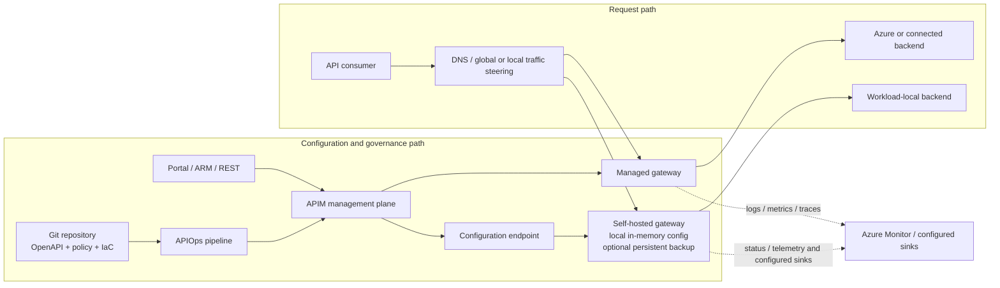

<!-- study-contract: principal -->

# Azure API Management assessment

| Field | Value |
|---|---|
| Artifact type | candidate-dossier |
| Decision question | Which bounded Azure API Management archetypes warrant Gate-1 option resolution before they can enter symmetric proof against mandatory hybrid, federation, residency, resilience, support, and migration requirements? |
| Decision owner | API Platform Steering Committee |
| Primary audiences | Executives, platform and security leaders, enterprise/domain architects, developers, DevOps/SRE, network and operations teams |
| Scope | APIM classic, v2 and Consumption managed gateways; self-hosted gateway; default and dedicated workspace gateways; RE-1 hybrid workloads |
| Evidence state | Documented (`E1`) product mechanisms; organization fit, contract terms, tests and pilot remain unknown |
| Reference case | [RE-1 enterprise reference case](41-enterprise-reference-case.md), synthetic and non-organizational |
| As-of date | 2026-08-17 |
| Next gate | Gate-1 option-resolution review; architecture evidence review follows only after deployable variants, E2 terms and the defined E3 proof bundle are complete |

## Provisional answer

**Evidence state:** `E1 — current official documentation`, reviewed 2026-08-17. No product score is warranted: there is no contractual evidence (`E2`), repeatable lab evidence (`E3`), or representative pilot evidence (`E4`) in this repository.

Azure API Management (APIM) is not one deployable. It is a product family in which the tier selects the managed-gateway architecture and also constrains whether self-hosted and workspace gateways can be used. A defensible assessment therefore names the **service tier, gateway type, region pattern, network mode, workspace model, gateway image version, and configuration authority**. “Azure APIM” is too broad to score. The rows below deliberately stop at bounded archetypes; none is yet a reproducible deployment option.

## Bounded archetypes awaiting Gate-1 option resolution

| Variant archetype | Runtime location and owner | Material boundary | Current evidence |
|---|---|---|---|
| Classic managed gateway — Developer, Basic, Standard, Premium | Azure operates the gateway included with the APIM service | Premium (classic) is the documented managed multi-region option; Developer is not a production tier | [Gateway comparison](https://learn.microsoft.com/en-us/azure/api-management/api-management-gateways-overview) and [reliability by tier](https://learn.microsoft.com/en-us/azure/reliability/reliability-api-management) (`E1`) |
| v2 managed gateway — Basic v2, Standard v2, Premium v2 | Azure operates a newer managed platform | Premium v2 supports zones but currently not managed multi-region; v2 does not currently provide self-hosted gateway or in-place migration from classic | [v2 tier limitations](https://learn.microsoft.com/en-us/azure/api-management/v2-service-tiers-overview) (`E1`, volatile) |
| Consumption managed gateway | Azure-operated serverless gateway | Automatic scaling, but materially different limits and feature coverage; not a substitute for a dedicated tier without workload evidence | [Gateway runtime limits](https://learn.microsoft.com/en-us/azure/api-management/api-management-gateways-overview#gateway-runtime-limits) (`E1`) |
| Self-hosted gateway | Customer runs Microsoft's Linux container on Kubernetes, VM/container host, on-premises, Azure, or another cloud | Available in the currently documented Developer and Premium classic tiers; customer owns hosting, capacity, uptime, networking, and updates | [Self-hosted gateway support policy](https://learn.microsoft.com/en-us/azure/api-management/self-hosted-gateway-support-policies) (`E1`) |
| Workspace on default managed gateway | Azure-managed gateway shared by service-level and workspace APIs | Runtime capacity and some configuration are shared; a noisy or defective API can affect co-tenants | [Workspaces overview](https://learn.microsoft.com/en-us/azure/api-management/workspaces-overview) (`E1`, rapidly evolving) |
| Dedicated managed workspace gateway | Azure-managed gateway resource associated with one or more workspaces | Independent scale/network/hostname settings, but a narrower feature surface and region availability than the default gateway | [Workspace gateway behavior and constraints](https://learn.microsoft.com/en-us/azure/api-management/workspaces-overview#workspace-gateway) (`E1`, rapidly evolving) |

The current Microsoft documents contain fast-moving workspace and tier statements. Procurement must resolve any discrepancy against the exact region, API version, and quote; a feature visible in the portal is not evidence that a proposed combination is supported.

### Gate-1 option-resolution blockers

No archetype above becomes a scored option, proof target, cost row, or target-state recommendation until its blocker set is closed. An option record must identify one purchasable service configuration and one reproducible runtime bill of materials rather than combine capabilities from several rows.

| Blocker | Resolution required for each option record | Accountable evidence owner | Current disposition |
|---|---|---|---|
| APIM-OR-01 — service identity | Subscription boundary, exact tier/SKU generation, resource/API version, Azure region(s), zone or multi-region pattern, service count and workspace attachment | Cloud platform architecture | `Gate-1 hold — unresolved` |
| APIM-OR-02 — runtime identity | Managed/default/dedicated-workspace gateway type or self-hosted gateway; for self-hosted, immutable container image digest, deployment manifest/chart revision and documented support window | API platform engineering | `Gate-1 hold — unresolved` |
| APIM-OR-03 — substrate and network | Exact Kubernetes/AKS version where applicable, CNI, storage class, ingress/load balancer, DNS, private/public network mode, egress path, WAF/DDoS and regional steering | Kubernetes and network owners | `Gate-1 hold — unresolved` |
| APIM-OR-04 — authority and identity | Configuration authority, repository/pipeline revision, service/workspace RBAC boundary, gateway authentication method, workload identity, secrets and PKI authorities | Platform security and API governance | `Gate-1 hold — unresolved` |
| APIM-OR-05 — behavior and state | Versioned API/policy bundle, external counter/cache dependencies, diagnostic settings, locality classification and the intended restart/scale behavior under J-06/I-02 | API product and SRE owners | `Gate-1 hold — unresolved` |
| APIM-OR-06 — service objective and entitlement | Approved workload envelope, SLO/RPO/RTO, capacity units or autoscale bounds, quote/order-form metric, support tier, exclusions and escalation seam | Service owner, procurement and support management | `Gate-1 hold — E2/E3 required` |

## Mechanism analysis: two paths, not one architecture

**Figure APIM-A1 — Self-hosted payload locality does not relocate configuration authority.**

- **Depicted scope:** managed and self-hosted request paths plus Git/APIOps, ARM/APIM configuration, local configuration copy and telemetry paths.
- **Excluded scope:** approved edge, DNS, backend, counter/cache, identity and telemetry designs, and any claim that a depicted archetype is a resolved option.
- **Diagram source, evidence state and as-of:** inline Mermaid synthesis from the cited Microsoft gateway overview and self-hosted support/operation sources; `E1 documented` plus topology interpretation, no observed APIM deployment; 2026-08-17.
- **Accessible equivalent:** Git/pipeline or portal updates the Azure APIM management plane; it configures managed gateways and sends configuration to self-hosted gateways; consumers route through the chosen gateway to Azure or local backends; each gateway emits status/telemetry to configured sinks. The following state-and-ownership table names each authority and proof requirement.

**Figure interpretation:** The figure separates the request path from the configuration and evidence paths. A self-hosted runtime can preserve payload locality without becoming an autonomous control plane; that distinction changes the disconnected-operation, restart, scale-out, support and residency proof required.

**Figure limitation:** This is a mechanism synthesis, not an approved topology or fit result; exact tier, region, network, image, identity, policy, telemetry, entitlement and objective decisions remain at Gate 1.

The request path can remain local to a self-hosted gateway and its backend. The configuration authority does not: each self-hosted gateway resource is associated with an Azure APIM service and retrieves APIs, hostnames, and policies from its Azure configuration endpoint. That distinction is the core hybrid design fact, not a footnote. See Microsoft's [gateway role and association model](https://learn.microsoft.com/en-us/azure/api-management/api-management-gateways-overview#managed-and-self-hosted-gateways) and [shared-responsibility boundary](https://learn.microsoft.com/en-us/azure/api-management/self-hosted-gateway-support-policies#responsibilities).

## State and ownership model

| State or concern | Authoritative owner | Runtime dependency | What must be proven |
|---|---|---|---|
| API definitions, products, subscriptions, named values, and policies | APIM service/workspace in Azure; source control should be the delivery authority if APIOps is adopted | Managed gateway receives platform configuration; self-hosted gateway downloads it from the configuration endpoint | Export/import fidelity, promotion controls, secret references, rollback, drift detection, and workspace scope |
| Running self-hosted configuration | In-memory copy in each running gateway; optional backup on customer-provided volume | Running nodes continue with cached configuration during a temporary Azure outage; a stopped node can start from backup only when backup is enabled | Restart, reschedule, and scale-out under partition—not merely an already-running pod |
| Authentication to configuration endpoint | Access token or Microsoft Entra ID | Access tokens expire; Entra avoids periodic token replacement but introduces identity/RBAC/network dependencies | Workload identity/managed identity path, credential rotation, clock skew, revocation, and least privilege |
| Rate-limit and quota consistency | Policy and topology dependent | Distributed counters and cache choices differ by gateway and policy; local replica count can change effective behavior | Counter consistency during autoscale, Redis loss/latency, and regional partition |
| Certificates and custom CA material | APIM resources and/or per-gateway runtime configuration depending on feature | Self-hosted CA roots are managed separately per gateway; workspace constraints differ | Rotation without traffic loss and parity across every gateway location |
| Logs, metrics, and traces | Destination-specific; customer owns collection path for self-hosted runtime | A gateway can continue proxying while centralized visibility is delayed or unavailable | Local buffering, loss limits, PII masking, correlation, backpressure, and reconciliation |
| Kubernetes availability and capacity | Customer | Direct request-path dependency for self-hosted gateway | Pod disruption, zone loss, CNI/DNS failure, HPA behavior, resource saturation, and backend connection exhaustion |

Microsoft documents the optional persistent configuration copy and the distinct behavior of running versus stopped gateways in the [self-hosted gateway overview](https://learn.microsoft.com/en-us/azure/api-management/self-hosted-gateway-overview#connectivity-to-azure). Production guidance requires the volume at `/apim/config` and cautions against an unpinned `latest` image in [Kubernetes production guidance](https://learn.microsoft.com/en-us/azure/api-management/how-to-self-hosted-gateway-on-kubernetes-in-production).

## Applying the enterprise reference case

Use shared reference case [RE-1](41-enterprise-reference-case.md) rather than a toy echo API. Apply J-01 through J-05 to the request path and J-06/I-02 to configuration propagation and a restarted stale replica. A credible APIM design must answer all of the following at once:

RE-1 and all traffic or recovery values derived from it are **scenario assumptions**, not observations about an existing estate. No numeric scenario assumption is a vendor limit, benchmark result, SLO, or approved threshold.

1. Which gateway terminates the public connection: a managed Premium gateway, a workload-local self-hosted gateway, or both in series?
2. If both are used, which layer owns JWT validation, client-certificate validation, quota, schema validation, transformation, retry, and audit correlation? Duplicating policies creates divergent failure semantics.
3. Does the public path hairpin through Azure even when the backend and consumer are local? The managed gateway always processes traffic in Azure; the self-hosted gateway can keep it local.
4. During loss of the Azure configuration endpoint, do existing requests, pod restarts, new replicas, product subscription changes, certificate rotations, and emergency policy changes behave acceptably?
5. Are quota counters deliberately local, regional, or global? “100 requests per minute” is incomplete until the consistency boundary is named.
6. Can an incident team isolate a defective domain without taking down an APIM service, shared gateway, portal, or unrelated workspace?

This case exposes the design trade: a managed gateway removes runtime infrastructure work, while a self-hosted gateway moves the data path near the workload but creates a customer-operated runtime with an Azure-hosted configuration authority.

## Operations and lifecycle consequences

- **Version ownership:** Azure updates managed gateways. For self-hosted gateway, Microsoft maintains images but the customer rolls them out. The support policy covers the latest major and last three minor releases; fixes land in the latest minor, so “supported” does not mean an old minor receives every fix. [Support coverage](https://learn.microsoft.com/en-us/azure/api-management/self-hosted-gateway-support-policies#self-hosted-gateway-container-image-support-coverage) is `E1`; the organization's actual patch SLO is `Unknown`.
- **Network ownership:** Microsoft supports the gateway image and configuration endpoint. Microsoft explicitly does not troubleshoot customer network customization, CNI, service mesh, NetworkPolicy, firewall, or complex circuits. [Support scenarios](https://learn.microsoft.com/en-us/azure/api-management/self-hosted-gateway-support-policies#self-hosted-gateway-support-scenarios) are `E1`; any broader support promise requires `E2` contractual evidence.
- **Capacity ownership:** Self-hosted throughput depends on policy mix, payload, connection concurrency, backend latency, CPU, and memory. Published estimates are not a production capacity model; Microsoft's [gateway throughput guidance](https://learn.microsoft.com/en-us/azure/api-management/api-management-gateways-overview#gateway-throughput-and-scaling) calls for testing under anticipated conditions.
- **Configuration lifecycle:** The built-in APIM Git repository retired in 2025. A modern path uses an external repository and ARM-based APIs/APIOps; see the [Git configuration retirement notice](https://learn.microsoft.com/en-us/azure/api-management/breaking-changes/git-configuration-retirement-march-2025). Repository authority, extraction, promotion, deletion semantics, and drift controls remain organization decisions.
- **Tier lifecycle:** Current v2 limitations include no self-hosted gateway, no managed multi-region, no service backup/restore, and no in-place classic-to-v2 migration. These are not permanent product judgments; they are release-sensitive constraints to recheck immediately before design approval.

## Failure modes that a feature list hides

| Failure | Expected mechanism from documentation | Decision implication | Required evidence |
|---|---|---|---|
| Azure configuration endpoint unreachable | Running self-hosted gateway uses in-memory configuration; no new configuration arrives | Data-path availability and change-path availability diverge | `E3`: partition with live traffic and attempted change |
| Gateway pod restarts while disconnected | Startup succeeds from the persisted backup only when configured and valid | An HA design without durable local backup may fail during ordinary rescheduling | `E3`: delete pod and drain node during partition |
| New replica starts while disconnected | Documentation establishes backup behavior for stopped instances, not that a brand-new replica without the volume can scale out | Autoscaling can fail exactly when traffic/failure pressure rises | `E3`: scale onto a clean node with and without restored volume |
| Entra/token authentication fails | Gateway cannot refresh configuration/status through the normal path | Credential expiry or RBAC change can masquerade as a network fault | `E3`: revoke/expire identity and observe alarms/recovery |
| Shared workspace gateway saturates | Workspaces on that gateway share compute/configuration | Administrative delegation does not imply runtime fault isolation | `E3/E4`: one-domain saturation with another domain's SLO observed |
| Redis or counter store fails | Policies depending on external state can fail open, fail closed, or lose global consistency according to configuration | Security and commercial quota behavior must be explicit | `E3`: latency, timeout, partition, and recovery |
| Control plane remains healthy but Kubernetes networking fails | Customer owns CNI, DNS, load balancer, firewall, and mesh integration | Vendor service health does not establish service availability | `E3`: DNS/CNI/NetworkPolicy fault and runbook exercise |

## Migration implications

1. **Do not map a source gateway to the APIM family.** Map each API to the target gateway variant and policy features; managed, self-hosted, workspace, classic, v2, and Consumption are not feature-identical.
2. **Separate portable intent from policy implementation.** Preserve OpenAPI, identity model, consumer entitlement, rate-limit semantics, error contracts, and observability fields independently of APIM policy XML.
3. **Treat subscriptions and credentials as live state.** Importing definitions does not safely migrate issued keys, approvals, consumer applications, usage counters, or audit history. Define parallel-run and credential-rotation choreography.
4. **Treat DNS and certificates as a state machine.** Model TTL, dual publishing, certificate trust, client pinning, rollback, and long-lived connections; do not reduce cutover to a CNAME change.
5. **Plan side-by-side for classic-to-v2.** Microsoft's current v2 documentation says there is no in-place migration. Prove resource extraction and recreation, parity, coexistence, and rollback before selecting v2 for an existing classic estate.
6. **Reconcile federation with locality.** A workspace cannot currently associate with a self-hosted gateway. If both domain delegation and workload-local runtime are mandatory, the design may require separate APIM instances or a different delegation boundary, with corresponding portal, policy, cost, and operational consequences.

## Counter-evidence and falsification

| Proposition to challenge | Counter-evidence already documented | Falsification test |
|---|---|---|
| “APIM is Azure-only and therefore not hybrid.” | Microsoft provides a customer-operated self-hosted container for on-premises and other clouds | Deploy the exact supported image outside Azure and show the local request path plus all required controls |
| “Self-hosted means autonomous or air-gapped.” | It remains associated with an Azure APIM service; Local Mode is not an APIM concept | Block all Azure egress, restart and scale, attempt emergency changes, and measure the sustainable operating envelope |
| “Workspaces solve both federation and local runtime.” | Current workspaces cannot associate with self-hosted gateways and workspace gateways have their own constraints | Implement the proposed domain boundary with the exact tier/API version and prove routing, RBAC, policy inheritance, secrets, and isolation |
| “Managed gateway removes all reliability work.” | Tier, region, zone, DNS, backend, policy, and consumer dependencies remain; Premium v2 currently lacks multi-region | Fail a region/dependency in a representative topology and demonstrate the business SLO and recovery control |
| “Feature parity makes gateway placement irrelevant.” | Microsoft publishes variant-specific feature and runtime-limit differences | Execute a policy-contract suite against every proposed gateway type and diff status, headers, body, counters, telemetry, and latency |

## Decision implications

- Keep managed classic Premium, any proposed v2 managed gateway, self-hosted gateway, and workspace gateway as separate option rows; do not create an APIM-family score.
- Treat workspace federation plus workload-local runtime as an unresolved architecture gate because the current workspace/self-hosted combination is unsupported.
- Require a side-by-side migration design for any classic-to-v2 proposal and a customer-operated runtime model for self-hosted gateway.
- Convert every “hybrid,” “multi-region,” “managed,” and “supported on Kubernetes” statement into a variant-specific criterion and proof artifact.

## Falsification and proof plan

| Proof ID | Procedure | Measure | Threshold | Evidence artifact | Independent reviewer |
|---|---|---|---|---|---|
| APIM-P01 | Execute J-06/I-02 while blocking configuration DNS/HTTPS; keep traffic, restart a pod and add a replica on a clean node | served configuration fingerprint, readiness, error rate, reconciliation time | Meets the steering-approved outage/freshness window; no replica serves an unapproved contract; no unexplained request breach | versioned manifests, image digest, request log, pod/events and config-fingerprint timeline | SRE reviewer independent of platform implementation |
| APIM-P02 | Execute the golden policy contract on every proposed gateway type | status/header/body/auth/counter/telemetry differences | All mandatory contract cases equivalent or an approved, documented exception; no silent fail-open | machine-readable results and configuration hashes | Security architecture |
| APIM-P03 | Exercise I-03 certificate/CA rotation and I-04 shared-gateway saturation | failed handshakes, cross-domain SLI, recovery and audit evidence | No trust gap; isolation meets approved service objectives; rollback remains possible | certificate chain/timeline and per-domain load/SLI series | PKI owner and service reliability owner |
| APIM-P04 | Recreate the proposed v2 target side by side from source and cut over a safe RE-1 slice | resource/consumer parity, DNS/cert convergence, rollback completeness | All mandatory resources and consumer contracts reconciled before source retirement | inventory diff, APIOps logs, cutover/rollback record | Migration assurance lead |

No threshold in this table is an observed result. Where an organization threshold is not yet approved, the proof remains blocked rather than silently adopting a scenario assumption.

## Risks and limitations

- `E2 required`: exact tier/gateway entitlements, regional availability, support escalation boundary, roadmap commitments, service limits, and commercial terms.
- `E3 required`: configuration partition/restart/scale-out; policy parity; counter-store failure; identity/certificate rotation; zone and node failure; APIOps rollback; extraction/recreation into any v2 target.
- `E4 required`: representative peak traffic, backend latency, payloads, policy chains, deployment frequency, incident process, and staffing toil.
- `Unknown`: whether organization-wide federation requires workspaces, service-instance isolation, or repository/RBAC boundaries; whether control-plane and telemetry data locations meet policy; whether managed multi-region or workload-local traffic is mandatory.

Official documentation can change after the as-of date, especially workspace/v2 combinations, regions, limits and support. RE-1 is synthetic; a passing lab would generalize only to the recorded versions, topology, policy set and failure envelope.

## Open evidence requests

| Request | Owner role | Due gate | Decision impact if unresolved |
|---|---|---|---|
| Exact purchasable tier/gateway/region and support-responsibility statement | Vendor manager and procurement | Architecture evidence review | Keep affected variant ineligible for scoring |
| Approved residency classification for config, identity, logs, traces, debug and support data | Privacy and security architecture | Architecture evidence review | Exclude topology if a mandatory boundary is unknown |
| APIM-P01 through APIM-P04 execution bundle | Platform engineering with SRE test lead | PoC evidence gate | No hybrid-fit or migration conclusion |
| Workspace delegation and isolation requirement | Enterprise architecture and domain governance | Option-definition gate | Cannot choose workspace, service-instance or repository boundary |
| Representative demand, policy and backend profile | Service owners and performance engineering | Capacity-test design | No capacity, scaling or TCO inference |

## Next gate

The next gate is an Architecture Evidence Review. It may approve APIM variants for criterion scoring only when exact options and volatile facts are revalidated, mandatory E2 evidence is referenced, APIM-P01 through APIM-P04 have reproducible artifacts reviewed by the named independent roles, and no mandatory residency, federation, recovery or support question remains unknown.

The product remains a valid candidate, but the evidence supports only a mechanism-aware validation plan—not a winner, rank, or score.
