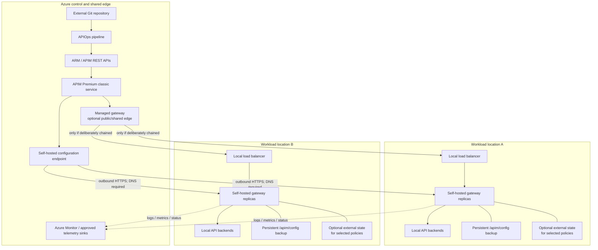

<!-- study-contract: principal -->

# Azure API Management hybrid fit

| Field | Value |
|---|---|
| Artifact type | architecture-study |
| Decision question | Can a bounded APIM self-hosted archetype be resolved into a supported, reproducible topology that meets workload-local processing, disconnected recovery, domain governance, support and operational requirements? |
| Decision owner | API Platform Architecture Review Board |
| Primary audiences | Platform executives, enterprise/security architects, AKS/network engineers, developers, DevOps/SRE and operations |
| Scope | APIM Premium classic with self-hosted gateway v2 as a bounded proof archetype; exact service, image, AKS and network configuration remain Gate-1 decisions; managed edge chaining and workspace alternatives are challenge cases |
| Evidence state | Documented (`E1`) topology expectations; all organization fit and execution results are unknown |
| Reference case | [RE-1 enterprise reference case](41-enterprise-reference-case.md), synthetic and non-organizational |
| As-of date | 2026-08-17 |
| Next gate | Gate-1 option-resolution review, followed by architecture proof review only after the APIM-H proof target and E2 support/residency evidence are complete |

## Provisional answer

**Evidence state:** `E1 — documented mechanism`; all organization fit, performance, recovery, and support conclusions remain `Unknown`. Nothing in this document records an executed test.

For APIM, hybrid fit is the compound ability to:

- keep selected API requests and payloads inside the required workload location;
- govern those APIs from an Azure-hosted APIM service without creating an unmanageable service-instance topology;
- continue an explicitly bounded set of runtime functions through a control-plane partition;
- restart, scale, patch, rotate identity/certificates, observe, and recover the customer-operated gateways;
- delegate domain administration without relying on an unsupported workspace/self-hosted pairing; and
- obtain support across the Microsoft/customer/Kubernetes/network seams.

The bounded proof archetype described here is **Premium (classic) APIM plus self-hosted gateway v2 on Kubernetes/AKS, authenticated with Microsoft Entra ID, with durable local configuration backup**. It is not an exact candidate or deployable bill of materials: the APIM service region/configuration, gateway image digest, AKS/Kubernetes/CNI/storage versions, network path and policy bundle remain unresolved. Developer tier can support a self-hosted gateway but is not a production reference architecture. Current v2 APIM service tiers do not support self-hosted gateway. See [self-hosted tier applicability](https://learn.microsoft.com/en-us/azure/api-management/self-hosted-gateway-support-policies) and [v2 unavailable features](https://learn.microsoft.com/en-us/azure/api-management/v2-service-tiers-overview#currently-unavailable-features).

### Gate-1 option-resolution blockers

The mechanism analysis below is useful before a bill of materials exists, but it cannot yield pass/fail, cost, supportability or performance claims. Freeze one option record with every item below before provisioning or comparing results.

| Blocker | Required resolution and immutable evidence | Accountable evidence owner | Disposition |
|---|---|---|---|
| APIM-H-OR-01 — APIM service | Subscription/resource boundary, Premium classic capacity/configuration, region(s), zone/multi-region design, network mode, workspace/service scope and resource/API versions | Azure platform owner | `Gate-1 hold — unresolved` |
| APIM-H-OR-02 — gateway release | Self-hosted gateway major/minor/patch, registry source, immutable image digest, deployment manifest/chart commit and vendor support-window evidence | API platform engineering | `Gate-1 hold — unresolved` |
| APIM-H-OR-03 — AKS substrate | AKS and Kubernetes versions, node images/pools, CNI, CSI/storage class, autoscaler, ingress/load balancer, disruption/spread rules and upgrade channels | AKS platform owner | `Gate-1 hold — unresolved` |
| APIM-H-OR-04 — path and trust | Exact DNS/edge/WAF/DDoS/routing sequence, private/public endpoints, egress allowlist, Entra workload identity, RBAC, secrets source and certificate/CA chain | Network and security owners | `Gate-1 hold — unresolved` |
| APIM-H-OR-05 — behavioral package | API/policy/configuration commit and fingerprint, telemetry settings, Redis or other external state, backend profile, J-06/I-02 partition procedure and recovery thresholds | API product owner and SRE | `Gate-1 hold — E3 design incomplete` |
| APIM-H-OR-06 — entitlement and support | Order-form metric, gateway entitlement, support tier, supported-combination confirmation, customer/Microsoft responsibility seam and escalation path | Procurement and support management | `Gate-1 hold — E2 required` |

## Scenario and assumptions

RE-1 is a synthetic challenge model. Its journeys, traffic shapes and recovery conditions are **scenario assumptions**, not measurements of an existing environment. Before execution, service owners must replace or approve the workload envelope and the decision body must approve outage, freshness, loss and recovery thresholds. No scenario assumption is reported as a current-state fact.

## Mechanism analysis: reference topology to validate

**Figure APIM-H1 — Five paths around the local runtime can fail independently.**

- **Depicted scope:** bounded Premium-classic/self-hosted proof archetype across APIOps/configuration, optional managed edge, two local request paths, persistent local configuration, optional policy state and telemetry.
- **Excluded scope:** approved global edge, WAF/DDoS, secrets/PKI, exact AKS/network/storage implementation and enterprise monitoring design, and any availability or locality conclusion.
- **Diagram source, evidence state and as-of:** inline Mermaid synthesis from the cited official APIM self-hosted connectivity/support mechanisms plus an unexecuted topology hypothesis; `E1 documented` plus interpretation, no observed proof run; 2026-08-17.
- **Accessible equivalent:** Git/pipeline → ARM/APIM service → self-hosted configuration endpoint → local gateway groups; consumers reach each local group directly or through an optional managed gateway; local gateways call local backends, use persistent configuration and optional policy state, and export telemetry. The following path table states the boundary-crossing state and failure question.

**Figure interpretation:** The topology shows that local request processing, Azure configuration, telemetry, optional managed-edge processing and policy state are distinct paths with distinct owners. A topology can pass payload locality while failing restart, scale-out, change, evidence or support requirements; direct and managed-edge routes therefore need separate verdicts.

**Figure limitation:** This is an unexecuted proof hypothesis, not an approved target or availability/locality result; it omits the resolved global edge, AKS/network/storage, PKI/secrets, policy state and monitoring implementation.

## Control, configuration, and request-path mechanics

| Path | Sequence | State crossing the boundary | Failure question |
|---|---|---|---|
| API configuration | Git/pipeline or portal → ARM/APIM API → APIM service → configuration endpoint → self-hosted gateway | API definitions, hostnames, policies, referenced configuration | How long can the existing contract run, and what changes are impossible, during partition? |
| Existing request | Consumer/LB → self-hosted gateway → local backend → gateway → consumer | Payload, credentials, policy working state, telemetry | Is any payload or credential emitted to Azure by the selected diagnostics/policies? |
| Runtime-data lookup | Gateway policy → local/external state store or platform-backed resource | Counter, cache, secret, token, certificate, or KVM-equivalent data | Is failure open, closed, stale, local-only, or globally consistent? |
| Gateway identity | Pod identity or token → configuration endpoint | Workload identity, APIM gateway association, status | What happens on credential revocation, expiry, RBAC drift, or clock skew? |
| Telemetry | Gateway → local collector/Azure Monitor/other sink | Request metadata and optionally payload fragments | What is buffered, dropped, masked, retried, and reconciled? |

Microsoft documents that the v2 configuration endpoint uses a hostname of the form `<service>.configuration.azure-api.net`; DNS resolution and outbound access are therefore part of the runtime's configuration dependency. Microsoft also documents access-token and Entra authentication options in the [support responsibility table](https://learn.microsoft.com/en-us/azure/api-management/self-hosted-gateway-support-policies#responsibilities).

## Partition matrix: separate “serving” from “changing”

| Event during Azure-control-plane loss | Documented expectation (`E1`) | Unproven edge (`E3 required`) |
|---|---|---|
| Existing pod serves existing API | Running gateway continues with in-memory configuration | Exact policies whose external dependencies still work; duration; alarm quality |
| Existing pod receives a new policy or API | It cannot receive the Azure-side change until connectivity returns | Reconciliation ordering and rollback after conflicting/emergency changes |
| Existing pod restarts with configuration backup | A stopped gateway can start from persisted backup | Volume attach time, corruption, key/certificate availability, readiness truthfulness |
| Existing pod restarts without configuration backup | It cannot use a persisted last-known configuration | Exact failure signal and whether load balancer removes it before client impact |
| New pod starts on a clean node | Not established by the documented stopped-instance statement | Whether it can obtain/restore a valid configuration and join safely |
| Subscription, key, named-value, or certificate changes | No new cloud configuration can arrive through the normal path | Which already-issued credentials continue, local revocation behavior, and recovery order |
| Telemetry export | Runtime serving and observability can fail independently | Local buffer limit, loss, duplicate delivery, and post-partition ordering |

The source for the documented half of this matrix is the [connectivity behavior in the self-hosted overview](https://learn.microsoft.com/en-us/azure/api-management/self-hosted-gateway-overview#connectivity-to-azure). Do not transform “running gateways continue” into an unsupported claim of autonomous scale-out or air-gapped management.

## Federation conflict to resolve explicitly

Workspaces decentralize APIM resource administration through workspace-scoped Azure RBAC and can isolate traffic with managed workspace gateways. However, Microsoft currently states that a [workspace cannot associate with a self-hosted gateway](https://learn.microsoft.com/en-us/azure/api-management/workspaces-overview#workspace-and-workspace-gateway-constraints). That creates three materially different patterns:

| Pattern | Delegation | Workload-local gateway | Structural consequence |
|---|---|---|---|
| One APIM service, service-level APIs, multiple self-hosted gateway resources | RBAC and repository conventions outside workspaces | Yes | Central service may become a governance/failure/concurrency boundary; prove team isolation |
| One APIM service with workspaces and managed/default workspace gateways | Native workspace delegation | No self-hosted association | Runtime stays in Azure-managed gateway locations; backend connectivity may cross boundary |
| Multiple APIM services, potentially one per domain/location | Service-level isolation | Yes where classic Premium is used | Service/portal/policy/identity/observability sprawl and higher operational coordination |

This is not an argument against APIM. It is a design fork whose cost and governance impact must be visible before any “federated hybrid” claim is accepted.

## Principal-grade validation protocol

Run every exercise with the exact APIM tier, region, self-hosted image digest, Kubernetes version/CNI, identity method, persistent-storage class, policy bundle, and backend profile recorded. Capture sanitized manifests, event timelines, request results, telemetry gaps, and recovery logs. Configuration existing in a repository is not execution evidence.

### 1. Configuration authority and promotion

- Deploy the same OpenAPI and policy set through the intended APIOps path to managed and self-hosted gateways.
- Create an out-of-band portal edit; show whether the pipeline detects, overwrites, imports, or silently preserves drift.
- Roll forward and back a breaking policy change while requests are in flight.
- Delete and rename APIs/products; prove that promotion semantics do not leave stale runtime objects.
- Verify secret and certificate references without exporting secret values into the public evidence set.

### 2. Disconnected operation

- Establish a steady request mix from [RE-1](41-enterprise-reference-case.md): J-01 money transfer and I-01 lost-response/duplicate risk, J-02 account summary, J-03 partner initiation, J-04 onboarding, and J-05 settlement processing. Use J-06/I-02 for configuration propagation and stale-replica behavior.
- Block the configuration endpoint while leaving backend and observability paths independently controllable.
- During the partition: keep traffic running, apply a cloud-side change, restart a pod, drain a node, and request additional replicas on a clean node.
- Restore connectivity; record time to reconcile, version actually served by each replica, request anomalies, and telemetry loss/duplication.
- Repeat with the persistent backup absent, stale, read-only, and unavailable. These are separate failure modes.

### 3. Identity, PKI, and secrets

- Use Entra workload identity or the approved non-secret-bearing mechanism; do not make a 30-day gateway token the silent production default.
- Rotate the gateway identity, client-facing certificate, backend certificate, trusted CA, and policy secret while traffic runs.
- Revoke identity permissions and break DNS/time synchronization; prove alert routing and recovery.
- Show which certificate/CA capabilities differ between managed, self-hosted, and workspace gateways.

### 4. Policy-contract parity

Execute one golden contract suite against every proposed gateway type. Compare, at minimum:

| Contract surface | Examples of observable output |
|---|---|
| Authentication and authorization | status, `WWW-Authenticate`, claim/audience handling, certificate failure |
| Traffic control | local/global quota counts, retry-after semantics, replica/region consistency |
| Transformation and validation | content type, body, schema error, size limit, buffering behavior |
| Failure handling | timeout, reset, retry, backend TLS error, policy-expression exception |
| Observability | correlation ID, trace propagation, log mask, metric labels, sampling |
| Protocol and connection | HTTP/2 direction, WebSocket, streaming, long-running request, connection reuse |

### 5. Availability and capacity

- Saturate CPU, memory, backend connections, optional Redis, DNS, and telemetry sinks one at a time; then combine control-plane partition with node loss.
- Prove PodDisruptionBudget, anti-affinity/topology spread, readiness, graceful termination, and capacity during one-replica replacement.
- Model per-location capacity without assuming a documented managed-gateway estimate applies to the self-hosted container.
- Verify whether the proposed local/global traffic steering preserves session, quota, and failover semantics.

### 6. Operations and support seam

- Upgrade through each supported image step with live traffic, then exercise rollback with configuration compatibility checked.
- Hand an incident packet containing gateway diagnostics, Kubernetes events, CNI/DNS evidence, and endpoint traces to the actual support path.
- Obtain `E2` confirmation of who owns an incident spanning the gateway image, AKS, third-party CNI, firewall, service mesh, and identity.
- Measure engineering time for patching, capacity, certificate rotation, APIOps failures, and platform incidents; license price alone is not TCO.

## Failure-injection evidence table

| Injection | Observe | Minimum artifact | Evidence state before execution |
|---|---|---|---|
| Block configuration endpoint DNS and HTTPS independently (J-06/I-02) | request continuity, config age, health/status, alarms | timestamped request and pod/event logs | `Unknown` |
| Restart and reschedule during partition | startup source, readiness, served config hash | pod events, volume evidence, config fingerprint | `Unknown` |
| Add replicas on clean nodes during partition | schedule/readiness/traffic acceptance | HPA/deployment events and per-replica results | `Unknown` |
| Fail local Redis/state dependency | fail-open/closed, counter drift, latency | policy config plus response/counter timeline | `Unknown` |
| Revoke Entra identity | update/status failure and recovery | RBAC change record and gateway diagnostics | `Unknown` |
| Saturate one workspace/shared gateway consumer (I-04) | cross-domain latency/error effect | per-domain load and SLI series | `Unknown` |
| Upgrade and roll back image | request errors, config/policy compatibility | image digests, rollout events, golden-test diff | `Unknown` |

## Support and entitlement caveats

- The self-hosted gateway support document assigns Kubernetes hosting, SLA, capacity, network configuration, diagnostics collection, and most third-party integrations to the customer. Microsoft Support states that it checks configuration-endpoint communication but does not troubleshoot CNI, NetworkPolicy, firewalls, service meshes, or complex network circuits. This is `E1`, not the organization's contracted escalation outcome.
- Self-hosted gateway counts and service limits vary by tier and are changeable service facts. Record the exact quota in the quote and provisioned subscription; do not rely on a family-level diagram.
- Workspace gateways, regional availability, and v2 features are moving quickly. Freeze an architecture only against a dated vendor response and the exact API resource versions.
- No license, support-response, preview-to-GA, or roadmap term is inferred here. All such terms remain `E2 required`.

## Counter-hypotheses and non-fit conditions

| Hypothesis to challenge | Strongest counter-evidence | Falsifier / non-fit condition |
|---|---|---|
| “A self-hosted gateway cannot meet hybrid locality.” | Microsoft documents customer-hosted request processing close to local backends | Flow evidence shows a required request/payload must traverse an unapproved Azure-managed path, or the exact local variant lacks a mandatory policy |
| “Cached configuration makes the runtime autonomous.” | A running gateway can continue temporarily, and persistent backup can support some restarts | Clean-node scale-out, urgent revocation/change, identity refresh, license/status or reconciliation fails inside the approved disconnected envelope |
| “Workspaces provide both domain federation and local gateways.” | Workspaces delegate configuration and dedicated workspace gateways can isolate managed runtime | Current product combination cannot associate the required workspace with a self-hosted gateway, and service-instance alternatives create unacceptable sprawl or governance seams |
| “Managed Azure control means Microsoft owns the end-to-end incident.” | Microsoft owns APIM service components and documents a support boundary | Required diagnosis/recovery crosses CNI, firewall, storage, Entra, Redis, DNS or AKS seams without a named accountable owner or acceptable E2 response |
| “Policy parity makes managed and self-hosted placement interchangeable.” | Both implement APIM policies within their documented feature surfaces | Golden contract, counter behavior, certificate handling, telemetry or performance differs on a mandatory RE-1 case |

The exact topology is a **non-fit** if a mandatory workload-local and domain-delegated combination is unsupported, clean capacity cannot start safely during the approved partition, security-sensitive configuration cannot meet its freshness window, a prohibited data class crosses the control/telemetry boundary, or no support model owns the Microsoft/customer seam. A failure excludes the tested variant, not the APIM product family, and does not prove another candidate passes.

## Decision implications

- Treat direct-to-local gateway and managed-edge-to-local gateway as separate option variants with separate residency, protection, latency and failure evidence.
- Keep workspace-based delegation outside the self-hosted option until the current association constraint changes or a different supported boundary is approved.
- Make durable configuration backup, Entra identity, image pinning/upgrades, counter-state design and the Microsoft/customer network seam explicit architecture controls.
- Stop a hybrid-fit conclusion when restart/clean scale-out, residency classification, or support ownership remains unknown, even if an already-running pod serves traffic during a short partition.

## Falsification and proof plan

| Proof ID | Procedure | Measure | Threshold | Evidence artifact | Independent reviewer |
|---|---|---|---|---|---|
| APIM-H01 | Run J-06/I-02 with independent DNS and HTTPS blocks, an existing pod, restarted pod and clean-node scale-out | configuration fingerprint, readiness, request outcomes, reconciliation | Approved outage/freshness objective met; no stale/unapproved replica accepts traffic outside policy | manifests, identity/storage config, request/events and config timeline | SRE fault-test reviewer |
| APIM-H02 | Trace J-01 through J-05 with representative diagnostics/debug and deny-by-default egress | destinations and classified fields crossing location boundaries | No restricted payload/credential/evidence field crosses an unapproved boundary | packet/flow inventory, telemetry schemas and privacy review | Privacy/security architecture |
| APIM-H03 | Execute I-03 through I-05: PKI rotation, noisy neighbour and telemetry backpressure | handshake failures, cross-domain SLI, gateway resource use, loss/duplicates | Approved trust, isolation and evidence-loss objectives met; request path does not silently fail open | certificate, load, SLI and telemetry sequence bundle | PKI, reliability and audit reviewers |
| APIM-H04 | Upgrade and roll back a supported pinned image while traffic runs and one dependency is degraded | request errors, policy diff, rollout/recovery time, support diagnostics | Meets approved maintenance objective; mandatory policy contract remains equivalent | image digests, rollout events, golden-contract diff and incident packet | Change assurance lead |

These thresholds are approval-dependent. Until the owner approves them, they are open questions—not implied platform pass criteria or observed results.

## Falsification decision

The APIM hybrid hypothesis is falsified for the target model if any mandatory requirement cannot be met without an unsupported combination or unacceptable service-instance sprawl. The sharpest test is:

> Can the exact APIM variant provide centrally governed, domain-delegated APIs with workload-local request processing at every required location, while pods can restart and capacity can recover through the approved control-plane outage window, and while the organization can support the Kubernetes/network seams?

A positive answer requires artifacts from the exercises above. A diagram, successful happy-path deployment, or already-running pod surviving a short disconnect is insufficient.

## Risks and limitations

- Microsoft documentation establishes expected mechanisms, not the organization's outage window, workload SLO, residency interpretation or support outcome.
- Workspace and v2 capabilities, regions, limits and support statements are volatile after the as-of date.
- RE-1 is synthetic and the reference topology omits an approved DNS/global-edge, WAF/DDoS and enterprise observability implementation.
- A successful AKS test generalizes only to the recorded cluster/CNI/storage/identity/image/policy combination.
- No pricing, entitlement, capacity, incident or staffing conclusion can be made from this design.

## Open evidence requests

| Request | Owner role | Due gate | Decision impact if unresolved |
|---|---|---|---|
| Approved disconnected-operation, config-freshness, failover and telemetry-loss thresholds | Business service owners and SRE governance | Test-plan approval | APIM-H01/H03 cannot produce a pass/fail result |
| Exact data classification and approved destinations for all outbound flows | Privacy, security and records management | Architecture proof review | Hybrid residency gate remains unknown |
| Support statement spanning APIM image, AKS, CNI, firewall, storage, identity and mesh | Vendor manager and cloud/platform support owners | Architecture proof review | Operational support gate remains unknown |
| Exact entitlement, gateway count, regions and service limits | Procurement and vendor manager | Option-definition gate | Variant remains undefined and unscorable |
| APIM-H01 through APIM-H04 reproducible evidence | Platform engineering and independent reviewers | PoC evidence gate | No hybrid-fit conclusion |

## Next gate

The Architecture Proof Review may advance this exact topology only when approved thresholds exist, volatile product facts and E2 support/residency terms are current, APIM-H01 through APIM-H04 have reproducible artifacts, and independent reviewers confirm that every mandatory hybrid gate is passed or formally excepted. Otherwise the topology remains an unscored hypothesis.
