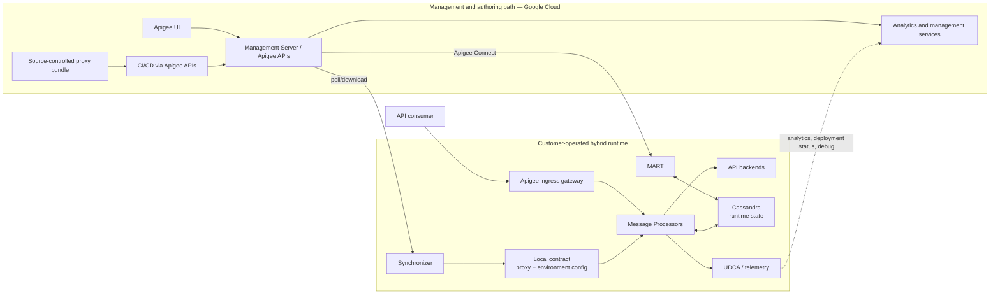

<!-- study-contract: principal -->

# Apigee assessment

| Field | Value |
|---|---|
| Artifact type | candidate-dossier |
| Decision question | Which bounded managed-Apigee or Apigee-Hybrid archetypes warrant Gate-1 option resolution before residency, runtime-state, lifecycle, support, migration and operational gates are applied? |
| Decision owner | API Platform Steering Committee |
| Primary audiences | Executives, platform/security leaders, enterprise architects, developers, DevOps/SRE, Kubernetes/data and operations teams |
| Scope | Google-managed Apigee subscription/pay-as-you-go distinctions and Apigee Hybrid on supported Kubernetes, using RE-1 challenge journeys |
| Evidence state | Documented (`E1`) product mechanisms; organization contract, fit, tests and pilot are unknown |
| Reference case | [RE-1 enterprise reference case](41-enterprise-reference-case.md), synthetic and non-organizational |
| As-of date | 2026-08-17 |
| Next gate | Gate-1 option-resolution review; candidate evidence review follows only after deployable variants, E2 data/support terms and APIG proof artifacts are complete |

## Provisional answer

**Evidence state:** `E1 — current Google Cloud documentation`, reviewed 2026-08-17. There is no organization-specific contract evidence (`E2`), executed lab evidence (`E3`), or pilot evidence (`E4`) in this repository. “Apigee is mature” is not a score.

Apigee must be evaluated as at least two different product archetypes. Neither row below is yet a purchasable and reproducible deployment option:

| Bounded archetype | Management plane | Runtime plane | Commercial/operational boundary |
|---|---|---|---|
| Google-managed Apigee (often called Apigee X in architecture discussions) | Google Cloud | Google-managed regional Apigee instances attached to environments | Google operates both planes; subscription and pay-as-you-go models have different environment/add-on/usage constructs |
| Apigee Hybrid | Google Cloud services operated by Google | Customer-operated services on a supported Kubernetes platform | Google operates management APIs/UI/analytics; customer operates cluster, ingress, message processors, Synchronizer, Cassandra, MART, telemetry agents, capacity, backup, and upgrades |

Google's [technical feature overview](https://cloud.google.com/apigee/docs/api-platform/get-started/apigee-feature-summary) compares managed Apigee and hybrid. Pay-as-you-go documentation explicitly [does not apply to hybrid](https://cloud.google.com/apigee/docs/api-platform/reference/pay-as-you-go-updated-overview). Do not transfer a managed Apigee entitlement, availability claim, or operating assumption to Hybrid.

### Gate-1 option-resolution blockers

Each option record must describe one contractable service or one reproducible Hybrid bill of materials. Until the applicable rows below are resolved, the archetype remains discovery evidence only and cannot be scored, costed or presented as target architecture.

| Blocker | Required option-level evidence | Accountable evidence owner | Current disposition |
|---|---|---|---|
| APIG-OR-01 — commercial/service identity | Subscription or pay-as-you-go model, purchased feature/add-on set, organization/project boundary, environment type, instance/region attachment, environment group/hostname and support tier | Cloud platform and procurement | `Gate-1 hold — E2 required` |
| APIG-OR-02 — managed runtime | Exact managed instance regions, network/peering/PSC path, routing and capacity model, data-residency configuration, encryption/key boundary and availability design | Google Cloud architecture | `Gate-1 hold — unresolved` |
| APIG-OR-03 — Hybrid release/substrate | Exact Hybrid patch and image/chart digests; certified Kubernetes/AKS, CNI, ingress, storage, Cassandra, cert-manager, mesh and operator combinations; upgrade/EOL window | Hybrid and Kubernetes owners | `Gate-1 hold — unresolved` |
| APIG-OR-04 — authority, data and identity | Management project/region, Synchronizer and Connect paths, service accounts/workload identity, secrets/PKI, analytics/debug/log classification, retention and support-access route | Security, privacy and platform owners | `Gate-1 hold — E2/E3 required` |
| APIG-OR-05 — behavior and state | Proxy bundle/policy revision, product/app/key and KVM model, Cassandra topology/backup, quota/cache semantics, telemetry settings and J-06/I-02 recovery behavior | API product, data and SRE owners | `Gate-1 hold — unresolved` |
| APIG-OR-06 — objectives and exit | Approved workload envelope, SLO/RPO/RTO, regional headroom, restore scope, migration/credential choreography, portability constraints and exit evidence | Service owner and architecture assurance | `Gate-1 hold — unresolved` |

## Mechanism analysis: Apigee object and traffic model

An Apigee organization maps to one Google Cloud project and contains environments, environment groups, proxies, products, applications, and developers. A proxy is routable only after it is deployed to an environment and the environment is attached to an environment group whose hostnames receive traffic. In managed Apigee, an environment is also attached to one or more regional runtime instances. See [organization structure](https://cloud.google.com/apigee/docs/api-platform/fundamentals/organization-structure) and [environment attachment mechanics](https://cloud.google.com/apigee/docs/api-platform/fundamentals/environments-working-with).

**Figure APIG-A1 — Hybrid separates proxy configuration, runtime-data administration, API traffic and analytics.**

- **Depicted scope:** Apigee Hybrid authoring/management, Synchronizer contract, MART/Connect runtime-data administration, Cassandra-backed proxy processing and asynchronous analytics.
- **Excluded scope:** selected ingress, AKS/region, support, global routing, backup and identity designs, and any claim that all control-plane failures have one behavior.
- **Diagram source, evidence state and as-of:** inline Mermaid synthesis from the cited official Apigee Hybrid component and data-location mechanisms; `E1 documented` plus reasoned arrows, no observed runtime; 2026-08-17.
- **Accessible equivalent:** Git/CI or UI updates Google management; Synchronizer downloads the local proxy/environment contract; management reaches MART through Apigee Connect to read/write Cassandra; consumers traverse ingress → Message Processor → backend; runtime sends analytics/status/debug asynchronously. The following ownership and component tables state the authoritative state and operating implication.

**Figure interpretation:** The exhibit shows that existing proxy traffic, proxy-configuration synchronization, management of product/app/key runtime data and analytics delivery take different paths. Therefore “control plane disconnected” is not one failure and Cassandra is not disposable cache.

**Figure limitation:** This mechanism synthesis does not claim that any path meets an organization SLO, residency rule, recovery objective or supported AKS combination; exact managed and Hybrid options remain unresolved.

This architecture contains **three different flows** that are often collapsed into “control plane connectivity”:

1. Synchronizer downloads a local configuration contract for message processors.
2. Management calls concerning runtime entities are authenticated in the management plane and forwarded through Apigee Connect to MART, which reads or writes Cassandra.
3. Runtime telemetry is sent asynchronously to Google-hosted services.

Google documents these mechanisms and the fact that MART does not process proxy traffic in [What is Apigee Hybrid?](https://cloud.google.com/apigee/docs/hybrid/latest/what-is-hybrid).

## State ownership and residency

| Data/state category | Documented authoritative location | Cross-boundary flow | Assessment consequence |
|---|---|---|---|
| Proxy bundles, target servers, truststores, keystores | Management plane; synchronized into the runtime contract | Google Cloud → Synchronizer → local file → message processors | Local serving does not make configuration sovereign or locally editable |
| Products, developers, developer apps, API keys, OAuth tokens/codes, KVMs, quotas, cache | Runtime Cassandra; management access passes through MART | Management Server → Apigee Connect → MART → Cassandra | Cassandra is business/security state, not disposable gateway cache |
| Analytics, deployment status, debug data | Sent asynchronously from runtime to management plane | Runtime → Google Cloud | Payload/metadata classification, redaction, residency, retention, and export require explicit review |
| Audit logs, RBAC, users | Management plane only | Administrative activity remains cloud-hosted | Local runtime placement does not satisfy a requirement for fully local administration |
| Runtime logs and metrics | Sent to the customer's Google Cloud project according to telemetry configuration | Runtime → Cloud Logging/Monitoring | Google Cloud project/IAM/egress become operational dependencies |
| Cassandra backup | Customer-provided backup infrastructure; Cloud Storage, remote server, or supported CSI approach | Runtime → selected backup target | RPO, encryption, retention, restore scope, and operator ownership are customer decisions |

The authoritative source is Google's [hybrid data-location inventory](https://cloud.google.com/apigee/docs/hybrid/latest/where-data.html). It states that a data-residency setting can select where specified management-plane data is stored; this must not be generalized to all analytics, logs, support data, or every contractual data category. Exact region and contract evidence remain `E2 required`.

## Runtime components are an operating model

| Component | Role | Stateful? | Failure/operations implication |
|---|---|---|---|
| Ingress gateway | Exposes message processors to consumers | Configuration and certificates matter; request path itself is proxying | LB, DNS, certificate, mesh, and routing errors can fail all requests before a proxy executes |
| Message Processor | Executes proxy flow and policies, calls backends | Uses local contract and Cassandra runtime data | CPU, memory, policy blocking, connection pools, and bad proxy revisions are direct SLO drivers |
| Synchronizer | Polls management plane and stores the configuration contract locally | Local contract file | A partition freezes deployable configuration; restart persistence and consistency must be tested |
| Cassandra | Persists KMS, OAuth, product/app, KVM, quota, cache, and monetization state | Yes; StatefulSet and storage | Capacity, compaction, repair, backup, restore, NTP, disk, topology, and version lifecycle become platform duties |
| MART | Validates and processes management access to runtime data | Stateless; reads/writes Cassandra | Management of apps/keys/KVMs depends on Connect/MART/Cassandra even while proxy traffic may continue |
| UDCA / telemetry services | Collect and upload analytics and status | Buffers/queues are implementation details to validate | A telemetry partition can create delayed, missing, duplicate, or backpressured operational evidence |
| Controllers, cert-manager, service mesh, Redis and other runtime services | Reconcile and support the platform | Mixed | Supported-version matrix and coordinated upgrades are part of the product footprint |

Google's [backup overview](https://cloud.google.com/apigee/docs/hybrid/latest/cassandra-backup-overview) says Cassandra is the persistent component requiring backup while other listed runtime components can be reinstalled from configuration. That does not prove a target RPO/RTO or application-consistent restore.

## Applying the enterprise reference case

Use [RE-1](41-enterprise-reference-case.md)—J-01 through J-06 and failures I-01 through I-08—to expose product mechanics that a pet-store proxy misses:

RE-1 values and any workload envelopes derived from them are **scenario assumptions**, not estate observations or benchmark results. Exact traffic, payload, recovery, consistency and evidence thresholds require owner approval before the proof plan can return pass/fail.

- A regulated API product must bind consumer application credentials, OAuth behavior, product entitlement, quota, proxy revision, KVM configuration, and audit evidence across management and runtime planes.
- A synchronous write with an idempotency key tests whether retries in a proxy, load balancer, or client can duplicate a backend action.
- A local system-of-record path tests whether API payloads remain local while analytics, debug, logs, configuration, and identity metadata cross into Google Cloud.
- A control-plane partition tests existing request processing separately from new proxy deployments, key/app changes, KVM changes, debug, and analytics delivery.
- A regional failure tests Cassandra recovery and traffic steering, not only stateless message-processor replacement.

Apigee's API product, developer app, analytics, and proxy model can be an advantage only if the program will operate those lifecycle concepts. If the target merely requires ingress routing and a small policy set, the same runtime richness may be non-value-adding operational weight. That is a hypothesis for the workload portfolio, not a product judgment.

## Managed Apigee: boundaries hidden by “SaaS”

- Environments are isolated deployment areas; in managed Apigee they must be attached to regional runtime instances and environment groups before proxies are reachable. Region and hostname design therefore affects failure domains and cost/entitlement, not just naming.
- Google manages runtime infrastructure, but the customer still owns proxy code/policies, products/apps, identity, certificates, routing, backend connectivity, change governance, and application-level incident diagnosis.
- Subscription and pay-as-you-go are not interchangeable. Under pay-as-you-go, environment type, region attachment, API calls, proxy deployments, and optional analytics/security features affect the commercial model; exact rates and purchased terms are deliberately not repeated here.
- Managed Apigee is the clean comparator when the organization accepts Google-operated request processing. Hybrid is the comparator when local request processing is mandatory. Combining their strengths into one notional score would create a product that cannot be bought.

## Hybrid lifecycle and support pressure

As of this review, Google's [supported-platform matrix](https://cloud.google.com/apigee/docs/hybrid/supported-platforms) lists Hybrid 1.14, 1.15, and 1.16 with dated EOLs and states that minor versions are supported for at most 12 months from original release. The same matrix pins compatible Kubernetes, AKS, Cassandra, cert-manager, and other component versions and notes known compatibility issues. These values are volatile: record the matrix snapshot at PoC and production design approval rather than copying it into a timeless standard.

Consequences:

- The platform team must coordinate Kubernetes and Hybrid upgrades inside overlapping support windows.
- An AKS automatic-upgrade policy can move the cluster outside the certified combination if version ownership is not explicit.
- Cert-manager, service mesh, Cassandra, Helm charts, CRDs, operators, secrets, service accounts, and Google Cloud APIs form one change surface.
- “Kubernetes-native” does not mean the workload platform team already has Cassandra repair/backup/restore skills or accepts vendor-specific operators and upgrade cadence.
- An unsupported version normally must be upgraded before ordinary support can proceed; any exception needs `E2` evidence.

## Failure modes a feature comparison misses

| Failure | Documented mechanism | Material unknown requiring proof |
|---|---|---|
| Management-plane/Synchronizer link lost | Message processors continue using the locally stored contract | New-pod behavior, maximum practical partition, alarm quality, and reconciliation of queued changes |
| Apigee Connect or MART unavailable | Proxy traffic does not traverse MART, but runtime-data administration cannot take its normal path | Key/app/KVM operations, portal flows, revocation, and operator recovery behavior |
| Cassandra quorum/storage/NTP problem | Runtime state is stored in Cassandra; AKS guidance requires synchronized clocks | Which traffic/policies fail, consistency effects, repair duration, and blast radius |
| Analytics uplink fails | Data is sent asynchronously to management services | Buffer capacity, loss/duplication, backpressure, late-data semantics, and compliance response |
| Ingress or service-mesh certificate problem | Requests cannot reach message processors correctly | Rotation choreography, cross-zone effects, and support ownership |
| Region fails | Healthy regions may carry traffic; failed Cassandra region must be recovered/rebuilt | Headroom, DNS/LB convergence, stale state, RPO/RTO, and operator steps |
| All regions fail | Restore from Cassandra backup is required | Backup integrity and restore time; multi-organization restore has documented scope constraints |
| Bad proxy/policy deployment | Contract propagates from management plane to runtime | Progressive delivery, per-replica consistency, rollback time, and protection from global blast radius |

For multi-region recovery, Google documents redirecting traffic, decommissioning the impacted region, and recreating/recovering it from a healthy region. If all regions are lost, restore is from backup; in a multi-organization deployment, [restoring only one organization is not supported](https://cloud.google.com/apigee/docs/hybrid/latest/restore-cassandra-multi-region). This is a material recovery-boundary fact, not an implementation detail.

## Migration and exit implications

1. **Proxy bundles are exportable, but a proxy is not the whole program.** Apigee supports [downloading proxy revision bundles](https://cloud.google.com/apigee/docs/api-platform/fundamentals/download-api-proxies) for source control/import. JavaScript/Java callouts, shared flows, policy semantics, KVM lookups, target servers, certificates, and product/app coupling still require semantic conversion.
2. **Runtime identity is live state.** Products, developers, apps, credentials, OAuth tokens, KVMs, quota buckets, and caches cannot be treated as static proxy source. Define recreate-versus-migrate, dual validation, revocation, and consumer communication.
3. **Analytics has an export mechanism, not automatic portability.** Apigee supports asynchronous [analytics export to Cloud Storage or BigQuery](https://cloud.google.com/apigee/docs/api-platform/analytics/export-data), with permissions and date-range behavior. Prove schema, historical coverage, cost, replay, and downstream report continuity.
4. **Environment and hostname cutover is architectural.** Model org/project, environment, environment-group hostname, runtime attachment, TLS, DNS TTL, backend allowlists, and rollback.
5. **Hybrid exit includes data-plane decommissioning.** Cassandra backup/retention, service accounts, Google projects/APIs, Kubernetes CRDs, secrets, storage, and telemetry sinks need an auditable retirement sequence.
6. **Policy portability is not syntax portability.** Preserve the observable contract—status, headers, body, auth decision, quota scope, cache behavior, logs, traces—then implement it on the target.

## Counter-evidence and falsification

| Proposition to challenge | Counter-evidence | Falsification test |
|---|---|---|
| “Hybrid keeps all data on premises.” | Proxy/target/TLS configuration is management-plane state; analytics, status and debug flow to Google; audit/RBAC/users are management-plane only | Trace and classify every outbound flow under representative policies, logging and debug; reconcile with contract/data-residency controls |
| “Hybrid continues when Google is unavailable.” | Existing runtime contract supports serving, but control changes, MART operations and telemetry have distinct dependencies | Partition each channel separately; restart/scale; change proxy, app/key and KVM; then reconcile |
| “Cassandra is just an implementation detail.” | It stores credentials, OAuth, product/app, quota, KVM and cache state | Lose a node/zone/quorum, restore, rotate credentials, and measure business effects and operator effort |
| “Managed Apigee and Hybrid have the same fit because features are similar.” | Runtime ownership, data path, state, upgrade responsibility and pricing model differ | Produce two exact-variant architectures and operating-cost models; reject any shared assumption without evidence |
| “API product maturity guarantees adoption value.” | Product/portal capabilities create value only when producer and consumer journeys use them | Pilot onboarding, approval, credential rotation, version/deprecation, support, and analytics journeys with real roles and elapsed time |

## Decision implications

- Keep Google-managed Apigee and Apigee Hybrid as separate candidate variants; do not combine managed runtime simplicity with Hybrid payload locality in one score.
- Treat Cassandra/MART/Connect, ingress, Synchronizer and telemetry as distinct operational/state surfaces in Hybrid capacity, support and recovery criteria.
- Require explicit classification of management configuration, runtime credentials/state, analytics, debug, logs, metrics, audit and support flows before accepting a residency claim.
- Make Hybrid/Kubernetes coupled lifecycle and multi-organization restore scope mandatory operating-model gates.
- Require full product/app/credential/analytics export evidence; a proxy bundle alone is not an exit plan.

## Falsification and proof plan

| Proof ID | Procedure | Measure | Threshold | Evidence artifact | Independent reviewer |
|---|---|---|---|---|---|
| APIG-P01 | Isolate Synchronizer, Connect/MART and analytics channels separately during J-06/I-02; restart and add MPs | request/change outcomes, contract fingerprint, state and reconciliation time | Approved serving/freshness window met; no unapproved contract or key/product state; all deferred changes reconcile deterministically | topology/version manifest, request/state/event timelines | SRE and data-platform reviewers |
| APIG-P02 | Execute J-01 through J-05 while tracing all runtime/cloud flows with representative policies/debug | classified fields, endpoints/regions, retention/export path | No prohibited data flow; mandatory journeys meet approved observable contract | flow capture, policy/config hashes, data-classification record and golden results | Privacy/security architecture |
| APIG-P03 | Fail Cassandra node/zone/storage/time, then restore into a clean recovery cluster and exercise I-06 | request/auth/quota behavior, state RPO, recovery time and tenant scope | Approved state-specific RPO/RTO met; all required products/apps/keys/KVMs reconcile; restore blast radius accepted | backup metadata, recovery logs and semantic state diff | Database reliability and service continuity reviewers |
| APIG-P04 | Upgrade the exact Hybrid/AKS/cert-manager/mesh combination and export/recreate proxy/product/app/analytics assets | policy/request diff, downtime, rollback, export/recreation completeness | Supported target reached within approved window; mandatory contract and exit inventory complete | version matrix, rollout logs, golden diff and export manifest | Change assurance and migration assurance leads |

Thresholds reference owner-approved requirements; no numeric scenario assumption in RE-1 is silently promoted to a product acceptance threshold.

## Risks and limitations

- `E2 required`: purchased Apigee variant and entitlements, environments/regions, analytics/security/portal terms, support response and responsibility, data residency, retention, export, and exit assistance.
- `E3 required`: exact AKS/version installation, steady-state footprint, management/Connect/telemetry partitions, pod restart and scale-out, Cassandra node/zone failure, backup/restore, multi-region recovery, upgrades/rollback, identity and certificate rotation, proxy/product/app export.
- `E4 required`: representative traffic/policies, real developer onboarding, incident burden, staffing and on-call skill, release frequency, multi-region recovery under business pressure, and actual cost.
- `Unknown`: whether Google-managed runtime processing is permissible; whether Hybrid's local processing but cloud management/analytics meets policy; whether the portfolio benefits from the full product model enough to justify its operational surface.

The support matrix, release EOLs, features, limits and region/data-residency options can change after the as-of date. RE-1 is synthetic, and a lab conclusion applies only to the recorded organization model, Hybrid and Kubernetes versions, policy set, storage, topology and failures.

## Open evidence requests

| Request | Owner role | Due gate | Decision impact if unresolved |
|---|---|---|---|
| Exact managed/Hybrid subscription, environments, regions, add-ons and support terms | Vendor manager and procurement | Candidate evidence review | Variant remains undefined and unscorable |
| Approved classification/region/retention for every management and telemetry category | Privacy, security and records management | Candidate evidence review | Residency gate remains unknown |
| Hybrid/Kubernetes/Cassandra ownership, on-call and maintenance calendar | Platform operations and data reliability leaders | Operating-model gate | Hybrid cannot advance as operable |
| State-specific RPO/RTO and multi-organization recovery policy | Service continuity and application owners | Test-plan approval | APIG-P03 cannot return a decision |
| APIG-P01 through APIG-P04 evidence bundles | PoC engineering with independent reviewers | PoC evidence gate | No fit, resilience or exit conclusion |

## Next gate

The Candidate Evidence Review may authorize criterion scoring only for exact Apigee variants whose volatile facts and E2 terms are current, whose mandatory RE-1 journeys have approved thresholds, and whose APIG-P01 through APIG-P04 evidence passes independent review. Managed Apigee and Hybrid advance or stop separately.

The evidence establishes Apigee as a serious managed and hybrid mechanism. It does not establish comparative superiority or an organization fit.
