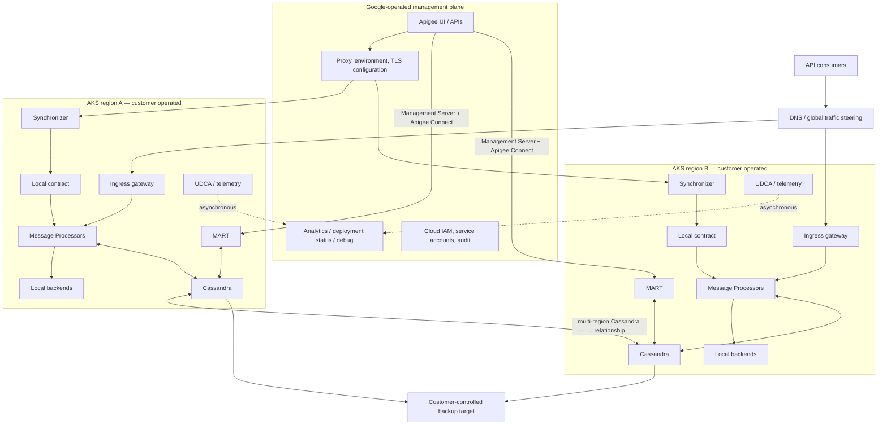

<!-- study-contract: principal -->

# Apigee Hybrid fit

| Field | Value |
|---|---|
| Artifact type | architecture-study |
| Decision question | Can the version-anchored Apigee Hybrid-on-AKS archetype be resolved into a supported bill of materials that preserves approved local processing, state consistency, recovery, lifecycle and cross-cloud support under RE-1 failure conditions? |
| Decision owner | API Platform Architecture Review Board |
| Primary audiences | Platform executives, enterprise/security architects, AKS/data engineers, developers, DevOps/SRE and operations |
| Scope | Apigee Hybrid 1.16 research baseline on an unresolved supported-AKS combination, including management, Connect/MART, Cassandra, telemetry and multi-region paths; no production bill of materials is asserted |
| Evidence state | Documented (`E1`) topology expectations; all organization fit, execution and operational results are unknown |
| Reference case | [RE-1 enterprise reference case](41-enterprise-reference-case.md), synthetic and non-organizational |
| As-of date | 2026-08-17 |
| Next gate | Gate-1 option-resolution review, followed by Hybrid architecture proof review only after the APIG-H bill of materials, execution protocol and E2 data/support terms are complete |

## Provisional answer

**Evidence state:** `E1 — documented design`; every fit, performance, recovery, and cost conclusion is `Unknown`. The exercises below are unexecuted and must not be cited as PoC results.

The version-anchored proof archetype is **Apigee Hybrid 1.16 on an AKS version supported by the matrix at execution time**. It is not yet an exact candidate: patch/image/chart digests and the AKS, CNI, ingress, storage, cert-manager, service-mesh, Google Cloud project, region, and identity configuration intended for production are unpinned. “Latest” is not a reproducible variant. Before execution, recheck the [supported platforms and version matrix](https://cloud.google.com/apigee/docs/hybrid/supported-platforms); it changes faster than an enterprise architecture decision cycle.

### Gate-1 option-resolution blockers

No APIG-H exercise may be reported as product evidence unless its run record closes every blocker below. The matrix snapshot and immutable artefacts belong in the evidence bundle because “1.16 on AKS” is still a family of combinations.

| Blocker | Required resolution and evidence | Accountable evidence owner | Disposition |
|---|---|---|---|
| APIG-H-OR-01 — release baseline | Exact Hybrid 1.16 patch, Helm/chart and container digests, CRD/operator revisions, matrix retrieval date, remaining support/EOL window and upgrade target | Apigee platform owner | `Gate-1 hold — unresolved` |
| APIG-H-OR-02 — AKS baseline | AKS/Kubernetes and node-image versions, regions/zones, node pools, CNI, CSI/storage class/disk parameters, ingress/load balancer and upgrade channels | AKS platform owner | `Gate-1 hold — unresolved` |
| APIG-H-OR-03 — dependency baseline | Cassandra, cert-manager and service-mesh versions/configuration, time source, backup mechanism, registry sources, topology/spread and capacity reservations | Hybrid data and reliability owners | `Gate-1 hold — unresolved` |
| APIG-H-OR-04 — cloud/trust boundary | Google Cloud organization/project/region, Apigee organization/environments, Synchronizer/Connect/telemetry egress, workload identity/service accounts, PKI/secrets and support-access route | Cloud security and privacy owners | `Gate-1 hold — E2/E3 required` |
| APIG-H-OR-05 — behavior and recovery | Proxy/policy bundle, product/app/key/KVM state, quota/cache semantics, backend profile, multi-region Cassandra topology, J-06/I-02 and I-06 procedures and approved thresholds | API product, data and SRE owners | `Gate-1 hold — unresolved` |
| APIG-H-OR-06 — entitlement/support | Subscription and add-ons, support tier, certified-combination confirmation, Google/Microsoft/customer responsibility seam and joint escalation path | Procurement and support management | `Gate-1 hold — E2 required` |

The hypothesis is that Hybrid can preserve request processing inside required workload locations while centralizing proxy/product administration and analytics in Google Cloud, at an acceptable operational and commercial burden.

## Scenario and assumptions

RE-1 supplies the challenge journeys and failure texture, not facts about an existing estate. All traffic, payload, concurrency, outage, RPO/RTO and staffing values used from it are **scenario assumptions** until responsible owners approve or replace them. This study contains no observed benchmark or outage result.

## Mechanism analysis: reference topology

**Figure APIG-H1 — Local request processing still depends on cross-boundary configuration, state administration and evidence paths.**

- **Depicted scope:** two-region Hybrid-on-AKS proof hypothesis across Google management, Synchronizer contracts, Connect/MART, ingress/Message Processors, regional Cassandra, backup and telemetry.
- **Excluded scope:** final global traffic, WAF/DDoS, secrets/PKI, exact AKS/dependency BOM and enterprise observability designs, and any sovereignty or recovery conclusion.
- **Diagram source, evidence state and as-of:** inline Mermaid synthesis from the cited official Google Hybrid component, data-location and recovery roles plus an unexecuted topology interpretation; `E1 documented` plus hypothesis, no observed proof run; 2026-08-17.
- **Accessible equivalent:** consumers → global steering → regional ingress → Message Processors → local backends; Google management sends config through each Synchronizer and runtime-data calls through Connect/MART; Message Processors use regional Cassandra, the regions replicate state, backups leave to a customer target, and telemetry returns asynchronously. The following AKS, partition and data-flow tables expose each dependency.

**Figure interpretation:** The figure exposes four independent cross-boundary mechanisms—configuration, runtime-data administration, telemetry and regional Cassandra state—around a local request path. Local payload processing alone cannot establish sovereignty, autonomy or recoverability; each path needs an independent verdict.

**Figure limitation:** The diagram is an unexecuted proof target, not an approved deployment, supported bill of materials, data-sovereignty conclusion or demonstrated multi-region recovery design.

This is not a stateless gateway replicated twice. Runtime identity, product/app, OAuth, KVM, quota, and cache state lives in Cassandra; configuration comes from the Synchronizer contract; management of runtime entities traverses MART; analytics/debug/status leave the runtime.

## AKS and state prerequisites

Google's current [AKS cluster guide](https://cloud.google.com/apigee/docs/hybrid/latest/install-create-cluster) requires a supported Kubernetes version, describes separate runtime/data node pools, and calls out NTP synchronization because Cassandra depends on consistent clocks. Validate these design properties rather than accepting a successful Helm install:

| Concern | Design question | Required evidence |
|---|---|---|
| Node pools and zones | Are Cassandra, message processors, ingress, and platform services isolated and spread across failure domains without unschedulable anti-affinity? | Placement and failover under node/zone loss (`E3`) |
| Storage | Which CSI class, topology, encryption, expansion, snapshot, latency, and restore behavior supports Cassandra? | Sustained write/compaction plus loss/restore (`E3/E4`) |
| Time | Which NTP source and alert detects skew across clusters/regions? | Controlled skew and recovery (`E3`) |
| Ingress | Who owns public/private load balancer, WAF/DDoS, TLS, client IP, health, DNS, and connection draining? | Request-path failure matrix (`E3`) |
| Egress | Which destinations are required for Synchronizer, Connect, telemetry, registry, IAM, and support? | Deny-by-default egress trace and data classification (`E3`) |
| Identity and secrets | How are service-account credentials, workload identity, TLS keys, and Kubernetes secrets issued and rotated? | Live rotation/revocation (`E3`) |
| Platform ownership | Who patches AKS, Hybrid, Cassandra, mesh, cert-manager, CRDs, Helm releases, and observability? | RACI, maintenance calendar, and incident exercise (`E2/E4`) |

## Failure analysis: control-plane partition protocol

Do not run one coarse “disconnect Google” test. Separate the channels so the observed behavior is attributable.

| Isolated channel | Documented expectation | Actions during isolation | Evidence to retain |
|---|---|---|---|
| Synchronizer → management plane | Existing message processors use the local contract and runtime services continue | Deploy new proxy revision, change target/TLS/KVM name, restart and add processors | Per-pod contract fingerprint, request diff, deployment state, reconciliation timeline |
| Management Server/Apigee Connect → MART | Proxy traffic does not traverse MART | Create/revoke app credential, change product, update KVM/runtime entity | API response, portal effect, Cassandra/MART events, eventual state after reconnect |
| Runtime → analytics/status/debug | Serving can continue independently of telemetry upload | Generate representative traffic and debug/status events until buffer pressure | Sequence IDs, local queue/disk use, cloud arrival, loss/duplicates/order |
| Cloud IAM/token path | Cloud-facing services cannot authenticate normally | Rotate/revoke service account or workload identity binding | Component health, alarm, failed request, recovery path |
| Container/artefact sources | Existing images run, but reschedule/upgrade may require pulls | Evict pods to clean nodes and attempt a supported patch | Image availability, startup, local registry/mirror behavior |

Google states that the Synchronizer stores a local JSON contract and runtime services continue if the management connection fails in [the Hybrid architecture description](https://cloud.google.com/apigee/docs/hybrid/latest/what-is-hybrid#synchronizer). It does not, by itself, prove that every freshly scheduled pod starts with the required contract or that every identity/product operation remains available.

## Data-residency trace

Use actual fields from [RE-1](41-enterprise-reference-case.md), sanitized where necessary. J-01 through J-05 exercise business data paths; J-06/I-02 exercise configuration propagation and stale-replica recovery; I-03 through I-08 supply PKI, isolation, telemetry, region, schema and rollback failures. For each row, record data class, region, encryption, retention, support access, deletion, and export.

| Flow | Documented content | Required decision evidence |
|---|---|---|
| Consumer → ingress → message processor → backend | API request/response processed in customer runtime | Packet/trace evidence that selected payloads do not traverse Google services |
| Management plane → Synchronizer | Proxy bundles, shared flows, flow hooks, environment info, target servers, TLS settings, KVM names, masks | Region and control classification for configuration and secrets metadata |
| Management plane → MART → Cassandra | Runtime-data management calls for products, apps, credentials, KVMs and related entities | Identity, authorization, support access, audit, and outage behavior |
| Runtime → analytics | Analytics | Field-level classification, masking, region, retention, export and deletion |
| Runtime → management plane | Deployment status and debug data | Whether debug can contain payload/headers and how production access is controlled |
| Runtime → customer's Google Cloud project | Logs and metrics | Project region/service behavior, IAM, retention and egress requirement |
| Management plane only | Audit logs, RBAC, users | Regulatory acceptability and evidence export |

Google's [data-location page](https://cloud.google.com/apigee/docs/hybrid/latest/where-data.html) is `E1` evidence for categories, not proof that the organization's configured policies, custom callouts, logging, support workflow, or contract meet residency requirements.

## Cassandra is the recovery boundary

The [Cassandra backup overview](https://cloud.google.com/apigee/docs/hybrid/latest/cassandra-backup-overview) says backup availability and retention depend on customer-provided infrastructure. The design must therefore declare:

- backup mechanism and target, encryption/key ownership, schedule, retention, immutability, monitoring, and restore permissions;
- whether backups and restores span organizations/environments and what selective recovery is possible;
- RPO/RTO for keys, OAuth tokens, KVMs, quotas, product/app changes, and caches—not merely “database restored”;
- regional replication and consistency behavior under link loss;
- capacity in surviving regions before traffic is redirected; and
- a rebuild procedure for stateless components from versioned overrides plus a state restore procedure for Cassandra.

For multiple regions, Google's [recovery procedure](https://cloud.google.com/apigee/docs/hybrid/latest/restore-cassandra-multi-region) requires traffic redirection, failed-region decommissioning, and recreation/recovery. A full restore affects all organizations in a multi-organization deployment; organization-selective restore is not supported. This must be reconciled with tenant isolation and recovery policy before consolidating organizations on shared runtime state.

## End-to-end exercises

### 1. Install and reproduce

- Provision from a clean, version-pinned repository into the exact supported AKS/CNI/storage configuration.
- Rebuild in a second cluster without undocumented console state.
- Inventory all CRDs, cluster roles, namespaces, service accounts, secrets, webhooks, load balancers, volumes, images, and egress destinations.
- Record steady-state requested/used CPU, memory, disk, network, pod count, control-plane API load, and cost allocation before any business proxy is added.

### 2. Enterprise API behavior

- Implement the representative public and internal journeys with real product/app credentials, OAuth, quota, KVM lookup, target TLS, schema/transformation, correlation, logging masks, and backend errors.
- Compare observable behavior with the source platform: error contracts, retry/idempotency, counters, cache, header normalization, payload limit, timeout, and trace propagation.
- Run slow backend, large body, streaming/connection reuse, certificate failure, and malformed token cases—not only successful `GET` traffic.

### 3. State and portal lifecycle

- Onboard developer → approve product → issue credential → rotate credential → revoke access → retire version.
- Record which step writes management-plane state, which writes Cassandra through MART, propagation time, audit record, and behavior during partition.
- Export proxy bundles, products, developers/apps, credentials metadata, and analytics using supported interfaces; demonstrate how each would be recreated or migrated without publishing sensitive material.

### 4. Failure and recovery

- Kill processors, Synchronizer, MART, ingress, Cassandra nodes, Redis/telemetry components, cert-manager, and one AKS node/zone individually.
- Partition regions and Google-facing channels independently.
- Drive the surviving region at failover volume before redirecting traffic.
- Restore Cassandra to a clean recovery cluster; verify semantic state through API calls, not just pod health.
- Exercise a bad proxy rollout and rollback while replicas are at different lifecycle stages.

### 5. Upgrade and support

- Upgrade one supported Hybrid minor/patch and every coupled component following the published path; test data compatibility, proxy behavior, traffic continuity, and rollback limits.
- Complete the exercise within the real support-window calendar, including AKS version policy.
- Open a non-production support case that crosses Google services, Apigee runtime, AKS, CNI, storage, and ingress; record routing and required diagnostics as `E2/E3` evidence.

## Observability acceptance map

| Signal | Normal path | Failure question |
|---|---|---|
| Client and gateway access/error evidence | Ingress/message processor logs and configured sinks | Can an incident correlate a consumer request without exposing regulated payloads? |
| Proxy performance and business dimensions | Analytics uploaded to management plane | What disappears or arrives late during upload partition? |
| Kubernetes health | AKS metrics/events and customer monitoring | Can operators distinguish platform, proxy, backend, storage and cloud-control faults? |
| Cassandra health | Cassandra-specific metrics, repair/backup alerts | Are disk, compaction, tombstone, quorum, skew and backup failures actionable before SLO impact? |
| Deployment state | Runtime status → management plane | Can a green UI conceal stale contracts on some processors during partition? |
| Audit | Google Cloud/Apigee management plane | Can audit evidence be exported and correlated with Git/pipeline and runtime changes? |

## Version, entitlement, and support caveats

- Hybrid minor support is short and date-bounded. Recheck EOL immediately before each gate; do not approve an about-to-expire version merely because the PoC installed successfully.
- Supported AKS, Kubernetes, Cassandra, cert-manager, service-mesh, and Java versions are a combination, not independent choices.
- Pricing, environment/proxy entitlements, add-ons, portal, data retention, support response, and exception terms are contract-specific. No terms are inferred here; all remain `E2 required`.
- “Supported on AKS” establishes a vendor-tested platform/version combination, not that Google owns the AKS, Azure network, disk, load balancer, DNS, firewall, or staff response.

## Counter-hypotheses and non-fit conditions

| Hypothesis to challenge | Strongest counter-evidence | Falsifier / non-fit condition |
|---|---|---|
| “Apigee hybrid sends every business request to Google Cloud.” | Message Processors execute the runtime request path in the customer cluster | Flow capture shows a prohibited payload/debug/log field leaving the approved boundary, or a mandatory runtime call requires an unapproved Google-hosted dependency |
| “Local runtime means autonomous or air-gapped operation.” | Synchronizer-fed configuration and local Cassandra can bridge some management-plane interruption | New/restarted MPs, security change, runtime-data administration, analytics or recovery cannot meet the approved disconnected envelope |
| “Cassandra supplies enterprise-grade recovery by default.” | It provides local persistent runtime state and documented backup/restore procedures | State-specific RPO/RTO, tenant-scope restore, credential/KVM/quota reconciliation or clean-cluster recovery fails |
| “A supported AKS matrix transfers platform operations to Google.” | Google publishes tested combinations and Hybrid component guidance | A joint incident exposes an unowned Azure/Google/storage/network step or misses the approved response/recovery objective |
| “Rich policy/state capability implies fit.” | Hybrid has a broad runtime/control surface | Mandatory RE-1 semantics, data boundary, upgrade runway, exit or staffing objective cannot be met with the exact edition/version/topology |

The exact Hybrid combination is a **non-fit** if a prohibited data class or support path cannot be bounded, clean capacity cannot recover through the management partition, Cassandra state cannot satisfy approved recovery/tenant scope, the coupled support cadence cannot be staffed, or mandatory producer/consumer behavior cannot be recreated on exit. A negative result applies only to the tested combination and does not establish another candidate's fitness.

## Decision implications

- Define the candidate as a versioned Hybrid/Kubernetes/storage/ingress/identity combination, not as “Apigee on AKS.”
- Treat Cassandra as recoverable business/security state and make its state-specific RPO/RTO and multi-organization restore scope mandatory gates.
- Separate Synchronizer, Connect/MART, telemetry and IAM partitions in testing and incident runbooks.
- Require explicit outbound-flow classification; local request processing does not settle analytics, debug, config, audit or log residency.
- Stop the option if the organization cannot sustain the coupled release/support window or cannot name cross-cloud incident owners.

## Falsification and proof plan

| Proof ID | Procedure | Measure | Threshold | Evidence artifact | Independent reviewer |
|---|---|---|---|---|---|
| APIG-H01 | Build the pinned topology twice from clean clusters and inventory all resources/flows | reproducibility, undeclared state, steady footprint and egress | No undocumented manual state; all required resources/egress classified; supported matrix confirmed | repository hash, manifests, inventory, resource/flow baseline | Kubernetes platform assurance |
| APIG-H02 | Execute J-06/I-02 with independent Sync, Connect/MART, analytics and IAM partitions; restart/add MPs | request and management outcomes, contract/state fingerprints, reconciliation | Approved serving/freshness objective met; no unapproved contract/state; deterministic reconciliation | channel controls, request/state/event timeline | SRE and security reviewers |
| APIG-H03 | Execute I-06 with Cassandra node/zone loss and clean-cluster restore | state-specific RPO/RTO, request/auth/quota behavior, tenant recovery scope | Approved RPO/RTO and tenant-scope policy met; required products/apps/keys/KVM state reconciles | backup metadata, restore logs and semantic state diff | Database reliability and continuity reviewers |
| APIG-H04 | Run supported-version upgrade/rollback plus I-03/I-05 and J-01 through J-05 | request/policy equivalence, handshake/evidence loss, maintenance duration | Mandatory contract equivalent; trust and evidence objectives met; supported state reached inside approved window | version matrix, rollout events, golden results and telemetry sequence | Change assurance, PKI and audit reviewers |

No proof is a pass until owners approve thresholds. RE-1 numeric values, if used, remain scenario assumptions and must not be reported as observed performance.

## Falsification tests

The Hybrid hypothesis should be rejected for the target operating model if any mandatory condition is disproved:

1. A required data category cannot be kept in an approved region/control boundary.
2. New or restarted runtime capacity cannot recover through the approved management-plane outage window.
3. Cassandra recovery cannot meet state-specific RPO/RTO or multi-organization restore scope.
4. The organization cannot sustain the Hybrid/Kubernetes coupled upgrade cadence with named staff and support.
5. A mandatory policy/product/developer journey differs materially from the required contract and no governed remediation exists.
6. Cross-cloud Google/Azure dependencies make incident ownership or availability unacceptable.
7. Export and exit cannot recreate proxies, consumers, products, credentials, and required history within the exit objective.

Until artifacts exist for these tests, “rich runtime” and “operations liability” are both hypotheses. Neither is a conclusion.

## Risks and limitations

- The support/platform matrix and release dates are volatile after the as-of date; the exact patch-level combination must be revalidated before every execution and production gate.
- Official documentation describes mechanisms and procedures but cannot establish the organization's data-policy interpretation, operator skill, incident routing, RPO/RTO or cost.
- RE-1 is synthetic; a result applies only to the recorded proxy policies, component versions, AKS/CNI/storage/ingress topology and injected failures.
- The diagram omits the final approved global DNS/LB, WAF/DDoS, secrets platform and enterprise evidence pipeline.
- No support entitlement, exception, pricing or staffing conclusion is recorded.

## Open evidence requests

| Request | Owner role | Due gate | Decision impact if unresolved |
|---|---|---|---|
| Approved data classification, regions, retention and support access for all flows | Privacy, security and records management | Architecture proof review | Residency gate remains unknown |
| State-specific RPO/RTO and acceptable multi-organization restore scope | Business continuity and service owners | Test-plan approval | APIG-H03 cannot yield a decision |
| Exact Hybrid/AKS/component matrix and upgrade calendar | Platform engineering and vendor manager | Execution readiness | Test is invalid or supportability is unknown |
| Cross-cloud incident and support responsibility | Cloud/AKS operations and vendor support owner | Operating-model gate | Hybrid remains operationally ineligible |
| APIG-H01 through APIG-H04 reproducible bundles | PoC team with independent reviewers | PoC evidence gate | No fit or resilience conclusion |

## Next gate

The Hybrid Architecture Proof Review may advance only the tested exact combination when its E2 data/support conditions are accepted and APIG-H01 through APIG-H04 meet owner-approved thresholds under independent review. Any unsupported version combination, unknown mandatory data boundary, failed recovery scope or absent operating owner stops advancement.
