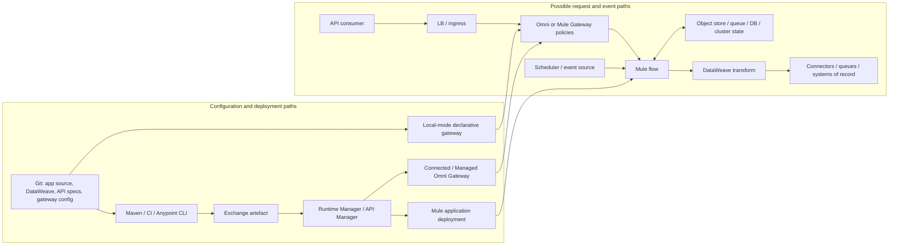

<!-- study-contract: principal -->

# MuleSoft current-state baseline

| Field | Value |
|---|---|
| Artifact type | architecture-study |
| Decision question | What gateway, integration, state, substrate and entitlement functions does the current MuleSoft estate actually perform, and which migration lanes follow from that evidence? |
| Decision owner | Integration and API Modernization Steering Committee |
| Primary audiences | Executives, enterprise/integration architects, API and integration developers, platform/DevOps/SRE, security and operations teams |
| Scope | Mule Gateway, Managed/Self-managed Omni Gateway, Mule applications on CloudHub/CloudHub 2.0, Runtime Fabric, hybrid/standalone and Private Cloud Edition boundaries |
| Evidence state | Documented (`E1`) product mechanics; the organization-specific estate and all execution/contract evidence are unknown |
| Reference case | [RE-1 enterprise reference case](41-enterprise-reference-case.md), synthetic and non-organizational |
| As-of date | 2026-08-17 |
| Next gate | Current-state evidence review after normalized inventory, journey traces, state/recovery evidence and E2 entitlement/support references exist |

## Provisional answer

**Evidence state:** platform mechanics are `E1 — current official documentation`; the actual estate, contracts, runtime versions, incidents, costs, owners, and migration complexity are `Unknown`. This repository contains no claim that the organization runs any particular MuleSoft variant and no executed inventory.

A MuleSoft estate cannot be represented as “an API gateway.” It can contain API policy enforcement, integration code, transformations, orchestration, schedules, queues, connector behavior, credentials, retries, idempotency, state, and operational automation. A gateway replacement can therefore leave most of the system untouched—or accidentally remove business processing—depending on what each deployable does.

The baseline must reconstruct four things for every production path:

1. the **consumer request or event path**;
2. the **configuration and deployment path**;
3. the **authoritative state and recovery path**; and
4. the **commercial/support entitlement path**.

## Bounded product and deployment archetypes for estate discovery

MuleSoft renamed Flex Gateway to **Omni Gateway** in release 1.13.0 in May 2026; MuleSoft states the initial change is cosmetic and does not change CLI/API/environment-variable names. See the [official release note](https://docs.mulesoft.com/release-notes/flex-gateway/flex-gateway-release-notes#_1_13_0). Existing assets and container/package names can therefore still say `flex-gateway`; inventory both names.

| Product/deployment archetype | Request/runtime owner | Configuration authority | Material boundary |
|---|---|---|---|
| Mule Gateway embedded in a Mule runtime application | Mule application runs proxy plus any flows/connectors/DataWeave/business logic on its deployment target | API Manager policies plus application source/deployment | Gateway and integration lifecycle can be coupled in one deployable |
| Managed Omni Gateway on CloudHub 2.0 | MuleSoft-managed hosted gateway replicas | Anypoint Runtime Manager/API Manager | Managed deployment, patching and HA; exact resource entitlement and endpoint model apply |
| Managed Omni Gateway on Runtime Fabric | Gateway is managed through Anypoint, but runs on the customer's Runtime Fabric/cluster boundary | Anypoint Runtime Manager/API Manager | “Managed gateway” does not make customer AKS/ingress/Runtime Fabric responsibilities disappear |
| Self-managed Omni Gateway — Connected Mode | Customer runs Linux/container/Kubernetes replicas | Anypoint control plane and, where supported, declarative configuration | Requires control-plane connectivity for centralized lifecycle/observability |
| Self-managed Omni Gateway — Local Mode | Customer runs and configures gateway locally | Versioned declarative files | Mostly disconnected, but documentation says it still connects for registration and usage metrics; it is not air-gapped |
| CloudHub 2.0 Mule applications | MuleSoft operates container platform; dedicated Mule replicas execute integration code | Runtime Manager/CI deployment plus application artefact | Shared or private space, region, replicas, load balancer, platform services, Object Store and networking semantics |
| Runtime Fabric Mule applications | Customer operates supported Kubernetes infrastructure; Runtime Fabric agent creates application resources | Anypoint control plane and Runtime Fabric agent | Shared responsibility for cluster, ingress, LB, logs, monitoring, network and upgrades |
| Hybrid standalone Mule runtime | Customer operates server/VM and Mule; optional Runtime Manager agent links cloud management | Runtime Manager or local deployment path | Customer owns HA/LB/patches; control-plane connection depends on chosen management mode |
| Fully standalone Mule runtime | Customer operates runtime without required cloud control connection | Local deployment/automation | Suitable for disconnected use, but platform services and management features differ |
| Anypoint Platform Private Cloud Edition | Customer hosts management/engagement platform and runtimes | Customer-operated PCE | Separate product, infrastructure and lifecycle; do not infer parity with SaaS control plane |

MuleSoft's [hosting overview](https://docs.mulesoft.com/hosting-home/) and [Runtime Manager deployment options](https://docs.mulesoft.com/runtime-manager/deployment-strategies) document these materially different boundaries. These rows are discovery archetypes, not assertions about the estate and not version-pinned options. Score or cost only exact deployed variants reconstructed from evidence.

### Gate-1 current-state option-resolution blockers

Resolve the following for every environment and deployable before assigning a migration lane, equivalence claim, complexity rating, support finding or target product. A product-family name or Anypoint screenshot is not a normalized estate row.

| Blocker | Required current-state evidence per deployed unit | Accountable evidence owner | Current disposition |
|---|---|---|---|
| MULE-OR-01 — product/runtime identity | Gateway/runtime product and mode, exact version/patch, Mule and Java versions, connector/module versions, container/package/JAR digest and release channel | Mule platform and application owners | `Gate-1 hold — estate unknown` |
| MULE-OR-02 — substrate identity | CloudHub generation/space/region/replicas, Runtime Fabric and Kubernetes/AKS versions, or server/VM/OS/cluster identity; ingress/LB/DNS/network path and failure domain | Infrastructure and network owners | `Gate-1 hold — estate unknown` |
| MULE-OR-03 — authority and entitlement | Anypoint organization/business-group/environment/API-instance IDs, deployment authority, API Manager policies, product/contract boundary, order-form metric, support tier and EOL evidence | Platform governance and procurement | `Gate-1 hold — E2/estate evidence required` |
| MULE-OR-04 — behavior and state | Source-to-deployed artefact mapping, flows/DataWeave/connectors, schedules, queues, Object Store/database/cache state, retry/idempotency/transaction semantics and backup/restore route | Application, integration and data owners | `Gate-1 hold — estate unknown` |
| MULE-OR-05 — trust and evidence | Identity, secrets and PKI authorities; certificate chains; egress/support access; logs, traces, analytics, masks, retention and audit export | Security, privacy and operations | `Gate-1 hold — estate unknown` |
| MULE-OR-06 — service and migration boundary | Workload owner/classification, consumer contract, SLO/RPO/RTO, traffic profile, dependencies, incident history, change window and RE-1 journey/failure mapping | Service owner and migration assurance | `Gate-1 hold — estate unknown` |

## Mechanism analysis: reconstruct paths before classifying the workload

**Figure MULE-B1 — A Mule API can be a policy edge, an integration application, or both.**

- **Depicted scope:** possible Git/build/Exchange/Runtime Manager/API Manager configuration paths and consumer/event runtime paths through Omni/Mule Gateway, Mule flow, DataWeave, connectors and state.
- **Excluded scope:** any claim that the organization uses every depicted component, exact estate topology, connector semantics, platform-service implementation and target migration design.
- **Diagram source, evidence state and as-of:** inline Mermaid synthesis from the cited official Mule/Omni deployment, DataWeave and policy mechanisms; `E1 documented` plus discovery hypothesis, no estate observation; 2026-08-17.
- **Accessible equivalent:** Git/build publishes an artefact through Exchange and Runtime/API Manager to a Mule app or connected/managed Gateway, while Local Mode reads Git-backed local config; consumers traverse edge → Gateway → Mule flow → DataWeave → connectors/systems and flows may read/write durable state; scheduled/event sources can enter the same flow. The following workload and state ledgers classify what must be preserved.

**Figure interpretation:** The exhibit shows why one inbound API can traverse gateway policy, Mule application code, DataWeave, connectors and durable state, while configuration arrives through several authorities. Replacing only the gateway can leave integration processing intact or sever it accidentally.

**Figure limitation:** This is a discovery model, not an observed estate topology or migration design; it does not assert that any deployable contains every component or that source, state and entitlement evidence is available.

MuleSoft documents DataWeave as a language embedded in Mule runtime for transforming event payloads in [DataWeave overview](https://docs.mulesoft.com/mule-runtime/latest/dataweave). API Manager policies enforce gateway concerns without application-code modification, but policy availability varies by API type and gateway; see [gateway policies in API Manager](https://docs.mulesoft.com/api-manager/latest/manage-policies-overview). These are different layers.

## Workload decomposition: the unit of migration

| Archetype | Observable behavior to preserve | Hidden dependencies to find | Plausible decomposition—not a recommendation |
|---|---|---|---|
| Pass-through API with standard policies | routing, TLS, auth, quota, errors, logs | product/app contract, certificate, DNS, header normalization | Reimplement on target gateway; retain backend |
| Policy-heavy API proxy | policy order, variables, cache, rate scope, custom policies | API Manager instance, automated policy, custom Java/XML, portal entitlements | Translate behavior through contract tests; syntax will differ |
| DataWeave transformation API | canonical mapping, null/type/date/error behavior, payload limits | modules, lookup data, schemas, locale/time zone | Keep transform service, rewrite it, or move transform deliberately—not as gateway configuration |
| Synchronous orchestration | call order, parallelism, timeout, retry, compensation, idempotency | connector pools, target credentials, partial-failure handling | Separate API edge from orchestration runtime only after semantics are proven |
| Asynchronous flow | delivery guarantee, ordering, retry, DLQ, replay, correlation | MQ/JMS/VM queue, transactions, ack mode, poison message path | Event/integration migration with stateful cutover; gateway replacement is insufficient |
| Scheduled/batch job | schedule, concurrency, watermark, catch-up, reconciliation | scheduler ownership, Object Store/DB watermark, file endpoints | Replatform as a workload with state and operational controls |
| Stateful consumer/session | tokens, object store, cache, cluster state | Object Store v2, persistence gateway, Hazelcast/cluster, external DB | State migration/dual-run required; stateless redeploy is unsafe |
| Connector-led integration | protocol semantics, pagination, throttling, connector retries | connector version, vendor API, certificates, drivers, custom extension | Assess connector replacement and support lifecycle independently |

MuleSoft's [reliability patterns](https://docs.mulesoft.com/mule-runtime/latest/reliability-patterns) distinguish transactional and non-transactional sources and explain why reliable acquisition can require queues/transactions. A flow's retry or queue behavior is business semantics, not incidental implementation.

## State and ownership ledger

Populate one row per deployable and per environment. “Not found” is evidence; blank is not.

| State or dependency | Candidate authority/location | Baseline evidence required | Migration risk if omitted |
|---|---|---|---|
| Application source and built JAR | Git, Exchange, artefact repository | source commit ↔ deployed digest mapping; build plugins/dependencies | Cannot reproduce or roll back deployable |
| API spec, API instance, products/contracts and policies | Exchange/API Manager | IDs, versions, policy order/config, automated policy scope, client applications | Consumer authorization or traffic control changes silently |
| DataWeave and custom modules | Mule project/shared libraries | complexity, tests, sample corpus, side effects, Java/module dependencies | “Simple transformation” becomes a rewrite defect source |
| Connector configuration | Mule app, secure properties, platform secrets | connector/version, endpoint, pooling, retry, credential/certificate owner | Backend behavior and support matrix lost |
| Object Store / persistence | Object Store v2, local/cluster store, Persistence Gateway, external DB | keys, TTL, size, consistency, backup/export, rate limits | idempotency, watermark, cache or workflow state resets |
| Queue/event state | Anypoint MQ, JMS, VM queues, broker, DLQ | depth, age, ack/transaction, replay, poison handling, ordering | message loss, duplication or out-of-order effects |
| Scheduler state | Runtime Manager or application scheduler | enabled state, time zone, overlap rule, watermark/catch-up | duplicate or missed business execution |
| Certificates/keys | secrets manager, runtime, API Manager, TLS context | chain, expiry, consumers, rotation runbook, private-key boundary | outage or broken trust during cutover |
| Runtime topology | CloudHub 2.0, Runtime Fabric, hybrid/standalone, PCE | target, region/space, replicas, runtime/Java/channel, ingress/LB/DNS | target design and lifecycle based on wrong substrate |
| Telemetry and audit | Anypoint services and/or external sinks | fields, masks, retention, alert, dashboards, trace correlation, export | loss of incident/compliance evidence |
| Entitlement and support | order form/support agreement, restricted store | non-sensitive reference, metric, renewal, EOL, support scope | technically valid target cannot be operated or purchased |

## Deployment-substrate consequences

### CloudHub 2.0

CloudHub 2.0 runs Mule applications in replicas behind platform load balancing. Shared spaces are multitenant; private spaces are isolated logical networks with VPN/transit, TLS contexts and firewall rules. MuleSoft documents round-robin distribution across multiple replicas and notes that rolling updates can still interrupt long in-flight requests in edge cases. See [CloudHub 2.0 architecture](https://docs.mulesoft.com/cloudhub-2/ch2-architecture) and [networking architecture](https://docs.mulesoft.com/cloudhub-2/ch2-networking-guide).

Baseline questions: shared or private space; region; replica count/size; clustering; static IP/DNS; last-mile TLS; ingress/egress rules; 15-second idle and long-request behavior; Object Store; platform-service dependency; rolling-update evidence; WAF/DDoS layer. Private spaces do not include a built-in WAF or Layer 7 DDoS protection according to the networking guide.

### Runtime Fabric

Runtime Fabric core services and the agent run on customer-managed AKS/EKS/GKE/OpenShift. The agent creates/updates Kubernetes resources for Mule apps. MuleSoft provides Runtime Fabric software and Mule images; the customer manages Kubernetes, ingress, external load balancing, log forwarding, monitoring, network/proxy/NAT, certificates and infrastructure. See the [Runtime Fabric shared-responsibility overview](https://docs.mulesoft.com/runtime-fabric/latest/).

Baseline questions: supported version, namespace/cluster topology, production separation, agent connectivity, eventual-consistency behavior, persistence gateway, replica placement, ingress controller, LB/TLS, image sources, runtime patch channel, Runtime Fabric upgrades, AKS upgrades, capacity, support seam.

### Hybrid or standalone runtimes

Customer-managed Mule servers need an explicit HA/load-balancing, patch, log, filesystem, shared-resource, cluster, backup and deployment model. Runtime Manager functionality differs by substrate; for example, the [deployment-option matrix](https://docs.mulesoft.com/runtime-manager/deployment-strategies) documents different logging, Object Store, scheduling, monitoring and security-update behavior. Do not use CloudHub behavior as the baseline for a standalone server.

### Omni Gateway

The [Omni Gateway overview](https://docs.mulesoft.com/gateway/latest/) establishes these current distinctions:

- Managed Omni Gateway runs on CloudHub 2.0 or Runtime Fabric and is configured through Anypoint.
- Self-managed Connected Mode is centrally managed/observed and requires control-plane connectivity.
- Local Mode uses local declarative configuration but still connects for registration and usage metrics; documentation explicitly says it is not air-gapped.
- Self-managed replicas can use external Redis for distributed rate-limit/cache state.
- Managed gateway configuration can be stored locally for faster/resilient startup, but contracts used by policies such as client-ID enforcement are downloaded from Anypoint at startup; see [managed HA and configuration storage](https://docs.mulesoft.com/gateway/latest/flex-architecture-managed-dr-ha).

These mechanics require separate partition, restart, scale-out, contract-download, Redis, and telemetry tests.

## Applying the enterprise reference case

Map each [RE-1](41-enterprise-reference-case.md) journey (J-01 through J-06) and failure (I-01 through I-08) end to end through the actual Mule estate:

RE-1 values are **scenario assumptions**, not facts about the current Mule estate. Use them to challenge unknown paths until actual sanitized workload, state, failure and operating evidence replaces them; do not report them as observed traffic or platform performance.

1. Consumer authentication may be a gateway policy, but token exchange or lookup can also be a Mule flow or connector.
2. Request transformation can be DataWeave before/after backend calls, not a portable edge mapping.
3. A synchronous write can contain retry, scatter-gather, transaction, queue handoff, idempotency or compensation that is invisible in an API catalog.
4. An asynchronous event can be acknowledged before downstream completion, with recovery state in a broker, Object Store, VM queue or database.
5. Audit and correlation fields can be constructed across policy, flow, connector and logging layers.
6. A scheduled reconciliation can be the true correctness control when the interactive API partially fails.

Draw the actual sequence from logs/configuration and have the service owner validate it. A code search alone cannot prove runtime branches, data-dependent routes, operator interventions, or business recovery.

## Baseline dataset and complexity measures

| Dimension | Required measures |
|---|---|
| Estate | business group/environment, API instances, apps, flows, subflows, connectors, policies, assets, runtime targets, owners |
| Traffic | calls/events, concurrency, payload distribution, latency percentiles, backend time, errors, retries, timeouts, long-lived connections |
| Change | deployment frequency, lead time, failed deployment, rollback, drift, manual step, environment promotion |
| Reliability | incidents, MTTR, message age/depth, DLQ/replay, scheduled catch-up, data reconciliation, dependency outages |
| Code | DataWeave modules/LOC/complex branches, connector operations, custom Java, shared domains/libraries, test coverage |
| State | Object Store keys/TTL, queues, transactions, idempotency stores, watermarks, caches, persistent volumes/databases |
| Security | policies, client apps/contracts, secrets, certificates, PII fields, masks, privileged connectors, audit trail |
| Lifecycle | Mule/Java/gateway/RTF/connector versions, release channel, EOL, patch lag, CVEs, upgrade blockers |
| People/TCO | run/build/support hours, on-call skills, partner dependency, platform/infra/network costs, restricted commercial references |

Do not publish sensitive inventory, private endpoints, credentials, raw payloads, named-person mappings, or contract values in this public repository. Store sanitized aggregates and evidence references.

## Failure modes to find in the existing estate

| Failure | Why a naive API inventory misses it | Evidence to collect |
|---|---|---|
| Mule replica/server restarts | in-memory queues/cache/watermarks or non-cluster-safe code can change behavior | controlled restart history, state store config, replay/duplicate evidence |
| Connector throttling or credential expiry | gateway health remains green while downstream calls fail | connector errors, retry policy, pool, secret/cert rotation |
| Partial orchestration failure | HTTP response can hide completed side effects in one system | step-level correlation, compensation, reconciliation and idempotency |
| Queue backlog/poison message | API request may have returned before async failure | broker depth/age, DLQ, retry, ownership and replay runbook |
| Control-plane outage | running app/gateway, deployment, policy update, contract download and observability fail differently | per-variant partition/restart/change timeline |
| Object Store or persistence failure | idempotency, watermark, token/cache or scheduler coordination can reset | key inventory, failure mode, backup/export and recovery test |
| Runtime/Java/connector upgrade | compilation success does not prove transformation, protocol, timing or transaction parity | golden corpus, integration tests, load, rolling-update and rollback artifacts |
| Shared space/cluster saturation | unrelated applications can contend through substrate or shared dependencies | per-app and platform saturation evidence, isolation controls |

## Migration factory implications

1. **Classify before choosing the target.** Gateway-only, gateway-plus-transform, orchestration, asynchronous, scheduled, stateful and connector-led workloads need different migration lanes.
2. **Freeze the observable contract, not the implementation.** Capture requests/events, outputs, side effects, error/timeout/retry behavior, ordering, quotas, auth and telemetry with a sanitized golden corpus.
3. **Migrate consumers and live state deliberately.** API contracts, client credentials, product access, DNS, certificates, queue depth, Object Store, watermarks, schedules and in-flight work each need a cutover/rollback plan.
4. **Avoid dual execution for non-idempotent flows.** Mirroring a write or scheduled job can duplicate business effects. Shadow only safe reads or use a purpose-built comparison harness.
5. **Retire only after reconciliation.** A successful target health check does not prove all queued events, partial transactions, schedules, audit data and consumers have moved.
6. **Keep the source baseline as the cost/risk/function to beat.** A lower license cost with more bespoke integration code, weaker replay, or greater on-call burden is not a successful migration.

## Entitlement and support caveats

- Feature availability depends on exact gateway, API type, deployment target, runtime version, release channel, and purchased package. The official policy pages instruct readers to consult per-gateway availability rather than assuming parity.
- Runtime Fabric monitoring and some autoscaling capabilities are documented as package/select-customer dependent. Managed Omni Gateway requires allocated gateway resources in the relevant business group. These are flags to inspect the contract, not licensing conclusions.
- Managed and self-managed Omni gateways have different patch/upgrade behavior. MuleSoft documents automatic managed upgrades/patches and customer-driven self-managed upgrades in the [Omni Gateway lifecycle](https://docs.mulesoft.com/gateway/latest/flex-gateway-version-lifecycle).
- Exact prices, support response, end-of-support exceptions, connector entitlements, partner services, and exit help remain `E2 required`; none are inferred here.

## Counter-hypotheses and non-fit conditions

| Hypothesis to challenge | Counter-evidence already visible in the product model | Falsifier / non-fit implication for the baseline |
|---|---|---|
| “The incumbent is only an API gateway.” | Mule applications can include DataWeave, connectors, orchestration, schedules, queues and coordination state behind gateway policy | Journey trace finds executable integration/business logic or durable state; a gateway-only replacement lane is invalid for that deployable |
| “Every Mule workload is a monolith requiring rewrite.” | Omni Gateway and some API Manager uses can be policy/routing-only, and workloads can be decomposed by archetype | MULE-P01/P02 show no transforms/connectors/state beyond portable gateway intent; route the asset to a gateway lane rather than an integration rewrite |
| “Source/config export fully describes running behavior.” | Runtime drift, external connector state, manual recovery, platform services and in-flight work may not be represented | Owner-validated runtime trace differs from source/export or cannot account for side effects/recovery; baseline remains incomplete |
| “A successful pilot establishes factory velocity.” | Archetypes, substrates, connectors, state and failure semantics differ materially | Any populated lane lacks a representative proof or variance is too wide for a common estimate; keep wave commitments blocked |
| “Incumbency proves support, cost or operational fitness.” | Exact variants, packages, upgrade clocks, staff toil and commercial evidence are not yet inventoried | E2/E4 evidence shows unacceptable lifecycle, support, recovery or cost—or remains unavailable for a mandatory decision |

A workload is a **non-fit for gateway-only migration** when it contains transforms, orchestration, durable/asynchronous state, scheduled work, connector-specific transactions or recovery semantics that the target gateway lane cannot preserve. Conversely, a workload is a non-fit for a wholesale rewrite assumption when evidence shows only gateway policy/routing. These symmetric exits prevent both under-scoping and unnecessary modernization; neither outcome selects a target platform.

## Decision implications

- Do not score or size “MuleSoft” as one product; inventory each exact gateway/runtime/deployment variant and version.
- Segment migration into gateway-only, transform, synchronous orchestration, asynchronous, scheduled/stateful and connector/custom-code lanes before estimating effort or selecting a target.
- Make live state, in-flight work, schedules, credentials, products/contracts, DNS/certificates, analytics and reconciliation explicit cutover objects.
- Preserve the observable business contract and side effects rather than translating DataWeave, Mule XML or policy syntax mechanically.
- Keep incumbent cost/function/risk unknown until sanitized inventory, run/change/incident and restricted commercial evidence is reviewed.

## Falsification and proof plan

| Proof ID | Procedure | Measure | Threshold | Evidence artifact | Independent reviewer |
|---|---|---|---|---|---|
| MULE-P01 | Export control-plane inventory, scan repositories/Exchange/deployments and reconcile with owners | coverage and source-to-running lineage | Every in-scope production deployable has variant/version/owner/source/digest/state classification or a recorded blocker | normalized inventory, reconciliation report and non-sensitive evidence references | Architecture assurance |
| MULE-P02 | Trace J-01 through J-05 through policies, flows, DataWeave, connectors and state | ordered steps, retries, side effects, idempotency, recovery and audit | Service owner confirms the trace and every committed side effect/recovery path is accounted for | sanitized sequence, config/source references, runtime correlation and owner review | Business service/control owner |
| MULE-P03 | Execute J-06/I-02 through connected/managed gateway and Runtime Fabric/control paths present in the estate | deployed/config version, restart/scale behavior, eventual consistency and reconciliation | Meets approved change/outage objective; no stale/unapproved runtime accepts traffic beyond policy | version manifests, deployment/events, request and config timeline | SRE/change assurance |
| MULE-P04 | Rehearse one workload from each populated migration lane, including I-01 and I-06 through I-08 | contract equivalence, state/in-flight reconciliation, rollback/forward recovery | Mandatory behavior and state reconcile; no duplicate irreversible effect; rollback or forward-recovery condition demonstrated | golden corpus, state counts/watermarks, cutover and reconciliation bundle | Migration assurance and service owner |

No synthetic scenario value is an acceptance threshold. Owners must approve inventory scope, business correctness, outage and recovery thresholds before these proofs can pass.

## Falsification and exit criteria for the baseline

The baseline is not complete until another team can reproduce these answers without oral history:

- Which deployables are pure gateway, which contain integration logic, and which contain durable/coordination state?
- For each business journey, what executes, in what order, with which retry/idempotency/transaction/reconciliation semantics?
- What changes during control-plane, backend, broker, state-store, region, node and credential failures?
- Which exact runtime/gateway/deployment variants and versions are in service, and who patches/supports each layer?
- Which assets and state can be exported through supported interfaces, and which require recreation or semantic rewrite?
- What is the real annual run/change/incident burden and what restricted evidence supports it?

If those questions remain unanswered, any platform comparison against “MuleSoft” is structurally biased: it compares a documented target gateway with an unknown mixture of gateway, integration runtime and business application.

## Risks and limitations

- Official documentation establishes possible product behavior, not which variants, features, versions or entitlements the organization uses.
- Static analysis can miss data-dependent branches, manual recovery, runtime drift, external connector behavior, operator intervention and in-flight state.
- RE-1 is synthetic; a representative trace must be validated by owners and runtime evidence before migration planning.
- Commercial values, private topology, payloads, credentials, vulnerabilities and named-person ownership belong in restricted evidence; this public baseline can hold only sanitized conclusions/references.
- A successful workload pilot does not generalize across every archetype, deployment substrate, connector or state model.

## Open evidence requests

| Request | Owner role | Due gate | Decision impact if unresolved |
|---|---|---|---|
| Normalized estate/application/API/runtime inventory and deployed lineage | Mule platform owner and configuration management | Current-state evidence review | No migration scope, sizing or incumbent baseline |
| Journey-level behavior, side effects, state and recovery validation | Application/service owners | Workload classification gate | Workload remains in unknown/high-risk lane |
| Runtime/Java/connector/gateway/RTF lifecycle and upgrade blockers | Platform operations and security engineering | Operating-model gate | Support/security risk and sequence unknown |
| Entitlement, support, partner and run/change/incident cost references | Procurement, vendor manager and FinOps | Business-case gate | No TCO or commercial comparison |
| MULE-P01 through MULE-P04 evidence bundles | Modernization team with independent reviewers | Pilot evidence gate | No factory wave or retirement approval |

## Next gate

The Current-State Evidence Review may authorize workload-level target design only when MULE-P01 inventory coverage is accepted, RE-1 traces and state classifications are owner-validated, lifecycle and E2 commercial/support gaps are bounded, and each proposed migration lane has an independently reviewed proof plan. Unknown workloads remain out of wave commitments.
