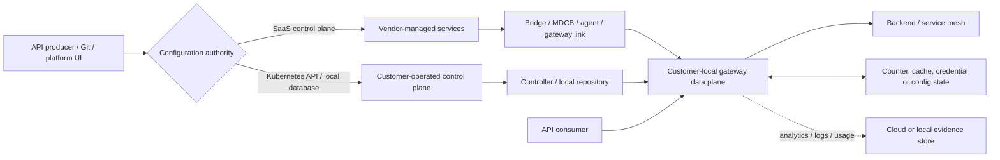

<!-- study-contract: principal -->

# Secondary products: screening dossiers

| Field | Value |
|---|---|
| Artifact type | candidate-dossier |
| Decision question | Which exact secondary-candidate variants, if any, justify full symmetric assessment because they plausibly clear every mandatory gate and test a distinct value/operating hypothesis? |
| Decision owner | API Platform Steering Committee |
| Primary audiences | Executives, procurement/vendor management, enterprise/security architects, platform/DevOps/SRE, developers and operations teams |
| Scope | Screening only: Gravitee self-hosted/managed/hybrid; Tyk self-managed/MDCB; NGINX Gateway Fabric with OSS/Plus; Istio ingress/gateway; Envoy Gateway |
| Evidence state | Official documentation screening (`E1`); all organization fit, E2 terms, E3 execution and E4 pilot results are unknown |
| Reference case | [RE-1 enterprise reference case](41-enterprise-reference-case.md), synthetic; screening uses only gate-relevant journeys/failures |
| As-of date | 2026-08-17 |
| Next gate | Secondary-candidate promotion review using a complete packet and no unknown mandatory gate |

## Provisional answer

**Evidence state:** `E1 — official documentation screening`, reviewed 2026-08-17. These products have not received full criterion mapping, vendor confirmation (`E2`), lab execution (`E3`), or pilot evidence (`E4`). They are **not ranked or scored here**.

The purpose of a secondary screen is to decide whether a named, purchasable/deployable variant warrants the same full assessment as a finalist. It is not a compressed product selection. A candidate advances only if it plausibly satisfies every mandatory gate and has a concrete reason to invest in deeper evidence: a unique requirement, a materially different operating/TCO hypothesis, or a finalist failure.

Products in scope:

- Gravitee API Management: self-hosted, Gravitee-managed, and hybrid/Cloud Gate patterns;
- Tyk: self-managed and multi-data-centre/hybrid patterns;
- F5 NGINX Gateway Fabric with NGINX Open Source or NGINX Plus data planes;
- Istio ingress/gateway patterns; and
- Envoy Gateway.

Istio and Envoy Gateway are screened as traffic/security platforms, not assumed to provide the full API product, consumer, portal, subscription, approval, monetization, and lifecycle surface of an API management platform.

## Scenario and assumptions

RE-1 supplies a synthetic enterprise challenge set. J-01 through J-05 test business/request and integration boundaries; J-06 and I-02 test configuration propagation and disconnected replicas; I-03 through I-08 test PKI, isolation, telemetry, regional consistency, schema evolution and rollback. All workload values are **scenario assumptions**, not organization observations or vendor benchmark evidence. This screening does not assign product performance or recovery thresholds.

## Common mechanism screen

**Figure SEC-S1 — A local gateway is only one part of an API-management proof.**

- **Depicted scope:** vendor-neutral screening model for authoring/configuration authority, cloud or local control, customer-local gateway request path, runtime state and evidence export.
- **Excluded scope:** exact vendor components, API-product/portal design, identity and edge implementation, supported version combinations and any feature, fit or promotion claim.
- **Diagram source, evidence state and as-of:** inline Mermaid interpretation synthesized from the official secondary-candidate architectures cited in this dossier; `E1 screening synthesis`, no observed product topology; 2026-08-17.
- **Accessible equivalent:** producer/Git/UI → one configuration authority → SaaS link or local controller → customer-local DP; consumer → DP → backend; DP reads/writes counter/cache/credential/config state and exports analytics/logs/usage. The seven questions and screening-gate table below provide the textual test for every path.

**Figure interpretation:** The generic exhibit forces every secondary candidate into the same request, configuration, runtime-state and evidence paths. It prevents a local data plane or standard API from being mistaken for a complete API management solution.

**Figure limitation:** This is a screening model, not a product architecture, feature finding or fit result; it deliberately omits vendor-specific components, adjacent systems and exact option/support boundaries developed below.

For every candidate, answer the same questions:

1. What exact object is authoritative: SaaS API, local database, Kubernetes Gateway API, vendor CRD, or declarative file?
2. How does a change reach each gateway, and what last-known configuration survives a partition and restart?
3. Where do API keys, OAuth clients/tokens, quotas, caches, products/subscriptions, audit and analytics live?
4. Which components are request-path dependencies versus change/telemetry dependencies?
5. Who patches and supports gateway, controller, database, Redis, Kubernetes, ingress/LB, identity and extensions?
6. Which capabilities require enterprise software, a cloud service, an add-on, or a particular edition? Obtain exact terms; do not infer them.
7. What is the export/exit unit for config, consumer identity, runtime state and history?

## Screening gates and promotion rule

| Gate | Paper evidence needed to remain in screen | Lab falsification if promoted |
|---|---|---|
| Required deployment locations | Officially supported exact runtime/control topology | Install exact version in each required platform and trace all egress |
| Payload/control-data residency | Official state/telemetry/control-flow map | Packet/flow inventory with representative policies and debug/logging |
| Disconnected operation | Documented running, restart, scale-out and change behavior | Isolate channels; restart/add replicas; change config; reconcile |
| API product/lifecycle | Exact producer/consumer/product/credential/version features | Execute onboarding, approval, credential rotation, deprecation and export |
| Security | Policy/extension support, secret/PKI ownership, audit | Golden policy suite plus rotation, failure and bypass tests |
| Kubernetes/Gateway API | Supported versions/conformance/extensions/RBAC topology | Upgrade CRDs/controller/data plane and test ownership/isolation |
| Reliability/DR | State inventory, HA/backup/restore procedure | Node/zone/region/state-store failure and clean restore |
| Operations/support | Lifecycle, supported combinations, responsibility boundary | Upgrade/rollback and cross-layer support exercise |
| Portability/exit | Export format/API and implementation-specific surface | Recreate on a neutral harness and account for live state/history |
| Commercial viability | `E2` quote/entitlement/support evidence in restricted store | Meter actual representative footprint; no public contract values |

An attractive demo cannot bypass an unknown mandatory gate.

## Gravitee API Management — screening dossier

### Bounded archetypes and mechanism

Gravitee documents three broad architecture schemes: fully self-hosted, hybrid, and Gravitee-managed. In self-hosted APIM, the customer operates Management API/Console, gateway, configuration repository and analytics repository. In hybrid, management UI/API and backing configuration/analytics services are in Gravitee Cloud while gateways run in the customer's environment. Current documentation also distinguishes classic bridge-based and newer Cloud Gate/token connection patterns; the exact contracted generation must be named rather than blended. See [APIM architecture](https://documentation.gravitee.io/apim/overview/readme/architecture) and the current [hybrid installation guides](https://documentation.gravitee.io/apim/hybrid-installation-and-configuration-guides).

| Path/state | Documented mechanism (`E1`) | Screening concern |
|---|---|---|
| Request | Consumer → APIM Gateway → policies → backend | Request stays on gateway path, but selected logging/analytics can leave the site |
| Configuration in classic hybrid | Gateway uses HTTP repository plugin → Bridge Gateway → control-plane repository | Bridge is an additional versioned/secured availability and compatibility seam |
| Configuration in current Cloud pattern | Hybrid gateway connects outbound over HTTPS/443 through Gravitee Cloud Gate using Cloud token/license | Establish cached-config behavior for partition, restart and clean scale-out |
| Gravitee-managed request and configuration | Gravitee operates the SaaS control plane and Gravitee Hosted Gateways; the customer selects documented provider/region combinations and configures APIs/backends | Establish exact region/network path, runtime version/upgrade control, autoscale/capacity boundary, data handling, evidence access, regional failure and provider/customer responsibility |
| Management state | API definitions, users, applications, plans/subscriptions in config database/control plane | Determine residency, backup, export and portal/identity continuity |
| Runtime counters/cache | Local Redis for synchronized rate limit/quota/spike-arrest counters and optional cache in documented hybrid design | Redis consistency, persistence, failure-open/closed and cross-site scope |
| Analytics/logs | Local Logstash path uploads to SaaS analytics/log storage in documented hybrid design | Data classification, buffering, loss/duplicate behavior, retention and region |

Official hybrid documentation describes a Bridge Gateway exposing HTTP services over repositories and publishes gateway/bridge compatibility tables; it also states a license file is required for the enterprise hybrid installation. See the [hybrid overview and component inventory](https://documentation.gravitee.io/apim/4.6/hybrid-deployment/overview). Current Cloud Gate guidance says gateway and control-plane versions must match for the documented next-generation link and requires a Cloud token/license key; see [linking a hybrid gateway](https://documentation.gravitee.io/apim/hybrid-installation-and-configuration-guides/next-gen-cloud/link-to-a-hybrid-gateway). Exact entitlement remains `E2 required`.

### Gravitee-managed boundary and Gate-1 disposition

Gravitee's current [Hosted Gateway guide](https://documentation.gravitee.io/gravitee-cloud/guides/gravitee-hosted-gateways) says Gravitee manages control-plane and Gateway operations, automatic configuration/scaling and patch upgrades, with customer-selected provider/region deployments dedicated by environment. That is `E1` product documentation, not evidence of the exact subscribed tier, private-backend connectivity, capacity, multi-region failover, data location, support response or recovery behavior.

The managed variant therefore remains **`Gate-1 hold — managed-service evidence incomplete`**. Promotion requires answers to the same questions applied to self-hosted/hybrid plus the service boundary:

| Managed-service question/failure | Evidence required before promotion |
|---|---|
| Hosted Gateway or selected region unavailable | Exact HA/failover mechanism, configured second-region behavior, edge/DNS ownership, capacity after loss and a provider/customer exercise; multiple selectable regions do not prove automatic failover |
| Control plane available but backend/private network path fails | Supported public/private connectivity for the exact cloud/region, routing/DNS/TLS responsibility and fault evidence |
| Autoscale, quota or noisy neighbour limit reached | Contracted/service limits, scaling signals/lag, isolation boundary, overload behavior and RE-1 I-04 result |
| Patch/feature upgrade changes policy behavior | Notification/control window, version visibility, rollback/exception path, golden policy contract and support escalation |
| Logs, analytics, debug or support data cross a boundary | Field-level data map, processing/location/retention/access/deletion terms and I-05 loss/export evidence |
| Control/portal/credential service disrupted or exit invoked | Backup/export coverage for APIs, applications, subscriptions, credentials, audit and analytics; independently reconstructed lifecycle |
| Cross-boundary incident | E2 SLA/remedy, severity, named escalation, forensic evidence access and RACI with no unowned action |

This hold is not a rejection. It prevents managed-service claims from inheriting evidence gathered for a customer-hosted Gateway, and vice versa.

### Why it could merit deeper evidence

- The documented product surface covers API producer/consumer management and both synchronous and event-driven API concerns, which may matter if asynchronous API governance is mandatory.
- It offers genuinely different self-hosted and hybrid state-placement choices rather than only a Kubernetes ingress controller.
- A local gateway plus local Redis can place request processing and selected counter state near workloads.

These are screening hypotheses, not comparative advantages.

### Counter-evidence, failure modes, and migration questions

| Proposition/failure | Counter-evidence or implication | Falsification test if promoted |
|---|---|---|
| “Hybrid keeps everything local.” | SaaS control plane holds management/analytics data in documented hybrid; gateway exports logs/metrics | Classify all Cloud Gate/analytics flows with representative logging and debug |
| “The gateway is autonomous when cloud is lost.” | Documentation establishes configuration links, not the full restart/scale/change envelope | Partition Cloud Gate/Bridge; restart and scale onto clean node; rotate API key; change policy; reconcile |
| Bridge/Cloud Gate unavailable | Existing config may behave differently from management changes and new replicas | Observe config age, request continuity, portal/subscription change and recovery |
| Redis unavailable/partitioned | Distributed counter/cache semantics can change security/commercial behavior | Run quota/rate/cache tests through latency, loss, failover and replica scale |
| Version mismatch | Bridge/gateway or cloud/gateway compatibility is explicit | Upgrade control and data components in both orders; prove rollback and policy parity |
| Exit | Gateway/API definitions alone may not include applications, subscriptions, keys, analytics and audit | Export/recreate the full product-consumer lifecycle without secret leakage |

**Promotion evidence still missing:** current exact-edition matrix; supported Kubernetes/databases; control-plane region and data terms; disconnected startup semantics; backup/restore; policy parity; support boundary; enterprise quote; workload footprint.

## Tyk — screening dossier

### Bounded archetypes and mechanism

Do not equate an open-source gateway process with the full Tyk management platform. The screening variants are customer-operated Tyk components and the distributed/Multi Data Center Bridge (MDCB) pattern; any Tyk Cloud topology must be documented and contracted separately.

Tyk's [MDCB architecture](https://tyk.io/docs/api-management/mdcb/) describes:

- a control plane containing Dashboard, a non-public control-plane Gateway, MDCB, Redis, and MongoDB or SQL, with optional Pump/Developer Portal;
- each data plane containing one or more Tyk Gateways plus a shared local Redis, with optional Hybrid Pump; and
- data-plane local caches intended to support validation/rate limiting and resilience during control-plane disconnection, with persistence recommended for independent operation.

| Path/state | Documented mechanism (`E1`) | Screening concern |
|---|---|---|
| Request | Consumer → load-balanced data-plane Tyk Gateways → backend | Exact policy/plugin path and local Redis dependency |
| Configuration/key synchronization | Dashboard/control Gateway → MDCB → data planes; local caches in secondary sites | Contract of cached data, invalidation, conflict and reconnect behavior |
| Control-plane state | Dashboard data in MongoDB/SQL plus Redis | HA, backup, restore, schema upgrade and customer operations |
| Data-plane state | Shared local Redis for gateways; persistence recommended for resilience | Scale/partition consistency and startup when control plane is absent |
| Analytics | Pump/Hybrid Pump exports analytics to selected sink | Backpressure, data sensitivity, retention and cross-site transfer |

### Why it could merit deeper evidence

- MDCB explicitly models distributed control and local data-plane caches rather than treating multi-site as multiple unrelated installs.
- Customer-operated components create a potential fully controlled state-residency pattern if exact edition/support and architecture meet requirements.
- Redis/MongoDB or SQL are familiar technologies to some platform teams, which may affect—but does not prove—operability or TCO.

### Counter-evidence, failure modes, and migration questions

| Proposition/failure | Counter-evidence or implication | Falsification test if promoted |
|---|---|---|
| “Data plane is independent.” | Documentation recommends persistent local Redis for independence; that persistence and restore are customer responsibilities | Lose MDCB and Redis separately; restart/scale; create/revoke key; update API; recover |
| “Simple gateway means simple platform.” | Full distributed control plane includes Dashboard, control Gateway, MDCB, Redis, persistent DB, optional Pumps/Portal | Install HA topology, patch/restore every stateful component, measure on-call work |
| MDCB/control DB fails | Change/key operations and data-plane synchronization can diverge from existing traffic | Exercise failover, stale cache, conflicting update, reconnect and audit |
| Redis partitions across gateway replicas | Authentication/rate-limit consistency may change | Run per-key global/local limits while scaling and partitioning Redis |
| Plugin/middleware portability | Custom middleware and vendor API definitions can bind behavior to runtime | Golden behavior suite plus config/plugin inventory and rebuild on target |
| Exit | APIs are only part of Dashboard DB/key/product/analytics state | Export/recreate APIs, policies, keys/certs, portal/product entities and required history |

**Promotion evidence still missing:** exact Cloud/self-managed/MDCB entitlement; supported platform/version matrix; air-gap or license-validation constraints; official upgrade/support policy; data model/export APIs; portal/product depth; DR procedures; security-policy coverage; actual resource footprint and quote.

## F5 NGINX Gateway Fabric / NGINX Plus — screening dossier

### Bounded archetypes and mechanism

NGINX Gateway Fabric (NGF) is a Kubernetes Gateway API implementation. Its control-plane pod watches Kubernetes Gateway API resources, provisions a corresponding data-plane Deployment/Service for each Gateway, translates resources to NGINX configuration, and sends configuration by gRPC to NGINX Agent in each data-plane pod. The data plane can use NGINX Open Source or NGINX Plus. See [NGF design](https://docs.nginx.com/nginx-gateway-fabric/) and [gateway architecture](https://docs.nginx.com/nginx-gateway-fabric/overview/gateway-architecture/).

| Path/state | Documented mechanism (`E1`) | Screening concern |
|---|---|---|
| Request | External LB/NodePort → NGINX data-plane pod → Kubernetes Service/backend | Cluster-local north-south path; multi-cluster/global entry is separate architecture |
| Configuration | Git/operator → Kubernetes API Gateway/Route/policy resources → NGF controller → gRPC/Agent → NGINX config files | Kubernetes API and controller are config authority; extension resources create implementation lock-in |
| Isolation | Each Gateway can have an independent NGINX Deployment/Service | Resource/failure isolation versus fleet footprint and policy consistency |
| State | Kubernetes objects plus any external service needed by policies/counters | Full product/subscription/key/analytics state is not inherent in Gateway API |
| Telemetry | NGF/NGINX metrics/logs and optional product telemetry | Enterprise observability pipeline and data handling remain customer design |

NGINX Plus is not merely a feature flag. Current [NGINX Plus installation documentation](https://docs.nginx.com/nginx-gateway-fabric/install/nginx-plus/) requires a subscription JWT for image access and runtime validation/reporting; connected environments report usage to F5, while offline environments route reporting through NGINX Instance Manager. Exact offline/support/entitlement terms require `E2` evidence. Open-source NGF product telemetry is documented as opt-out in [product telemetry](https://docs.nginx.com/nginx-gateway-fabric/overview/product-telemetry/); subscription usage reporting is a separate mechanism.

### Why it could merit deeper evidence

- Kubernetes Gateway API is the primary configuration model, giving an explicit role boundary among cluster operators and route owners.
- Per-Gateway data-plane deployments can provide clear runtime isolation.
- It may suit a Kubernetes-only gateway scope where a separate catalog/portal/product system is deliberately accepted.

### Counter-evidence, failure modes, and migration questions

| Proposition/failure | Counter-evidence or implication | Falsification test if promoted |
|---|---|---|
| “Gateway API makes it portable.” | Core resources are portable intent; NGF policies, snippets and Plus features are implementation-specific | Reconcile same standard resources on two implementations and inventory every extension |
| “NGINX is a complete API management replacement.” | NGF's documented goal is Gateway API-based load balancer/reverse proxy/API gateway; product/consumer/portal lifecycle is not established by that scope | Execute the enterprise producer/consumer journey and identify required adjacent systems |
| Controller fails | Existing NGINX config may continue while changes/new Gateways stall | Kill controller/Kubernetes API; restart data plane; change Route; scale; recover |
| Agent/config delivery fails | Pods can diverge in generated configuration | Compare config fingerprints/status conditions across replicas through failures |
| Plus JWT/reporting path fails | Runtime license/reporting requirement can affect offline design | Use vendor-approved offline design; isolate reporting; restart/reload; obtain `E2` result |
| CRD/Gateway API upgrade | Provider-managed and bundled CRDs can conflict or change semantics | Upgrade Kubernetes, Gateway API and NGF in supported order with rollback evidence |

**Promotion evidence still missing:** exact Gateway API conformance/extension set for mandatory controls; API product/credential/portal solution; global/multi-cluster design; Plus versus OSS feature and support boundaries; disconnected license behavior; release policy; quota-state architecture; support quote and operating model.

## Istio — screening dossier

### Exact scope and mechanism

Istio is a service mesh with sidecar and ambient data-plane modes plus standalone ingress/egress gateways. In sidecar mode, Envoy proxies mediate workload traffic; in ambient mode, node-level `ztunnel` provides L4 and optional waypoint proxies provide L7 processing. `istiod` supplies service discovery, configuration and certificates through xDS. Standalone ingress gateways are Envoy proxies at the mesh edge. See [Istio architecture](https://istio.io/latest/docs/ops/deployment/architecture/) and [ambient control plane](https://istio.io/latest/docs/ambient/architecture/control-plane/).

Istio supports its own Gateway/VirtualService APIs and Kubernetes Gateway API. Under the latter, Istio can automatically provision a Deployment and Service for each Gateway; Kubernetes Gateway API does not yet cover 100% of Istio's feature set. See [Istio Gateway API differences](https://istio.io/latest/docs/tasks/traffic-management/ingress/gateway-api/).

| Capability boundary | Istio screening observation (`E1`) | Required adjacent decision |
|---|---|---|
| North-south routing/TLS/security | Strong traffic-management and identity policy surface at ingress | WAF/DDoS, consumer products/keys, portal, approval, analytics and monetization are separate concerns |
| East-west mTLS/authorization | Native mesh role with workload identity and certificate issuance | Decide whether API management and mesh share or separate governance/failure domains |
| Configuration | Kubernetes/Istio APIs translated by `istiod` into xDS | GitOps, admission, multi-cluster sync, CRD lifecycle and emergency-change ownership |
| Runtime | Envoy ingress/sidecars or ambient ztunnel/waypoints | Capacity and blast radius differ sharply by mode; score exact mode |
| Multi-cluster | Multiple supported topologies, with mode-specific constraints | Trust, discovery, network, failover and config consistency need explicit design |

### Counter-evidence and falsification

- **“A mesh replaces API management.”** Falsify by running the full external developer/product/app/credential/version/deprecation/export journey, not only routing and JWT checks.
- **“One policy plane simplifies everything.”** A shared `istiod`/CRD/extension plane can couple ingress and service-to-service changes. Fail a bad global policy and prove blast-radius controls.
- **“Gateway API makes all Istio behavior portable.”** Inventory every Istio API and extension needed beyond standard Gateway API, then reproduce behavior on a second implementation.
- **“Ambient is operationally equivalent to sidecars.”** It has different L4/L7 placement and multi-cluster constraints. Run performance, identity, waypoint failure, node failure and upgrade tests for the chosen mode.
- **“Multicluster is solved.”** Current ambient multicluster documentation lists limitations including manual waypoint synchronization and gateway/service-scope constraints; see [ambient multicluster limitations](https://istio.io/latest/docs/ambient/install/multicluster/). Test the exact supported topology.

**Promotion evidence still missing:** external API product system; consumer identity/key lifecycle; portal/catalog; policy and Gateway API extension inventory; multi-cluster topology; upgrade/support model; capacity; operational ownership between mesh and API platform teams.

## Envoy Gateway — screening dossier

### Exact scope and mechanism

Envoy Gateway is an open-source Kubernetes Gateway API control plane that provisions/configures Envoy Proxy data planes through xDS. Standard Gateway API resources carry portable routing intent; implementation-specific resources such as `SecurityPolicy`, `BackendTrafficPolicy`, `ClientTrafficPolicy`, `EnvoyProxy`, and extension policies add authentication, authorization, traffic, observability, and extensibility. See [proxy/control-plane model](https://gateway.envoyproxy.io/docs/concepts/proxy/) and [Gateway API extensions](https://gateway.envoyproxy.io/docs/concepts/gateway_api_extensions/).

| Path/state | Documented mechanism (`E1`) | Screening concern |
|---|---|---|
| Request | LB/Service → Envoy Proxy → backend | Kubernetes-centric runtime; external/global edge remains architecture work |
| Configuration | Gateway API + Envoy Gateway CRDs → controller → xDS → Envoy | Controller/Kubernetes API availability and per-proxy config consistency |
| Tenant isolation | Standard controller namespace or Gateway Namespace Mode | Namespace mode adds cross-namespace RBAC and is incompatible with some deployment combinations |
| Global rate limit | Envoy calls an external rate-limit service backed commonly by Redis | Redis/service latency and availability become request-path dependencies; local limits have per-replica semantics |
| Authorization | `SecurityPolicy` can invoke external HTTP/gRPC authorization or validate other credentials | External auth failure/open/closed and identity lifecycle are separate services |
| API product state | Not inherent in Gateway API/Envoy Gateway scope | Consumer app, subscription, credential issuance, portal and analytics need adjacent products |

The [rate-limiting model](https://gateway.envoyproxy.io/docs/concepts/rate-limiting/) makes a valuable mechanism distinction: local limits are independent per Envoy instance, while global limits call an external rate-limit service and datastore. This must be part of security and availability testing, not represented by one “rate limiting: yes” cell.

### Lifecycle, counter-evidence, and falsification

Envoy Gateway publishes a [compatibility matrix](https://gateway.envoyproxy.io/news/releases/matrix/) coupling Envoy Gateway, Envoy Proxy, Gateway API, rate-limit component and Kubernetes versions, and a [release policy](https://gateway.envoyproxy.io/news/releases/) with time-bounded minor support. The operational product is the supported combination.

- **“Open source means no entitlement dependency.”** It removes a proprietary runtime license assumption, but production support, adjacent product systems, staff, and extension services remain explicit choices. Obtain `E2` support evidence if required.
- **“Gateway API means no lock-in.”** Falsify by counting and recreating every Envoy Gateway CRD/policy/filter on another implementation.
- **“Global rate limiting is built in.”** The controller can deploy/manage a rate-limit service, but shared enforcement still depends on that service and its datastore. Partition and saturate it; inspect fail behavior.
- **“The gateway is a full API platform.”** Execute producer/consumer onboarding, product entitlement, key rotation, deprecation, analytics and export; record adjacent systems and ownership.
- **Controller/xDS failure:** stop controller and disrupt xDS while restarting/scaling proxies and changing Routes; record last-known config and divergence.
- **Upgrade failure:** upgrade Kubernetes/Gateway API/controller/proxy/extensions through the published matrix, including CRD ownership and rollback.

**Promotion evidence still missing:** mandatory feature coverage with exact stable release; API product/portal/consumer design; multi-cluster/global routing; state-store and external-auth HA; enterprise support option; extension governance; operational resource footprint.

## Cross-candidate screening result

| Candidate variant | Full API product lifecycle established at `E1`? | Workload-local request path established at `E1`? | Main stateful/customer-operated surface | Current disposition |
|---|---|---|---|---|
| Gravitee self-hosted/hybrid | Plausible; exact edition and journey need validation | Yes for self-hosted gateway | Config/analytics repositories in self-hosted; local Redis; Bridge/Cloud link in hybrid | `Screening — unknown gates` |
| Gravitee managed/Hosted Gateway | Plausible; exact subscribed service and journey need validation | Vendor-hosted in selected documented cloud/region; locality policy unproven | Gravitee-operated CP/DP; customer edge/backend/identity/evidence seams; service limits and data boundary unknown | `Gate-1 hold — managed-service evidence incomplete` |
| Tyk self-managed/MDCB | Plausible; exact edition and journey need validation | Yes | Redis at control/data planes; MongoDB/SQL; MDCB; optional analytics sinks | `Screening — unknown gates` |
| NGF with OSS/Plus | Not established as a complete lifecycle platform | Yes, Kubernetes clusters | Kubernetes API/CRDs; optional external policy state; Plus license/reporting path | `Screening — adjacent product required` |
| Istio ingress/gateway | No; service-mesh and traffic scope | Yes, mesh/cluster edge | Kubernetes/Istio config, CA/identity, optional extensions | `Screening — adjacent product required` |
| Envoy Gateway | No; gateway/control-plane scope | Yes, Kubernetes clusters | Kubernetes/CRDs, external rate limit/Redis and auth services | `Screening — adjacent product required` |

This table is not a ranking. “Plausible” and “established” refer only to documented product scope, not to requirement satisfaction. All candidates remain unknown against the repository's mandatory gates until the evidence ledger is populated.

## Decision implications

- Keep every row at screening status; no secondary product receives a score or “fallback” designation from official documentation alone.
- Gravitee self-hosted/hybrid and Tyk warrant product-lifecycle evidence requests because their documented scope plausibly includes management/product capabilities, but exact editions and state/partition behavior remain unknown. Gravitee managed remains separately held at Gate 1 until service-boundary evidence is complete.
- NGINX Gateway Fabric, Istio and Envoy Gateway require an explicit adjacent-system architecture for product, consumer, credential, portal, analytics and governance journeys before they can be compared to full API management variants.
- Standard Gateway API intent does not eliminate implementation-specific policies, extensions, state services, upgrade matrices or support choices; track both portable and non-portable surfaces.
- Promote only an exact version/edition/topology with a unique hypothesis and no unknown mandatory paper gate.

## Falsification and proof plan

| Proof ID | Procedure | Measure | Threshold | Evidence artifact | Independent reviewer |
|---|---|---|---|---|---|
| SEC-P01 | Complete mandatory-gate mapping for exact edition/version/topology with point-of-use primary sources and E2 terms | gate coverage and number of unknown/failed mandatory gates | Zero unknown or failed mandatory paper gates; otherwise do not promote | dated promotion packet and restricted E2 reference index | Architecture assurance and procurement |
| SEC-P02 | Execute RE-1 producer/consumer lifecycle from publish through credential rotation, deprecation and export, including adjacent systems | journey completeness, manual seams, audit and export gaps | Every mandatory lifecycle step has an accountable mechanism and evidence path; no hidden unowned adjacent service | journey trace, object/state inventory and export gap report | Developer-platform and identity reviewers |
| SEC-P03 | Partition control/config/telemetry and state services; restart/add replicas and reconcile J-06/I-02/I-05 | request/change behavior, config/state fingerprint, loss/duplicates and recovery | Meets owner-approved outage/freshness/evidence objectives; no silent fail-open or unapproved stale runtime | topology/version manifest, request/state/event timeline | SRE and security reviewers |
| SEC-P04 | Upgrade the full supported combination and reproduce standard plus extension configuration on a second implementation where portability is claimed | contract diff, unsupported extensions, maintenance/rollback and exit completeness | Mandatory behavior remains equivalent; every non-portable extension has an accepted replacement/retirement plan | golden results, extension inventory, upgrade and recreation bundle | Change and migration assurance leads |

The proof thresholds are approval-dependent. No RE-1 scenario assumption is promoted to a product acceptance threshold, and no planned exercise is an observed result.

## Promotion packet

Before any secondary candidate enters a full PoC, create a dated packet containing:

1. exact product, edition, topology, version and supported platform combination;
2. primary-source architecture/state/data-flow diagram;
3. mapping to all mandatory criteria with explicit unknowns;
4. full API product/consumer lifecycle, including any adjacent systems;
5. partition/restart/scale/change claim matrix;
6. lifecycle, support and entitlement evidence references;
7. exit/export scope for configuration, consumer identity, state, analytics and audit; and
8. the unique hypothesis that justifies the cost of full symmetric testing.

Without that packet, the candidate remains research—not a finalist and not a silent fallback.

## Risks and limitations

- Secondary coverage is intentionally screening-level and less deep than a promoted finalist PoC; absence of a documented feature is not proof that no edition or adjacent product provides it.
- Vendor documentation, release matrices, editions, licensing/reporting behavior, regions and support terms can change after the as-of date.
- Product-family labels conceal exact editions and operational components; this file does not establish any organization's contract, staffing, data policy or cost.
- RE-1 is synthetic, and Gateway API/service-mesh tests cannot establish API-product value without the producer/consumer lifecycle and adjacent systems.
- Open-source availability does not establish enterprise support, and commercial software documentation does not establish purchased entitlement.

## Proposed source-register additions

The screening claims above use the following official pages that are absent from `research/sources.csv` at the as-of date. The IDs are proposed so a later controlled register update can preserve point-of-use traceability; this screening dossier does not edit the shared CSV or imply promotion.

| Proposed ID | Candidate | Official source | Evidence scope |
|---|---|---|---|
| GRAV-001 | Gravitee | [APIM architecture](https://documentation.gravitee.io/apim/overview/readme/architecture) | Management, gateway, repository and analytics component boundary |
| GRAV-002 | Gravitee | [Hybrid deployment overview 4.6](https://documentation.gravitee.io/apim/4.6/hybrid-deployment/overview) | Hybrid control/data-plane relationship for the documented release |
| GRAV-003 | Gravitee | [Hybrid installation and configuration](https://documentation.gravitee.io/apim/hybrid-installation-and-configuration-guides) | Hybrid deployment/configuration paths and prerequisites |
| GRAV-004 | Gravitee | [Link a next-generation hybrid gateway](https://documentation.gravitee.io/apim/hybrid-installation-and-configuration-guides/next-gen-cloud/link-to-a-hybrid-gateway) | Cloud-to-hybrid gateway link mechanism |
| GRAV-005 | Gravitee | [Gravitee Hosted Gateways](https://documentation.gravitee.io/gravitee-cloud/guides/gravitee-hosted-gateways) | Managed/hosted runtime boundary, regions and service questions |
| TYK-001 | Tyk | [Multi Data Center Bridge](https://tyk.io/docs/api-management/mdcb) | Control/data-plane and state dependencies in MDCB topology |
| NGF-001 | NGINX Gateway Fabric | [Product documentation](https://docs.nginx.com/nginx-gateway-fabric) | Product/version scope and official documentation root |
| NGF-002 | NGINX Gateway Fabric | [Gateway architecture](https://docs.nginx.com/nginx-gateway-fabric/overview/gateway-architecture) | Controller, Kubernetes API and NGINX data-plane path |
| NGF-003 | NGINX Gateway Fabric | [Install with NGINX Plus](https://docs.nginx.com/nginx-gateway-fabric/install/nginx-plus) | OSS/Plus image, JWT and licensing/reporting boundary |
| NGF-004 | NGINX Gateway Fabric | [Product telemetry](https://docs.nginx.com/nginx-gateway-fabric/overview/product-telemetry) | Telemetry path and disablement/evidence questions |
| ISTIO-001 | Istio | [Deployment architecture](https://istio.io/latest/docs/ops/deployment/architecture) | Istiod/control plane, gateways and data-plane responsibility |
| ISTIO-002 | Istio | [Ambient control-plane architecture](https://istio.io/latest/docs/ambient/architecture/control-plane) | ztunnel/waypoint and ambient control mechanisms |
| ISTIO-003 | Istio | [Ambient multicluster installation](https://istio.io/latest/docs/ambient/install/multicluster) | Multi-cluster topology and cross-cluster dependency surface |
| ISTIO-004 | Istio | [Gateway API ingress task](https://istio.io/latest/docs/tasks/traffic-management/ingress/gateway-api) | Gateway API-driven ingress configuration path |
| EG-001 | Envoy Gateway | [Envoy Proxy deployment model](https://gateway.envoyproxy.io/docs/concepts/proxy) | Controller-managed proxy infrastructure and xDS path |
| EG-002 | Envoy Gateway | [Gateway API extensions](https://gateway.envoyproxy.io/docs/concepts/gateway_api_extensions) | Standard versus implementation-specific policy surface |
| EG-003 | Envoy Gateway | [Rate limiting](https://gateway.envoyproxy.io/docs/concepts/rate-limiting) | Local versus external global rate-limit state/dependency |
| EG-004 | Envoy Gateway | [Compatibility matrix](https://gateway.envoyproxy.io/news/releases/matrix) | Coupled Envoy Gateway/Proxy/Gateway API/Kubernetes versions |
| EG-005 | Envoy Gateway | [Release policy](https://gateway.envoyproxy.io/news/releases) | Supported release lines and lifecycle window |

## Open evidence requests

| Request | Owner role | Due gate | Decision impact if unresolved |
|---|---|---|---|
| Exact edition/version/topology and current support/entitlement statement per promoted candidate | Vendor manager and procurement | Promotion review | Candidate remains screening-only |
| Mandatory-gate map and required adjacent product architecture | Enterprise and security architecture | Promotion review | Candidate cannot enter symmetric PoC |
| Residency/egress/state/telemetry classification | Privacy, security and records management | Architecture evidence gate | Candidate fails to clear mandatory data gate |
| Named operating owner and lifecycle/support model for every component | Platform operations and SRE leadership | Operating-model gate | Candidate remains operationally unknown |
| SEC-P02 through SEC-P04 reproducible bundles if promoted | PoC team and independent reviewers | Candidate evidence gate | No scoring or finalist disposition |

## Next gate

The Secondary-Candidate Promotion Review may advance an exact candidate only when SEC-P01 shows no unknown/failed mandatory paper gate, the unique testable hypothesis is explicit, E2 entitlement/support evidence is referenced, adjacent systems are owned, and the steering committee funds the same RE-1 proof depth used for finalists. All others remain documented screening research.
