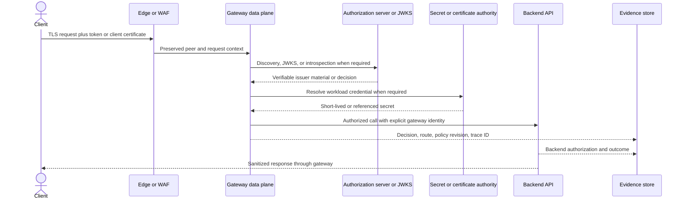

# Security comparison

<!-- study-contract: principal -->

| Study field | Value |
|---|---|
| Artifact type | comparative-study |
| Decision question | Which deployment archetype, once its unresolved option fields are fixed at Gate 1, can enforce mandatory API-security controls through normal, degraded, rotational and incident states with independently reconstructable evidence? |
| Decision owner | API Platform Steering Committee, with the security executive accountable for control acceptance and exceptions |
| Primary audiences | Executives, security and enterprise architects, platform engineering, developers, DevSecOps, SRE and audit |
| Scope | K-KON, K-SM, A-MGD, A-SHG, G-X, G-HYB and M-RTF as defined below; runtime policy, identity, PKI, secrets, isolation, audit and incident response |
| Evidence state | Documented E1 product mechanisms plus explicit interpretation and hypotheses; no observed E3 result or approved recommendation |
| Reference case | Synthetic RE-1, especially J-03, I-02 and I-03; every numeric input is a scenario assumption |
| As-of date | 2026-08-17 for volatile product and topology claims |
| Next gate | Security Architecture Review after exact entitlements are confirmed and the common negative/failure suite produces reviewable E3 artifacts |

## Provisional answer

The current evidence supports a **common mandatory security test profile**, not a vendor selection. Every archetype documents credible security mechanisms, but custody and failure semantics differ enough that a family-level pass would be misleading: managed variants transfer infrastructure controls, hybrid variants split authority and runtime, and self-managed variants transfer database, patch, PKI and forensic obligations to the enterprise. Confidence is medium for test design and low for enterprise fit. A wrong conclusion could preserve a revoked identity during isolation, expose a gateway workload identity through policy privilege, or leave the enterprise unable to prove a security decision after an incident.

## Decision question

Which **specific deployment variant** can enforce the organization's API-security control objectives during normal operation, dependency failure, credential rotation, configuration change, and incident response—and produce evidence strong enough for an independent reviewer to reconstruct what happened?

This is not a feature-count exercise. A gateway that can validate a JWT in a demonstration has not yet proved issuer isolation, algorithm constraints, stale-key behaviour, emergency revocation, least-privilege administration, or evidence completeness. Mandatory failures cannot be compensated by capabilities elsewhere.

## Deployment archetypes in scope

| ID | Bounded archetype assessed—not yet an exact option | Security boundary that must be proved |
|---|---|---|
| K-KON | Kong Konnect SaaS control plane with customer-operated Kong Gateway data planes on AKS and a second private Kubernetes environment | Kong operates the control plane; the enterprise operates runtime hosts, network, plugin deployment, workload identity, and downstream trust. CP/DP configuration and telemetry use outbound TCP 443 with mTLS. [Kong documents the Konnect network flows and telemetry content](https://developer.konghq.com/konnect-platform/network/). |
| K-SM | Self-managed Kong Gateway hybrid: enterprise-operated control-plane nodes and PostgreSQL, plus enterprise-operated data planes | The enterprise owns both plane security and the database, including CP availability, backups, patching, Admin API isolation, and CP/DP PKI. [Kong documents the hybrid roles and mTLS modes](https://developer.konghq.com/gateway/hybrid-mode/). |
| A-MGD | Azure API Management managed gateway in a production tier, privately connected to Azure-hosted backends | Microsoft operates the gateway service; the enterprise owns API policies, identity, network reachability, certificates, diagnostic export, and backend authorization. |
| A-SHG | Azure API Management self-hosted gateway on enterprise AKS, associated with an Azure API Management Developer or Premium instance | Microsoft operates the Azure management plane; the enterprise owns the container runtime, replicas, availability, network, local telemetry, persistent configuration backup, and gateway authentication. [Microsoft describes the supported authentication options](https://learn.microsoft.com/en-us/azure/api-management/self-hosted-gateway-authentication-options). |
| G-X | Apigee managed runtime instances in Google Cloud, with enterprise-controlled northbound and southbound connectivity | Google operates management and runtime infrastructure; the enterprise owns proxy/policy configuration, IAM, product/app credentials, load-balancer design, and backend trust. |
| G-HYB | Apigee hybrid 1.16 runtime plane on a supported enterprise Kubernetes platform, with Google-operated management plane | The enterprise owns ingress, runtime components, Cassandra, Kubernetes secrets or federated workload identity, key rotation, backups, and runtime patching. Google documents this split in the [hybrid architecture](https://docs.cloud.google.com/apigee/docs/hybrid/v1.16/what-is-hybrid). |
| M-RTF | MuleSoft Anypoint control plane with Mule Gateway/API Manager workloads on customer-managed Anypoint Runtime Fabric for Kubernetes | MuleSoft operates Anypoint control services; the enterprise owns Kubernetes, ingress, network, log forwarding, monitoring, and deployed Mule applications. The split is explicit in the [Runtime Fabric shared-responsibility model](https://docs.mulesoft.com/runtime-fabric/latest/). |

The managed and hybrid variants are separate candidates. Family-level statements hide materially different custody, failure, and support boundaries.

## Option resolution state—Gate 1 blocker

The rows above are **bounded archetypes**, not exact deployable options. Publication of this page is conditional: it may support E1 mechanism analysis and test design, but it may not support a criterion score, ranking, finalist recommendation or procurement decision until the applicable Gate-1 row is resolved in a versioned option contract. No version, tier, image, agent or entitlement is inferred here.

| Option ID | Unresolved option fields that must be fixed | Current resolution state | Gate-1 rule |
|---|---|---|---|
| K-KON | Konnect subscription/edition and control-plane region; Kong data-plane image/version; plugin set; portal, analytics and secrets entitlements; AKS/private-cluster versions; support tier | **Unresolved—E1 archetype only** | Block security scoring until one supported bill of materials and responsibility matrix are approved. |
| K-SM | Kong edition and CP/DP version set; PostgreSQL version/topology; plugins; Kubernetes/VM placement; backup/PKI design; support entitlement | **Unresolved—E1 archetype only** | Block security scoring until the self-managed lifecycle and support boundary are fixed. |
| A-MGD | APIM tier/generation; regions; network-injection/private-access mode; workspace applicability; portal/analytics features; support tier | **Unresolved—E1 archetype only** | Block security scoring because policy, identity and network capabilities vary by tier and topology. |
| A-SHG | Parent APIM tier; self-hosted-gateway image/digest and gateway type; AKS version; workspace/configuration endpoint; local backup/telemetry; support policy | **Unresolved—E1 archetype only** | Block security scoring until the cloud/local enforcement and support boundary are reproducible. |
| G-X | Organization/runtime regions; networking and data-location choices; proxy/product/analytics entitlements; support tier and release policy | **Unresolved—E1 archetype only** | Block security scoring until the managed-service boundary and contracted capability set are fixed. |
| G-HYB | Apigee hybrid release; supported Kubernetes distribution/version; Helm/operator/ingress/Cassandra set; identity/key method; analytics and support entitlements | **Unresolved—E1 archetype only** | Block security scoring until the whole supported runtime matrix—not only “1.16”—is frozen. |
| M-RTF | Anypoint edition/control-plane region; Runtime Fabric release/agent/Helm set; Kubernetes distribution; Mule runtime/gateway; policy, monitoring and portal entitlements; support tier | **Unresolved—E1 archetype only** | Block security scoring until control-plane, agent, runtime and licensed-policy scope are fixed. |

## Mechanism-level comparison

| Control mechanism | K-KON / K-SM | A-MGD / A-SHG | G-X / G-HYB | M-RTF | Evidence that decides the criterion |
|---|---|---|---|---|---|
| Client OAuth/OIDC | Kong's enterprise OIDC plugin can operate as a resource server or relying party and supports issuer/JWKS discovery caching; configuration must explicitly constrain issuer, audience, algorithms, claims, clock skew, and anonymous fallback. [OIDC plugin behaviour](https://developer.konghq.com/plugins/openid-connect/) | `validate-jwt` or `validate-azure-ad-token` runs in policy; Microsoft recommends validating issuer and audience at minimum. Client-side and backend-side authentication are separate decisions. [Authentication and authorization overview](https://learn.microsoft.com/en-us/azure/api-management/authentication-authorization-overview) | OAuth, VerifyAPIKey, JWT/JWS and related policies execute in proxy flows; shared flows can centralize enforcement, but attachment order and fault handling remain configuration risks. [Apigee security-policy guidance](https://docs.cloud.google.com/architecture/best-practices-securing-applications-and-apis-using-apigee) | OAuth/JWT policies attach to an API instance; an OAS/RAML declaration alone does not attach runtime enforcement. The JWT policy can validate audience, expiry, not-before and custom claims, but optional claims and algorithm settings must be tested. [OAuth prerequisites](https://docs.mulesoft.com/api-manager/latest/about-configure-api-for-oauth), [JWT policy](https://docs.mulesoft.com/mule-gateway/policies-included-jwt-validation) | Negative tokens: wrong issuer/audience/algorithm/key, expired/not-yet-valid, missing scope, replay, revoked client, malformed JOSE, JWKS timeout and key rollover. Capture runtime decision and configuration identity. |
| Client mTLS | Enterprise mTLS plugin validates a presented certificate against configured CAs and can map certificate identity to Consumers. SNI coverage changes certificate-request behaviour, so test shared-hostname side effects. [mTLS plugin mechanics](https://developer.konghq.com/plugins/mtls-auth/) | The gateway can validate client certificates; for a self-hosted custom domain, client-certificate negotiation is shared across configured hostnames and the client must present the certificate in the initial handshake. [Self-hosted custom domains](https://learn.microsoft.com/en-us/azure/api-management/api-management-howto-configure-custom-domain-gateway) | TLS virtual-host and keystore/truststore configuration protects ingress; proxy policy then binds certificate-derived identity to authorization. Hybrid makes certificate distribution and ingress integration an enterprise responsibility. | Inbound TLS/mTLS policy bindings protect an API instance, while Kubernetes ingress and certificate termination choices can move the peer-certificate boundary. [Inbound TLS policy](https://docs.mulesoft.com/gateway/latest/policies-included-tls) | Valid, expired, revoked, wrong-EKU, wrong-chain, missing-intermediate and wrong-tenant certificates; rotation with old/new overlap; proof of the component that actually terminated TLS. |
| Gateway-to-backend identity | Plugin/policy choice can use client certificates, OIDC token exchange or vault-resolved credentials. Avoid treating a forwarded caller token as a gateway workload identity. | Managed identity is available for selected backend flows; policy editors can indirectly use the gateway identity, so policy-write permission is a privileged trust path. Microsoft explicitly warns about token exfiltration through policy edits. [Managed-identity security considerations](https://learn.microsoft.com/en-us/azure/api-management/api-management-howto-use-managed-service-identity) | Service accounts can identify a deployed proxy for supported Google targets; target TLS and service-callout credentials remain proxy configuration. Hybrid service accounts can use Kubernetes Secrets, Vault, or Workload Identity Federation on GKE. [Hybrid service-account methods](https://docs.cloud.google.com/apigee/docs/hybrid/v1.16/sa-authentication-methods) | Mule application or gateway policy obtains/forwards backend credentials; Runtime Fabric and application secrets are separate operational domains. | Attempt privilege escalation through policy edits; verify token audience, identity per environment, egress restriction, backend authorization, credential non-exportability, and emergency disablement. |
| Secrets and key custody | Vault references can resolve values from supported external vaults or a Konnect Config Store, with TTL and failure-refresh semantics; edition and topology support vary. [Kong secrets management](https://developer.konghq.com/gateway/secrets-management/) | Named values and certificates can reference Key Vault. A network path, managed identity and rotation behaviour still have to be proved; an unversioned certificate reference is refreshed within a documented interval, not instantaneously. [Key Vault and managed identities](https://learn.microsoft.com/en-us/azure/api-management/api-management-howto-use-managed-service-identity) | G-X uses Google-managed services and configured encryption keys; G-HYB stores default runtime encryption keys in Kubernetes Secrets unless customer-managed keys are established at initial deployment. Changing hybrid encryption keys after data exists can make earlier data unreadable. [Hybrid data encryption](https://docs.cloud.google.com/apigee/docs/hybrid/v1.16/key-encryption.html) | Runtime Fabric activation creates Kubernetes Secrets for an mTLS certificate/CA and registry credentials; application-secret storage and rotation need separate evidence. [Runtime Fabric security architecture](https://docs.mulesoft.com/runtime-fabric/latest/security-architecture) | Rotate under load, deny vault access, expire a certificate, restart a cold pod, inspect declarative exports/logs/crash dumps, and prove secrets are absent. |
| Payload and resource protection | Request-size limiting, schema validation, bot/threat and rate-limiting plugins are composable; distributed counters may add Redis or another shared dependency. | Policy scopes can enforce size, content, schema and rate controls. A WAF remains a separate layer; Microsoft recommends one upstream for defence in depth. [API security options](https://learn.microsoft.com/en-us/azure/api-management/authentication-authorization-overview) | XML/JSON threat, message validation, spike arrest and quota policies execute in proxy flows. Custom code increases attack surface and must not silently bypass fault rules. | JSON/XML threat and traffic policies are available, but policy availability depends on gateway/runtime. MuleSoft notes that JSON Threat Protection is not a complete security layer and excludes SOAP and multipart forms. [JSON Threat Protection](https://docs.mulesoft.com/mule-gateway/policies-included-json-threat-protection) | Oversized headers/body, decompression bomb, deeply nested JSON/XML, invalid content type/schema, slow client, high concurrency, counter-store loss and bypass routes. Measure fail-open/closed and backend impact. |
| Administrative evidence | Konnect and self-managed audit paths differ; prove role scope, system-account attribution, immutable export and break-glass use. | Azure activity/resource logs and API Management diagnostics are different evidence streams; workspace/service scope must be preserved. | Google Cloud audit, Apigee audit/analytics and hybrid Kubernetes audit are different streams; correlate them rather than assuming one is complete. | Anypoint Audit Logging records platform actions and supports query/export, but product coverage, export entitlement, delivery duplication and retention must be validated. [Audit logging](https://docs.mulesoft.com/access-management/audit-logging) | Create/update/delete/revoke/approve actions by human and workload identities; rejected actions; vendor support access; clock alignment; export loss; tamper/retention controls. |

The request-path control chain should be demonstrable as one correlated transaction, not inferred from four dashboards.

**Figure SEC-1 — A security decision is reconstructable only across the complete trust chain.**

- **Depicted scope:** client and edge trust, gateway policy, authorization/key dependencies, backend workload identity, response path and security evidence export.
- **Excluded scope:** physical network placement, product-specific policy syntax, durable business idempotency, SIEM storage design and any claim that one candidate implements the sequence as drawn.
- **Diagram source, evidence state and as-of:** inline Mermaid synthesis by this study from the E1 mechanisms cited in the preceding comparison; RE-1 interpretation, no observed trace or product result; 2026-08-17.
- **Accessible equivalent:** read the sequence as Client → Edge → Gateway; the Gateway validates issuer material and resolves any required workload credential; it calls the backend with an explicit gateway identity; Gateway and backend emit correlated decision/outcome evidence. The preceding mechanism table gives the candidate-specific implementation and test questions for every step.

**Figure interpretation:** SEC-1 changes the security gate from “a token was validated” to “the reviewer can join client trust, effective policy revision, backend workload identity and outcome evidence for the same request.”

**Figure limitation:** The sequence defines a required evidence relationship, not a universal product flow or observed trace; remote issuer/vault calls may be cached or avoided, and the exact packet path remains part of NET-1 and the restricted flow matrix.

## Operational failure modes

| Failure mode | Unsafe implementation symptom | Required design and proof |
|---|---|---|
| Authorization server or JWKS unavailable | New keys fail unpredictably, every request blocks on the IdP, or stale keys are accepted indefinitely | Document cache TTL and stale-key policy; test cached-valid, newly rotated and revoked keys during outage; bound timeouts and show the resulting status code. |
| CA or leaf-certificate rollover | Partial fleet trusts only old or new chain; cold replicas cannot start; clients see intermittent TLS failures | Dual-trust overlap, inventory by SNI/route, staged rotation, synthetic probes from every client zone, rollback and expiry alert. |
| Vault/secret manager unreachable | Gateway fails open, holds an unbounded stale credential, or exhausts workers retrying | Define per-secret cache/failure semantics and maximum stale age; isolate retries; prove cold-start and steady-state behaviour. |
| Control-plane isolation | Existing traffic continues but revocation or emergency policy cannot reach runtimes | Establish last-known-good behaviour, configuration-age signal, maximum tolerated isolation, local kill mechanism if required, and reconciliation evidence. |
| Partial configuration rollout | Different replicas enforce different issuers, quotas or redaction | Promote immutable revision/hash, observe acceptance per runtime, stop on partial state, and test rollback without a second writer. |
| Rate-limit state-store failure | Limits reset or fail open, or all API traffic fails because a non-critical counter store is unavailable | Classify each limit as safety-critical or commercial; choose explicit fail behaviour; load-test degraded storage and recovery. |
| Audit/SIEM export disruption | Security control still runs but the organization cannot prove who changed it or why access was allowed | Buffer where supported, monitor lag/drops, preserve source audit, reconcile counts, and exercise a bounded evidence-recovery procedure. |
| Compromised policy editor | An administrator exfiltrates managed-identity tokens, disables checks, or logs secrets | Separate author/approver/deployer, lint dangerous constructs, constrain runtime identity, alert on policy change, and require emergency review. |

## Synthetic regulated-enterprise scenario—not observed evidence

This is the security slice of [RE-1, the enterprise reference case](41-enterprise-reference-case.md), centred on **J-03 partner payment initiation** and failures **I-02 control-plane disconnect/stale replica** and **I-03 certificate rollover/pinned CA**. It is a **fictional decision scenario**, not a customer case study, benchmark, penetration test, or product result.

**Scenario assumptions.** The geography, deployment footprint, authentication design, isolation window and evidence obligations below are decision inputs to be confirmed; none is an observed property of a product.

A regulated financial-services enterprise exposes a partner payment-initiation API from two Canadian regions. Partners use OAuth 2.0 client credentials with certificate-bound access tokens; the gateway also presents a distinct workload identity to the payment service. Personal and transaction payloads must remain in approved runtime zones. The enterprise runs AKS in Azure and a private Kubernetes platform in a data centre. A 30-minute control-plane isolation must not interrupt already-authorized traffic, but emergency consumer revocation must take effect within a steering-committee-defined threshold. All policy, credential, and approval changes must be reconstructable in the SIEM.

| Step | Same test for every archetype | Decision signal—not a presumed result |
|---|---|---|
| Establish trust | Configure exact issuer, audience, algorithms, scopes, certificate chain/EKU and backend identity | Can the configuration be expressed without custom code, and is every trust anchor identifiable? |
| Normal transaction | Send a valid partner request and correlate edge, gateway, IdP, backend and audit records | Is authorization attributable to a policy revision and consumer/app identity without recording secrets or payloads? |
| Negative matrix | Replay, wrong audience, downgraded algorithm, expired cert, missing scope, malformed JSON and oversized body | Does each case fail at the intended layer with a stable sanitized response and usable internal reason? |
| Dependency isolation | Block control-plane, IdP discovery, vault and telemetry paths independently | Which requests continue; how old can configuration/keys become; what evidence is lost or buffered? |
| Emergency revoke | Revoke one client and one gateway workload identity during isolation and after reconnection | Is the required revocation objective technically achievable, or does it require a local compensating control? |
| Rotation and recovery | Rotate partner CA, JWKS key, backend certificate and gateway-plane certificate under load | Are old/new overlap, cold restart, rollback and audit continuity deterministic? |

No candidate passes this scenario from documentation alone. Documentation defines the test; E3 lab artifacts and an E4 representative pilot decide it.

## Counterarguments and non-fit conditions

- **“A SaaS control plane is automatically less secure.”** Not necessarily. It may reduce control-plane patching and database exposure. It is a non-fit only when verified data categories, administrative jurisdiction, connectivity, vendor-access, recovery, or contract controls violate a mandatory requirement.
- **“Self-managed means full control.”** It also transfers database, certificate, patch, backup, privileged-access and forensic obligations. K-SM or G-HYB is a non-fit when the enterprise cannot operate those components to the required recovery and security objectives.
- **“Azure-native identity makes A-MGD the obvious answer.”** Managed identity can simplify Azure backend authentication, but policy-edit privilege, cross-cloud backends, workspace/variant capability and private-network dependencies remain decision points. A-SHG is not equivalent to the managed gateway.
- **“A richer policy catalog means stronger security.”** Richness can increase configuration variance and custom-code paths. G-X/G-HYB or M-RTF is a non-fit when controls cannot be reduced to governed, testable building blocks or when gateway and integration logic remain entangled.
- **“Gateway enforcement replaces backend authorization or a WAF.”** It does not. Object-level authorization usually needs domain data at the backend, and volumetric/edge controls have a different failure boundary.
- **“Last-known configuration solves disconnection.”** It preserves some runtime behaviour; it can also preserve a revoked or vulnerable state. The acceptable staleness and a local emergency control are business decisions.

## Risks and limitations

- Product statements above are **E1 official-documentation evidence**, reviewed 2026-08-17. They establish documented mechanisms, not enabled entitlements, contractual commitments, correct configuration, or behaviour in this enterprise.
- Plugin, policy, portal, workspace, telemetry and identity support varies by edition, service tier, gateway type, runtime version and topology. The exact bill of materials and licensed feature matrix remain required.
- Public documentation does not prove tenant-isolation implementation, vendor privileged-access procedures, full audit-event coverage, vulnerability-remediation SLA, cryptographic module certification, data-processing locations, or support access. Those require current contractual/security artifacts in the restricted evidence store.
- No latency, throughput, exploit resistance, recovery time, revocation time, log-loss rate or operational-effort result is claimed here.

## Decision implications and required next evidence

1. Treat OAuth/JWT, mTLS, backend identity, secrets, audit export, tenant isolation and incident revocation as independent mandatory gates.
2. Build one versioned security profile and compile it into each product's native constructs; do not loosen the profile to achieve superficial symmetry.
3. Run the synthetic scenario with identical negative inputs, fault windows and evidence requirements; record product/version/topology with every artifact.
4. Reject a variant if a mandatory control is unavailable, silently fails open, cannot be independently evidenced, or depends on an exception with no accountable owner and expiry.
5. Carry only the surviving variants into performance and operating-model comparison. Security equivalence is a precondition, not a weighted advantage.

## Falsification and proof plan

The provisional answer is falsified for a deployment variant if the same declared control cannot be enforced, attributed and recovered across normal, dependency-loss, rotation and stale-runtime states. Test fixtures, fault windows and acceptance thresholds are frozen before execution.

| Hypothesis to challenge | Symmetric procedure | Measure and acceptance threshold | Required artifact and reviewer | Decision impact |
|---|---|---|---|---|
| Native constructs can enforce the mandatory security profile without hidden bypass | Run the full valid/invalid OAuth, JOSE, mTLS, payload and route-bypass corpus through every variant | 100% of mandatory negative cases rejected at the intended trust boundary; zero requests reach the protected backend; stable safe external reason and attributable internal reason | Signed fixture set, gateway/backend traces, effective policy hash; security architecture review | Any unexplained accept, backend hit or policy ambiguity is a mandatory-gate failure until remediated and rerun. |
| Revocation and rotation are bounded in connected and isolated states | Rotate JWKS, partner CA and backend identity; revoke consumer and workload identities before, during and after I-02 isolation, including a cold replica | Meets the pre-approved J-03 revocation/overlap objectives in every declared state; zero unaccounted active old credentials after closure | Timestamped PKI/IdP events, per-runtime config identity, synthetic results; IAM and SRE review | If the objective needs a local compensating control, its owner/cost becomes part of the variant; if no sustainable control exists, exclude it. |
| Secrets remain referenced and evidence remains safe | Deny secret-store access, inspect exports/logs/traces/crash/support artifacts and exercise break-glass administration | Zero prohibited secret/token/payload occurrences in the searched corpus; every privileged change has actor, approval or break-glass reason, target and outcome | Secret-scan report, audit export/count reconciliation, restricted artifact IDs; security operations review | Leakage or unattributed privilege use blocks progression and triggers credential revocation plus evidence purge/retest. |
| Evidence survives partial rollout and export disruption | Deploy one approved and one deliberately incompatible policy revision; throttle SIEM export and restore it | Every serving runtime exposes exactly one approved effective revision; zero false-complete runtimes; source/export counts reconcile within the pre-approved duplicate/loss rule | Release manifest, runtime inventory, audit/SIEM reconciliation; platform risk review | Partial or irreconcilable state requires containment/recovery redesign before the candidate can be scored. |

## Open evidence requests

| Evidence request | Owner role | Due gate | Decision impact if absent |
|---|---|---|---|
| Contracted edition/region feature matrix for OIDC, mTLS, vaults, audit export, hybrid/self-hosted variants and support lifecycle | Vendor technical lead + procurement | Before E3 design freeze | Capability stays unknown; no parity score or mandatory-control pass. |
| Security assurance package covering data processing, privileged support access, vulnerability/remediation terms, cryptographic assurances and audit-event coverage | Vendor security + enterprise third-party risk | Before shortlist | Unresolved mandatory assurance item can remove the deployment variant regardless of functional test success. |
| Enterprise-approved issuer/audience/algorithm, PKI, revocation, secret-cache and fail-open/closed decisions for J-03 | IAM, PKI and security architecture | Before E3 execution | Test cannot produce an auditable pass/fail result; findings remain design questions. |
| E3 lab artifacts for negative cases, I-02/I-03, cold restart, partial rollout and audit recovery | Platform engineering + independent security tester | Before recommendation | Documentation remains E1 only; no candidate advances on security equivalence. |

## Next gate

The next gate is an **E3 security design-and-test readiness review** chaired by security architecture with IAM, PKI, SRE, platform engineering, risk and product representation. It passes only when the exact variant/version/topology is frozen, every mandatory control has an owner and fixture, all scenario thresholds are approved, the restricted evidence store is ready, and unresolved E1/E2 gaps have an explicit disposition. The review authorizes testing; it does not select a vendor.

Related repository controls: [assessment methodology](03-assessment-methodology.md), [hybrid and multicloud comparison](27-hybrid-multicloud-comparison.md), [observability comparison](31-observability-comparison.md), [security architecture](../architecture/security-architecture.md), and [PoC security tests](../poc/security-tests.md).
