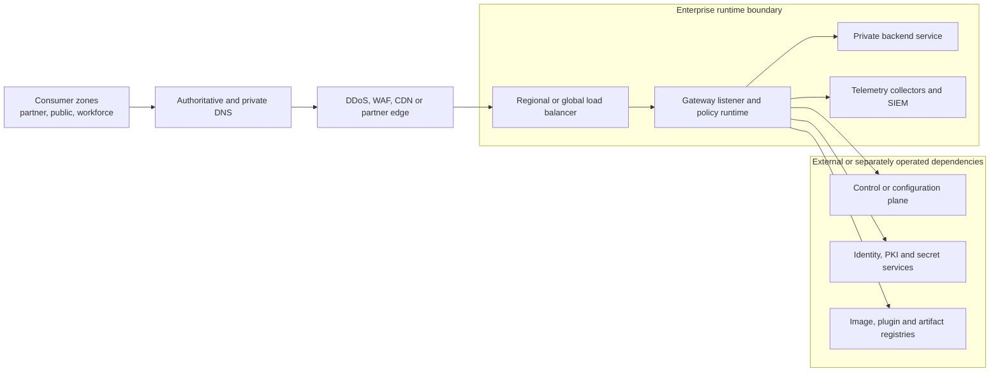

# Networking comparison

<!-- study-contract: principal -->

| Study field | Value |
|---|---|
| Artifact type | comparative-study |
| Decision question | Which complete gateway packet path meets private reachability, protocol, failure and operating requirements without unowned routes, unstable allow-lists or hidden translation? |
| Decision owner | API Platform Steering Committee, with enterprise network architecture accountable for the physical design gate |
| Primary audiences | Executives, enterprise/network/security architects, platform engineering, SRE, developers and DevOps |
| Scope | K-KON, K-SM, A-MGD, A-SHG, G-X, G-HYB and M-RTF; northbound, southbound, control, identity, artifact and telemetry paths |
| Evidence state | Documented E1 mechanisms and interpreted failure hypotheses; no packet-path observation, performance result or approved physical design |
| Reference case | Synthetic RE-1, especially J-03, I-03 and I-06; every count, duration and capacity input is a scenario assumption |
| As-of date | 2026-08-17 for volatile ports, endpoints and network capabilities |
| Next gate | Network Architecture Review after candidate-specific flow matrices and E3 packet-path/failure artifacts are complete |

## Provisional answer

No topology is yet shown to fit the enterprise network. The useful conclusion at E1 is that managed, SaaS-controlled and self-managed options move complexity rather than remove it: workload-local runtimes shorten some backend paths but add control/registry/telemetry egress; managed runtimes reduce cluster networking but can add cross-cloud distance and provider-specific private connectivity. Confidence is medium in the dependency model and low in physical fit. Selecting from vendor diagrams could produce an architecture that passes health checks while failing under split DNS, SNAT pressure, long-lived protocols or regional failover.

## Decision question

Which gateway topology, once its unresolved product and network fields are fixed at Gate 1, can carry north–south API traffic, reach private backends, synchronize control state, and export evidence across the enterprise's real network boundaries **without introducing an unowned transitive route, unstable allow-list, silent address translation, or failure mode that violates the API SLO**?

A product diagram is not a deployable network design. The decision unit is a complete packet path—including DNS authority, edge, load balancer, gateway listener, SNAT, firewall, private connection, backend, control/configuration link, telemetry, identity, PKI, image registry and vendor-support path.

## Deployment archetypes in scope

| ID | Bounded network archetype—not yet an exact option | Plane and traffic placement |
|---|---|---|
| K-KON | Konnect regional SaaS control plane; customer-operated Kong data planes in AKS and private Kubernetes | Client and backend traffic remain at each data plane; configuration and telemetry traverse outbound TCP 443 with mTLS to region-specific Konnect endpoints. [Konnect networking](https://developer.konghq.com/konnect-platform/network/) |
| K-SM | Enterprise-operated Kong hybrid control plane plus PostgreSQL in a protected services network; data planes in workload zones | Enterprise routes CP/DP configuration and telemetry—normally 8005/8006 unless deliberately fronted—alongside Admin API, database, backup and support paths. [Self-managed hybrid networking](https://developer.konghq.com/gateway/hybrid-mode/) |
| A-MGD | Azure API Management managed gateway with internal/private Azure networking and private backend reachability | API traffic enters an Azure-managed runtime; enterprise DNS, edge and private-network design bridge consumers and backend networks. Network dependencies vary by tier and injection/integration mode. [Internal VNet deployment guidance](https://learn.microsoft.com/en-us/azure/api-management/api-management-using-with-internal-vnet) |
| A-SHG | Azure API Management self-hosted gateway replicas on AKS, associated with a cloud API Management instance, with persistent local configuration backup | Client/backend traffic is local to AKS; each gateway makes outbound TCP 443 connections for configuration, status and optional telemetry. [Self-hosted gateway connectivity](https://learn.microsoft.com/en-us/azure/api-management/self-hosted-gateway-overview) |
| G-X | Google-operated Apigee managed runtime instances; enterprise external/internal load balancers and Private Service Connect (PSC) for northbound/southbound private paths | Google operates runtime networking behind service attachments; the enterprise owns load-balancer, PSC endpoint, DNS and backend service-attachment design. [Apigee architecture with PSC](https://docs.cloud.google.com/apigee/docs/api-platform/architecture/overview) |
| G-HYB | Apigee hybrid 1.16 on supported customer Kubernetes; enterprise ingress plus outbound Google management/analytics paths | Client/backend traffic remains in the runtime network; Synchronizer, UDCA, Connect and metrics have distinct Google endpoints and purposes. [Hybrid secure-port matrix](https://docs.cloud.google.com/apigee/docs/hybrid/v1.16/ports.html) |
| M-RTF | Mule Gateway/API workloads on customer Kubernetes Runtime Fabric with Anypoint SaaS control services | Customer owns ingress, external load balancing, NAT, proxies and cluster networking; runtime nodes require documented HTTPS, AMQP-over-WebSocket, asset, registry and monitoring egress. [Runtime Fabric network requirements](https://docs.mulesoft.com/runtime-fabric/2.9/install-self-managed-network-configuration) |

## Option resolution state—Gate 1 blocker

These are bounded packet-path hypotheses, not exact deployable options. This study may remain published as conditional E1 analysis, but it cannot support scoring, ranking, firewall approval or a finalist recommendation until a versioned option contract and restricted flow matrix resolve the fields below. The study does not invent missing tiers, regions, images, agents, endpoints or support terms.

| Option ID | Unresolved option and network fields | Current resolution state | Gate-1 rule |
|---|---|---|---|
| K-KON | Konnect subscription/region; DP image/version and plugins; AKS/private-cluster versions; proxy/TLS model; region-specific FQDNs; portal/telemetry paths; support tier | **Unresolved—E1 archetype only** | Block network scoring until every external and private flow is versioned and owned. |
| K-SM | Kong/CP/DP/PostgreSQL versions and zones; Admin/Status exposure; CP/DP port/fronting choice; backup/support paths; Kubernetes/network stack | **Unresolved—E1 archetype only** | Block network scoring until the full enterprise-operated path and failure domains are fixed. |
| A-MGD | APIM tier/generation, regions and network injection/integration mode; private endpoints/VNet/DNS; workspace applicability; trusted-service-retirement response; support | **Unresolved—E1 archetype only** | Block network scoring because reachability and endpoints are tier/topology dependent. |
| A-SHG | Parent APIM tier; SHG image/digest; AKS version/CNI; configuration endpoint/workspace; local backup; proxy/DNS/egress and telemetry; support | **Unresolved—E1 archetype only** | Block network scoring until cold-start and management/telemetry paths are reproducible. |
| G-X | Apigee organization/runtime regions; PSC northbound/southbound pattern; load balancer, DNS and service attachments; data-location and support choices | **Unresolved—E1 archetype only** | Block network scoring until the managed-runtime packet path and ownership are approved. |
| G-HYB | Hybrid release; Kubernetes/ingress/CNI versions; Synchronizer/UDCA/Connect/MART endpoint set; Cassandra/telemetry paths; proxy and support model | **Unresolved—E1 archetype only** | Block network scoring until the supported runtime matrix and endpoint inventory are frozen. |
| M-RTF | Anypoint region/edition; RTF release/agent/Helm; Kubernetes/CNI/ingress; AMQP-WebSocket/proxy behavior; registry/monitoring endpoints; support | **Unresolved—E1 archetype only** | Block network scoring until control, artifact and monitoring egress are fixed and exercised. |

## The packet path to model

The following is the minimum logical model for every candidate. Each arrow becomes one or more rows in the approved flow matrix; no broad “internet access” or `*` destination is accepted without a documented exception.

**Figure NET-1 — Runtime locality does not remove control, identity, registry or telemetry paths.**

- **Depicted scope:** consumer DNS/edge/load-balancing, gateway listener, private backend, control/configuration, telemetry, identity/PKI/secrets and artifact-registry flows, including high-level operating boundaries.
- **Excluded scope:** addresses, ports, protocols, regions, resolvers, proxies, NAT/SNAT, asymmetric return, inspection points and vendor-support capture paths; these belong in the restricted flow matrix.
- **Diagram source, evidence state and as-of:** inline Mermaid synthesis by this study from the E1 network mechanisms cited in the archetype and comparison tables; RE-1 interpretation, no observed packet trace; 2026-08-17.
- **Accessible equivalent:** the path is Consumer zone → DNS → Edge → Load balancer → Gateway → Private backend, with separate Gateway-initiated dependencies on control/configuration, telemetry/SIEM, identity/PKI/secrets and registries. The following mechanism table supplies the candidate-specific initiator, ownership and proof for each path.

**Figure interpretation:** NET-1 changes the gate from “the runtime is local” to “every request, control, identity, artifact and evidence flow has an approved initiator, destination, owner and deny consequence.”

**Figure limitation:** It is a logical dependency model, not a deployable network design or observed packet trace; a candidate cannot pass from this figure without the exact restricted flow matrix and packet/failure evidence.

## Mechanism-level comparison

| Network concern | K-KON / K-SM | A-MGD / A-SHG | G-X / G-HYB | M-RTF | Required proof |
|---|---|---|---|---|---|
| Northbound ownership | Data-plane `proxy_listen` addresses are enterprise-owned. Only proxy listeners should face clients; Admin/Status interfaces require separate protection. Konnect does not provide the enterprise's edge/LB design. | A-MGD listener is service-managed but enterprise edge, DNS and private exposure remain design choices. A-SHG has no assigned hostname by default; the enterprise defines service/LB, hostname and certificate. [Self-hosted custom domain](https://learn.microsoft.com/en-us/azure/api-management/api-management-howto-configure-custom-domain-gateway) | G-X commonly uses an enterprise-created load balancer and PSC network endpoint group to reach the Apigee service attachment. G-HYB uses enterprise ingress and virtual hosts. [PSC northbound path](https://docs.cloud.google.com/apigee/docs/api-platform/system-administration/northbound-networking-psc) | Enterprise ingress controller and external load balancer expose Runtime Fabric applications; these are explicitly customer responsibilities. [Runtime Fabric responsibility split](https://docs.mulesoft.com/runtime-fabric/latest/) | DNS-to-listener trace from every consumer zone; TLS/SNI ownership; health-probe semantics; IPv4/IPv6; client IP; DDoS/WAF bypass prevention; failover TTL and cache behaviour. |
| Southbound private reachability | DP resolves and connects directly to upstreams; topology is portable but all route tables, NetworkPolicies, egress identities and SNAT capacity are enterprise-owned. | A-MGD private backend connectivity depends on exact tier/network mode. A-SHG uses AKS routes/DNS like another workload. Microsoft now requires explicit network line of sight for scenarios affected by trusted-service connectivity retirement. [March 2026 retirement](https://learn.microsoft.com/en-us/azure/api-management/breaking-changes/trusted-service-connectivity-retirement-march-2026) | G-X PSC southbound requires a backend service attachment plus Apigee endpoint attachment; G-HYB connects from message processors through enterprise networking. | Runtime Fabric apps use customer cluster networking; in-cluster applications have internal DNS names, but exposure and cross-network routes remain customer design. [In-cluster requests](https://docs.mulesoft.com/runtime-fabric/latest/app-to-app-requests) | Route and DNS resolution from every replica; source IP/SNAT identity; asymmetric-return test; overlapping-CIDR solution; MTU; backend TLS/SNI; connection-pool and timeout alignment. |
| Runtime-to-control path | K-KON DPs initiate secure TCP 443 for configuration and telemetry; forward proxy is an option. K-SM requires enterprise CP reachability and separates cluster/config and telemetry endpoints. | A-SHG checks for configuration updates regularly, sends heartbeats, and optionally sends Azure Monitor/Application Insights data. Lost connectivity stops updates and cloud reporting; running instances use memory, while cold start during isolation requires local backup. [Connectivity-failure behaviour](https://learn.microsoft.com/en-us/azure/api-management/self-hosted-gateway-overview) | G-HYB Synchronizer, UDCA and Connect use outbound TCP 443 to different Google services; MART access can use Apigee Connect without public MART ingress. [Runtime services](https://docs.cloud.google.com/apigee/docs/hybrid/v1.16/service-config.html) | Runtime Fabric agent uses an outbound mTLS connection to the control plane, plus asset/registry and monitoring destinations. Loss can leave running applications serving while deployment/management degrades. [Security architecture](https://docs.mulesoft.com/runtime-fabric/latest/security-architecture) | Exact FQDN/port/protocol, resolver and proxy chain; TLS interception compatibility; configuration-age and connection-state alerts; cold restart and recovery test. |
| Egress allow-list stability | Regional Konnect hostnames are the contract; validate DNS/IP change handling and proxy availability rather than pinning undocumented IPs. | Microsoft identifies required/optional FQDN dependencies and warns that backing storage public IPs can change without notice. | Google publishes service hostnames, but `*.googleapis.com` policy, PSC/private Google access and regional endpoints require enterprise interpretation. | RTF requires multiple control, asset, registry and ingestion endpoints whose sets vary by control-plane region and version. | Machine-readable dependency inventory, owner, purpose, destination type, update watch, change lead time and synthetic connectivity test. |
| Client IP and transport protocol | Nginx/Kong listener and trusted-forwarding configuration interact with upstream proxies; TCP/TLS and UDP stream listeners are separate from HTTP. | LB `externalTrafficPolicy`, trusted proxy headers and gateway protocol support are topology-specific. Self-hosted production guidance calls out external traffic policy, DNS, health probing and proxy concerns. [Kubernetes production guidance](https://learn.microsoft.com/en-us/azure/api-management/how-to-self-hosted-gateway-on-kubernetes-in-production) | Load balancer, PSC, ingress and Message Processor hops can change peer identity. Protocol and case/connection behaviour must be verified for each proxy type. | Customer ingress controller determines PROXY protocol/header trust, HTTP/2 and WebSocket behaviour before Mule processing. | Spoofed forwarding headers, source preservation, HTTP/2 and gRPC end-to-end mode, WebSocket upgrade/idle timeout, large headers, TLS renegotiation and long-running stream tests. |
| Telemetry route | Self-managed Prometheus/OTLP can remain local; Konnect analytics telemetry traverses the CP link. Debugger payload collection is opt-in, not the default. [Konnect data-flow description](https://developer.konghq.com/konnect-platform/network/) | A-SHG cloud telemetry is optional but depends on Azure reachability; local OpenTelemetry/StatsD/log output is a separate path. | G-HYB sends operational metrics/logs and analytics through distinct collectors and Google endpoints; assess what can remain local. | Monitoring sidecars send metrics/logs/traces to regional ingestion endpoints; product entitlement and version change the protocol. [Runtime Fabric monitoring path](https://docs.mulesoft.com/runtime-fabric/latest/use-anypoint-monitoring) | Payload classification, redaction point, encryption, proxy traversal, buffering, rate/cardinality control, outage loss and local evidence availability. |

## Minimum-privilege flow matrix

Populate this for every environment and candidate; the actual addresses stay in the restricted design record. “Dynamic” describes address mechanics, not permission to skip control.

| Flow class | Source identity/zone | Destination identity/zone | Protocol | Initiator | Deny impact | Evidence owner |
|---|---|---|---|---|---|---|
| Consumer ingress | Named consumer/edge zones | Gateway VIP and SNI | HTTPS, plus explicitly approved gRPC/WebSocket | Consumer | API unavailable or degraded by zone | Network + API operations |
| Gateway upstream | Gateway workload identity/subnets | Named backend service/port | HTTPS or approved protocol | Gateway | Matching API fails; other routes must remain healthy | Domain + network |
| Configuration | Named runtime workload | Variant-specific control endpoint | TLS/mTLS over documented port | Usually runtime; verify exceptions | No new config; possibly no cold start | Platform |
| Telemetry | Runtime/collector | Local or SaaS ingestion | OTLP/HTTPS, Prometheus scrape or vendor protocol | Push or pull, explicitly stated | Visibility loss/backpressure risk | SRE/security |
| Identity/secret/PKI | Gateway workload identity | Exact IdP/JWKS/vault/CA endpoints | HTTPS/mTLS | Gateway | Authentication or cold-start failure | IAM/security |
| Artifact/registry | Runtime nodes or deployment identity | Signed registry/repository | HTTPS | Runtime/deployer | Scale-out, upgrade or recovery failure | Platform/supply chain |
| Administration/support | Privileged access path | Control/Admin API and approved diagnostics | HTTPS/mTLS | Human/workload through controlled plane | Change/support blocked; must not affect proxy traffic | Platform/security |

## Operational failure modes

| Failure | Typical real-world manifestation | Required test and design response |
|---|---|---|
| Split-horizon or stale private DNS | Some replicas resolve public service, old VIP or NXDOMAIN; retries hide the problem until scale-out | Query through every configured resolver and node pool; rotate record under load; observe TTL, negative cache and recovery. |
| Overlapping RFC1918 space after merger/cloud landing zone | Route is present but selects the wrong network; return traffic is asymmetric | Prove translation/PSC/private-link pattern, source identity and both directions; reject “add a broader route” as the default fix. |
| SNAT/ephemeral-port exhaustion | Intermittent backend timeouts during connection churn while gateway CPU looks healthy | Measure connection reuse, TIME_WAIT, per-destination port demand and NAT capacity; align pool and idle timers across every hop. |
| TLS interception or forward-proxy change | CP/registry connection fails due to pinning/mTLS, or inspection weakens trust | Inventory flows that permit interception, validate full chain/SNI/ALPN and bypass mTLS destinations; rotate proxy CA safely. |
| Load-balancer/gateway timeout mismatch | gRPC stream or WebSocket drops at a fixed interval; retries duplicate non-idempotent work | Record connect, request, response, idle and total timeout at each hop; test longest legitimate operation and retry semantics. |
| Control-plane egress blocked | Runtime keeps serving stale config but deployment, telemetry or cold start fails | Alert on configuration age and channel state; exercise existing pod, new pod and reconnect reconciliation separately. |
| Cross-region failover | DNS/LB shifts traffic to a gateway that cannot reach the same backend, key or policy revision | Prove dependency readiness before advertising; use regional synthetic transactions and configuration-hash gates. |
| Client-IP trust error | Attacker supplies `X-Forwarded-For`, or policy sees a NAT address and collapses rate limits | Declare trusted proxy hops, strip/rewrite untrusted headers, compare socket peer to policy identity and test spoofing. |
| MTU/fragmentation defect | Small calls work; large TLS records, uploads or gRPC messages stall | Discover path MTU, prohibit broken ICMP handling where possible, and test maximum supported request/response across VPN/overlay paths. |

## Synthetic regulated-enterprise scenario—not observed evidence

This is the networking slice of [RE-1, the enterprise reference case](41-enterprise-reference-case.md), using **J-03 partner payment initiation** and failures **I-03 certificate rollover/pinned CA** and **I-06 regional failover/stale data**. It is deliberately synthetic and contains no measured vendor result.

**Scenario assumptions.** The zones, address overlap, proxy policy, protocols and connection durations below are decision inputs to be confirmed; none is measured estate or candidate performance data.

The enterprise accepts public mobile traffic through a global edge and partner traffic through private connectivity. Active API runtimes exist in two Canadian Azure regions; a data-centre Kubernetes runtime serves a legacy core. Azure and the data centre contain overlapping address ranges inherited from an acquisition. All payment backends are private. Corporate egress requires an authenticated forward proxy, while CP/DP mTLS must not be intercepted. One API uses unary gRPC, one uses 20-minute WebSockets, and payment submission is non-idempotent.

| Exercise | Injected condition | Decision evidence |
|---|---|---|
| Path inventory | Trace public, partner and operations requests from DNS to backend in each region | Every hop, trust boundary, source translation, owner and health signal agree with the approved model. |
| Address collision | Route the acquired network through the proposed overlap solution | No broad transitive route; return symmetry and workload identity are preserved. |
| Connection pressure | Drive many short-lived calls and long-lived streams concurrently | NAT, listener, connection-pool and backend limits remain observable; no invented pass threshold is assumed. |
| Dependency isolation | Block control, registry, identity, telemetry and backend paths one at a time | Failure is contained to the predicted capability; existing and cold replicas behave as documented and tested. |
| Regional failover | Withdraw one runtime VIP while introducing DNS delay and a stale client cache | Surviving runtime has current configuration, backend reachability and certificate material before traffic arrives. |
| Protocol edge cases | Exercise gRPC metadata, WebSocket idle duration, large headers/body and TLS/SNI variants | Edge/LB/gateway/backend semantics match; error and retry behaviour does not duplicate payment submission. |

## Counterarguments and non-fit conditions

- **“The gateway is close to the backend, so latency is solved.”** Only if DNS, edge, inspection, cross-zone hops, identity calls and egress do not reintroduce distance. Measure the whole path.
- **“Outbound 443 is firewall-friendly.”** Port simplicity does not establish destination stability, proxy compatibility, data classification or acceptable isolation behaviour.
- **“Private connectivity means no public exposure.”** A private endpoint can still be reachable from excessive networks, depend on public control endpoints, or have an internet-accessible alternate path.
- **“Kubernetes makes the network portable.”** Service/LB behaviour, CNI, NetworkPolicy, source preservation, DNS and cloud private-link constructs remain platform-specific.
- **K-KON or A-SHG is a non-fit** where the enterprise cannot permit or reliably proxy their control/configuration egress, or where required emergency changes must work during a longer isolation than tested.
- **K-SM is a non-fit** where the organization cannot secure and recover the CP database/Admin path without coupling it to data-plane availability.
- **G-X is a non-fit** where a Google Cloud load-balancer/PSC footprint and cross-cloud backend path violate latency, operating ownership or approved-provider constraints; **G-HYB is a non-fit** where its Google service dependencies cannot be reconciled with egress policy.
- **M-RTF is a non-fit** where the asset, registry, control and monitoring endpoint set cannot be governed or where ingress ownership is assumed to belong to the vendor.

## Risks and limitations

- Mechanism statements are **E1 official-documentation evidence**, reviewed 2026-08-17. Published ports and hostnames are not proof that the enterprise firewall, proxy, private DNS or route design works.
- Service tiers, regions, versions, ingress controllers, cloud networking modes and licensed telemetry change the path. A dated, generated dependency manifest is still required.
- No latency, packet-loss, failover, throughput, connection-capacity or availability result is asserted. Those values require E3 tests from the intended zones and E4 pilot evidence.
- The public repository cannot hold real addresses, firewall rules, private DNS zones, support endpoints or packet captures. Store sanitized flow IDs and evidence hashes here; keep sensitive details in the restricted design record.

## Decision implications and required next evidence

1. Produce a physical view and minimum-privilege flow matrix for every surviving archetype; do not reuse the logical vendor view as an implementation design.
2. Make DNS, route symmetry, SNAT capacity, timeout alignment, control-plane isolation and telemetry loss mandatory network gates.
3. Run identical packet-path and failure exercises from public, partner, Azure and data-centre zones, recording resolver, IP family, route, source translation, TLS peer and configuration revision.
4. Price and staff the connective tissue—load balancers, PSC/private links, NAT, proxies, DNS, certificates, monitoring and cross-cloud transfer—inside the platform TCO.
5. Select only after network, security, resilience and support ownership align. A feature-capable gateway with an ungovernable network dependency is not a viable platform.

## Falsification and proof plan

The provisional answer is falsified for a variant when its approved packet path cannot be reproduced from every consumer zone or when a dependency failure produces an unmodelled reachability, identity or transaction outcome. The same fixtures and fault order apply to each exact topology.

| Hypothesis to challenge | Symmetric procedure | Measure and acceptance threshold | Required artifact and reviewer | Decision impact |
|---|---|---|---|---|
| The minimum-privilege flow matrix is complete and no alternate path bypasses the edge | Trace DNS, TLS, forwarding identity and routes from public, partner, Azure and data-centre zones; deny each flow row in turn and probe known alternate listeners | 100% of allowed paths map to an approved row; zero unauthorized direct/bypass paths; deny impact matches the declared capability | Sanitized packet-path trace, resolver/route evidence, listener inventory; network security review | An unexplained path or broader-than-declared deny impact blocks topology approval. |
| Source identity and return routing survive overlap and proxy hops | Exercise overlapping-CIDR translation, spoofed forwarding headers, IPv4/IPv6 as applicable, asymmetric routes and backend allow-lists | Backend sees the approved identity/source semantics for every replica; spoofed client identity is rejected; zero asymmetric-return failures in the test matrix | Flow logs, safe packet captures, backend access decisions; network architecture review | A custom translation or proxy becomes an explicit cost/owner; ungovernable identity ambiguity excludes the variant. |
| Control, identity, registry and telemetry dependencies fail within the declared boundary | Block one dependency at a time during steady traffic and cold restart, then restore it | Existing/cold behaviour matches the declared matrix; zero false-ready replicas; configuration age, connection state and telemetry loss are observable | Fault timeline, readiness/config evidence, egress logs; SRE and platform review | Unexpected request outage, unsafe stale service or hidden cold-start dependency requires redesign and retest. |
| Failover and protocol edges do not create duplicate or silent transaction risk | Withdraw one regional VIP, inject DNS/client-cache delay, then run gRPC, long WebSocket, large-message and non-idempotent J-03 cases | Traffic enters only a ready/current region; transport outcomes are classifiable; zero unintended duplicate backend commits from infrastructure retry | DNS/LB events, client/gateway/backend correlation, effective config/cert IDs; resilience review | Any ambiguous J-03 outcome or traffic to stale runtime fails the resilience gate even if aggregate availability appears healthy. |

## Open evidence requests

| Evidence request | Owner role | Due gate | Decision impact if absent |
|---|---|---|---|
| Current machine-readable vendor endpoint/FQDN/port/protocol list for the exact region, gateway type, telemetry and registry path | Vendor technical lead + network engineering | Before firewall design freeze | Egress scope and isolation behaviour remain unknown; topology cannot enter E3. |
| Contracted private-connectivity, IP-change notification, proxy/TLS-interception, protocol and load-balancer support terms | Vendor + procurement + network architecture | Before shortlist | Unsupported assumptions become mandatory gaps rather than implementation risks. |
| Sanitized enterprise DNS, CIDR-overlap, egress-proxy, edge/LB, client-zone and backend-zone constraints | Enterprise network architecture | Before E3 topology build | Scenario cannot be made representative; comparative results are not decision evidence. |
| E3 packet-path, dependency-isolation, capacity/headroom and I-06 failover artifacts for every variant | Network engineering + SRE | Before recommendation | No latency, failover, connection or path-equivalence claim may be scored above E1. |

## Next gate

The next gate is an **E3 network topology and fault-test readiness review** chaired by network architecture with security, SRE, platform, application and vendor engineering. It passes only when every logical arrow has an approved flow row, the exact DNS/LB/proxy/private-connectivity design is versioned, non-idempotent retry policy is explicit, protocol fixtures and fault windows are frozen, and sensitive captures have a restricted evidence destination. Passing authorizes comparative testing, not product selection.

The canonical restricted flow detail should be derived from [network architecture](../architecture/network-architecture.md). Related studies: [hybrid and multicloud](27-hybrid-multicloud-comparison.md), [Kubernetes](28-kubernetes-comparison.md), [observability](31-observability-comparison.md), and [resilience](32-performance-resilience.md).
