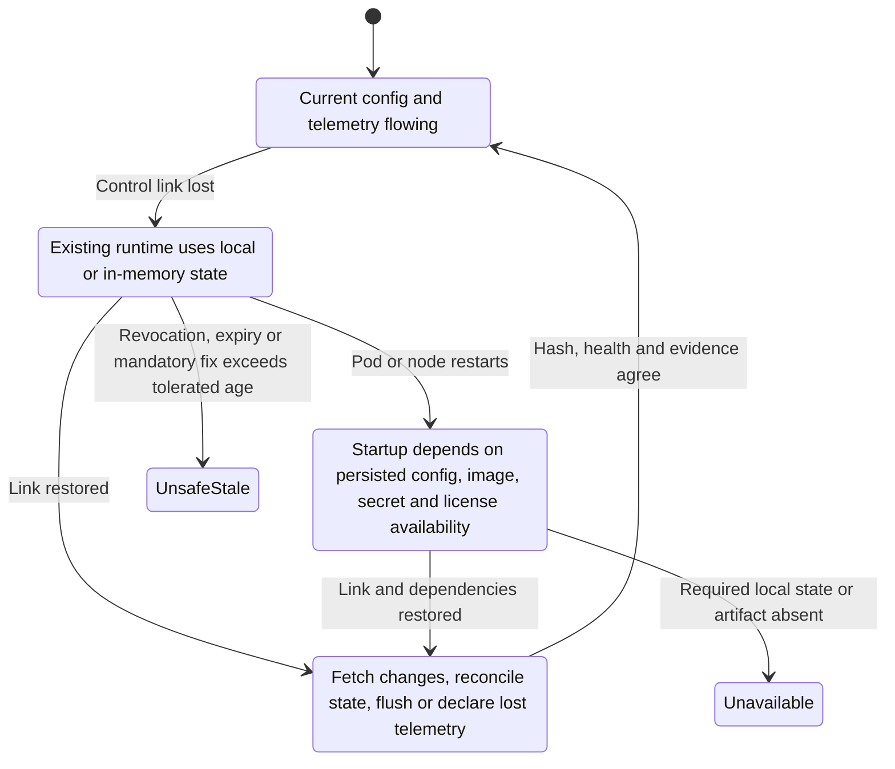

# Hybrid and multicloud comparison

<!-- study-contract: principal -->

| Study field | Value |
|---|---|
| Artifact type | comparative-study |
| Decision question | Which plane-placement model satisfies location, recovery and support constraints during control-plane, cloud and network separation without overstating portability? |
| Decision owner | API Platform Steering Committee, with architecture, resilience, security/privacy and operations jointly accepting the boundary model |
| Primary audiences | Executives, enterprise/platform/security architects, SRE, DevOps, developers, procurement and risk |
| Scope | K-KON, K-SM, A-MGD, A-SHG, G-X, G-HYB and M-RTF; state location, disconnection, recovery, portability and support boundaries |
| Evidence state | Documented E1 mechanisms and explicit interpretations/hypotheses; no observed disconnection, exit or operating-cost result |
| Reference case | Synthetic RE-1, especially J-06 and I-02; all numeric inputs are scenario assumptions |
| As-of date | 2026-08-17 for volatile topology, version and service claims |
| Next gate | Hybrid Architecture Review after the location ledger, six-state isolation test and clean rebuild/exit evidence are reviewed |

## Provisional answer

Runtime locality does not establish autonomy or portability. The current evidence narrows the decision to a responsibility trade: K-KON, A-SHG, G-HYB and M-RTF keep selected request processing near workloads while retaining SaaS control dependencies; K-SM maximizes enterprise custody while adding control-plane/database operations; A-MGD and G-X reduce runtime operations while fixing traffic placement in a provider. Confidence is medium in documented state placement and low in enterprise recovery/exit fit. Treating “existing traffic continues” as complete hybrid resilience would miss cold start, urgent revocation, telemetry loss and reconciliation—the states most likely to change the decision.

## Decision question

Which deployment archetype places request processing, regulated data, configuration, credentials and recovery responsibilities in acceptable locations **while preserving a supportable operating model during cloud, control-plane and network separation**?

“Runs in multiple clouds” is not the decision. The decision is whether the enterprise can explain and operate every stateful component, management dependency, data flow, failure boundary and exit path without mistaking runtime locality for platform independence.

## Deployment archetypes in scope

| ID | Bounded archetype—not yet an exact option | Plane placement and operator |
|---|---|---|
| K-KON | Kong Konnect regional SaaS control plane with customer-operated Kong data planes on AKS and private Kubernetes | Kong operates control-plane persistence and services; the enterprise operates data-plane compute, network, plugins and local observability. Data planes receive configuration and send telemetry over mTLS. [Konnect network model](https://developer.konghq.com/konnect-platform/network/) |
| K-SM | Self-managed Kong hybrid with enterprise control planes/PostgreSQL and enterprise data planes in two runtime zones | Enterprise owns all infrastructure, database, backups, upgrades, CP/DP PKI and support diagnostics. Data planes maintain configuration received from the CP. [Hybrid roles](https://developer.konghq.com/gateway/hybrid-mode/) |
| A-MGD | Azure API Management managed gateway in Azure with private connectivity to Azure and data-centre services | Microsoft operates the gateway/control infrastructure; all API traffic traverses Azure even when the backend does not. [Gateway deployment models](https://learn.microsoft.com/en-us/azure/api-management/api-management-gateways-overview) |
| A-SHG | Azure API Management self-hosted gateways on AKS/private Kubernetes, controlled by one Azure API Management instance, with persistent local configuration backup | Microsoft operates the Azure control service; enterprise runs container replicas, local backup, ingress, autoscaling and telemetry collectors. [Self-hosted gateway model](https://learn.microsoft.com/en-us/azure/api-management/self-hosted-gateway-overview) |
| G-X | Apigee managed runtime instances operated by Google in Google Cloud | Google operates management and runtime infrastructure; enterprise controls organization/environments, proxy configuration, products/apps, connectivity and exported evidence. [Managed and hybrid feature boundary](https://docs.cloud.google.com/apigee/docs/api-platform/get-started/apigee-feature-summary) |
| G-HYB | Apigee hybrid 1.16: Google management plane plus enterprise-operated runtime plane, ingress, Cassandra and supporting components on a currently supported Kubernetes platform | API traffic is processed in the enterprise runtime; Synchronizer downloads a local contract, while runtime data is stored locally in Cassandra and analytics is sent outward. [Hybrid component architecture](https://docs.cloud.google.com/apigee/docs/hybrid/v1.16/what-is-hybrid) |
| M-RTF | Anypoint SaaS control plane plus Mule Gateway/API workloads on enterprise-operated Runtime Fabric Kubernetes | Runtime Fabric agent connects outbound by mTLS and manages generated Kubernetes resources; enterprise owns cluster, ingress, network, monitoring and underlying lifecycle. [Runtime Fabric architecture](https://docs.mulesoft.com/runtime-fabric/latest/) |

## Option resolution state—Gate 1 blocker

These rows locate planes and responsibilities, but they are not exact deployable options until version, region, entitlement, component and support fields are fixed. This page is conditionally publishable for E1 mechanism analysis and E3 design only. A criterion score, ranking, finalist recommendation, residency assertion or multicloud-value claim is blocked while any applicable row remains unresolved.

| Option ID | Unresolved option fields that affect hybrid behavior | Current resolution state | Gate-1 rule |
|---|---|---|---|
| K-KON | Konnect subscription and CP region; DP image/version, plugin and cache packaging; AKS/private-cluster versions; analytics/portal/data locations; support and exit terms | **Unresolved—E1 archetype only** | Block scoring until isolated runtime, data location and contracted support boundaries are fixed. |
| K-SM | Kong/CP/DP/PostgreSQL versions; database/storage topology; plugin and PKI set; runtime zones; backup/restore; support entitlement | **Unresolved—E1 archetype only** | Block scoring until the customer-operated recovery unit is versioned end to end. |
| A-MGD | APIM tier/generation and regions; private-network mode; workspace/portal/analytics scope; service data locations; support tier and export/exit path | **Unresolved—E1 archetype only** | Block scoring until managed placement and state/data boundaries are contractual. |
| A-SHG | Parent APIM tier; SHG image/digest; cluster versions; local backup mode; workspace/configuration endpoint; portal/analytics/data paths; support | **Unresolved—E1 archetype only** | Block scoring until running, cold-start and reconnect dependencies are frozen. |
| G-X | Organization/runtime regions; network and data-residency configuration; portal/analytics options; support tier; export/exit scope | **Unresolved—E1 archetype only** | Block scoring until the managed runtime and state-location contract is fixed. |
| G-HYB | Hybrid release plus supported Kubernetes/Helm/operator/ingress/Cassandra set; data-encryption method; Google endpoint/data paths; backup and support | **Unresolved—E1 archetype only** | Block scoring until the full split-responsibility runtime—not only the product release—is fixed. |
| M-RTF | Anypoint edition/region; RTF release/agent/Helm and Kubernetes set; resource cache and registry path; monitoring/portal entitlement; backup/support/exit | **Unresolved—E1 archetype only** | Block scoring until local continuity and SaaS dependency boundaries are versioned. |

## Mechanism-level architecture analysis: where state and responsibility live

| Concern | K-KON | K-SM | A-MGD | A-SHG | G-X | G-HYB | M-RTF |
|---|---|---|---|---|---|---|---|
| Request processing | Enterprise DP zones | Enterprise DP zones | Azure managed gateway region(s) | Enterprise runtime zones | Google-managed runtime region(s) | Enterprise Kubernetes runtime | Enterprise Runtime Fabric |
| Configuration authority | Konnect APIs/UI/IaC | Enterprise Admin API/DB/IaC | Azure management plane | Azure management plane | Apigee management APIs/UI | Google management plane; Synchronizer materializes local contract | Anypoint control plane/API Manager |
| Runtime configuration copy | DP-local last applied configuration | DP-local last applied configuration | Service managed | In memory; optional persistent local backup | Service managed | Local contract file consumed by Message Processors | Agent-generated Kubernetes/runtime state and local resource cache |
| Consumer/app credentials | Konnect/control data plus DP enforcement; validate exact credential type | Enterprise CP/DB plus DP enforcement | API Management service | API Management service plus SHG enforcement | Apigee organization/runtime services | Runtime Cassandra/KMS entities with management-plane mediation | Anypoint app/contract records plus deployed policy enforcement |
| Runtime persistent store owned by enterprise | No, apart from surrounding runtime dependencies | PostgreSQL for CP; DP design is not the authority | No | Persistent volume only if local config backup enabled; no enterprise CP database | No | Cassandra plus Kubernetes secrets/volumes/backups | Kubernetes and configured application persistence; control records remain SaaS |
| Analytics destination | Konnect and/or enterprise tooling | Enterprise tooling | Azure Monitor/Application Insights/export | Azure and/or local collectors | Apigee/Google services and export | UDCA/Cloud operations plus local cluster signals | Anypoint Monitoring and/or enterprise forwarding, entitlement dependent |
| Portal/catalog | Konnect service | Depends on licensed/self-managed capability and architecture | Azure service portal | Same cloud portal/control service; runtime remains local | Apigee portal/catalog | Google-managed portal/catalog with hybrid runtime | Anypoint Exchange/public portal/API community options |
| Backup and recovery owner | Vendor CP; enterprise DP declarations and runtime infrastructure | Enterprise for CP DB/configuration/PKI and runtimes | Vendor service plus enterprise declarative/export strategy | Vendor control state; enterprise local backup volume and runtime | Vendor service plus enterprise proxy/config export strategy | Split: Google management, enterprise Cassandra/runtime/keys | Split: Anypoint control records, enterprise cluster/app persistence and declarations |

The table is a design hypothesis, not a scored result. Each row must be reconciled with the contracted edition, target version and enterprise recovery plan.

## Operational failure modes: disconnection is a state machine, not a yes/no feature

**Figure HYB-1 — “Offline” contains distinct running, cold-start, stale and recovery states.**

- **Depicted scope:** state transitions from connected operation through control-link isolation, existing-runtime service, cold restart, unsafe staleness, unavailability, reconnect and convergence.
- **Excluded scope:** product-specific cache format, license enforcement, certificate lifetime, state durability, timing, emergency-local-control implementation, regional failover and whether a candidate actually supports each transition.
- **Diagram source, evidence state and as-of:** inline Mermaid state model synthesized by this study from the cited E1 hybrid mechanisms and RE-1 I-02; interpretation/hypothesis, no observed product result; 2026-08-17.
- **Accessible equivalent:** the table immediately after the figure restates each relevant transition—connected to isolated existing, isolated existing to cold restart, isolated to urgent security change, and reconnect to converged—with candidate-specific expected mechanisms and proof requirements.

**Figure interpretation:** HYB-1 prevents an existing replica's cached proxy success from being generalized to cold restart, urgent revocation, scale-out or safe reconnection; each transition becomes a separate test and decision state.

**Figure limitation:** The state model is vendor-neutral test logic, not a claim of identical cache, restart or reconciliation behavior. Transition availability and timing remain Gate-1 option fields and E3 observations.

| State transition | K-KON / K-SM | A-SHG | G-HYB | M-RTF | Proof required from every hybrid finalist |
|---|---|---|---|---|---|
| Connected → isolated, existing replicas | DP request processing is designed to use the last received configuration; the enterprise must define acceptable staleness and monitor the channel/config hash. | Running gateways continue using in-memory configuration; they cannot receive changes or upload cloud telemetry. [Documented failure behaviour](https://learn.microsoft.com/en-us/azure/api-management/self-hosted-gateway-overview) | Synchronizer stores the downloaded contract locally, allowing Message Processors to continue using it when the management connection is down. [Synchronizer mechanics](https://docs.cloud.google.com/apigee/docs/hybrid/v1.16/what-is-hybrid) | MuleSoft states that apps and gateways continue operating if the Runtime Fabric agent stops or loses control-plane connectivity, but management operations degrade. [Security architecture](https://docs.mulesoft.com/runtime-fabric/latest/security-architecture) | Existing proxy call, configuration-age signal, auth-key cache, quota state, license/certificate state and local logs during a bounded isolation. |
| Isolated existing → cold restart | DP startup needs image, certificates, plugins, secrets and a usable local configuration; test exact packaging rather than assuming “last known” survives replacement. | With local backup enabled, a stopped instance can start from the persisted backup; without it, it cannot start while disconnected. | Runtime startup depends on local contract, Cassandra, Kubernetes secrets, images and component health—not only management-plane independence. | Runtime Fabric resource cache can hold dependencies, but clean-node/pod recovery can require registry, asset or control services; test the actual artifact path. | Delete one replica, then one node; prove readiness, configuration identity and absence of unauthorized fallback. |
| Isolated → urgent security change | No remote change reaches an isolated DP. A local emergency mechanism, traffic withdrawal or shorter isolation objective may be required. | Same limitation: fail-static preserves old policy, including a policy that now needs revocation. | Synchronizer cannot retrieve the new contract; local traffic controls must cover an urgent revoke if the requirement demands it. | API Manager/agent communication loss can delay policy/deployment change; define local containment. | Revoke a consumer, CA or route and measure containment—not just post-reconnect propagation. |
| Reconnect → converged | CP pushes current state; conflicting writers, plugin mismatch and rejected config must be detectable. | Gateway reconnects and downloads changes made while offline. | Synchronizer downloads updated contract; runtime and watcher status must prove the intended revision is loaded. | Agent receives desired state and updates Kubernetes resources; queued/failed operations and drift need reconciliation. | Apply multiple changes while isolated, restore link, verify ordered outcome/hash, telemetry gap, audit trail and no traffic regression. |

## Portability decomposition

Portability has separate layers. A high score at one layer must not be used to infer another.

| Layer | Potentially portable unit | Hidden coupling to expose | Practical exit test |
|---|---|---|---|
| API contract | OpenAPI/AsyncAPI/schema and examples | Vendor extensions, generated portal metadata, unsupported protocol nuance | Validate the unmodified canonical contract in two independent toolchains and run contract tests. |
| Routing intent | Gateway API `Gateway`/`HTTPRoute`/`GRPCRoute`, Services, DNS intent | Controller-supported features, implementation-specific filters/policies, listener/LB annotations and status semantics | Reconcile the same core route on two controllers; compare `Accepted`, `Programmed`, addresses and behaviour. Gateway API is role-oriented and portable by design, but extended/custom support varies. [Kubernetes Gateway API](https://kubernetes.io/docs/concepts/services-networking/gateway/) |
| Gateway policy | Authentication, rate limit, transformation and observability intent | Plugin/policy schema, execution order, custom code, secrets, distributed state and fault semantics | Compile one vendor-neutral control profile into each native policy set; negative-test semantic equivalence. Gateway API policy attachment is an extension pattern, not universal policy portability. [Policy attachment](https://gateway-api.sigs.k8s.io/reference/policy-attachment/) |
| Configuration lifecycle | Git, reviews, signed artifacts, promotion and rollback metadata | Admin APIs, revision models, environment resources, server-side defaults and generated IDs | Rebuild an empty non-production environment solely from repositories and approved secrets; compare a normalized inventory. |
| Consumer lifecycle | Product/package, application, approval, credential, SLA/quota and revocation records | Vendor-specific identifiers, secret non-exportability, IdP/DCR integration and analytics history | Export a sanitized consumer inventory; recreate representative contracts with intentional credential rotation and evidence. |
| Operational history | Metrics, logs, traces, audits, SLOs and incident references | Proprietary dimensions, retention/query APIs, sampling and historical aggregation | Reproduce the common SLO dashboard and incident timeline in the enterprise observability platform. |
| Runtime substrate | Container/Kubernetes manifests and images | Supported-version windows, operators, databases, storage classes, cloud LB/CNI/identity and node architecture | Restore into a clean supported cluster in another approved landing zone; record manual and vendor-assisted steps. |

## Support-boundary comparison

| Incident symptom | First evidence owner | Boundary question that prevents ticket ping-pong |
|---|---|---|
| Requests fail only in one runtime zone | Enterprise SRE/network | Does the gateway have current config, healthy listener, route and backend reachability? Which component returned the error? |
| Existing replicas work; new replicas fail | Enterprise platform/supply chain | Is the missing dependency configuration, image, plugin, secret, certificate, license or control connectivity? |
| Control UI shows healthy; runtime has stale state | Platform plus vendor | What heartbeat/status does the UI represent, what is the runtime config hash/age, and which side owns reconciliation? |
| Analytics missing but proxying healthy | Observability/platform plus vendor | Was data produced, buffered, dropped, rejected or delayed? Which queue/collector/ingestion limit applies? |
| Runtime database degradation | Enterprise for K-SM/G-HYB; split for others | Is the affected store vendor control state, hybrid runtime state, application state or merely telemetry? Who restores and validates consistency? |
| Cross-cloud path failure | Enterprise network first, vendor when endpoint/service evidence points outward | Is DNS, proxy, firewall, private connection, certificate or vendor regional endpoint the failed boundary? |

The operating-level agreement must name evidence and escalation clocks at each boundary; “vendor supported” is not a RACI.

## Synthetic regulated-enterprise scenario—not observed evidence

This is the hybrid/multicloud slice of [RE-1, the enterprise reference case](41-enterprise-reference-case.md), centred on **J-06 configuration propagation** and **I-02 control-plane disconnect/stale restarted replica**. It is a fictional assessment model and contains no observed product result.

**Scenario assumptions.** The workload locations, residency boundary, isolation window, recovery need and team shape below are decision inputs to be confirmed; they are not discovered estate facts or vendor outcomes.

The enterprise has APIs backed by Azure services, a private data-centre core and one acquisition workload in another cloud. Canadian request payloads must stay within approved runtime zones. SaaS control metadata is permissible only after field-level classification. A runtime zone must serve existing authorized traffic through a 30-minute control-plane outage. A new replica must be recoverable during a separate zone failure, and an emergency client revoke has a tighter objective that may conflict with fail-static operation. The target operating model has a small central platform team and federated domain teams.

| Exercise | What is deliberately made difficult | Decision evidence—not a presumed score |
|---|---|---|
| Data-location ledger | Trace configuration, credentials, payload, analytics, portal, audit, support bundle and backups | Each field category has a location, processor/operator, retention, encryption and approved transfer basis. |
| Disconnected runtime | Block only management/configuration and run existing valid/invalid transactions | Runtime continuity, config age, authentication dependency and evidence loss match the declared state model. |
| Clean scale-out while isolated | Remove a node and schedule a fresh replica without warm local cache | Exact dependencies and resulting availability are captured; a hidden registry/secret/control dependency becomes visible. |
| Urgent revoke | Revoke a partner credential and vulnerable route during isolation | Steering committee can see whether the requirement is met natively, through a local compensating control, or not at all. |
| Reconciliation | Make several approved control-plane changes, restore connectivity and introduce one incompatible policy/plugin | Candidate detects/rejects partial state, produces a clear authoritative revision, and supports deterministic recovery. |
| Portability drill | Recreate route, baseline security and telemetry in a second controller/platform from canonical intent | Manual transformations, semantic gaps, credentials and historical data loss are measured rather than described as “portable.” |
| Exit rehearsal | Export configs, products/apps, documentation, evidence mappings and operating procedures | Enterprise can estimate a bounded exit path without claiming live migration or credential portability where none exists. |

## Counterarguments and non-fit conditions

- **“Local data plane means all data is local.”** Configuration, app/consumer records, analytics, portal identities, audit, crash/support data and billing telemetry may cross the boundary. Field-level classification is required.
- **“Disconnected proxying is high availability.”** It covers one failure state. Cold start, scale-out, expiry, state-store loss, urgent revocation and reconciliation are separate states.
- **“Self-managed removes vendor dependency.”** It changes the dependency into software supply, licensing, support and enterprise-operated databases/upgrades; it does not remove it.
- **“Gateway API prevents lock-in.”** It improves routing-intent portability. Authentication, transformation, analytics, portal and consumer lifecycle remain implementation-specific, and extended features are not universally supported. [Gateway API conformance model](https://gateway-api.sigs.k8s.io/docs/concepts/conformance/)
- **K-KON, A-SHG or M-RTF is a non-fit** when SaaS control/data categories or required outbound dependencies fail residency, third-party, availability or emergency-change gates.
- **K-SM is a non-fit** when full CP/database operations cannot meet recovery, patch, on-call and upgrade requirements economically.
- **G-X is a non-fit** when traffic placement in Google-managed runtime or the cross-cloud network path violates a mandatory boundary; **G-HYB is a non-fit** when Cassandra and the multi-component runtime exceed the sustainable platform-operating envelope.
- **A-MGD is a non-fit** when every API call's Azure path creates unacceptable distance or concentration for non-Azure workloads—even if the service is operationally attractive.

## Risks and limitations

- Statements are **E1 current official-documentation evidence**, reviewed 2026-08-17. They do not establish contractual residency, support obligation, recovery objective or actual enterprise behaviour.
- “Last known configuration” is implemented differently and does not by itself prove cold restart, complete policy state, secret availability or emergency control. Those remain E3 tests.
- Exact licensed editions, regional control-plane choices, supported Kubernetes/runtime versions, telemetry entitlements and retention are not yet evidenced in this public study.
- No disconnected duration, recovery time, data-loss quantity, operating cost, portability percentage or migration effort is claimed.

## Decision implications and required next evidence

1. Produce a data-location and responsibility ledger for payload, configuration, credentials, analytics, portal, audit, backup and support artifacts for each variant.
2. Define separate objectives for existing traffic, cold restart, clean scale-out, urgent revoke, telemetry continuity and reconciliation; do not use one “offline support” checkbox.
3. Run the synthetic isolation and exit exercises before weighting platform convenience or feature breadth.
4. Require a two-year version/upgrade calendar and tested recovery runbook for every enterprise-operated component, especially PostgreSQL, Cassandra, Kubernetes and ingress.
5. Value portability as the demonstrated cost of change at each layer, not as a binary product attribute. Preserve canonical contracts and control intent even when native runtime artifacts differ.

## Falsification and proof plan

The provisional answer is falsified if a variant's stated locality, disconnection or portability property collapses under a cold replacement, urgent revoke, reconciliation conflict or rebuild. Test the states independently; a successful warm proxy call cannot stand in for recovery evidence.

| Hypothesis to challenge | Symmetric procedure | Measure and acceptance threshold | Required artifact and reviewer | Decision impact |
|---|---|---|---|---|
| The field-level location ledger matches actual flows and storage | Generate tagged synthetic configuration, credential, request, analytics, audit and support data; trace destinations, backups and operator access | 100% of declared data classes have an observed or contractually evidenced location/operator/retention path; zero unexplained transfers | Sanitized flow/storage inventory, processor map, contract references; privacy and security review | An unexplained mandatory data transfer blocks the variant; an approved optional transfer becomes a cost/control obligation. |
| Existing service, cold restart and scale-out have distinct, predictable isolation behaviour | Disconnect control/configuration paths; run existing replicas, replace one Pod/node, then attempt clean scale-out | Each state meets its separately approved RE-1 objective; zero false-ready or unknown-config replicas; missing artifacts/dependencies are named | Fault timeline, runtime/config hashes, image/secret/registry evidence; SRE review | Warm-only continuity cannot be scored as disconnected resilience; unmet cold objective requires compensating capacity or exclusion. |
| Urgent revoke and reconnection do not leave unsafe stale service | Revoke J-03 identity/route during isolation; make one compatible and one incompatible J-06 change; reconnect in a controlled order | Revocation meets the approved objective or invokes the approved local containment; every runtime converges to one authoritative revision with zero unaccounted state | Revocation timestamps, reconciliation logs, runtime inventory and audit chain; security/platform review | If fail-static conflicts with the mandatory revoke objective and no sustainable local control exists, the topology is non-fit. |
| Exit and rebuild preserve the declared portable layers | Export canonical intent and supported native artifacts; rebuild a minimal route/security/telemetry/product slice in a second environment without source control-plane access | 100% of in-scope non-secret entities are accounted for as restored, transformed or intentionally re-created; zero unexplained dependencies; secret re-issuance is explicit | Entity reconciliation, transformation log, runbook effort, data-history gaps; architecture and procurement review | Hidden non-exportable state or unsustainable transformation effort changes exit risk/TCO and can breach a mandatory portability gate. |

## Open evidence requests

| Evidence request | Owner role | Due gate | Decision impact if absent |
|---|---|---|---|
| Contracted regional data-processing, support-access, backup, telemetry and portal/consumer-record locations per variant | Vendor + privacy + procurement | Before shortlist | Residency/third-party risk remains unknown; no locality claim can pass. |
| Exact versioned dependency/port/endpoint and persisted-state inventory for isolated running, cold start, scale-out and recovery | Vendor technical lead + platform engineering | Before E3 design freeze | “Offline support” remains E1 marketing-level evidence and cannot be weighted. |
| Current support matrix, end-of-support dates and split-responsibility recovery obligations for Kubernetes, databases, ingress, certificates and registries | Vendor + enterprise operations | Before operating-model scoring | Unsupported or unstaffed component risk remains a potential non-fit. |
| E3 isolation, urgent-revoke, reconciliation, data-location and exit/rebuild artifacts | SRE + security + platform engineering | Before recommendation | Disconnection, residency and portability remain unproven; candidate cannot receive an E3 score. |

## Next gate

The next gate is an **E3 hybrid boundary and recovery test readiness review** chaired by enterprise architecture with privacy, security, SRE, platform, network, procurement and product owners. It passes only when field-level location decisions are approved, every isolated state has its own objective and fixture, local containment authority is named, exact component versions/dependencies are frozen, and exit/rebuild scope is agreed. Passing authorizes evidence generation; it does not establish multicloud value or select a vendor.

Related studies: [networking](26-networking-comparison.md), [Kubernetes](28-kubernetes-comparison.md), [API operations](29-apiops-governance.md), [observability](31-observability-comparison.md), and [performance and resilience](32-performance-resilience.md).
