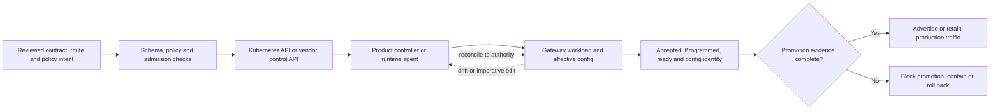

# Kubernetes comparison

<!-- study-contract: principal -->

| Study field | Value |
|---|---|
| Artifact type | comparative-study |
| Decision question | Which enterprise-Kubernetes control model can safely delegate, reconcile, scale, upgrade and recover gateway runtimes without hidden privilege or dual authority? |
| Decision owner | API Platform Steering Committee, with the platform engineering lead accountable for supported lifecycle and cluster risk |
| Primary audiences | Platform engineering, enterprise architects, SRE, security, DevOps, developers and engineering leadership |
| Scope | K-KON-KIC, K-SM-KIC, A-SHG, G-HYB and M-RTF, with A-MGD/G-X as managed benchmarks; controller/runtime/version sets remain Gate-1 option fields below |
| Evidence state | Documented E1 mechanisms and interpreted operating hypotheses; no observed conformance, scale, upgrade or recovery result |
| Reference case | Synthetic RE-1, especially J-06, I-02 and I-04; all numeric inputs are scenario assumptions |
| As-of date | 2026-08-17 for volatile Kubernetes, CRD, controller, chart and runtime support claims |
| Next gate | Platform Architecture Review after exact-version E3 delegation, reconciliation, disruption, clean-node and upgrade/rollback exercises |

## Provisional answer

The viable Kubernetes question is not which product has the most CRDs. It is whether the enterprise accepts the product's desired-state authority and can operate its supported version set and failure model. KIC offers a role-oriented Gateway API path but still needs product-specific policy and strict writer partitioning; A-SHG uses Kubernetes for hosting rather than API intent; G-HYB and M-RTF bring substantial product controllers/agents and operating boundaries. Managed A-MGD/G-X remain legitimate benchmarks. Confidence is medium for architectural differentiation and low for day-two fit. Choosing on installation success could conceal broad controller privilege, stalled reconciliation, stateful recovery or an unsupported cluster upgrade.

## Decision question

For the variants that place a gateway runtime on enterprise Kubernetes, which control model lets platform and domain teams safely declare, reconcile, observe, upgrade and recover gateways at scale **without granting hidden cluster-wide privilege, creating a second configuration authority, or confusing a running Pod with an accepted API route**?

“Kubernetes-native” is not shorthand for “has a container image” or “can be installed with Helm.” It describes the ownership interface, reconciliation semantics, status model, tenancy boundaries, lifecycle automation and support envelope that operators must live with after the proof of concept.

## Deployment archetypes in scope

| ID | Bounded Kubernetes archetype—not yet an exact option | Kubernetes role in product control |
|---|---|---|
| K-KON-KIC | Kong Konnect control plane; enterprise Kong data planes and Kong Ingress Controller (KIC) on AKS/private Kubernetes; core routes expressed with Gateway API, product policies attached through governed Kong resources | KIC watches Kubernetes resources and translates accepted intent into Konnect-managed gateway configuration. Gateway API CRDs must exist before KIC starts for those resources to reconcile. [KIC Gateway API](https://developer.konghq.com/kubernetes-ingress-controller/gateway-api/) |
| K-SM-KIC | Self-managed Kong hybrid CP/PostgreSQL plus enterprise KIC-managed data planes | Same route/controller pattern, but enterprise also operates CP, database, Admin API, backups and CP/DP compatibility. |
| A-SHG | Azure API Management self-hosted gateway installed by Helm/YAML as enterprise-managed Kubernetes Deployments/Services; Azure API Management remains configuration authority | Kubernetes schedules and scales gateway containers; it is not the API/policy source of truth. Microsoft provides production guidance but the enterprise owns replicas, probes, resources, PDB/topology, backup and upgrade. [Production guidance](https://learn.microsoft.com/en-us/azure/api-management/how-to-self-hosted-gateway-on-kubernetes-in-production) |
| G-HYB | Apigee hybrid 1.16 installed with ordered Helm charts and Apigee CRDs/operator; enterprise operates ingress, runtime, Cassandra, Redis/telemetry and supporting services | Kubernetes and Apigee CRs express runtime component lifecycle; API proxies/products remain management-plane concepts rather than Gateway API routes. [Hybrid Helm reference](https://docs.cloud.google.com/apigee/docs/hybrid/v1.16/helm-reference) |
| M-RTF | Anypoint Runtime Fabric installed by Helm on a supported enterprise Kubernetes distribution; Runtime Fabric agent creates/updates application Deployments, Pods, ReplicaSets and ingress resources from Anypoint desired state | Anypoint, not arbitrary `kubectl`, is the intended application control surface. Enterprise owns cluster/ingress/network; the agent has significant Kubernetes permissions. [Runtime Fabric architecture](https://docs.mulesoft.com/runtime-fabric/latest/) |
| Managed benchmark | A-MGD and G-X managed runtimes | These do **not** put gateway Pods in the enterprise cluster. They remain in the wider platform comparison because avoiding Kubernetes runtime operations may be valuable; they should not be scored zero on an inapplicable “Kubernetes-native” criterion. |

Kong Operator-managed data planes may be assessed as a separate K-KON/K-SM subvariant if lifecycle automation is in scope. Do not mix Operator-managed and manually managed gateways in one score.

## Option resolution state—Gate 1 blocker

The table above defines control models, not exact supported version sets. This page may be published as conditional E1 mechanism analysis, but it cannot support Kubernetes-fit scoring, ranking, a finalist recommendation or production support claim until the full product/controller/agent/cluster matrix is fixed. A documented “latest” or product release is not substituted for a production bill of materials.

| Option ID | Unresolved Kubernetes and product fields | Current resolution state | Gate-1 rule |
|---|---|---|---|
| K-KON-KIC | Konnect subscription/region; Kong DP and KIC versions/images; Gateway API/CRD version; Kong policy CRDs; AKS/private-cluster versions; controller scope; plugins; support | **Unresolved—E1 archetype only** | Block scoring until one supported compatibility set and authority partition are frozen. |
| K-SM-KIC | Kong CP/DP/KIC/PostgreSQL versions; Kubernetes/Gateway API/CRDs; plugins; Admin API; storage/backup; support | **Unresolved—E1 archetype only** | Block scoring until the entire self-managed control/runtime set is supportable together. |
| A-SHG | APIM tier; SHG image digest and gateway version policy; AKS/Kubernetes version; Helm/chart values; workload identity; configuration endpoint/workspace; support | **Unresolved—E1 archetype only** | Block scoring until hosting, authentication, upgrade and local-backup behavior are pinned. |
| G-HYB | Apigee hybrid release; supported Kubernetes distribution/version; Helm, operator and CRDs; ingress; Cassandra/Redis/telemetry components; storage; support | **Unresolved—E1 archetype only** | Block scoring until Google's complete supported matrix and ordered lifecycle are fixed. |
| M-RTF | Anypoint edition; RTF release, agent and Helm chart; supported Kubernetes distribution/version; ingress; Mule runtime; monitoring; support | **Unresolved—E1 archetype only** | Block scoring until control-plane, agent-generated resources and cluster lifecycle are versioned. |
| A-MGD / G-X benchmark | Exact service tier, region, network/data boundary, managed-runtime support and operational features | **Unresolved—benchmark only** | Do not award or subtract Kubernetes fit; compare avoided customer operation only after managed boundaries are fixed. |
| Kong Operator subvariant | Operator version, GatewayConfiguration/DataPlane/ControlPlane CRDs, provisioning authority and compatibility with KIC/Kong version | **Not admitted** | Create a separate option contract before any Operator evidence is mixed with KIC/manual results. |

## Ownership and reconciliation model

**Figure K8S-1 — A manifest is not production evidence until authority, reconciliation and runtime acceptance agree.**

- **Depicted scope:** reviewed intent, admission, Kubernetes or vendor API, controller/agent reconciliation, effective runtime, acceptance/configuration status and production promotion/containment.
- **Excluded scope:** candidate-specific CRDs and status vocabulary, Git hosting, policy compiler, cluster/node topology, rollout algorithm, support workflow and whether a managed benchmark uses Kubernetes internally.
- **Diagram source, evidence state and as-of:** inline Mermaid operating-model synthesis by this study from the E1 Kubernetes/controller mechanisms cited below and RE-1 J-06; interpretation, no observed conformance or rollout result; 2026-08-17.
- **Accessible equivalent:** reviewed intent passes schema/policy/admission, reaches the authoritative Kubernetes or vendor API, is reconciled by the product controller/agent into runtime state, and is promoted only when accepted/programmed/readiness/configuration evidence and a transaction agree. Failure at any stage blocks or contains promotion. The following comparison table maps this sequence to each archetype.

**Figure interpretation:** K8S-1 changes the gate from “the API accepted YAML” to “the authoritative controller reconciled the intended object, the runtime proves the effective configuration, and a production transaction passes.”

**Figure limitation:** Status names and observability differ by candidate, and some stages sit in a vendor API rather than Kubernetes. The model defines equivalent evidence intent; it does not assert identical CRDs, conditions or automatic rollback.

A manifest being accepted by the Kubernetes API proves only syntax/admission. Production promotion requires controller acceptance, runtime programming, ready endpoints, effective-policy identity and a successful transaction.

## Mechanism-level comparison

| Concern | K-KON-KIC / K-SM-KIC | A-SHG | G-HYB | M-RTF | Evidence required |
|---|---|---|---|---|---|
| API ownership surface | `GatewayClass`, `Gateway`, `HTTPRoute`/`GRPCRoute` plus Kong-specific policies/CRDs. Gateway API separates infrastructure, cluster and application roles. [Kubernetes Gateway API role model](https://kubernetes.io/docs/concepts/services-networking/gateway/) | API/policy config comes from Azure API Management; Helm values/Kubernetes manifests own only runtime deployment. A GitOps repository therefore has at least two artifact domains that must be correlated. | Helm values and Apigee CRs own runtime components; proxy bundles, shared flows, environments and products use Apigee control APIs/bundles. | Anypoint desired state drives the Runtime Fabric agent, which generates Kubernetes resources. Direct changes can be overwritten or become unsupported drift. | Named source of truth per entity, authoritative writer, immutable release ID, status/acceptance signal and drift response. |
| Reconciliation/status | KIC reconciles resources only when matching CRDs/controller configuration exist. Gateway/Route conditions and KIC logs expose acceptance; current Gateway API/KIC compatibility must be pinned. [Version compatibility](https://developer.konghq.com/kubernetes-ingress-controller/version-compatibility/) | Deployment readiness says the container runs; APIM gateway health/configuration status and a routed transaction prove policy availability. There is no Gateway API `Programmed` condition for APIM API policy. | Apigee operator/CR status, component readiness, Synchronizer/runtime deployment state and proxy deployment status are separate signals. Watcher helps report proxy/ingress deployment status. [Runtime services](https://docs.cloud.google.com/apigee/docs/hybrid/v1.16/service-config.html) | Agent reports state to Anypoint and mutates cluster resources from control-plane commands/events; Kubernetes readiness, Anypoint application status and API registration status must agree. | Deliberately submit invalid listener, missing backend, rejected policy, incompatible proxy and unavailable secret. Promotion must stop on the correct signal. |
| CRD and version lifecycle | KIC, Kong Gateway, Kubernetes and Gateway API versions form a compatibility set. Helm does not automatically upgrade KIC CRDs; some Gateway API changes require operator action. [KIC upgrade guidance](https://developer.konghq.com/kubernetes-ingress-controller/faq/upgrading-ingress-controller/) | Kubernetes compatibility follows the self-hosted container/Helm support policy, not an API CRD stack; pin image versions rather than mutable tags. [Self-hosted support policy](https://learn.microsoft.com/en-us/azure/api-management/self-hosted-gateway-support-policies) | Apigee minor release, Kubernetes distribution/version, Helm version, CRDs, operator and ordered component charts form one supported set. Apigee publishes a moving platform matrix. [Supported platforms](https://docs.cloud.google.com/apigee/docs/hybrid/supported-platforms) | Runtime Fabric, Kubernetes distribution/version, Helm chart/agent, ingress and Mule runtime versions form the set. Supported installation targets are enumerated rather than “any Kubernetes.” [Helm installation requirements](https://docs.mulesoft.com/runtime-fabric/latest/install-helm) | A two-year compatibility calendar, CRD conversion/backup plan, staging rehearsal, rollback constraint and vendor-support confirmation for the exact matrix. |
| Tenancy and namespace delegation | Gateway API listener `allowedRoutes`, route `parentRefs`, namespaces and RBAC support two-sided attachment. Kong policy resources and Consumers still need an explicit delegation model. [Route attachment model](https://gateway-api.sigs.k8s.io/docs/concepts/api-overview/) | APIM service/workspace/product/API scopes define management tenancy; Kubernetes namespaces isolate runtime objects only. Do not infer domain-policy delegation from a namespace. | Apigee organization/environment/runtime component scopes are primary; Kubernetes namespaces/node pools protect infrastructure, not domain self-service for proxy configuration. | Anypoint org/business group/environment/application scopes are primary; Runtime Fabric can authorize additional namespaces, but the agent/core resources retain platform-level responsibilities. | Cross-namespace route attempt, hostname collision, unauthorized policy attachment, secret reference, noisy neighbour, support access and deletion blast radius. |
| Controller/agent privilege | Minimize KIC watch scope, separate controllers/classes where justified, and inspect permissions for Kong CRDs, Secrets, Services and status writes. | Gateway Pod should not need broad Kubernetes mutation rights; deployment identity, workload identity and secret access remain enterprise design. | Apigee operator and components create/manage substantial runtime state, including stateful services; RBAC and service accounts must match the vendor model without exposing them to domain teams. | Runtime Fabric agent and Mule cluster IP service interact with the Kubernetes control plane; MuleSoft documents broad permissions for core components, while application containers do not receive a service account by default. [Runtime Fabric security architecture](https://docs.mulesoft.com/runtime-fabric/latest/security-architecture) | Effective RBAC dump, attempted privilege escalation, namespace escape, secret read, admission denial and audit attribution by controller service account. |
| Scaling and disruption | Scale data-plane replicas on measured concurrency/latency/resource signals; controller and CP capacity are separate. Distributed rate limits/health state may add dependencies. | Enterprise configures resources, replicas, HPA, PDB, topology, probes and local backup. Request throttling is not a substitute for Pod capacity. | Runtime, Cassandra, ingress and telemetry scale differently; storage and quorum constraints mean a single generic HPA is unsafe. | Runtime Fabric core, gateway/app replicas and monitoring sidecars have distinct resource demand; enterprise capacity includes generated and platform workloads. | Saturation test, scale-up lag, scale-down drain, zone loss, node drain, PDB interaction, topology placement and state consistency. |
| Network and workload identity | CNI/NetworkPolicy, gateway Service/LB, backend egress, CP/DP and secret-provider identity are enterprise-owned. | AKS workload identity can authenticate SHG to Azure control endpoint; identity expiry and cold start must be tested. [SHG authentication options](https://learn.microsoft.com/en-us/azure/api-management/self-hosted-gateway-authentication-options) | Service accounts can use Kubernetes Secrets, Vault or Workload Identity Federation for GKE depending on platform. [Service-account methods](https://docs.cloud.google.com/apigee/docs/hybrid/v1.16/sa-authentication-methods) | Activation places mTLS and registry material in Kubernetes Secrets; customer owns network and secret safeguards. | Pod identity to control, registry, vault and backend; NetworkPolicy default deny; rotation; new-node pull; proxy; DNS; no long-lived secret leakage. |
| Observability and support | KIC/controller logs, resource conditions, Gateway metrics/logs/traces, Kubernetes events and CP status must correlate. | Pod/container/local telemetry plus Azure control/diagnostic state must correlate; self-hosted logs are not identical to managed-gateway diagnostics. | Component metrics/logs, Kubernetes signals, Cassandra and proxy analytics are distinct. | Customer cluster monitoring and Anypoint monitoring/log forwarding are shared, entitlement-dependent paths. | One runbook that starts with a trace/config ID and identifies controller, runtime, node, network, control and backend ownership without guesswork. |

## Portable core versus implementation-specific policy

| Intent | Portable/core candidate | Product-specific implementation that must remain isolated | Semantic trap to test |
|---|---|---|---|
| HTTP host/path/header route | `HTTPRoute` core fields where supported | APIM/Apigee/Mule control artifacts; Kong extensions for non-core matches/filters | Precedence, regex dialect, case, encoded path and conflicting-route behaviour |
| gRPC route | `GRPCRoute` core where controller supports the required version/features | Product proxy/policy configuration and protocol translation | Unary versus streaming, status mapping, metadata size, timeout and retry |
| TLS listener/certificate reference | `Gateway` listener and Kubernetes Secret within approved reference rules | Cloud certificate store, Kong/Apigee/Mule TLS constructs, cert-manager integration | Termination hop, SNI overlap, client certificate request and rotation |
| Backend TLS | Standard `BackendTLSPolicy` only where conformance/support is proven | Vendor truststore/target-server/policy settings | SNI, CA chain, identity match, mTLS client cert and policy precedence |
| Authentication | No universal core Gateway API authentication policy | Kong plugins/policies, APIM XML policy, Apigee proxy/shared flow, Mule policy | Issuer/audience/algorithm defaults, fail-open paths and execution order |
| Rate/quota | No universal core commercial or distributed quota semantic | Vendor policy/plugin and state store | Local versus global counter, clock/window, Redis/store failure, retry billing |
| Transformation | Limited route filters do not replace arbitrary mediation | Vendor policy/plugin/custom code | Body buffering, streaming, content type, error mapping and performance |

Gateway API policy attachment describes a standardized extension pattern, not identical policy kinds or behaviour. It also documents discoverability, conflict and status challenges. [Policy attachment model](https://gateway-api.sigs.k8s.io/reference/policy-attachment/)

## Operational failure modes

| Failure | What a shallow review misses | Required guardrail and test |
|---|---|---|
| CRD/controller skew | Manifests apply, but fields are dropped, unrecognized or never reconciled | Pin the four-way version matrix; server-side dry run; inspect stored object and conditions; run conformance plus enterprise cases. |
| Dual configuration writers | Portal/decK/vendor API and Kubernetes controller alternately overwrite effective state | Entity-level authority map, admission/pipeline block, drift alert and break-glass procedure that returns control to Git. |
| `Accepted=True`, `Programmed=False` or stale status | GitOps reports sync while runtime never receives the route | Promotion gate on observed generation, accepted/programmed conditions, ready address, config identity and transaction. |
| Controller/webhook outage | Existing traffic works; every deployment stalls or admission blocks unrelated changes | Separate runtime SLO from change SLO; redundant controller/webhook design; failure policy justified; alert on queue/reconcile age. |
| HPA on the wrong signal | CPU remains low while connections, memory, policy latency or upstream waits saturate | Workload model and multiple saturation signals; load test scale lag; protect backend and CP from a replica storm. |
| PDB and topology deadlock | Node upgrade cannot drain, or constraints leave replacements Pending during a zone loss | Simulate maintenance plus zone loss; size surge/capacity; inspect scheduler reasons; document controlled PDB override. Kubernetes disruption controls reduce voluntary disruption, not all failures. [Kubernetes disruptions](https://kubernetes.io/docs/concepts/workloads/pods/disruptions/) |
| Stateful hybrid component recovery | Gateway Pods restart, but Cassandra/CP database or persistent config cannot recover consistently | Component-specific backup/restore, quorum and storage-class test; validate runtime entities and config after restore. |
| Image/plugin/secret absent on new node | Warm replicas pass; disaster scale-out fails | Digest-pinned signed images, mirrored dependencies where permitted, compatible plugin inventory, secret availability and clean-node drill. |
| Broad controller credentials compromised | Attacker can mutate routes, workloads or read secrets cluster-wide | Scope roles/controllers, isolate service accounts, admission guardrails, audit, network egress control and credential rotation exercise. |
| Unsupported cluster upgrade | Cloud auto-upgrade moves outside vendor matrix | Maintenance ring, upgrade hold where supported, compatibility monitor and tested order across Kubernetes, CRDs, controller, gateway and sidecars. |

## Synthetic regulated-enterprise scenario—not observed evidence

This is the Kubernetes slice of [RE-1, the enterprise reference case](41-enterprise-reference-case.md), using **J-06 configuration propagation** and failures **I-02 stale restarted replica** and **I-04 noisy neighbour**. It is synthetic; no timings, success rates or vendor outcomes are claimed.

**Scenario assumptions.** The cluster count, route/team scale, ownership boundaries, isolation needs and upgrade cadence below are test-design inputs to be confirmed; they are not measured current-state facts.

Two AKS clusters and one private Kubernetes cluster host 120 API routes owned by 18 domain teams. The platform team owns GatewayClasses/listeners, mandatory security policies, controller lifecycle, certificates and shared observability. Domain teams may attach routes only from labelled namespaces to approved listeners. Two payment routes require dedicated capacity; other routes share gateways. Cluster upgrades occur quarterly, and a zone loss must be tolerated during a node-pool drain. Imperative production edits are prohibited except audited break-glass.

| Exercise | Real-world complication | Decision evidence |
|---|---|---|
| Delegation | One team attempts an unauthorized hostname, cross-namespace backend and policy override | Admission and controller both reject it; status is intelligible to the domain team; no other route changes. |
| Collision | Two teams claim overlapping host/path rules during concurrent merge | Deterministic ownership/collision check stops deployment before traffic ambiguity. |
| Reconcile failure | Apply valid syntax with missing Secret, unsupported filter and incompatible runtime plugin | Pipeline distinguishes syntax from accepted/programmed/effective state and blocks promotion. |
| Maintenance plus failure | Drain a node pool while a zone becomes unavailable and traffic continues | PDB/topology/capacity do not deadlock recovery; dedicated/shared gateways contain blast radius as designed. |
| Clean scale-out | Add a node without cached images or secrets during control-plane degradation | Required registry, plugin, identity and configuration dependencies are visible and recoverable. |
| Upgrade/rollback | Upgrade CRDs/controller/gateway or the ordered hybrid charts, inject one failed component, then roll back within supported constraints | Compatibility, data migration, status and rollback boundaries are documented with artifacts. |
| Drift | Make one audited break-glass runtime edit | Drift is detected, incident need is served, and Git authority is restored without an overwrite race. |

## Counterarguments and non-fit conditions

- **“The controller reconciles it, so it is GitOps.”** Reconciliation without a single authority, status gate, signed promotion and drift policy can automate the wrong state faster.
- **“A shared gateway is always cheaper.”** It may increase hostname, policy, capacity, upgrade and incident blast radius. Dedicated data planes may be justified for regulated or high-variance domains; the criterion is measured isolation cost.
- **“An operator removes operations.”** It changes operations into CRD, controller, RBAC, upgrade and reconciliation management. The enterprise still owns the supported platform and failure response.
- **“Managed gateways are not cloud-native.”** If they meet location, latency and control requirements, avoiding an enterprise Kubernetes runtime can be a strength. Do not privilege implementation fashion over outcome.
- **K-KON-KIC/K-SM-KIC is a non-fit** where required policy semantics cannot be governed through the chosen Kubernetes/API authority without dual writers or unsupported extensions.
- **A-SHG is a non-fit** where domain teams require Kubernetes-native route delegation/status but API policy remains centrally authored in APIM, or where the enterprise will not own container availability.
- **G-HYB is a non-fit** where Cassandra, ordered component upgrades and broad runtime operations exceed platform capability, regardless of feature breadth.
- **M-RTF is a non-fit** where the agent's authority, supported Kubernetes envelope or Anypoint-centric desired state conflicts with enterprise GitOps/RBAC requirements.

## Risks and limitations

- Product/version statements are **E1 official-documentation evidence**, reviewed 2026-08-17. Compatibility tables move; pin the exact date, versions and support entitlement in every E3 artifact.
- No Gateway API conformance result, controller scale, reconciliation time, upgrade duration, resource footprint or operational effort is asserted here.
- A vendor-supported installation does not prove enterprise admission policies, CNI, storage, identity, ingress, topology or security controls are supported together.
- The public repository omits actual cluster names, RBAC bindings, registry paths, certificate references and support bundles. Keep those in restricted evidence with sanitized IDs here.

## Decision implications and required next evidence

1. Score Kubernetes lifecycle only for variants that place runtime responsibility on enterprise Kubernetes; compare managed alternatives through outcome and TCO, not an artificial native-feature penalty.
2. Select one configuration authority per entity and enforce it technically. Separate portable route intent from product policy and environment configuration.
3. Make accepted/programmed/effective status, clean-node scale-out, privilege boundaries, disruption behaviour and supported upgrade/rollback mandatory gates.
4. Run the synthetic multi-team exercise on the exact Kubernetes, controller, gateway, CRD, Helm and ingress versions proposed for production.
5. Include controllers, webhooks, state stores, sidecars, support matrices and platform-engineering labour in capacity and cost—not only gateway Pods.

## Falsification and proof plan

The provisional answer is falsified if the declared authority, tenant boundary or upgrade envelope cannot be observed at runtime, or if Kubernetes API acceptance is mistaken for effective gateway state. Managed benchmarks receive equivalent outcome tests where Kubernetes-specific mechanics do not apply.

| Hypothesis to challenge | Symmetric procedure | Measure and acceptance threshold | Required artifact and reviewer | Decision impact |
|---|---|---|---|---|
| Ownership and attachment controls prevent unauthorized exposure | From authorized and unauthorized namespaces/accounts, create valid, conflicting and cross-tenant routes/policies against shared and dedicated listeners | 100% of authorized intent reaches only its approved listener/backends; 100% of unauthorized/colliding intent is rejected before traffic; zero cross-tenant policy attachment | Manifests/API payloads, admission/controller status, safe request traces; platform security review | Any unauthorized attachment or ambiguous owner blocks the shared-runtime model; isolation topology must be redesigned. |
| Effective status gates reflect actual runtime configuration | Submit a valid route, a missing backend, invalid policy, unavailable secret and incompatible extension; compare API, controller, runtime and transaction signals | Promotion occurs only when all declared acceptance/programming/readiness/config-identity conditions and the transaction pass; zero false-complete releases | Status snapshots, controller/runtime logs, release hash, transaction evidence; API operations review | A variant without a reliable effective-state signal requires an alternative proof adapter; if none is supportable, exclude it from GitOps promotion. |
| Disruption and noisy-neighbour controls protect the payment slice | Saturate a shared tenant while draining nodes and losing a zone; exercise PDB/topology/spread/anti-affinity and dedicated-capacity option | Payment slice meets its pre-approved I-04/I-06 objective; zero unintended eviction deadlocks; saturation and blocked disruption are observable | Load/fault timeline, scheduler/events, gateway SLO and resource evidence; SRE review | Failure changes tenancy/capacity design and TCO; inability to isolate a mandatory flow removes the topology. |
| The exact support set can upgrade and recover without dual authority | Upgrade CRDs/controller/gateway or ordered charts using pinned artifacts, inject a failed component, attempt supported rollback/forward-fix, then make one audited break-glass edit | One authoritative writer per entity; zero silent schema/default drift; all runtimes accounted for; Git authority restored under the approved recovery class | Compatibility fixture, backups/conversion plan, before/after resources, support references; platform operations review | Unsupported rollback becomes an explicit forward-recovery design; unexplained mutation or unrecoverable support gap blocks progression. |

## Open evidence requests

| Evidence request | Owner role | Due gate | Decision impact if absent |
|---|---|---|---|
| Exact Kubernetes distribution/version, gateway/controller/operator/agent, CRD/Gateway API, ingress, Helm and database compatibility matrix | Vendor technical lead + container platform | Before E3 build | “Supported on Kubernetes” remains too broad; no lifecycle or support score. |
| Controller/agent RBAC, admission/webhook, generated-resource and reconciliation authority inventory | Platform security + vendor | Before threat-model sign-off | Privilege and dual-writer risk remain unknown; shared-cluster topology cannot pass. |
| Enterprise disruption, topology, capacity, registry, CNI, storage, identity and break-glass standards | Container platform + SRE | Before test freeze | Candidate tests are not representative; managed-versus-self-hosted outcome comparison is invalid. |
| E3 attachment, effective-status, clean-node, I-04, zone-loss and upgrade/recovery artifacts | Platform engineering + independent SRE reviewer | Before recommendation | Kubernetes-native claims remain E1; no operational-readiness score. |

## Next gate

The next gate is an **E3 Kubernetes authority and lifecycle test readiness review** chaired by the container platform owner with SRE, security, API operations, architecture and vendor engineering. It passes only when the exact support set is frozen, entity writers/RBAC are mapped, portable and vendor-specific policy layers are separated, acceptance conditions are machine-readable, disruption/capacity objectives are approved, and rollback constraints are classified. Passing authorizes the comparative run; it does not privilege Kubernetes over managed runtime outcomes.

Related studies: [hybrid and multicloud](27-hybrid-multicloud-comparison.md), [API operations governance](29-apiops-governance.md), [operating model](33-operating-model.md), and [Kubernetes architecture](../architecture/kong-aks-architecture.md).
