# API operations and governance

<!-- study-contract: principal -->

| Study field | Value |
|---|---|
| Artifact type | comparative-study |
| Decision question | Which delivery and governance model turns federated API intent into deterministic, evidenced runtime change without a central ticket queue or competing writers? |
| Decision owner | API Platform Steering Committee, with platform engineering accountable for the delivery control and domain owners accountable for API lifecycle |
| Primary audiences | Executives, platform and enterprise architects, developers, DevOps/DevSecOps, SRE, security and governance teams |
| Scope | K-KON-KIC/K-SM, A-MGD/A-SHG, G-X/G-HYB and M-RTF; contract, route, policy, product, infrastructure, promotion, drift and recovery artifacts |
| Evidence state | Documented E1 automation mechanisms and explicit operating interpretations/hypotheses; no observed delivery performance or approved workflow |
| Reference case | Synthetic RE-1, especially J-06, I-07 and I-08; all numeric inputs are scenario assumptions |
| As-of date | 2026-08-17 for volatile API, CLI, workspace, ruleset and configuration claims |
| Next gate | Delivery Governance Review after the release manifest, authority map and E3 concurrent-change/failure exercises are demonstrated |

## Provisional answer

All candidates can be automated; none yet proves governed federation. The portable decision is to establish one release manifest, one authority per entity and risk-tiered controls, then test how each native artifact graph satisfies them. Kong exposes a clear declarative/Kubernetes split that can also create writer conflict; Azure's official APIOps tooling and workspace scopes need coverage validation; Apigee and MuleSoft offer rich native lifecycle models with more cross-object coupling. Confidence is high in the required control chain and low in candidate-specific operating efficiency. Choosing the most polished pipeline demo could automate partial releases, destructive sync or unrecoverable state changes at portfolio scale.

## Decision question

Which platform and delivery model can turn approved API intent into a traceable runtime change across managed and Kubernetes environments **without making the platform team a ticket queue, allowing domain teams to bypass mandatory controls, or creating two competing sources of truth**?

The comparison is not “does the vendor have CI/CD?” Every candidate has APIs and automation. The differentiator is whether the enterprise can define an authoritative artifact model, federated ownership, semantic control checks, deterministic promotion, runtime acceptance evidence, emergency change and recovery at the scale of its real portfolio.

## Deployment archetypes in scope

| ID | Bounded configuration archetype—not yet an exact option | Primary configuration authority to test |
|---|---|---|
| K-KON-KIC | Konnect control plane; KIC/Gateway API for Kubernetes-owned routes; Konnect API/decK or Terraform for explicitly separated non-Kubernetes entities | Git repositories contain canonical contracts, role-oriented routes and product-specific controls; KIC and Konnect must not write the same entity. |
| K-SM | Self-managed Kong hybrid; decK/Admin API for CP-managed entities and optional KIC for Kubernetes-owned routes | Same authority partition, with enterprise-owned CP/PostgreSQL lifecycle and Admin API security. Kong documents that `deck gateway` operates through the Admin API and cannot manage DB-less gateways through these write workflows. [decK gateway commands](https://developer.konghq.com/deck/gateway/) |
| A-MGD / A-SHG | Azure API Management service is API/policy authority for both managed and self-hosted gateways; infrastructure and SHG deployment are separate IaC artifacts | ARM/Bicep/Terraform/API artifacts plus API definitions/policies/products; APIOps extraction/publishing is evaluated as tooling, not assumed as a service guarantee. The official [Azure APIOps project](https://github.com/Azure/apiops) places APIM configuration under version control and notes its own migration direction. |
| G-X / G-HYB | Apigee organization/environments and proxy revisions are authoritative for managed and hybrid runtimes; hybrid Helm/IaC manages runtime infrastructure separately | API proxy bundles, shared flows, products/apps and environment configuration have different scopes and promotion semantics. Apigee's [configuration reference](https://docs.cloud.google.com/apigee/docs/api-platform/reference/api-proxy-configuration-reference) defines the bundle structure and policy attachments. |
| M-RTF | Anypoint Exchange/API Manager/control plane owns API assets, policies, contracts and Runtime Fabric application desired state; cluster/IaC remains a separate platform layer | RAML/OAS and Exchange assets, governance rulesets/profiles, API Manager policies and Mule application packages must be linked by immutable identifiers. [API Governance](https://docs.mulesoft.com/api-governance/) supports centralized rules and CI/CD validation, but runtime conformance remains a distinct control. |

Managed and self-hosted runtimes may share a control-plane artifact but not an infrastructure release. Treating them as one deployment hides independent failure and rollback boundaries.

## Option resolution state—Gate 1 blocker

The authority patterns above are hypotheses, not exact delivery stacks. This study may guide E1 research and common pipeline design, but it must not generate an APIops score, ranking, finalist recommendation or production control assertion until each admitted variant has a versioned option and toolchain contract. A product API, sample repository or mutable “latest” tool does not close the row.

| Option ID | Unresolved option, authority and toolchain fields | Current resolution state | Gate-1 rule |
|---|---|---|---|
| K-KON-KIC | Konnect subscription/region; Kong DP/KIC/Gateway API/CRD versions; plugins; decK/Terraform versions; entity-writer partition; portal/product entitlements; support | **Unresolved—E1 archetype only** | Block scoring until each entity has one writer and one supported immutable release path. |
| K-SM | Kong CP/DP/PostgreSQL and optional KIC versions; decK/Admin API mode; DB-less exclusions; plugin set; backup/restore; support | **Unresolved—E1 archetype only** | Block scoring until self-managed configuration authority and recovery are frozen. |
| A-MGD | APIM tier/generation/region; workspace model; API/policy/product/named-value scope; IaC provider and APIOps extractor/publisher versions; portal; support | **Unresolved—E1 archetype only** | Block scoring until tool and resource coverage are versioned and gaps are dispositioned. |
| A-SHG | A-MGD control fields plus SHG image/digest, cluster deployment artifacts, configuration endpoint/workspace binding, local backup and runtime acceptance method | **Unresolved—E1 archetype only** | Block scoring until cloud configuration and local infrastructure releases are independently traceable. |
| G-X | Organization/environments/regions; proxy revision and environment-resource model; API/tool versions; product/app/KVM/target-server scope; analytics/support | **Unresolved—E1 archetype only** | Block scoring until the complete promoted object set and runtime acceptance oracle are fixed. |
| G-HYB | G-X configuration fields plus hybrid/Kubernetes/Helm/operator versions, runtime infrastructure release, Synchronizer acceptance and support | **Unresolved—E1 archetype only** | Block scoring until management artifacts and runtime infrastructure form one traceable release manifest. |
| M-RTF | Anypoint edition/region; Exchange/API Manager/CLI/Governance versions; rulesets/profiles; RTF agent/runtime/Helm set; client/contract and monitoring entitlements; support | **Unresolved—E1 archetype only** | Block scoring until asset, policy, contract, application and cluster releases are bound immutably. |

## Federated ownership model

| Role | Owns | Must not own alone |
|---|---|---|
| Platform team | Gateway classes/listeners, runtime infrastructure, configuration compiler/templates, route registry, mandatory-policy implementation, promotion service, shared telemetry, evidence schema and support | Domain API meaning, business lifecycle, every deployment approval or production incident decision |
| Domain/API team | Canonical API contract, backend, non-mandatory route/policy intent, examples, consumer docs, SLO/error budget, version/deprecation and on-call participation | Waiving mandatory controls, shared listener/hostname allocation, production platform credentials or another domain's route |
| Security/privacy | Control objectives, data classification, threat models, exception criteria, high-risk review and evidence acceptance | Product-specific policy editing as the only expression of a control, or indefinite exceptions |
| SRE/operations | Runtime health, change windows, incident command, capacity, resilience tests, rollback/forward-fix decision and operational readiness | Redefining product ownership or silently changing canonical API behaviour |
| Architecture/governance council | Standards, reusable patterns, cross-domain decisions, exception arbitration and periodic outcome review | Line-by-line approval of low-risk conforming changes |

The platform should encode policy; it should not centralize all judgement.

## Control chain and promotion gates

**Figure OPS-1 — A release completes only after effective-runtime evidence and recovery accounting.**

- **Depicted scope:** domain intent, local checks, peer/risk review, central guardrails, native compilation, representative deployment, evidence, risk approval, promotion, runtime/configuration verification and containment/rollback/forward-fix recording.
- **Excluded scope:** candidate-specific repository layout, CI vendor, native artifact schema, secret transport, approval implementation, rollout percentages, data/schema migration mechanics and an assertion that rollback is always safe.
- **Diagram source, evidence state and as-of:** inline Mermaid control model authored by this study from the E1 automation mechanisms cited in the archetype/comparison tables and RE-1 J-06/I-07/I-08; target-state interpretation, no observed pipeline result; 2026-08-17.
- **Accessible equivalent:** a domain change passes local checks and peer/risk review, central ownership/security/privacy controls, native immutable compilation and representative-runtime tests. Risk approval permits promotion; the runtime's effective configuration, SLO and audit are then verified. Failure returns an actionable finding or invokes contain/rollback/forward-fix, and every path ends in the release/evidence record. The required-gates table below gives the textual control and failure disposition for each stage.

```mermaid
flowchart LR
  Change["Domain change\ncontract, route, policy intent, docs"] --> Local["Fast local checks\nsyntax, style, unit and contract"]
  Local --> PR["Peer review plus risk metadata"]
  PR --> Govern["Central guardrails\nownership, collision, security, privacy"]
  Govern --> Compile["Compile to variant-native immutable artifact"]
  Compile --> Stage["Deploy to representative non-production runtime"]
  Stage --> Evidence["Negative, integration, resilience and acceptance evidence"]
  Evidence --> Approve{"Risk-based approval complete?"}
  Approve -->|No| Stop["Return actionable finding"]
  Approve -->|Yes| Promote["Promote exact artifact and environment bindings"]
  Promote --> Observe["Runtime config identity, SLO and audit verification"]
  Observe --> Decision{"Healthy and conforming?"}
  Decision -->|Yes| Record["Evidence ledger and release record"]
  Decision -->|No| Recover["Contain, rollback or forward fix"]
  Recover --> Record
```

**Figure interpretation:** OPS-1 changes “merged/deployed” from a success state into an intermediate event; completion requires native compilation, representative acceptance, effective-runtime identity, SLO/audit verification and a recorded recovery disposition.

**Figure limitation:** The model is a common control contract, not proof that candidates share one deployable artifact or reversible rollback unit. Product objects, infrastructure, schema/data and external effects may require separate release and forward-recovery decisions.

### Required gates

| Gate | Mechanism—not a checkbox | Failure disposition |
|---|---|---|
| Ownership and lifecycle | Machine-readable owner/on-call, business capability, audience, version, support state and deprecation dates | No owner or lifecycle state: do not publish or promote. |
| Contract semantics | Parse/resolve complete spec, lint style, validate examples/schemas, detect backwards-incompatible changes against the correct released baseline | Breaking change requires version strategy, consumer impact and authorized exception—not a warning that can be ignored. |
| Security/privacy intent | Auth scheme and runtime enforcement mapping, sensitive fields, retention/residency, threat limits, backend identity and negative tests | Missing mandatory runtime control is a gate failure even if the contract declares OAuth. |
| Route/product collision | Normalize host, protocol, port, path, method and precedence across all environments/listeners; include pending changes | Ambiguous or unauthorized exposure stops both colliding changes until ownership is resolved. |
| Native configuration validation | Server-side/schema validation against the exact product/runtime/plugin version, including references and policy availability | “Valid YAML/XML” is insufficient; rejected/unsupported native config stops promotion. |
| Supply chain | Secret scan, dependency/SBOM/provenance, signed immutable artifact, approved image/plugin/policy source | Unsigned, mutable or secret-bearing artifact is quarantined. |
| Test evidence | Contract, negative security, policy semantics, backend integration, performance smoke and rollback rehearsal selected by change risk | Missing required artifact leaves the criterion unknown; do not convert unknown to pass. |
| Runtime acceptance | Desired revision/hash equals effective runtime; controller/service reports accepted/programmed/healthy; synthetic call succeeds | Partial rollout or stale runtime stops traffic promotion and invokes recovery. |
| Evidence and audit | Actor, approver, source commit, artifact digest, environment bindings, test IDs, config identity, timestamps and exception link | Release without reconstructable evidence is a control failure. |

## Mechanism-level comparison

| Capability | K-KON-KIC / K-SM | A-MGD / A-SHG | G-X / G-HYB | M-RTF | Principal concern to prove |
|---|---|---|---|---|---|
| Canonical deployable unit | decK state can be validated against a live Admin API, diffed, synced/applied and dumped; Kubernetes route intent is a different unit. `sync` may delete unmanaged entities, while `apply` does not establish full desired-state deletion. [decK command semantics](https://developer.konghq.com/deck/gateway/) | API, policy XML/fragments, products, named values and related ARM entities have independent scopes. APIOps extractor/publisher artifacts require versioned tooling and coverage checks. Workspace resources add scope boundaries. [Workspace model](https://learn.microsoft.com/en-us/azure/api-management/workspaces-overview) | Proxy bundles contain endpoints, flows, policies and resources; deployment creates/references revisions in environments. Products, apps, KVMs, target servers and environment resources need separate declarative/API handling. [Apigee API](https://docs.cloud.google.com/apigee/docs/reference/apis/apigee/rest) | API spec/asset, governance ruleset/profile, API Manager instance/policy and Mule application are distinct assets. CLI can validate local or Exchange-hosted specs against rulesets. [Governance CLI](https://docs.mulesoft.com/anypoint-cli/latest/api-governance) | Can one release manifest bind every participating artifact and exact version without copying secrets or relying on a mutable UI object? |
| Mandatory policy reuse | Global/plugin scope, KIC policy resources or generated decK config can centralize intent, but plugin order/scope and topology/edition vary. | Service/workspace/product/API/operation policy scopes and reusable fragments enable reuse; service-level resources may not be referencable from workspace policy for security reasons. [Workspace constraints](https://learn.microsoft.com/en-us/azure/api-management/workspaces-overview) | Shared flows/flow hooks and proxy templates can centralize policy, but attachment and revision promotion need explicit verification. | Automated policies and governance profiles can target broad sets; runtime policy availability depends on gateway. [API Manager policies](https://docs.mulesoft.com/api-manager/latest/manage-policies-overview) | Is the control inherited/attached at the intended scope, can a domain bypass or shadow it, and does its version appear in runtime evidence? |
| Environment promotion | decK transforms/overlays and Konnect APIs can promote, but generated IDs, vault refs, plugin support and separate KIC state must remain deterministic. | Publisher tooling and IaC can promote across APIM instances/workspaces; values/backends/certificates differ by environment. Portal content has separate lifecycle/coverage. | Proxy revision deployment is explicit; environment-specific target servers/KVMs/keystores and hybrid runtime compatibility can prevent “same bundle” equivalence. [Environment deployment](https://docs.cloud.google.com/apigee/docs/api-platform/local-development/vscode/deploy-environment) | Exchange versions and Anypoint environment/business-group identifiers bind specs, applications, API instances, policies and contracts; connected apps should automate with scoped credentials. | Promote the same immutable logic with explicit environment bindings; no search/replace in a signed artifact and no hidden console-only prerequisite. |
| Pre-deploy conformance | decK validates native state; enterprise contract/security/breaking-change rules remain external responsibilities. | Policy toolkit/APIOps validation is product-config focused; enterprise contract governance still needs a separate rules engine. | Bundle schema/unit tools and emulator options do not prove management/runtime acceptance or enterprise standards. | Governance profiles/rulesets provide integrated spec and instance conformance; a conformant spec does not prove deployed policy or backend behaviour. [Specification conformance](https://docs.mulesoft.com/api-governance/find-conformance-issues) | Distinguish design conformance, deployability, runtime control and operational readiness; report coverage for each. |
| Drift and export | `deck gateway dump/diff` can reveal state for supported topologies; KIC objects need their own comparison. Avoid portal/Admin edits to KIC-owned entities. | Extractor/API inventory can compare service state with Git; service-generated/default fields require normalization. | Proxy revision/environment API inventory can detect drift, while mutable runtime resources/products/apps require coverage mapping. | Platform APIs/CLI provide inventories, but generated Runtime Fabric Kubernetes objects are not the application source of truth. | Normalized, read-only drift report that knows which differences are generated, secret, tolerated, unauthorized or a failed deployment. |
| Rollback semantics | Sync previous state may delete newer entities; DB/schema/plugin or consumer-state changes may not be reversible with a file. | Redeploying previous API/policy artifacts does not automatically undo external identity, certificate, subscription or backend changes. | Redeploy previous proxy revision where compatible; KVM/product/app/credential/runtime schema changes need separate recovery. | Redeploy prior application/asset/policy version where supported; contracts, credentials, queues/state and connector side effects remain external. | Classify changes as reversible, forward-fix-only or requiring data/credential recovery before approval. |
| Delegated administration | Konnect teams/roles, Workspaces and Kubernetes namespace/Gateway API delegation need an entity-level responsibility design. | APIM workspaces provide administrative isolation with centralized governance/discovery, but resource names and cross-scope references have constraints. | Google IAM plus organization/environment roles can delegate, while shared resources and hybrid cluster ownership remain centralized. | Business groups/environments/teams/permissions and Exchange ownership provide federation; avoid coupling business hierarchy to runtime blast radius without analysis. | Domain autonomy must be bounded by route/listener, policy, environment and evidence permissions—not only UI roles. |

## Release manifest

Every production change should resolve to a vendor-neutral record like this, even when native objects differ:

| Field | Purpose |
|---|---|
| Release ID and source commit | Stable join across repository, pipeline, runtime and incident evidence |
| API contract digest/version | Consumer-visible behaviour under review |
| Route/product exposure set | Host/path/method/listener/audience and collision domain |
| Mandatory control-profile version | Security/privacy intent independent of product syntax |
| Native artifact digests | decK/Kubernetes/APIM/Apigee/Anypoint artifacts actually deployed |
| Runtime and plugin/policy versions | Compatibility and support context |
| Environment bindings | Non-secret endpoint, identity, certificate and vault reference identifiers |
| Test/evidence IDs and coverage | What was proved, skipped, failed or remains unknown |
| Approvals and exception IDs | Decision rights, expiry and compensating controls |
| Effective configuration identity | Proof that intended runtimes accepted the release |
| Recovery classification/reference | Rollback, forward fix, state migration or credential action |

## Operational failure modes

| Failure mode | Why a basic pipeline misses it | Required control |
|---|---|---|
| Two writers | Portal hotfix and Git reconciler alternately overwrite state | Entity authority map, API/RBAC restriction, break-glass lease and automated return-to-Git reconciliation. |
| Stale baseline for breaking-change detection | Diff compares with main branch, not what consumers actually use | Resolve released contract per product/environment and account for supported parallel versions. |
| Route race across repositories | Two individually valid PRs pass before either merges | Central serialized reservation/registry over normalized exposure keys; recheck at promotion. |
| Partial multi-artifact release | Route updates but policy, secret reference, product or docs do not | Release manifest, dependency graph, staged order, acceptance gates and compensating rollback/forward-fix plan. |
| Server defaults/generated IDs | Export diff is noisy or import silently changes semantics | Canonical normalization, explicit defaults for security-sensitive fields, ID mapping and round-trip tests. |
| Destructive desired-state sync | A missing generated file deletes a product, route or consumer association | Preview deletion set, protected-resource rules, independent approval and recoverability evidence. |
| Rule conformance theatre | Spec passes style rules while runtime lacks enforcement | Separate design, native-config, runtime-negative and operational gates; publish coverage and unknowns. |
| Environment substitution leaks or mutates artifact | Secrets enter build logs or same digest no longer means same logic | External secret references, typed environment manifest and post-deploy resolved-configuration evidence. |
| Rollback cannot undo side effects | Previous config returns, but credentials, quota state, backend schema or consumer contract changed | Recovery classification at design time; transactional/ordered plan; forward-fix path and stakeholder communication. |
| Central governance bottleneck | Every low-risk change waits for a council, so teams bypass it | Automated controls, risk tiers, pre-approved patterns, time-bound human review only for material risk and transparent service metrics. |
| Toolchain upgrade breaks promotion | Vendor API/CRD/schema changes while pipeline image floats | Digest-pinned toolchain, compatibility contract tests, staged upgrade and rollback of tooling independent from API release. |

## Synthetic regulated-enterprise scenario—not observed evidence

This is the API operations slice of [RE-1, the enterprise reference case](41-enterprise-reference-case.md), using **J-06 configuration propagation** and failures **I-07 schema drift** and **I-08 rollback with irreversible schema/data**. It is synthetic and does not report platform throughput or delivery performance.

**Scenario assumptions.** The team/API scale, runtime footprint, staffing and concurrent-change pattern below are sizing and test inputs to be confirmed; they are not inventory or delivery metrics from a real enterprise.

Eighteen domain teams manage 300 API versions across internal, partner and public audiences. Runtimes include two AKS regions and a data-centre zone. A payment API change adds a field, a new partner route and a stricter OAuth scope; its product documentation and approval workflow must change in the same release. One team simultaneously proposes an overlapping hostname/path. Security issues an urgent mandatory-policy revision while a runtime zone is isolated. The platform team has six engineers and cannot manually review every conforming change.

| Exercise | Complication injected | Decision evidence |
|---|---|---|
| Normal federated release | Contract, route, product, policy and docs cross several native artifact types | Release manifest binds the same approved intent and every runtime acceptance record. |
| Concurrent collision | Competing route is in another repository and passes local validation | Central reservation detects conflict before either route becomes ambiguous. |
| Policy wave | Mandatory OAuth control changes across all APIs with a small exception set | Targeting, canary, exception expiry, config identity and blast-radius containment are visible. |
| Isolated runtime | One zone cannot receive the urgent change | Pipeline distinguishes desired from effective state, blocks false completion and invokes approved local containment/escalation. |
| Destructive drift | Manual emergency edit plus a desired-state sync with one omitted resource | Break-glass is attributed; deletion preview/guardrail prevents unrelated loss; Git authority is restored deliberately. |
| Failed promotion | Backend and gateway update succeed but portal/product operation fails | Recovery follows dependency-aware classification; release is not labelled successful on partial evidence. |
| Tool upgrade | Native CLI/controller/API version changes validation/default behaviour | Pinned old/new toolchains run compatibility fixtures before production adoption. |

## Counterarguments and non-fit conditions

- **“One central repository guarantees governance.”** It may centralize merge conflicts and permissions while weakening domain ownership. Governance depends on contracts and controls, not repository count.
- **“A portal change is faster than Git.”** It can be appropriate for break-glass only if scope, duration, actor, evidence and reconciliation are enforced. Routine mutable UI changes destroy reproducibility.
- **“The vendor governance dashboard gives enterprise governance.”** It covers the entities and rules the product can see. Backend behaviour, cross-platform routes, privacy, resilience, supply chain and exception decisions remain enterprise concerns.
- **“Rollback is redeploying the old file.”** Only for purely declarative, backward-compatible, stateless changes. Credential, consumer, datastore and backend changes require a different recovery class.
- **Kong is a non-fit** if the organization cannot prevent KIC/decK/Admin writers from overlapping or cannot govern plugin/topology compatibility.
- **Azure API Management is a non-fit** if APIOps/IaC coverage leaves material portal/config entities mutable with no accepted export/recovery approach, or workspace boundaries conflict with reuse requirements.
- **Apigee is a non-fit** if the proxy/environment/product/app artifact graph cannot be promoted and evidenced without extensive bespoke orchestration that the enterprise will not own.
- **MuleSoft is a non-fit** if integrated governance/Exchange becomes a proprietary source of truth with no practical export/exit, or if Mule application and gateway policy changes cannot be separated for safe lifecycle control.

## Risks and limitations

- Product statements are **E1 official-documentation evidence**, reviewed 2026-08-17. The Azure APIOps repository is an official Microsoft open-source project, not a contractual managed-service capability; its supported-resource coverage and current transition path require verification.
- No pipeline duration, deployment frequency, change-failure rate, conformance coverage, rollback time or engineering-effort result is claimed.
- Exact API/CLI versions, licensed policy/governance features, Terraform/provider coverage, rate limits and promotion semantics remain E3 lab questions.
- The public repository must not store production credentials, private endpoints, raw approvals or sensitive evidence. Store non-sensitive release/evidence IDs and hashes here; retain restricted artifacts elsewhere.

## Decision implications and required next evidence

1. Define the vendor-neutral release manifest, entity authority map and control profile before product-specific pipeline implementation.
2. Make route collision, runtime enforcement, effective-config identity, destructive preview, isolated-runtime status and recovery classification mandatory PoC gates.
3. Implement risk-tiered federation: fast automated lanes for conforming low-risk changes, targeted human decisions for material risk, and audited break-glass with forced reconciliation.
4. Test round-trip export/rebuild and toolchain upgrades. A platform that can deploy but cannot reconstruct or exit safely has not met governance requirements.
5. Measure governance outcomes—lead time, evidence completeness, exception age, drift, failed-change containment and developer remediation effort—rather than counting rules or pipeline stages.

## Falsification and proof plan

The provisional answer is falsified if the delivery system can report success while an entity, runtime or evidence record is partial, or if federation permits cross-repository collision and uncontrolled writers. The test uses identical canonical intent and release-manifest obligations for every native toolchain.

| Hypothesis to challenge | Symmetric procedure | Measure and acceptance threshold | Required artifact and reviewer | Decision impact |
|---|---|---|---|---|
| Federated repositories cannot create ambiguous exposure or bypass mandatory controls | Submit concurrent host/path/method conflicts from separate repositories plus one unauthorized policy exception and one breaking contract | 100% of normalized collisions and mandatory violations stop before exposure; zero silent-warning passes; owner and remediation are actionable | PR/check outputs, reservation index, policy decision record; governance council review | Missed collision/control means the federation guardrail is inadequate; centralization or a stronger reservation service must be costed and retested. |
| One release manifest accounts for every mutable API entity and runtime | Promote contract, route, product, policy, documentation and bindings; deliberately omit/corrupt one artifact and fail one native API call | 100% of required manifest fields/entities accounted for; zero partial release labelled complete; every runtime reports intended/effective identity separately | Signed manifest, native deployment receipts, runtime acceptance inventory; API operations review | A false-complete outcome blocks production automation for that toolchain until transactional compensation/reconciliation exists. |
| Isolation and schema drift do not erase desired/effective distinction | Isolate one runtime, issue urgent policy change, restart stale replica, then introduce I-07 incompatible default/schema behaviour | Pipeline reports isolated runtime as pending/contained, never current; zero unaccounted schema/default mutation; reconnect produces one authoritative state | Desired/effective dashboard export, config hashes, tool versions, reconciliation log; SRE/platform review | Inability to detect stale or schema-mutated state fails the configuration-propagation gate. |
| Recovery matches the reversibility class, including I-08 | Exercise stateless rollback, credential rotation, consumer/product mutation and irreversible backend schema/data change; rebuild from export with pinned toolchain | Every change is preclassified; zero claim that old gateway artifact reverses irreversible state; all entities reconciled after contain/rollback/forward-fix | Recovery decision log, entity diff, export/rebuild result, audit chain; architecture/risk review | Unclassified or unreconstructable change blocks promotion; bespoke recovery cost enters TCO and operating-model scoring. |

## Open evidence requests

| Evidence request | Owner role | Due gate | Decision impact if absent |
|---|---|---|---|
| Exact native API/CLI/controller/provider versions, resource coverage, rate limits, deprecations and support posture—including the official Azure APIOps project's supported path | Vendor technical lead + platform engineering | Before toolchain freeze | Automation coverage stays unknown; no completeness or maintainability score. |
| Enterprise canonical entity model, route-reservation scope, mandatory control profile, risk tiers and exception authority | Architecture + security + API governance | Before E3 implementation | Pipelines cannot be compared against one decision contract; results reduce to tool demos. |
| Representative repository/team/change topology and approved release/recovery SLOs for RE-1 | Domain engineering + SRE + change risk | Before scenario freeze | Scale and workflow assumptions remain synthetic; outcome thresholds cannot be ratified. |
| E3 concurrent-change, partial-release, I-02/I-07/I-08, export/rebuild and tool-upgrade artifacts | API platform + independent release engineering reviewer | Before recommendation | API operations remains E1 design evidence; no promotion-readiness claim. |

## Next gate

The next gate is an **E3 API operations control-chain readiness review** chaired by the API platform owner with domain engineering, architecture, security, SRE, risk and developer-experience representation. It passes only when the canonical entity/authority map and release manifest are ratified, all tool versions are pinned, central collision and destructive-change controls are testable, risk-based approvals are defined, and each recovery class has an owner. Passing authorizes pipeline evidence generation; it does not reward the most integrated vendor toolchain by default.

Related assets: [assessment methodology](03-assessment-methodology.md), [Kubernetes comparison](28-kubernetes-comparison.md), [operating model](33-operating-model.md), [API operations architecture](../architecture/apiops-architecture.md), [PoC API operations tests](../poc/apiops-tests.md), and [evidence ledger](../decision-matrix/evidence-ledger-template.csv).
