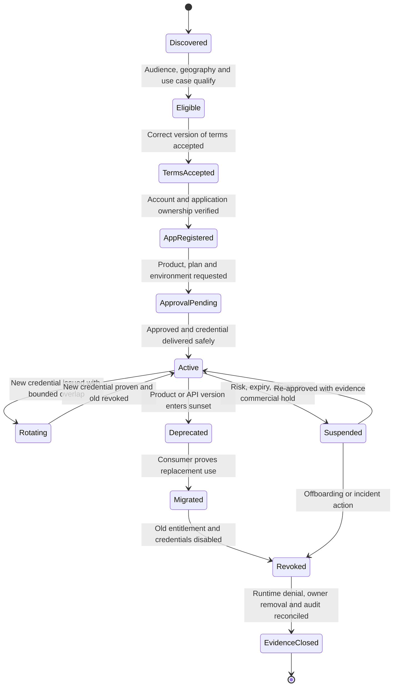

# Developer portal and API products

<!-- study-contract: principal -->

| Study field | Value |
|---|---|
| Artifact type | comparative-study |
| Decision question | Which portal/product model can operate discovery-through-offboarding consistently across gateway environments with secure identity, entitlement and evidence? |
| Decision owner | API Platform Steering Committee, with API product leadership accountable for consumer outcomes and security accountable for credential controls |
| Primary audiences | Executives, API product leaders, enterprise/security architects, developers, platform/DevOps teams, support and partner operations |
| Scope | K-KON/K-SM, A-MGD/A-SHG, G-X/G-HYB and M-RTF; internal, partner, public and machine consumer lifecycle |
| Evidence state | Documented E1 product mechanisms and interpreted journey hypotheses; no observed usability, accessibility, revocation or operating result |
| Reference case | Synthetic RE-1, especially J-03 and I-03; all numeric inputs are scenario assumptions |
| As-of date | 2026-08-17 for volatile portal, product, identity and entitlement claims |
| Next gate | API Product and Security Review after full lifecycle E3 journeys, accessibility review and export/rebuild evidence |

## Provisional answer

The current evidence establishes differentiated product models, not a preferred portal. Konnect v3, APIM, Apigee and Anypoint all document credible discovery and access journeys, but their catalog scope, app ownership, credential model, product semantics and automation boundaries differ; K-SM portal fit remains deliberately unknown. Confidence is medium for mechanism mapping and low for consumer/operating outcomes. Selecting on appearance or time-to-first-demo could leave active orphan credentials, documentation/runtime drift, a non-revoking “unpublish” action or a custom workflow service more complex than the portal it supplements.

## Decision question

Which portal/product archetype, once its unresolved edition, identity, workflow and runtime fields are fixed at Gate 1, can operate the full internal, partner and public consumer lifecycle—from trustworthy discovery to provable offboarding—**while keeping product entitlement, application identity, runtime enforcement, documentation and support state consistent across multiple gateway environments**?

A polished catalog and successful “try it” request are weak evidence. The hard parts are eligibility, legal terms, approval segregation, non-exportable secret delivery, multi-owner applications, credential rotation, environment promotion, product change, analytics privacy, revocation latency and exit.

## Deployment archetypes in scope

| ID | Bounded portal/product archetype—not yet an exact option | Boundary to prove |
|---|---|---|
| K-KON | Konnect Dev Portal v3, API Catalog and application registration tied to Konnect-managed APIs/control planes and customer-operated DPs | Konnect hosts portal/control records; runtime enforcement occurs at DPs. Portal supports internal, partner and public patterns, OIDC/SAML access, teams/RBAC, APIs/packages and self-service apps. [Konnect Dev Portal](https://developer.konghq.com/dev-portal/) |
| K-SM | Self-managed Kong hybrid plus the **exact licensed self-managed portal/catalog capability proposed by the vendor** | Do not infer Konnect v3 parity. Publishing, application registration, identity integration, credential store, automation, support and upgrade boundaries require variant-specific evidence before scoring. |
| A-MGD / A-SHG | Azure API Management service developer portal, products, groups/users and subscriptions serving APIs on managed and/or self-hosted gateways; optional API Center portal considered only for broader inventory | APIM portal is instance-scoped for consumption and subscriptions; API Center can provide multi-gateway discovery but does not provide the same subscription/usage functions. [Microsoft's portal comparison](https://learn.microsoft.com/en-us/azure/api-management/developer-portal-overview) |
| G-X / G-HYB | Apigee integrated portal/catalog, API products, developers/AppGroups, apps and credentials serving managed or hybrid runtimes | Control/product/app records are managed through Apigee services; runtime location does not relocate portal identity and lifecycle control. [API product model](https://docs.cloud.google.com/apigee/docs/api-platform/publish/create-api-products) |
| M-RTF | Anypoint Exchange/public portal plus API Manager API instances, client applications, contracts and SLA tiers; API Community Manager only if its additional Salesforce/community operating model is explicitly in scope | Asset discovery/documentation, API instance, contract, client provider and runtime policy are distinct objects. [Client application and contract model](https://docs.mulesoft.com/api-manager/latest/api-contracts-landing-page) |

## Option resolution state—Gate 1 blocker

These lifecycle models are bounded archetypes, not exact portal products. This page may support E1 research and the common lifecycle protocol, but it cannot support a portal score, ranking, finalist recommendation or claim of managed/self-managed parity until the edition, portal, identity, workflow, credential, runtime and support objects below are fixed in the option contract.

| Option ID | Unresolved portal/product option fields | Current resolution state | Gate-1 rule |
|---|---|---|---|
| K-KON | Konnect subscription/region; Dev Portal/Catalog service version policy; APIs/packages/application-auth strategy; OIDC/SAML/DCR/workflow; analytics; DP version; data location and support | **Unresolved—E1 archetype only** | Block scoring until the hosted portal-to-runtime lifecycle and contracted regional boundary are fixed. |
| K-SM | Current self-managed portal/catalog product, edition and version; publishing/application/credential model; identity/workflow integration; upgrade/export/support terms | **Unresolved—capability not admitted** | Block scoring and do not infer Konnect v3 parity until a vendor-supported deployable offering is evidenced. |
| A-MGD | APIM tier/generation/region; portal build/version policy; products/subscriptions/groups/users; identity/workflow; API Center participation; analytics; support | **Unresolved—E1 archetype only** | Block scoring until portal, API Center and runtime-entitlement roles are separated and fixed. |
| A-SHG | A-MGD portal/control fields plus SHG image/gateway/workspace binding, local enforcement path and connectivity/offline behavior | **Unresolved—E1 archetype only** | Block scoring until cloud lifecycle state and every self-hosted runtime's enforcement state can reconcile. |
| G-X | Apigee organization/region; integrated portal implementation; developer/AppGroup/app/product model; identity/approval integration; credential provider; analytics; support | **Unresolved—E1 archetype only** | Block scoring until the complete consumer-state system and contracted features are fixed. |
| G-HYB | G-X portal/control fields plus hybrid release/runtime environment binding, synchronization/failure behavior and support responsibility | **Unresolved—E1 archetype only** | Block scoring until portal state and hybrid runtime enforcement are one testable option. |
| M-RTF | Anypoint edition/region; Exchange/public portal versus API Community Manager; API Manager/API groups/instances; client provider; SLA tier; RTF/runtime; monitoring; support | **Unresolved—E1 archetype only** | Block scoring until optional Salesforce/community and external credential dependencies are explicitly included or excluded. |

## Consumer lifecycle as a controlled state machine

**Figure DX-1 — Portal success is incomplete until runtime denial, ownership and audit reconcile.**

- **Depicted scope:** discovery, eligibility, terms, accountable application registration, approval, credential activation/rotation, suspension, deprecation/migration, revocation and evidence closure.
- **Excluded scope:** candidate-specific UI, legal wording, external identity/workflow/credential-provider internals, product object names, support journey details, timing thresholds and proof that any candidate automates every transition.
- **Diagram source, evidence state and as-of:** inline Mermaid lifecycle model authored by this study from the E1 product mechanisms cited below and RE-1 J-03/I-03; comparative interpretation and test oracle, no observed consumer journey; 2026-08-17.
- **Accessible equivalent:** the lifecycle proceeds Discover → Eligible → correct Terms → accountable App registration → Approval → Active. Active access can rotate, suspend or deprecate; migration or offboarding leads to Revoked, and closure occurs only after runtime denial, owner removal and audit reconcile. The journey-acceptance and failure-mode tables below give the textual controls and evidence for each transition.

**Figure interpretation:** DX-1 changes the portal gate from “registration succeeded” to “every lifecycle transition has an accountable actor, runtime effect, safe retry/recovery and evidence, ending in provable denial and ownership closure.”

**Figure limitation:** The state names are a common oracle, not vendor-native objects or proof of feature parity. External identity, workflow, credential and legal systems may own transitions, and manual-but-controlled steps must be measured rather than drawn as automatic.

Every transition needs an actor, authorization, precondition, runtime effect, notification, audit event, retry/idempotency rule and recovery path. Portal UI labels are not the state model.

## Mechanism-level comparison

| Lifecycle concern | K-KON / K-SM | A-MGD / A-SHG | G-X / G-HYB | M-RTF | Evidence that decides the criterion |
|---|---|---|---|---|---|
| Catalog scope and federation | Konnect v3 Catalog publishes OpenAPI/AsyncAPI and Markdown, can package APIs and expose internal/partner/public portals. K-SM parity is unknown until exact product evidence exists. | APIM portal discovers APIs/products in one APIM instance. API Center portal can span managed/unmanaged/multiple gateway inventories but lacks APIM portal subscription and consumer-usage functions. [Developer portal overview](https://learn.microsoft.com/en-us/azure/api-management/developer-portal-overview) | Apigee portal publishes products/APIs from its organization model; products group proxy operations, environments, scopes and quotas. | Exchange catalogs API and reusable asset types; public portals expose selected assets. API groups/instances and API Manager contracts link consumption to runtime. [Exchange public portals](https://docs.mulesoft.com/exchange/about-portals) | Search completeness against authoritative inventory, duplicate/version handling, ownership, audience visibility, stale/unmanaged API detection and export. |
| Product/package entitlement | Konnect APIs/packages and application auth strategies bind a published API to registration and runtime Consumers. Verify package-to-policy/quota semantics in the exact edition. | APIM product groups APIs, terms, subscription requirement/approval and optional subscription-count limit; product policy applies only on paths that actually use product-scoped subscription context. [Products](https://learn.microsoft.com/en-us/azure/api-management/api-management-howto-add-products) | Apigee product can constrain proxies/operations, environments, access level, OAuth scopes and quotas; an app credential gains approved product associations. [Managing products](https://docs.cloud.google.com/apigee/docs/api-platform/publish/create-api-products) | Contract binds a client application to an API/API-group instance, with optional SLA tier enforced by client/SLA policies. [Request access](https://docs.mulesoft.com/exchange/to-request-access) | Product change under load: add/remove API/operation, scope, plan and environment; prove runtime effect, existing-contract treatment, notification and audit. |
| Developer identity and audience | Portal visibility, auth, OIDC/SAML, IdP team mapping and developer RBAC can separate audiences in Konnect. Test deprovisioning and external identity claim change. [Developer RBAC](https://developer.konghq.com/dev-portal/developer-rbac/) | APIM local or federated identities and groups control portal/product visibility. Groups make products visible but do not by themselves prove runtime API authorization. [Developer groups](https://learn.microsoft.com/en-us/azure/api-management/api-management-howto-create-groups) | Developer/app/AppGroup and portal audience controls map users/teams to visible products; verify external IdP, account merge and organization boundary. | Anypoint accounts/SSO and Exchange visibility govern access; public portal login allows onboarding and credentials. API Community Manager adds a distinct external-community model if selected. | Joiner/mover/leaver across two partner organizations, renamed email/domain, team change, suspended IdP user, orphaned app and least-privilege administrator. |
| Application ownership | Konnect v3 supports individual/team-owned applications and API registration; automation uses portal management APIs. [Self-service registration](https://developer.konghq.com/dev-portal/self-service/) | Subscription ownership and developer account are related but APIM also permits standalone subscriptions. Microsoft notes standalone keys may be manually shared and group assignment is not direct. [Subscriptions](https://learn.microsoft.com/en-us/azure/api-management/api-management-subscriptions) | Apps associate developer or AppGroup ownership with one or more product-bearing credentials. Admins can approve/revoke at app/product level. [App registration](https://docs.cloud.google.com/apigee/docs/api-platform/publish/creating-apps-surface-your-api) | Client applications have owners; contract exists per application and API instance. Connected apps can automate apps they create with scoped access. [Connected-app automation](https://docs.mulesoft.com/api-manager/latest/manage-client-apps-connected-apps-concept) | Multi-owner operational model, owner departure, ownership transfer, service-account automation, duplicate application, name collision and who may view/reset/revoke credentials. |
| Credential issuance and rotation | Key auth and DCR strategies can issue credentials; in Konnect DCR, secret values are shown once and can be rotated with overlapping credentials. Custom DCR bridge becomes an enterprise-operated critical path. [DCR mechanics](https://developer.konghq.com/dev-portal/dynamic-client-registration/) | Subscription holds a pair of keys, enabling staged rotation, but keys are bearer secrets and expiry is not the same as token-based auth. Portal hiding/unpublishing does not invalidate keys. | App credentials include key/secret, product status and optional expiry; product association can be approved/revoked and new credentials generated. [Registering client apps](https://docs.cloud.google.com/apigee/docs/api-platform/security/registering-client-apps) | Client ID/secret is generated with app/instance access and used by enforcement policies; external client providers can be integrated/imported. [Contracts and credentials](https://docs.mulesoft.com/api-manager/latest/api-contracts-landing-page) | One-time secret display, storage handoff, dual-key overlap, rotation without downtime, maximum credential age, compromised-key revoke, DCR/IdP partial failure and secret absence from logs/support. |
| Approval and segregation | Konnect can require developer and app approval with portal roles; distinguish API access approver from portal publisher/admin. | Product can require approval, but custom workflow integration may be needed for risk/legal checks and dual control. Portal subscription state must map to runtime denial. | Product access levels and credential/product approval support controlled access; organization roles and APIs enable workflow automation. | Requests can be auto-approved or manually approved depending on SLA configuration; specific permissions govern contract approval. [Approve/reject access](https://docs.mulesoft.com/api-manager/latest/manage-client-apps-latest-task) | Requester cannot approve own high-risk access; duplicate/retried requests are idempotent; workflow outage/rejection has deterministic state; exception expires. |
| Documentation, sandbox and try-it | OpenAPI/AsyncAPI plus Markdown, pages and try-it can be published; verify environment endpoints and auth strategy are not production by accident. | Portal includes API docs, products, request access and test console; publishing has its own connectivity/dependency path. | Portal/API documentation derives from published spec/content; product visibility and app registration provide a consumer path. | Exchange asset portal supports documentation pages and API instances; Exchange API can automate docs/assets. [Exchange API](https://docs.mulesoft.com/exchange/exchange-api) | Contract/doc release matches runtime revision; examples contain no sensitive data; sandbox is representative but isolated; try-it uses least privilege and safe quotas. |
| Consumer analytics and support | Konnect provides application/portal analytics; reconcile dimensions and privacy with enterprise telemetry. | APIM portal can expose individual usage reports in supported tiers; built-in availability varies. Support workflow remains enterprise content/integration. | Apigee analytics dimensions can connect app/product/proxy usage; prove app ownership and data minimization. | API Community/Exchange plus API Manager/Monitoring can expose contract or app analytics depending on product/entitlement. | Consumer sees only own data; internal teams can trace support ticket to app/product/route without payload; analytics delay/retention is disclosed. |
| Automation and exit | Konnect APIs/Terraform can manage portal/catalog/apps; K-SM exportability remains exact-variant evidence. | REST/IaC manage products/users/subscriptions; developer portal code/content and APIM entities have different export/deploy paths. | Apigee APIs manage products, apps, developers and credentials, but secret values/history may not be exportable by design. | Exchange/API Manager APIs/CLI automate assets/apps/contracts; external-provider credentials add an external system of record. | Recreate portal structure, product definitions, visibility, non-secret app/contract inventory, workflow links and docs in an empty test org; document intentionally non-exportable secrets. |

## Journey-specific acceptance criteria

| Journey | Critical controls | Real-world edge cases |
|---|---|---|
| Internal developer | Workforce SSO, team-derived visibility, low-friction approved patterns, non-production credentials, ownership/on-call | Contractor expiry, team transfer, multiple business units, private API accidentally indexed, production key copied into test |
| Partner developer | Organization verification, terms version, named application owners, risk approval, sandbox, OAuth/mTLS onboarding, renewal | Partner merger/domain change, certificate chain rollover, delegated app admin, legal reacceptance, emergency suspension and appeal |
| Public developer | Accessible docs, anti-abuse registration, clear plans/quotas, consent/privacy, automated low-risk approval, scalable support | Bot accounts, disposable emails, leaked keys, quota gaming, geography restriction, vulnerable SDK/example, mass notification |
| Machine-to-machine platform consumer | Workload identity/DCR automation, no human secret courier, owner metadata, scoped entitlement, rotation API | Pipeline retry creates duplicate clients, owner service deleted, IdP succeeds while portal fails, old credential survives migration |
| Offboarding | Product/app/credential revoke, owner removal, cache propagation, evidence closure, data retention/deletion | Portal account deleted before apps transferred, hidden product still callable, stale runtime during CP outage, analytics/backup retention |

## Operational failure modes

| Failure mode | Unsafe symptom | Required control and test |
|---|---|---|
| “Unpublish” mistaken for revoke | API disappears from catalog but existing key still calls runtime | Separate discoverability, subscription/contract, credential and runtime-policy states; test each transition. APIM explicitly notes unpublishing a product does not invalidate keys. [APIM subscriptions](https://learn.microsoft.com/en-us/azure/api-management/api-management-subscriptions) |
| Orphaned application | Sole owner leaves; credential remains active with no accountable team | Require durable team/service ownership plus named contacts; periodic recertification; transfer before user deletion; automated orphan report. |
| DCR partial success | IdP creates a client but portal times out, so retry creates a second credential | Idempotency key/correlation, compensating delete/quarantine, reconciliation and secret handling that never replays a returned secret into logs. |
| Credential rotation race | Old key revoked before all replicas/configs accept new key, or both remain forever | Dual-credential bounded overlap, proof of new use, config propagation signal, forced old revoke and expiry alert. |
| Product edit changes existing consumers | Removing an operation or changing quota silently breaks contracted apps | Version/product change policy, impact inventory, notification, grandfather/transition decision and runtime canary. |
| Documentation/runtime drift | Portal advertises an operation, auth flow or error that runtime does not serve | Release-manifest binding and continuous synthetic contract checks against the published environment. |
| Approval self-service bypass | User joins an overly broad group or chooses an auto-approved SLA tier | Eligibility engine, segregation, least-privilege group mapping, high-risk manual gate, audit and periodic entitlement review. |
| Shared key destroys attribution | Standalone/team key is copied across workloads, making revoke and analytics high blast radius | Prefer per-application workload identity; where shared key is unavoidable, bound scope/age, inventory custodians and migration plan. |
| Portal outage blocks incident response | Runtime works but administrators cannot revoke or communicate | Out-of-band control API/runbook, emergency deny at runtime/edge, status communication and later audit reconciliation. |
| Multi-gateway identity fragmentation | Same partner receives unrelated app IDs/keys and inconsistent products per platform | Enterprise consumer/app registry with mapped platform IDs, canonical entitlement, synchronized lifecycle and clearly bounded credentials. |
| Terms/privacy evidence gap | Current terms displayed, but no proof which version an app owner accepted | Immutable terms version/hash, actor/time/application/product association, reacceptance policy and export. |
| Analytics privacy leak | Partner sees another partner's app/usage or sensitive URL dimensions | Tenant isolation test, dimension minimization/redaction, authorization test and disclosure of lag/retention. |

## Synthetic regulated-enterprise scenario—not observed evidence

This is the consumer/product slice of [RE-1, the enterprise reference case](41-enterprise-reference-case.md), centred on **J-03 partner payment initiation** and the onboarding implications of **I-03 certificate rollover/pinned CA**. It is synthetic and contains no observed onboarding time, portal quality score or vendor result.

**Scenario assumptions.** The partner structure, environments, credential model, terms, approvals and coexistence period below are journey inputs to be confirmed; they are not a documented customer implementation.

A regulated enterprise onboards a payment-technology partner to a versioned payment-initiation product. The partner has three application owners, separate sandbox and production workloads, OAuth client credentials bound to partner certificates, a contractual quota, Canadian residency terms and annual recertification. Production access requires security and product approval. A new API version changes one schema and scope; both versions coexist for six months. The partner later replaces its IdP client platform and one owner leaves during credential rotation.

| Exercise | Complication injected | Decision evidence |
|---|---|---|
| Discovery and eligibility | Unauthenticated user, internal employee and verified partner search the same catalog | Each sees only intended assets; product/version/audience/owner are accurate and accessible. |
| Application request | Same retry is submitted twice while approval workflow pauses | One logical app/request exists; approver cannot elevate scope beyond policy; terms/version and decision are auditable. |
| Credential delivery | IdP/DCR succeeds while portal response is interrupted | Secret is not leaked or displayed twice; orphaned client is reconciled; retry is safe. |
| Runtime proof | Sandbox credential is used against production and production credential against removed operation | Both are denied at runtime with attributable, sanitized reasons; portal approval alone is not treated as proof. |
| Version transition | Product exposes v1/v2 with changed scope/schema and a six-month window | Consumer impact, parallel entitlement, docs/examples, analytics and sunset notification stay consistent. |
| Ownership/rotation | One owner leaves; new client platform is introduced with dual credentials | Durable ownership remains; new credential is proven; old client/certificate/key is revoked within the defined window. |
| Control-plane isolation | Consumer revoke occurs while one runtime zone has stale configuration | Portal shows desired/effective distinction; local containment or exception path satisfies the decided objective. |
| Offboarding | Contract ends while audit and analytics retention continue | App/product/credential/runtime access is closed, owners notified, evidence reconciled and retained data follows policy. |

## Counterarguments and non-fit conditions

- **“We can build the missing workflow around any portal.”** Usually true, but the custom identity, approval, secret, product and reconciliation service becomes critical platform software with its own cost, SLO and audit burden.
- **“A single catalog means a single gateway.”** Discovery can be federated above multiple runtimes. Do not force runtime consolidation merely to simplify the portal.
- **“API keys are sufficient because traffic also uses OAuth.”** A subscription/app key may still drive product policy, quota or attribution. Its sharing, rotation and bypass semantics remain security decisions.
- **“Portal branding is developer experience.”** Brand matters, but time-to-first-safe-call, error quality, trustworthy docs, ownership transfer, credential automation and support resolution are stronger outcome measures.
- **K-KON is a non-fit** if Konnect-hosted portal/app metadata, auth integration or regional boundary violates mandatory requirements; **K-SM is a non-fit** until the exact portal capability and lifecycle are proven rather than inferred.
- **Azure API Management is a non-fit** if an instance-scoped portal plus separate API Center cannot deliver the required multi-gateway entitlement journey without a custom system the enterprise will not operate.
- **Apigee is a non-fit** if product/app sophistication exceeds actual use while increasing migration/credential coupling, or if control-plane data placement fails a gate.
- **MuleSoft is a non-fit** if Exchange/API Manager/API Community boundaries create more identity and operational complexity than the target journeys justify, or if exit from contracts/assets is not practical.

## Risks and limitations

- Product mechanisms are **E1 current official-documentation evidence**, reviewed 2026-08-17. They do not prove licensed entitlement, accessibility, workflow fit, identity-provider compatibility, regional data handling or runtime enforcement.
- K-SM portal capability is deliberately left **unknown** until the exact current self-managed offering, version and support terms are evidenced.
- No time-to-discover, time-to-first-call, approval duration, revocation latency, portal availability, accessibility conformance, consumer satisfaction or operating cost is claimed.
- Credential export may be unavailable by design. Exit evidence must distinguish non-secret inventory portability from intentional secret rotation/re-issuance.

## Decision implications and required next evidence

1. Select representative internal, partner, public and machine consumers; run the entire lifecycle, not only registration and a successful call.
2. Make application ownership, one-time secret handling, rotation, product-change impact, runtime revoke, multi-gateway mapping, terms evidence and offboarding mandatory gates.
3. Maintain a canonical enterprise API/product/app identity that maps platform-specific IDs without centralizing secret values.
4. Bind portal docs, product entitlement, native policy and runtime configuration to one release manifest; continuously test the published journey.
5. Compare the cost and risk of custom workflow/catalog integration explicitly. A smaller native portal plus a well-owned enterprise catalog may outperform a feature-rich but poorly integrated suite—and the reverse may also be true.

## Falsification and proof plan

The provisional answer is falsified if a portal-visible state cannot be reconciled with runtime entitlement, durable ownership and audit evidence, or if lifecycle recovery depends on manual secret handling. Evaluate the complete J-03 path with the same consumer roles and fault injections for every variant.

| Hypothesis to challenge | Symmetric procedure | Measure and acceptance threshold | Required artifact and reviewer | Decision impact |
|---|---|---|---|---|
| Audience controls and product semantics produce only intended discovery and runtime access | Use unauthenticated, internal, two partner and administrator personas; request permitted/prohibited products, operations, environments, scopes and plans | 100% of intended assets visible and 100% of prohibited assets hidden/denied; zero portal-only approval accepted by runtime without matching entitlement | Persona matrix, portal captures, product/app records, safe runtime traces; product security review | Visibility or enforcement divergence blocks the consumer model until identity/product mappings are redesigned. |
| Registration and approval retries do not create duplicate apps, credentials or contracts | Repeat the same application/access request across timeout, approval pause and IdP/DCR partial success | One logical application/request/contract; zero orphan active credentials; retry returns/reconciles state without redisplaying a secret | Correlation/audit records, IdP/DCR inventory, secret-delivery proof; IAM and platform review | Orphan/duplicate risk requires a compensating lifecycle service with owner/SLO/TCO or excludes automated onboarding. |
| Rotation, ownership transfer and revoke close access at runtime | Remove an owner, rotate client/CA with bounded overlap, revoke during connected and stale-runtime states, then offboard | Durable owner remains throughout; new identity is proven before cutover; old access meets the approved J-03/I-03 objective; zero active entitlement after closure | Identity/product/runtime inventories, synthetic denial, notifications and audit reconciliation; risk owner review | Inability to prove effective revoke fails a mandatory gate regardless of portal usability. |
| Version/product change and exit preserve accountable non-secret state | Run parallel v1/v2 scope/schema/product change; export catalog, docs, owners, apps/contracts and audit mappings; rebuild a minimal journey | 100% of in-scope non-secret entities classified as portable, transformed or recreated; all affected consumers identified; secrets explicitly re-issued rather than claimed portable | Consumer-impact report, entity reconciliation, export/rebuild runbook; architecture/procurement review | Hidden coupling or custom transformation changes exit risk and may make the candidate non-fit for a mandatory portability requirement. |

## Open evidence requests

| Evidence request | Owner role | Due gate | Decision impact if absent |
|---|---|---|---|
| Contracted portal/product/app/DCR/RBAC/workflow/API/export capabilities and regional data handling for each exact edition—including K-SM | Vendor technical lead + procurement | Before shortlist | Capability remains unknown; do not infer managed/self-managed parity or award a feature score. |
| Enterprise audience, product, application-owner, terms/consent, approval, secret-delivery, recertification and offboarding policy | Product management + IAM + legal/privacy | Before journey freeze | “Good developer experience” has no governable pass/fail definition. |
| Representative internal, partner, public and machine-consumer personas plus accessibility and support-service objectives | Developer relations/product + accessibility + service management | Before E3 execution | Journey results are not representative; qualitative UI preference cannot decide. |
| E3 end-to-end J-03, DCR partial-failure, I-03 rotation, stale-runtime revoke and export/rebuild artifacts | Portal/product engineering + independent security reviewer | Before recommendation | Consumer lifecycle remains E1 documentation evidence; no onboarding or revocation conclusion. |

## Next gate

The next gate is an **E3 consumer lifecycle test readiness review** chaired by API product management with IAM, security, legal/privacy, accessibility, service management, platform engineering and representative consumers. It passes only when lifecycle states and actor authorities are ratified, runtime/product mappings and one-time-secret rules are testable, persona fixtures are approved, accessibility/support objectives are defined, and exit scope is explicit. Passing authorizes journey testing; it does not select the richest portal.

Related studies: [API operations governance](29-apiops-governance.md), [security comparison](25-security-comparison.md), [observability comparison](31-observability-comparison.md), [operating model](33-operating-model.md), and [portal PoC](../poc/portal-tests.md).
