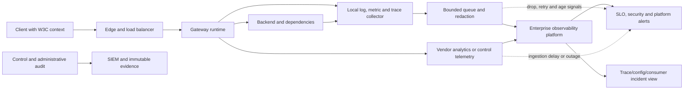

# Observability comparison

<!-- study-contract: principal -->

| Study field | Value |
|---|---|
| Artifact type | comparative-study |
| Decision question | Which signal architecture, once its unresolved product, collector, entitlement and retention fields are fixed at Gate 1, lets operators explain request, security, configuration and evidence failure across variants without exposing regulated data or trusting a single vendor view? |
| Decision owner | API Platform Steering Committee, with SRE accountable for SLO evidence and security accountable for telemetry data handling |
| Primary audiences | Executives, SRE/operations, platform and enterprise architects, security, developers, DevOps and audit |
| Scope | K-KON, K-SM, A-MGD, A-SHG, G-X, G-HYB and M-RTF; metrics, logs, traces, analytics, audit, SLOs, privacy and pipeline integrity |
| Evidence state | Documented E1 signal mechanisms plus interpretations/hypotheses; no observed completeness, latency, query, cost or incident result |
| Reference case | Synthetic RE-1, especially J-01 and I-01/I-04/I-05/I-06; all numeric inputs are scenario assumptions |
| As-of date | 2026-08-17 for volatile signal, gateway-type and entitlement claims |
| Next gate | SRE and Security Observability Review after common-schema E3 incident/failure runs and sensitive-data scanning |

## Provisional answer

No candidate yet proves the common observability contract. Kong offers flexible local Prometheus/OTLP paths with instrumentation gaps and cardinality choices; APIM differs materially between managed and self-hosted signals; Apigee combines strong API analytics with separate hybrid component visibility; Runtime Fabric combines sidecars, Anypoint services and customer cluster telemetry. Confidence is medium for source/mechanism mapping and low for completeness and incident usefulness. A wrong selection could present a green dashboard during stale configuration or regional silence, lose the rare money-movement trace that matters, or let telemetry backpressure impair request processing.

## Decision question

Which platform variant, once its deployable signal path is resolved, can let an operator answer, within the incident objective, **what failed, for whom, where, since which configuration, with what business and security impact, and whether the evidence itself is incomplete**—without exposing regulated payloads or making one vendor dashboard the only source of truth?

The assessment uses one signal and dashboard contract across candidates. Product-native analytics can add value, but it cannot redefine availability, error, latency or configuration freshness differently for each vendor.

## Deployment archetypes in scope

| ID | Bounded observability archetype—not yet an exact option | Signal boundary to prove |
|---|---|---|
| K-KON | Konnect SaaS analytics/control state plus customer-operated Kong DPs exporting local Prometheus and/or OpenTelemetry signals to enterprise collectors | Konnect and enterprise telemetry are complementary. Prometheus uses each node's Status API in Konnect deployments; high-cardinality metrics are optional. [Prometheus plugin](https://developer.konghq.com/plugins/prometheus/) |
| K-SM | Self-managed Kong hybrid CP/PostgreSQL and DPs with enterprise-operated metrics, logs, traces, audit and storage | Enterprise owns full signal pipeline, retention, capacity, CP/DP health and forensic availability. |
| A-MGD | Azure API Management managed gateway with Azure Monitor logs/metrics, Application Insights and optional Event Hubs export | Capability, lag, retention, sampling and data kind differ by tool and gateway type. Microsoft's current [observability matrix](https://learn.microsoft.com/en-us/azure/api-management/observability) is the E1 baseline. |
| A-SHG | Azure API Management self-hosted gateways with local structured logs and OpenTelemetry/StatsD metrics plus selected cloud telemetry | Self-hosted gateway currently does not send diagnostic logs to Azure Monitor; local logs/metrics and cloud paths must be designed separately. [Observability overview](https://learn.microsoft.com/en-us/azure/api-management/observability) |
| G-X | Apigee managed runtime with Apigee analytics, Cloud Monitoring/logging and enterprise export | Google operates runtime collection; enterprise owns normalized SLOs, privacy, downstream integration and query/retention decisions. [Apigee analytics overview](https://docs.cloud.google.com/apigee/docs/api-platform/analytics/analytics-services-overview) |
| G-HYB | Apigee hybrid 1.16 with per-node OpenTelemetry metric collection, hybrid component/log signals, API analytics and Cloud Operations | Runtime, Cassandra, ingress, Synchronizer, UDCA, analytics and Kubernetes signals are distinct; ingress-gateway metric coverage has documented limitations. [Hybrid metrics](https://docs.cloud.google.com/apigee/docs/hybrid/v1.16/metrics-collection) |
| M-RTF | Runtime Fabric with Anypoint Monitoring sidecars plus customer cluster monitoring/log forwarding/SIEM | Metrics are enabled by default; log/trace collection and export depend on subscription and connectivity. [Runtime Fabric monitoring](https://docs.mulesoft.com/runtime-fabric/latest/use-anypoint-monitoring) |

## Option resolution state—Gate 1 blocker

The signal boundaries above are archetypes, not exact observability stacks. This article may support E1 mechanism analysis and common-schema/test design, but it cannot support a criterion score, ranking, finalist recommendation, retention/privacy conclusion or cost comparison until the runtime, native-service, collector, destination and entitlement fields below are fixed. A link to a product dashboard does not resolve the end-to-end signal option.

| Option ID | Unresolved runtime and signal-stack fields | Current resolution state | Gate-1 rule |
|---|---|---|---|
| K-KON | Konnect subscription/region; DP/plugin versions; Prometheus/OTel choices; analytics tier/retention; local collector/exporter versions and storage; audit/support access | **Unresolved—E1 archetype only** | Block scoring until native and enterprise signal paths, loss accounting and cost are one versioned option. |
| K-SM | Kong/CP/DP/PostgreSQL/plugin versions; local metrics/log/trace/audit stack; collectors/storage/retention; cluster signals; support | **Unresolved—E1 archetype only** | Block scoring until the enterprise-operated forensic and pipeline boundary is fixed. |
| A-MGD | APIM tier/generation/region; Azure Monitor diagnostics; Application Insights/Event Hubs choices; sampling/retention; workspace scope; support and cost | **Unresolved—E1 archetype only** | Block scoring because gateway type, tier and configured destinations change evidence coverage. |
| A-SHG | Parent APIM tier; SHG image/digest; local log and OTel/StatsD configuration; optional cloud telemetry; collector versions/buffers; retention/support | **Unresolved—E1 archetype only** | Block scoring until local and cloud paths, restart behavior and gaps are reproducible. |
| G-X | Organization/runtime regions; analytics/debug/Cloud Operations configuration; export APIs/destinations; sampling/retention; IAM/support/cost | **Unresolved—E1 archetype only** | Block scoring until product analytics and operational/enterprise evidence are separated and fixed. |
| G-HYB | Hybrid release and supported cluster/components; per-node collectors; ingress/component metric limitations; UDCA/Cloud Operations; local logs/audit/storage; support | **Unresolved—E1 archetype only** | Block scoring until hybrid component, API-analytics and enterprise signal planes form one supportable stack. |
| M-RTF | Anypoint edition/region; RTF agent/runtime/sidecar versions; Monitoring/log/trace entitlements; customer collectors/SIEM; retention/export/support/cost | **Unresolved—E1 archetype only** | Block scoring until SaaS and customer-cluster telemetry responsibilities are contractually fixed. |

## Common telemetry contract

| Signal family | Required normalized fields | Questions it must answer |
|---|---|---|
| Request/RED | event time, gateway/region/zone, API/operation/route, environment, status class, outcome category, total duration, gateway duration, upstream duration, bytes, protocol, release/config ID | Is traffic failing or slow? Is time spent at edge, gateway, identity/policy or backend? Which release and zone are affected? |
| Security/policy decision | auth method, consumer/app pseudonymous ID, policy/control-profile ID, decision and internal reason code, rate/quota result, certificate/JWT metadata safe subset | Was a request denied intentionally or failed operationally? Which control made the decision without logging tokens or personal data? |
| Runtime/control health | component, version, ready/available replicas, saturation, queue/reconcile age, CP/DP channel, config hash/age, certificate/license expiry, datastore state | Can the runtime serve current policy? Are new replicas, changes and emergency actions possible? |
| Dependency | backend/IdP/vault/telemetry dependency ID, connect/TLS/DNS outcome, duration, retry/circuit state | Is the gateway the cause or the first observer of another failure? Are retries amplifying it? |
| Trace/context | W3C trace ID/span ID/flags, request ID, safe baggage policy, sampling reason, upstream correlation | Can one journey cross edge, gateway and services? Where does context break or get regenerated? |
| Administrative audit | actor/workload, action, object/scope, before/after reference or hash, source release, approval/exception ID, result, vendor-support access | Who changed access/configuration and did every intended runtime accept it? |
| Telemetry-pipeline health | records/spans/metrics produced, queued, retried, dropped, rejected and delivered; exporter/collector saturation; oldest item age; cardinality/series count | Is “no error” actually no traffic or lost evidence? How much and which data is missing? |
| Product/consumer | product/plan, application pseudonymous ID, quota window, contract/version and consumer-visible SLO | Which contracted consumers are affected, and can they see only their own data? |

Do not use raw URL, client IP, subject, token, certificate DN, header or payload as a default high-cardinality label. Retain only fields with an approved diagnostic purpose, classification, access model and cost budget.

## Signal flow and failure visibility

**Figure OBS-1 — Evidence is trustworthy only when the telemetry pipeline exposes its own loss and delay.**

- **Depicted scope:** client/edge/gateway/backend request flow; local signal generation and collection; bounded redaction/buffering; vendor-native analytics; enterprise observability; administrative audit/SIEM; SLO/security/platform alert and incident views; queue/drop/age health.
- **Excluded scope:** candidate-specific schemas and agents, durable audit implementation, sampling/retention values, storage/query architecture, data residency, network path, cost and any guarantee of lossless or non-blocking export.
- **Diagram source, evidence state and as-of:** inline Mermaid synthesis by this study from the E1 observability mechanisms cited in the archetype/comparison tables and RE-1 I-05; comparative interpretation, no observed completeness or isolation result; 2026-08-17.
- **Accessible equivalent:** Client → Edge → Gateway → Backend produces local metrics/logs/traces. A bounded redaction/buffer layer exports to the enterprise platform while vendor-native analytics is a separate input. Administrative audit goes to SIEM/immutable evidence. Alert and incident views consume those stores, and queue/drop/age plus native-ingestion failure must alert on evidence gaps. The common telemetry and mechanism tables provide the textual field definitions and per-candidate proof.

**Figure interpretation:** OBS-1 changes “the dashboard is green” into a three-part proof: request/business signals are normalized, native and enterprise views can be reconciled, and the pipeline declares queueing, drops, delay or silence as evidence failure.

**Figure limitation:** The figure is a required signal relationship, not a lossless architecture or claim of semantic parity. Buffer durability, audit separation, sampling, data handling, query lag and request-path isolation remain exact-option fields and E3 observations.

The telemetry pipeline is itself a production dependency for evidence, but request processing should not become unavailable merely because a non-mandatory remote analytics destination is slow. Backpressure, buffer bounds and loss disclosure are therefore design decisions, not implementation details.

## Mechanism-level comparison

| Mechanism | K-KON / K-SM | A-MGD / A-SHG | G-X / G-HYB | M-RTF | Required comparative proof |
|---|---|---|---|---|---|
| Gateway metrics | Prometheus plugin exposes node/system and optional request/status/latency/bandwidth/upstream metrics; optional status/latency/per-consumer metrics can create high cardinality and performance cost. Konnect requires Status API rather than Admin API for scrape. | Managed gateway supports Azure Monitor metrics; A-SHG can emit local StatsD or OpenTelemetry metrics and optionally Azure Monitor, depending on deployment/configuration. Microsoft documents OpenTelemetry as metrics for self-hosted gateway. [SHG OpenTelemetry example](https://learn.microsoft.com/en-us/azure/api-management/how-to-deploy-self-hosted-gateway-kubernetes-opentelemetry) | Apigee analytics exposes API metrics/dimensions; G-HYB OpenTelemetry collector scrapes component metrics to Cloud Operations. Hybrid provides proxy/target metrics plus component metrics, but ingress gateway metrics are documented as unsupported in the hybrid metrics view. [Available hybrid metrics](https://docs.cloud.google.com/apigee/docs/hybrid/v1.16/metrics-view) | Monitoring sidecar collects app/gateway metrics; customer cluster monitoring covers Kubernetes/node/ingress. Custom metrics and subscriptions affect capacity/availability. | Same valid/denied/failed request set; reconcile counters by route/outcome/zone; verify gateway versus upstream latency semantics; quantify series count and scrape/export loss. |
| Logs | Gateway access/error logs and logging plugins/OTLP logs can be local; OpenTelemetry logging does not guarantee every Nginx low-level log, so error file/container capture still matters. [Kong OpenTelemetry plugin](https://developer.konghq.com/plugins/opentelemetry/) | Azure Monitor resource logs/Application Insights/Event Hubs are available by model/config; A-SHG local standard/syslog/JSON output is separate. Payload/header logging is configurable and high risk. [APIM monitoring](https://learn.microsoft.com/en-us/azure/api-management/monitor-api-management) | G-X/G-HYB provide runtime/application analytics and Cloud logs; hybrid logger/component logs plus Kubernetes audit/event data require correlation. | RTF log forwarding to Anypoint and enterprise collection depend on plan/version/egress; application and platform logs have different owners. | Structured schema, UTC/event time, request/config IDs, redaction before external export, multiline/exception handling, rotation, collector outage and support-bundle completeness. |
| Distributed traces | Kong OpenTelemetry plugin supports W3C and other propagation formats, OTLP/HTTP export and gateway instrumentations. Cache-hit responses from Proxy Cache Advanced are documented as not traced. | Application Insights supports request telemetry; A-SHG OpenTelemetry documentation currently establishes metrics, not blanket full-trace parity. Prove exact W3C propagation and span production per gateway type. | Apigee debug/analytics and Cloud Trace integrations are not assumed equivalent to arbitrary OTLP spans. Prove context propagation through proxy policies and backend, plus safe debug controls. | Anypoint Monitoring can collect traces for RTF when enabled/entitled; enterprise tracing must correlate through Mule/API gateway and downstream services. | W3C valid/invalid/multiple headers, sampled/unsampled decision, async/retry spans, cached response, gRPC/WebSocket, error, cross-region and trace-log correlation. |
| Native analytics | Konnect analytics can provide service/route/application views; enterprise local telemetry remains necessary for isolated runtime and cross-platform SLOs. | Built-in analytics, Azure Monitor dashboard, Application Insights and reports differ in lag/retention/model. Microsoft plans retirement of classic-tier built-in dashboard/reports in March 2027, so the Azure Monitor path needs priority. [Monitoring guidance](https://learn.microsoft.com/en-us/azure/api-management/monitor-api-management) | Apigee has mature API analytics dimensions/reports and daily data export APIs. Runtime operations and business analytics are different signal planes. [Metrics/dimensions reference](https://docs.cloud.google.com/apigee/docs/api-platform/analytics/analytics-reference) | API analytics/Monitoring/Visualizer and Exchange/API Manager views cover different concerns; confirm plan, retention and external export. | Reproduce common dashboard/query; measure data lag, dimension fidelity, retention/export, role isolation and a historical incident investigation. |
| Control/runtime health | CP/DP last seen, config hash/sync status and certificate expiry are available through Kong metrics/control views; controller and DB signals remain additional for K-SM/KIC. | Azure control status, gateway heartbeat and local Pod/readiness/config state must agree. Lost SHG connectivity stops cloud status/config/telemetry even when proxying continues. | G-HYB requires component, Synchronizer contract, Cassandra, UDCA, watcher, ingress and Kubernetes health; G-X uses service/instance/environment status. | RTF agent/control state, Kubernetes resources, application readiness and API Manager registration must correlate. | Block control link, restart one replica and deploy a config change; dashboard distinguishes current/serving, stale/serving and unavailable. |
| Audit/SIEM | Konnect or self-managed administrative audit plus Kubernetes/IaC audit must join to release identity. | Azure Activity/diagnostic/API Management logs have different scopes and retention; workspace aggregation must preserve workspace identity. | Google Cloud audit/Apigee admin events plus hybrid Kubernetes audit must be joined. | Anypoint audit supports UI/API and optional telemetry export. Duplicate exported entries share a unique audit ID and large payloads can be truncated. [Anypoint audit](https://docs.mulesoft.com/access-management/audit-logging) | Human, workload, failed, approved, break-glass and vendor-support actions; export interruption; deduplication; immutable retention; source-to-runtime acceptance chain. |
| Isolation and buffering | Local enterprise collection can continue independent of Konnect if designed; Konnect analytics gap/billing telemetry path remains separate. | A-SHG local logs/metrics can remain; cloud telemetry is lost/delayed. Microsoft warns Application Insights in-memory buffering does not guarantee all SHG telemetry is pushed. [Application Insights integration](https://learn.microsoft.com/en-us/azure/api-management/api-management-howto-app-insights) | G-HYB collectors send outward; establish local observability and exact buffer/loss semantics during Google path outage. | RTF monitoring sidecar requires regional ingestion egress; customer collection may remain local if explicitly implemented. | Bounded isolation under normal and burst load; count produced/delivered/dropped; cold restart; recovery surge; no request-path collapse. |

## Normalized SLO and alert contract

Vendor metrics must be mapped to these meanings with a versioned adapter. A missing mapping remains `unknown`; it is not approximated silently.

| Objective/signal | Normalized definition | Important partitions | Alert evidence |
|---|---|---|---|
| Eligible request availability | Successful eligible requests divided by all eligible requests. Policy denials, invalid clients and deliberate quota outcomes are reported separately rather than masking platform errors. | API/operation, region/zone, release/config, backend, consumer class | Fast/slow burn against an approved SLO; sample trace and top normalized failure reasons |
| End-to-end latency | Client-observed duration for successful eligible requests, with gateway and upstream components reported separately only where semantics are verified | Protocol, payload class, region, cache result, backend | p50/p95/p99 plus traffic volume; no average-only alert |
| Gateway error taxonomy | TLS/listener, routing, authentication dependency, policy denial, policy execution, rate state, upstream connect/TLS/timeout, backend response, internal runtime | Release/config, runtime version, plugin/policy, zone | Error-rate change and absolute impact; mapped internal code, safe external response |
| Configuration freshness | Current approved release/config ID compared with effective runtime ID and age | Every runtime/cluster/region | Stale/missing/partial runtime, CP channel state, last successful reconciliation |
| Saturation | CPU, memory, connections, worker/event loop, queues, file descriptors, NAT/ports and state-store pressure appropriate to implementation | Node/pod/DP/CP/store/zone | Headroom and trend with traffic; scale action and constraint reason |
| Certificate/license/key freshness | Time to expiry/rotation plus active old/new material and validation result | Listener, CP/DP, backend, IdP, plugin/license | Multi-window expiry alert, failed synthetic handshake, rotation state |
| Telemetry integrity | Produced versus accepted/delivered/dropped plus oldest queued item and series/cardinality budget | Signal type, collector/exporter, destination, zone | Drop/reject/queue-age and sudden-silence alert independent of API success |
| Consumer impact | Affected product/app count and traffic, using pseudonymous identifiers | Product/plan/audience/partner | Authorized incident responders can identify and notify affected owners without broad secret/PII access |

## Redaction and cardinality decision table

| Field | Default treatment | Allowed diagnostic use | Prohibited use |
|---|---|---|---|
| Authorization, cookies, API keys, client secrets | Drop before serialization | None; record auth method, safe credential ID/hash and decision | Raw value in log, trace, metric label, support bundle or error |
| Request/response body | Off | Time-bound, approved, sampled debug in a restricted store with field redaction and owner | General analytics, default trace attribute or long-term production log |
| URL/query | Route template and allow-listed parameter names only | Approved low-cardinality business operation code | Full query with account, token, search text or identifiers |
| Client/app/subject | Pseudonymous stable ID with access control | Per-consumer impact/support and abuse investigation | Email/name/DN/raw subject as metric label or broad dashboard field |
| Client IP/geography | Minimize, truncate/hash or derive coarse region according to policy | Security/abuse and network diagnosis in restricted view | General product analytics without purpose/retention approval |
| Error detail | Normalized reason code; raw stack in restricted runtime log | Debug by authorized operators | Stack, internal host or policy secret in client response |
| Trace baggage | Deny by default; allow-list small safe keys | Tenant-independent correlation or sampling hint | Identity/token/payload propagation across trust boundaries |

## Operational failure modes

| Failure | Misleading dashboard symptom | Required control and test |
|---|---|---|
| Telemetry exporter backpressure | API latency rises or workers exhaust while remote observability is slow | Async bounded queue, timeout/circuit, resource isolation, drop policy and self-metrics; load test destination throttle. |
| Cardinality explosion | Monitoring cost/ingestion jumps, queries slow, collector OOMs after new consumer/URL label | Label allow-list, route templates, series budget, per-consumer sampling/aggregation and pre-production cardinality test. |
| Sampling hides rare financial error | Aggregate latency looks healthy; lost-response/duplicate-risk path has no trace | Tail/error/decision-aware strategy where supported, exemplar/request ID in logs, deterministic synthetic transaction and explicit unsampled evidence. |
| Clock skew/out-of-order delivery | Trace appears to call backend before gateway; incident timeline contradicts audit | NTP/clock alerts, event and observed timestamps, ingestion-lag field and ordering logic that does not trust arrival time. |
| Context spoofing/collision | Attacker injects trace ID/baggage used as trusted identity or overwhelms storage | Validate/regenerate at trust boundary as designed, separate correlation from authorization, bound header/baggage size and fields. |
| Redaction regression | New policy/plugin logs token or payload during an error path | Golden sensitive-input tests across success/failure/debug, pipeline DLP scanning, restricted raw store and immediate purge/revoke runbook. |
| Partial regional silence | Global aggregate looks normal because other region carries traffic | Per-region/zone expected-traffic and heartbeat/config alerts; absence detection; failover annotation. |
| Control-plane view stale | Portal says DP healthy based on old heartbeat while runtime serves old config or is gone | Display last observed time/config identity and independently probe request path; never collapse “last seen” into “healthy.” |
| Analytics and operational metrics disagree | Different sampling, lag, time window or outcome taxonomy creates contradictory totals | Document source purpose, reconcile normalized fixtures, preserve raw counts/lag and choose one SLO source with reasons. |
| Recovery flush storm | Buffered records flood collector/network after outage, causing new loss or runtime pressure | Rate-limited drain, priority, queue age visibility, capacity reservation and tested recovery under live traffic. |
| Audit export duplicates/truncates | SIEM counts duplicate admin changes or loses critical before/after details | Stable event ID dedupe, payload-size monitoring, source audit retention and independent configuration hash/reference. |

## Synthetic regulated-enterprise scenario—not observed evidence

This is the observability slice of [RE-1, the enterprise reference case](41-enterprise-reference-case.md). It uses journey **J-01 confirmed money transfer** and failures **I-01 lost response/duplicate risk**, **I-04 noisy neighbour**, **I-05 telemetry backpressure**, and **I-06 regional failover/stale data**. It is synthetic; there are no measured vendor results.

**Scenario assumptions.** The transaction behaviour, concurrent cardinality burst, exporter throttling and failover condition below are controlled test inputs to be confirmed; they are not an incident record or measured product behaviour.

A mobile client submits a non-idempotent transfer. The backend commits the transfer but the client loses the response. At the same time, another API creates a high-cardinality burst and the remote telemetry destination throttles. Traffic fails over to a second region whose gateway may have a different configuration age. Operators must determine whether the transfer committed, whether retry is safe, which consumers are affected, what config ran, and how much telemetry is missing—without viewing account details or credentials.

| Exercise | Evidence question | Pass/fail threshold to define before testing |
|---|---|---|
| Correlated J-01 trace | Can operator traverse edge → gateway → backend and locate the durable idempotency/transaction outcome using safe IDs? | Required hops/fields, query time and authorized roles; do not invent a value here. |
| I-01 lost response | Does gateway distinguish upstream commit/response loss from pre-backend failure, and preserve a safe correlation path? | Required normalized error and backend confirmation evidence; client response remains sanitized. |
| I-04 noisy neighbour | Does one route/consumer's cardinality/load obscure or impair the payment route? | Isolation, series/resource budget and consumer-impact view set by SRE/security. |
| I-05 telemetry backpressure | Do requests remain within the approved degradation policy while collectors report queue, drop and recovery? | Maximum request impact, buffer age/loss and reconciliation requirement set before run. |
| I-06 failover | Does second region expose effective config/data freshness and receive context consistently before traffic? | Configuration/data staleness and readiness gate defined by resilience owners. |
| Redaction suite | Do valid, denied, timeout, debug and malformed paths keep tokens, cert identities and payment data out of all outputs? | Zero prohibited-field occurrences in searched test stores/support bundle. |
| Evidence reconciliation | Can operators state which time window/signal types are incomplete and reconcile request/audit counts? | Explicit completeness report and bounded unexplained delta approved before run. |

## Counterarguments and non-fit conditions

- **“OpenTelemetry support means vendor-neutral observability.”** Signal types, semantic attributes, exporter protocol, sampling, instrumentation gaps and licensed topology still differ. Portability requires a tested normalized schema and backend.
- **“Native analytics is more complete than raw telemetry.”** It may provide valuable product dimensions, but aggregation, lag and retention can make it unsuitable as the only incident/SLO source.
- **“Logging every payload makes debugging faster.”** It creates security, privacy, cost and insider-risk exposure. Deterministic correlation, safe metadata and time-bound restricted debug are stronger controls.
- **“Telemetry loss should fail API traffic.”** Usually not; it can turn an observability outage into a business outage. If a regulated flow requires evidence before processing, that must be an explicit business control with a designed local durable path—not accidental backpressure.
- **Kong is a non-fit** if required dimensions/traces demand unsafe high-cardinality configuration or custom plugins the enterprise cannot operate, or if Konnect/local evidence cannot be reconciled.
- **Azure API Management is a non-fit** if the selected gateway type's logs/traces/export cannot satisfy the contract without unsupported assumptions; A-MGD and A-SHG must not share an inferred parity score.
- **Apigee is a non-fit** if analytics/Cloud Operations data placement, lag/export or hybrid component visibility fails mandatory evidence requirements despite strong product analytics.
- **MuleSoft is a non-fit** if monitoring/export entitlement and control-plane connectivity create an unacceptable evidence dependency or if integration-flow signals cannot be separated from gateway SLOs.

## Risks and limitations

- Product mechanisms are **E1 current official-documentation evidence**, reviewed 2026-08-17. They do not prove the target subscription, region, retention, ingestion capacity, query performance, support access or enterprise configuration.
- No telemetry completeness percentage, ingestion lag, query time, cardinality capacity, storage cost, alert quality, trace coverage or incident-resolution time is claimed.
- OpenTelemetry implementation and semantic conventions evolve; exact gateway/runtime/plugin versions and emitted fixtures must be captured in E3 evidence.
- Public artifacts must contain sanitized schema, query and evidence IDs only. Real logs, traces, client identifiers, endpoints, payloads, support bundles and cost details belong in restricted stores.

## Decision implications and required next evidence

1. Ratify the common telemetry schema, error taxonomy, SLO source, redaction policy, cardinality budget and evidence-completeness report before product testing.
2. Reproduce the same dashboards and J-01/I-01/I-04/I-05/I-06 exercise on every Gate-1-resolved option; do not award parity from a documentation checkbox or transfer evidence between archetypes.
3. Make configuration identity/age, telemetry self-observation, sensitive-data regression, isolated-runtime visibility and audit-to-release correlation mandatory gates.
4. Cost the complete pipeline: gateway overhead, collectors/sidecars, network egress, ingestion, indexing, retention, queries, SIEM and on-call maintenance.
5. Preserve native analytics where it creates differentiated product insight, but export enough normalized evidence to operate cross-platform and execute an exit.

## Falsification and proof plan

The provisional answer is falsified if the common evidence contract cannot distinguish request, backend, configuration and telemetry-pipeline states without prohibited data, or if observability failure materially and unexpectedly impairs J-01. Native dashboards are retained, but they do not substitute for the same normalized fixtures.

| Hypothesis to challenge | Symmetric procedure | Measure and acceptance threshold | Required artifact and reviewer | Decision impact |
|---|---|---|---|---|
| A J-01 outcome is reconstructable across edge, gateway and backend after I-01 | Run valid, denied, pre-backend failure, backend commit/lost response and safe retry cases with W3C and malformed/spoofed context | All required hops/outcomes/config IDs in the approved evidence contract are queryable by authorized role; zero use of correlation identity as authorization; no prohibited payload/token fields | Sanitized trace/log/audit fixture, backend transaction evidence, query runbook; SRE and security review | An ambiguous committed outcome fails the financial-journey evidence gate even if aggregate SLOs look healthy. |
| I-05 backpressure is bounded, visible and isolated from request processing | Throttle each exporter/destination under normal and I-04 cardinality load, exhaust bounded queues, restart collector, then restore | Meets the pre-approved request-impact and resource envelope; produced/accepted/dropped/queued counts account for the run within the approved reconciliation rule; zero false “complete” periods | Load/fault timeline, collector self-metrics, gateway resource/SLO data, completeness report; observability platform review | Unexpected coupling requires pipeline isolation/redesign; undisclosed loss blocks evidence acceptance. |
| Redaction and cardinality controls hold across every error/debug path | Inject tagged synthetic secrets, identifiers and payload fields into valid, denial, timeout, malformed, debug and support-bundle cases; enumerate metric series | Zero prohibited-field occurrences across searched stores/exports; labels obey allow-list; series/resource budget remains within the pre-approved test envelope | DLP/search report, schema/series inventory, access-control evidence; privacy/security review | Any leak blocks progression, triggers purge/revocation analysis and forces a full regression rerun. |
| I-06 failover and stale configuration remain visible despite partial telemetry | Fail one region and native analytics path, send traffic only after readiness test, then reconcile local/vendor/enterprise/audit signals | Every serving runtime exposes effective config/age and region; absence is alerted; completeness report names every lost/delayed interval; unexplained delta stays within the approved rule | Failover timeline, config/readiness probes, signal-count reconciliation; resilience owner review | Traffic to unknown/stale state or an unbounded evidence gap fails the failover gate. |

## Open evidence requests

| Evidence request | Owner role | Due gate | Decision impact if absent |
|---|---|---|---|
| Exact edition/gateway/runtime/plugin signal matrix: metrics, logs, traces, analytics, audit, buffering, retention, export protocol and documented instrumentation gaps | Vendor technical lead + observability platform | Before E3 adapter design | Signal parity remains unknown; no completeness or cost score. |
| Contracted ingestion/retention/export, data-region, support-access and service-limit terms for vendor-native telemetry | Vendor + procurement + privacy | Before shortlist | Mandatory evidence/residency requirement may remain a non-fit regardless of local telemetry. |
| Approved common schema, error taxonomy, SLO source/objectives, redaction policy, cardinality/resource budget, sampling policy and completeness rule | SRE + security + privacy + product | Before test freeze | Comparative dashboards cannot produce an auditable pass/fail result. |
| E3 J-01/I-01/I-04/I-05/I-06, sensitive-data, signal-reconciliation and query-role artifacts | Observability engineering + independent incident responder | Before recommendation | No claim about traceability, backpressure isolation, loss or operational usability may exceed E1. |

## Next gate

The next gate is an **E3 observability contract and failure-test readiness review** chaired by SRE with security, privacy, observability engineering, platform operations, product and incident-management representation. It passes only when normalized meanings and source-of-truth choices are ratified, every sensitive field has a treatment, sampling/cardinality/loss budgets are approved, fixtures and failure injections are frozen, and restricted evidence access is ready. Passing authorizes signal testing; it does not imply that native analytics must be discarded or that one vendor has broader evidence coverage.

Related assets: [security comparison](25-security-comparison.md), [hybrid comparison](27-hybrid-multicloud-comparison.md), [performance and resilience](32-performance-resilience.md), [observability architecture](../architecture/observability-architecture.md), and [PoC observability tests](../poc/observability-tests.md).
