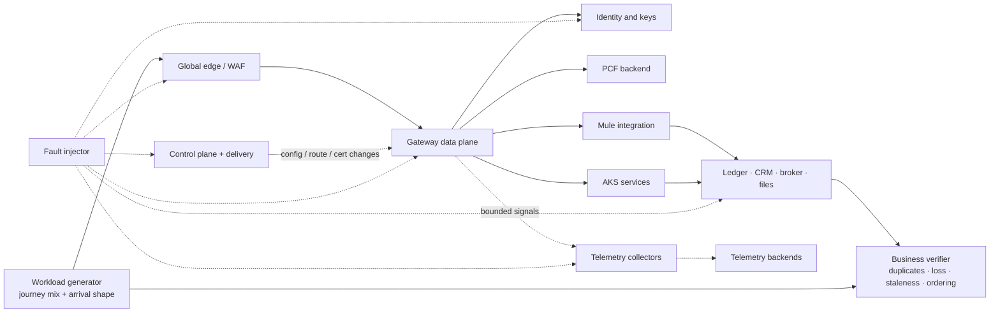
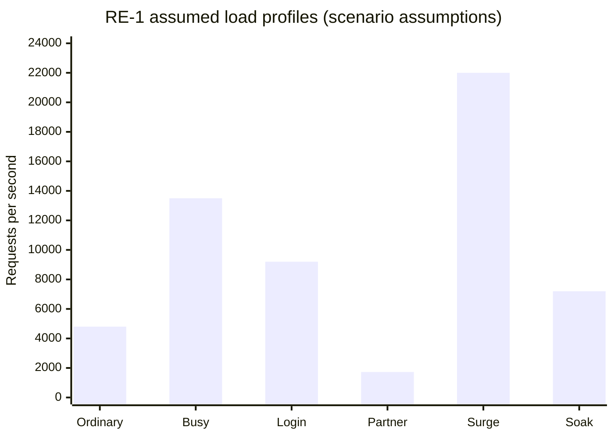
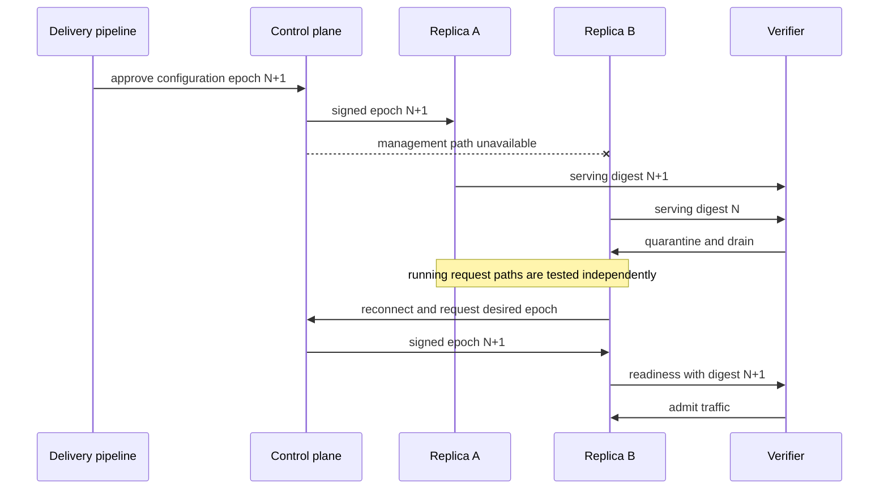
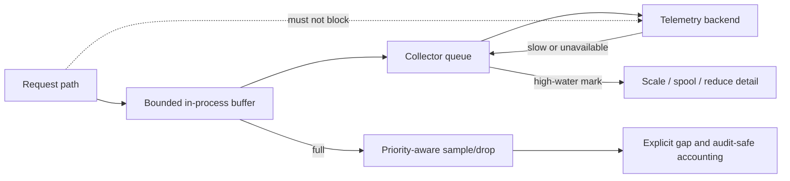
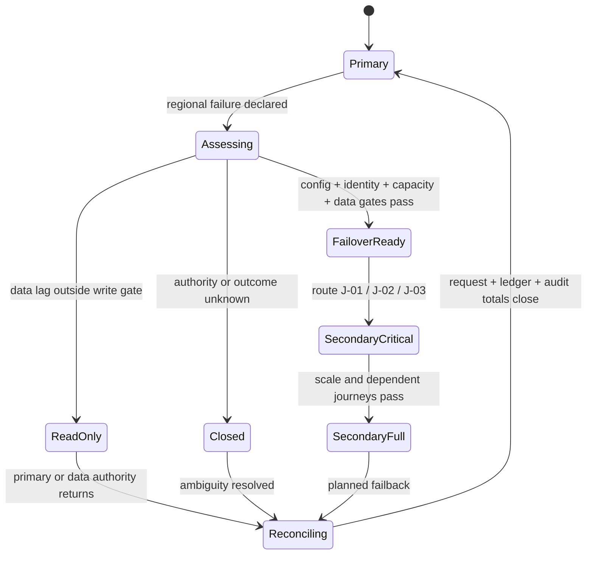

<!-- study-contract: principal -->

# Performance, capacity, and resilience under real failure

| Field | Value |
|---|---|
| Artifact type | principal-study |
| Decision question | Can a candidate API platform protect RE-1 critical journeys under realistic load and compound failure? |
| Decision owner | API-platform selection decision owner with the service and design authority |
| Primary audiences | Executives, platform and enterprise architects, developers, DevOps, SRE, security, operations, and FinOps |
| Scope | Shortlisted gateway deployment variants at their current supported release and entitlement; regional data planes; control plane, identity, counters, telemetry, Mule/PCF/AKS backends, and RE-1 production-shaped failure states |
| Evidence state | Documented mechanisms and scenario assumptions; no observed candidate result; platform fit remains a hypothesis |
| Reference case | RE-1, a synthetic regulated-enterprise case |
| As-of date | 2026-08-17; factual source-review metadata, not a scenario assumption |
| Next gate | Independent PoC review after comparable raw run bundles close mandatory business-safety and recovery scenarios |

## Provisional answer

No candidate is fit for the RE-1 critical tier on documentation or nominal throughput alone. The provisional answer is **conditional**: a candidate can proceed only if an equivalent policy chain preserves consumer-visible SLOs, business correctness, active-configuration truth, and recovery under the compound failures below. Confidence is high in the test boundary and low in any candidate-specific conclusion until reproducible runs exist. A false positive could admit duplicate transfers, stale policy, unsafe regional writes, or request-path collapse during telemetry failure.

The consequential question is:

Can a candidate API platform protect the critical journeys in the synthetic [RE-1 enterprise reference case](41-enterprise-reference-case.md) when traffic, dependency latency, management connectivity, configuration freshness, telemetry, identity, certificates, nodes, zones, and regions do not all behave normally?

This study rejects three weak substitutes for that answer:

- a vendor maximum-throughput claim without the RE-1 policy chain and dependency behavior;
- an HTTP success-rate test that omits business correctness, duplicates, stale responses, and audit completeness;
- a “high availability” architecture diagram without measured restart, scale-out, configuration, and recovery behavior during the failure.

> **Quantitative convention:** every number, percentage, duration, latency, volume, threshold, and monetary value in this article is a **RE-1 scenario assumption**. It is a test input or proposed decision guardrail, never observed evidence, a vendor benchmark, or a commitment. Actual run results belong in immutable test records and must not silently replace these assumptions.

## Mechanism analysis: what must remain true

The unit of reliability is a business journey. For J-01 money transfer, “good” means exactly one durable business outcome, not merely a successful gateway response. For J-02 account summary, “good” includes bounded freshness. For J-06 configuration propagation, “good” includes proof that the active data-plane digest equals the approved desired version.

**Figure PERF-1 — Resilience is proven across the complete request, control, dependency and business-verification system.**

- **Depicted scope:** workload generation, edge and gateway processing, identity, PCF/Mule/AKS backends, authoritative systems, control/configuration delivery, telemetry, fault injection and an independent business verifier.
- **Excluded scope:** candidate-specific topology, exact regions and capacities, data-replication design, product-native health semantics, support escalation and any achieved performance or availability result.
- **Diagram source, evidence state and as-of:** inline synthesis from the synthetic [RE-1 reference case](41-enterprise-reference-case.md), its journey/failure IDs and this study's evidence contract; architecture/test hypothesis with no observed candidate result; 2026-08-17.
- **Accessible equivalent:** the generator drives requests through edge and gateway components to PCF, Mule and AKS fixtures backed by authoritative systems; delivery changes configure the gateway, telemetry flows through collectors, and faults can target every major dependency. A verifier outside the request path reconciles generator intent, active configuration and authoritative business state. The journey-budget and result-record tables supply the measurable equivalent.

The verifier is intentionally outside the request path. It joins request IDs, business idempotency keys, ledger references, response hashes, configuration digests, event offsets, and audit sequence numbers to detect outcomes that gateway metrics alone cannot see.

**Figure interpretation:** The candidate gateway is only one component in the observed system. The independent verifier and authoritative systems are required to detect false success, duplicates, staleness, and missing audit; the figure does not prescribe a specific product topology.

**Figure limitation:** The logical harness does not establish which candidate exposes the required state, how dependencies are deployed, or whether any assumed SLO is feasible. Candidate-specific topology, run configuration, raw output and independent review remain mandatory.

## Scenario and assumptions: journey budgets

The end-to-end latency objective is decomposed before testing so that a gateway can neither consume the whole budget nor appear fast by immediately failing a slow backend.

**Every value below is a scenario assumption.**

| Journey | End-to-end p95 | Gateway-added p95 allocation | Dependency allocation | Queue and network allocation | Correctness condition |
|---|---:|---:|---:|---:|---|
| J-01 confirmed transfer | 800 ms | 35 ms | 650 ms | 115 ms | one accepted request maps to one ledger outcome |
| J-02 account summary | 350 ms | 25 ms | 260 ms | 65 ms | response freshness within 2 min |
| J-03 partner payment | 1,000 ms | 45 ms | 800 ms | 155 ms | partner identity and quota applied to the correct client |
| J-04 onboarding checkpoint | 3,000 ms | 40 ms | 2,500 ms | 460 ms | checkpoint is resumable after timeout or failover |
| J-05 settlement-file control API | 1,500 ms | 30 ms | 1,200 ms | 270 ms | accepted file has a durable processing journal |
| J-06 configuration propagation | 5 min | not applicable | 4 min | 1 min | approved digest equals active digest on intended replicas |

The assumed availability and recovery objectives are defined in the [reference case](41-enterprise-reference-case.md#journey-objectives). SLO alerting is evaluated against consumer-visible good events, following the mechanism in Google’s [official SRE guidance on SLO alerting](https://sre.google/workbook/alerting-on-slos/).

## Workload shapes

One average-load test is insufficient. The same generated request corpus is replayed across candidates, with deterministic variation for credentials, idempotency keys, payloads, cache state, and partner identity.

**All rates, mixes, and durations are scenario assumptions.**

| Profile | Arrival model and assumed load | Purpose | Hidden failure it must expose |
|---|---|---|---|
| L1 ordinary | open-loop, 4,800 requests/s, RE-1 journey mix | sustainable latency and unit resource cost | coordinated omission and client-side throttling |
| L2 busy hour | ramp to 13,500 requests/s and hold for 90 min | steady saturation, caches, connection pools, counter stores | slow memory growth and backend queue amplification |
| L3 login shock | token and consent slice rises from 19% to 46% for 8 min | identity dependency and key-cache stress | synchronized token refresh and introspection storm |
| L4 partner burst | partner slice peaks at 1,728 requests/s with 24 distinct quotas | tenant isolation and shared-counter behavior | one partner consuming global or another partner’s quota |
| L5 short surge | 22,000 requests/s for 3 min after a 2 min ramp | bounded queueing, load shedding, autoscale timing | accepting more work than dependencies can finish |
| L6 soak | 7,200 requests/s for 18 h with configuration and certificate changes | leaks, connection aging, log volume, counter expiry | failure that appears only after rotation or compaction |
| L7 large payload | assumed 1.5 MB p99 payloads isolated to onboarding routes | buffering, request limits, malware-scan handoff | large requests starving small critical requests |
| L8 degraded dependency | ledger latency and error injection while arrival rate remains open-loop | retry amplification and circuit behavior | a closed-loop client hiding dropped demand |

**Chart PERF-2 — Ordinary, identity, partner, surge and soak profiles exercise materially different bottlenecks.**

- **Depicted scope:** six synthetic RE-1 offered-load profiles expressed as requests per second: ordinary, busy, login shock, partner, surge and soak.
- **Excluded scope:** latency and payload distributions, concurrency, connection reuse, retries, duration beyond the profile names, infrastructure sizing, cost and any candidate throughput result.
- **Chart source, evidence state and as-of:** values from this study's RE-1 scenario-assumption workload table; synthetic planning inputs, not measurements or vendor benchmarks; 2026-08-17.
- **Accessible equivalent:** Ordinary 4,800; Busy 13,500; Login 9,200; Partner 1,728; Surge 22,000; Soak 7,200 requests per second. The preceding workload-shape table adds duration, mix change, primary stress and invalid shortcut for each profile.

**Chart interpretation:** The surge and traffic-mix shocks are materially different capacity questions; passing ordinary load cannot establish burst, identity-shock, or soak fitness. The chart is a scenario input, not a product comparison or achieved result.

**Chart limitation:** Requests per second alone cannot predict capacity or compare products because policy cost, payloads, connections, dependencies, telemetry and coordinated-omission controls remain unshown. Every value requires organization calibration before use as an acceptance threshold.

## Equivalent policy chain

Each candidate executes the same logical work, even if implementation differs:

1. terminate TLS and preserve trusted client identity;
2. validate token signature, issuer, audience, expiry, and required assurance context;
3. enforce client and product entitlement;
4. apply partner-specific and product-level quota using the declared consistency model;
5. validate route, media type, and bounded request size;
6. attach correlation and business idempotency context without overwriting caller values;
7. route to the same backend fixture with the same timeout budget;
8. map errors to the approved contract without masking backend commit ambiguity;
9. emit the same audit fields and an equivalent sampled trace;
10. expose the active configuration version and policy-bundle digest to the verifier.

Policies that require remote calls are tested cold, warm, slow, unavailable, and inconsistent. Caching a successful identity or entitlement response changes revocation exposure and is recorded as a design choice, not a free performance optimization.

## Capacity model

The capacity model is computed per journey and failure state, not only per gateway pod:

`required service rate = offered arrival rate × fan-out × retry multiplier ÷ accepted utilization`

`effective regional capacity = minimum(edge, gateway, identity, counters, integration, backend, telemetry-safe capacity)`

**All model inputs and thresholds below are scenario assumptions.**

| Dimension | Assumed guardrail | Why it matters |
|---|---:|---|
| gateway CPU at busy hour | ≤ 60% across the busiest zone | preserves zone-loss and burst headroom |
| request-worker saturation | ≤ 65% sustained | worker availability can fail before CPU appears full |
| memory | ≤ 70% working set with no unbounded growth in soak | avoids eviction and restart loops |
| backend connection pool | ≤ 75% active at busy hour | protects recovery and reduces queue collapse |
| shared counter latency | p99 ≤ 20 ms | central rate state can dominate gateway latency |
| telemetry CPU allocation | ≤ 12% of gateway allocation | request service must not fail with analytics export |
| one-zone-loss headroom | ≥ 30% after redistribution | ensures a second disturbance does not immediately saturate |
| warm-region capacity | ≥ 65% of busy hour immediately | critical journeys move before optional load |
| scale-to-full objective | ≤ 20 min | quota, image pulls, private DNS, and control plane are included |

Kubernetes recommends resource requests, replicas, and spreading across failure domains, while noting that disruption budgets constrain voluntary evictions rather than every failure or deployment action ([Kubernetes disruptions](https://kubernetes.io/docs/concepts/workloads/pods/disruptions/)). Microsoft likewise treats AKS zone and region design as explicit workload responsibilities; see [AKS reliability](https://learn.microsoft.com/en-us/azure/reliability/reliability-aks) and [multi-region AKS deployment models](https://learn.microsoft.com/en-us/azure/aks/reliability-multi-region-deployment-models).

## Failure campaign

Every experiment declares steady state, failure hypothesis, blast radius, abort, injection, observation, recovery action, reconciliation, and cleanup. A test is invalid if the generator stopped applying the offered load or if the business verifier cannot resolve outcomes.

**All timings, thresholds, and acceptable impacts are scenario assumptions.**

| ID | Injection | Required observations | Scenario success guardrail | Abort condition |
|---|---|---|---|---|
| F-CP-01 | block data-plane connectivity to the API control plane | existing proxying, active digest, config writes, analytics, license behavior | J-01/J-02 continue on running replicas; stale-config alarm within 2 min | unknown active configuration or audit loss for privileged change |
| F-CP-02 | while disconnected, restart one gateway replica | configuration source, certificate availability, readiness, traffic admission | replica stays quarantined until its digest equals the approved epoch | stale replica receives production traffic |
| F-CP-03 | while disconnected, request scale-out under L5 surge | scheduling, images, DNS, secrets, config bootstrap | inability to scale is explicit and load shedding protects J-01 | uncontrolled retry or critical dependency saturation |
| F-CFG-01 | publish version N+1, isolate one replica before receipt, then restore | per-replica digest, routing, reconciliation winner | mixed epoch is detected; stale replica drains before serving changed route | silent split-brain policy behavior |
| F-ID-01 | slow issuer discovery/JWKS then rotate signing key | cache age, unknown-key behavior, token failures, revocation exposure | new key accepted within assumed propagation gate; stale key expires by policy | fail-open authorization or all issuers blocked by one tenant |
| F-PKI-01 | roll leaf and intermediate certificates with mixed clients | served chain, process reload, old/new trust, connection reuse | both approved chains work during overlap; removal only after client evidence | partner authentication loss exceeds assumed 1% canary |
| F-NN-01 | consume CPU/memory with onboarding transforms on shared nodes | throttling, eviction, tail latency by journey | J-01/J-02 remain within their assumed error budgets | critical pod eviction or p99 breach for 5 min |
| F-TEL-01 | make trace and log exporters slow, then unavailable | queue fill, refused/export failures, disk, CPU, drop by priority | request latency stays within budget; audit is prioritized; gaps declared | telemetry queue causes request-memory pressure |
| F-ZONE-01 | remove the busiest zone at L2 busy-hour load | redistribution, connection drain, counters, pod placement | remaining zones carry load with assumed 30% headroom | second-zone saturation or loss of counter consistency |
| F-REG-01 | declare primary region unavailable while data replication is inside gate | global routing, identity, active digest, data role, duplicates | critical journeys restore within assumed RTO and reconcile ambiguous calls | traffic reaches secondary before data-readiness gate |
| F-REG-02 | repeat regional loss with data replication outside gate | routing decision and controlled degradation | transfers remain closed; permitted reads display bounded freshness | HTTP health alone promotes stale write path |
| F-SCH-01 | producer adds an enum value and optional field, then changes field meaning | schema lint, consumer contract, shadow comparison, DLQ | compatible change passes; semantic drift is blocked before production | unbounded DLQ or silent default mapping |

### Partial control-plane outage and stale configuration

**Figure PERF-3 — A serving replica is admitted by active-configuration attestation, not process health.**

- **Depicted scope:** approval of configuration epoch N+1, asymmetric delivery to two replicas, per-replica digest observation, quarantine/drain, reconnection, readiness and traffic readmission.
- **Excluded scope:** vendor-specific cache format and protocol, certificate/license bootstrap, load-balancer implementation, exact stale-age threshold, regional routing and observed recovery time.
- **Diagram source, evidence state and as-of:** inline E3 test sequence derived from RE-1 J-06/I-02 and the common state contract in this study; falsification hypothesis, not a description of observed candidate behavior; 2026-08-17.
- **Accessible equivalent:** the pipeline approves epoch N+1; replica A receives and reports N+1 while replica B remains on N after its management path fails. The verifier quarantines B, then admits it only after reconnection, retrieval of N+1 and a readiness report carrying the matching digest. The adjacent prose defines the additional signature, trust and dependency checks.

The readiness probe cannot be “process accepts TCP.” It includes config signature verification, epoch/digest equality, certificate validity, route dependency readiness, and counter/idempotency-store connectivity appropriate to the route class. If the product cannot expose these states, that is an operational limitation for the decision record.

**Figure interpretation:** A data plane may continue serving while replicas disagree about desired state. Traffic admission therefore depends on per-replica configuration attestation, not process health; the sequence intentionally excludes vendor-specific cache implementation.

**Figure limitation:** The sequence specifies required evidence but neither guarantees that a product exposes a digest nor dictates the quarantine mechanism. Restart, scale-out, cache loss, expiry and reconnect must be executed on each exact option.

### Non-idempotent transfer and ambiguous outcome

J-01 is tested with a lost response after the ledger commits. Automatic replay is disabled unless the client supplies a business idempotency key and the durable store proves the prior outcome. This follows HTTP’s warning not to retry non-idempotent requests automatically without knowing the request semantics are idempotent or that the original was not applied ([RFC 9110](https://www.rfc-editor.org/rfc/rfc9110.html)).

The test asserts all of the following:

- same key plus same canonical request returns the same business outcome;
- same key plus different request digest returns a deterministic conflict;
- an in-progress record cannot remain forever; a sweeper reconciles it to ledger truth;
- a regional retry consults an idempotency store with a recovery objective consistent with ledger commitment;
- route rollback stops new traffic but does not attempt to erase a committed transfer;
- reconciliation totals accepted, committed, rejected, ambiguous, compensated, and manually resolved outcomes to the generator ledger.

### Certificate rollover

Certificate issuance and serving are separate steps. cert-manager can renew a certificate and store it in a Secret, but the workload’s reload behavior still matters ([cert-manager Certificate resource](https://cert-manager.io/docs/usage/certificate/)). Kubernetes documents eventual propagation for mounted Secret updates and no automated update for `subPath` mounts ([Kubernetes Secrets](https://kubernetes.io/docs/concepts/configuration/secret/)). The campaign therefore verifies the chain actually served on new and reused connections, not merely the Secret’s timestamp.

### Noisy neighbour and priority inversion

The platform is tested with large onboarding transformations, batch replays, and low-priority analytics sharing a cluster. Namespace quota alone is not enough: node pools, pod priority, topology spread, CPU throttling, memory pressure, gateway worker pools, shared counters, and downstream connection pools can still couple workloads. The intended result is explicit isolation or controlled shedding, never accidental starvation.

### Telemetry backpressure

The OpenTelemetry Collector exposes queue capacity, queue size, enqueue failures, send failures, and receiver refusals; its documentation recommends production queue/retry mechanisms ([Collector internal telemetry](https://opentelemetry.io/docs/collector/internal-telemetry/)). The test makes those signals part of the platform SLO:

**Figure PERF-4 — Telemetry overload must shed evidence explicitly before it blocks request processing.**

- **Depicted scope:** request emission into a bounded in-process buffer, collector queue and telemetry backend; high-water actions, priority-aware sampling/drop and explicit gap accounting.
- **Excluded scope:** product-specific exporters, durable security/business audit storage, buffer sizing, sampling policy, disk-spool design, privacy controls and measured request impact.
- **Diagram source, evidence state and as-of:** inline failure-model synthesis from RE-1 I-05 and the [observability experiment contract](../poc/observability-tests.md); architecture hypothesis and required test behavior, not an observed loss or performance result; 2026-08-17.
- **Accessible equivalent:** request telemetry enters a bounded producer buffer and collector queue before export. A full producer buffer invokes priority-aware sample/drop; a collector high-water mark invokes scale, spool or reduced detail; a slow backend feeds pressure back only to the collector. Every shed item contributes to a declared evidence gap, while the request path is prohibited from synchronously depending on the backend.

Security and business audit events have a separately defined durability path; calling all telemetry “logs” and dropping it uniformly is unacceptable.

**Figure interpretation:** Bounded queues and priority-aware shedding keep exporter failure from propagating into requests, while an explicit gap prevents silent claims of complete observability. The figure does not imply that ordinary trace buffering satisfies durable audit requirements.

**Figure limitation:** This is a required failure boundary, not proof that one telemetry pipeline implements it or that dropping is acceptable for every signal. Exact buffers, audit durability, recovery drain and permitted request degradation require measured E3 evidence.

### Schema drift

An OpenAPI document provides a machine-readable HTTP interface description ([OpenAPI Specification](https://spec.openapis.org/oas/latest.html)), but schema validity does not prove consumer compatibility or semantic equivalence. The drift campaign includes:

- new optional field and unknown enum value;
- changed decimal scale and rounding boundary;
- absent versus explicit `null`;
- local timestamp versus UTC instant at daylight-saving boundaries;
- renamed error code with unchanged HTTP status;
- reordered event delivery and duplicate message;
- character normalization in customer names and payment references.

Shadow comparison normalizes only documented nondeterminism. A broad “ignore differences” rule makes the test meaningless.

## Regional failover decision state

**Figure PERF-5 — Regional promotion is gated by configuration, identity, capacity and data authority before critical writes resume.**

- **Depicted scope:** failure declaration, readiness assessment, failover-ready/read-only/closed branches, staged critical/full secondary service, reconciliation and return to primary.
- **Excluded scope:** DNS/global-routing mechanism, database technology and replication, writer fencing implementation, exact RTO/RPO, client convergence details and any tested failover result.
- **Diagram source, evidence state and as-of:** inline state model derived from RE-1 I-06 and the study's regional-loss proof requirements; vendor-neutral test oracle with synthetic assumptions and no observed recovery outcome; 2026-08-17.
- **Accessible equivalent:** after a regional failure, promotion proceeds only when configuration, identity, capacity and data gates pass. Excess data lag permits read-only service; unknown authority closes service. A ready secondary first serves critical journeys, then full traffic after capacity and dependencies pass; failback completes only after request, ledger and audit reconciliation.

Failover is not complete when DNS changes. Completion requires active configuration equality, identity/key readiness, dependency availability, data-role authority, capacity, consumer-visible SLO recovery, and reconciliation of accepted-but-unanswered work.

**Figure interpretation:** Regional recovery is a gated state transition, not a routing event. In particular, a healthy secondary endpoint cannot authorize writes when data authority or outcome state is unresolved.

**Figure limitation:** The state names do not define a deployable DR architecture or prove that every journey shares one recovery policy. Data ownership, fencing, dependency readiness, client convergence and thresholds must be fixed and exercised per exact option and journey.

## Result record and comparability contract

Each run record contains:

- immutable code, configuration, policy, container, chart, and test-harness versions;
- candidate topology, node/instance sizes, replica placement, quotas, and support tier;
- exact workload corpus, arrival schedule, payload distribution, credential distribution, cache state, and dependency-fault schedule;
- time-synchronized raw generator, gateway, platform, dependency, business-verifier, and cost signals;
- p50/p95/p99/p99.9 latency by journey and response class, throughput, offered versus completed load, saturation, queueing, retries, duplicates, staleness, loss, recovery, and reconciliation;
- deviation log, operator actions, failed instrumentation, and whether the run remained valid;
- scenario threshold disposition: met, conditionally met, not met, or indeterminate.

No candidate receives tuning help, warm caches, disabled telemetry, reduced policy, or a larger topology without an equivalent documented opportunity for the others.

## Decision gates

**All thresholds are scenario assumptions.**

| Gate | Pass condition | Hold condition |
|---|---|---|
| Baseline validity | offered load, business outcomes, and resource signals reconcile within assumed 0.1% | coordinated omission, missing verifier data, or unexplained outcome gap |
| Busy-hour capacity | all journey objectives met with assumed zone-loss headroom | aggregate throughput passes but a critical journey or dependency saturates |
| Failure containment | each injected failure stays inside declared blast radius | critical route affected by noisy neighbour, telemetry, or unrelated tenant |
| Recovery correctness | assumed RTO/RPO and reconciliation rules pass | HTTP recovers while duplicates, stale data, or audit gaps remain |
| Operational usability | on-call can identify active config, fault domain, consumer impact, and safe action within 10 min | recovery depends on vendor-only access or undocumented state |
| Economic fitness | cost per successful business transaction stays within the RE-1 guardrail under normal and degraded states | low nominal cost requires unsafe overcommit or omits dual-region/support cost |

## Counter-hypotheses and non-fit conditions

The method may be too conservative for low-consequence APIs, and a vendor-managed service may remove some operational work that this shared model exposes. Conversely, a candidate may pass an isolated laboratory run yet fail under production entitlement, network, identity, support, or scale limits. The provisional answer is falsified if a simpler supported architecture repeatedly meets the same journey, failure, recovery, and reconciliation conditions with lower operational risk. A candidate is non-fit for the critical tier if it cannot expose active configuration, bound retries/queues, isolate telemetry and tenants, preserve durable idempotency, or recover without unknown business outcomes.

## Decision implications

The study produces a scenario-specific disposition for each candidate:

- **fit:** assumptions met with repeatable behavior and supported operations;
- **fit with conditions:** bounded gap with an owner, funded treatment, expiry, and retest;
- **not fit for critical tier:** may serve lower tiers but fails a mandatory RE-1 journey or recovery condition;
- **indeterminate:** instrumentation, environment, or comparability was insufficient; no optimistic score is allowed.

The executable scenario portfolio is in [real-world PoC scenarios](../poc/real-world-scenarios.md).

## Official mechanism references

These sources explain mechanisms only; they do not validate scenario assumptions or candidate outcomes:

- [RFC 9110: HTTP Semantics](https://www.rfc-editor.org/rfc/rfc9110.html)
- [Kubernetes: Disruptions](https://kubernetes.io/docs/concepts/workloads/pods/disruptions/)
- [Kubernetes: Secrets](https://kubernetes.io/docs/concepts/configuration/secret/)
- [Microsoft: Reliability in AKS](https://learn.microsoft.com/en-us/azure/reliability/reliability-aks)
- [Microsoft: Multi-region deployment models for AKS](https://learn.microsoft.com/en-us/azure/aks/reliability-multi-region-deployment-models)
- [cert-manager: Certificate resource](https://cert-manager.io/docs/usage/certificate/)
- [OpenTelemetry Collector internal telemetry](https://opentelemetry.io/docs/collector/internal-telemetry/)
- [OpenAPI Specification](https://spec.openapis.org/oas/latest.html)
- [Google SRE Workbook: Alerting on SLOs](https://sre.google/workbook/alerting-on-slos/)

## Falsification and proof plan

All thresholds in this table are RE-1 scenario assumptions.

| Proof ID | Procedure | Measure | Scenario threshold | Evidence artifact | Independent reviewer |
|---|---|---|---|---|---|
| PERF-P1 | run L1/L2/L5 with the equivalent policy chain and fixed dependency fixtures | offered/completed load, journey latency, saturation, unit cost | journey budgets hold with assumed zone-loss headroom | immutable generator, platform, dependency, verifier, config and cost bundle | performance engineer outside candidate team |
| PERF-P2 | execute F-CP-01 through F-CFG-01 including restart and scale-out | active digest, traffic admission, propagation, operator action | no stale/unknown replica serves; reconciliation closes | per-replica timeline, signed config history and raw request record | platform SRE and security reviewer |
| PERF-P3 | lose the J-01 response after ledger commit and retry cross-region | ledger outcomes per key and unresolved age | exactly one outcome; assumed RTO/RPO and sweeper gate hold | generator/idempotency/ledger/audit reconciliation bundle | money-movement service owner |
| PERF-P4 | fail telemetry sinks, a zone, then a region with data both inside and outside gate | SLO burn, queue/drop, writer epoch, recovery and gaps | request/audit policy holds; no unsafe regional write | fault schedule, raw telemetry, data-role and reconciliation record | resilience reviewer plus data authority |

## Risks and limitations

- RE-1 traffic, cost, staffing, and recovery values are synthetic; real inventory and telemetry may change bottlenecks and tier decisions.
- Laboratory network, identity, support, license, and cloud quotas may not reproduce production behavior; a production pilot remains mandatory.
- Official documentation establishes mechanisms, not the tested topology, edition, entitlement, or operational outcome.
- A short successful failure injection may miss slow cache expiry, memory leakage, certificate ageing, consumer retry storms, and human fatigue.
- The study does not select a vendor and does not prove backend, ledger, identity, or data-platform resilience beyond the exercised boundary.

## Open evidence requests

| Request | Owner role | Due gate | Decision impact if unresolved |
|---|---|---|---|
| candidate-specific control-plane disconnect, cache, restart, scale-out and license behavior | Candidate technical owner | PoC design freeze | exclude critical-tier conclusion or mark indeterminate |
| production-equivalent identity, PKI, network and regional quotas | Enterprise IAM/PKI/network owners | environment readiness | defer resilience result because test boundary is non-representative |
| authoritative J-01 idempotency, ledger-status and reconciliation contract | Money-movement domain owner | critical-scenario execution | stop J-01 test and critical-tier approval |
| fully allocated normal/degraded cost model and support boundary | FinOps and sourcing | recommendation gate | prohibit economic ranking |

## Next gate

The independent PoC review may admit a candidate to a representative production pilot only when comparable raw bundles for mandatory scenarios are valid, business reconciliation closes, active-configuration truth is demonstrated, assumed critical thresholds are met or explicitly excluded from pilot scope, and security, SRE, domain, data, and FinOps reviewers record their disposition.
