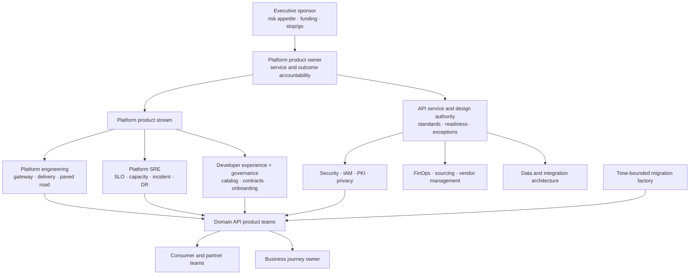
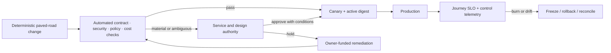
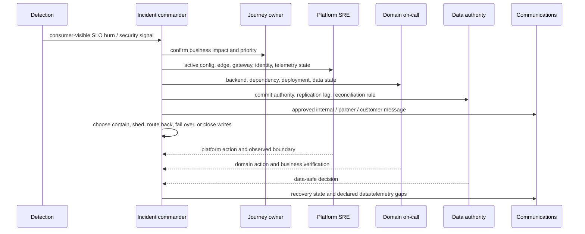

<!-- study-contract: principal -->

# Federated API platform operating model

| Field | Value |
|---|---|
| Artifact type | architecture-study |
| Decision question | Which federated accountabilities, service boundaries, controls, and funding model can operate RE-1 end to end? |
| Decision owner | API platform product owner with the service and design authority and executive sponsor |
| Primary audiences | Executives, directors, platform and enterprise architects, domain developers, DevOps, SRE, security, operations, governance, and FinOps |
| Scope | Shared API gateway/control plane and developer platform; mixed Mule, PCF, and AKS delivery; critical through sandbox service tiers; change, incident, recovery, migration, evidence, and cost workflows |
| Evidence state | Interpretation built from documented mechanisms and scenario assumptions; organizational fit remains a hypothesis until staffed and exercised |
| Reference case | RE-1, a synthetic regulated-enterprise case |
| As-of date | 2026-08-17; factual source-review metadata, not a scenario assumption |
| Next gate | Operating-model design authority approves the service contract and funds accountable capacity before the critical pilot |

## Provisional answer

RE-1 should use a **federated product model with centralized paved-road controls and domain-owned business outcomes**. A fully centralized approval/operations team will bottleneck delivery and still cannot own ledger or consumer semantics; unconstrained federation will fragment trust, configuration, SLOs, and cost. Confidence is moderate because the accountability design addresses the seams exposed by the synthetic scenario, but low in organizational fit and staffing sufficiency until a critical journey and incident exercise produce observed evidence. The consequence of error is a platform that is nominally shared yet has no one authorized to resolve an ambiguous transfer, stale policy, or unsafe regional promotion.

The operating-model decision is:

The operating model must answer who owns a consumer-visible outcome when the request crosses edge controls, gateway policy, Mule, PCF, AKS, identity, certificates, telemetry, brokers, and authoritative data. A role list alone is insufficient: RE-1 incidents fail at seams where each component is locally healthy and no team owns the journey.

This article applies the synthetic [RE-1 enterprise reference case](41-enterprise-reference-case.md). It turns the case into decision rights, service tiers, workflow controls, on-call boundaries, funding, and evidence responsibilities.

> **Quantitative convention:** every team size, allocation, duration, target, threshold, service level, capacity, and cost in this article is a **RE-1 scenario assumption**. None is an observed staffing fact, benchmark, vendor claim, regulatory minimum, or delivery commitment. Role IDs and gate IDs are identifiers rather than quantities.

## Design principles

- **One journey, one accountable service owner.** Component ownership does not replace accountability for J-01 money transfer or J-02 account summary.
- **The platform is a product with a service contract.** It has supported patterns, SLOs, costs, lifecycle policy, roadmap, and named consumers.
- **Domains own semantics and data.** The central team supplies guardrails, automation, and shared runtime; it does not approve every contract change or absorb domain on-call.
- **Assurance is automated where rules are deterministic.** Manual review is reserved for material risk, exceptions, and ambiguous cross-domain decisions.
- **Migration capacity is temporary.** The factory helps domains adopt patterns but cannot become the permanent owner of migrated services.
- **Control and evidence are designed together.** A policy that cannot expose its active version, decision, owner, and audit trail is not operable.

## Operating model mechanism and team topology

**Figure OPSMOD-1 — Central authority governs shared risk while domains retain service and journey accountability.**

- **Depicted scope:** executive funding/risk authority, platform product ownership, service/design authority, platform engineering/SRE/developer experience, enterprise control functions, domain API teams, consumers, business journey ownership and a time-bounded migration factory.
- **Excluded scope:** formal reporting lines, named people, organization size, geographic/time-zone coverage, detailed vendor support roles, budget allocation and evidence that the proposed roles are staffed or effective.
- **Diagram source, evidence state and as-of:** inline organization-design synthesis from synthetic [RE-1](41-enterprise-reference-case.md) ownership and failure seams; operating-model hypothesis, not an observed organization chart or exercise result; 2026-08-17.
- **Accessible equivalent:** the executive sponsor funds and sets risk appetite through a platform product owner. A service/design authority governs cross-domain standards and exceptions while platform engineering, SRE and developer-experience functions supply the paved road. Security, FinOps and data/integration architecture constrain shared decisions; domain teams own services and business journeys, and a temporary factory assists migration without inheriting permanent ownership.

The service and design authority is a decision forum, not a permanent queue. It decides cross-domain contract conflicts, risk exceptions, tier classification, production readiness for novel patterns, and decommission gates. Standard changes on the paved road flow automatically.

**Figure interpretation:** Authority is centralized only where a cross-domain or material-risk decision exists; delivery and journey ownership stay with product/domain teams. The figure shows accountability flow, not reporting lines or an assumed organizational chart.

**Figure limitation:** The topology cannot prove role capacity, decision latency, on-call coverage or willingness to accept accountability. Named forums, staffing, escalation clocks and exercises must validate the model before production reliance.

## Scenario and assumptions: RE-1 capacity

**Every value below is a scenario assumption.** Named-person mapping and personal capacity remain in restricted programme records.

| Capability team | Assumed capacity | Enduring accountability | Capacity risk |
|---|---:|---|---|
| Platform product and engineering | 16 FTE | platform roadmap, data/control plane, delivery templates, supported versions | roadmap collapses into reactive tickets if product and operations share no allocation rule |
| Platform SRE | 8 FTE with shared on-call | platform SLO, capacity, incident command, resilience, DR | central on-call becomes first responder for every domain defect |
| Developer experience and API governance | 6 FTE | product model, contract rules, catalog, onboarding, adoption analytics | manual design review becomes the critical path |
| IAM, PKI, and security engineering | 7 FTE allocated | trust patterns, key/certificate lifecycle, detections, exception assurance | certificate and workload-identity work is treated as ad hoc project dependency |
| Integration migration factory | 24 FTE at peak | pattern discovery, Mule decomposition, test harnesses, wave delivery | migrated services are abandoned to the factory instead of transferred to domains |
| Domain API teams | 11 teams averaging 7 FTE | business contract, service/data SLO, consumers, runbook, operational outcome | roadmap has no funded migration or reliability capacity |
| FinOps, sourcing, and vendor management | 4 FTE allocated | unit economics, licenses, support contract, benefit realization | license exit dates diverge from technical dependency-zero dates |

### Cognitive-load boundary

The paved road includes gateway configuration, identity pattern, deployment pipeline, contract checks, telemetry, SLO template, certificate lifecycle, rollback pattern, support route, and cost attribution. A domain team should not need to learn control-plane internals. Conversely, the platform team should not need to understand ledger compensation semantics to operate the gateway.

## Service catalog and tiers

**All service objectives and windows are scenario assumptions.**

| Service offering | Intended consumer | Platform supplies | Consumer supplies | Assumed service objective |
|---|---|---|---|---|
| Critical API product | J-01/J-03 and equivalent high-consequence journeys | multi-zone data plane, warm-region pattern, SLO telemetry, tested certificate and config recovery, priority support | business idempotency, authoritative data recovery, journey runbook, reconciliation | platform availability 99.99%; production response 15 min |
| Standard API product | J-02/J-04 and ordinary internal/partner services | multi-zone runtime, standard policy, self-service delivery, business-hours architecture support | contract, backend SLO, consumer communication, rollback | platform availability 99.95%; production response 30 min |
| Basic/internal API | low-consequence, non-critical services | shared runtime, standard telemetry, best-effort recovery pattern | explicit degraded behavior and business-hours support | platform availability 99.90%; production response 4 h |
| File/batch integration | J-05 and scheduled workloads | approved transfer/job pattern, durable journal, schedule monitoring | file contract, cutoff, replay and exception ownership | accepted-record RPO 0; recovery by journey cutoff |
| Sandbox/experiment | time-bounded learning | isolated quota, synthetic data, no production trust | expiry owner and cleanup | no production SLO; automatic expiry after 30 days |

The platform availability SLO does not supersede the journey SLO. A gateway can satisfy its SLO while a domain backend, identity dependency, or stale cache breaks the customer outcome. Both are reported.

## Decision rights

| Decision | Accountable | Required consultation | Evidence needed | Escalation trigger |
|---|---|---|---|---|
| API product tier | Business journey owner | Domain owner, platform SRE, security, finance | impact tolerance, data consequence, consumers, volume, recovery needs | tier would exceed funded platform pattern |
| Contract and semantic change | Domain API product owner | known consumers, data owner, governance automation | compatibility result, consumer plan, schema/semantic examples | disputed breaking change or unknown consumer |
| Shared platform release | Platform product owner | SRE, security, representative domains | canary, rollback, active-config attestation, failure result | error-budget burn or unsupported-version risk |
| Production readiness | Domain service owner | platform, SRE, IAM/PKI, security | SLO, capacity, runbook, identity, certificate, rollback/reconciliation, ownership | novel critical pattern or unexpired exception |
| Risk exception | Risk/control owner | service owner, platform owner, security architecture | compensating control, exposure, expiry, funded closure | exception reaches expiry or blast radius grows |
| Regional failover | Incident commander under delegated policy | data authority, service owner, platform SRE, business operations | configuration, identity, capacity, data-readiness gates | RPO authority is unknown or business effect is irreversible |
| Legacy decommission | Service/application owner | operations, security, records, sourcing, consumers | zero traffic, state, schedule, identity, certificate, contract, support and license dependency | any recovery path or consumer remains |

**Figure OPSMOD-2 — Deterministic paved-road changes automate; ambiguity and material risk escalate before production.**

- **Depicted scope:** automated contract/security/policy/cost checks, authority escalation, remediation, canary and active-digest proof, production monitoring and freeze/rollback/reconciliation feedback.
- **Excluded scope:** product-specific pipeline implementation, exact materiality thresholds, separation-of-duty identities, emergency-change details, release cadence and the recovery action for any particular SLO breach.
- **Diagram source, evidence state and as-of:** inline governance-flow synthesis from RE-1 J-06/I-02/I-07/I-08 and this study's decision-rights table; proposed control design with no observed lead-time or control-effectiveness result; 2026-08-17.
- **Accessible equivalent:** a deterministic change runs automated checks and, if they pass, reaches a canary whose active configuration is verified before production. Material or ambiguous results go to the service/design authority; approval adds conditions, while a hold returns to owner-funded remediation. Production SLO burn or drift freezes the rollout and invokes rollback or reconciliation.

**Figure interpretation:** Deterministic controls remain automated while material or ambiguous changes reach the authority; production feedback can freeze or reverse a rollout. The diagram does not imply that every SLO breach has the same recovery action.

**Figure limitation:** The flow does not define what is material, who may approve each exception, or whether rollback is safe after schema/data effects. Those conditions require the decision-rights register, change type and observed control evidence.

## Lifecycle workflow

### Discover and classify

The domain records product owner, consumers, critical journey, contract, runtime, data classification, identity, certificates, schedules, state, dependencies, volume, SLO, RTO/RPO, support tier, and cost center. The platform team rejects an “API” record that omits the backend and business outcome.

### Design and prove

The team uses a supported pattern or submits a bounded exception. Contract tests include syntactic and semantic cases. Critical journeys run performance and failure scenarios from [performance and resilience](32-performance-resilience.md) and [real-world PoC scenarios](../poc/real-world-scenarios.md).

### Release

The release unit contains API description, policy bundle, route, trust binding, backend version, SLO, rollback/reconciliation classification, and active-digest expectation. Route, code, config, schema, data, message, and external-business rollback are separately declared.

### Operate and improve

Journey and platform burn rates drive response. Repeated failure classes create funded reliability work. Capacity, cost per successful transaction, exception ageing, certificate horizon, version support, and consumer adoption are reviewed as product signals rather than audit-only reports.

### Deprecate and decommission

Deprecation identifies every consumer and replacement. Decommission waits for zero traffic and zero hidden dependency across routes, credentials, state, topics, schedules, files, certificates, monitoring, support, contracts, and recovery procedures.

## Change taxonomy

**All lead times and thresholds are scenario assumptions.**

| Change class | Example | Approval path | Assumed release guardrail |
|---|---|---|---|
| Standard | add route using approved template; renew leaf certificate within tested chain | automated policy plus accountable owner | canary 5%; active digest and SLO pass for 30 min |
| Normal | new product policy, gateway upgrade, backend move | peer review plus service owner; authority only if material | staged 5/25/50/100% with explicit hold points |
| High consequence | J-01 semantics, issuer trust, regional data role, intermediate CA | dual approval and scheduled incident coverage | proof in representative environment and tested reversal/reconciliation |
| Emergency | active exploit, severe outage, certificate expiry | incident commander plus delegated emergency approver | smallest safe scope; live audit; retrospective within 2 business days |
| Exception | temporary non-standard control or unsupported dependency | control owner accepts bounded exposure | expiry ≤ 90 days, funded closure, automatic escalation |

An emergency path is a controlled product feature. Break-glass credentials, audit capture, communication, rollback, and retrospective are exercised before an incident.

## Incident command across seams

**Figure OPSMOD-3 — Incident command joins journey impact, platform state, domain behavior and data authority before changing traffic or writes.**

- **Depicted scope:** detection, incident command, journey prioritization, platform/domain/data evidence, communications, containment/routing choices and declared recovery/evidence gaps.
- **Excluded scope:** product-specific diagnostic commands, paging hierarchy, regulator/contract notification rules, detailed journey runbooks, vendor escalation and measured restoration time.
- **Diagram source, evidence state and as-of:** inline authority sequence derived from synthetic RE-1 incidents I-01 through I-08 and the accountability matrix in this study; operating hypothesis with no game-day or production incident result; 2026-08-17.
- **Accessible equivalent:** detection alerts the incident commander, who confirms business impact with the journey owner; collects active configuration, edge, gateway, identity and telemetry state from platform SRE; collects backend/dependency/deployment/data state from domain on-call; and obtains commit authority and reconciliation rules from the data authority. Only then is contain, shed, route back, fail over or close writes chosen and communicated with any data/telemetry gap.

**Figure interpretation:** Incident command deliberately joins component state with business and data authority before traffic or write-role changes. The sequence is an authority model; detailed technical runbooks remain journey-specific.

**Figure limitation:** This sequence does not establish that the roles are available, that evidence arrives in time, or that one commander has legal authority for every decision. RACI acceptance, paging and cross-team exercises remain required.

### Accountability by RE-1 failure

| Failure | Incident commander needs | Primary action owner | Business verification owner | Frequent ownership gap |
|---|---|---|---|---|
| I-01 duplicate transfer | idempotency state, ledger truth, affected keys | transfer-domain on-call | money-movement service owner | gateway team cannot decide reversal |
| I-02 stale configuration | desired epoch, per-replica digest, traffic admission | platform SRE | affected journey owner | “pods healthy” hides mixed policy |
| I-03 certificate rollover | served chain, trust inventory, connection age, partner failures | PKI plus platform SRE | partner-product owner | certificate issued is confused with certificate served |
| I-04 noisy neighbour | pod/node/resource pressure by journey and tenant | platform SRE | critical-journey owner | application and platform dashboards disagree |
| I-05 telemetry backpressure | queue, refusal, drop, request saturation, audit path | observability platform owner | control owner for audit completeness | request team treats telemetry loss as non-impacting |
| I-06 regional failover | data authority, active config, identity, capacity, global route | incident commander under policy | data authority and journey owner | network team shifts traffic before data gate |
| I-07 schema drift | producer change, consumer versions, semantic diff, DLQ | producer domain owner | each affected consumer owner | valid schema is mistaken for safe behavior |
| I-08 rollback/data incompatibility | route, code, config, schema, data and message versions | releasing domain owner | data owner | platform rollback cannot undo external effect |

## SLO, error-budget, and roadmap policy

**All policy thresholds are scenario assumptions.**

| Signal | Assumed policy response |
|---|---|
| critical journey consumes 5% of monthly error budget in 1 h | page journey and platform responders; freeze contributing rollout |
| critical journey consumes 10% in 3 days | reliability ticket with funded owner and next planning gate |
| one failure class consumes 20% of quarterly budget | mandatory corrective epic before discretionary feature work |
| platform SLO passes but journey SLO fails | domain and dependency diagnosis continues; platform is not declared healthy for the journey |
| instrumentation cannot establish good/total events | mark SLO indeterminate; repair measurement before claiming compliance |

Google’s [SRE guidance on SLO alerting](https://sre.google/workbook/alerting-on-slos/) provides the general multi-window burn-rate mechanism. The thresholds in this operating model remain synthetic assumptions.

## Control registers

The public repository can contain templates and anonymized owner roles. Production registers with identities, vulnerabilities, credentials, partner contacts, and incident detail remain access-controlled.

| Register | Minimum fields | Review trigger | Accountable owner |
|---|---|---|---|
| API product and consumer register | product, operations, owner, consumers, tier, lifecycle, support | contract or consumer change | domain API product owner |
| Active configuration register | approved epoch/digest, environment, rollout, active replicas, exception | every production configuration change | platform product owner |
| Certificate and trust register | subject/SAN, issuer chain, consumer trust, reload mode, overlap, expiry owner | issuance, renewal, trust change | PKI service owner |
| Exception register | control, exposure, compensating control, owner, funding, expiry | scope or risk change; expiry | accepting control owner |
| Dependency/decommission ledger | traffic, state, schedule, route, topic, file, identity, certificate, support, license | each migration wave | service/application owner |
| SLO and incident register | good event, objective, burn, impact, action, recurrence | budget burn and quarterly review | journey owner |
| Cost and benefit register | fixed/variable cost, allocation driver, dual run, avoidance, realized benefit | monthly and gate review | platform product owner with FinOps |

## Funding and unit economics

Platform funding combines a stable base for shared controls with transparent consumption and migration allocations. A pure chargeback model can discourage adoption of required controls; a fully opaque central budget hides high-cost consumers and stranded legacy cost.

**All values below are scenario assumptions.**

| Cost pool | Assumed annual allocation | Allocation signal | Decision use |
|---|---:|---|---|
| shared platform people and baseline runtime | $4.1 million | centrally funded by approved product roadmap | preserve core capability independent of short-term traffic |
| consumption infrastructure and telemetry | $1.8 million | requests, bandwidth, retained telemetry, regional footprint | show marginal cost and noisy consumers |
| vendor support and licenses | $1.7 million | contracted capacity and support tier | align commercial commitment with technical dependency |
| reliability and security investment | $0.9 million | control roadmap and risk appetite | prevent all capacity becoming feature delivery |
| migration factory | $5.2 million programme allocation | wave and pattern outcomes | time-bound funding with ownership transfer |

The primary unit is cost per successful business transaction by journey and failure state, not cost per gateway request. Retries, rejected duplicates, telemetry loss, and reconciliation effort must not make the numerator look artificially efficient.

## Operating-model gates

| Gate | Required decision | Pass artifacts | Stop or hold condition |
|---|---|---|---|
| OM-G0 — service contract | approve platform boundaries, tiers, consumers, SLOs, and funding | service catalog, ownership map, demand/capacity model | platform is described only as technology components |
| OM-G1 — paved road | approve standard patterns and automation coverage | reference implementations, policy tests, golden signals, support model | ordinary onboarding depends on manual expert work |
| OM-G2 — critical readiness | admit first RE-1 critical journey | journey SLO, failure results, on-call, rollback/reconciliation, data authority | component owners exist but journey owner is absent |
| OM-G3 — factory scale | fund repeatable migration | accepted patterns, domain capacity, transfer-of-ownership criteria, unit cost | factory is becoming permanent service owner |
| OM-G4 — decommission | retire Mule/PCF/shared contract | dependency-zero evidence and commercial closure | unresolved traffic, state, schedule, certificate, recovery, or support path |

## Counter-hypotheses and non-fit conditions

A smaller enterprise or a predominantly managed SaaS estate may need fewer enduring specialist teams than RE-1 assumes. A strongly autonomous domain model may also outperform this design if every domain can fund equivalent identity, SRE, evidence, and platform expertise. The provisional answer is falsified if a simpler ownership model repeatedly meets onboarding, change, incident, recovery, exception, and decommission outcomes with lower delay and no control fragmentation. This model is non-fit if the executive sponsor will not delegate incident/change authority, domains cannot accept service ownership, or central teams are funded only as a project.

## Decision implications

- Fund the platform as an enduring product and reliability service before scaling migration volume.
- Make journey ownership, data authority, and business reconciliation mandatory production-readiness fields.
- Automate standard controls; reserve the service/design authority for material risk and cross-domain ambiguity.
- Measure onboarding time, SLO outcomes, expired exceptions, config attestation, transferred ownership, and realized retired cost—not ticket or policy volume.
- Hold critical production admission until the staffing/on-call model and cross-runtime incident path are exercised.

## Operating-model health indicators

**All targets are scenario assumptions.**

| Outcome indicator | Assumed target | Anti-metric to avoid |
|---|---:|---|
| standard onboarding lead time | median ≤ 5 business days | number of tickets closed |
| paved-road adoption | ≥ 85% of eligible products | policies created regardless of use |
| actionable page load | ≤ 2 pages per on-call shift | raw alert count hidden by suppression |
| change failure rate | ≤ 5% requiring rollback, forward-fix, or incident | deployment success without consumer verification |
| expired exceptions | 0 in production | number of exceptions approved |
| active config attestation | 100% of production replicas within propagation gate | desired-state commit alone |
| decommission benefit | ≥ 90% of approved run-cost removal realized within 2 quarters | workloads migrated without license/infrastructure closure |

## Official mechanism references

These sources support general mechanisms only; they do not validate RE-1 assumptions or demonstrate compliance:

- [OSFI: Technology and Cyber Risk Management](https://www.osfi-bsif.gc.ca/en/guidance/guidance-library/technology-cyber-risk-management)
- [Google SRE Workbook: Alerting on SLOs](https://sre.google/workbook/alerting-on-slos/)
- [Google SRE Workbook: Error Budget Policy](https://sre.google/workbook/error-budget-policy/)
- [Kubernetes: Disruptions](https://kubernetes.io/docs/concepts/workloads/pods/disruptions/)
- [OpenTelemetry Collector internal telemetry](https://opentelemetry.io/docs/collector/internal-telemetry/)
- [OpenAPI Specification](https://spec.openapis.org/oas/latest.html)

## Falsification and proof plan

All thresholds in this table are RE-1 scenario assumptions.

| Proof ID | Procedure | Measure | Scenario threshold | Evidence artifact | Independent reviewer |
|---|---|---|---|---|---|
| OM-P1 | onboard one standard and one critical API through the paved road | elapsed lead time, manual handoffs, failed controls, unresolved ownership | standard median path ≤ 5 business days; critical gaps have funded owners | workflow event log, approvals, control outputs and participant retrospective | developer-experience lead outside platform stream |
| OM-P2 | run RW-10 mixed-runtime incident with delegated roles | time to journey impact, config/data truth and safe decision | command established and active/config/data state identified within assumed 10 min | incident timeline, decision log, communication and reconciliation | resilience reviewer plus business owner |
| OM-P3 | execute emergency certificate/config change and retrospective | approval, audit completeness, rollback, exception ageing | complete audit and retrospective within assumed 2 business days | access/audit logs, change bundle, review record | security/control owner |
| OM-P4 | follow a migrated workload through ownership and legacy cost closure | support transfer, dependency zero, realized cost | ≥ 90% assumed approved run-cost removal within 2 quarters | service acceptance, dependency ledger and finance record | FinOps and internal assurance |

## Risks and limitations

- Team sizes, tiers, budgets, targets, and cost pools are scenario assumptions; actual demand and skill concentration may change the topology.
- A formal RACI cannot compensate for missing authority, on-call capacity, training, or psychological safety during incidents.
- The public repository cannot hold named-person capacity, partner contacts, vulnerabilities, credentials, or detailed incident records.
- Managed-service support boundaries and vendor escalation quality remain candidate-specific and must be contractually verified.
- The model covers API/integration operations; it does not replace enterprise crisis, data-governance, privacy, records, or business-continuity governance.

## Open evidence requests

| Request | Owner role | Due gate | Decision impact if unresolved |
|---|---|---|---|
| named role-to-person capacity and sustainable on-call load | Platform product owner and domain directors | OM-G0 | do not approve the service contract as operable |
| delegated emergency, failover and data-authority decision policy | Executive sponsor, risk and data owners | OM-G2 | exclude critical journeys from pilot |
| candidate support/escalation boundary by control/data plane and deployment option | Sourcing and platform SRE | commercial/architecture gate | carry support as an unpriced operational risk |
| unit-cost allocation and legacy-benefit baseline | FinOps | OM-G3 | do not claim migration benefit or scale factory |

## Next gate

At OM-G0, the service and design authority should approve only if the service catalog, decision rights, journey ownership, staffed on-call/capacity plan, funding allocation, registers, and standard/emergency workflows have accountable owners. Critical-pilot admission remains a later gate after OM-P1 through OM-P3 are exercised and independently reviewed.
