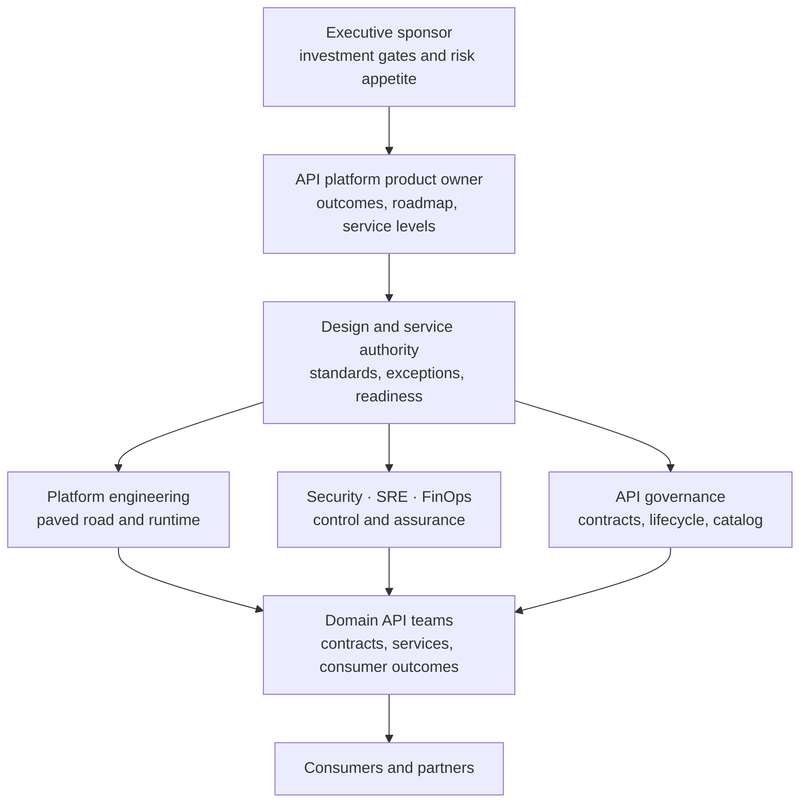

# Operating model

## Core roles

| Role | Accountability |
|---|---|
| API platform product owner | Outcomes, roadmap, service levels, funding |
| Platform engineering | Gateway/control plane, templates, automation, upgrades |
| API governance | Standards, lifecycle, catalog, product model |
| Security/IAM/PKI | Controls, identity, certificates, exceptions, detection |
| SRE/operations | Monitoring, capacity, incidents, DR, runbooks |
| Domain API owner | Contract, backend, SLO, consumers, change lifecycle |
| Integration engineering | Transformation, workflow, messaging, connectors |
| FinOps/vendor management | Unit economics, licenses, contracts, support |

Define a paved road, service catalog, support tiers, onboarding SLO, production readiness review, emergency change, exception expiry, and quarterly evidence review. Central governance without self-service becomes a bottleneck; federation without enforceable guardrails becomes sprawl.

## Federated decision model

Public registers use accountable roles or anonymized owner IDs. The named-person assignment and capacity plan remain in restricted programme records.
