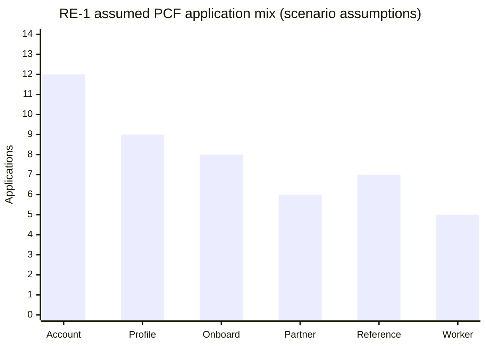
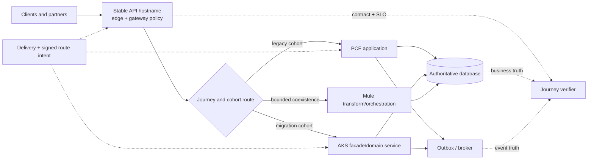
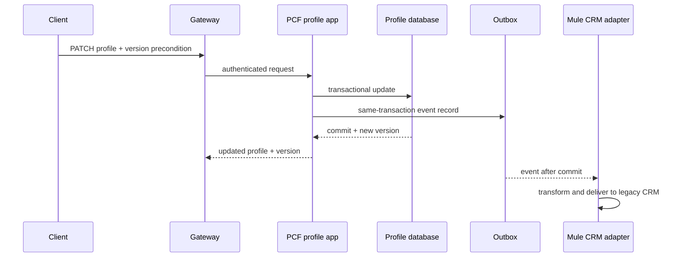
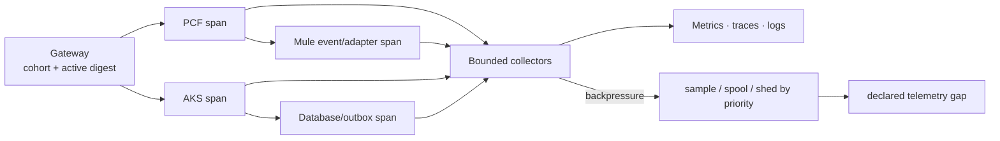
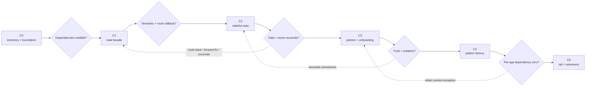

<!-- study-contract: principal -->

# PCF-to-AKS consolidation without a big-bang cutover

| Field | Value |
|---|---|
| Artifact type | architecture-study |
| Decision question | Can RE-1 move PCF business journeys to AKS without contract, data, identity, recovery, or ownership regression? |
| Decision owner | Application-modernization sponsor with domain service owners and the platform design authority |
| Primary audiences | Executives, application and platform directors, architects, domain developers, DevOps, SRE, security, data, operations, and FinOps |
| Scope | RE-1 PCF application estate; stable gateway routing; AKS target services; bounded Mule coexistence; HTTP, worker, scheduler, data, event, identity, certificate, regional-recovery, and decommission concerns |
| Evidence state | Architecture interpretation and scenario assumptions supported by documented mechanisms; migration fitness remains a hypothesis pending representative pilots |
| Reference case | RE-1, a synthetic regulated-enterprise case |
| As-of date | 2026-08-17; factual source-review metadata, not a scenario assumption |
| Next gate | State-safe PCF/AKS pilot review for PCF-PROFILE-07 before factory funding |

## Provisional answer

RE-1 can consolidate PCF backends onto AKS only through **stable-contract, single-writer journey slices with explicit cohort routing, expand-contract data change, and business reconciliation**. A container-by-container move or uncontrolled shared route is not safe. Confidence is moderate in the target pattern and low in estate-wide duration/cost until route, data, partner trust, failure, and ownership behavior are observed on representative workloads. A false positive could create concurrent writers, stale regional data, duplicate events, or a rollback that restores code but corrupts newer data.

The consequential question is:

How can RE-1 move PCF-hosted backends to AKS while preserving stable API contracts, identity, data correctness, recovery behavior, and support ownership—and without turning the gateway into a new application runtime?

This study applies the synthetic [RE-1 enterprise reference case](41-enterprise-reference-case.md), especially J-02 account summary, J-04 onboarding, I-02 stale configuration, I-04 noisy neighbour, I-06 regional failover, and I-08 rollback with incompatible data.

> **Quantitative convention:** every workload count, percentage, duration, threshold, capacity, service level, wave size, and cost in this article is a **RE-1 scenario assumption**. None is inventory evidence, a benchmark, a vendor claim, or a delivery commitment. Gate IDs and workload IDs are identifiers rather than quantities.

## Why “replatform the app” is too small a unit

A PCF application can be coupled to routes, domains, service bindings, identity, certificates, platform-provided environment variables, buildpacks, health checks, schedulers, persistent services, logs, egress IPs, and operational playbooks. The safe migration unit is therefore:

`contract + consumers + route + identity + application + state + dependencies + operations + recovery`

Moving only the container image proves very little.

## Scenario and assumptions: RE-1 PCF inventory slice

**All values below are scenario assumptions.**

| Archetype | PCF applications | API operations | Write/state characteristic | Main migration hazard |
|---|---:|---:|---|---|
| account and balance read | 12 | 68 | cached views over authoritative ledger | stale secondary or cache generation after failover |
| customer/profile | 9 | 51 | direct writes plus events | schema expansion and duplicate event publication |
| onboarding | 8 | 39 | long workflow and document handoff | large payload noisy neighbour and resumability |
| partner adapter | 6 | 24 | mTLS, allowlists, fixed egress identity | certificate chain and source-IP change |
| internal reference and entitlement | 7 | 22 | short-TTL cache and identity lookup | stampede after restart and inconsistent revocation |
| scheduler/worker | 5 | 10 | time-triggered jobs and queue consumers | duplicate execution while PCF and AKS coexist |
| **Scenario PCF estate** | **47** | **214** | **mixed** | **route, data, identity, schedule, and operations must move together** |

**Chart PCF-1 — Stateful, partner and worker workloads make a read-only container pilot unrepresentative.**

- **Depicted scope:** assumed PCF application counts for account, profile, onboarding, partner, reference/entitlement and scheduler/worker archetypes.
- **Excluded scope:** API-operation counts, complexity and dependency depth, measured inventory, migration effort, target capacity, cost and delivery sequence.
- **Chart source, evidence state and as-of:** values from the immediately preceding synthetic RE-1 PCF inventory table; scenario assumptions, not estate observations; 2026-08-17.
- **Accessible equivalent:** Account 12; Profile 9; Onboarding 8; Partner 6; Reference 7; Worker 5 applications, totaling 47. The preceding table adds API operations, state characteristics and migration hazards.

**Chart interpretation:** Stateful and partner/onboarding workloads are a substantial part of the assumed estate, so a read-only container pilot cannot validate the consolidation factory. The chart is a scenario inventory model, not an observed PCF inventory.

**Chart limitation:** Application count is not a migration-effort unit and does not show shared services, schedules, bindings, data or consumers. Organization inventory and dependency reconciliation must replace these values before planning.

## Mechanism analysis: target coexistence architecture

Stable external hostnames terminate at the API edge. Routing intent selects the PCF or AKS backend for a specific contract and cohort. Mule may remain temporarily when it performs orchestration or connector work that has not yet been decomposed.

**Figure PCF-2 — Stable cohort routing enables reversible coexistence while business truth remains outside the gateway.**

- **Depicted scope:** clients/partners, stable edge policy, explicit cohort routing to PCF, AKS or bounded Mule, shared authoritative database/outbox truth, journey verification and signed delivery intent.
- **Excluded scope:** concurrent-writer protocol, database and broker products, region/failover design, identity/certificate paths, exact traffic-split implementation and permanent three-runtime operation.
- **Diagram source, evidence state and as-of:** inline target-coexistence synthesis from synthetic RE-1 and the Cloud Foundry/Gateway API routing mechanisms cited below; architecture hypothesis with no observed migration or parity result; 2026-08-17.
- **Accessible equivalent:** clients use one stable API boundary whose explicit journey/cohort rule chooses legacy PCF, migration AKS or bounded Mule behavior. All paths converge on authoritative database and outbox state; a verifier compares contract/SLO, business and event truth, while signed delivery intent controls edge and runtime changes.

The gateway does not absorb domain orchestration, database joins, long transformations, or compensation simply because it is the common route. It enforces cross-cutting policy and provides a reversible traffic boundary.

**Figure interpretation:** Stable edge routing creates a reversible boundary while the authoritative database/outbox and verifier preserve business truth across PCF, AKS, and bounded Mule coexistence. The diagram does not endorse concurrent writers or permanent three-runtime operation.

**Figure limitation:** The logical route boundary cannot prove semantic parity, safe dual operation or data rollback. Exact writer authority, session/state behavior, traffic-split support, dependency cycles and bounded-coexistence exit require per-workload evidence.

Cloud Foundry documents that multiple apps mapped to one route can receive load-balanced requests and warns this can be undesirable when random routing is not appropriate ([Cloud Foundry routes and domains](https://docs.cloudfoundry.org/devguide/deploy-apps/routes-domains.html)). RE-1 therefore uses an explicit cohort/weight mechanism at the gateway or global routing layer for migration, rather than relying on an uncontrolled shared PCF route. Kubernetes Gateway API documents weighted backend references as a traffic-splitting mechanism ([Gateway API traffic splitting](https://gateway-api.sigs.k8s.io/guides/user-guides/traffic-splitting/)); the chosen gateway must prove equivalent behavior and rollback.

## Discovery record per application

No workload enters a wave without the following fields:

| Record | Questions that must be answered | How it is verified |
|---|---|---|
| Contract and consumers | Which hostname, paths, methods, schemas, error codes, headers, clients, and undocumented behaviors exist? | specifications, access logs, consumer interviews, contract tests |
| Route and network | Which PCF routes, internal routes, egress IPs, DNS, proxies, allowlists, and connection assumptions exist? | platform inventory plus controlled probes |
| Identity and trust | Which issuers, audiences, scopes, workload credentials, mTLS chains, and reload behaviors exist? | config and secret inventory plus real handshake tests |
| State | Which databases, caches, sessions, local files, and platform services are read or written? | bindings, code path, data owner, runtime traces |
| Trigger and concurrency | Is the app HTTP, scheduled, queue-driven, file-driven, or all of these? Can two copies safely execute? | scheduler, broker, file-lock, and leader-election records |
| Release and recovery | Can route, code, config, schema, data, event, and external effect be independently reversed? | deployment history and practiced runbook |
| Operations | Who receives alerts, owns the SLO, performs failover, reconciles data, and communicates to consumers? | on-call/service records and game day |
| Cost and decommission | Which PCF, database, network, monitoring, and support costs disappear only after this app moves? | cost allocation and dependency ledger |

## Pattern selection

| Pattern | Use when | Target shape | Do not use when |
|---|---|---|---|
| P-A — facade then backend move | external contract is stable but backend must move independently | gateway route to PCF, then weighted route to AKS | gateway would need to implement domain workflow |
| P-B — strangler by operation | one application exposes separable business operations | some paths remain PCF; a cohesive slice moves to AKS | paths share an inseparable transaction or in-memory session |
| P-C — event-first extraction | write path is risky but side effects can be observed through an outbox/event | AKS builds read model or downstream consumer before owning writes | source has no durable event/outbox and dual write would be introduced casually |
| P-D — blue/green runtime replacement | behavior and data contract are unchanged | PCF remains route rollback while AKS proves equivalent | database change is not backward compatible |
| P-E — retain temporarily | support, data, partner, or schedule dependency is unresolved | bounded PCF coexistence with owner and expiry | “temporary” has no funded exit condition |
| P-F — retire | no traffic or business/recovery dependency exists | remove route, app, bindings, credentials, monitors, contracts | absence of recent traffic is the only evidence |

## Worked migration: customer-profile write path

The synthetic workload **PCF-PROFILE-07** serves J-02 reads and profile-update writes. PCF publishes a `CustomerProfileChanged` event after committing the database row. A Mule flow transforms that event for a legacy CRM, while a new AKS service will own the HTTP contract.

### Starting state

**Figure PCF-3 — Profile migration must preserve the coupled database-and-outbox transaction, not only the HTTP response.**

- **Depicted scope:** authenticated profile update through gateway and PCF, optimistic version precondition, database commit, same-transaction outbox record and post-commit Mule CRM delivery.
- **Excluded scope:** actual database/broker technology, failure retries, duplicate delivery, AKS target behavior, schema migration, regional failover and observed parity.
- **Diagram source, evidence state and as-of:** inline synthetic PCF-PROFILE-07 sequence derived from RE-1 J-02/I-07/I-08; scenario model awaiting runtime discovery and migration proof; 2026-08-17.
- **Accessible equivalent:** the client sends a version-guarded profile update through the gateway to PCF. PCF updates the profile database and records an outbox event in the same transaction; the committed row/version is returned, and only after commit does Mule transform and deliver the event to the legacy CRM.

The new AKS service must preserve optimistic-concurrency behavior, canonicalization, error mapping, event identity, outbox transaction, and CRM delivery semantics. Returning the same JSON for a happy path is not parity.

**Figure interpretation:** The transaction boundary couples profile data and event intent; the migration must preserve both before shifting writes. The sequence abstracts database and broker products and does not claim exactly-once delivery by infrastructure alone.

**Figure limitation:** This scenario is not an observed PCF flow and omits retry, deduplication, broker redelivery and schema details. Runtime traces, code/configuration, golden semantics and reconciliation must confirm the real boundary.

### Expand-migrate-contract sequence

**All cohort sizes and observation periods are scenario assumptions.**

| Step | Change | Verification | Hold/rollback rule |
|---|---|---|---|
| S0 baseline | freeze undocumented contract drift; capture semantic corpus and database/event invariants | compare requests, row versions, event payloads, CRM outcome | stop if unknown consumer or direct database writer appears |
| S1 expand | add backward-compatible database columns/indexes; PCF remains sole writer | old code reads/writes successfully; backup and restore path verified | forward-fix schema if destructive rollback is unsafe |
| S2 deploy dark | AKS receives synthetic and replayed production-shaped traffic without writes | response semantic diff and dependency saturation | remove dark route; no data action required |
| S3 shadow reads | mirror eligible reads; AKS response is not served | compare freshness, authorization, null/decimal/time semantics | investigate any unexplained semantic difference |
| S4 canary writes | route assumed 1% employee cohort to AKS; single writer selected per customer key | database version, outbox event, CRM result, SLO and duplicate count | route cohort back; reconcile in-flight keys |
| S5 progressive traffic | assumed 5/25/50/100% holds | multi-window SLO, error semantics, event lag, node and database saturation | automatic hold on burn or reconciliation gap |
| S6 contract | AKS becomes sole writer; PCF remains read-compatible rollback for 45 days | no PCF writes, consumers stable, backup and failover pass | rollback route only if schema remains compatible; otherwise forward-fix |
| S7 retire | remove PCF route, app, bindings, credentials, monitor and allocated cost | dependency ledger and cost closure | retain if any recovery procedure invokes PCF |

### Why dual writes are rejected

PCF and AKS do not independently write the profile database and publish events for the same key. That creates order, duplicate, and partial-commit ambiguity. Cohort routing selects one writer. A transactional outbox binds the database change to durable event intent; the relay can retry with an event ID and consumers deduplicate according to their contract.

## Data, schema, and event compatibility

An OpenAPI document is a useful machine-readable interface description ([OpenAPI Specification](https://spec.openapis.org/oas/latest.html)), but RE-1 also tests semantic and state behavior.

| Edge case | PCF/AKS coexistence risk | Required control |
|---|---|---|
| optional field becomes required | old PCF response or consumer cannot populate it | expand first; default only with business approval; consumer contract test |
| unknown enum | Mule or PCF transform routes value to default and silently changes meaning | explicit unknown handling; semantic corpus; DLQ with owner |
| decimal precision | runtime/library rounds payment or balance differently | canonical scale and boundary vectors; compare business values |
| absent versus null | patch semantics erase data or fail to update | field-presence contract and database invariant |
| database index/column removal | route rollback starts old code against contracted schema | delayed contract phase after rollback horizon and zero old binaries |
| event version drift | AKS event breaks Mule CRM transform | versioned schema, consumer compatibility, replay test |
| cache generation | AKS serves new schema while old PCF cache repopulates stale shape | versioned cache key and controlled invalidation |

## Failure modes: identity, network, and certificate transition

The AKS service receives a new workload identity; the gateway does not impersonate one shared backend principal. Authorization decisions that depend on end-user or partner context preserve signed, audience-bound context rather than copying untrusted headers.

**Every timing and percentage below is a scenario assumption.**

| Transition | Safe sequence | Failure injection |
|---|---|---|
| partner server certificate | issue new chain; deploy to canary; verify served chain on new and reused connections; maintain old/new trust for 30 days; remove after partner confirmation | pinned intermediate, stale connection pool, clock skew, failed reload |
| backend mTLS identity | trust PCF and AKS identities during cohort migration; authorize least privilege; remove PCF after zero traffic | AKS presents wrong SAN; trust bundle updates only some replicas |
| egress allowlist | provision AKS egress identity before traffic; observe actual path; preserve PCF until third party confirms | NAT exhaustion, failover-region address missing, proxy bypass |
| private DNS | publish/verify from nodes, pods, control components, and DR region | one resolver stale, negative caching, control-plane path blocked |
| secrets | use workload identity where possible; verify application reload rather than Secret timestamp | mounted Secret eventual propagation and `subPath` non-update |

Kubernetes documents eventual consistency for Secret projection and the `subPath` update limitation ([Kubernetes Secrets](https://kubernetes.io/docs/concepts/configuration/secret/)). These mechanics make served-certificate and process-reload checks mandatory.

## AKS placement, noisy neighbour, and upgrades

The migration is not complete if AKS has less isolation or recovery capacity than the PCF service it replaces.

**All capacity guardrails are scenario assumptions.**

| Concern | Assumed control | Proof point |
|---|---|---|
| zone failure | replicas spread across 3 zones; busy-hour service survives one-zone loss with 30% headroom | inject busiest-zone loss at representative traffic |
| critical versus onboarding | separate node pools and worker/connection budgets for critical paths and large transforms | saturate onboarding without breaching J-01/J-02 budget |
| voluntary disruption | PDB plus surge capacity and tested drain | node drain proceeds without violating journey SLO |
| deployment | max unavailable 0 for critical service; bounded surge 25% | canary and rollback with real connections and cache state |
| autoscale | scale signal includes concurrency/queue, not CPU only; quota prevalidated | control-plane/network partial outage during surge |
| image and dependency supply | private registry path and required artifacts available to DR region | cold node pull and regional recovery exercise |

Kubernetes notes that PodDisruptionBudgets constrain voluntary evictions, not all involuntary disruptions or Deployment rollouts ([Kubernetes disruptions](https://kubernetes.io/docs/concepts/workloads/pods/disruptions/)). Microsoft’s [AKS reliability guidance](https://learn.microsoft.com/en-us/azure/reliability/reliability-aks) makes availability-zone enablement and workload design explicit responsibilities.

## Telemetry continuity

During coexistence, one trace can cross gateway, PCF, Mule, AKS, broker, and database. Correlation fields are normalized without overwriting a valid incoming trace or business key. Platform signals include active route/config digest and backend cohort so an incident can separate PCF from AKS behavior.

**Figure PCF-4 — Cross-runtime telemetry remains useful only when route cohort, active configuration and declared loss stay visible.**

- **Depicted scope:** gateway-to-PCF/Mule and gateway-to-AKS/database/outbox signal chains, bounded collectors, telemetry outputs, backpressure handling and declared gaps.
- **Excluded scope:** durable audit implementation, signal schema, trace-context trust policy, collector sizing, retention/access, business-outcome verification and measured completeness.
- **Diagram source, evidence state and as-of:** inline observability synthesis from RE-1 I-05 and the cited OpenTelemetry Collector mechanism; E1-informed architecture hypothesis with no observed pipeline result; 2026-08-17.
- **Accessible equivalent:** gateway signals carry cohort and active-digest context into either the PCF/Mule or AKS/database path. Every component exports through bounded collectors to metrics, traces and logs; backpressure invokes priority-aware sampling/spooling/shedding and produces a declared telemetry-gap record.

Collector queue, enqueue-failure, send-failure, and refusal metrics are defined by the [OpenTelemetry Collector internal-telemetry documentation](https://opentelemetry.io/docs/collector/internal-telemetry/). Request service must remain isolated from exporter backpressure; durable business/security audit has a separate loss policy.

**Figure interpretation:** Cross-runtime correlation must identify route cohort and active config while collectors bound failure propagation. The figure excludes the separate durable-audit implementation and does not imply traces alone prove business correctness.

**Figure limitation:** The figure does not show whether correlation survives every asynchronous hop, how audit remains durable, or how loss is reconciled. OT protocol execution and business-ledger comparison are required before claiming completeness.

## Rollback and reconciliation matrix

| Changed layer | Reversible action | Condition that blocks rollback | Required reconciliation |
|---|---|---|---|
| gateway cohort route | set AKS weight to zero and drain | none if PCF is healthy and contract-compatible | enumerate in-flight requests by cohort and outcome |
| AKS code | restore prior image/config | new schema or event is not backward compatible | compare changed rows/events since release |
| database schema | usually forward-fix during expand phase | destructive contract step already executed | restore only under data-owner runbook; verify data totals |
| business data | compensate or correct; do not blindly restore | external effect or newer valid writes exist | case-level ledger/profile reconciliation |
| broker/event | stop producer/consumer, quarantine, replay | incompatible consumers or lost ordering boundary | reconcile outbox, broker offsets, consumer result |
| partner trust | restore prior serving chain during overlap | partner already removed prior trust | coordinate partner change and retain explicit exception |
| regional role | stop new writes and re-establish authority | split authority or unresolved replication divergence | resolve writer epoch and compare accepted outcomes |

For non-idempotent effects, route rollback prevents more exposure but does not undo completed work. HTTP itself warns against automatic retry of a non-idempotent request without knowing its semantics are safe ([RFC 9110](https://www.rfc-editor.org/rfc/rfc9110.html)).

## Migration waves

**Every scope and duration is a scenario assumption.**

| Wave | Assumed PCF scope | Representative hard case | Entry gate | Exit gate |
|---|---:|---|---|---|
| C0 inventory and foundation | all 47 apps | hidden scheduler and service binding | owners, traffic, state, identity, route, support and cost known | no unowned critical dependency |
| C1 read-only facade | 6 apps | J-02 cache freshness | stable gateway route and AKS production baseline | semantic parity, zone loss, route rollback |
| C2 stateful representative | 5 apps | PCF-PROFILE-07 write/outbox | expand-contract and durable verifier | canary, data/event reconciliation, ownership accepted |
| C3 partner and onboarding | 9 apps | mTLS/egress plus large payload isolation | certificate/network plan and separate capacity | partner proof and noisy-neighbour containment |
| C4 pattern factory | 21 apps | mixed reads/writes/workers | accepted patterns and funded domains | dependency removal per app, not just traffic shift |
| C5 tail and retirement | 6 exceptions | scheduler, unsupported library, recovery path | exception disposition and commercial plan | PCF route/app/service/license/support dependency zero |

**Figure PCF-5 — The PCF factory scales only after semantic, state, trust and dependency gates close.**

- **Depicted scope:** inventory/foundation, read-facade, stateful, partner/onboarding, pattern-factory and retirement waves; gates for dependency credibility, semantic/route rollback, data/event reconciliation, trust/isolation and per-application dependency zero.
- **Excluded scope:** calendar dates, staffing, actual application assignments, commercial approvals, detailed rollback actions and evidence that any wave/gate has passed.
- **Diagram source, evidence state and as-of:** inline roadmap synthesis from the preceding RE-1 PCF wave table; scenario planning model, not delivery progress or forecast; 2026-08-17.
- **Accessible equivalent:** C0 inventory must prove dependencies before C1 read facades; semantic and route rollback unlock C2 stateful work; data/event reconciliation unlocks C3 partner/onboarding; trust/isolation unlocks C4 factory scale; dependency zero unlocks C5 retirement. Failed gates return to a smaller scope, bounded coexistence or named exception.

**Figure interpretation:** Factory scale is gated by semantic, state, trust, and per-application dependency closure; a failed pattern returns to a smaller reversible scope. Wave counts are scenario assumptions, not a delivery forecast.

**Figure limitation:** The graph is a dependency order, not a schedule or claim that one gate applies uniformly to every workload. Actual inventory, domain capacity, platform prerequisites, contracts and exceptions determine elapsed time and wave composition.

## Regional failover during coexistence

AKS clusters are regional resources, so a second region requires a distinct cluster and data/control design ([Microsoft multi-region AKS guidance](https://learn.microsoft.com/en-us/azure/aks/reliability-multi-region-deployment-models)). The failover runbook records whether each journey’s active backend is PCF, AKS, or Mule-mediated. It never assumes the same migration cohort exists in both regions.

Before traffic shifts, the target region must prove:

- route/config digest for the intended cohort;
- identity keys and partner certificate chain;
- backend version and database writer/read role;
- idempotency/reconciliation access;
- broker topic, offset, and consumer ownership;
- capacity for the critical-journey subset;
- support team awareness of which legacy route remains available.

If data lag is outside the J-01 write gate, the global edge does not promote money movement merely because the AKS health endpoint returns success.

## Decommission ledger

PCF retirement requires all of the following to be zero, removed, transferred, or formally retained with an owner:

- public, private, internal, wildcard, and recovery route traffic;
- direct consumers that bypass the gateway;
- application instances, workers, schedulers, and one-off tasks;
- databases, caches, service bindings, queues, topics, files, and backups;
- workload credentials, mTLS identities, certificates, DNS, allowlists, and egress identities;
- dashboards, alerts, synthetic tests, runbooks, support queues, CMDB entries, and incident procedures;
- buildpacks, base images, pipelines, artifact repositories, secrets, and privileged access;
- vendor/platform capacity, license, infrastructure, and support costs;
- records-retention, audit, legal hold, and recovery evidence.

“No traffic for thirty days” is a useful signal but not sufficient proof; a dormant settlement, month-end, disaster-recovery, or partner path may still be live.

## Decision gates

| Gate | Pass | Hold |
|---|---|---|
| C-G0 inventory | observed traffic and platform inventory reconcile to accountable owners | unknown route, scheduler, state, or consumer |
| C-G1 runtime parity | contract, semantics, identity, telemetry, capacity, and recovery pass | only happy-path response equality exists |
| C-G2 state safety | schema, data, event, duplicate, rollback, and reconciliation rules pass | dual writer or irreversible change lacks data-owner decision |
| C-G3 scale factory | domains can own services and accepted patterns cover hard cases | central migration team remains operational owner |
| C-G4 decommission | dependency ledger and cost closure are complete | any recovery, certificate, support, data, or commercial dependency remains |

## Counter-hypotheses and non-fit conditions

Some PCF applications may be sufficiently stateless and isolated for a simpler blue/green move, while others may be cheaper and safer to retain until business replacement. A managed container/application target could also reduce AKS operational responsibility. The provisional answer is falsified if a simpler supported pattern repeatedly preserves the same contract, identity, state, recovery, operations, and cost outcomes. AKS consolidation is non-fit for a workload when Windows/buildpack/runtime constraints, latency/data locality, unsupported connector behavior, unconvertible state, partner restrictions, or domain operating capacity cannot meet its journey boundary.

## Decision implications

- Authorize migration by business journey and writer/state boundary, not by PCF application count.
- Require stable gateway cohort routing, active-config attestation, and a tested PCF route-back horizon.
- Separate schema expansion, writer cutover, data/event reconciliation, contract removal, and PCF decommission into distinct approvals.
- Preserve or explicitly replace Mule responsibilities during coexistence; do not hide orchestration in the gateway.
- Fund PCF retirement only when the dependency and commercial ledger can close, not when traffic first reaches AKS.

The detailed experiments are in [real-world PoC scenarios](../poc/real-world-scenarios.md).

## Official mechanism references

These sources support general mechanisms only; they do not validate RE-1 assumptions or migration outcomes:

- [Cloud Foundry: Routes and domains](https://docs.cloudfoundry.org/devguide/deploy-apps/routes-domains.html)
- [Cloud Foundry: Blue-green deployment](https://docs.cloudfoundry.org/devguide/deploy-apps/blue-green.html)
- [Kubernetes Gateway API: Traffic splitting](https://gateway-api.sigs.k8s.io/guides/user-guides/traffic-splitting/)
- [Kubernetes: Disruptions](https://kubernetes.io/docs/concepts/workloads/pods/disruptions/)
- [Kubernetes: Secrets](https://kubernetes.io/docs/concepts/configuration/secret/)
- [Microsoft: AKS core concepts](https://learn.microsoft.com/en-us/azure/aks/core-aks-concepts)
- [Microsoft: Reliability in AKS](https://learn.microsoft.com/en-us/azure/reliability/reliability-aks)
- [Microsoft: Multi-region AKS deployment models](https://learn.microsoft.com/en-us/azure/aks/reliability-multi-region-deployment-models)
- [OpenTelemetry Collector internal telemetry](https://opentelemetry.io/docs/collector/internal-telemetry/)
- [RFC 9110: HTTP Semantics](https://www.rfc-editor.org/rfc/rfc9110.html)
- [OpenAPI Specification](https://spec.openapis.org/oas/latest.html)

## Falsification and proof plan

All thresholds and cohorts in this table are RE-1 scenario assumptions.

| Proof ID | Procedure | Measure | Scenario threshold | Evidence artifact | Independent reviewer |
|---|---|---|---|---|---|
| PCF-P1 | baseline PCF-PROFILE-07, deploy AKS dark, shadow reads, then route deterministic write cohorts | semantic diff, row/outbox/CRM totals, errors and latency | zero unexplained critical-field or accepted-write reconciliation gaps | request corpus, DB/outbox/event extracts, route/config and raw telemetry bundle | domain/data reviewer outside migration team |
| PCF-P2 | inject AKS node/zone loss, onboarding saturation and telemetry sink failure during coexistence | journey SLO, eviction/throttle, queue/drop and recovery | J-01/J-02 assumed budgets hold; audit/gaps follow declared policy | fault schedule, platform/dependency metrics and verifier record | platform SRE/resilience reviewer |
| PCF-P3 | roll partner/backend certificate and egress identity across PCF/AKS cohorts | handshake/API result by partner, actual served chain and source path | assumed canary/overlap gates hold with no unknown trust state | packet/handshake record, cert inventory, partner synthetic output | PKI/network owner |
| PCF-P4 | roll route back after AKS writes and later exercise regional failover | writer epoch, schema compatibility, in-flight outcomes and data lag | singular writer and full reconciliation within assumed recovery rules | change timeline, route/config, DB/event and decision log | data authority and service owner |

## Risks and limitations

- PCF inventory, traffic, wave sizes, costs, cohorts, and recovery targets are scenario assumptions; runtime observation may materially change sequencing.
- Cloud Foundry, AKS, gateway, database, broker, identity, and network behavior varies by deployed version, topology, configuration, entitlement, and support boundary.
- Shadowing is unsuitable for non-idempotent writes and may expose sensitive data unless minimized and controlled.
- Route rollback does not reverse committed data, published messages, partner effects, or destructive schema change.
- The study does not prove AKS platform maturity, domain capacity, or application compatibility; each remains a gate input.

## Open evidence requests

| Request | Owner role | Due gate | Decision impact if unresolved |
|---|---|---|---|
| observed PCF route, binding, scheduler, state and direct-consumer inventory | PCF platform and application owners | C-G0 | do not set waves or retirement scope |
| PCF-PROFILE-07 transaction/outbox/schema and recovery contract | Profile service and data owners | PCF-P1 design freeze | do not shift writes |
| AKS quota, zone, registry, private-DNS, egress and DR-region readiness | AKS/network/platform owners | C-G2 | restrict pilot to non-critical reads or defer |
| PCF-to-AKS cost, dual-run and license-removal model | FinOps and sourcing | C-G3 | prohibit savings claim and factory scale |

## Next gate

At the state-safe pilot review, the application-modernization sponsor may fund the next pattern only if PCF-P1 through PCF-P4 produce valid reviewed bundles, the data owner accepts single-writer and reconciliation behavior, partner/network controls pass, domain operations accept ownership, and the rollback/decommission ledger has no unowned dependency. Otherwise the workload remains in bounded coexistence with an owner and expiry.
