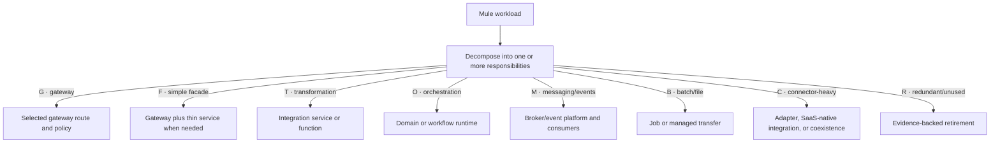
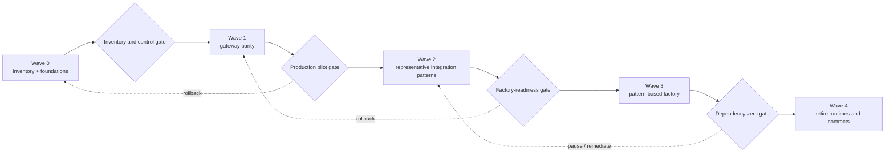

# MuleSoft migration strategy

## Classify before migrating

- **G:** gateway-only/configuration dominant → selected gateway.
- **F:** facade plus simple mapping → gateway plus thin service if needed.
- **T:** complex transformation → AKS integration service/function.
- **O:** orchestration/workflow → domain/integration/workflow runtime.
- **M:** messaging/event → approved broker/event platform and consumers.
- **B:** batch/file/SFTP → job or managed transfer capability.
- **C:** connector-heavy → approved adapter, SaaS-native connector, or temporary coexistence.
- **R:** redundant/unused → retire after evidence and owner approval.

One Mule flow may contain several of these responsibilities. Decompose it into one or more rows before assigning target capabilities; do not force the entire flow into one primary class.

<!-- diagram-alias-source: ../architecture/diagrams/mule-decomposition.mmd -->

## Reversible migration waves

Wave 0 builds inventory and platform foundations. Wave 1 proves low-risk gateway parity. Wave 2 migrates representative integration patterns. Wave 3 scales a factory by pattern. Wave 4 retires shared Mule dependencies and contracts. Each wave has rollback, reconciliation, consumer communication, and decommission criteria.

