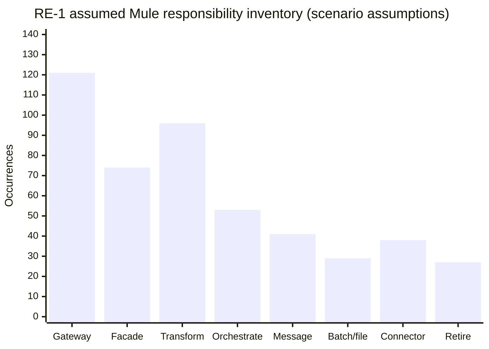
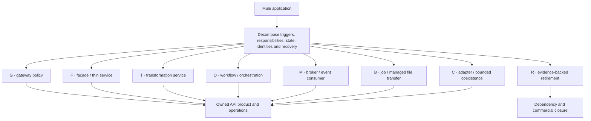
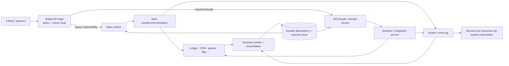
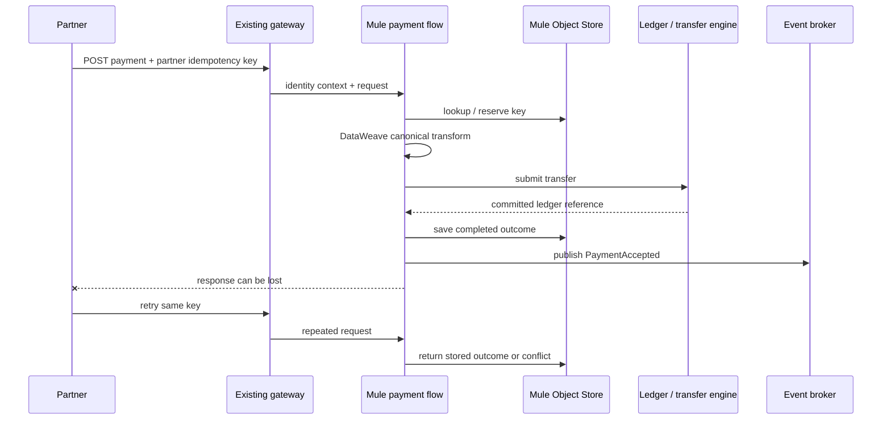
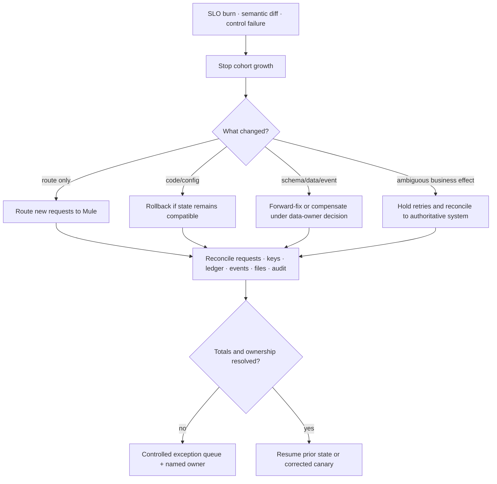
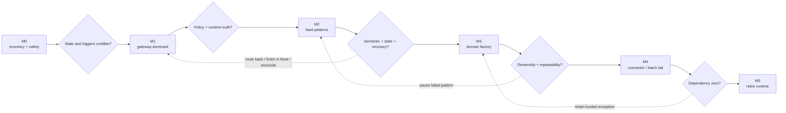

<!-- study-contract: principal -->

# Mule migration strategy: decompose behavior, state, and operations

| Field | Value |
|---|---|
| Artifact type | architecture-study |
| Decision question | Can RE-1 remove Mule runtime dependency without losing transformation, state, delivery, recovery, or operational semantics? |
| Decision owner | Integration-modernization sponsor with domain service owners and the platform design authority |
| Primary audiences | Executives, integration and platform directors, architects, developers, DevOps, SRE, security, data, operations, sourcing, and FinOps |
| Scope | RE-1 Mule applications/flows; gateway, facade, transformation, orchestration, messaging, batch/file, connector and retirement responsibilities; mixed Mule/PCF/AKS coexistence and decommission |
| Evidence state | Architecture interpretation and scenario assumptions with documented Mule mechanisms; workload fitness remains a hypothesis pending state-aware pilots |
| Reference case | RE-1, a synthetic regulated-enterprise case |
| As-of date | 2026-08-17; factual source-review metadata, not a scenario assumption |
| Next gate | Critical Mule-pattern pilot review for MULE-PAY-12 and settlement state migration before factory scale |

## Provisional answer

RE-1 should not replace Mule with one new generic runtime or move integration behavior into gateway plugins. The provisional answer is to **decompose each application into owned responsibilities, externalize durable business state, prove semantic equivalence, and migrate by reversible patterns**. Confidence is high that application-level lift-and-shift preserves the wrong boundary and moderate that the proposed pattern set covers the estate; confidence in workload disposition, effort, and savings is low until runtime state and critical pilots are observed. A false positive could duplicate payments/files, reset watermarks, lose in-flight work, or retain the final shared dependency and license cost.

The consequential question is:

How can RE-1 remove Mule runtime dependency without copying integration logic into gateway plugins, losing hidden Object Store or queue state, changing business semantics, or declaring victory while schedules, files, connectors, licenses, and recovery procedures still depend on Mule?

This study applies the synthetic [RE-1 enterprise reference case](41-enterprise-reference-case.md), especially J-01 money transfer, J-03 partner payment initiation, J-05 settlement files, and incident classes I-01, I-02, I-03, I-05, I-07, and I-08.

> **Quantitative convention:** every flow count, percentage, duration, threshold, team size, wave size, service objective, and monetary value in this article is a **RE-1 scenario assumption**. None is inventory evidence, a benchmark, a vendor claim, or a delivery commitment. Classification, workload, and gate IDs are identifiers rather than quantities.

## Migration thesis

A Mule application is a packaging boundary, not necessarily a business or target-architecture boundary. One application may contain HTTP policy, DataWeave transformation, orchestration, queueing, polling, reconciliation, file transfer, connectors, schedules, Object Store state, and operational alerts. Migrating that package to one replacement runtime simply recreates the monolith.

The safe unit is a responsibility with explicit inputs, outputs, state, delivery semantics, identity, failure behavior, owner, and recovery rule.

## Scenario and assumptions: RE-1 Mule inventory

**All values below are scenario assumptions.** Occurrences exceed application count because a flow may contain several responsibilities.

| Inventory dimension | Assumed scope | What must be discovered beyond source code |
|---|---:|---|
| Mule applications | 63 | deployment target, runtime/agent version, cluster mode, worker sizing, shared domain |
| flows and subflows | 418 | triggers, call graph, error handlers, retry scopes, dynamic endpoints |
| HTTP/API operations | 286 | actual consumers, policy location, undocumented headers and errors |
| DataWeave modules | 131 | semantic vectors, locale/timezone, decimal/null handling, lookup data |
| connector configurations | 74 | credentials, TLS, allowlists, protocol options, vendor limits, support owner |
| Object Store namespaces | 46 | key semantics, TTL, durability, cluster scope, active records |
| VM/JMS/broker queues | 38 | persistence, order, redelivery, poison message, replay, in-flight state |
| schedules and pollers | 29 | timezone, overlap, leader/lock, missed-run and catch-up behavior |
| SFTP/file endpoints | 17 | naming, atomic pickup, archive, checksum, lock, partial file, retention |
| high-consequence workloads | 14 | money movement, settlement, customer identity, partner access |

**Chart MULE-1 — Stateful transformation, orchestration, messaging, file and connector work makes gateway-only proof unrepresentative.**

- **Depicted scope:** assumed occurrences of gateway, facade, transform, orchestration, message, batch/file, connector and retirement responsibility classes.
- **Excluded scope:** application/flow counts, overlap among classes, complexity, current utilization, migration effort, target runtime and cost.
- **Chart source, evidence state and as-of:** synthetic RE-1 Mule responsibility assumptions associated with the inventory table; planning model, not observed Mule inventory or benchmark; 2026-08-17.
- **Accessible equivalent:** Gateway 121; Facade 74; Transform 96; Orchestrate 53; Message 41; Batch/file 29; Connector 38; Retire 27 occurrences. Occurrences overlap within applications; the preceding table provides related inventory dimensions.

**Chart interpretation:** Transformation, orchestration, stateful messaging/file, and connector work coexist with gateway concerns, so a route-policy pilot cannot represent the assumed Mule estate. Occurrences and counts are scenario assumptions rather than observed inventory.

**Chart limitation:** Occurrence counts do not reveal call graphs, state, criticality, shared runtime dependencies or migration points. Repository/runtime discovery and owner reconciliation must replace the scenario values.

## Mechanism analysis: decompose before selecting a target

| Class | Responsibility | Default target | Evidence needed | Common error |
|---|---|---|---|---|
| G | authentication, throttling, request limits, routing, cross-cutting headers | selected gateway policy | policy semantics, config attestation, latency, failure mode | embedding business workflow in custom policy/plugin |
| F | simple facade or canonical mapping | gateway plus thin service when transformation is non-trivial | semantic corpus, latency, ownership | declaring a lossy transform “simple” |
| T | complex transformation and validation | integration service/function with versioned tests | DataWeave boundary vectors and reference outputs | line-by-line rewrite without semantic specification |
| O | orchestration, compensation, long-running state | domain/integration workflow runtime | state machine, timeout, compensation, resume and operator controls | synchronous call chain with retries replacing durable workflow |
| M | messaging, event, queue and replay | approved broker/event platform and consumers | delivery, order, retry, DLQ, replay, idempotency | assuming “at least once” means duplicate-safe |
| B | batch, schedule, file, SFTP | managed transfer or scheduled job | cut-off, lock, journal, replay, partial-file rules | running both schedulers during coexistence |
| C | connector-heavy adapter | bounded adapter or SaaS-native capability | protocol, vendor behavior, credential and support model | hiding a new vendor-specific adapter inside gateway |
| R | redundant, unused, or superseded | retire after owner and dependency proof | traffic, schedule, state, recovery, consumer and cost evidence | equating absent recent HTTP traffic with unused |

**Figure MULE-2 — A Mule application is decomposed by responsibility before destinations are reunited under an owned product.**

- **Depicted scope:** discovery of triggers, responsibilities, state, identity and recovery; classification into gateway/facade/transform/workflow/messaging/batch/adapter/retire destinations; product ownership and dependency/commercial closure.
- **Excluded scope:** automated code conversion, one-service-per-box prescription, exact target products, sequencing, staffing, cost and evidence that any responsibility has been separated successfully.
- **Diagram source, evidence state and as-of:** inline decomposition-method synthesis from synthetic RE-1 and the class table in this study; architecture/migration hypothesis with no observed estate classification; 2026-08-17.
- **Accessible equivalent:** each Mule application is first decomposed, then each responsibility maps to class G, F, T, O, M, B, C or R. Active responsibilities converge under an accountable API product and operating model; retirement requires separate dependency and commercial closure.

**Figure interpretation:** The target is chosen per responsibility and then reunited under an owned API product and operating model; application packaging does not dictate destination. The figure is a classification decision, not evidence that every responsibility must become a separate service.

**Figure limitation:** The classification cannot prove separability or preserve hidden transactional, state and operational coupling by itself. Runtime evidence, semantic corpora and responsibility owners decide the actual cutover unit.

## Discovery dossier per workload

| Layer | Required questions | High-risk RE-1 example |
|---|---|---|
| Trigger | HTTP, scheduler, JMS, VM queue, file, SFTP, database poll, webhook? Can more than one instance consume? | settlement SFTP poller relies on cluster lock |
| Contract | request/response/event/file schema, headers, errors, encoding, ordering, timing? | unknown enum becomes a default payment type |
| Transformation | date/time, locale, decimal, null, character, lookup, encryption, compression behavior? | decimal rounding differs at transfer fee boundary |
| State | Object Store, variables across queues, cache, watermark, idempotency key, batch journal? | Object Store records processed partner message IDs |
| Delivery | transaction boundary, redelivery, DLQ, retry, poison message, compensation? | ledger commits before HTTP response is lost |
| Identity | inbound client, end-user context, backend credential, mTLS, certificate chain, key store? | shared Mule credential hides originating partner |
| Dependency | endpoints, DNS, fixed IP, timeout, connection pool, vendor quota, maintenance? | CRM connector applies a lower rate limit than API edge |
| Operations | dashboards, alerts, manual replay, pause/resume, audit, support handoff? | operator restarts flow to clear stuck Object Store lock |
| Recovery | restart, cluster failover, region recovery, backup/restore, in-flight reconciliation? | VM queue persistence differs after full cluster shutdown |
| Commercial | license/core/worker allocation, support, connector entitlement, contract end? | last shared runtime prevents license reduction |

MuleSoft’s official HA documentation explains that customer-hosted clusters can share Object Store and VM queue state and that behavior depends on topology and persistence choices ([Mule runtime HA clusters](https://docs.mulesoft.com/mule-runtime/latest/mule-high-availability-ha-clusters)). Therefore RE-1 inventories actual state and topology rather than assuming a stateless flow because its source has no database.

## Target coexistence architecture

**Figure MULE-3 — A stable edge permits bounded Mule coexistence while durable outcome and reconciliation state span old and new runtimes.**

- **Depicted scope:** clients/partners, stable edge policy and cohort routing, legacy Mule and migrated AKS facade/workflow paths, authoritative systems, broker/consumers, domain idempotency state and independent reconciliation.
- **Excluded scope:** exact gateway/integration products, region topology, writer election, data replication, identity/PKI, deployment mechanism, support and coexistence duration.
- **Diagram source, evidence state and as-of:** inline target-coexistence synthesis from RE-1 J-01/J-03/J-05 and this study's responsibility model; architecture hypothesis with no observed migration result; 2026-08-17.
- **Accessible equivalent:** the stable edge routes a bounded cohort either to Mule or to an AKS facade and workflow/integration service. Both paths reach authoritative systems and brokered events, while domain-owned idempotency/outcome state and a business verifier reconcile old and new processing. Explicit consumer subscriptions prevent accidental dual ownership.

**Figure interpretation:** A stable edge separates policy/routing from migrated facade and workflow responsibilities while durable outcome state and the verifier span old and new runtimes. The figure permits bounded coexistence but rejects cyclic synchronous dependencies and shared ownership ambiguity.

**Figure limitation:** The logical topology neither proves safe shared-state access nor defines writer authority, deduplication, sequencing or rollback. Those boundaries must be fixed per migrated journey, and cyclic dependencies remain a non-fit condition.

Mixed Mule, PCF, and AKS coexistence is permitted when it has an owner, route/state boundary, expiry, and decommission condition. The architecture forbids cyclic orchestration where Mule calls AKS, AKS calls PCF, and PCF calls back through Mule on the same synchronous journey.

## Worked case: partner payment initiation

The synthetic workload **MULE-PAY-12** implements J-03. It validates partner mTLS/OAuth context, maps a partner schema to a canonical payment, checks an idempotency key in Object Store, invokes the transfer engine, records status, publishes an event, and returns a partner-specific response. A response can be lost after ledger commitment.

### Existing behavior

**Figure MULE-4 — A lost partner-payment response exposes the incumbent idempotency, transform, ledger and event responsibilities that migration must preserve.**

- **Depicted scope:** partner request through gateway and Mule flow, Object Store reservation/outcome, DataWeave transform, ledger commitment, event publication, lost response and same-key retry.
- **Excluded scope:** observed Mule topology/configuration, Object Store persistence and concurrency semantics, event outbox atomicity, regional behavior, certificate/token detail and target-state implementation.
- **Diagram source, evidence state and as-of:** inline synthetic MULE-PAY-12 sequence derived from RE-1 J-03/I-01 and the incumbent-behavior hypothesis; no runtime observation or parity result; 2026-08-17.
- **Accessible equivalent:** a partner sends a keyed payment through the gateway to Mule. Mule reserves the key, transforms the request, commits to the ledger, stores the outcome and publishes an event; the response is lost. A retry with the same key returns the stored outcome or a conflict rather than submitting another transfer.

**Figure interpretation:** The ambiguous response after ledger commitment shows why idempotency outcome state and reconciliation are business responsibilities, not a gateway retry setting. The sequence abstracts the actual Mule topology and must be confirmed from runtime observation.

**Figure limitation:** The sequence is a discovery hypothesis and does not prove that Object Store reservation is atomic, durable or coupled to ledger/event effects. Actual flow code, cluster topology, failure injection and ledger reconciliation must establish the incumbent semantics.

### Target responsibility split

| Responsibility | Target owner | Cutover unit | Non-negotiable behavior |
|---|---|---|---|
| partner TLS, OAuth, entitlement, quota | gateway/platform | partner cohort | no shared identity that destroys partner attribution |
| partner-to-canonical transform | versioned integration service/domain | partner contract version | byte/semantic corpus plus explicit unknown-value behavior |
| business idempotency and outcome query | transfer domain | idempotency key partition | durable across region and route rollback; same key/different digest conflicts |
| ledger submission | transfer domain service | single writer per key | no automatic retry after ambiguous commit |
| event publication | transactional outbox and relay | outbox record/version | event ID, schema, ordering partition, replay and consumer dedupe |
| partner response mapping | thin integration service | partner contract version | preserves error, retry-after, reference and status-query semantics |
| reconciliation | money-movement operations | generator/request/ledger/outbox totals | every accepted request reaches one resolved outcome |

HTTP’s idempotence semantics and retry warning are defined in [RFC 9110](https://www.rfc-editor.org/rfc/rfc9110.html). Mule’s Idempotent Message Validator can reject duplicate IDs using an Object Store ([MuleSoft Idempotent Message Validator](https://docs.mulesoft.com/mule-runtime/latest/idempotent-message-validator)), but migrating the component requires the team to preserve key derivation, TTL, persistence, scope, concurrent reservation, completed outcome, and conflict behavior—not only the presence of a duplicate filter.

### Cutover sequence

**All cohort sizes and observation windows are scenario assumptions.**

| Step | Action | Verification | Rollback/reconciliation |
|---|---|---|---|
| P0 freeze and characterize | record canonical inputs/outputs, Object Store key behavior, ledger/event invariants, partner certificates | replay boundary corpus and ambiguous-outcome cases | no production change |
| P1 externalize state | introduce durable target idempotency/outcome store with Mule-compatible adapter | dual-read comparison; one authoritative writer | revert adapter; reconcile key counts and states |
| P2 dark target | run transformation and policy checks without ledger writes | semantic diff, identity, latency and resource profile | remove dark route |
| P3 shadow safe calls | mirror read/status requests; do not shadow transfer writes | status and error parity | stop mirror |
| P4 canary one partner | assumed 1 partner and 1% eligible traffic uses target single-writer route | request/ledger/outbox/outcome totals; partner handshake and SLO | route partner back; reconcile in-progress keys |
| P5 progressive cohorts | assumed 5/25/50/100% eligible traffic with holds | error budget, duplicate/conflict rate, broker lag, capacity, telemetry | cohort rollback; no blind replay |
| P6 target authoritative | target handles new requests; Mule status compatibility retained for 60 days | no new Mule keys/events; regional exercise | route rollback only while state compatibility is proven |
| P7 close | remove Mule flow, Object Store namespace, credentials, queues, monitors and allocated license | dependency and cost ledger closed | retain bounded adapter if any historical status remains |

## Transformation parity is semantic, not syntactic

DataWeave can encode years of undocumented decisions. A rewrite is accepted only against a versioned semantic corpus.

| Test family | Required cases | Failure that a happy-path sample misses |
|---|---|---|
| numeric | scale, rounding mode, negative zero, large values, absent amount | one-cent mismatch and rejected ledger batch |
| time | UTC, offsets, daylight-saving boundary, leap day, missing zone | settlement assigned to wrong business date |
| null/presence | missing, explicit null, empty string, empty array/object | PATCH clears a value rather than leaving unchanged |
| enumeration | known, unknown, deprecated, case variation | unknown payment type silently mapped to default |
| text | Unicode normalization, combining characters, non-Latin names, control characters | duplicate customer matching or signature mismatch |
| order/duplicate | repeated event, out-of-order version, retry after timeout | stale profile overwrites newer value |
| error | dependency timeout, validation set, partial connector response | target returns generic success/error and destroys retry semantics |

The [OpenAPI Specification](https://spec.openapis.org/oas/latest.html) provides a standard interface-description mechanism, but OpenAPI validity alone cannot prove these business semantics.

## State and message migration

### Object Store

For each namespace, classify records as cache, lock, watermark, idempotency reservation, durable outcome, workflow checkpoint, or business data. Export/import is not automatically safe: TTL origin, serialization, encryption, concurrent writes, and cluster scope matter.

| State class | Migration treatment | Unsafe shortcut |
|---|---|---|
| cache | warm target from source of truth or accept explicit cold behavior | bulk-copy stale values without generation |
| lock/leader | stop old owner before starting new; use fencing token | run two pollers because both appear healthy |
| watermark | capture source position, quiesce, transfer, resume, reconcile range | reset to “now” and lose records |
| idempotency reservation | preserve atomic reserve and request digest | copy only completed keys and replay in-progress requests |
| durable outcome | migrate key, outcome, ledger reference, status and retention | retain a boolean “seen” flag with no response/status |
| workflow checkpoint | prefer finish-in-place or explicit state converter | deserialize runtime-specific state in new engine without proof |

### Queues and events

The plan records whether delivery is at-most-once, at-least-once, or transactionally coupled; ordering key; redelivery delay; maximum attempt; poison-message behavior; DLQ owner; replay authorization; schema version; and retention. A target consumer begins at an explicit offset or message boundary. Old and new consumers do not compete unintentionally for the same work.

### Files and SFTP

A file is accepted only after stable-size/atomic-rename or manifest/checksum rules pass. The journal records file identity, checksum, source, arrival, claimed owner, record totals, processing status, archive, and replay lineage. During migration, exactly one poller owns a directory or a fencing token prevents duplicate pickup.

## Failure modes and reliability semantics during coexistence

MuleSoft documents that clustered runtimes can share state and that persistence behavior varies by capability and topology ([Mule runtime HA clusters](https://docs.mulesoft.com/mule-runtime/latest/mule-high-availability-ha-clusters)). The target must be tested against the old semantics rather than labelled “HA” by analogy.

**All guardrails are scenario assumptions.**

| Failure | Test | Assumed safe outcome |
|---|---|---|
| Mule node fails with in-flight queue work | terminate active node after dequeue and before commit | work is completed once or redelivered and deduplicated; no silent loss |
| control plane unavailable | disconnect gateway management path while Mule/AKS data paths run | existing accepted config continues; restarted stale replica is quarantined |
| idempotency store partition | isolate one region/replica from durable key store | J-01/J-03 fail closed or status-only; no unprotected write |
| certificate rollover | serve old/new chain to mixed partners and reused connections | overlap works; actual served chain and partner result are observed |
| telemetry exporter stalls | fill collector/export queues under business load | request latency protected; audit priority preserved; data gap declared |
| schema producer advances | send optional, unknown enum, then semantic change | compatible input handled; semantic break blocked or quarantined |
| target region promoted | lose primary with ambiguous transfers and broker lag | writer authority proven before writes; outcomes reconciled after recovery |

OpenTelemetry Collector queue and failure metrics provide a mechanism for detecting export backpressure ([Collector internal telemetry](https://opentelemetry.io/docs/collector/internal-telemetry/)). They do not eliminate the need for bounded queues and a separate durability policy for audit.

## Rollback and reconciliation

**Figure MULE-5 — Migration recovery classifies the changed state before choosing route rollback, code rollback, forward-fix or reconciliation.**

- **Depicted scope:** stop-cohort action, change classification, route/code/config/schema/data/event/ambiguous-effect responses, cross-system reconciliation, exception ownership and safe resume.
- **Excluded scope:** exact rollback commands, schema/data compensation design, approval authority, timing, customer communications and evidence that any rollback path is executable.
- **Diagram source, evidence state and as-of:** inline recovery synthesis from RE-1 I-01/I-07/I-08 and the adjacent rollback matrix; decision model with no observed rollback result; 2026-08-17.
- **Accessible equivalent:** an SLO burn, semantic difference or control failure first stops cohort growth. Route-only change routes new requests back; compatible code/config can roll back; schema/data/event change requires data-owner forward-fix or compensation; ambiguous effects hold retries and reconcile. All paths reconcile requests, keys, ledger, events, files and audit before either a named exception or safe resume.

**Figure interpretation:** Rollback first contains new exposure, then chooses route, code/config, forward-fix/compensation, or reconciliation based on what changed. It explicitly rejects treating deployment rollback as reversal of committed business effects.

**Figure limitation:** This decision tree cannot make irreversible effects reversible or substitute for a tested per-workload runbook. Compatibility windows, data authority, compensation and acceptable unresolved exceptions remain organization decisions.

| Layer | Rollback action | Reconciliation key |
|---|---|---|
| API route | set target weight to zero; drain bounded in-flight requests | request ID, partner ID, idempotency key, route cohort |
| transform | restore version only if downstream schema accepts it | canonical-input hash and semantic-output hash |
| idempotency state | never overwrite newer completed outcome | business key, request digest, status, ledger reference |
| workflow | pause new starts; finish old engine or convert proven checkpoints | workflow instance and business reference |
| broker | pause consumer/producer; retain offsets and quarantine | topic, partition, offset, event ID, aggregate version |
| file | stop poller; preserve source/archive/journal | source ID, name, checksum, record count |
| ledger/external system | compensate or correct; do not “restore” blindly | authoritative reference and business approval |
| audit | declare gaps and reconstruct only from approved sources | audit sequence, request/business ID, config digest |

## Migration waves

**All scopes and durations are scenario assumptions.**

| Wave | Assumed scope | Hard pattern intentionally included | Entry gate | Exit gate |
|---|---:|---|---|---|
| M0 inventory and safety | all 63 apps; deep dossier for 14 critical workloads | Object Store, queue, scheduler, file, connector and recovery discovery | accountable owners and runtime access | observed traffic/state/schedule reconcile to inventory |
| M1 gateway-dominant | 9 apps | custom policy, certificate, stale-config recovery | selected gateway pattern and active digest | policy parity, performance, disconnect/restart and rollback |
| M2 representative integrations | 8 apps | MULE-PAY-12, transform, orchestration, event, SFTP | durable idempotency/reconciliation and target runtime | semantic, failure, state, partner and operator acceptance |
| M3 domain factory | 24 apps | repeated accepted patterns | funded domain owners and automation | ownership transferred; no pattern-specific critical gap |
| M4 connector and batch tail | 15 apps | vendor connector, month-end, file replay | replacement/retain decision and commercial plan | bounded exception or dependency removal |
| M5 retire shared runtime | 7 apps plus shared domains/state | historical status, DR, recovery and license closure | new traffic zero and archives proven | zero runtime, state, credential, support and commercial dependency |

**Figure MULE-6 — Mule factory progression waits for state, runtime, semantic, ownership and dependency gates.**

- **Depicted scope:** inventory/safety, gateway-dominant, hard-pattern, domain-factory, connector/batch-tail and retirement waves; gates and recycle paths for state/triggers, runtime truth, semantic/recovery, ownership/repeatability and dependency zero.
- **Excluded scope:** calendar schedule, throughput, staffing, actual application assignments, commercial approvals, detailed per-pattern controls and evidence that any gate has passed.
- **Diagram source, evidence state and as-of:** inline roadmap synthesis from the preceding RE-1 Mule wave table; scenario planning model, not programme status or forecast; 2026-08-17.
- **Accessible equivalent:** M0 establishes credible state and triggers before M1 gateway work; runtime truth unlocks M2 hard patterns; semantic/state/recovery proof unlocks M3 factory work; ownership/repeatability unlocks M4 connector/batch tail; dependency zero unlocks M5 retirement. Failed gates route back, pause the pattern or retain a funded exception.

**Figure interpretation:** Factory progression waits for state/trigger inventory, runtime truth, hard-pattern recovery, ownership transfer, and dependency zero. The wave scopes are scenario assumptions, not throughput or schedule evidence.

**Figure limitation:** The graph shows decision dependencies, not a duration or claim that every responsibility follows one route. Hidden state, partner/vendor lead times, domain capacity and contract obligations determine actual wave composition and elapsed time.

## Capacity and economic assumptions

Migration economics include dual running, target integration compute, brokers, durable state, telemetry, specialist engineering, partner coordination, and decommission. A lower gateway license does not offset an expensive new integration estate if responsibilities were merely displaced.

**Every value below is a scenario assumption.**

| Driver | RE-1 assumption | Sensitivity |
|---|---:|---|
| current Mule annual run cost allocation | $4.6 million | license metric, runtime cores/workers, support, infrastructure, operations |
| target gateway/integration incremental annual cost | $2.8 million | traffic growth, state/broker, telemetry, dual region, support |
| migration delivery allocation | $6.3 million over 30 months | discovery depth, pattern reuse, partner lead time, domain capacity |
| dual-run overlap | 12 months portfolio-wide, variable by workload | license renewal and rollback horizon |
| retained-exception guardrail | ≤ 8 workloads after factory wave | connector support, regulatory records, unsupported target behavior |
| targeted annual run-cost removal | $1.8 million after dependency zero | delayed license/infrastructure/support closure |

The economic gate uses cost per successful business outcome and realized retired cost. It does not count “applications redeployed” as benefit.

## Decommission ledger

Mule is not decommissioned until all of these are zero, transferred, archived, or formally retained:

- HTTP and internal route traffic, direct consumers, partner endpoints, and recovery routes;
- schedules, pollers, batch jobs, SFTP folders, file locks, archives, and cutoff procedures;
- Object Store keys, VM/JMS queues, broker subscriptions, DLQs, watermarks, and in-flight workflows;
- shared domains, libraries, DataWeave modules, connector configurations, lookup files, and dynamic properties;
- credentials, certificates, trust stores, keystores, allowlists, fixed egress IPs, and privileged accounts;
- dashboards, alerts, audit feeds, replay tools, runbooks, support queues, CMDB and records-retention obligations;
- deployment pipelines, artifact repositories, runtime/agent versions, backup/restore and DR procedures;
- license, infrastructure, vendor support, specialist support, and renewal commitments.

MuleSoft notes that deployment options and HA/state behavior differ across customer-hosted, CloudHub, and Runtime Fabric models ([deployment options](https://docs.mulesoft.com/runtime-manager/deployment-strategies)). The closure ledger is therefore tied to the actual RE-1 deployment model.

## Decision gates

| Gate | Pass | Hold |
|---|---|---|
| M-G0 inventory | flows, triggers, state, identity, consumers, operations and cost reconcile to runtime observation | source scan is the only inventory |
| M-G1 pattern | target responsibility has semantic, performance, failure, state and ownership proof | a Mule component was copied without preserving behavior |
| M-G2 critical pilot | ambiguous outcomes, regional recovery, certificate, telemetry and schema drift pass | happy path passes but reconciliation cannot close totals |
| M-G3 factory | domain ownership and automation repeat accepted patterns | migration factory becomes permanent owner or exceptions accumulate |
| M-G4 dependency zero | all technical, operational, recovery and commercial dependencies close | last shared state, schedule, connector, credential or license remains |

## Counter-hypotheses and non-fit conditions

Some Mule applications may be sufficiently gateway-dominant or stateless for a simple configuration migration, and a supported managed integration service may safely retain several responsibilities together. Retaining Mule can also be rational for a bounded connector or record-retention constraint. The provisional answer is falsified if an application-level replacement repeatedly preserves the same semantics, state, failure recovery, operations, support, and cost with less risk. Migration is non-fit where a target cannot preserve protocol/connector behavior, durable outcome state, ordering, file ownership, or required support—or where the receiving domain cannot own the service.

## Decision implications

- Fund runtime observation and state/trigger discovery before committing an application-count migration schedule.
- Make MULE-PAY-12 and one queue/file workload mandatory representative pilots before pattern-factory approval.
- Place gateway, transformation, workflow, messaging, file, connector, idempotency, and reconciliation responsibilities in deliberately owned targets.
- Treat route rollback, state compatibility, message/file reconciliation, and irreversible business effects as separate decisions.
- Measure realized shared-runtime/license closure and transferred service ownership, not flows converted.

Executable experiments are defined in [real-world PoC scenarios](../poc/real-world-scenarios.md).

## Official mechanism references

These sources support general mechanisms only; they do not validate RE-1 assumptions or migration outcomes:

- [MuleSoft: Mule Runtime HA clusters](https://docs.mulesoft.com/mule-runtime/latest/mule-high-availability-ha-clusters)
- [MuleSoft: Idempotent Message Validator](https://docs.mulesoft.com/mule-runtime/latest/idempotent-message-validator)
- [MuleSoft: Deployment options](https://docs.mulesoft.com/runtime-manager/deployment-strategies)
- [MuleSoft: High availability and disaster recovery](https://docs.mulesoft.com/mule-runtime/latest/hadr-guide)
- [RFC 9110: HTTP Semantics](https://www.rfc-editor.org/rfc/rfc9110.html)
- [OpenAPI Specification](https://spec.openapis.org/oas/latest.html)
- [OpenTelemetry Collector internal telemetry](https://opentelemetry.io/docs/collector/internal-telemetry/)
- [Microsoft: Multi-region AKS deployment models](https://learn.microsoft.com/en-us/azure/aks/reliability-multi-region-deployment-models)

## Falsification and proof plan

All thresholds and cohorts in this table are RE-1 scenario assumptions.

| Proof ID | Procedure | Measure | Scenario threshold | Evidence artifact | Independent reviewer |
|---|---|---|---|---|---|
| MULE-P1 | observe/decompose MULE-PAY-12, externalize outcome state, run semantic corpus, then canary partner cohorts | semantic differences, keys/outcomes, ledger/events, errors, latency | zero unexplained critical-field or duplicate/ambiguous-outcome gap | runtime/config export, corpus, idempotency/ledger/event and raw telemetry bundle | money-movement/data reviewer outside migration team |
| MULE-P2 | quiesce/fence a settlement poller, transfer watermark/idempotency/journal state, inject failure, replay exceptions and roll ownership back | files/records, claims, watermarks, offsets, duplicates and exceptions | accepted-record RPO zero and full assumed two-hour recovery reconciliation | file manifests/checksums, state extracts, broker offsets and operator log | settlement owner and internal assurance |
| MULE-P3 | partition state/control dependencies, roll certificates and fail telemetry during mixed Mule/AKS load | request/business SLO, served chain, queue/drop, config/state truth | declared critical thresholds hold with no unprotected write | fault schedule, per-runtime config/state and reconciliation record | platform SRE/security reviewer |
| MULE-P4 | close one migrated application through dependency and cost ledger | residual route/state/schedule/identity/support/license dependency | zero unowned dependency and assumed cost removal realized | decommission approvals, archive, contract and finance record | sourcing/FinOps reviewer |

## Risks and limitations

- Flow, state, connector, schedule, wave, cost, and benefit values are scenario assumptions; source scans and interviews may miss dynamic runtime behavior.
- Mule behavior differs by deployment option, runtime/agent version, cluster/topology, connector, Object Store and queue configuration, and license/support entitlement.
- Semantic corpora can miss undocumented consumer behavior; production pilots and monitored compatibility horizons remain necessary.
- Externalizing state can itself change latency, consistency, availability, data residency, and cost.
- Decomposition can create excessive distributed coupling if responsibilities lack cohesive ownership; this study does not require one service per class.

## Open evidence requests

| Request | Owner role | Due gate | Decision impact if unresolved |
|---|---|---|---|
| observed Mule deployment topology, versions, flows, triggers, Object Store/queue state and active schedules | Mule platform and application owners | M-G0 | do not set workload classification or waves |
| MULE-PAY-12 key/TTL/outcome, transform, ledger, event and partner contract | Money-movement and integration owners | MULE-P1 design freeze | stop critical pilot and gateway retry changes |
| settlement file claim, journal, watermark, poison/replay and cutoff rules | Settlement operations/data owners | MULE-P2 design freeze | do not move poller ownership |
| license/support allocation, dual-run and final shared-dependency economics | Sourcing and FinOps | M-G3 | prohibit savings claim and decommission forecast |

## Next gate

At the critical Mule-pattern pilot review, the sponsor may authorize factory scale only if MULE-P1 and MULE-P2 close business/state reconciliation, MULE-P3 proves mixed-runtime failure behavior, receiving domains accept service/on-call ownership, and MULE-P4 demonstrates that technical migration can remove an actual shared cost. Otherwise the failed class remains a bounded exception with an owner, funded treatment, expiry, and retest.
